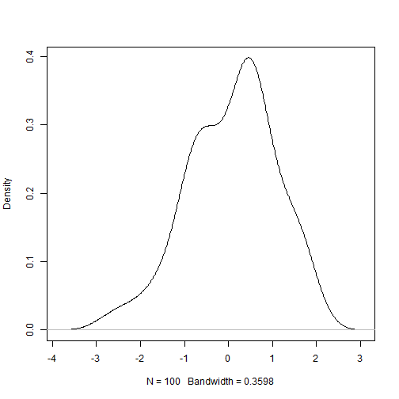
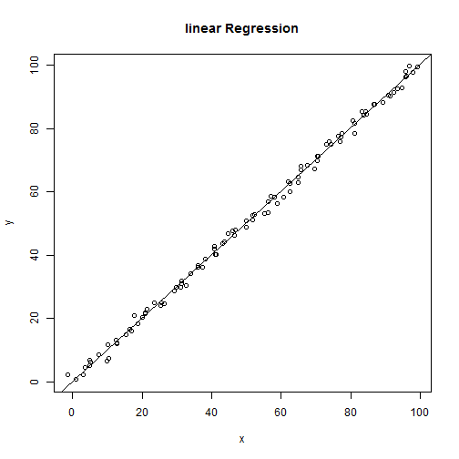
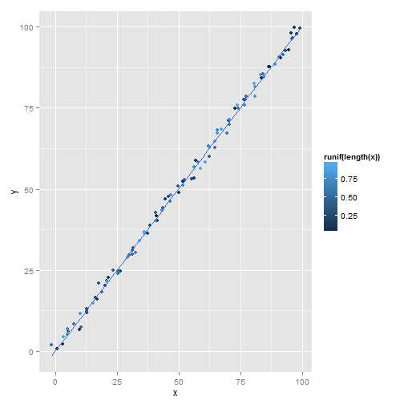

R语言介绍
========================================================
author: 沈国春
date: Thu Feb 27 21:24:55 2014

什么是R
========================================================

R是一门专门用于统计分析的语言；

能理解R语言的软件就是R软件。


为什么要学习R？
========================================================

R代表着一种统计分析的自由。

- c/c++等基础语言：自行车
- SPSS等语言：公交车
- R语言： 小轿车

R语言的理念
========================================================

人的时间最宝贵!

所以一定程度上牺牲了命令执行的速度来换取方便.


下载与安装R软件
=======================================================

 http://www.r-project.org/


如何学习R
========================================================

练习，练习，再练习!

R语言很简单
========================================================

加减法

```r
1+5
```

```
[1] 6
```

```r
4-2
```

```
[1] 2
```


R语言很简单
========================================================

乘除法

```r
3*4
```

```
[1] 12
```

```r
5/3
```

```
[1] 1.667
```


R语言很简单
========================================================

指数

```r
2^10
```

```
[1] 1024
```

对数

```r
log(10)
```

```
[1] 2.303
```


寻求帮助
=====================================================


```r
?log
??lo
```


R对统计分析的支持
=========================================================

产生10个标准正态分布的随机数

```r
a=rnorm(10)
a
```

```
 [1] -0.3915  0.2525  0.5311 -0.4532 -0.3173  1.7433 -0.1441 -0.9256
 [9] -1.3848 -0.9676
```


R对统计分析的支持
=========================================================

查看一组数据的分布

```r
plot(density(rnorm(100)),main="")
```

 


R对统计分析的支持
=========================================================

线性回归

```r
x=1:100+rnorm(100)
y=1:100+rnorm(100)
re=lm(y~x)
re
```

```

Call:
lm(formula = y ~ x)

Coefficients:
(Intercept)            x  
   0.000187     1.002178  
```


R对统计分析的支持
=========================================================

查看详细线性回归结果
<small>

```r
summary(re)
```

```

Call:
lm(formula = y ~ x)

Residuals:
   Min     1Q Median     3Q    Max 
-3.438 -0.875  0.194  0.819  3.439 

Coefficients:
            Estimate Std. Error t value Pr(>|t|)    
(Intercept) 0.000187   0.288950       0        1    
x           1.002178   0.004975     201   <2e-16 ***
---
Signif. codes:  0 '***' 0.001 '**' 0.01 '*' 0.05 '.' 0.1 ' ' 1

Residual standard error: 1.44 on 98 degrees of freedom
Multiple R-squared:  0.998,	Adjusted R-squared:  0.998 
F-statistic: 4.06e+04 on 1 and 98 DF,  p-value: <2e-16
```

</small>

R对统计分析的支持
=========================================================

展示线性回归结果

```r
plot(x=x,y=y,main="linear Regression")
abline(re)
```

 


R对统计分析的支持
=========================================================

当然可以画出漂亮的图

```r
library(ggplot2) #加载包
qplot(x=x,y=y,colour=runif(length(x)))+
  stat_smooth(method="lm", se=FALSE)
```

 


R语言包
========================================================

提供除基础Ｒ语言无法直接实现的功能.  

如ggplot2: 提供高级的基于grid的画图功能  
如map: 提供世界各地的地图

默认情况下只有一些基本的Ｒ语言包加载到工作环境中,如果要加载其他特定的包,只需要:

```r
library(ggplot2) #更改为你需要加载的包名
```


我怎么知道我想要的功能在那个包中?
========================================================

到Ｒ语言包的任意一个镜像网站,如http://mirrors.xmu.edu.cn/CRAN/

目前已有5210个包,每个包有什么功能都有介绍

看中某个包后,你可以下载下来安装,或者直接使用下面的命令:

```r
install.packages("ggplot2") #替换成你想要的包名
```


安装加载后就可以使用
