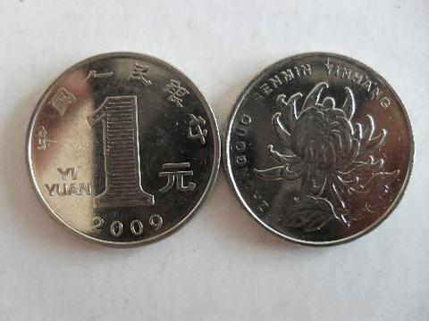
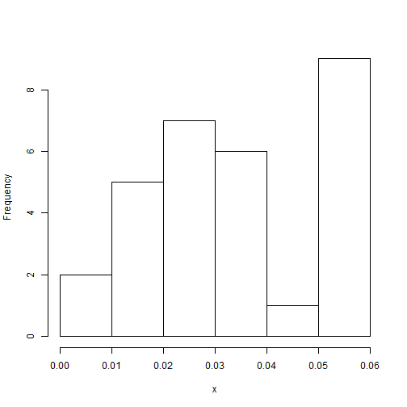
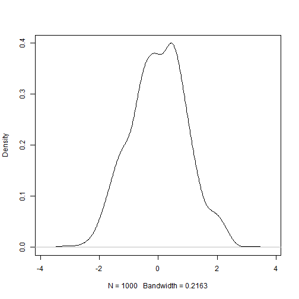

统计基础
========================================================
author: 沈国春
date: Wed Mar 05 09:30:38 2014

统计学
========================================================

是对世界的一种看：

__变化、不确定，但其中又蕴藏规律。__

概率
========================================================


一个事件(Event)

概率
=======================================================



样本空间(sample space)

概率
======================================================

严格的定义：
$$p(A)=lim_{n\to \infty }{\frac{n_A}{n}}$$

条件概率
========================================================

P(A|B):B发生条件下A发生的概率

$P(A|B)=\frac{P(AB)}{P(B)}$

独立事件
=====================================================

$P(AB)=P(A)P(B)$

或者
$P(A|B)=P(A)$

随机变量
===================================================

是一个从概率空间中的事件到实数的函数。常用大写字母表示，如:__X__

$X: \Omega \to R$

离散型随机变量和连续性随机变量
==================================================

_离散型随机变量_  
X可以等于1，2，3 ... ，所以P(X=1)>0

_连续性随机变量_  
X可以等于3.1415926，2.712,....., 所以P(X=1)=0

通常用一个范围表示P(1<X<3)

概率函数/概率分布函数
============================================

用于描述一个随机变量在样本空间中的一种规律。

_离散型随机变量_  
p(a)=P(X=a)

_连续性随机变量_  
p(a<x<b)=P(a<X<b)

概率质量函数
=========================================

概率质量函数(probability mass function, pmf)，通常用于描述离散型随机变量  
p(X=x)

 


概率密度函数
=======================================

概率密度函数(probability density function, pdf)，通常用于描述连续性随机变量  
f(x);   
累计概率函数(Accumulate probability function)，$F(x)=\int_{-\infty}^x f(z) dz$

 


Binomial distribution 
=======================================

一个硬币，抛100次，正面向上30次的概率是多少？50次向上的概率呢？  
$p(x)= {n \choose x} p^x (1-p)^{1-x}$


```r
x=rbinom(1000,size=100,prob=0.5)
plot(density(x))
```

 


Binomial distribution 
=======================================
一个硬币，抛100次，正面向上30次的概率是多少？50次向上的概率呢？    

```r
dbinom(x=30,size=100,prob=0.5)
```

```
[1] 2.317e-05
```

```r
dbinom(x=50,size=100,prob=0.5)
```

```
[1] 0.07959
```


Poisson distribution 
=====================================

$p(x)=\frac{\lambda^x e^{-\lambda}}{x!}$


Uniform distribution
=====================================

$f(x)=\frac{1}{b-a}$ 
a<x<b


Normal distribution 
====================================

$f(x)=\frac{1}{sqrt{2 Pi}\delta}$
