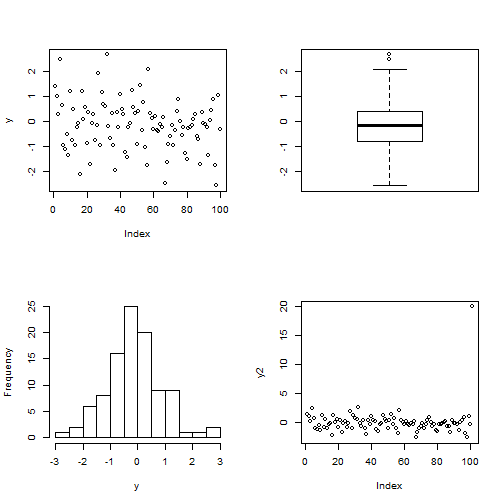
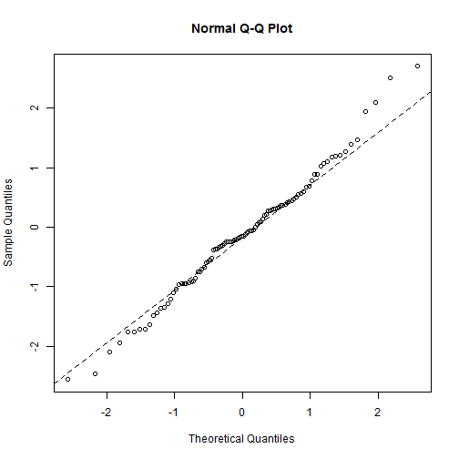

Classical Tests
========================================================
author: Guochun Shen
date: Tue Mar 25 21:48:37 2014

Occam's razor
========================================================

There is absolutely no point in carring out an analysis that is __more complicated than it needs to be__.

Simplest is best.

Single Samples
========================================================

Typical qestions about inference from the data:
- what is the mean value?
- is the mean value significantly different from current expectation or theory?
- what is the level of uncertainty associated with our estimate of the mean value?

Single Samples
=======================================================

In order to be reasonably confident that our inferences are correct, we need to establish some facts about the distribution of the data:
- Are the values normally distributed or not?
- Are there outliers in the data?
- If data were collected over a period of time, is there evidence for serial correlation?

Data summary
========================================================


```r
par(mfrow=c(2,2))
y=rnorm(100)
plot(y)
boxplot(y)
hist(y,main="")
y2=y
y2[101]=20
plot(y2)
```


***

 


Data summary
=============================================


```r
summary(y)
```

```
   Min. 1st Qu.  Median    Mean 3rd Qu.    Max. 
 -2.560  -0.776  -0.149  -0.135   0.416   2.700 
```


```r
qqnorm(y)
qqline(y,lty=2)
```

***

 


Test for normality
=============================================

Shapiro-Wilk Normality Test

```r
shapiro.test(y)
```

```

	Shapiro-Wilk normality test

data:  y
W = 0.9889, p-value = 0.5743
```


***


```r
x=exp(rnorm(30))
shapiro.test(x)
```

```

	Shapiro-Wilk normality test

data:  x
W = 0.8266, p-value = 0.0002088
```


Test the mean against expectation
================================================


```r
x=1+rnorm(100)
```

Does the mean of x significantly different with 0?


Test the mean against expectation
================================================

__Student's t-Test__

```r
t.test(x,mu=0)
```

```

	One Sample t-test

data:  x
t = 10.38, df = 99, p-value < 2.2e-16
alternative hypothesis: true mean is not equal to 0
95 percent confidence interval:
 0.8087 1.1908
sample estimates:
mean of x 
   0.9997 
```


Test the mean against expectation
================================================


```r
y=1+log(rnorm(100))
```

Does the mean of y significantly different with 1?

Test the mean against expectation
================================================

When distribution of the data/error is non-normality:  
__Wilcoxon Signed Rank Test__

```r
wilcox.test(y,mu=1)
```

```

	Wilcoxon signed rank test

data:  y
V = 295, p-value = 0.001244
alternative hypothesis: true location is not equal to 1
```


Two samples
================================================

The classical tests for two samples includes:
- comparing two variances (Fisher's _F_)
- comparing two sample means with normal errors (Student's t test)
- comparing two means with non-normal errors (Wilcoxon's rank test)
- comparing two proportions (the binomial test)
- correlating two variables (Pearson's or Spearman's rank correlation)
- testing for independence of two variables in a contingency table (chi-squared)

Comparing two variances- Fisher's F test
===============================================


```r
x=rnorm(100,mean=1,sd=2)
y=rnorm(89,mean=0,sd=10)
var.test(x,y)
```

```

	F test to compare two variances

data:  x and y
F = 0.0352, num df = 99, denom df = 88, p-value < 2.2e-16
alternative hypothesis: true ratio of variances is not equal to 1
95 percent confidence interval:
 0.02331 0.05278
sample estimates:
ratio of variances 
           0.03516 
```


Comparing two variances-Fligner-Killeen test
==============================================

it is a non-parametric test, insensitive to outliers. 


```r
y=c(x,y)
g=as.factor(rep(c("x","y"),c(100,89)))
fligner.test(y~g)
```

```

	Fligner-Killeen test of homogeneity of variances

data:  y by g
Fligner-Killeen:med chi-squared = 75.4, df = 1, p-value < 2.2e-16
```


Comparing two means
==============================================

There are two classical tests for comparing two sample means:

- Student's test when the samples are independent, the variances constant, and the errors are normally distributed;
- Wilcoxon's rank-sum test when the samples are independent but the errors are not normally distributed.

Comparing two means- Student's t test
==============================================

Student was the pseudonym of W.S. Gossett who published his influential paper in Biometrika in 1908. The
archaic employment laws in place at the time allowed his employer, the Guinness Brewing Company, to
prevent him publishing independent work under his own name.

Student’s t distribution, later perfected by R.A. Fisher, revolutionized the study of small-sample statistics where inferences need to be made on the basis of the sample variance s^2 with the population variance σ^2 unknown (indeed, usually unknowable).


Comparing two means- Student's t test
==============================================


```r
r1=t.test(x,y)
r1
```

```

	Welch Two Sample t-test

data:  x and y
t = -0.0585, df = 234.5, p-value = 0.9534
alternative hypothesis: true difference in means is not equal to 0
95 percent confidence interval:
 -1.240  1.168
sample estimates:
mean of x mean of y 
   0.8982    0.9339 
```


Comparing two means- Wilcoxon rank-sum test
==============================================


```r
r2=wilcox.test(x,y)
r2
```

```

	Wilcoxon rank sum test with continuity correction

data:  x and y
W = 9440, p-value = 0.9888
alternative hypothesis: true location shift is not equal to 0
```


Comparing two means
=============================================

The Wilcoxon test is aid to be conservative: if a difference is significant under a Wilcoxon test it would be even more significant under a _t_ test.


```r
r1$p.value # pvalue of Student t test
```

```
[1] 0.9534
```

```r
r2$p.value # pvalue of Wilcoxon test
```

```
[1] 0.9888
```


Comparing two means - paired samples
=============================================

Sometimes, two-sample data come from paired observations. In this case, we might expect a correlation
between the two measurements, because they were either made on the same individual, or taken from the
same location.

Comparing two means - paired samples
=============================================

The following data are a composite biodiversity score based on a kick sample of aquatic invertebrates:


```r
streams = read.table("./data/streams.txt",header=T)
attach(streams)
names(streams)
```

```
[1] "down" "up"  
```


The elements are paired because the two samples were taken on the same river, one upstream and one
downstream from the same sewage outfall.

Comparing two means - paired samples
=============================================

If we ignore the fact that the samples are paired, it appears that the sewage outfall has no impact on
biodiversity score (p = 0.6856):

```r
t.test(down,up)
```

```

	Welch Two Sample t-test

data:  down and up
t = -0.4088, df = 29.75, p-value = 0.6856
alternative hypothesis: true difference in means is not equal to 0
95 percent confidence interval:
 -5.248  3.498
sample estimates:
mean of x mean of y 
    12.50     13.38 
```


Comparing two means - paired samples
=============================================

However, if we allow that the samples are paired, the picture is completely different:


```r
t.test(down,up,paired=TRUE)
```

```

	Paired t-test

data:  down and up
t = -3.05, df = 15, p-value = 0.0081
alternative hypothesis: true difference in means is not equal to 0
95 percent confidence interval:
 -1.4864 -0.2636
sample estimates:
mean of the differences 
                 -0.875 
```


The sign test
==============================================

This is one of the simplest of all statistical tests. Suppose that you cannot measure a difference, but you can see it.

For example:

Flip a coin 9 times, one heads and 8 tails. Then can we say the coin is not fair?


The sign test
==============================================


```r
binom.test(1,9)
```

```

	Exact binomial test

data:  1 and 9
number of successes = 1, number of trials = 9, p-value = 0.03906
alternative hypothesis: true probability of success is not equal to 0.5
95 percent confidence interval:
 0.002809 0.482497
sample estimates:
probability of success 
                0.1111 
```


compare two proportions
================================================

Suppose that only four females were promoted, compared to 196 men. Is this an example of blatant sexism,
as it might appear at first glance? Before we can judge, of course, we need to know the number of male
and female candidates. It turns out that 196 men were promoted out of 3270 candidates, compared with 4
promotions out of only 40 candidates for the women. Now, if anything, it looks like the females did better
than males in the promotion round (10% success for women versus 6% success for men).  
The question then arises as to whether the apparent positive discrimination in favour of women is statistically
significant, or whether this sort of difference could arise through chance alone.

compare two proportions
================================================


```r
prop.test(c(4,196),c(40,3270))
```

```

	2-sample test for equality of proportions with continuity
	correction

data:  c(4, 196) out of c(40, 3270)
X-squared = 0.5229, df = 1, p-value = 0.4696
alternative hypothesis: two.sided
95 percent confidence interval:
 -0.06592  0.14604
sample estimates:
 prop 1  prop 2 
0.10000 0.05994 
```


Chi-squared contingency tables
=================================================

A great deal of statistical information comes in the form of counts (whole numbers or integers): the number
of animals that died, the number of branches on a tree, the number of days of frost, the number of companies
that failed, the number of patients who died.

__The important question is whether the expected frequencies are significantly different from the observed frequencies.__

Pearson's chi-squared test
================================================

The Pearson's Chi-squared test, $\chi^2$, is  

$$\chi^2=\sum{\frac{(O-E)^2}{E}}$$

where O is the observed frequency and E is the expected frequency.

The question is how big the value of chi-squared is to suggest a significant difference?

The reference point can be get by the R function __qchisq__

contingency table 
================================================

The contingencies in statistics, are all the events that could possibly happen. Acontingency table shows the counts of how many times each of the contingencies actually happened
in a particular sample.

contingency table 
================================================


```r
count <- matrix(c(38,14,11,51),nrow=2)
count
```

```
     [,1] [,2]
[1,]   38   11
[2,]   14   51
```

```r
chisq.test(count)
```

```

	Pearson's Chi-squared test with Yates' continuity correction

data:  count
X-squared = 33.11, df = 1, p-value = 8.7e-09
```


contingency table 
================================================

unequal probabilities in the null hypothesis

```r
chisq.test(count,p=c(0.2,0.2,0.3,0.3))
```

```

	Pearson's Chi-squared test with Yates' continuity correction

data:  count
X-squared = 33.11, df = 1, p-value = 8.7e-09
```


contingency table with small expected frequencies
================================================

When one or more of the expected frequencies is less than 4 then it is wrong to use Pearson’s chi-squared for your contingency table. This is
because small expected values inflate the value of the test statistic, and it no longer can be assumed to follow
the chi-squared distribution.

Instead, it is better to use __Fisher's exact test.__

contingency table with small expected frequencies
================================================


```r
x = matrix(c(6,4,2,8),2,2)
fisher.test(x)
```

```

	Fisher's Exact Test for Count Data

data:  x
p-value = 0.1698
alternative hypothesis: true odds ratio is not equal to 1
95 percent confidence interval:
  0.6027 79.8309
sample estimates:
odds ratio 
      5.43 
```


Kolmogorov–Smirnov test
==================================================

It is an extremely simple
test for asking one of two different questions:

- Are two sample distributions the same, or are they significantly different from one another in one or more (unspecified) ways?
- Does a particular sample distribution arise from a particular hypothesized distribution?


Kolmogorov–Smirnov test
==================================================

Examples: 


```r
x <- rnorm(50)
y <- runif(30)
# Do x and y come from the same distribution?
ks.test(x, y)
```

```

	Two-sample Kolmogorov-Smirnov test

data:  x and y
D = 0.46, p-value = 0.0004387
alternative hypothesis: two-sided
```


Kolmogorov–Smirnov test
==================================================

Examples: 


```r
y <- runif(30)
# Does x come from the normal distribution?
ks.test(y, "pnorm",mean(y),sd(y))
```

```

	One-sample Kolmogorov-Smirnov test

data:  y
D = 0.142, p-value = 0.5342
alternative hypothesis: two-sided
```


Kolmogorov–Smirnov test
==================================================

But 

```r
shapiro.test(y)
```

```

	Shapiro-Wilk normality test

data:  y
W = 0.9138, p-value = 0.01855
```


Power analysis
======================================================

__The power of a test is the probability of rejecting the null hypothesis when it is false.__

it has to do with Type II errors: β is the probability of accepting the null hypothesis when it is false.

Power analysis
======================================================

In an ideal world, we would obviously make β as small as possible. But there is a snag. The smaller we make the probability of
committing a Type II error, the greater we make the probability of committing a Type I error, and rejecting the null hypothesis when, in fact, it is correct. This is a classic trade-off. A compromise is called for. 

Most statisticians work with α = 0.05 and β = 0.2. The power of a test is defined as 1 − β = 0.8 under the standard assumptions.

Bootstrap
======================================================

