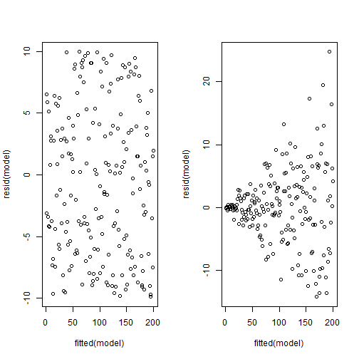
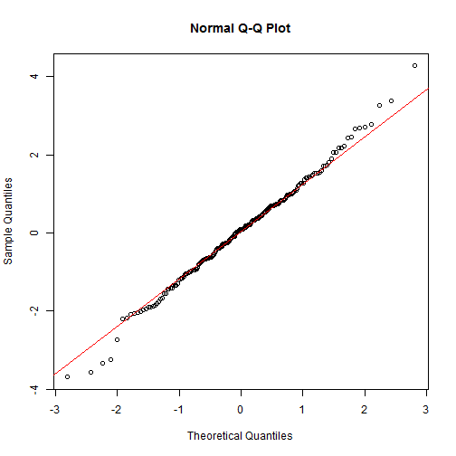
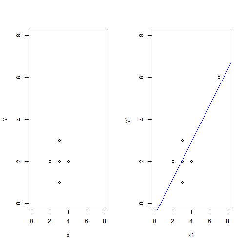
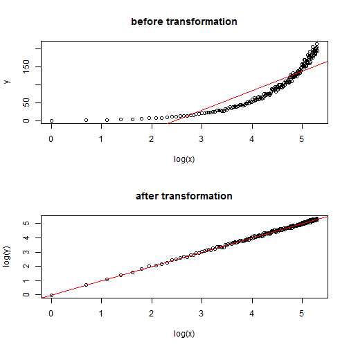

Statistical Modeling
========================================================
author: Guochun Shen
date: Tue Apr 08 21:49:07 2014

Steps of statistical modeling
========================================================

- Choose one or several models
- Estimate parameters in the specific model
- Select the best model

Important qestions
========================================================

- Which of your variables is the response varaible?
- Which are the explanatory variables?
- Are the explanatory variables continuous or categorical, or a maixture of both?
- What kind of response variable do you have: is it a continous measurement, a count, a proportion, a time at death, or a category?

Appropriate statistical method
=========================================================

_The explanatory variables_

- All explanatory variables continuous  __Regression__  
- All explanatory variables categorical __Analysis of variance (ANOVA)__
- Explanatory variables both continuous and categorical __Analysis of covariance (ANCOVA)__

Appropriate statistical method
=========================================================

_The response variables_

- Continous __Normal regression, ANOVA, ANCOVA__
- Proportion __Logistic regression__
- Count __Log-linear models__
- Binary __Binary logistic analysis__
- Time at death __Survival analysis__

Maximum Likelihood
=======================================================

The object is to determine the values of the parameters in a specific mdoel that lead to _the best fit of the model to the data_

The "best" is in terms of maximum likelihood: __given the data and your choice of model, what values of the parameters of that model make the observed data most likely?__

The principle of Parsimony
======================================================

- models should have as few as parameters as possible;
- linear models should be preferred to non-linear models;
- experiments relying on few assumptions should be preferred to those relying on many;
- models should be pared down until they are minimal adequate;
- simple explanantions should be preferred to complex explanations.

The principle of Parsimony
======================================================

The process of model simplification is an integral part of hypothesis testing. 

In general, a variable is retained in the model only _if it causes a significant increase in deviance when it is removed from the current model_

For _non-orthogonal data_, __order of deletion matters__

Model Formulae in R
========================================================

The structure of the model is specified in the model formula like this:

__response variables~explanatory variable(s)__

where the tilde symbol ~ reads 'is modeled as a function of'

Model Formulae in R
========================================================

Examples:

Null: __y~1__

1 is the intercept in regression models, but here is the overall mean y

Model Formulae in R
========================================================

Examples:

Regression: __y~x__

x is a continous explanatory variables

Symbol meaning in model formulae
======================================================

- __+__ indicates inclusion of an explanatory variable in the model (not addition);
- __-__ indicates deletion of an explanatory variable from the model (not subtraction);
- __*__ indicates inclusion of explanatory variables and interactions (not multiplication);
- __/__ indicates nesting of explanatory variables in the model (not division);
- __|__ indicates conditioning (not ‘or’), so that y~x | z is read as ‘y as a function of x given z’.

Model Formulae in R
========================================================

Examples:

Multiple regression: __y~x+z__

Two continuous explanatory variables, flat surface fit

Multiple regression: __y~x*z__

Fit an interaction term as well (x+z+x:z)

Model Formulae in R
========================================================

Examples:

Regression through origin: __y~x-1__

Do not fit an intercept

Model Formulae in R
========================================================

Examples:

One-way ANOVA: __y~sex__

e.g. sex is a two-level categorical variable

Model Formulae in R
========================================================

Examples:

One-way ANOVA: __y~sex__

e.g. sex is a two-level categorical variable

Model Formulae in R
========================================================

Examples:

Two-way ANOVA: __y~sex+genotype__

e.g. genotype is a four-level categorical variabe

Model Formulae in R
========================================================

Examples:

Factorial ANOVA: __y~N * P * K__

N, P and K are two-level factors to be fitted along with all their interactions

Model Formulae in R
========================================================

Examples:

Analysis of covariance: __y~x + sex__

A common slope for y against x but with two intercepts, one for each sex

Model Formulae in R
========================================================

Examples:

Nested ANOVA: __y~a/b/c__

Factor c nested within factor b within factor a

Summary of statistical models in R
============================================================

- __lm__ linear model with normal errors and constant variance
- __glm__ generalized linear models

- __gam__ generalized additive models

- __lme__ linear mixed-effect models
- __nls__ non-linear regression model via least squares

Summary of statistical models in R
============================================================

example:

```r
ctl <- c(4.17,5.58,5.18,6.11,4.50,
4.61,5.17,4.53,5.33,5.14)
trt <- c(4.81,4.17,4.41,3.59,5.87,
3.83,6.03,4.89,4.32,4.69)
group <- gl(2, 10, 20, labels = c("Ctl","Trt"))
weight <- c(ctl, trt)
lm.D9 <- lm(weight ~ group)
lm.D90 <- lm(weight ~ group - 1) # omitting intercept
```


Summary of statistical models in R
============================================================

other usefull __generic function__ in R can be used to obtain information about the model.

__summary,plot,coef,fitted,__  
__resid,predict,anova,update__

Model criticism
==========================================================

The truths about models:
- All models are wrong.
- Some models are better than others.
- The correct model can never be known with certainty.
- The simpler the model, the better it is.

__Therefore, you need a set of tools to establish whether and how, your model is inadequate.__

Heteroscedasticity
=========================================================

A good model must also account for the variance–mean relationship adequately and produce additive effects on the appropriate scale.
***
 


Non-normality of errors
==========================================================

 


Influence
===========================================================

One of the commonest reasons for a lack of fit is through the existence of outliers in the data.

It is important to understand, however, that a point may appear to be an outlier because of _misspecification of the model, and not because there is anything wrong with the data_.

Influence
===========================================================

 


***
To reduce the influence of outlies, there are a number of modern techniques known as __robust regression__ 

Influence
===========================================================

<small>

```r
influence(lm(y1~x1))
```

```
$hat
     1      2      3      4      5      6 
0.3478 0.1957 0.1957 0.1957 0.1739 0.8913 

$coefficients
  (Intercept)       x1
1     0.67826 -0.13043
2     0.37015 -0.04935
3    -0.03525  0.00470
4    -0.44066  0.05875
5    -0.10069 -0.02517
6    -2.52174  0.86957

$sigma
     1      2      3      4      5      6 
0.9661 0.9492 1.1150 0.8699 0.9366 0.8165 

$wt.res
       1        2        3        4        5        6 
 0.78261  0.91304 -0.08696 -1.08696 -0.95652  0.43478 
```

</small>

Influence
===========================================================

<small>

```r
influence.measures(lm(y1~x1))
```

```
Influence measures of
	 lm(formula = y1 ~ x1) :

  dfb.1_  dfb.x1   dffit cov.r  cook.d   hat inf
1  0.687 -0.5287  0.7326 1.529 0.26791 0.348    
2  0.382 -0.2036  0.5290 1.155 0.13485 0.196    
3 -0.031  0.0165 -0.0429 2.199 0.00122 0.196    
4 -0.496  0.2645 -0.6871 0.815 0.19111 0.196    
5 -0.105 -0.1052 -0.5156 1.066 0.12472 0.174    
6 -3.023  4.1703  4.6251 4.679 7.62791 0.891   *
```

</small>

Transformation
========================================================

Transformation of the explanatory variables often produces improvements in the model performance. The aim of transformation is pragmatic, namely to find a transformation that gives:  
- constant error variance;
- approximately normal errors;
- additivity;
- a linear relationship between the response variables and the explanatory variables;
- straightforward scientific interpretation.

Transformation
========================================================

The most frequently used transformations are __logs,powers and reciprocals__.

Sometimes, it is not clear from theory what the optimal transformation of the response variable should be. In these circumstances, the __Box-Cox transformation__ offers a simple empirical solution.

Transformation
========================================================

 


***


```r
par(mfrow=c(1,1))
boxcox(y~log(x))
```

 


Akaike's Information Criterion
=========================================================

penalized loglikelihood

__AIC=-2*log-likelihood+2(p+1)__

where p is the number of parameters in the model.


```r
AIC(lm(y1~x1))
```

```
[1] 20.19
```


Model simplification by stepwise deletion
=======================================================


```r
ctl <- c(4.17,5.58,5.18,6.11,4.50,4.61,5.17,4.53,5.33,5.14)
trt <- c(4.81,4.17,4.41,3.59,5.87,3.83,6.03,4.89,4.32,4.69)
group <- gl(2, 10, 20, labels = c("Ctl","Trt"))
weight <- c(ctl, trt)
lm.D9 <- lm(weight ~ group)
```


Model simplification by stepwise deletion
=======================================================


```r
step(lm.D9) #you can also set forward selection
```

```
Start:  AIC=-12.58
weight ~ group

        Df Sum of Sq  RSS   AIC
- group  1     0.688 9.42 -13.1
<none>               8.73 -12.6

Step:  AIC=-13.06
weight ~ 1
```

```

Call:
lm(formula = weight ~ 1)

Coefficients:
(Intercept)  
       4.85  
```


Exercise
=========================================================

Is there any significant effect of habitat on spatial distribution of species in the BCI plot?

