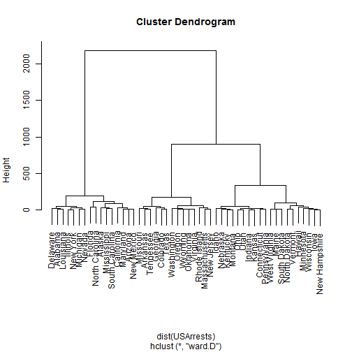
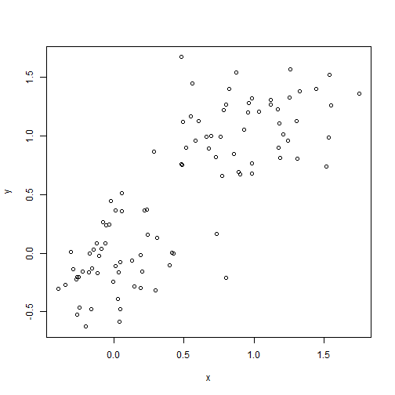
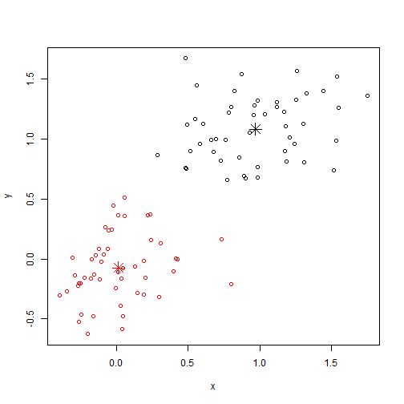
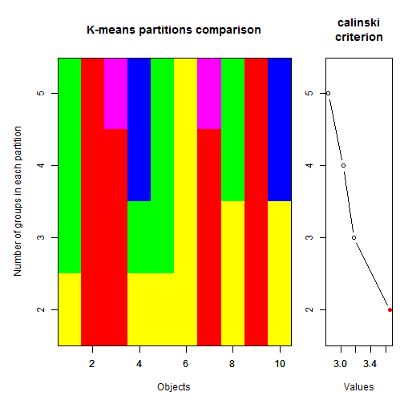

Cluster Analysis
========================================================
author: Guochun Shen
date: Wed Jun 11 08:57:03 2014

A Search for discontinuities
========================================================

The objective of clustering is to __regognize discontinuous subsets__ in an environment which is sometimes discrete and most often perceived as continuous in ecology.

- Clustering is __not__ a typical statistical method in that it does not test any hypothesis.
- Clustering helps bring out some features hidden in the data.
- it is the user who decides if these structures are interesting ans worth interpreting in ecological term.

Families of clustering methods
========================================================

1. Sequential or simultaneous algorithms
2. Agglomerative or divisive
3. Monothetic versus polythetic
4. Hierarchical versus non-hierarchical methods
5. Probabilistic versus non-probabilistic methods


Commonly used methods
========================================================

- Ward's Minimum Variance Clustering
- k-means partitioning

Ward's Minimum Variance Clustering
========================================================

The objective is to define groups in such a way that the within-group sum of squares is minimized. 


```r
hc=hclust(dist(USArrests),"ward.D")
hc
```

```

Call:
hclust(d = dist(USArrests), method = "ward.D")

Cluster method   : ward.D 
Distance         : euclidean 
Number of objects: 50 
```


Ward's Minimum Variance Clustering
========================================================


```r
plot(hc)
```


***

 


k-means partitioning
=========================================================

This method uses the local structure of the data to delineate clusters: groups are formed by identifying high-density regions in the data.

To archieve this, the method iteratively minimizes an objective function called the total error sum of squares, which is the sum of the within-groups sums-of-squares.

k-means partitioning
=========================================================


```r
# a 2-dimensional example
x <- rbind(matrix(rnorm(100, sd = 0.3), ncol = 2),matrix(rnorm(100, mean = 1, sd = 0.3), ncol = 2))
colnames(x) <- c("x", "y")
plot(x)
```

 

```r

```


k-means partitioning
=========================================================


```r
(cl <- kmeans(x, 2)) # two groups
```

```
K-means clustering with 2 clusters of sizes 50, 50

Cluster means:
        x        y
1 0.96999  1.08496
2 0.01205 -0.07372

Clustering vector:
  [1] 2 2 2 2 2 2 2 2 2 2 2 2 2 2 2 2 2 2 2 2 2 2 2 2 2 2 2 2 2 2 2 2 2 2 2
 [36] 2 2 2 2 2 2 2 2 2 2 2 2 2 2 2 1 1 1 1 1 1 1 1 1 1 1 1 1 1 1 1 1 1 1 1
 [71] 1 1 1 1 1 1 1 1 1 1 1 1 1 1 1 1 1 1 1 1 1 1 1 1 1 1 1 1 1 1

Within cluster sum of squares by cluster:
[1] 9.364 6.996
 (between_SS / total_SS =  77.5 %)

Available components:

[1] "cluster"      "centers"      "totss"        "withinss"    
[5] "tot.withinss" "betweenss"    "size"         "iter"        
[9] "ifault"      
```


k-means partitioning
=========================================================


```r
plot(x, col = cl$cluster)
points(cl$centers, col = 1:2, pch = 8, cex = 2)
```

 


k-means partitioning
=========================================================

which is the best solution in terms of number of clusters?

The Calinski-Harabasz index: F-statistic comparing the among-group to the within-group sum of squares of the partition.


k-means partitioning
=========================================================


```r
library(vegan)
# Partitioning a (10 x 10) data matrix of random numbers
 mat <- matrix(runif(100),10,10)
 res <- cascadeKM(mat, 2, 5, iter = 25, criterion = 'calinski') 
 toto <- plot(res)
```


***

 


Exercise
=======================================================

cluster the quadrats of tiantong plots based on soil nutrients

