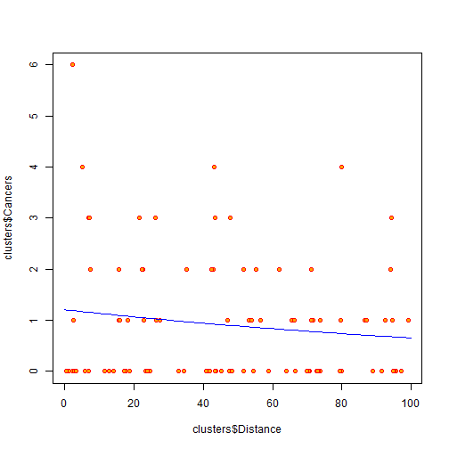
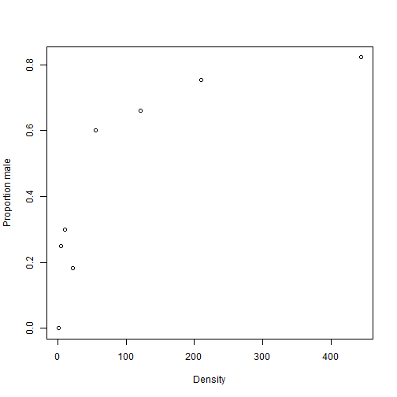
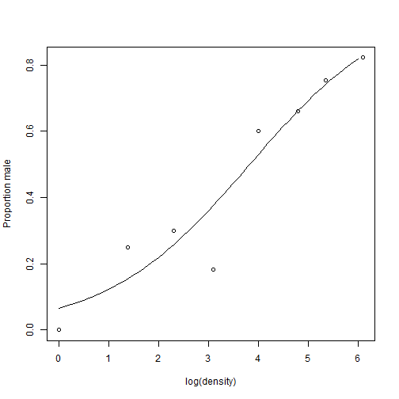

Generalized Linear Models
========================================================
author: Guochun Shen
date: Wed May 07 10:41:40 2014

Common problems
======================================================

sex ratios in insects, density dependent?
 


***
problems to do simple linear regression

- The response is bounded [0,1]
- The variance is not constant
- The errors are not normally distributed

Common problems
======================================================

whether or not proximity to the reactor affects the number of cancer cases?  
 


***
problems to do simple linear regression

- The response is integer
- The response is bounded [0,Inf]
- The variance is not constant
- The errors are not normally distributed

Common problems
======================================================

Test the island biogeography theory

```
  incidence  area isolation
1         1 7.928     3.317
2         0 1.925     7.554
3         1 2.045     5.883
4         0 4.781     5.932
5         0 1.536     5.308
6         1 7.369     4.934
```


problems to do simple linear regression

- The response is either 0 or 1;
- The variance is not constant;
-  The errors are not normally distributed.

Generalized Linear Models
========================================================

We can use generalized linear models (__GLMs__) when __the variance is not constant, and/or when the errors are not normally distributed__. Specifically, we might consider using GLMs when the response variables is:  
- count data expressed as propotions
- count data that are not propotions
- binary response variables

Properties of the GLMs
========================================================

- the error structure;
- the linear predictor;
- the link function;

Error structure of the GLMs
========================================================

Up to this point, we have dealt with the statistical analysis of data with normal errors. In practice, however, many kinds of data have non-normal errors: for example:
- errors that are strongly skewed;
- errors that are kurtotic;
- errors that are strictly bounded (as in proportions);
- errors that cannot lead to negative fitted values (as in counts);

Error structure of the GLMs
========================================================

In the past, the only tools available to deal with these problems were 
- _transformation of the response variables_ 
- _or the adoption of non-parametric methods_.

Error structure of the GLMs
========================================================

A GLM allows the specifications of a variety of different error distributions:
- __Poisson errors__, useful with count data;
- __binomial errors__, useful with data on proportions;
- __gamma errors__, useful with data showing a constant coefficient of variation;
- __exponential errors__, useful with data on time to death.

Error structure of the GLMs
========================================================

The error structure is deined by means of the __family__ directively, used as part of the model formula in R:


```r
glm(y~z,family=poisson)
```


which means that the response variable y has Poisson errors

Linear predictor of the GLMs
=====================================================

The structure of the model relates each observed y value to a predicted value. The predicted value is obtained by transformation of the value emerging from the __linear predictor__.

The linear predictor, $\eta$, is a linear sum of the effects of one or more explanatory variables, $x_j$:
$$\eta_i=\sum^p_{j=1}{x_{ij} \beta}$$
where the $xs$ are the values of the _p_ different explanatory variables, and the $\beta s$ are unknown parameters to be estiamted from the data.

Link function of the GLMs
======================================================

To determine the fit of a given model, a GLM evaluates the linear predictor for each value of the response
variable, then compares the predicted value with a _transformed_ value of y. The transformation to be employed
is specified in the __link function__. 

The link function relates the mean value of y to its linear predictor:
$$\eta=g(\mu)$$


Link function of the GLMs
======================================================

The link function relates the mean value of y to its linear predictor:
$$\eta=g(\mu)$$

The value of $\eta$ is obtained by transforming the value of y by the link function, and the predicted value of y is obtained by applying the inverse link function to $\eta$.

Link function of the GLMs
======================================================

By using different link functions, the performance of a variety of models can be compared directly. The
total deviance is the same in each case, and we can investigate the consequences of altering our assumptions
about precisely how a given change in the linear predictor brings about a response in the fitted value of y. The
most appropriate link function is the one which produces the minimum residual deviance.

Canonical link functions
======================================================

Error

- normal
- poisson
- binomial
- Gamma

***

Canonical link
- identity
- log
- logit
- reciprocal

Link function of the GLMs
======================================================

Instead of transforming the response variable in different ways, we can analyse the untransformed response
variable but specify different link functions.

This has the considerable advantage that the models are comparable by anova because they all have the same response variable.


Deviance: Measuring the goodness of fit of a GLM
======================================================

The measure of discrepancy in a GLM to assess the goodness of fit of the model to the data is called the __deviance__.

__Deviance is defined as ??? times the difference in log-likelihood between the current model and a saturated model.__

Deviance is estimated in different ways for different families within glm.

Residuals
====================================================

After fitting a model to data, we should investigate how well the model describes the data. In particular, we
should look to see if there are any systematic trends in the goodness of fit.

Raw residuals: __response variable ???fitted values.__

Standardized residuals:

correct for the fact that with non-normal errors (like count or proportion data) we violate the fundamental assumption that the variance is constant because the residuals tend to change in size as the mean value the response variable changes.

Standardized Residuals
====================================================

For Poisson errors:

$$\frac{y-fitted values}{\sqrt{fitted values}}$$

For binomial errors:

$$\frac{y-fitted values}{\sqrt{fitted values*[1-\frac{fitted values}{binomial denominator}]}}$$

Overdispersion
=====================================================

Overdispersion can be a problem when working with Poisson or binomial errors, and tends to occur because
you have not measured one or more of the factors that turn out to be important. It may also result from
the underlying distribution being non-Poisson or non-binomial.

there are two general techniques
available to deal with overdispersion:
- use F tests with an empirical scale parameter instead of chi-squared;
- use quasi-likelihood to specify a more appropriate variance function.


Count Data
====================================================

- The number of individuals who died;
- The number of species in a quadrat;

__0,1,2,...n__

Simple linear regression models are not appropriate for count data because:
- The linear model might lead to the prediction of negative counts.
- The variance of the response variable is likely to increase with the mean.
- The errors will not be normally distributed.
- Zeros are difficult to handle in transformations.

Count Data
====================================================

In R, count data are handled very elegantly in a generalized linear model by specifying __family=poisson__ which sets __errors=Poisson__ and __link = log__.

The log link ensure that all the fitted values are positive, while the Poisson errors take account of the fact that the data are integer and have variance that are equal to their means.

Count Data - Example
====================================================

The following example has a count (the number of reported cancer cases per year per clinic) as the response
variable, and a single continuous explanatory variable (the distance from a nuclear plant to the clinic in
kilometres).

```r
clusters=read.table("./data/clusters.txt",header=T)
```


Count Data - Example
====================================================

The question is whether or not proximity to the reactor affects the number of cancer cases.


Count Data - Example
====================================================


```r
model1=glm(Cancers~Distance,data=clusters,family=poisson)
model1
```

```

Call:  glm(formula = Cancers ~ Distance, family = poisson, data = clusters)

Coefficients:
(Intercept)     Distance  
    0.18686     -0.00614  

Degrees of Freedom: 93 Total (i.e. Null);  92 Residual
Null Deviance:	    149 
Residual Deviance: 147 	AIC: 262
```


Count Data - Example
====================================================


```

Call:
glm(formula = Cancers ~ Distance, family = poisson, data = clusters)

Deviance Residuals: 
   Min      1Q  Median      3Q     Max  
-1.550  -1.349  -1.155   0.388   3.130  

Coefficients:
            Estimate Std. Error z value Pr(>|z|)  
(Intercept)  0.18686    0.18873    0.99    0.322  
Distance    -0.00614    0.00367   -1.67    0.094 .
---
Signif. codes:  0 '***' 0.001 '**' 0.01 '*' 0.05 '.' 0.1 ' ' 1

(Dispersion parameter for poisson family taken to be 1)

    Null deviance: 149.48  on 93  degrees of freedom
Residual deviance: 146.64  on 92  degrees of freedom
AIC: 262.4

Number of Fisher Scoring iterations: 5
```


Count Data - Example
====================================================


```r
model2=glm(Cancers~Distance,data=clusters,family=quasipoisson)
model2
```

```

Call:  glm(formula = Cancers ~ Distance, family = quasipoisson, data = clusters)

Coefficients:
(Intercept)     Distance  
    0.18686     -0.00614  

Degrees of Freedom: 93 Total (i.e. Null);  92 Residual
Null Deviance:	    149 
Residual Deviance: 147 	AIC: NA
```


Count Data - Example
====================================================


```

Call:
glm(formula = Cancers ~ Distance, family = quasipoisson, data = clusters)

Deviance Residuals: 
   Min      1Q  Median      3Q     Max  
-1.550  -1.349  -1.155   0.388   3.130  

Coefficients:
            Estimate Std. Error t value Pr(>|t|)
(Intercept)  0.18686    0.23536    0.79     0.43
Distance    -0.00614    0.00457   -1.34     0.18

(Dispersion parameter for quasipoisson family taken to be 1.555)

    Null deviance: 149.48  on 93  degrees of freedom
Residual deviance: 146.64  on 92  degrees of freedom
AIC: NA

Number of Fisher Scoring iterations: 5
```


Count Data - Example
====================================================

 


Count Data - Example
====================================================

The response variable is a count of infected blood cells per square millimetre on microscope slides prepared from randomly selected individuals.
<small>

```r
count=read.table("./data//cells.txt",header=T)
str(count)
```

```
'data.frame':	511 obs. of  5 variables:
 $ cells : int  1 0 1 1 0 2 1 0 5 1 ...
 $ smoker: logi  TRUE TRUE TRUE TRUE TRUE TRUE ...
 $ age   : Factor w/ 3 levels "mid","old","young": 3 3 3 3 3 3 3 3 3 3 ...
 $ sex   : Factor w/ 2 levels "female","male": 2 2 2 2 2 2 2 2 2 2 ...
 $ weight: Factor w/ 3 levels "normal","obese",..: 1 1 1 1 1 1 1 1 1 1 ...
```

</small>

Count Data - Example
====================================================

<small>

```r
model1=glm(cells~smoker*sex*age*weight,data=count,family=poisson)
#summary(model1)
model2=glm(cells~smoker*sex*age*weight,data=count,family=quasipoisson)
#summary(model2)
model3=update(model2,~.-smoker:sex:age:weight)
model4=update(model3,~.-sex:weight:age)
#anova(model4,model3,test="F")
model5=update(model4,~.-smoker:age:weight-smoker:sex:weight)
#anova(model5,model4,test="F")
#the minimal adequate model might look something like
#cells~smoker+weight+smoker:weight
```

</small>

Propotion Data - Example
===========================================================

- studies on percentage mortality;
- infection rates of diseases;
- sex ratios

Terminology:

- __p__: the proportion of sucesses
- __q__: the proportion of failures; q=1-p
- __n__: number of attempts; the binomial denominator
- __odds__: p/q

Propotion Data - Example
===========================================================

In R, the family of error is binomial; the link function is log transformation of odds. 

p is modeled by logistic function
$$p=\frac{e^{a+bx}}{1+e^{a+bx}}$$

Propotion Data - Example
===========================================================

sex ratios in insects, density dependent?

```r
head(numbers)
```

```
  density females males
1       1       1     0
2       4       3     1
3      10       7     3
4      22      18     4
5      55      22    33
6     121      41    80
```


*** 

 


Propotion Data - Example
===========================================================

step 1: generate response varaible with right format

```r
attach(numbers)
y=cbind(males,females)
head(y)
```

```
     males females
[1,]     0       1
[2,]     1       3
[3,]     3       7
[4,]     4      18
[5,]    33      22
[6,]    80      41
```


Propotion Data - Example
===========================================================


```r
model=glm(y~density,binomial)
#summary(model)
model2=glm(y~log(density),binomial)
#summary(model2)
```


Propotion Data - Example
===========================================================


```r
xv=seq(0,6,0.1)
p=males/(males+females)
plot(log(density),p,
ylab="Proportion male")
lines(xv,predict(model2,
list(density=exp(xv)),
type="response"))
```


***
<small>
 

</small>

Binary Data - Example
======================================================

- dead or alive;
- occupied or empty;
- healthy or diseased;
- male or female;
- mature or immature.

In R, family=binomial; link function can be logit or log-log

Binary Data - Example
======================================================


```r
head(island)
```

```
  incidence  area isolation
1         1 7.928     3.317
2         0 1.925     7.554
3         1 2.045     5.883
4         0 4.781     5.932
5         0 1.536     5.308
6         1 7.369     4.934
```


Is there any relationship between the occupation of a bird species on a island and the area/isolation of the island?

Binary Data - Example
======================================================


```r
attach(island)
model1=glm(incidence~area*isolation,binomial)
model2=glm(incidence~area+isolation,binomial)
anova(model1,model2,test="Chi")
```

```
Analysis of Deviance Table

Model 1: incidence ~ area * isolation
Model 2: incidence ~ area + isolation
  Resid. Df Resid. Dev Df Deviance Pr(>Chi)
1        46       28.2                     
2        47       28.4 -1    -0.15      0.7
```


Binary Data - Example
======================================================
<small><small>

```r
summary(model2)
```

```

Call:
glm(formula = incidence ~ area + isolation, family = binomial)

Deviance Residuals: 
   Min      1Q  Median      3Q     Max  
-1.819  -0.309   0.049   0.363   2.119  

Coefficients:
            Estimate Std. Error z value Pr(>|z|)   
(Intercept)    6.642      2.922    2.27    0.023 * 
area           0.581      0.248    2.34    0.019 * 
isolation     -1.372      0.477   -2.88    0.004 **
---
Signif. codes:  0 '***' 0.001 '**' 0.01 '*' 0.05 '.' 0.1 ' ' 1

(Dispersion parameter for binomial family taken to be 1)

    Null deviance: 68.029  on 49  degrees of freedom
Residual deviance: 28.402  on 47  degrees of freedom
AIC: 34.4

Number of Fisher Scoring iterations: 6
```

</small></small>

Bootstrapping a GLM
====================================================

In order to obtain a distribution of parameter values for the model from which you can derive confidence intervals, two contrasting ways of using bootstrapping with statistical models exist:
- Fit the model lots of times by selecting cases for inclusion at random with replacement, so that some data points are excluded and others appear more than once in any particular model fit.
- Fit the model once and calculate the residuals and the fitted values, then shuffle the residuals lots of times and add them to the fitted values in different permutations, fitting the model to the many different data sets.

Bootstrapping a GLM
====================================================

The 1st Method

```r
library(boot)
model.boot=function(data,indices){
  sub.data=data[indices,]
  model=glm(incidence~area+isolation,
            family=binomial,data=sub.data)
  coef(model)
}
#glim.boot=boot(island,model.boot,R=20)
```


Bootstrapping a GLM
====================================================

The 2nd Method

```r
model0=glm(incidence~area+isolation,
            family=binomial,data=island)
yhat=fitted(model0)
resids=resid(model0)
res.data=cbind(data.frame(resids,yhat),island)

model.boot2=function(res.data,i){
  y=res.data$yhat+res.data$resids[i]
  model=glm(y~res.data$area+res.data$isolation,
            family=binomial)
  coef(model)
}
#glim.boot=boot(res.data,model.boot2,R=20,sim="permutation")
```

