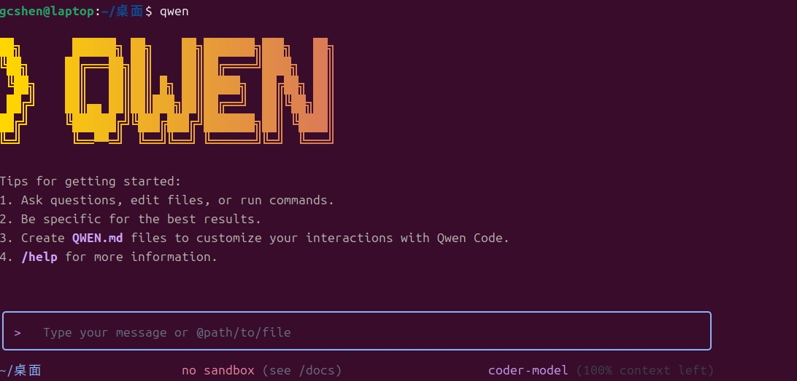

# AI辅助编程基础


## 引言

在大语言模型（LLM）成为强大编程助手的今天，编程教育的重心正在发生根本性的转移。死记硬背语法和API（预先定义的工具函数）细节的价值确实在大幅降低。这一变革标志着编程教育从"技能导向"向"思维导向"的深刻转型。过去，编程教学往往过分强调记忆各种语言的语法规则、函数库的API细节，以及特定框架的使用方法，学生需要花费大量时间在机械记忆上。然而，随着Deepseek等AI编程助手的普及，这些原本需要记忆的知识点现在可以通过简单的自然语言查询即时获得。这并不意味着编程变得不重要，恰恰相反，它意味着编程教育的价值需要重新定位。

在新的AI时代，编程教育的核心价值不再体现在"知道多少语法"，而是体现在"能够解决什么问题"和"如何设计分析方案"。学生需要培养的是更高层次的思维能力：如何将一个复杂的现实问题分解成可计算的分析步骤，如何选择合适的统计方法和数据处理技术，如何设计清晰的分析流程，如何与AI进行有效协作以验证和优化分析结果。这些能力构成了AI时代统计编程人员的核心竞争力。

具体而言，统计编程教育应该着重培养以下几个关键能力：首先是问题分解与抽象建模能力，这要求学生能够将复杂的统计问题转化为可计算的数学模型；其次是算法思维，理解不同统计方法的计算原理和适用条件；再次是数据处理能力，从数据收集、清洗到分析的完整流程设计；最后是与AI协作的能力，包括精准提问、代码审查和迭代优化。这些能力的培养需要项目驱动的教学方法，让学生在解决真实统计问题的过程中逐步建立编程思维框架。

对于生态学专业的你来说，理解全球AI竞争中的算法核心地位，就如同理解生态系统中的关键物种——它虽不直接可见，却足以重塑整个环境格局。DeepSeek作为中国AI企业，正是凭借算法的突破性创新，改写了全球AI产业长期以来依赖“堆算力”的发展路径。它通过自研的混合专家模型（MoE）架构和最新的DeepSeek稀疏注意力（DSA） 等算法，在保证模型高性能的同时，大幅提升了训练和推理效率，并将API成本降低了超过50%。这种“效能革命”证明了高效的算法设计本身可以成为一种强大的竞争力，打破了由算力规模构筑的壁垒。

这种教育重心的转移对师生双方都提出了新的要求，也带来了新的机遇。学生不再需要为记忆琐碎的语法细节而苦恼，可以将更多精力投入到统计建模的核心环节和数据本身的深刻解读。教师的教学方法也需要相应调整，从传统的"语法讲解+练习题"模式转向"数据分析项目实践+统计思维训练"模式。通过这种转变，统计编程教育方能超越其“术”的层面，真正服务于“道”的构建——将更好地服务于培养学生的数据科学思维和统计分析能力这一根本目标，为他们在AI时代的科研和数据分析工作奠定坚实基础。

现在，对学生来说，最重要的不再是"如何写代码"，而是"解决什么问题"和"为何这样解决"。

本章将介绍AI时代的编程思维框架，帮助学生培养与LLM协同工作的核心能力，并通过R语言实践掌握现代数据分析方法。

## 生态数据分析的核心能力

以下是学生在学习编程课程时最需要培养的核心技能，我将其分为三大类：

### 高阶思维与问题解决能力

最核心、最根本的能力是驾驭LLM的"方向盘"能力。在AI时代，数据分析师不再需要记忆繁琐的编程语法细节，但必须具备更高层次的思维框架来指导AI工具完成复杂的数据分析任务。这种高阶思维框架主要包括三个方面：首先是问题分解与抽象建模能力，即将复杂的生态学问题转化为清晰可执行的分析流程；其次是算法与数据结构思维，即对计算效率和数据处理优化的深刻理解；最后是数据分析流程设计与规划能力，即从宏观视角系统性地设计整个数据分析生命周期的能力。这三种能力共同构成了AI时代生态学数据分析师的核心竞争力，确保研究者能够站在战略高度设计分析方案，而不仅仅是执行具体的编程任务。

#### 问题分解与抽象建模能力

问题分解与抽象建模能力是指将一个复杂的、模糊的现实世界问题，分解成一个个清晰的、可执行的分析步骤的能力。这种能力不仅涉及技术层面的分解，更包含对问题本质的深刻理解和抽象思维。在生态学研究中，这意味着能够将复杂的生态系统现象转化为可计算、可分析的统计模型和分析流程。

这种能力的重要性在于，虽然LLM可以帮你写数据处理代码，但它无法替你决定"整个分析流程应该分成哪几个关键步骤"或"这个统计问题应该采用哪种分析方法"。这是人类分析师最核心的价值。在AI时代，这种能力变得更加关键，因为LLM擅长执行具体任务，但缺乏对复杂研究问题的整体把握和统计规划能力。学生需要学会如何将模糊的研究问题转化为清晰的分析需求，这样才能有效指导LLM完成具体实现。

在生态学实践中，问题分解能力体现在具体的研究场景中。例如，分析森林生态系统的物种多样性变化，需要分解为数据收集、数据清洗、多样性指数计算、统计分析、结果可视化及生态学阐释等步骤。具体而言，这个过程可以进一步细化为：首先确定研究目标和数据需求，包括样地选择标准、调查方法和数据格式；然后设计数据收集方案，考虑野外调查的可行性和数据质量控制；接着制定数据清洗流程，处理缺失值、异常值和数据标准化问题；再选择合适的多样性指数计算方法，如Shannon-Wiener指数、Simpson指数等，并考虑其生态学意义；最后设计统计分析框架和可视化方案，确保结果能够清晰反映生态学规律。

这种问题分解能力在生态学研究中尤为重要，因为生态系统的复杂性往往超出直觉理解。通过系统性的分解和抽象，研究者能够将看似混沌的自然现象转化为有序的分析流程。例如，在研究气候变化对物种地理分布的影响时，需要将问题分解为气候数据获取、物种分布数据整合、生态位模型构建、未来情景预测等多个分析环节，每个环节都有其特定的技术要求和生态学考量。

培养这种能力的关键在于实践和反思。学生应该通过具体的生态学项目，学习如何识别问题的核心要素，如何设计合理的分析流程，以及如何在技术实现和生态学意义之间找到平衡。随着经验的积累，这种问题分解和抽象建模能力将成为学生在AI时代进行生态学研究的核心竞争力。

#### 算法与数据结构思维

算法与数据结构思维是数据分析师的核心能力之一，它不仅仅是理解不同算法和数据结构的适用场景，更重要的是培养一种"计算效率意识"。这种思维要求我们理解不同统计方法的时间/空间复杂度（Big O Notation），知道在什么情况下应该选择哈希表而不是数组来快速查找数据，何时应该采用动态规划而不是暴力破解来处理复杂的优化问题。在生态学数据分析中，这种思维体现在对数据处理流程的优化意识上——比如知道在什么情况下应该使用向量化操作而不是循环，何时应该对数据进行预处理以提高后续分析的效率。这种思维还延伸到对统计方法计算复杂度的理解，比如知道某些复杂的生态位模型可能需要数小时甚至数天才能完成计算，而简单的线性回归可能只需要几秒钟。

在AI时代，LLM可以根据你的要求实现一个统计函数，但你必须具备足够的专业知识来告诉它具体需要什么。比如，你不能简单地说"帮我做个t检验"，而应该明确说明"我需要一个能够处理缺失值、输出置信区间、并且可以进行方差齐性检验的*t*检验函数"。这种精确的需求描述能力来自于对统计方法内在逻辑的深刻理解。更重要的是，当LLM给出解决方案时，你需要具备评判能力——这个方案真的最优吗？有没有考虑边界情况？这个统计方法是否适用于我的数据类型？比如，LLM可能会推荐使用Pearson相关系数来分析你的数据，但如果你知道自己的数据不符合正态分布，就应该选择Spearman或Kendall相关系数。这种科学素养和批判性思维是AI难以替代的，它确保了分析结果的科学性和可靠性。

处理大规模的物种分布数据时，算法与数据结构思维显得尤为重要。假设你正在分析全国范围的鸟类分布数据，包含数百万条观测记录。如果你简单地使用线性搜索来查找特定物种的记录，可能需要数小时才能完成。但如果你具备数据结构思维，就会想到使用哈希表或数据库索引来建立快速查找机制，将查询时间从小时级降低到秒级。另一个例子是生态位模型的构建：如果你要使用MaxEnt模型分析某个濒危物种的分布规律，需要理解这个算法的计算复杂度，知道在什么情况下应该对数据进行降采样，什么情况下可以使用并行计算来加速模型训练。在处理时间序列的生态监测数据时，你需要知道何时应该使用滑动窗口分析而不是对整个数据集进行全局分析。这种思维还体现在对数据存储格式的选择上——知道在什么情况下应该使用CSV格式便于人工查看，什么情况下应该使用Parquet或Feather格式来提高读写效率。通过培养这种算法与数据结构思维，生态学研究者能够在面对海量生态数据时做出明智的技术决策，确保分析工作既高效又准确。

#### 数据分析流程设计与规划能力

数据分析流程设计与规划能力是AI时代生态学研究者的核心竞争力，它要求从宏观视角系统性地设计整个数据分析的生命周期。这种能力不仅仅是知道如何使用各种统计工具，更重要的是能够站在研究问题的高度，设计出科学、高效、可复现的分析流程。具体包括：数据收集阶段的方案设计——如何确保数据的代表性和质量；数据清洗阶段的策略制定——如何处理缺失值、异常值和数据标准化；分析方法的选择与组合——如何根据研究问题和数据类型选择最合适的统计模型；结果验证与敏感性分析——如何确保分析结果的稳健性和可靠性；以及最终的可视化与报告呈现——如何将复杂的数据分析结果转化为清晰易懂的科学发现。这种能力还体现在对技术工具链的整体规划上，比如知道在什么情况下应该使用R而不是Python，何时应该选择传统的统计方法而非机器学习算法，以及如何设计可扩展的分析框架来应对未来数据量的增长。

在AI协作的时代，LLM确实可以高效执行具体的编程任务，但整个数据分析的战略规划必须由人类分析师来完成。LLM是优秀的"执行者"，能够快速实现你指定的数据处理步骤，但它无法替代你在研究设计、方法选择和结果解释方面的专业判断。作为分析师，你需要负责确定分析的整体方向——比如是要探索数据的内在规律还是要验证特定的科学假设？是要进行描述性统计还是要建立预测模型？这些战略决策直接影响着后续所有分析步骤的设计。更重要的是，只有你才理解研究问题的生态学背景，知道哪些统计方法在生态学领域是公认有效的，哪些结果具有实际的生态学意义。LLM可能会给出技术上的最优解，但你需要判断这个解是否科学合理、是否符合生态学理论。比如，LLM可能倾向于推荐使用复杂的深度学习模型来分析物种分布数据，但当研究目标与数据特性表明传统的广义线性模型已经足够时，你应遵循“奥卡姆剃刀”原则，优先选择更简单和更具可解释性的方法。

在生态学研究中，数据分析流程设计与规划能力体现在对复杂研究项目的整体把控上。以研究气候变化对森林生态系统影响为例，一个完整的数据分析流程需要精心设计：首先，在数据收集阶段，你需要规划如何整合多源数据——包括气象站的长期观测数据、遥感影像的植被指数、野外调查的物种组成数据等，确保数据的时间序列和空间尺度相匹配。在数据清洗阶段，你需要制定统一的质量控制标准，比如如何处理不同来源数据的单位差异、如何填补缺失的气候数据、如何校正遥感数据的几何畸变。在分析方法选择上，你需要综合考虑研究目标——如果是要分析气候因子的相对重要性，可能会选择方差分解或随机森林；如果是要建立预测模型，可能会使用广义可加模型或机器学习算法。在整个流程中，你还需要规划结果的验证方法，比如使用交叉验证来评估模型的预测性能，或者使用独立的数据集来验证模型的泛化能力。最后，在结果呈现阶段，你需要设计清晰的可视化方案，确保复杂的统计分析结果能够被同行理解和接受。这种全方位的规划能力确保了生态学研究的科学性和可重复性，是AI时代生态学研究者不可或缺的核心素养。

### 与LLM协同工作的能力

在AI时代，与LLM的有效协作已经成为生态学数据分析师的核心技能。这种协作不是简单的命令与执行关系，而是一种需要精心设计的对话式工作流程。LLM可以看作是一个知识渊博但缺乏专业判断的助手，它能够快速实现具体的技术任务，但需要人类分析师提供清晰的指导、专业的判断和严格的质量控制。这种协作关系要求分析师具备三个关键能力：首先是精确提问与Prompt（提示词）工程能力，能够将复杂的生态学分析需求转化为LLM可以理解的明确指令；其次是代码审查与批判性验证能力，确保LLM输出的技术方案符合科学标准和实际需求；最后是迭代优化能力，通过多轮对话逐步完善分析方案。这三种能力共同构成了AI时代生态学研究者与智能工具协同工作的核心框架，确保研究者能够站在战略高度指导AI完成技术实现，同时保持对分析质量和科学性的全面把控。

#### 精确提问与Prompt工程能力

精确提问与Prompt工程能力是AI时代生态学研究者与LLM有效协作的基础，它要求能够将复杂的生态学分析需求转化为清晰、无歧义的技术指令。这种能力不仅仅是简单的命令传达，更是一种需要专业知识和沟通技巧的对话艺术。具体包括：明确指定分析目标——是要探索数据模式还是要验证特定假设；清晰描述数据特征——包括数据结构、变量类型、数据质量等；设定技术约束——如使用的统计包、可视化要求、性能标准、输出格式等；提供生态学背景——帮助LLM理解分析的科学意义和实际应用场景。这种能力还体现在对LLM输出格式的精确控制上，比如要求生成可复现的分析代码、添加详细的注释说明、确保代码符合生态学研究的最佳实践。

在生态学数据分析中，模糊的提问往往导致LLM生成不适用甚至错误的解决方案。比如，简单地说"帮我分析物种多样性"，LLM可能会使用通用的多样性计算方法，而忽略生态学研究中需要考虑的特定约束条件，如样地面积标准化、稀有物种处理、空间自相关等问题。精确的提问能力确保LLM能够理解你的具体需求，生成符合生态学标准的分析代码。更重要的是，这种能力体现了研究者对分析问题的深刻理解——只有当你清楚地知道需要什么统计方法、什么数据预处理步骤、什么结果验证标准时，你才能向LLM提出精确的要求。因此，Prompt工程不是你不再需要思考，而是要求你进行更清晰、更结构化的思考。在AI协作时代，这种精确描述需求的能力比记忆具体编程语法更加重要，它决定了你能否有效利用AI工具解决复杂的生态学问题。

在研究森林群落构建机制时，精确的提问能力显得尤为重要。假设你要分析环境过滤和生物相互作用对物种共现模式的影响，一个模糊的提问可能是："帮我分析物种共现模式"。而精确的提问应该包括：明确分析目标——"使用零模型分析检验天童20个样地中木本植物的物种共现模式，检验环境过滤和竞争排斥的相对重要性"；数据约束——"数据包含每个样地的物种多度矩阵和环境因子（海拔、坡度、土壤pH值），需要排除DBH<1cm的个体"；方法要求——"使用vegan包计算C-score和Checkerboard指数，采用固定行列和固定物种丰富度的零模型，进行999次随机化，输出统计显著性和效应大小"；结果格式——"生成包含观察值、期望值、标准效应大小和p值的表格，以及物种对共现模式的可视化图表"。通过这种精确的提问，LLM能够生成专业、可复现的生态学分析代码，大大提高了研究效率和分析质量。

#### 代码审查与批判性验证能力

代码审查与批判性验证能力是确保LLM生成代码质量的关键保障，它要求生态学研究者具备专业的判断力来评估和验证AI输出的技术方案。这种能力不仅仅是检查语法错误，更重要的是从多个维度进行综合评估：首先是功能正确性验证——确保代码逻辑符合生态学分析要求、统计方法选择恰当、计算结果准确可靠；其次是代码质量审查——检查代码的可读性、可维护性、性能效率，确保符合编程最佳实践；再次是生态学适用性判断——评估统计方法是否适合特定的生态数据类型和研究问题，比如时间序列数据是否需要考虑自相关，空间数据是否需要考虑空间依赖性；最后是科学合理性检验——确保分析结果具有生态学意义，统计推断符合科学标准。这种能力还体现在对边界情况的敏感度上，比如数据缺失、异常值处理、模型假设检验等关键环节的验证。

在生态学研究中，盲目接受LLM的输出可能导致严重的科学错误。LLM虽然能够生成技术正确的代码，但它缺乏对生态学背景的深刻理解，可能会推荐不合适的统计方法或忽略重要的生态学约束条件。比如，LLM可能会使用普通的线性回归来分析物种丰富度与环境因子的关系，而忽略了生态学中常用的广义线性模型或广义可加模型更适合处理计数数据和非线性关系。更重要的是，LLM无法判断分析结果的实际生态学意义——一个统计上显著的相关性是否具有生物学重要性？模型预测是否超出了数据的合理范围？这些专业判断必须由人类研究者来完成。在AI协作时代，代码审查能力确保了分析结果的科学性和可靠性，是防止"垃圾进，垃圾出"现象的关键防线。

再如，在分析气候变化对物种分布影响的研究中，代码审查能力尤为重要。假设LLM生成了一个使用MaxEnt模型预测物种分布变化的代码，研究者需要进行全面的审查：首先验证数据预处理——是否对气候变量进行了适当的标准化？是否考虑了变量间的多重共线性？是否使用了正确的投影坐标系？其次检查模型设置——是否设置了合理的正则化参数？是否进行了充分的模型调优？是否使用了适当的背景点采样策略？然后评估结果解释——模型预测的分布变化是否在生态学上合理？是否考虑了物种的扩散能力限制？预测的不确定性是否得到了充分评估？最后检查可复现性——代码是否包含了完整的随机种子设置？是否保存了中间结果以便后续验证？是否提供了清晰的文档说明？通过这种全面的代码审查，研究者能够确保分析结果的科学质量，避免因技术错误导致的研究结论偏差。

#### 迭代与优化能力

迭代与优化能力是AI时代生态学研究者与LLM协同工作的核心流程，它体现了从初步方案到最终成果的渐进式完善过程。这种能力要求研究者具备系统性的反馈思维，能够基于LLM的初始输出进行多轮的精炼和优化。具体包括：问题诊断与反馈——准确识别LLM输出中的不足，如功能缺失、性能问题、代码风格不一致等，并提供具体的改进建议；方案调整与优化——根据实际需求调整分析方案，如改变统计方法、优化算法效率、改进可视化效果等；边界条件完善——补充LLM可能忽略的特殊情况处理，如数据缺失、异常值、模型假设检验等；生态学细节补充——添加符合生态学研究标准的特定要求，如数据标准化、结果解释、不确定性评估等。这种能力还体现在对LLM学习曲线的把握上，通过持续的对话让LLM更好地理解研究者的分析习惯和偏好。

在复杂的生态学数据分析中，很少有分析方案能够一次性完美实现所有需求。LLM的初始输出往往是一个基础框架，需要通过多轮迭代来完善细节、优化性能、增强稳健性。这种迭代过程不仅仅是技术修正，更重要的是科学思维的体现——通过反复的质疑、验证和优化，确保分析方案既技术正确又科学合理。比如，LLM可能首先生成一个基本的物种多样性分析代码，但研究者需要通过多轮对话来添加样地面积标准化、稀有物种处理、统计检验等生态学分析必需的细节。更重要的是，迭代过程本身就是一个深度学习的机会——通过观察LLM如何响应不同的反馈，研究者能够更好地理解统计方法的实现细节，提升自己的编程和数据分析能力。在AI协作时代，这种迭代优化能力确保了分析方案的质量和适用性，是高效利用AI工具解决复杂生态学问题的关键。

例如，在构建森林碳储量预测模型时，迭代优化能力发挥着关键作用。假设研究者首先向LLM提出需求："帮我用R构建一个预测森林碳储量的模型"。LLM可能首先生成一个简单的线性回归模型。研究者通过第一轮迭代反馈："这个模型太简单了，森林碳储量与树高、胸径的关系可能是非线性的，请改用广义可加模型，并考虑树种差异的影响"。LLM生成改进版本后，研究者进行第二轮迭代："模型还需要考虑样地间的空间自相关性，请添加空间随机效应，使用混合效应模型框架"。第三轮迭代可能关注模型验证："请添加交叉验证来评估模型预测性能，并生成残差分析图表检查模型假设"。第四轮迭代可能关注实际应用："模型需要能够处理新的样地数据，请编写一个预测函数，并添加不确定性估计"。通过这种多轮迭代，研究者能够逐步完善分析方案，从基础模型发展到符合生态学研究标准的复杂预测系统，确保模型既技术先进又科学实用。

### 传统但愈发重要的软技能

在AI技术快速发展的背景下，一些传统的软技能不仅没有失去价值，反而在技术工具的辅助下变得更加关键。与LLM等技术工具不同，这些能力无法通过算法训练获得，而是需要通过长期的学术实践和人文素养培养来建立。具体包括：数据分析调试与问题排查能力——当复杂的生态学分析流程出现异常时，人类研究者的逻辑推理和经验判断是不可替代的；沟通与协作能力——向不同背景的受众解释分析结果、与团队成员协同完成研究项目的能力；持续学习与好奇心——在技术快速迭代的时代保持前沿知识更新的动力。这些软技能共同构成了AI时代生态学研究者的核心竞争力，确保研究者能够在技术工具的辅助下，依然保持对科学研究本质的深刻理解和主导地位。

#### 数据分析调试与问题排查能力

数据分析调试与问题排查能力是生态学研究者面对复杂数据分析流程时必备的核心技能，它要求具备系统性的问题诊断思维和逻辑推理能力。这种能力不仅仅是解决技术错误，更重要的是从科学研究的整体视角来识别和解决分析流程中的各种问题。具体而言，研究者需要能够准确理解编程语言和统计软件的错误提示，快速定位问题根源；识别数据收集、录入、处理过程中的质量问题，如缺失值模式、异常值分布、数据一致性等；通过系统性的排除法确定问题原因，验证各种可能的假设；重现问题发生的完整流程，确定问题出现的具体环节；提出针对性的解决措施，并验证解决方案的有效性。这种能力还体现在对问题严重性的判断上，能够区分技术性错误和科学性错误，确保问题解决不影响研究的科学完整性。

在生态学数据分析中，问题排查能力比单纯的编程技能更加重要。LLM虽然能够生成代码，但当分析流程出现复杂问题时，它往往难以理解问题的深层原因和科学背景。比如，当物种多样性分析结果出现异常值时，LLM可能只能提供技术性的检查建议，而人类研究者需要结合生态学知识来判断：是数据收集问题？是统计方法选择不当？还是生态系统本身的异常现象？更重要的是，许多数据分析问题涉及多个环节的交互影响，需要研究者具备全局思维来系统排查。在AI协作时代，这种调试能力确保了研究者能够主导分析过程，而不是被技术问题所困扰。它体现了研究者对数据分析流程的深刻理解和对科学问题的专业判断，是确保研究成果可靠性的关键保障。

比如，在研究森林群落演替动态时，调试能力显得尤为重要。假设研究者使用LLM生成的代码分析20年长期监测数据，发现某些样地的物种丰富度变化模式异常——在理论上应该增加的情况下出现了下降。研究者需要进行系统的问题排查，首先检查数据质量，验证野外调查记录是否完整，数据录入是否有误，样地边界是否发生变化；然后检查分析方法，确认多样性计算是否考虑了样地面积标准化，统计检验是否考虑了时间序列的自相关性；接着分析生态学背景，考察是否有干扰事件（如病虫害、火灾）影响，气候条件是否有异常变化；最后验证结果合理性，与其他独立数据源对比，咨询领域专家意见。通过这种系统性的调试过程，研究者可能发现问题是数据录入错误（某个年份的样地面积记录有误），或者是真实的生态现象（某种优势树种的大规模死亡导致多样性暂时下降）。这种深度的问题排查能力确保了研究结论的科学性，是AI工具难以替代的人类智慧。

#### 沟通与协作能力

沟通与协作能力是生态学研究者将技术分析转化为科学影响力的关键桥梁，它要求具备多层次的交流技巧和团队合作素养。这种能力体现在多个维度：能够向不同专业背景的研究者（如生态学家、统计学家、政策制定者）清晰解释复杂的数据分析结果，确保技术发现被正确理解和应用；将数据分析过程、方法和结论转化为规范的学术论文、研究报告或政策建议，确保科学发现的传播和影响力；在多人参与的研究项目中协调分工、统一研究思路、解决分歧，确保研究目标的顺利实现；将专业的生态学研究发现转化为公众易懂的语言，为环境保护决策提供科学依据。这种能力还体现在对不同受众需求的敏感度上，知道在什么场合使用什么语言，如何平衡专业性和可理解性。

在AI时代，技术工具可以高效完成数据分析任务，但科学研究的最终价值需要通过有效的沟通和协作来实现。LLM虽然能够生成技术报告，但它无法理解不同受众的知识背景、关注点和价值取向，也无法进行真正的情感共鸣和思想交流。比如，向政策制定者解释气候变化对生物多样性的影响时，需要将复杂的数据分析结果转化为具体的政策建议和风险评估，这要求研究者具备政策语言的理解和转化能力。更重要的是，科学研究本质上是集体智慧的产物，需要研究者之间的深度协作——讨论研究设计、分享数据分析经验、批判性评价研究结论。这种协作过程不仅提高了研究质量，也促进了学术共同体的知识积累。在AI辅助的研究环境中，沟通协作能力确保了人类智慧的主导地位，是科学研究社会价值实现的关键环节。

**生态学案例**：在开展跨学科的生态系统服务评估研究时，沟通协作能力发挥着核心作用。假设一个研究团队包括生态学家、经济学家、社会学家和政策专家，共同评估森林生态系统的碳汇功能和经济价值。生态学家需要向经济学家解释碳储量测算的科学原理和数据不确定性——"我们使用异速生长方程估算树木生物量，基于树种-specific的转换系数计算碳储量，但这种方法在幼林和异龄林中的准确性需要谨慎评估"。经济学家则需要向生态学家说明价值评估的经济学方法——"我们采用影子价格法估算碳汇的市场价值，但需要考虑碳价格的时空变异性和政策不确定性"。社会学家需要协调不同学科的观点，确保评估框架既科学严谨又社会相关——"我们需要平衡生态系统的长期服务功能与当地社区的短期生计需求"。政策专家则需要将研究成果转化为可操作的政策建议——"基于碳汇评估结果，我们建议建立生态补偿机制，但需要设计合理的补偿标准和监督体系"。通过这种深度的跨学科沟通和协作，研究团队能够产出既有科学价值又有政策影响力的综合研究成果，这是单纯的技术分析无法实现的。

#### 持续学习与好奇心

持续学习与好奇心是生态学研究者在技术快速变革时代保持竞争力的根本动力，它体现为对知识的主动探索和对新技术的开放态度。这种能力不仅仅是被动接受信息，更是一种积极的知识建构过程。具体而言，研究者需要主动关注统计学、生态学、数据科学等领域的最新进展，了解新的分析方法、软件工具和研究范式；不盲目追随技术潮流，而是基于科学需求评估新技术的适用性和局限性；将其他领域的先进方法创造性应用于生态学问题解决，如机器学习、网络科学、复杂系统理论等；通过实际项目应用新技术，在解决具体问题的过程中深化理解；将学习成果转化为教学材料、技术文档或学术交流，促进学术共同体的知识更新。这种能力还体现在对未知问题的探索热情上，不满足于现有答案，始终保持对自然现象深层规律的好奇和追问。

在AI和数据分析技术日新月异的背景下，持续学习能力比掌握特定技术更加重要。LLM等工具虽然能够提供当前的技术解决方案，但它们无法替代研究者对知识发展方向的判断和对新兴机遇的把握。比如，当新的空间统计方法出现时，研究者需要主动学习并评估其在生态学中的应用潜力，而不是等待LLM的推荐。更重要的是，生态学本身就是一个快速发展的学科，新的理论框架、研究方法和技术工具不断涌现。只有保持持续学习的研究者才能站在学科前沿，提出创新性的研究问题，设计先进的分析方案。在AI协作的研究环境中，持续学习能力确保了研究者对技术工具的主导地位——你知道什么时候应该采用新技术，什么时候应该坚持传统方法，如何将不同的技术工具组合使用来解决复杂的生态学问题。

在应对气候变化对生物多样性影响的研究中，持续学习能力发挥着关键作用。假设一位研究者十年前主要使用传统的物种分布模型（如BIOCLIM、DOMAIN）来预测气候变化的影响。随着技术的发展，他需要主动学习新的建模方法，首先学习基于最大熵的MaxEnt模型，理解其相对于传统方法的优势；然后掌握集成建模方法（如ensemble forecasting），学会组合多个模型的预测结果；接着探索机器学习方法（如随机森林、支持向量机）在生态学中的应用；最近可能需要学习深度学习技术（如卷积神经网络）处理高分辨率的遥感数据。在这个过程中，研究者不仅需要学习技术本身，还需要批判性评估每种方法的适用条件——MaxEnt适合小样本数据，但可能过度依赖环境变量；机器学习方法预测性能好，但可解释性较差；深度学习方法能够捕捉复杂模式，但需要大量数据和计算资源。通过这种持续的学习过程，研究者能够根据具体的研究问题和数据条件，选择最合适的技术方法，确保研究成果既技术先进又科学可靠。更重要的是，这种学习过程本身会激发新的研究思路——比如将网络分析方法应用于物种互作研究，或将时间序列分析技术应用于长期生态监测数据，从而推动生态学研究的创新发展。

## AI编程思维基础

在AI时代，编程教育的重点已从特定语言的语法细节转向通用的编程思维框架。通用编程思维基础之所以重要，是因为它提供了跨语言、跨工具的问题解决能力。无论使用R、Python还是其他编程语言，无论与哪种AI工具协作，扎实的编程思维都是有效沟通和高效解决问题的基石。这种思维框架确保学生能够理解计算的基本原理，而不仅仅是记忆特定API的使用方法。

接下来仅介绍任何编程语言都需要掌握的核心编程思维，包括变量与常量、数据结构、算法与数据结构思维、编程核心概念等。如果需要参考有关R语言的详细资料，可参考李东风老师的R语言教程(https://www.math.pku.edu.cn/teachers/lidf/docs/Rbook/html/_Rbook/index.html)。

### 编程核心概念

#### 计算机主要硬件与数据流

从统计分析编程的角度理解计算机硬件组成，对于优化数据分析效率和解决计算瓶颈至关重要。计算机系统主要由四大核心硬件组件构成：中央处理器（CPU）、图形处理器（GPU）、内存（RAM）和硬盘（存储设备），每个组件在统计分析中扮演着独特而关键的角色。

**中央处理器（CPU）**是计算机的"大脑"，负责执行程序指令和进行逻辑运算。在统计分析中，CPU的性能直接影响数据处理的效率。现代CPU通常包含多个核心，可以并行处理多个任务，这对于统计分析中的循环运算、矩阵计算等密集型操作尤为重要。例如，在执行蒙特卡洛模拟或Bootstrap重抽样时，多核CPU可以显著加速计算过程。CPU的时钟频率决定了单线程任务的执行速度，而缓存大小则影响数据访问的效率。在R语言分析中，CPU负责执行所有的统计函数调用、数据转换和模型拟合操作。

**图形处理器（GPU）**最初设计用于图形渲染，但其高度并行的架构使其在特定类型的统计分析中表现出色。GPU包含数千个小型处理核心，能够同时执行大量简单的计算任务。在统计分析中，GPU特别适合处理大规模的矩阵运算、深度学习模型训练、以及需要大量并行计算的任务。例如，主成分分析（PCA）、奇异值分解（SVD）等线性代数运算在GPU上的执行速度可能比CPU快数十倍。然而，GPU编程需要特定的库和框架支持，如R语言的gpuR包或Python的CUDA工具包。

**内存（RAM）**是计算机的临时工作空间，用于存储当前正在处理的数据和程序。在统计分析中，内存容量直接决定了能够处理的数据集大小。当数据分析师读取一个CSV文件或数据框时，整个数据集会被加载到内存中。如果数据集超过可用内存容量，系统将使用虚拟内存（硬盘空间），但这会显著降低性能。内存的速度也影响计算效率——更快的内存意味着CPU能够更快地访问数据。在R语言中，内存管理尤为重要，因为R通常将整个数据集保留在内存中进行分析。

**硬盘（存储设备）**用于长期数据存储，包括原始数据文件、分析结果和程序代码。硬盘的性能影响数据读取和写入的速度。传统机械硬盘（HDD）速度较慢但容量大、成本低，适合存储大型历史数据集。固态硬盘（SSD）速度更快但价格较高，适合存储需要频繁访问的当前研究数据。在统计分析工作流中，合理的存储策略可以优化整体效率——将常用数据放在SSD上，将归档数据放在HDD上。

**PCIe总线**是连接CPU、内存、硬盘和GPU等硬件组件的高速数据通道。PCIe（Peripheral Component Interconnect Express）的带宽决定了不同硬件间数据传输的速度。现代PCIe 4.0 x16接口提供约32GB/s的带宽，而PCIe 5.0 x16接口带宽可达64GB/s。在GPU加速计算中，PCIe总线的性能直接影响CPU与GPU之间的数据传输效率，是决定整体计算性能的关键因素之一。

**程序运行的基本流程**涉及这些硬件组件间的协同工作。当执行一个统计分析程序时：首先，程序代码从硬盘被加载到内存中；然后，CPU从内存读取指令并逐条执行；在执行过程中，CPU可能需要从内存读取数据，进行计算后将结果写回内存；最后，分析结果被保存到硬盘中。这个过程中，数据在不同硬件间流动：硬盘→内存→CPU→内存→硬盘。

**GPU加速计算的流程**与CPU有所不同。当程序需要利用GPU进行并行计算时：首先，CPU将需要处理的数据从系统内存通过PCIe总线传输到GPU显存；然后，GPU的数千个计算核心并行处理数据；计算结果暂存在GPU显存中；最后，CPU将结果从GPU显存传回系统内存，再保存到硬盘。这个过程中，数据流动为：硬盘→内存→GPU显存→GPU计算核心→GPU显存→内存→硬盘。GPU计算的关键在于减少CPU与GPU之间的数据传输次数，通过批处理和异步传输优化性能。


\begin{figure}

{\centering \includegraphics[width=0.8\linewidth]{imgs/hardware_flow} 

}

\caption{程序运行中的数据流动示意图}(\#fig:hardware-flow-export)
\end{figure}

图\@ref(fig:hardware-flow-export) 展示了程序运行过程中数据在不同硬件组件间的流动路径。在统计分析的具体场景中，这种数据流转体现得更加明显。例如，当运行一个线性回归分析时：R解释器从硬盘读取脚本文件到内存；数据文件从硬盘加载到内存的数据框中；CPU执行lm()函数，在内存中进行矩阵运算；计算结果（系数、p值等）存储在内存中的模型对象里；最终结果被写入硬盘的报告文件。如果分析涉及大规模数据，可能会出现内存瓶颈，此时需要采用分批处理或流式处理策略，让数据在硬盘和内存间分块流动。

理解硬件组成和程序运行流程有助于统计分析人员优化工作流程。例如，知道CPU多核特性可以指导使用并行计算包（如parallel）来加速计算；了解GPU的并行能力可以指导选择适合GPU加速的算法；认识内存限制可以避免处理过大的数据集导致系统崩溃；理解硬盘性能差异可以优化数据存储策略。这种硬件意识是现代数据科学家必备的基础知识，它帮助研究者在技术约束下做出明智的决策，确保统计分析既高效又可靠。

#### 变量与常量


``` r
# 变量就像可擦写的白板，可以随时修改
score <- 90
score <- 95 # 可以修改

# 常量就像刻在石头上的字，一旦设定就不能改变
PI <- 3.14159
# PI <- 3.14  # 不应该修改常量
```

变量和常量的区分体现了编程中的抽象思维和工程规范，是构建可维护、可复用代码的基础。在生态学数据分析中，这种区分尤为重要。变量就像生态学研究中的测量指标——它们会随着时间、空间或处理条件而变化，比如样地的温度读数、物种的个体数量、实验处理的效果值等。使用变量可以让代码适应不同的数据输入，实现分析的通用性和灵活性。而常量则代表那些在特定分析中保持不变的基础参数，比如圆周率π、重力加速度g、或者生态学中常用的转换系数（如生物量估算公式中的参数）。这些常量一旦设定就不应该被修改，因为它们代表了科学共识或物理规律。

从工程角度看，正确使用常量可以避免"魔法数字"问题——在代码中直接使用未经解释的数值，这不仅降低了代码的可读性，还增加了出错风险。比如，在计算森林碳储量时，如果直接将碳转换系数0.5写在计算公式中，其他研究者很难理解这个数字的含义，而且如果后续研究更新了这个系数，就需要在整个代码中搜索并修改所有出现0.5的地方。而如果将其定义为常量`CARBON_CONVERSION_FACTOR <- 0.5`，代码就变得自文档化，修改也只需要在一个地方进行。

在生态学编程实践中，变量和常量的恰当使用还体现了对数据生命周期的理解。变量通常对应着分析过程中的中间结果或输入数据，它们的值会在分析流程中不断变化；而常量则对应着分析的基本假设和约束条件，它们定义了分析的边界和前提。这种区分有助于建立清晰的思维框架，让研究者能够更好地组织分析逻辑，确保代码的科学性和可复现性。更重要的是，在现代AI辅助编程环境中，明确的变量常量区分能够帮助LLM更好地理解代码意图，生成更符合生态学研究规范的解决方案。

#### 基本数据类型


``` r
# 数字类型
temperature <- 25.5
count <- 100L

# 逻辑类型
is_raining <- TRUE
is_sunny <- FALSE

# 字符类型
species_name <- "Quercus acutissima"
habitat <- "deciduous forest"

# 空值
missing_data <- NULL
```

数据类型的正确理解和使用是生态学数据分析的基石，它直接影响分析的准确性、效率和可解释性。在生态学研究中，不同类型的数据对应着不同的统计方法和生态学意义，混淆数据类型可能导致严重的科学错误。比如，物种名称是分类数据（字符型），应该使用频数统计和卡方检验；个体数量是计数数据（整数型），适合使用泊松回归或负二项回归；环境温度是连续数据（数值型），可以使用相关分析和回归模型；而存在/缺失数据（逻辑型）则需要使用二元响应模型。

从技术层面看，数据类型决定了可用的操作和函数。对数值型数据可以进行算术运算、统计检验和数学变换；对字符型数据可以进行字符串处理、模式匹配和分类汇总；对逻辑型数据可以进行逻辑运算和条件筛选。如果混淆了数据类型，比如试图对物种名称进行算术平均，或者对温度数据进行字符串拼接，不仅会产生无意义的结果，还可能导致程序错误。更重要的是，在生态学数据分析中，数据类型的选择往往反映了对生态现象的深刻理解——比如将连续的环境梯度离散化为分类变量时，需要基于生态学理论来确定分类边界。

在AI辅助编程时代，数据类型知识变得更加重要。当向LLM描述分析需求时，明确的数据类型说明能够帮助AI生成更准确的代码。比如，"分析温度对物种丰富度的影响"这个需求中，如果明确指出温度是连续变量，物种丰富度是计数变量，LLM就会推荐使用广义线性模型而不是普通的线性回归。此外，数据类型还关系到数据存储效率和计算性能——数值型数据比字符型数据占用更少内存，整数运算比浮点运算更快。在处理大规模的生态监测数据时，这种效率差异可能决定分析是否可行。因此，掌握数据类型不仅是编程技术问题，更是生态学研究者科学素养的体现。

#### 运算符


``` r
# 先定义示例数据
dbh <- 25.3 # 胸径
height <- 18.2 # 树高
species1 <- "Quercus"
species2 <- "Pinus"
temperature <- 20
rainfall <- 1200
abundance <- 5
distribution_area <- 80
species_list <- c("Quercus", "Pinus", "Acer", "Betula", "Fagus")

# 算术运算符
biomass <- dbh^2 * height * 0.6 # 幂运算和乘法

# 比较运算符
is_large_tree <- dbh > 30 # 大于比较
is_same_species <- species1 == species2 # 相等比较

# 逻辑运算符
suitable_habitat <- (temperature > 15) & (rainfall > 1000) # 与运算
rare_species <- (abundance < 10) | (distribution_area < 100) # 或运算

# 赋值运算符
species_count <- length(unique(species_list)) # 常规赋值
```

运算符是编程语言中执行基本操作的核心元素，它们将简单的数据值组合成复杂的计算表达式。在生态学数据分析中，运算符的正确使用直接关系到分析结果的准确性和科学性。运算符可以分为几个主要类别：算术运算符（+、-、*、/、^）用于数值计算，如生物量估算、种群密度计算；比较运算符（>、<、==、!=）用于条件判断，如筛选特定大小的树木或特定温度范围的数据；逻辑运算符（&、|、!）用于组合多个条件，如同时满足温度和湿度要求的生态位分析。

运算符的优先级和结合性规则决定了复杂表达式的计算顺序，理解这些规则对于编写正确的代码至关重要。比如在表达式`a + b * c`中，乘法优先级高于加法，会先计算`b * c`再与`a`相加。如果不理解优先级，可能导致计算结果错误。在生态学建模中，这种精确性尤为重要——错误的运算符使用可能导致模型偏差或生态学意义的误解。

在AI协作环境中，明确的运算符使用能够显著提高与LLM的沟通效率。当向AI描述分析需求时，使用正确的运算符术语（如"使用逻辑与运算符组合温度和降水条件"）比模糊的描述（如"同时考虑温度和降水"）能生成更准确的代码。运算符还是连接数据与算法的桥梁，它们将原始生态数据转化为有意义的生态指标，是构建科学分析流程的基础构件。掌握运算符的使用不仅是一项编程技能，更是生态学研究者表达分析逻辑的重要工具。


#### 集合数据类型


``` r
# 向量 - 同类型元素的集合
temperatures <- c(20, 22, 25, 18, 23)
species <- c("Oak", "Pine", "Maple", "Birch")

# 列表 - 可以包含不同类型的元素
forest_data <- list(
  name = "Tianmu Mountain Forest",
  area = 428,
  dominant_species = c("Cyclobalanopsis", "Castanopsis"),
  elevation_range = c(300, 1500)
)

# 数据框 - 表格形式的数据
forest_df <- data.frame(
  plot_id = 1:5,
  species = c("Quercus", "Pinus", "Acer", "Betula", "Fagus"),
  dbh = c(25.3, 18.7, 12.4, 15.8, 22.1),
  height = c(18.2, 15.6, 10.3, 12.7, 16.9)
)
```

集合数据类型的正确选择是生态学数据分析效率和质量的关键，它体现了对数据结构复杂性和分析需求的深刻理解。与基本数据类型（如数值、字符、逻辑值）处理单个数据元素不同，集合数据类型用于组织和存储多个相关数据，每种类型都有其独特的结构特性和适用场景。在生态学研究中，这种区分尤为重要——向量适合存储同类型的观测序列（如连续的温度读数），列表能够容纳复杂的嵌套结构（如包含样地信息、物种组成、环境因子的综合数据），而数据框则专门为表格型数据设计（如样地调查表）。

基本数据类型与集合数据类型的根本区别在于组织层次和操作粒度。基本数据类型关注单个数据点的属性和操作，比如数值的算术运算、字符的字符串处理；而集合数据类型关注数据之间的组织关系和整体操作，比如向量的元素索引、列表的嵌套访问、数据框的行列筛选。这种区别决定了它们的使用场景：当需要处理单一类型的序列数据时，向量提供了高效的内存存储和向量化运算；当数据结构复杂且异构时，列表的灵活性允许存储不同类型的数据对象；当数据呈现表格形式且需要同时处理多个变量时，数据框的结构化存储便于统计分析。

在生态学数据分析实践中，正确的集合类型选择直接影响分析效率和结果质量。比如，使用向量存储物种多样性指数序列可以实现快速的统计计算和可视化；使用列表组织不同样地的监测数据便于批量处理和比较分析；使用数据框管理样地调查表则可以直接应用各种统计函数和机器学习算法。更重要的是，集合数据类型的选择反映了对生态数据本质的理解——是时间序列、空间分布还是多变量关系？这种理解有助于设计更合理的分析流程，确保统计方法的适用性和结果的科学性。在AI协作环境中，明确的集合类型说明能够帮助LLM生成更符合生态学数据分析规范的代码，提高协作效率。

#### 分支与循环


``` r
# 条件判断 - 根据条件选择不同路径
classify_tree_size <- function(dbh) {
  if (dbh < 10) {
    return("sapling")
  } else if (dbh < 30) {
    return("medium tree")
  } else {
    return("large tree")
  }
}

# 循环 - 重复执行操作
# 计算每个样地的平均胸径
plot_dbh <- c(15.3, 22.7, 18.4, 25.1, 12.9)
average_dbh <- numeric(length(plot_dbh))

for (i in seq_along(plot_dbh)) {
  average_dbh[i] <- mean(plot_dbh[1:i])
}

# 更R风格的方式 - 使用向量化操作
average_dbh <- cumsum(plot_dbh) / seq_along(plot_dbh)
```

分支与循环是构建复杂生态学数据分析逻辑的核心工具，它们将静态的数据处理转化为动态的、智能的分析流程。在生态学研究中，自然系统的复杂性和不确定性要求分析程序能够根据数据特征自动调整处理策略，这正是分支结构的价值所在。比如，在分析物种分布数据时，可能需要根据数据质量（完整性、准确性）选择不同的预处理方法；在处理环境梯度数据时，需要根据变量类型（连续型、分类型）应用不同的统计模型。这种条件判断能力使得分析程序能够适应真实世界的复杂性，而不是僵化地套用固定流程。

循环结构则解决了生态学数据分析中的规模化问题。生态学研究往往涉及大量的重复性操作——对数百个样地的数据执行相同的计算，对数十个环境变量进行相同的统计分析，对多年的监测数据进行相同的时间序列分析。手动重复这些操作不仅效率低下，还容易出错。循环结构通过自动化这些重复任务，确保了分析的一致性和可复现性。更重要的是，在R语言中，向量化操作往往比显式循环更高效，这体现了对计算效率的深入理解。

分支与循环的组合使用能够构建出真正智能的数据分析系统。比如，一个完整的生态数据分析流程可能包含：首先使用循环遍历所有样地，对每个样地使用分支结构检查数据质量，然后根据质量等级选择不同的清洗策略，接着使用嵌套循环分析不同时间尺度的变化模式，最后根据统计显著性自动生成报告结论。这种复杂的逻辑结构正是现代生态学研究所需的——它能够处理大规模、多维度、异质性的生态数据，产生科学可靠的结论。在AI协作时代，理解这些控制结构有助于更好地指导LLM生成符合生态学分析逻辑的代码，而不是简单的脚本堆积。

**向量化操作的重要性**：在R语言中，向量化操作代表了更高级的编程思维，它通过将操作应用于整个数据向量而非单个元素，极大地简化了数据分析代码。对于生态学研究者而言，向量化不仅意味着代码简洁性的提升——比如用`mean(temperature)`替代繁琐的循环计算，更重要的是它体现了对数据整体性的理解。在处理生态监测数据时，向量化操作允许研究者一次性对整个时间序列或空间网格进行分析，而不是逐点处理，这大大提高了代码的可读性和可维护性。

从性能角度看，向量化操作通常比显式循环运行更快，因为R的内部优化能够利用底层C/Fortran代码的高效实现。这种性能优势在R、Python等解释型语言中尤为明显，因为这些语言中的循环通常较慢。相比之下，在C++等编译型语言中，循环本身已经高度优化，向量化的性能优势相对较小，但向量化思维仍然有助于简化代码语法。在处理大规模的生态数据集（如遥感影像、长期监测记录）时，这种速度优势可能决定分析是否可行。然而，向量化操作也有其局限性：它要求数据具有相同的结构和类型，对于复杂的分支逻辑或条件处理可能不够灵活。此外，过度向量化可能降低代码的可调试性，因为错误可能隐藏在复杂的向量运算中。另一个重要缺陷是内存消耗问题：向量化操作通常需要将整个数据集加载到内存中进行批量处理，对于超大规模的生态数据集（如高分辨率遥感影像、全基因组序列），这可能超出计算机的内存容量，导致程序崩溃。相比之下，循环处理可以逐块读取数据，减少内存压力。因此，生态学研究者需要在向量化的简洁高效与循环的灵活可控之间找到平衡，根据具体分析需求选择最合适的编程范式。

#### 表达式与语句


``` r
# 表达式 - 产生值的代码片段
total_trees <- 100 + 50 # 表达式，产生值150
mean_dbh <- mean(c(25, 30, 35)) # 表达式，产生平均值

# 语句 - 执行动作的代码单元
if (temperature > 25) {
  cat("温度过高，需要调整实验条件\n") # 语句
}

# 定义示例数据和函数
plots <- c("plot1", "plot2", "plot3")
analyze_plot <- function(plot) {
  cat("分析样地:", plot, "\n")
}

for (plot in plots) {
  analyze_plot(plot) # 语句
}
```

```
## 分析样地: plot1 
## 分析样地: plot2 
## 分析样地: plot3
```

表达式与语句的区分体现了编程中的两种基本思维模式——计算思维和流程控制思维。表达式（Expression）是能够产生值的代码片段，它们关注"计算什么"，通过运算符和函数调用来完成具体的数值计算或逻辑判断。比如`dbh^2 * height * 0.6`是一个表达式，它计算树木的生物量；`temperature > 25`也是一个表达式，它产生逻辑值TRUE或FALSE。表达式可以嵌套组合，形成复杂的计算逻辑，但最终都会归结为一个具体的值。

语句（Statement）则是执行动作的代码单元，它们关注"做什么"，控制程序的执行流程。语句不产生值（或者产生的值不是其主要目的），而是完成特定的操作任务。前面提到的分支（if-else）和循环（for/while）都是典型的语句类型——分支语句根据条件选择不同的执行路径，循环语句重复执行特定的代码块。其他常见的语句还包括赋值语句（`x <- 10`）、函数调用语句等。

这种区分在生态学数据分析中尤为重要：表达式用于构建统计模型和计算生态指标，如多样性指数计算、回归分析等；语句则用于控制分析流程，如根据数据质量选择不同的预处理方法，或者对多个样地执行相同的分析操作。理解这种区别有助于设计更清晰的分析架构，也便于与LLM有效协作——明确告诉AI需要计算什么（表达式）和需要执行什么操作（语句）。


#### 函数/过程


``` r
# 加载必要的包
library(dplyr)
library(stringr)

# 定义计算物种多样性的函数
calculate_diversity <- function(species_list) {
  species_counts <- table(species_list)
  proportions <- species_counts / sum(species_counts)
  shannon <- -sum(proportions * log(proportions))
  return(shannon)
}

# 定义数据清洗函数
clean_forest_data <- function(raw_data) {
  cleaned <- raw_data %>%
    filter(!is.na(dbh) & dbh > 0) %>%
    mutate(species = str_trim(tolower(species)))
  return(cleaned)
}

# 创建示例数据
raw_forest_data <- data.frame(
  plot_id = 1:5,
  species = c(" Oak ", "Pine ", " Maple", "Oak", " Birch "),
  dbh = c(25.3, 18.7, NA, 15.8, 22.1),
  height = c(18.2, 15.6, 10.3, 12.7, 16.9)
)

# 使用函数
sample_species <- c("Oak", "Pine", "Oak", "Maple")
diversity_index <- calculate_diversity(sample_species)
cleaned_data <- clean_forest_data(raw_forest_data)
```

函数是编程中的抽象工具，它将复杂的操作封装成可重用的模块，体现了"一次编写，多次使用"的工程原则。在生态学数据分析中，函数的使用具有多重价值：首先是代码复用性——相同的分析逻辑可以在不同项目、不同数据集中重复使用，避免重复劳动。比如，一个计算Shannon多样性指数的函数可以在多个森林调查项目中重复使用，大大提高了分析效率。其次是可维护性——当分析逻辑需要修改时，只需修改函数定义，所有调用该函数的地方都会自动更新。例如，如果需要改进多样性指数的计算方法，只需修改`calculate_diversity`函数，而不需要在每个使用该计算的地方逐一修改。再次是模块化设计——通过将复杂分析流程分解为多个函数，使代码结构更清晰，便于理解和调试。在生态学研究中，一个完整的分析流程可能包含数据读取、清洗、多样性计算、统计检验、可视化等多个步骤，每个步骤都可以封装为独立的函数，使整体分析逻辑更加清晰。

从工程角度看，函数还促进了代码的标准化和规范化。在团队协作的生态学研究项目中，统一的函数接口可以确保不同研究者使用相同的分析方法，提高结果的可比性和可复现性。例如，定义标准的`clean_forest_data`函数可以确保所有参与者在数据清洗阶段采用相同的质量控制标准。

在AI协作环境中，函数思维变得更加重要。当向LLM描述分析需求时，明确的函数化架构能够帮助AI更好地理解分析逻辑，生成更模块化、可维护的代码。LLM可以根据函数化的需求描述，分别生成数据读取、处理、分析、可视化等各个模块的代码，而不是生成一个冗长复杂的单一脚本。这种模块化的代码结构不仅便于人类理解，也便于后续的调试和优化。更重要的是，函数化的思维有助于建立清晰的测试框架——每个函数都可以独立测试，确保其功能的正确性，从而提高整个分析流程的可靠性。在生态学数据分析的复杂环境中，这种函数化的设计思维是确保分析质量、提高协作效率的关键保障。

#### 作用域


``` r
# 全局变量
global_species_count <- 0

analyze_forest <- function(plot_data) {
  # 局部变量 - 只在函数内部可见
  local_species <- unique(plot_data$species)
  local_count <- length(local_species)

  # 可以访问全局变量
  global_species_count <<- global_species_count + local_count

  return(local_count)
}

# 在函数外部无法访问局部变量
# print(local_species)  # 会报错

# 但可以访问全局变量
print(global_species_count)
```

```
## [1] 0
```

作用域规则定义了变量的可见范围，是构建复杂、安全程序的基础机制。在生态学数据分析中，正确理解作用域具有多重重要意义：首先，作用域机制有效避免了命名冲突——不同的函数或模块可以使用相同的变量名而不会相互干扰。例如，在分析多个样地数据时，每个样地的分析函数都可以使用`species_count`作为局部变量，而不会影响其他样地的计算结果。这种隔离性大大简化了变量命名，降低了代码复杂度。

其次，作用域提供了精细的数据访问控制能力。在生态学研究中，某些敏感数据（如原始调查记录、物种分布坐标等）需要限制访问范围，防止意外修改或泄露。通过将敏感数据封装在特定作用域内，可以确保只有授权的函数能够访问和修改这些数据，提高了代码的安全性。

第三，作用域规则优化了内存管理效率。局部变量在函数执行结束时自动释放，避免了内存泄漏问题。在处理大规模的生态监测数据时，这种自动内存管理机制尤为重要，可以防止因变量积累导致的内存耗尽问题。例如，在循环处理多个年份的监测数据时，每次迭代的临时变量都会在迭代结束后自动清理，确保内存使用的高效性。

从软件工程角度看，作用域概念体现了信息隐藏原则，是构建模块化、健壮分析系统的关键。通过将内部实现细节隐藏在局部作用域中，只暴露必要的接口，可以降低模块间的耦合度，提高代码的可维护性和可扩展性。在团队协作的生态学研究项目中，明确的作用域规则可以防止意外的变量修改，确保不同开发者编写的代码能够安全地集成在一起。特别是在AI协作环境中，清晰的作用域设计有助于LLM生成更结构化的代码，避免全局变量污染和意外的副作用，从而提高生成代码的质量和可靠性。

#### 错误与异常处理


``` r
# 基本的错误处理
safe_division <- function(numerator, denominator) {
  if (denominator == 0) {
    stop("分母不能为零")
  }
  return(numerator / denominator)
}

# 使用tryCatch进行异常处理
analyze_with_safety <- function(data_file) {
  result <- tryCatch(
    {
      # 尝试执行可能出错的操作
      data <- read.csv(data_file)
      diversity <- calculate_diversity(data$species)
      return(diversity)
    },
    error = function(e) {
      # 错误处理
      cat("分析失败:", e$message, "\n")
      return(NA)
    },
    warning = function(w) {
      # 警告处理
      cat("警告:", w$message, "\n")
      # 使用示例数据继续执行
      sample_data <- c("Oak", "Pine", "Maple")
      return(calculate_diversity(sample_data))
    }
  )

  return(result)
}

# 使用示例
try_result <- analyze_with_safety("missing_file.csv")
```

```
## 警告: cannot open file 'missing_file.csv': No such file or directory
```

错误与异常处理是构建健壮分析系统的关键机制，它确保程序在遇到意外情况时能够优雅地处理而不是崩溃。在生态学数据分析中，异常处理尤为重要，因为野外数据往往存在各种质量问题——文件缺失、格式错误、数据异常等。生态学研究的数据来源多样，包括野外调查记录、传感器监测、遥感影像等，这些数据在收集、传输和处理过程中容易出现各种问题。例如，野外调查可能因天气原因中断导致数据不完整，传感器可能因故障产生异常值，不同数据源可能使用不同的格式标准。

通过合理的错误处理，可以显著提高程序的稳定性。在复杂的生态数据分析流程中，一个环节的错误不应该导致整个分析流程的崩溃。例如，当处理多个样地的调查数据时，如果某个样地文件损坏或格式错误，异常处理机制可以捕获这个错误，记录问题并继续处理其他样地，而不是让整个批处理作业失败。这种容错能力对于长期生态监测项目尤为重要，因为数据收集往往跨越数年甚至数十年，期间难免会出现各种技术问题。

异常处理还能提供友好的用户体验。相比于直接显示晦涩的技术错误信息，精心设计的异常处理可以给出清晰、有指导意义的提示。例如，当数据文件缺失时，可以提示用户检查文件路径或提供替代数据源；当数据格式错误时，可以指出具体的问题所在并建议修正方法。这种用户友好的错误处理不仅提高了工具的易用性，也降低了非技术用户的使用门槛。

在自动化流程中，异常处理是确保连续运行的关键。生态学研究经常需要处理大规模数据集，如多年的气候监测数据或大范围的遥感影像。在这些场景下，手动干预每个错误是不现实的。通过异常处理机制，程序可以自动跳过问题数据、记录错误日志、尝试替代方案，确保分析流程能够持续运行。例如，在批量计算物种多样性指数时，如果某个样地的数据质量不合格，程序可以自动标记该样地并继续处理其他样地。

在AI生成代码的背景下，添加适当的错误处理是确保代码质量的重要环节。LLM生成的代码往往侧重于功能实现，可能忽略边界情况和异常处理。作为代码审查者，需要特别关注错误处理机制的完整性，确保生成的代码能够应对各种意外情况。同时，在向LLM描述需求时，明确要求包含完善的错误处理逻辑，可以显著提高生成代码的健壮性和实用性。

#### 模块化与包管理


``` r
# 模块化代码组织
# data_processing.R - 数据处理模块
clean_data <- function(raw_data) {
  # 数据清洗逻辑
  return(raw_data)
}
normalize_data <- function(data) {
  # 数据标准化逻辑
  return(data)
}

# analysis.R - 分析模块
calculate_diversity <- function(species) {
  # 多样性计算
  if (length(species) == 0) {
    return(0)
  }
  species_counts <- table(species)
  proportions <- species_counts / sum(species_counts)
  shannon <- -sum(proportions * log(proportions))
  return(shannon)
}
perform_stat_test <- function(data) {
  # 统计检验
  return(0.05)
}

# visualization.R - 可视化模块
create_plots <- function(results) {
  # 图表生成
  return(TRUE)
}

# 主程序 - 协调各个模块
# source("data_processing.R")  # 在实际项目中加载模块文件
# source("analysis.R")
# source("visualization.R")

# 使用包管理
library(dplyr) # 数据处理
library(ggplot2) # 数据可视化
library(vegan) # 生态学分析
```

模块化与包管理是构建可维护、可扩展分析系统的核心实践。模块化将复杂的分析流程分解为职责单一、接口清晰的代码单元，这种分解思维在生态学数据分析中具有深远的意义。从技术层面看，模块化显著提高了代码的可读性、可测试性和可维护性。一个典型的生态数据分析项目可能包含数据收集、清洗、统计分析、可视化等多个环节，将这些环节模块化后，每个模块都可以独立开发、测试和优化。例如，数据清洗模块可以专注于处理缺失值和异常值，统计分析模块可以专注于算法实现，可视化模块可以专注于图表设计。这种职责分离使得代码结构更加清晰，便于理解和维护。

包管理则代表了现代编程的协作智慧，它充分利用社区资源，避免重复造轮子。在生态学领域，R语言的包生态系统尤为丰富，提供了大量专业工具。vegan包专门用于生态学多样性分析，spatstat包提供了空间点模式分析的完整解决方案，sp包处理空间数据，lme4包实现混合效应模型等。这些经过社区验证的包不仅提供了可靠的功能实现，还包含了最佳实践和标准方法。

特别值得一提的是spatstat包，它本身就是模块化设计的典范。spatstat将复杂的空间统计分析功能分解为多个子包：spatstat.core处理核心的点模式分析功能，spatstat.geom提供几何操作，spatstat.model实现统计模型，spatstat.explore支持探索性分析等。这种精细的模块化设计让用户可以根据具体需求选择性地加载所需功能，避免不必要的内存开销，同时也便于功能的独立开发和维护。

使用这些专业包，研究者可以快速构建复杂的分析流程，而不需要从零开始实现基础功能。例如，计算物种多样性指数时，直接使用vegan包的`diversity()`函数，既保证了计算准确性，又节省了开发时间。在进行空间点模式分析时，使用spatstat包可以轻松实现Ripley's K函数、对相关函数等复杂的空间统计方法。

在团队协作的生态学研究项目中，模块化架构特别重要。不同研究者可以负责不同模块的开发，如生态学家专注于分析逻辑的实现，程序员专注于技术架构的优化。清晰的模块接口确保了各个部分能够无缝集成，避免了因代码耦合度过高导致的协作困难。同时，模块化支持代码的渐进式改进——可以单独优化某个模块而不影响其他部分，这种灵活性对于长期的研究项目尤为重要。

包管理还促进了分析方法的标准化和可复现性。当整个研究领域都使用相同的分析包时，不同研究的结果具有更好的可比性。例如，如果所有森林生态学研究都使用vegan包计算多样性指数，那么不同研究的结果就可以进行有意义的比较和整合。这种标准化对于生态学知识的积累和科学共识的形成至关重要。

在AI时代，模块化思维变得更加重要。当向LLM描述分析需求时，明确的模块化架构能够帮助AI生成更结构化的代码。LLM可以根据模块化的需求描述，分别生成数据读取、处理、分析、可视化等各个模块的代码，而不是生成一个冗长复杂的单一脚本。这种模块化的代码不仅便于人类理解，也便于后续的调试、优化和扩展。更重要的是，模块化思维有助于建立清晰的测试框架——每个模块都可以独立测试，确保其功能的正确性，从而提高整个分析流程的可靠性。

#### 面向对象基础


``` r
# 简单的面向对象示例 - 使用S3系统
# 定义物种类
species <- function(name, abundance, habitat) {
  structure(list(
    name = name,
    abundance = abundance,
    habitat = habitat
  ), class = "species")
}

# 定义方法
print.species <- function(x) {
  cat("物种:", x$name, "\n")
  cat("多度:", x$abundance, "\n")
  cat("生境:", x$habitat, "\n")
}

# 使用示例
oak <- species("Quercus", 150, "deciduous_forest")
print(oak)
```

```
## 物种: Quercus 
## 多度: 150 
## 生境: deciduous_forest
```

``` r
# 更现代的R6系统示例
library(R6)

ForestPlot <- R6Class("ForestPlot",
  public = list(
    plot_id = NULL,
    species_list = NULL,
    initialize = function(plot_id, species_list) {
      self$plot_id <- plot_id
      self$species_list <- species_list
    },
    calculate_diversity = function() {
      table(self$species_list) %>% diversity()
    },
    print_info = function() {
      cat("样地", self$plot_id, "有",
          length(unique(self$species_list)), "个物种\n")
    }
  )
)

# 使用示例
plot1 <- ForestPlot$new(1, c("Oak", "Pine", "Oak"))
plot1$print_info()
```

```
## 样地 1 有 2 个物种
```

``` r
diversity <- plot1$calculate_diversity()
```

面向对象编程（OOP）提供了一种更接近现实世界思维方式的编程范式，特别适合生态学这种研究复杂自然系统的学科。OOP的核心优势在于其三大支柱：封装性、继承性和多态性，这些特性在生态学数据分析中具有独特的应用价值。

首先，封装性允许将数据和行为捆绑在一起，形成自包含的对象。在生态学研究中，这种封装思维非常自然——一个物种对象可以包含物种名称、生态特征、分布范围等属性，以及生长模型、竞争关系等方法。例如，可以创建一个`Species`类，包含`name`、`habitat`、`growth_rate`等属性，以及`calculate_biomass()`、`predict_distribution()`等方法。这种封装不仅使代码更加直观，还提高了数据的安全性，防止外部代码意外修改内部状态。

继承性通过类层次关系实现代码复用和扩展，这在生态学分类系统中表现得尤为明显。可以建立从`Organism`到`Plant`、`Animal`，再到具体物种如`Quercus`（栎属）的继承层次。每个层次都可以继承父类的通用属性和方法，同时添加特有的功能。例如，所有植物类都可以共享光合作用相关的计算方法，而木本植物可以在此基础上添加年轮分析等特有功能。这种继承结构大大减少了代码重复，提高了开发效率。

多态性允许同一操作在不同对象上产生不同行为，这为处理生态系统的复杂性提供了强大工具。例如，一个`calculate_productivity()`方法可以在不同的生态系统组件（如森林、草地、湿地）上产生不同的计算结果，但对外提供统一的接口。这种多态性使得代码更加灵活，能够适应生态系统中各种组件的差异性。

在生态学数据分析中，OOP思维有助于建立更直观的模型。将现实世界的生态实体（如样地、物种、种群、群落）直接映射为程序中的对象，使得分析逻辑更加贴近研究者的思维模式。例如，可以创建`ForestPlot`类来表示森林样地，包含样地面积、物种组成、环境因子等属性，以及多样性计算、生物量估算等方法。这种对象化的建模方式不仅提高了代码的可读性，也使得模型更容易与生态学理论对接。

OOP还显著提高了代码的可维护性。通过清晰的类接口隔离实现细节，当需要修改某个功能时，只需关注相关类的内部实现，而不影响其他部分的代码。例如，如果需要改进物种分布预测算法，只需修改`Species`类的相关方法，而不需要改动使用这些物种对象的其他代码。这种模块化的维护方式大大降低了代码修改的风险和成本。

在支持复杂系统模拟方面，OOP表现出色。生态系统动态模型通常涉及多个相互作用的组件，如种群动态、资源竞争、环境变化等。使用OOP可以将这些组件建模为独立的对象，通过对象间的消息传递来模拟生态过程。例如，可以构建一个包含`Population`、`Resource`、`Environment`等类的生态系统模型，通过对象间的交互来模拟长期的生态演替过程。

虽然R语言传统上以函数式编程为主，但现代R开发已经广泛采用OOP概念。R6包提供了完整的面向对象编程支持，许多重要的生态学包（如spatstat、lme4等）都采用了面向对象的设计。理解OOP概念不仅有助于更好地使用这些现代R包，还为与其他编程语言（如Python、C++）的协作奠定了基础。在数据科学和生态建模日益跨学科的今天，这种多范式编程能力变得愈发重要。

在AI协作时代，OOP思维同样具有重要价值。当向LLM描述复杂的生态分析需求时，使用面向对象的术语（如"创建一个Species类，包含以下属性和方法"）能够帮助AI生成更结构化、更易维护的代码。OOP的抽象层次与人类对生态系统的认知层次更加匹配，这使得生成的代码更容易被研究者理解和验证。

#### 内存管理基础


``` r
# 监控内存使用
memory_usage <- function() {
  current_objects <- ls(envir = .GlobalEnv)
  memory_size <- format(object.size(x = current_objects), units = "MB")
  cat("当前内存使用:", memory_size, "\n")
}

# 大数据处理策略
# 策略1: 分批处理
process_large_data <- function(data_file, chunk_size = 10000) {
  con <- file(data_file, "r")
  results <- list()

  while (TRUE) {
    chunk <- readLines(con, n = chunk_size)
    if (length(chunk) == 0) break

    # 处理当前块 - 这里需要实现具体的处理逻辑
    processed_chunk <- chunk  # 占位符，实际应用中需要替换为具体处理逻辑
    results <- c(results, list(processed_chunk))

    # 清理内存
    gc()
  }

  close(con)
  return(do.call(rbind, results))
}

# 策略2: 使用高效数据结构
# 避免不必要的复制
large_vector <- 1:1e7 # 1000万个元素
# 不好的做法: 创建多个副本
copy1 <- large_vector
copy2 <- large_vector

# 好的做法: 使用引用或原地修改
large_vector[1] <- 100 # 原地修改
```

内存管理是处理大规模生态数据集时必须关注的关键问题。虽然R具有自动垃圾回收机制，但不合理的内存使用仍然会导致程序崩溃或性能下降。理解内存管理具有多重重要意义：首先，合理的内存使用可以显著优化程序性能。在生态数据分析中，避免不必要的数据复制和内存分配是提高效率的关键。例如，在处理大型物种分布矩阵时，使用原地修改而不是创建副本可以节省大量内存和时间。R的向量化操作虽然高效，但如果不注意内存使用，也可能导致意外的内存开销。

其次，内存管理能力决定了处理大数据集的能力。随着生态学研究规模的扩大，遥感数据、基因组数据、长期监测数据等大规模数据集的应用日益广泛。这些数据集往往超过单个计算机的内存容量。通过分批处理、流式处理、内存映射等技术，可以突破物理内存的限制，处理比可用内存大得多的数据集。例如，在处理高分辨率遥感影像时，可以分块读取和处理，避免一次性加载整个文件到内存。

第三，预防内存泄漏是确保程序稳定运行的关键。在长时间运行的生态模拟或批处理作业中，即使很小的内存泄漏也会逐渐累积，最终导致程序崩溃。理解R的垃圾回收机制，及时释放不再使用的对象，特别是大型数据对象，对于长期稳定性至关重要。例如，在循环处理多个年份的监测数据时，确保每次迭代后清理临时变量，防止内存占用持续增长。

在AI协作环境中，内存管理意识同样重要。LLM生成的代码可能没有充分考虑内存使用效率，特别是处理大规模数据时。作为代码审查者，需要特别关注内存相关的优化，如避免不必要的数据复制、使用高效的数据结构、合理设置处理批次大小等。同时，在向LLM描述需求时，明确内存约束条件，可以引导AI生成更高效的代码解决方案。

#### 测试基础


``` r
# 单元测试示例
test_diversity_calculation <- function() {
  # 测试用例1: 单一物种
  test1 <- calculate_diversity(rep("Oak", 10))
  stopifnot(abs(test1 - 0) < 1e-10) # 单一物种多样性应为0

  # 测试用例2: 两个物种各占一半
  test2 <- calculate_diversity(rep(c("Oak", "Pine"), each = 5))
  expected <- log(2) # 两个物种各占一半的理论值
  stopifnot(abs(test2 - expected) < 1e-10)

  cat("所有测试通过!\n")
}

# 使用testthat包进行更专业的测试
library(testthat)

test_that("多样性计算正确", {
  # 测试边界情况
  expect_equal(calculate_diversity(character(0)), 0) # 空向量
  expect_equal(calculate_diversity("Oak"), 0) # 单一物种

  # 测试已知结果
  species <- c("A", "B", "C")
  expect_true(calculate_diversity(species) > 0)
})
```

```
## Test passed
```

``` r
# 数据验证函数
validate_forest_data <- function(data) {
  errors <- c()

  if (any(data$dbh <= 0)) {
    errors <- c(errors, "存在非正胸径值")
  }

  if (any(is.na(data$species))) {
    errors <- c(errors, "存在缺失的物种名称")
  }

  if (length(errors) > 0) {
    stop(paste(errors, collapse = "; "))
  }

  return(TRUE)
}
```

测试是确保代码质量和分析结果可靠性的关键实践。在生态学研究中，错误的分析代码可能导致严重的科学结论偏差，因此测试尤为重要。生态学数据分析往往涉及复杂的统计模型和算法，任何细微的编程错误都可能放大为显著的科学结论差异。例如，一个错误的多样性指数计算公式可能导致对生态系统健康状况的错误评估，进而影响保护决策的制定。

完善的测试体系具有多重价值。首先，测试验证功能正确性，确保代码在各种情况下都能产生预期结果。这包括正常情况测试、边界情况测试和异常情况测试。在生态学数据分析中，这意味着不仅要测试常规的数据输入，还要测试极端值、缺失值、异常数据等特殊情况。例如，测试多样性计算函数时，需要验证它对单一物种群落、均匀分布群落、以及包含稀有物种的群落都能正确计算。

其次，测试防止回归错误，在修改代码时确保原有功能不受影响。生态学分析代码往往需要长期维护和迭代改进，随着研究深入或新方法的出现，代码需要不断更新。如果没有完善的测试套件，修改一个功能可能会意外破坏其他相关功能。例如，在优化生物量估算算法时，测试可以确保新的实现不会影响已有的多样性分析功能。

第三，测试提高代码可信度，通过测试的代码更值得信赖。在科学研究中，可复现性是基本原则。完善的测试不仅证明了代码在当前条件下的正确性，也为其他研究者验证和复现结果提供了基础。当研究论文附有经过充分测试的分析代码时，其科学结论的可信度会显著提高。

第四，测试支持重构优化，有了测试保障，可以放心地改进代码结构。随着分析需求的复杂化，代码可能需要重构以提高性能、可读性或可维护性。测试套件作为安全网，确保重构过程中不会引入新的错误。例如，可以将一个复杂的分析函数拆分为多个小函数，通过测试验证拆分后的功能完整性。

在AI生成代码的背景下，测试能力变得更加重要。LLM生成的代码虽然功能上可能正确，但往往缺乏对边界情况的充分考虑。作为代码使用者，需要建立系统的测试策略来验证AI输出的代码：验证功能正确性——确保代码正确实现了分析需求；测试边界情况——检查代码对异常输入、极端值的处理能力；性能测试——评估代码在处理大规模数据时的效率；兼容性测试——确保代码与现有分析框架的集成性。

更重要的是，测试思维应该贯穿整个AI协作过程。在向LLM描述需求时，可以同时要求生成相应的测试用例；在审查LLM输出时，测试是验证代码质量的重要手段；在迭代优化过程中，测试确保每次改进都不会破坏已有功能。这种测试驱动的AI协作模式，可以显著提高生成代码的可靠性和实用性。

#### 代码风格与规范


``` r
# 良好的代码风格示例

# 变量命名 - 使用有意义的名称
tree_diameter <- 25.3 # 好的命名
td <- 25.3 # 不好的命名

# 函数命名 - 使用动词短语
calculate_tree_volume <- function(dbh, height) {
  # 函数体
}

get_tree_volume <- function(dbh, height) { # 也可以接受
  # 函数体
}

# 代码格式 - 一致的缩进和空格
if (dbh > 30) {
  tree_size <- "large"
} else if (dbh > 10) {
  tree_size <- "medium"
} else {
  tree_size <- "small"
}

# 注释规范
# 计算Shannon-Wiener多样性指数
# 参数: species_vector - 物种名称向量
# 返回: 多样性指数值
calculate_shannon_diversity <- function(species_vector) {
  species_counts <- table(species_vector) # 统计每个物种的频数
  proportions <- species_counts / sum(species_counts) # 计算比例
  -sum(proportions * log(proportions)) # 计算Shannon指数
}

# 使用lintr检查代码风格
# install.packages("lintr")
# lintr::lint("your_script.R")
```

代码风格与规范是编程中的"礼仪"，它虽然不影响程序功能，但直接影响代码的可读性、可维护性和协作效率。一致的代码风格具有多重重要意义：首先，良好的代码风格显著提高可读性，让其他研究者（包括未来的自己）能够快速理解代码逻辑。在生态学研究中，分析代码往往需要被同行评审、复现或扩展，清晰的代码结构就像一篇组织良好的论文，便于他人理解和验证。例如，使用有意义的变量名（如`species_richness`而不是`s_rich`）、一致的缩进和空格，都能大大降低理解成本。

其次，规范的代码风格有助于减少错误。清晰的格式使潜在的逻辑问题更容易被发现，比如不匹配的括号、错误的缩进层次等。在复杂的生态数据分析中，一个微小的格式错误可能隐藏着严重的逻辑问题。使用lintr等工具自动检查代码风格，可以在早期发现这些问题，避免它们演变为难以调试的bug。

第三，统一的代码规范支持团队协作。在多人参与的生态研究项目中，不同的编码风格会导致理解困难和集成冲突。制定并遵守统一的编码规范，就像使用共同的语言交流，确保团队成员能够顺畅协作。例如，约定使用蛇形命名法、特定的注释格式、一致的文件组织结构等，都可以提高协作效率。

在AI时代，代码规范的重要性进一步提升。LLM生成的代码质量很大程度上取决于输入提示的规范性。当向AI描述需求时，使用规范的术语和结构化的描述，有助于生成更符合标准的代码。同时，规范的代码也更容易被AI理解和改进——当需要优化或扩展AI生成的代码时，规范的代码结构降低了理解难度。此外，在代码审查环节，规范的代码使人类审查者能够更专注于逻辑和功能问题，而不是纠结于格式不一致。这种人与AI的高效协作，正是现代生态学研究所需的能力。

### 算法复杂度

算法是计算机科学的核心概念，它代表解决特定问题的明确、有限的步骤序列。在生态学数据分析中，算法思维尤为重要——无论是计算物种多样性指数、拟合生态位模型，还是分析时间序列数据，本质上都是在执行特定的算法。一个优秀的算法应当具备正确性（能够准确解决问题）、效率性（在合理时间内完成计算）、可读性（便于理解和维护）和鲁棒性（能够处理各种边界情况）等特征。

算法复杂度分析正是评估算法效率性的核心工具。它帮助我们理解算法性能如何随数据规模的变化而变化，这种理解对于生态学研究至关重要。例如，当处理小样本的野外调查数据时，简单的双重循环可能足够高效；但当分析全国范围的遥感数据时，只有具备良好复杂度特征的算法才能胜任。复杂度分析不仅关注时间效率（时间复杂度），也关注空间效率（空间复杂度），这两者在处理大规模生态数据集时都极为重要。

掌握算法复杂度分析，意味着能够从本质上理解不同统计方法的计算代价，为数据驱动的生态学研究提供坚实的技术基础。这种能力使研究者能够在方法选择、实验设计和结果解释中做出更加明智的决策，确保科学研究既高效又可靠。

#### 为什么需要复杂度分析？

当解决一个问题时，通常有多种算法可供选择。我们如何评判哪个算法更"好"？这个看似简单的问题背后涉及深刻的计算科学原理。在生态学数据分析中，选择合适的算法不仅影响计算效率，更关系到研究结果的可靠性和可复现性。

**方法1：实际运行时间**是一种直观但存在严重局限性的评估方式。通过在特定计算机上运行不同算法并比较执行时间，这种方法看似客观，实则受到多重外部因素的干扰。硬件配置的差异（CPU性能、内存容量、硬盘速度）、编程语言的选择（解释型语言如R/Python与编译型语言如C++的性能差异）、编译器优化程度、操作系统调度策略、甚至运行时的系统负载都会显著影响测试结果。更重要的是，这种测试结果具有高度的情境依赖性——在某台机器上表现优异的算法，在另一台配置不同的机器上可能表现平平。对于生态学研究而言，这种不确定性是难以接受的，因为科学分析需要可预测和可复现的性能表现。

**方法2：复杂度分析**则提供了一种更加科学和根本的评估框架。这种方法不依赖于具体的运行环境，而是从算法本身的逻辑结构出发，通过数学建模来估算其资源消耗随数据规模增长的变化趋势。复杂度分析的核心优势在于其理论性和普适性——它关注的是算法内在的效率特征，而非外在的执行环境。通过大O表示法等数学工具，我们可以量化分析算法的时间复杂度（执行时间增长趋势）和空间复杂度（内存占用增长趋势）。这种分析方法使得我们能够在算法设计阶段就预判其性能特征，为不同规模的数据集选择最合适的解决方案。

对于生态学数据分析师而言，掌握复杂度分析具有双重意义。从技术层面看，它帮助我们避免在大规模数据处理中陷入性能陷阱——一个在小型数据集上运行良好的O(n²)算法，在处理百万级生态监测记录时可能变得完全不可用。从科学层面看，复杂度分析确保了分析方法的可扩展性和可复现性，这是现代生态学研究的基本要求。通过理解算法的本质效率特征，我们能够构建既高效又可靠的生态数据分析流程，为科学研究提供坚实的技术支撑。

#### 时间复杂度和空间复杂度的定义

1.  **时间复杂度**
    *   **定义**：全称是"渐进时间复杂度"，它表示**算法的执行时间随数据规模增长的增长趋势**。
    *   **理解**：它描述的并不是具体的执行时间（比如多少秒），而是当输入数据量 \( n \) 变得非常大时，执行时间的一个"量级"。比如，是线性增长？指数增长？还是对数增长？

2.  **空间复杂度**
    *   **定义**：全称是"渐进空间复杂度"，它表示**算法的存储空间随数据规模增长的增长趋势**。
    *   **理解**：它评估的是算法运行过程中临时占用的内存空间大小。同样，关注的是增长趋势，而不是具体的字节数。

#### 大O表示法

我们使用 **大O表示法** 来描述这种复杂度。它表示的是最坏情况下的复杂度上界，即"运行时间/占用空间最多会增长多快"。这种表示法的数学本质是描述函数增长率的渐近行为，重点关注当输入规模n趋向于无穷大时的主导趋势。大O表示法之所以选择最坏情况分析，是因为在生态学研究中，我们往往需要确保算法在最不利的条件下仍然能够完成计算任务，这对于长期监测和预测分析尤为重要。

**核心思想：抓住主要矛盾**体现了复杂度分析的精髓。在生态学数据分析中，我们面对的计算问题往往包含多个组成部分，但真正决定算法性能的是其中增长最快的部分。这种抓大放小的思维方式与生态学研究中的主导因子分析有着异曲同工之妙——正如在生态系统分析中我们关注关键物种和主导环境因子，在算法分析中我们关注决定性能的主导项。

在具体计算复杂度时，我们遵循几个关键原则：
*   **只关注循环次数最多的那部分代码**（最高阶项），因为当数据规模足够大时，低阶项的影响可以忽略不计。
*   **忽略常数项**。例如，O(2n) 和 O(3n) 都记为 O(n)，因为常数因子在不同硬件和实现中的差异很大，而大O表示法关注的是算法本身的本质特征。
*   **忽略低阶项**。例如，O(n² + n) 记为 O(n²)，O(n + log n) 记为 O(n)，因为随着n的增大，高阶项的增长速度会远远超过低阶项。

这些简化原则使得复杂度分析既实用又具有理论深度，为算法选择和优化提供了清晰的指导框架。

#### 常见复杂度等级与计算示例

我们从低到高介绍常见的复杂度，这是面试和实际工作中最常被问到的。

##### O(1) - 常数阶

*   **描述**：算法的执行时间/空间不随输入数据规模 \( n \) 的变化而变化。
*   **R示例**：
    
    ``` r
    # 常数阶算法示例
    constant_time_algorithm <- function(arr) {
      return(arr[1]) # 无论数组多大，只取第一个元素
    }
    
    # 测试
    test_vector <- 1:1000
    result <- constant_time_algorithm(test_vector)
    print(result) # 输出: 1
    ```
    
    ```
    ## [1] 1
    ```
    *   计算：该操作只执行一次，与 `arr` 的长度 `n` 无关。

##### O(log n) - 对数阶

*   **描述**：增长非常缓慢，是仅次于常数阶的高效复杂度。通常出现在"分而治之"的算法中。
*   **R示例**：**二分查找**
    
    ``` r
    # 二分查找算法
    binary_search <- function(arr, target) {
      low <- 1
      high <- length(arr)
    
      while (low <= high) {
    mid <- floor((low + high) / 2) # 每次都将搜索范围减半
    
    if (arr[mid] == target) {
      return(mid)
    } else if (arr[mid] < target) {
      low <- mid + 1
    } else {
      high <- mid - 1
    }
      }
    
      return(-1) # 未找到
    }
    
    # 测试
    sorted_vector <- c(1, 3, 5, 7, 9, 11, 13, 15)
    position <- binary_search(sorted_vector, 7)
    print(position) # 输出: 4
    ```
    
    ```
    ## [1] 4
    ```
    *   计算：每次循环都将数据规模 `n` 减半。最坏情况下，需要减半多少次直到范围为空？即求解 \( 2^k = n \)，得到 \( k = log₂n \)。所以复杂度是 O(log n)。

##### O(n) - 线性阶

*   **描述**：性能与数据规模 \( n \) 成正比。
*   **R示例**：遍历向量
    
    ``` r
    # 线性阶算法示例
    linear_time_algorithm <- function(arr) {
      total <- 0
      for (num in arr) { # 这个循环会执行 n 次
    total <- total + num
      }
      return(total)
    }
    
    # 测试
    test_vector <- 1:100
    result <- linear_time_algorithm(test_vector)
    print(result) # 输出: 5050
    ```
    
    ```
    ## [1] 5050
    ```
    *   计算：循环体内的操作是 O(1)，循环执行了 `n` 次，所以总复杂度是 O(n)。

##### O(n log n) - 线性对数阶

*   **描述**：性能较好，是许多高效排序算法的复杂度。
*   **R示例**：**快速排序**
    
    ``` r
    # 快速排序算法
    quick_sort <- function(arr) {
      if (length(arr) <= 1) {
    return(arr)
      }
    
      pivot <- arr[1]
      left <- arr[arr < pivot]
      middle <- arr[arr == pivot]
      right <- arr[arr > pivot]
    
      return(c(quick_sort(left), middle, quick_sort(right)))
    }
    
    # 测试
    unsorted_vector <- c(5, 2, 8, 1, 9, 3)
    sorted_vector <- quick_sort(unsorted_vector)
    print(sorted_vector) # 输出: 1 2 3 5 8 9
    ```
    
    ```
    ## [1] 1 2 3 5 8 9
    ```
    *   计算：快速排序将数组层层对半分开（类似二叉树），深度是 O(log n)。在每一层，都需要进行 O(n) 级别的分区操作。因此总复杂度是 O(n log n)。

##### O(n²) - 平方阶

*   **描述**：性能较差，通常出现在嵌套循环中。
*   **R示例**：冒泡排序
    
    ``` r
    # 平方阶算法示例
    quadratic_time_algorithm <- function(arr) {
      n <- length(arr)
      for (i in 1:n) { # 外层循环 n 次
    for (j in 1:n) { # 内层循环 n 次
      # O(1)的操作
      cat(arr[i], arr[j], "\n")
    }
      }
    }
    
    # 测试（使用小数据集避免过多输出）
    small_vector <- c(1, 2, 3)
    quadratic_time_algorithm(small_vector)
    ```
    
    ```
    ## 1 1 
    ## 1 2 
    ## 1 3 
    ## 2 1 
    ## 2 2 
    ## 2 3 
    ## 3 1 
    ## 3 2 
    ## 3 3
    ```
    *   计算：内层循环执行 n 次，外层循环执行 n 次，总操作次数是 n * n = n²，所以复杂度是 O(n²)。

##### O(2^n) - 指数阶

*   **描述**：性能极差，通常出现在暴力求解或递归未优化的场景。
*   **R示例**：斐波那契数列（朴素递归）
    
    ``` r
    # 指数阶算法示例 - 斐波那契数列（低效版本）
    fibonacci_inefficient <- function(n) {
      if (n <= 1) {
    return(n)
      }
      return(fibonacci_inefficient(n - 1) + fibonacci_inefficient(n - 2)) # 计算量呈指数增长
    }
    
    # 测试（注意：n不能太大，否则会非常慢）
    result <- fibonacci_inefficient(10)
    print(result) # 输出: 55
    ```
    
    ```
    ## [1] 55
    ```
    *   计算：这会产生一棵深度为 n 的递归树，节点数约为 2^n，因此复杂度为 O(2^n)。

    **动态规划算法** 作为对比，我们来用另一种时间复杂度 O(n)的算法：
    
    ``` r
    fibonacci_efficient <- function(n) {
      if (n <= 1) {
    return(n)
      }
    
      # 使用动态规划，避免重复计算
      fib <- numeric(n + 1)
      fib[1] <- 0
      fib[2] <- 1
    
      for (i in 3:(n + 1)) {
    fib[i] <- fib[i - 1] + fib[i - 2]
      }
    
      return(fib[n + 1])
    }
    
    # 测试（可以计算非常大的n值）
    result <- fibonacci_efficient(100)
    print(result) # 输出: 354224848179261915075
    ```
    
    ```
    ## [1] 3.542248e+20
    ```

*   **对数阶算法示例** - 斐波那契数列（矩阵快速幂版本）
    
    ``` r
    # 对数阶算法示例 - 斐波那契数列（矩阵快速幂版本，支持大整数）
    fibonacci_fastest <- function(n) {
      if (n <= 1) {
    return(n)
      }
    
      # 矩阵快速幂算法
      matrix_power <- function(matrix, power) {
    result <- matrix(c(1, 0, 0, 1), nrow = 2, ncol = 2) # 单位矩阵
    base <- matrix
    
    while (power > 0) {
      if (power %% 2 == 1) {
        result <- result %*% base
      }
      base <- base %*% base
      power <- power %/% 2
    }
    
    return(result)
      }
    
      # 斐波那契矩阵
      fib_matrix <- matrix(c(1, 1, 1, 0), nrow = 2, ncol = 2)
    
      # 计算矩阵的(n-1)次幂
      result_matrix <- matrix_power(fib_matrix, n - 1)
    
      return(result_matrix[1, 1])
    }
    
    # 测试（可以计算极大的n值）
    result <- fibonacci_fastest(1000)
    print(result) # 输出
    ```
    
    ```
    ## [1] 4.346656e+208
    ```


*   **动态规划大整数版本** - 使用gmp包处理任意精度整数
    
    ``` r
    # 安装gmp包（如果未安装）
    
    fibonacci_dp_bigint <- function(n) {
      if (n <= 1) {
    return(as.bigz(n))
      }
    
      # 使用动态规划，避免重复计算（大整数版本）
      fib <- vector("list", n + 1)
      fib[[1]] <- as.bigz(0)
      fib[[2]] <- as.bigz(1)
    
      for (i in 3:(n + 1)) {
    fib[[i]] <- fib[[i - 1]] + fib[[i - 2]]
      }
    
      return(fib[[n + 1]])
    }
    
    # 测试（使用较小的n值避免输出过长）
    library(gmp)
    result <- fibonacci_dp_bigint(50)
    cat("第50个斐波那契数：", as.character(result))
    ```
    
    ```
    ## 第50个斐波那契数： 12586269025
    ```

*   **矩阵的大整数版本** - 使用gmp包处理任意精度整数
    
    ``` r
    # 安装gmp包（如果未安装）
    
    fibonacci_bigint <- function(n) {
      if (n <= 1) {
    return(as.bigz(n))
      }
    
      # 矩阵快速幂算法（使用大整数）
      matrix_power <- function(matrix, power) {
    result <- matrix(c(as.bigz(1), as.bigz(0), as.bigz(0), as.bigz(1)),
      nrow = 2, ncol = 2
    ) # 单位矩阵
    base <- matrix
    
    while (power > 0) {
      if (power %% 2 == 1) {
        result <- matrix_multiply(result, base)
      }
      base <- matrix_multiply(base, base)
      power <- power %/% 2
    }
    
    return(result)
      }
    
      # 矩阵乘法（支持大整数）
      matrix_multiply <- function(a, b) {
    result <- matrix(as.bigz(0), nrow = 2, ncol = 2)
    for (i in 1:2) {
      for (j in 1:2) {
        for (k in 1:2) {
          result[i, j] <- result[i, j] + a[i, k] * b[k, j]
        }
      }
    }
    return(result)
      }
    
      # 斐波那契矩阵（使用大整数）
      fib_matrix <- matrix(c(as.bigz(1), as.bigz(1), as.bigz(1), as.bigz(0)),
    nrow = 2, ncol = 2
      )
    
      # 计算矩阵的(n-1)次幂
      result_matrix <- matrix_power(fib_matrix, n - 1)
    
      return(result_matrix[1, 1])
    }
    
    # 测试（使用较小的n值避免输出过长）
    library(gmp)
    result <- fibonacci_bigint(100)
    cat("第100个斐波那契数：", as.character(result))
    ```
    
    ```
    ## 第100个斐波那契数： 354224848179261915075
    ```
    ```


##### O(n!) - 阶乘阶

*   **描述**：性能最差，几乎不可用。通常出现在求解全排列、旅行商问题等暴力算法中。
*   **R示例**：生成全排列
    
    ``` r
    # 阶乘阶算法示例 - 生成全排列
    generate_permutations <- function(elements) {
      if (length(elements) == 1) {
    return(list(elements))
      }
    
      permutations <- list()
      for (i in seq_along(elements)) {
    first <- elements[i]
    rest <- elements[-i]
    
    for (p in generate_permutations(rest)) {
      permutations <- c(permutations, list(c(first, p)))
    }
      }
    
      return(permutations)
    }
    
    # 测试（使用小数据集）
    small_set <- c("A", "B", "C")
    perms <- generate_permutations(small_set)
    print(length(perms)) # 输出: 6 (3! = 6)
    ```
    
    ```
    ## [1] 6
    ```
    *   计算：n 个元素的全排列有 n! 种可能，因此复杂度为 O(n!)。

#### 复杂度曲线图

下面这张图直观地展示了不同复杂度随数据量增长的趋势。**Y轴可以理解为时间或空间消耗**。

\begin{figure}

{\centering \includegraphics[width=0.8\linewidth]{01-statistical_programing_files/figure-latex/complexity-curve-1} 

}

\caption{算法复杂度随数据规模增长的趋势图}(\#fig:complexity-curve)
\end{figure}

图\@ref(fig:complexity-curve) 直观地展示了不同复杂度等级随数据规模增长的趋势。**结论**：O(1) 和 O(log n) 是极其高效的，O(n) 和 O(n log n) 是优秀的，O(n²) 在 n 较小时可以接受，而 O(2^n) 和 O(n!) 应尽量避免。

#### 给数据分析师的启示

**数据规模是关键**这一认知在生态学数据分析中具有决定性意义。当处理小规模数据集时，算法选择的差异可能并不明显——一个O(n²)的算法在几百条记录上运行可能只需要几毫秒。然而，当数据规模从1万条增长到100万条时，复杂度差异的威力就会充分显现。一个O(n²)的算法（如双重循环进行物种匹配）耗时将增加1万倍，从原本的1秒延长到近3小时；而一个O(n log n)的高效排序算法可能只增加不到20倍，从1秒延长到20秒左右。这种指数级的性能差异决定了某些分析方法在大数据场景下的可行性。在生态学研究中，这意味着我们需要根据预期的数据规模来前瞻性地选择分析方法，而不是等到数据积累到一定规模后再被动调整。

**理解R语言操作的代价**是生态学数据分析师的核心能力。许多看似简单的R操作背后都隐藏着复杂的算法实现。例如，`table()`函数用于统计物种频数，其时间复杂度通常是O(n)，但当处理大规模数据时仍需注意内存使用；`merge()`函数进行数据框合并，其复杂度取决于合并策略，可能达到O(n log n)或更高；`sort()`函数的性能差异更为明显——R默认使用快速排序（平均O(n log n)），但在最坏情况下可能退化到O(n²)。理解这些操作的复杂度特征，能够帮助我们在设计分析流程时做出明智的决策。比如，在处理大型物种分布矩阵时，应该避免在循环内部重复调用`table()`，而是应该预先计算好统计结果。

**空间换时间**是数据分析中经典的优化策略，在生态学研究中尤为实用。这种策略的核心思想是利用额外的内存存储来避免重复计算，从而显著降低时间复杂度。一个典型的例子是物种多样性分析：如果我们使用双重循环计算所有物种对之间的共存关系，时间复杂度为O(n²)；但如果我们先构建一个哈希表（在R中可以使用命名向量或环境对象）存储每个物种的分布信息，然后通过单次遍历完成计算，时间复杂度可以降低到O(n)。虽然这会增加O(n)的空间复杂度，但在现代计算机内存充足的情况下，这种权衡通常是值得的。另一个例子是生态位模型预测：通过预先计算和缓存环境变量的响应曲线，可以避免在预测阶段重复进行复杂的数学运算，从而大幅提升模型运行效率。这种优化思维不仅适用于编程实现，也适用于分析流程设计——通过合理的数据预处理和中间结果存储，我们可以构建既高效又可靠的大规模生态数据分析系统。

**练习**：尝试分析你写过的一些数据处理脚本，找出其中循环和操作，估算其时间复杂度和空间复杂度。这将极大地提升你的代码质量和性能优化能力。


## AI协同编程技能

### AI编程模块安装

大语言模型辅助编程（AI-assisted programming）是当前最热门的AI技术之一，它通过大规模预训练语言模型（如GPT-4、Claude、Qwen等）来协助程序员编写代码。这种技术革命性地改变了编程工作的本质，将程序员从繁琐的语法记忆和重复性编码任务中解放出来，使其能够更专注于算法设计、系统架构和问题解决等高层次思维活动。

然而，大模型训练和调用都需要大量计算资源，这使得AI协作编程的可行性在早期受到限制。直到2025年初DeepSeek等开源模型的出现，普通人AI协作编程的可行性才得到极大提升。随后这种AI辅助编程工具呈现爆发式增长，从最初的GitHub Copilot、DeepSeek，到后来的Claude Code、Codex、Cursor等，几乎每隔几天就有新的工具问世。这种快速迭代反映了AI技术在编程领域的巨大潜力和激烈竞争。

当前AI协作编程工具的种类已经非常丰富，涵盖了从代码补全、错误修复、代码重构到完整功能实现的各个层面。但技术的快速演进也意味着任何具体工具的详细介绍都可能很快过时。因此，本章不追求对特定工具的详尽介绍，而是聚焦于通用的AI协作编程思维框架和核心技能培养。无论使用哪种具体工具，研究者都需要掌握精确提问、代码审查、迭代优化等基本能力。

作为代表性工具，Qwen Code是一个基于大模型的AI协作编程工具，它借鉴了Claude Code的设计理念，支持通过Qwen Coder或Claude Code等大模型来协助编程工作。Qwen Code的特点包括命令行工作流设计、OAuth一键登录、会话管理等功能，为生态学研究者提供了便捷的AI编程协作体验。但更重要的是，通过学习和使用这类工具，研究者能够建立起与AI有效协作的思维模式，这种能力将超越具体工具的局限，成为AI时代生态学数据分析的核心竞争力。



Qwen Code（阿里通义：**qwen** 命令的 CLI）

> 明确对标 Claude Code 的命令行工作流工具，对 **Qwen3-Coder** 优化；支持 **OAuth 一键登录**（国际/国内均有渠道），也支持 OpenAI-兼容 API；提供 `/compress`、`/stats` 等会话管理命令。([GitHub][8])

**安装**

```bash
# 需 Node.js 20+
npm install -g @qwen-code/qwen-code@latest
qwen --version
# 或 Homebrew（macOS/Linux）
brew install qwen-code
```

([GitHub][8])

**登录（两种模式）**

```bash
# 方式1：Qwen OAuth（零配置，推荐）
qwen    # 会自动弹浏览器登录 qwen.ai 账户并缓存凭证

# 方式2：OpenAI 兼容 API（适合私有部署/跨地区）
export OPENAI_API_KEY=...
export OPENAI_BASE_URL=...    # 例：DashScope/ModelScope/OpenRouter
export OPENAI_MODEL=qwen3-coder-plus
```

**上手 & 常用命令**

```bash
cd your-project
qwen
# 交互里可以直接自然语言：
> Explain the codebase structure
> Refactor this function
> Generate unit tests

# 会话管理
/clear   /compress   /stats   /exit

```

**VS Code中集成**

在插件市场吗，搜索 **Qwen Code** 安装即可。


### 精准提问技巧

#### Prompt工程基本原则

**生态学数据分析的Prompt示例**：

```
请用R语言帮我分析森林样地数据：

数据描述：
- 数据框包含以下列：plot_id（样地编号）、species（物种名称）、dbh（胸径）、height（树高）
- 数据已保存在CSV文件中，路径为"data/forest_survey.csv"

分析要求：
1. 读取数据并检查数据质量（缺失值、异常值）
2. 计算每个样地的物种丰富度（物种数）
3. 计算每个样地的平均胸径和平均树高
4. 绘制物种丰富度与平均胸径的关系散点图
5. 使用ggplot2进行可视化，添加适当的标题和标签

请为关键步骤添加注释，并确保代码具有良好的可读性。
```

#### 上下文提供与约束条件设定

**改进的Prompt示例**：

```
我正在分析天童森林动态监测样地的数据，需要计算生物多样性指数。

约束条件：
- 数据包含200个固定样地的调查结果
- 每个样地面积为20m×20m
- 只统计DBH≥1cm的木本植物
- 需要排除外来物种和栽培物种

具体要求：
1. 计算每个样地的Shannon-Wiener多样性指数
2. 计算每个样地的Simpson多样性指数
3. 分析多样性指数与海拔的相关性
4. 生成专业的研究报告图表

请使用vegan包进行多样性计算，确保代码符合生态学研究的标准做法。
```

### 代码审查能力

#### LLM输出代码的常见错误类型


``` r
# LLM可能生成的有问题的代码示例
# 问题1：缺乏错误处理
calculate_density <- function(area, count) {
  density <- count / area # 如果area为0会出错
  return(density)
}

# 改进版本
calculate_density_safe <- function(area, count) {
  if (area <= 0) {
    stop("面积必须大于0")
  }
  density <- count / area
  return(density)
}

# 问题2：使用过时的函数
# LLM可能推荐使用旧的函数版本

# 改进：使用更现代的tidyverse方法
library(tidyverse)
```

#### 功能正确性验证方法


``` r
# 创建测试用例验证函数正确性
test_diversity_calculation <- function() {
  # 测试用例1：单一物种
  single_species <- rep("Oak", 10)
  result1 <- calculate_diversity(single_species)

  # 单一物种的Shannon指数应该为0
  if (abs(result1 - 0) > 1e-10) {
    stop("单一物种测试失败")
  }

  # 测试用例2：两个物种各占一半
  two_species <- rep(c("Oak", "Pine"), each = 5)
  result2 <- calculate_diversity(two_species)

  # 两个物种各占一半的Shannon指数应该为log(2)
  expected <- log(2)
  if (abs(result2 - expected) > 1e-10) {
    stop("两个物种测试失败")
  }

  cat("所有测试通过！\n")
}

# 运行测试
test_diversity_calculation()
```

```
## 所有测试通过！
```

### 调试与错误处理

#### 错误信息解读与定位


``` r
# 常见的R错误信息及解决方法

# 错误1：对象未找到
# Error: object 'x' not found
# 解决方法：检查变量名拼写，确保变量已赋值

# 错误2：函数参数不匹配
# Error in mean(x) : 参数不是数值也不是逻辑值：回传NA
# 解决方法：检查数据类型，确保输入是数值型

# 错误3：下标越界
# Error in x[5] : 下标出界
# 解决方法：检查向量长度，确保索引在有效范围内

# 实用的调试技巧
debug_calculation <- function(data) {
  # 使用browser()进行交互式调试
  browser()

  result <- calculate_diversity(data)
  return(result)
}

# 使用tryCatch处理错误
safe_calculation <- function(data) {
  result <- tryCatch(
    {
      # 尝试执行可能出错的操作
      calculate_diversity(data)
    },
    error = function(e) {
      # 错误处理
      cat("计算失败:", e$message, "\n")
      return(NULL)
    },
    warning = function(w) {
      # 警告处理
      cat("警告:", w$message, "\n")
      return(calculate_diversity(data)) # 继续执行
    }
  )

  return(result)
}
```


## 总结

本章系统性地构建了AI时代生态学统计编程的全新教育框架，标志着编程教育从"技能导向"向"思维导向"的根本性转变。在大语言模型成为强大编程助手的今天，编程教育的核心价值已不再体现在语法记忆和API细节掌握上，而是转向更高层次的思维能力培养。

本章重点培养了两大核心能力体系：首先是**高阶思维与问题解决能力**，包括问题分解与抽象建模能力、算法与数据结构思维、数据分析流程设计与规划能力。这些能力构成了生态学研究者驾驭AI工具的"方向盘"，确保研究者能够站在战略高度设计分析方案，而不仅仅是执行具体的编程任务。其次是**与LLM协同工作的能力**，涵盖精确提问与Prompt工程、代码审查与批判性验证、迭代与优化等关键技能，这些能力使研究者能够有效指导AI完成复杂的数据分析任务。

在技术层面，本章通过模块化的学习路径，系统介绍了通用编程思维基础，包括变量与常量、数据类型、运算符、集合数据类型、分支与循环、函数、作用域、错误处理、模块化、面向对象、内存管理、测试和代码规范等核心概念。这些知识为生态学数据分析提供了坚实的技术基础，确保研究者能够理解计算的基本原理，而不仅仅是记忆特定工具的使用方法。

特别值得强调的是，本章提出的"分析方案设计师 + AI指令员 + 质量保证官"三位一体的角色定位，精准地捕捉了AI时代生态学研究者的核心竞争力。研究者不再需要为琐碎的编程细节所困扰，而是将精力集中在更具价值的分析设计、方法选择和结果解释上。这种角色转变不仅提高了研究效率，更提升了研究的科学性和创新性。

通过本章的学习，学生将建立起现代数据分析的思维框架，能够将复杂的生态学问题转化为清晰可执行的分析流程，并利用AI工具高效实现技术方案。这种能力框架具有高度的通用性和适应性，不仅适用于当前的R语言生态，也为未来学习其他编程语言和分析工具奠定了坚实基础。

在后续章节中，我们将基于本章建立的编程思维框架，深入探讨更专业的生态统计方法。但无论技术工具如何发展，本章所强调的分析思维、问题解决能力和AI协作素养，都将成为生态学研究者应对技术变革、推动学科发展的核心竞争优势。这种以思维为导向的编程教育，正是培养未来生态学创新人才的关键路径。

## 综合练习

### 练习1  

请在AI的协助下，判断项目data目录下的Tiantong_Sample.CSV文件内的所有树木空间位置是否是随机分布？请注意，写完代码和出了结果后，并不代表该习题的结束。你需要在AI的协助下，理解其分析思路，每行代码的意思。下堂课会随机请人上来讲解。
