# 生态系统的随机性与规律


## 引言

当人工智能的浪潮如春风般拂过科学研究的每一片田野，生态学专业的学生心中或许会浮现这样的疑问：在AI能够驾驭海量数据、揭示复杂模式的今天，我们为何还要深入理解概率与分布这些看似基础的数学概念？难道强大的AI不能为我们处理所有的数据分析任务吗？

要回答这个深刻的问题，我们需要洞察AI工具与数学理论之间的本质关系。AI系统如同威力巨大的数据分析引擎，能够驾驭信息海洋并揭示复杂模式，但其输出的本质始终是概率性的。当我们使用AI模型预测物种分布、评估生态风险或分析气候变化影响时，模型给出的结果永远伴随着不确定性的阴影。如果不理解这些不确定性背后的概率原理，我们就如同盲人摸象，无法正确解读AI的输出，也无法评估模型的可信度。

概率理论如同我们理解AI"黑箱"的钥匙，帮助我们解读模型输出的深层含义——AI给出的"预测概率"究竟代表什么，95%的置信区间应该如何正确理解。同时，概率知识如同生态学家的指南针，指引我们设计有效的采样方案，理解适合训练AI模型的数据分布特征，并巧妙避开采样偏差的陷阱。更重要的是，概率理论为模型比较和选择提供了科学依据，帮助我们判断不同AI模型之间的性能差异是否具有统计显著性。

生态学研究面对的是自然界中最为复杂的系统之一。与物理实验不同，生态学观察往往无法在完全控制的条件下重复进行。从蚱蜢的午餐选择到树木的生长模式，从种群动态变化到生态系统功能，这些现象都充满了随机性和不确定性。概率与分布理论为我们提供了量化这种不确定性的数学语言，如同在混沌的自然世界中点亮了一盏明灯。

生态学数据具有独特的复杂性特征。空间异质性意味着物种在不同生境中的分布模式存在差异；时间依赖性表明生态过程具有记忆效应；多重尺度特性要求我们理解从个体到生态系统不同层次的概率规律；稀有事件如物种灭绝、极端气候虽然发生概率小，却具有重大生态意义。这些特征使得简单的统计方法往往失效，需要基于深刻概率理解的复杂模型。

在AI时代，仅仅掌握现成的分析工具是不够的。生态学家需要培养批判性思考能力，能够质疑AI模型的假设和局限性；需要具备创造性建模能力，针对特定生态问题设计合适的概率模型；需要掌握跨学科整合能力，将概率理论与生态学知识、计算技术有机结合；还需要具备科学传播和沟通能力，向决策者和公众清晰传达研究结果的不确定性。概率与分布理论则为这些能力的培养奠定了基础，教会我们如何思考不确定性、量化随机性、并从噪声中提取有意义的生态信号。

通过本章的学习，你将不仅掌握概率与分布的基本概念，更重要的是培养"概率思维"——用数学语言描述和理解生态世界的能力。这种能力如同生态学家的超级直觉，使你能够设计合理的生态调查方案，正确解读复杂的生态数据，与数据科学家有效合作，并在AI时代保持批判性和创造性。

在AI辅助研究的时代，最宝贵的不是知道如何使用工具，而是理解工具背后的原理。概率与分布理论就是这样的基本原理，它们连接生态观察与数学分析，为我们在数据海洋中提供导航工具。让我们开始这段探索之旅，从蚱蜢的午餐选择出发，逐步构建理解生态世界不确定性的数学框架。

## 蚂蚱午餐与概率

### 一只蚱蜢的午餐

想象校园里一只普通的蚱蜢，它站在生命的十字路口，面前是三片风格迥异的草地：茂盛的黑麦草如同营养丰富的盛宴，点缀雏菊的混合草甸宛如充满惊喜的冒险乐园，以三叶草为主的区域则像是一片等待探索的神秘领地。对蚱蜢而言，这些不仅仅是风景，而是它生命中每一次选择的机会，是它“餐桌”上的命运抉择。

这个看似简单的问题背后，隐藏着生态学研究的核心挑战：蚱蜢下一顿午餐会选择在哪一种植物上进食？这个问题如同生态学中的“薛定谔的猫”，在观察之前，答案永远处于不确定的叠加状态。

蚱蜢的选择受到多重因素的微妙影响：黑麦草的营养价值如同理性的召唤，混合草甸的隐蔽性如同安全的诱惑，三叶草的口感则像是味蕾的邀请。天气的变幻、饥饿的程度、捕食者的阴影，这些变量如同命运之手中的骰子，每一次滚动都可能改变最终的结局。

作为生态学研究者，我们的使命是量化这种“选择偏好”，将模糊的生物直觉转化为精确的数学语言。这种偏好本质上就是**概率**——介于0和1之间的数字，如同自然界中的魔法数字，描述不确定事件（蚱蜢选择某种植物）发生的可能性。概率为0表示绝不可能，如同永远不会发生的奇迹；概率为1表示必然发生，如同日升月落的自然规律。现实世界中的概率通常介于这两个极端之间，如同生命本身，充满了复杂性和随机性的美丽。

如何度量和理解蚱蜢的“选择概率”？这不仅是简单的计数问题，而是需要建立数学模型来描述行为模式，如同用数学语言谱写生命的乐章。概率理论为我们提供了三种不同视角来理解这种不确定性：基于理想假设的古典概率如同数学家的完美梦想，基于实际观察的频率概率如同科学家的严谨实验，能够结合新证据更新认知的贝叶斯概率则如同哲学家不断进化的智慧。每种方法都有其独特的价值和适用场景，共同构成我们理解自然界的数学工具箱，如同三把不同形状的钥匙，共同开启生态世界不确定性的大门。

### 理想的猜测——古典概率

在缺乏观察数据的迷雾中，我们基于“公平原则”进行理想化的猜测。想象蚱蜢活动区域内黑麦草、混合草甸和三叶草的面积相等，如同命运天平上的三个等重砝码，那么选择任何一种植物的可能性应该完全相同。

**这就是古典概率（先验概率）**，其核心是“等可能性”的优雅假设。在这个理想化的数学花园中，三种可能结果如同三朵同样鲜艳的花朵，绽放的可能性完全相同。**计算公式为：** $$P(\text{蚱蜢选择黑麦草}) = \frac{\text{有利于该事件的结果数}}{\text{所有可能的结果数}} = \frac{1}{3}$$ 这种概率源于逻辑推理的纯粹之美而非实际数据的复杂现实，简洁优美但现实世界往往不如此“公平”。蚱蜢可能对某种植物有特殊偏好，如同每个人心中都有自己偏爱的风景。

#### 核心思想：等可能性

考虑一个完全公平的掷骰子游戏，骰子质地均匀、形状完美。在掷出之前，掷出“1点”的可能性是多少？直觉告诉我们：六分之一。

支撑这个直觉的是古典概率（先验概率）的思维方式。这是概率论中最古老、最直观的定义，源于对机会游戏的研究。古典概率的历史可追溯到17世纪，法国数学家布莱兹·帕斯卡和皮埃尔·德·费马通过书信往来解决了赌博概率问题，为现代概率论奠定了基础。

古典概率的核心前提是“等可能性”——随机试验的所有可能结果发生的可能性完全相同。这个假设看似简单，却蕴含深刻的数学哲学思想。等可能性建立在对称性原则之上：当我们说骰子六个面"等可能"时，实际上指骰子在几何形状、质量分布等方面具有完美对称性，确保每个面朝上的物理条件完全相同。

在生态学中，等可能性假设意味着暂时忽略所有可能影响生物选择的因素，将系统简化为完全随机过程。这种简化虽不完美，但提供了理论基准，帮助我们理解“如果世界完全随机会发生什么"。

#### 定义与公式

在满足“等可能性”的试验中，我们称每个单一的可能结果为一个“**基本事件**”。所有基本事件构成的集合，就是“**样本空间**”。样本空间的概念是概率论的基础，它定义了所有可能发生的结果。

构建样本空间需要仔细考虑试验的所有可能结果。例如，在蚱蜢选择植物的例子中，样本空间包含三个基本事件：{选择黑麦草，选择混合草甸，选择三叶草}。每个基本事件都是互斥且完备的——互斥意味着两个事件不可能同时发生，完备意味着涵盖了所有可能性。

古典概率的定义公式简洁而优美：

$$P(A) = \frac{\text{事件A包含的基本事件个数}}{\text{样本空间中基本事件的总数}}$$

其中，$P(A)$表示事件A发生的概率；分子表示你关心的事件A包含了多少种可能的结果；分母则表示整个试验一共有多少种可能的结果。

这个公式计算出的概率，是一个介于0和1之间的数。$P(A)=0$表示事件A不可能发生；$P(A)=1$表示事件A必然发生。概率的归一化条件要求所有基本事件的概率之和等于1。

#### 概率的三个基本属性

无论采用哪种概率定义（古典、频率或贝叶斯），概率都必须满足三个基本公理，这些公理由俄罗斯数学家安德雷·柯尔莫哥洛夫在1933年提出，为现代概率论奠定了坚实的数学基础。

**公理1：非负性**

对于任意事件A，其概率总是非负的：
$$P(A) \geq 0$$

这个公理确保了概率的合理性。在生态学中，这意味着任何生态事件的发生概率都不可能为负值，无论这个事件多么罕见或不可能。

**公理2：规范性**

整个样本空间的概率为1：
$$P(\Omega) = 1$$

其中$\Omega$表示样本空间，即所有可能结果的集合。这个公理表明"必然事件"的概率为1。在蚱蜢的例子中，样本空间包含三种植物选择，因此$P(\text{选择任意植物}) = 1$。

**公理3：可加性**

对于任意两个互斥事件A和B（即A和B不能同时发生）：
$$P(A \cup B) = P(A) + P(B)$$

这个公理可以推广到有限个或可数无限个互斥事件。在生态学中，这意味着如果两个生态事件不可能同时发生（如"蚱蜢同时选择黑麦草和混合草甸"），那么它们中至少有一个发生的概率等于各自概率之和。

这三个公理共同构成了概率论的数学基础，确保了概率计算的逻辑一致性。从这些基本公理出发，我们可以推导出概率的所有其他性质，如：

- $P(A^c) = 1 - P(A)$（互补事件的概率）
- 如果$A \subseteq B$，则$P(A) \leq P(B)$（概率的单调性）
- $P(A \cup B) = P(A) + P(B) - P(A \cap B)$（一般加法公式）

这些性质在生态学研究中具有重要的应用价值，帮助我们建立合理的概率模型并进行正确的统计推断。

#### 生态学中的古典概率应用

尽管古典概率的假设很强，但在某些生态学场景中仍然有其应用价值。首先，在**理想化的种群分布模型**中，当我们研究物种在栖息地中的分布时，可以先建立一个“等可能性”的基准模型。例如，假设一个森林中有三种不同类型的微生境（阳光充足区、半阴区、全阴区），我们可以先假设物种在这三种生境中出现的概率相等，然后与实际观测数据进行比较。这种比较可以帮助我们识别物种的真实偏好。

其次，在**随机抽样设计**方面，生态调查中经常需要随机选择样方位置。如果样方选择过程真正实现了“等可能性”，那么每个位置被选中的概率应该完全相同。这种设计确保了样本的代表性，避免了选择偏差。

最后，在**遗传学中的孟德尔定律**应用中，种群遗传学中的孟德尔遗传定律实际上就是基于古典概率的等可能性假设。当亲本的基因型确定后，子代获得特定基因组合的概率可以通过古典概率计算。

#### 古典概率的局限性

尽管古典概率模型非常优美，但它的“理想化”也恰恰是它在现实应用中的主要局限。古典概率的第一个显著局限在于**“等可能性”假设过于苛刻**。现实世界中，很多情况不满足等可能性假设，生态系统的复杂性使得这种假设往往过于简化。回到蚱蜢的例子，我们很难断言蚱蜢选择黑麦草、混合草甸和三叶草的可能性完全相等。植物的营养价值、口感、防御性化学物质、空间分布、季节变化等因素都存在差异，这些都会破坏“等可能性”假设。同样，一枚实际硬币可能因工艺瑕疵导致正面和反面出现的概率并非精确的50%，研究表明大多数硬币实际上有51%-49%的轻微偏差。一只青蛙选择池塘时，池塘的大小、水深、水质、是否有天敌、食物丰富度等因素必然会影响其选择，使得“等可能性”的假设难以成立。

古典概率的第二个局限是**样本空间必须是有限集合**。古典概率要求可能的结果是有限可数的，对于连续性问题（如蚱蜢的精确跳跃距离是1.253米），因为结果有无限多个，古典概率便无能为力。生态学中的许多测量值都是连续变量，如温度、湿度、生物量等，这些都需要连续概率分布来描述。古典概率还要求明确知道总体大小，但生态学中总体往往无限或未知。

下面的R代码通过一个具体的生态学案例来展示这一局限性：假设我们试图估计一片森林中某种濒危物种的真实数量。在现实中，我们无法直接计数所有个体，只能通过抽样调查来推断。这段代码模拟了这样的场景：实际有15只濒危物种，但我们的调查只发现了8只。通过计算检测概率并据此估计总体数量，我们可以看到古典概率方法在总体大小未知时会产生显著的估计误差。


``` r
# 设置随机种子确保结果可重现
set.seed(222)

# 定义真实参数（实际研究中未知）
true_rare_species <- 15  # 实际濒危物种数量

# 模拟调查数据（存在抽样偏差）
observed_species <- 8    # 调查发现的物种数量
survey_effort <- 50      # 调查努力程度（样方数或观察次数）

# 计算检测概率：观测到的物种数除以调查努力程度
detection_prob <- observed_species / survey_effort

# 使用检测概率估计总体数量：观测数除以检测概率
estimated_total <- observed_species / detection_prob
```


```
## 实际濒危物种数量: 15 
##  观测到的物种数量: 8 
##  检测概率: 0.16 
##  估计的物种总数: 50 
##  估计误差: 35
```

古典概率的第三个局限是**无法处理主观概率**。古典概率是客观的，基于计数，但它无法处理如“我认为明天会下雨的可能性是70%”这种基于个人知识、经验和信念的主观判断。在生态学预测中，专家意见和经验判断往往很重要，但这些主观因素无法用古典概率来量化。

古典概率假设每次试验都是独立的，但生物行为往往具有记忆性和学习能力。如果蚱蜢昨天在黑麦草上获得了丰富的营养，它今天更可能再次选择黑麦草。这种历史依赖性破坏了古典概率的独立性假设。

#### 从古典概率到现代概率论

古典概率虽然简单，但它为现代概率论的发展奠定了基础。20世纪初，俄罗斯数学家安德雷·柯尔莫哥洛夫建立了概率论的公理化体系，将概率定义为满足特定性质的测度函数。这个公理化体系能够同时涵盖古典概率、几何概率和统计概率，为概率论提供了坚实的数学基础。

总结来说，古典概率如同几何学中的完美圆规和直尺，它描绘了一个规则、公平、易于理解的理想世界。它是我们概率之旅的起点，教会我们“计数”的重要性，培养了我们对随机现象的基本直觉。当我们告别这个理想世界，步入充满复杂性和不确定性的真实生态学领域时，频率概率和贝叶斯概率等更强大的工具便会接过接力棒，帮助我们更好地刻画那只真实蚱蜢的、受到多种因素影响的午餐选择。古典概率的价值不在于它的现实准确性，而在于它为我们的思维提供了一个清晰的起点和参照系。


### 数据的语言——频率概率

为了了解真相，我决定进行实地观察。我在一周里，每天中午记录蚱蜢进食的位置，一共记录了70次选择。数据如下：45次在黑麦草上，20次在混合草甸上，5次在三叶草上。

**这时，我使用的是频率概率。** 它的核心思想是：一个事件发生的概率，等于它在长期重复试验中出现的**频率**。**度量方式为：** $P(\text{选择黑麦草}) \approx \frac{45}{70} \approx 0.64$； $P(\text{选择混合草甸}) \approx \frac{20}{70} \approx 0.29$； $P(\text{选择三叶草}) \approx \frac{5}{70} \approx 0.07$。这些数字（0.64， 0.29， 0.07）就是基于客观数据对你进食偏好的**度量**。它们告诉我，你的偏好并非均等，而是对黑麦草有强烈的倾向性。**大数定律**在这里默默起作用：观察的次数越多，这个频率就会越稳定地接近蚱蜢内在的、真实的"偏好概率"。

#### 核心思想：经验主义与重复试验

频率概率（也称为统计概率）的核心思想源于经验主义哲学——知识来自于观察和经验。与古典概率的"先验"推理不同，频率概率是"后验"的，它基于实际收集的数据。

**大数定律的数学基础**

大数定律是频率概率的理论支柱。这个定律告诉我们：当试验次数足够多时，事件发生的频率会稳定地趋近于其真实的概率。这种稳定性不是偶然的，而是概率论的基本规律。

在生态学中，频率概率意味着我们通过系统的观察来了解生物行为的真实模式。每一次观察都是对"真实概率"的一次逼近，随着观察次数的增加，我们的估计会越来越准确。

概率收敛理论是统计推断的数学基础，帮助我们理解样本统计量如何趋近于总体参数。如图\@ref(fig:law-of-large-numbers)所示，大数定律的可视化演示清晰地展示了样本均值如何随样本量增加而收敛于总体均值，这种收敛过程体现了频率概率的核心思想。

<div class="figure" style="text-align: center">

<p class="caption">(\#fig:law-of-large-numbers)大数定律可视化：样本均值随样本量增加收敛于总体均值（使用蓝色实线和红色虚线纹理区分）</p>
</div>

如上图所示，通过模拟不同样本量下的概率估计过程，我们可以直观地看到大数定律的作用：随着样本量的增加，样本均值（蓝色实线）逐渐稳定地趋近于总体真实概率（红色虚线）。图中使用颜色（蓝色/红色）和线型纹理（实线/虚线）双重区分，确保在彩色显示和黑白打印时都能清晰辨识。这种收敛模式生动地展示了频率概率的核心思想——通过足够多的重复观察，我们能够获得对真实概率的可靠估计。

**频率概率的现实类比**

就像天气预报：气象学家通过分析多年的气象数据，得出某地区在特定季节下雨的概率。

就像质量控制：工厂通过检测大量产品的质量，估计产品合格率。

就像医学研究：通过大规模的临床试验，确定某种药物的有效率。

频率概率让我们从“理想世界”走向“真实世界"，用数据说话，用事实说话。

#### 定义与计算方法

频率概率的定义基于长期重复试验的思想。对于一个随机事件A，其频率概率定义为：

$$P(A) = \lim_{n \to \infty} \left( \frac{\text{事件A发生的次数}}{\text{总试验次数}} \right)$$

其中$n$表示试验的总次数。在实际应用中，我们通常用有限次试验的频率来近似真实的概率：

$$P(A) \approx \frac{\text{事件A发生的次数}}{\text{总试验次数}}$$

**频率概率的计算步骤**

1. **设计观察方案**：确定观察的时间、地点、方法，确保观察的系统性和代表性。

2. **收集数据**：按照设计方案进行重复观察，记录每次试验的结果。

3. **统计频率**：计算事件发生的次数与总观察次数的比值。

4. **评估可靠性**：根据样本大小评估估计的可靠性，样本越大，估计越准确。

**样本大小的重要性**

在频率概率中，样本大小（观察次数）至关重要。小样本可能受到随机波动的影响，而大样本能够更好地反映真实的概率分布。生态学研究通常需要足够的样本量来获得可靠的估计。

#### 生态学中的频率概率应用

频率概率在生态学研究中有着广泛的应用：

**1. 种群密度估计**

通过样方法调查物种在特定区域的分布频率，可以估计整个种群的密度。例如，在100个样方中发现目标物种的样方比例为30%，可以推断该物种在整个区域的分布概率约为30%。

**2. 行为生态学研究**

通过观察动物行为的频率，可以量化其行为偏好。例如，观察鸟类在不同树种上筑巢的频率，可以了解其对栖息地的选择偏好。

**3. 物种分布模型**

基于物种在不同环境条件下的出现频率，可以建立物种分布模型，预测物种在未调查区域的分布概率。

**4. 生态风险评估**

通过分析历史数据中不利事件（如物种灭绝、生态系统崩溃）的发生频率，可以评估未来的生态风险。

#### 频率概率的优势与局限性

频率概率方法在生态学研究中展现出显著的优势。其**客观性**确保了概率估计基于实际观察数据而非主观臆断，这为生态学研究提供了坚实的实证基础。通过系统记录生物行为或环境变化，研究者能够获得反映真实世界规律的量化结果。频率概率具有**可验证性**，任何研究者都可以通过重复相同的观察或实验来验证结果的可靠性，这符合科学研究的可重复性原则。在**实用性**方面，频率概率适用于各种现实世界的概率估计问题，从物种分布调查到种群动态监测，都能提供有效的量化工具。最重要的是，频率概率具有**渐进精确性**，随着样本量的增加，根据大数定律，频率估计会越来越接近真实的概率值，这种自我修正的特性使其成为长期生态监测的理想工具。

然而，频率概率方法也存在明显的局限性。**需要大量数据**是其最突出的限制，为了获得可靠的估计，通常需要大量的观察数据，这在某些稀有物种或难以观察的行为研究中可能难以实现。**无法处理一次性事件**是另一个重要局限，对于无法重复的事件（如特定物种的灭绝、罕见自然灾害等），频率概率难以提供有意义的估计。**历史依赖性**使得基于历史数据的概率估计可能无法准确反映未来的变化，特别是在环境快速变化的背景下，过去的数据可能无法预测未来的趋势。此外，**样本偏差**问题不容忽视，如果样本选择不具有代表性，或者观察过程中存在系统性偏差，频率估计会产生误导性的结果。这些局限性提醒我们在应用频率概率时需要谨慎考虑其适用条件，并在必要时结合其他概率方法进行综合分析。

频率概率需要大量重复试验，但生态学调查往往样本量有限。下面的模拟实验直观展示了样本量对概率估计精度的影响：随着样本量的增加，基于频率的概率估计误差会显著减小，这体现了大数定律在实际应用中的效果。然而在生态学研究中，由于时间、经费和实际条件的限制，我们往往无法获得足够大的样本量，这正是频率概率方法在生态学应用中的主要挑战之一。

<div class="figure" style="text-align: center">

<p class="caption">(\#fig:sample-size-effect)样本量对概率估计精度的影响：样本量越大，估计误差越小。数据点使用蓝色圆形，连接线使用蓝色实线</p>
</div>


#### 从频率概率到现代统计学

频率概率为现代统计学的发展奠定了基础。统计推断中的参数估计、假设检验等方法都建立在频率概率的思想之上。20世纪，罗纳德·费希尔、耶日·内曼等统计学家进一步发展了频率统计学的理论体系。

总结来说，频率概率如同生态学家的“望远镜"，让我们能够通过系统的观察来窥见自然界的真实规律。它教会我们“用数据说话"的重要性，培养了我们对实证研究的尊重。当我们面对复杂的生态系统时，频率概率为我们提供了量化不确定性的有力工具，帮助我们基于客观证据做出科学的判断。

### 动态的更新——贝叶斯概率

然而，故事还没结束。一位植物学家告诉我，昨天刚下过雨，三叶草在雨后会特别鲜嫩多汁，营养价值更高。这条新信息（证据）改变了我对你的判断。我不能完全忽略我之前70次观察的结论（先验知识），但我也必须考虑“雨后三叶草更诱人”这个新事实。

**贝叶斯概率登场了。** 它是一种"信仰"的概率，代表着在**考虑了新证据之后，我对某个假设（你会选择三叶草）的置信度**。**它的思维是动态更新的：** 我原来的信念（$P(\text{选择三叶草}) = 0.07$）是**先验概率**。得到"昨天下过雨"这个**证据**后，我利用一个公式（贝叶斯定理）将先验概率和证据结合起来，得到一个更新后的**后验概率**。这个后验概率可能变成 $P(\text{选择三叶草} \mid \text{昨天下过雨}) = 0.25$。这意味着，在"雨后"这个条件下，我认为你选择三叶草的概率从7%显著提升到了25%。贝叶斯概率让我们的认知能够随着新证据的出现而不断进化，更像是一种科学的学习过程。

#### 核心思想：主观信念与证据更新

贝叶斯概率（也称为主观概率）的核心思想源于认识论哲学——概率是对不确定性的主观度量。与频率概率的"客观"统计不同，贝叶斯概率是"主观"的，它反映了在给定证据条件下对某个假设的置信程度。

**贝叶斯定理的数学基础**

贝叶斯定理是贝叶斯概率的理论核心。要深入理解贝叶斯定理，我们需要先了解两个关键概念：条件概率和事件独立性。

#### 条件概率：事件之间的依赖关系

**条件概率** $P(A|B)$ 表示在事件B已经发生的条件下，事件A发生的概率。这是贝叶斯定理的核心概念。

**定义**：如果 $P(B) > 0$，则
$$P(A|B) = \frac{P(A \cap B)}{P(B)}$$

**生态学示例**：

- $P(\text{选择三叶草})$ 是无条件概率；
- $P(\text{选择三叶草} \mid \text{昨天下过雨})$ 是条件概率；

#### 事件独立性：相互不影响的关系

两个事件A和B是**独立的**，如果其中一个事件的发生不影响另一个事件发生的概率。

**定义**：事件A和B独立当且仅当
$$P(A \cap B) = P(A) \times P(B)$$
等价地，当 $P(B) > 0$ 且A和B独立时，$P(A|B) = P(A)$。

**生态学示例**：

- 如果蚱蜢每天的选择相互独立，那么昨天的选择不影响今天的选择；
- 但如果雨后三叶草变得更有吸引力，那么"下雨"和"选择三叶草"就不是独立事件。

#### 贝叶斯定理的数学基础

理解了条件概率和独立性后，我们来看贝叶斯定理。这个定理提供了一个数学框架，用于在获得新证据时更新我们对某个假设的信念。其基本形式为：

$$P(H|E) = \frac{P(E|H) \times P(H)}{P(E)}$$

其中：

- $P(H|E)$ 是后验概率（在证据E条件下假设H的概率）
- $P(H)$ 是先验概率（在获得证据前对假设H的初始信念）
- $P(E|H)$ 是似然函数（在假设H成立时观察到证据E的概率）
- $P(E)$ 是证据的边际概率

#### 全概率公式：计算证据的边际概率

在贝叶斯定理中，分母$P(E)$（证据的边际概率）通常需要通过**全概率公式**来计算。全概率公式将一个复杂事件的概率分解为多个互斥且完备的情况的概率之和。

**全概率公式**：如果事件$B_1, B_2, \ldots, B_n$构成一个完备事件组（即它们互斥且并集为样本空间），且$P(B_i) > 0$，则对任意事件A有：
$$P(A) = \sum_{i=1}^{n} P(A|B_i) \times P(B_i)$$

**生态学示例**：
假设我们想知道"蚱蜢选择营养价值高的植物"的概率$P(\text{高营养})$。我们可以将其分解为：
$$P(\text{高营养}) = P(\text{高营养}|\text{晴天}) \times P(\text{晴天}) + P(\text{高营养}|\text{雨天}) \times P(\text{雨天})$$

下面的示例通过一个物种灭绝风险评估的案例，直观展示了全概率公式在生态学中的实际应用。该案例将总体灭绝概率分解为不同生态情景（正常、干旱、洪水）下的贡献，帮助我们理解各种环境条件对物种生存风险的相对重要性。

<div class="figure" style="text-align: center">
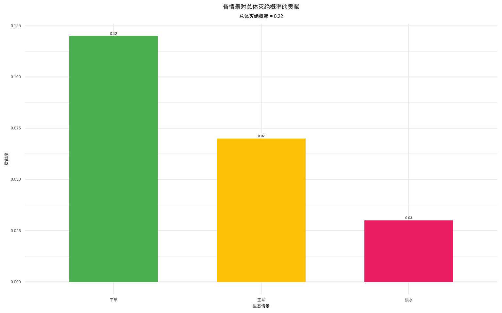
<p class="caption">(\#fig:total-probability)全概率公式应用：各情景对总体灭绝概率的贡献分解。正常情景使用绿色斜线填充，干旱情景使用黄色网格填充，洪水情景使用红色交叉线填充</p>
</div>


**在贝叶斯定理中的应用**：
在贝叶斯定理中，$P(E)$可以通过全概率公式计算：
$$P(E) = P(E|H) \times P(H) + P(E|\neg H) \times P(\neg H)$$
其中符号$\neg H$表示"假设H不成立"，即事件H的补集。

这就得到了贝叶斯定理的完整形式：
$$P(H|E) = \frac{P(E|H) \times P(H)}{P(E|H) \times P(H) + P(E|\neg H) \times P(\neg H)}$$  

**贝叶斯概率的哲学基础**

贝叶斯概率体现了“学习"的本质。我们不是从零开始认识世界，而是基于已有的知识（先验），结合新的观察（证据），不断更新我们的认知（后验）。这种思维方式更接近人类实际的认知过程。

**贝叶斯概率的现实类比**

就像医学诊断：医生基于患者的症状（证据）更新对疾病的判断（假设）。

就像法庭审判：陪审团基于证据不断更新对被告有罪或无罪的信念。

就像天气预报：气象学家基于新的气象数据更新对天气变化的预测。

贝叶斯概率让我们从“静态世界"走向"动态世界"，用不断更新的信念来应对变化的环境。

#### 定义与计算方法

贝叶斯概率的核心是贝叶斯定理，它提供了一个系统的方法来更新概率估计。通过全概率公式，我们得到了贝叶斯定理的完整形式，它考虑了所有可能的情况，确保概率的归一化。

**贝叶斯更新的步骤**

1. **确定先验概率**：基于已有知识或经验，确定对假设的初始信念$P(H)$。

2. **计算似然函数**：评估在假设成立时观察到证据的概率$P(E|H)$。

3. **计算证据概率**：计算观察到证据的总体概率$P(E)$。

4. **计算后验概率**：使用贝叶斯定理更新信念，得到$P(H|E)$。

**先验概率的选择**

在贝叶斯分析中，先验概率的选择具有关键重要性。常用的先验类型包括无信息先验、共轭先验和经验先验。无信息先验适用于缺乏先验知识的情况，为分析提供一个相对中立的起点。共轭先验在数学上能够方便地计算后验分布，简化了贝叶斯更新的计算过程。经验先验则基于历史数据或专家意见，能够将领域知识有机地融入统计模型中。

**贝叶斯定理基础演示**

下面的代码通过一个疾病检测的案例，具体展示了贝叶斯定理的实际应用过程。这个例子很好地说明了即使检测方法具有很高的准确性（灵敏度95%，特异度90%），在患病率较低（5%）的情况下，阳性检测结果对应的实际患病概率可能远低于直觉预期。这种反直觉的结果正是贝叶斯定理的价值所在——它帮助我们避免认知偏差，做出更理性的判断。


``` r
# 贝叶斯定理基础演示：以疾病检测为例展示贝叶斯定理的应用
set.seed(1111)  # 设置随机种子确保结果可重现

# 定义先验概率：基于流行病学知识的初始信念
prior_prob <- 0.05  # 疾病在种群中的患病率（5%）

# 定义检测准确性参数
sensitivity <- 0.95  # 真阳性率：患者被正确检测为阳性的概率
specificity <- 0.90  # 真阴性率：健康者被正确检测为阴性的概率

# 计算边际概率 P(阳性)：检测结果为阳性的总体概率
# 使用全概率公式：P(阳性) = P(阳性|患病)P(患病) + P(阳性|健康)P(健康)
marginal_positive <-  sensitivity * prior_prob +
   (1 - specificity) * (1 - prior_prob)

# 使用贝叶斯定理计算后验概率 P(患病|阳性)
# 公式：P(患病|阳性) = [P(阳性|患病) × P(患病)] / P(阳性)
posterior_prob <- (sensitivity * prior_prob) / marginal_positive
```


```
## 贝叶斯定理基础演示（疾病检测）:
##  先验概率 P(患病): 0.05 
##  检测灵敏度 P(阳性|患病): 0.95 
##  检测特异度 P(阴性|健康): 0.9 
##  边际概率 P(阳性): 0.1425 
##  后验概率 P(患病|阳性): 0.3333
```

#### 生态学中的贝叶斯概率应用

贝叶斯概率在现代生态学研究中越来越重要，以下是几个典型应用：

**物种分布模型**

结合专家知识和观测数据，建立更准确的物种分布预测模型。先验可以反映物种的生态习性，后验则结合了实际的分布数据。


贝叶斯方法在物种分布建模中具有独特优势，能够结合专家知识和观测数据。下面的代码演示了一个完整的贝叶斯物种分布模型，展示了如何将专家对物种栖息地偏好的初始信念（先验）与实际野外观测数据（似然）相结合，通过贝叶斯更新得到更准确的物种分布概率（后验）。如表\@ref(tab:bayesian-species-distribution)所示，该模型清晰地展示了专家先验、观测似然和贝叶斯后验的对比结果。该模型还计算了KL散度来量化信息增益，并使用贝叶斯因子评估证据强度，为生态学家提供了一套完整的贝叶斯分析工具。


``` r
# 贝叶斯物种分布模型
# 演示如何结合专家知识和观测数据更新物种栖息地偏好

# 设置随机种子确保结果可重现
set.seed(1414)

# 定义先验信息：基于专家经验的初始信念
# 专家认为物种偏好森林(60%)、草地(30%)、湿地(10%)
expert_prior <- c(0.6, 0.3, 0.1)
habitat_types <- c("森林", "草地", "湿地")

# 定义观测数据：在不同栖息地中实际发现物种的次数
observations <- c(45, 20, 5)  # 森林45次，草地20次，湿地5次
total_observations <- sum(observations)  # 总观测次数

# 计算似然函数：基于观测数据的条件概率
# 似然 = 各栖息地观测次数 / 总观测次数
likelihood <- observations / total_observations

# 计算证据概率（标准化常数）：使用全概率公式
# 证据 = Σ(先验 × 似然)
evidence <- sum(expert_prior * likelihood)

# 贝叶斯更新：计算后验概率
# 后验 = (先验 × 似然) / 证据
posterior <- (expert_prior * likelihood) / evidence

# 创建结果数据框，便于比较分析
results <- data.frame(
  栖息地类型 = habitat_types,
  专家先验 = round(expert_prior, 3),    # 四舍五入到3位小数
  观测似然 = round(likelihood, 3),      # 四舍五入到3位小数
  贝叶斯后验 = round(posterior, 3)      # 四舍五入到3位小数
)
```

<table class="table" style="margin-left: auto; margin-right: auto;">
<caption>(\#tab:unnamed-chunk-7)(\#tab:bayesian-species-distribution)贝叶斯物种分布模型结果</caption>
 <thead>
  <tr>
   <th style="text-align:left;"> 栖息地类型 | 专家先 </th>
   <th style="text-align:right;"> | 观测似然| 贝 </th>
   <th style="text-align:right;"> 斯后验| </th>
   <th style="text-align:right;">  </th>
  </tr>
 </thead>
<tbody>
  <tr>
   <td style="text-align:left;"> 森林       | </td>
   <td style="text-align:right;"> 0.6| </td>
   <td style="text-align:right;"> 0.643| </td>
   <td style="text-align:right;"> 0.806| </td>
  </tr>
  <tr>
   <td style="text-align:left;"> 草地       | </td>
   <td style="text-align:right;"> 0.3| </td>
   <td style="text-align:right;"> 0.286| </td>
   <td style="text-align:right;"> 0.179| </td>
  </tr>
  <tr>
   <td style="text-align:left;"> 湿地       | </td>
   <td style="text-align:right;"> 0.1| </td>
   <td style="text-align:right;"> 0.071| </td>
   <td style="text-align:right;"> 0.015| </td>
  </tr>
</tbody>
</table>


``` r
# 计算信息增益：使用KL散度量化先验到后验的信息变化
# KL散度 = Σ(后验 × log(后验/先验))
kl_divergence <- sum(posterior * log(posterior / expert_prior))
cat("KL散度（信息增益）:", round(kl_divergence, 4), "\n")
```

```
## KL散度（信息增益）: 0.1171
```

``` r
# 计算贝叶斯因子：比较森林偏好假设的证据强度
# 贝叶斯因子 = (后验优势比) / (先验优势比)
bayes_factor <- (posterior[1] / (1 - posterior[1])) /
  (expert_prior[1] / (1 - expert_prior[1]))
```


```
## 贝叶斯因子（森林偏好）: 2.77
```

```
## 微弱支持物种偏好森林的假设
```


**保护优先级评估**

结合多种证据（如栖息地质量、种群趋势、威胁因素）来评估物种的保护优先级。下面的可视化演示了贝叶斯更新在森林健康评估中的应用，展示了如何基于观测到的树木死亡率证据，从初始的专家信念（先验）更新为更准确的森林健康状态评估（后验）。这种动态更新过程体现了贝叶斯方法在生态监测和评估中的核心优势——能够系统地将新证据整合到现有的知识体系中。

<div class="figure" style="text-align: center">

<p class="caption">(\#fig:bayesian-update)贝叶斯更新过程：森林健康评估中先验信念到后验信念的转变（使用绿色条纹和蓝色网格纹理区分）</p>
</div>


**生态风险评估**

在数据有限的情况下，结合专家判断和有限观测来评估生态风险。上面的可视化使用颜色（绿色/蓝色）和填充纹理（条纹/网格）双重区分先验和后验信念，确保在彩色显示和黑白打印时都能清晰辨识。下面的综合演示展示了贝叶斯方法在生态风险评估和决策分析中的完整应用流程：首先基于历史数据建立初始风险评估（先验），然后结合新的气候异常证据进行贝叶斯更新得到更准确的风险概率（后验），最后基于更新后的风险概率进行成本效益分析，为保护决策提供科学依据。这种将概率更新与决策分析相结合的方法，体现了贝叶斯统计在生态管理实践中的实用价值。


<div class="figure" style="text-align: center">
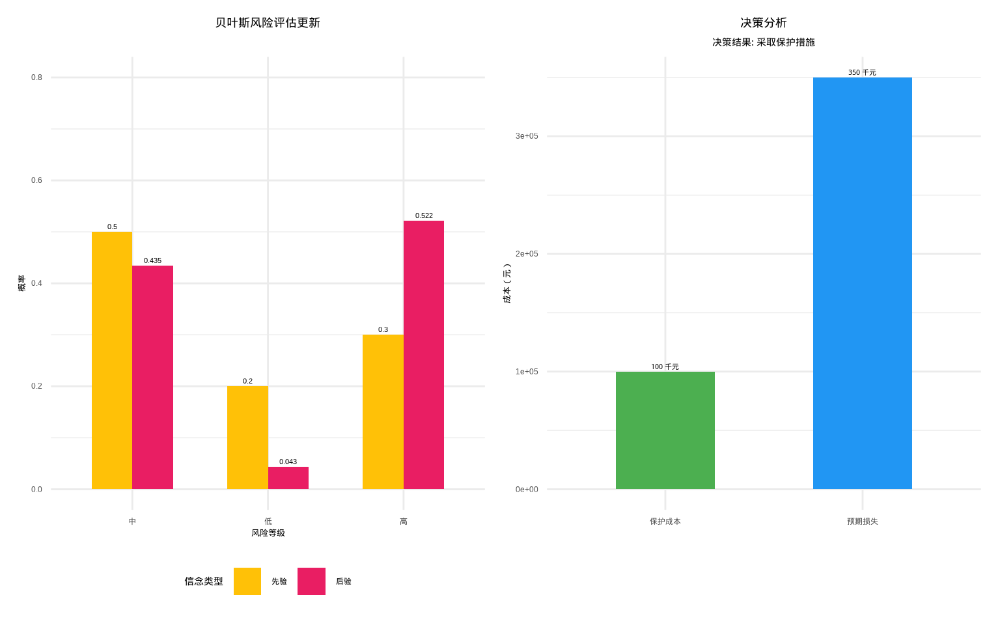
<p class="caption">(\#fig:risk-assessment)贝叶斯风险评估与决策分析：基于新证据的风险概率更新和成本效益决策。先验概率使用黄色实心填充，后验概率使用红色斜线填充；预期损失使用绿色网格填充，保护成本使用蓝色点状填充</p>
</div>


**模型选择与平均**

使用贝叶斯模型平均方法，综合考虑多个竞争模型的预测结果。下面的演示展示了贝叶斯模型比较在生态学中的实际应用：通过比较简化线性模型和复杂季节模型对种群增长数据的拟合效果，使用贝叶斯因子来量化不同模型的证据强度。这种方法不仅考虑模型的拟合优度，还考虑了模型的复杂性，避免了过度拟合问题，为生态学家提供了更可靠的模型选择依据。


<table class="table" style="margin-left: auto; margin-right: auto;">
<caption>(\#tab:unnamed-chunk-11)(\#tab:bayesian-model-comparison)贝叶斯模型比较结果</caption>
 <thead>
  <tr>
   <th style="text-align:left;"> 模型     | </th>
   <th style="text-align:right;"> 型证据| 贝叶斯因 </th>
   <th style="text-align:right;"> | </th>
  </tr>
 </thead>
<tbody>
  <tr>
   <td style="text-align:left;"> 线性模型 | </td>
   <td style="text-align:right;"> 0| </td>
   <td style="text-align:right;"> 1.00| </td>
  </tr>
  <tr>
   <td style="text-align:left;"> 季节模型 | </td>
   <td style="text-align:right;"> 0| </td>
   <td style="text-align:right;"> 3980.76| </td>
  </tr>
</tbody>
</table>

表 \@ref(tab:bayesian-model-comparison) 展示了贝叶斯模型比较的结果，包括线性模型和季节模型的模型证据值以及它们之间的贝叶斯因子，为模型选择提供了定量依据。

<div class="figure" style="text-align: center">
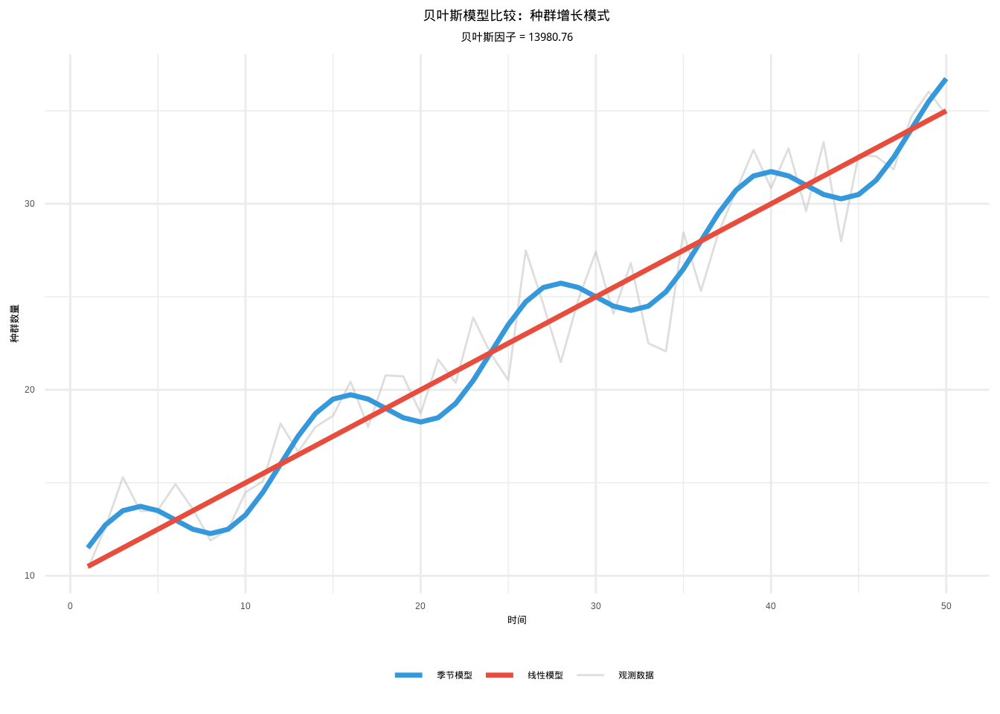
<p class="caption">(\#fig:model-comparison)贝叶斯模型比较：线性模型与季节模型对种群增长模式的拟合效果对比（使用颜色和线型纹理区分）</p>
</div>

**敏感性分析与稳健性检验**

贝叶斯分析的一个重要实践环节是评估结果的稳定性和可靠性。下面的表格展示了两种关键的验证结果：

**敏感性分析表格**显示了不同先验强度下后验均值和标准差的变化。先验强度越大，先验对结果的影响越强。通过观察不同先验强度下的后验结果，我们可以判断分析结论是否对先验选择敏感。

**稳健性检验表格**展示了数据污染比例对后验均值的影响。污染比例越高，异常值对结果的影响越大。这帮助我们评估贝叶斯分析对数据质量问题的抵抗能力。

这些检验确保贝叶斯分析的结论不会过度依赖于特定的先验设定或受到数据质量问题的过度影响，为生态学研究的可靠性提供保障。


<table class="table" style="margin-left: auto; margin-right: auto;">
<caption>(\#tab:unnamed-chunk-14)(\#tab:bayesian-sensitivity-analysis)贝叶斯敏感性分析结果</caption>
 <thead>
  <tr>
   <th style="text-align:right;"> 先验强度| 后验 </th>
   <th style="text-align:right;"> 值| 后验标准差| </th>
   <th style="text-align:right;">  </th>
  </tr>
 </thead>
<tbody>
  <tr>
   <td style="text-align:right;"> 0.1 </td>
   <td style="text-align:right;"> 0.708 </td>
   <td style="text-align:right;"> 0.097 </td>
  </tr>
  <tr>
   <td style="text-align:right;"> 0.5 </td>
   <td style="text-align:right;"> 0.708 </td>
   <td style="text-align:right;"> 0.097 </td>
  </tr>
  <tr>
   <td style="text-align:right;"> 1.0 </td>
   <td style="text-align:right;"> 0.708 </td>
   <td style="text-align:right;"> 0.097 </td>
  </tr>
  <tr>
   <td style="text-align:right;"> 2.0 </td>
   <td style="text-align:right;"> 0.708 </td>
   <td style="text-align:right;"> 0.097 </td>
  </tr>
  <tr>
   <td style="text-align:right;"> 5.0 </td>
   <td style="text-align:right;"> 0.706 </td>
   <td style="text-align:right;"> 0.097 </td>
  </tr>
  <tr>
   <td style="text-align:right;"> 10.0 </td>
   <td style="text-align:right;"> 0.702 </td>
   <td style="text-align:right;"> 0.096 </td>
  </tr>
</tbody>
</table>

表 \@ref(tab:bayesian-sensitivity-analysis) 展示了贝叶斯敏感性分析的结果，通过比较不同先验强度下的后验均值和标准差，揭示了先验信息对贝叶斯推断的影响程度。


<table class="table" style="margin-left: auto; margin-right: auto;">
<caption>(\#tab:unnamed-chunk-17)(\#tab:bayesian-robustness-test)贝叶斯稳健性检验结果</caption>
 <thead>
  <tr>
   <th style="text-align:right;"> 污染比例| 后验 </th>
   <th style="text-align:right;"> 值| </th>
  </tr>
 </thead>
<tbody>
  <tr>
   <td style="text-align:right;"> 0.00 </td>
   <td style="text-align:right;"> 0.539 </td>
  </tr>
  <tr>
   <td style="text-align:right;"> 0.05 </td>
   <td style="text-align:right;"> 0.604 </td>
  </tr>
  <tr>
   <td style="text-align:right;"> 0.10 </td>
   <td style="text-align:right;"> 0.683 </td>
  </tr>
  <tr>
   <td style="text-align:right;"> 0.20 </td>
   <td style="text-align:right;"> 0.804 </td>
  </tr>
  <tr>
   <td style="text-align:right;"> 0.30 </td>
   <td style="text-align:right;"> 0.888 </td>
  </tr>
</tbody>
</table>

表 \@ref(tab:bayesian-robustness-test) 展示了贝叶斯稳健性检验的结果，通过模拟不同污染比例下的后验均值变化，验证了贝叶斯方法对数据污染的鲁棒性。

#### 贝叶斯概率的优势与局限性

贝叶斯概率方法在现代生态学研究中展现出独特的优势。其**灵活性**体现在能够有机地结合先验知识和新的观测证据，这种动态更新的特性使其特别适合处理环境变化和物种适应性研究。通过贝叶斯定理，研究者可以将专家经验、历史数据与最新的实地观察相结合，形成更加全面的认知。**不确定性量化**是贝叶斯方法的另一重要优势，它不仅提供点估计，还能明确表达参数的不确定性范围，这对于生态风险评估和保护决策具有重要意义。在**小样本适用性**方面，贝叶斯方法在数据有限的情况下仍然能够发挥作用，这对于研究稀有物种或难以大规模观察的生态现象尤为宝贵。**模型复杂性处理**能力使贝叶斯方法能够应对生态学中常见的多层次、多变量复杂系统，如考虑个体差异、空间异质性和时间动态的生态模型。最重要的是，贝叶斯方法提供**决策支持**，直接输出决策所需的概率信息，如物种灭绝风险、保护措施效果等，为生态管理提供科学依据。

然而，贝叶斯概率方法也存在不容忽视的局限性。**主观性**是其最受争议的方面，先验概率的选择往往依赖于研究者的主观判断，不同专家可能会给出不同的先验设定。如图\@ref(fig:subjective-bias-demo)所示，不同群体（生态学家、森林管理者、当地社区）对同一生态风险评估给出了显著不同的结果，这凸显了在贝叶斯分析中谨慎处理先验信息的重要性。**计算复杂性**是实际应用中的主要障碍，复杂的贝叶斯模型需要大量的计算资源，特别是使用马尔可夫链蒙特卡洛方法时，计算时间可能相当可观。**先验敏感性**问题意味着结果可能对先验选择高度敏感，不恰当的先验设定可能导致有偏的结论。**收敛问题**是MCMC方法特有的挑战，在复杂模型中可能出现收敛困难或收敛到局部最优解的情况。此外，**解释难度**限制了贝叶斯方法的普及，后验分布的理解和解释需要研究者具备相当的统计背景，这在一定程度上阻碍了其在生态学实践中的广泛应用。这些局限性提示我们在使用贝叶斯方法时需要谨慎处理先验设定，并充分考虑计算可行性和结果解释的清晰性。

<div class="figure" style="text-align: center">
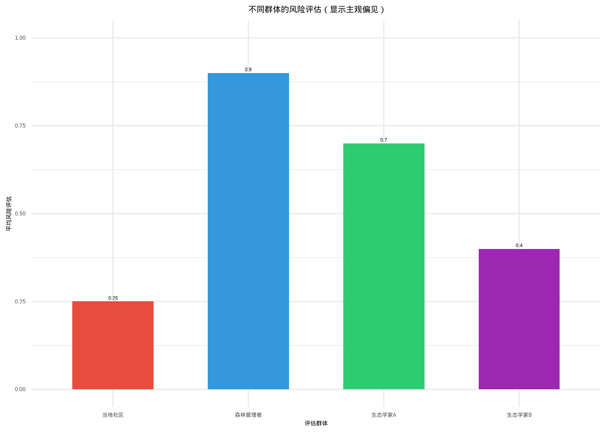
<p class="caption">(\#fig:subjective-bias-demo)主观偏见问题：不同群体对同一生态风险评估的差异（使用颜色和填充纹理区分）</p>
</div>


#### 贝叶斯统计的挑战及解决方案

贝叶斯框架在概念上非常优雅，但在计算上有一个巨大的挑战：**分母 \(P(E)\) 通常极其难以计算。**

\[ P(E) = \int P(E \mid \theta) P(\theta) \, d\theta \]

这个积分在高维空间（即参数\(\theta\)包含多个变量时）往往没有解析解（即无法用公式直接写出结果）。这严重限制了贝叶斯方法的应用，人们只能对那些具有“共轭先验”的特殊模型进行分析（即先验和后验属于同一分布家族，从而可以避开积分计算）。

**所以，问题的核心变成了：如何有效地从复杂的、高维的后验分布 \(P(\theta \mid E)\) 中获取信息（例如，计算均值、方差、分位数等），而无需知道那个讨厌的分母 \(P(E)\)？**

**马尔可夫模拟（MCMC）的核心思想**

MCMC是一类算法的总称，它巧妙地解决了上述挑战。它的核心思想是：

**与其直接计算后验分布，不如我们构造一个马尔可夫链，使其平稳分布恰好就是我们想要的后验分布 \(P(\theta \mid E)\)。然后，我们从这个链中生成大量的样本，用这些样本来近似（模拟）后验分布。**

想象一下，你是一个盲人，想要了解一头大象的形状。这头大象就是贝叶斯统计中的**后验分布**——我们想要了解但无法直接看到的复杂概率分布。

**贝叶斯的难题**：大象的形状太复杂了，你无法用数学公式精确描述它（就像无法直接计算分母P(E)一样）。

**MCMC的解决方案**：你不需要知道大象的精确形状，只需要通过"触摸"来了解它：

1. **马尔可夫链**：你开始在大象周围随机走动，但遵循一个聪明的规则——每次移动时，你更倾向于走向大象"更胖"的区域（高概率区域），而不是"更瘦"的区域（低概率区域）。

2. **蒙特卡洛抽样**：你边走边触摸大象，记录下每个位置的感受。虽然每次触摸只能了解一小部分，但经过成千上万次触摸后，你就能在心中构建出大象的整体形状。

3. **巧妙之处**：你根本不需要知道大象的确切形状！你只需要比较当前位置和下一个位置哪个"更胖"（通过概率比值），这个比值中讨厌的分母P(E)会自动抵消掉。

**结果**：经过足够多的"触摸"后，你收集到的位置样本就精确地反映了大象的真实形状。你可以通过这些样本计算大象的平均高度（后验均值）、宽度（后验方差），甚至画出大象的轮廓（后验分布图）。

就像盲人通过系统性的触摸来了解复杂的大象形状一样，MCMC通过系统性的随机游走来探索复杂的生态学后验分布，让我们能够在不知道精确数学解的情况下，仍然能够对生态系统的参数做出可靠的贝叶斯推断。


我们来用正式的语言分解MCMC这个思想：

1.  **蒙特卡洛（Monte Carlo）**： 泛指通过随机抽样来解决问题的方法。基本思想是：如果你想知道一个分布的属性（比如均值），就从该分布中抽取大量样本，然后计算这些样本的均值。**问题在于**：我们无法直接从复杂的后验分布中抽样。

2.  **马尔可夫链（Markov Chain）**： 这是一个具有“无记忆”性质的随机过程，下一个状态只取决于当前状态，而与过去的状态无关。关键点是，在满足一定条件下，马尔可夫链会收敛到一个唯一的**平稳分布**。这意味着无论链从何处开始，经过足够长的步骤后，它停留在每个状态的概率是固定的。

3.  **MCMC的巧妙结合**：
    **目标**是让后验分布 \(P(\theta \mid E)\) 成为马尔可夫链的平稳分布。**方法**是设计特定的规则（如Metropolis-Hastings算法或Gibbs抽样），来构建这样一个链。这些规则的伟大之处在于，它们在计算时，**分母 \(P(E)\) 会被约掉！** 因为规则中只涉及后验分布的*比值*：
        \[ \frac{P(\theta_{\text{新}} \mid E)}{P(\theta_{\text{旧}} \mid E)} = \frac{\frac{P(E \mid \theta_{\text{新}})P(\theta_{\text{新}})}{P(E)}}{\frac{P(E \mid \theta_{\text{旧}})P(\theta_{\text{旧}})}{P(E)}} = \frac{P(E \mid \theta_{\text{新}})P(\theta_{\text{新}})}{P(E \mid \theta_{\text{旧}})P(\theta_{\text{旧}})} \]
        \(P(E)\) 被完美地消去了。所以我们可以在完全不知道 \(P(E)\) 的情况下，判断是否应该从当前参数 \(\theta_{\text{旧}}\) 移动到新参数 \(\theta_{\text{新}}\)。而具体的判断规则是一个随机决策过程，首先计算接受概率$\alpha = \min \left( 1, \frac{P(E \mid \theta_{\text{新}})P(\theta_{\text{新}})}{P(E \mid \theta_{\text{旧}})P(\theta_{\text{旧}})} \right)$来衡量新参数的相对优势，再从随机分布$U(0,1)$中抽取一个随机数$u$；如果$u \leq \alpha$，则**接受**新参数，否则**拒绝**新参数，链保留在 $\theta_{\text{旧}}$。于是，**整个过程**是参数从某个初始值开始，然后根据规则随机游走。经过一段“预烧期"后，链会收敛到平稳分布。之后产生的样本，虽然彼此相关（因为是马尔可夫链），但可以看作是来自后验分布 \(P(\theta \mid E)\) 的（近似）样本。

**两者的关系——完美的共生**

现在我们可以清晰地描述贝叶斯统计与马尔可夫链蒙特卡洛方法之间的关系。

在**目标与手段的关系**中，贝叶斯统计定义了我们要解决的核心问题——求得后验分布，而MCMC则提供了实现这一目标的计算引擎。没有MCMC的强大计算能力，贝叶斯理论对于许多复杂模型只能停留在“纸上谈兵"的阶段，无法在实际应用中发挥作用。

**计算上的突破**体现在MCMC的出现，特别是在1990年代以后，这成为贝叶斯统计复兴和广泛应用的根本原因。MCMC使得分析者能够自由地构建复杂的、非共轭的、高维的模型，而无需担心无法计算的积分问题。几乎所有现代的贝叶斯软件，如Stan、PyMC和JAGS，其核心计算引擎都基于MCMC算法。

一个典型的**贝叶斯数据分析工作流程**包含三个关键阶段。首先，在模型建立阶段，研究者设定似然函数 \(P(E \mid \theta)\) 和先验分布 \(P(\theta)\)。接着进入计算阶段，使用MCMC算法（如Metropolis-Hastings、Gibbs抽样或Hamiltonian Monte Carlo）从后验分布 \(P(\theta \mid E)\) 中生成大量样本 \(\theta^{(1)}, \theta^{(2)}, ..., \theta^{(N)}\)。最后是推断阶段，利用生成的样本进行蒙特卡洛积分，包括计算后验均值 \(E[\theta \mid E] \approx \frac{1}{N} \sum_{i=1}^N \theta^{(i)}\)、构造后验区间以及生成对新数据的预测。

Table: (\#tab:comparison-of-bayesian-and-mcmc) 贝叶斯统计与MCMC的比较

| 特性 | 贝叶斯统计 | 马尔可夫链蒙特卡洛（MCMC） |
| :--- | :--- | :--- |
| **本质** | **推理框架** | **计算方法** |
| **核心** | 使用贝叶斯定理将先验信念和数据进行结合，更新为后验信念。 | 通过构造一个平稳分布为目标分布的马尔可夫链来进行抽样。 |
| **角色** | 提出“要计算什么”（后验分布）。 | 解决“如何计算”的问题。 |
| **依赖关系** | 理论上不依赖MCMC（例如，可使用共轭先验或变分推断）。 | 通常为贝叶斯计算服务，但其思想也可用于其他领域（如统计物理、优化）。 |

**结论就是：贝叶斯统计为概率建模提供了哲学和理论基础，而马尔可夫模拟（MCMC）则提供了使这个理论在实践中得以实现的强大计算工具。两者相辅相成，共同推动了现代统计学、机器学习和数据科学的发展。**

#### 简单MCMC演示

马尔可夫链蒙特卡洛（MCMC）方法是贝叶斯计算的核心工具：


``` r
# 简单MCMC采样演示
# 实现Metropolis-Hastings算法进行贝叶斯参数估计
simple_mcmc <- function(n_iterations, prior_mean, prior_sd,
                        data, likelihood_sd) {
  # 初始化马尔可夫链：设置初始值和存储变量
  current_value <- prior_mean  # 从先验均值开始
  samples <- numeric(n_iterations)  # 存储所有采样值
  accepts <- 0  # 记录接受次数

  # MCMC主循环：进行n_iterations次迭代
  for (i in 1:n_iterations) {
    # 建议新值：从当前值附近的正态分布中采样
    proposal <- rnorm(1, current_value, 0.1)

    # 计算先验概率：当前值和提议值的先验概率密度
    prior_current <- dnorm(current_value, prior_mean, prior_sd)
    prior_proposal <- dnorm(proposal, prior_mean, prior_sd)

    # 计算似然概率：数据在当前值和提议值下的概率
    likelihood_current <- prod(dnorm(data, current_value, likelihood_sd))
    likelihood_proposal <- prod(dnorm(data, proposal, likelihood_sd))

    # 计算接受概率：Metropolis-Hastings接受率
    acceptance_ratio <- (prior_proposal * likelihood_proposal) /
      (prior_current * likelihood_current)
    acceptance_prob <- min(1, acceptance_ratio)

    # 决定是否接受提议值：基于接受概率随机决定
    if (runif(1) < acceptance_prob) {
      current_value <- proposal  # 接受提议值
      accepts <- accepts + 1     # 增加接受计数
    }

    samples[i] <- current_value  # 存储当前值（接受或拒绝后）
  }

  # 计算接受率：评估MCMC算法的效率
  acceptance_rate <- accepts / n_iterations
  return(list(samples = samples, acceptance_rate = acceptance_rate))
}

# 生成生态测试数据：模拟树木平均高度观测数据
# 真实树木平均高度为15米，观测数据包含随机测量误差
true_value <- 15.0
observed_data <- rnorm(20, true_value, 1.0)

# 运行MCMC采样：使用Metropolis-Hastings算法估计树木高度
# 设置先验分布：均值为10，标准差为5的正态分布
mcmc_result <- simple_mcmc(5000,
  prior_mean = 10, prior_sd = 5,
  data = observed_data, likelihood_sd = 1.0
)
```


```
## MCMC采样结果:
##  接受率: 0.848 
##  后验均值: 14.835 
##  后验标准差: 0.472 
##  真实值: 15 
##  样本均值: 14.92
```


``` r
# 计算95%置信区间：基于后验样本的分位数
ci_lower <- quantile(mcmc_result$samples, 0.025)
ci_upper <- quantile(mcmc_result$samples, 0.975)
cat("95%置信区间: [", round(ci_lower, 3), ", ",
    round(ci_upper, 3), "]\n")
```

```
## 95%置信区间: [ 14.345 ,  15.342 ]
```

#### 从贝叶斯概率到现代数据分析

贝叶斯方法为现代数据分析提供了强大的工具。随着计算技术的发展，马尔可夫链蒙特卡洛（MCMC）等方法使得复杂的贝叶斯模型变得可行。在生态学中，贝叶斯方法已经成为处理不确定性、整合多源数据的重要工具。

总结来说，贝叶斯概率如同生态学家的“学习机器"，让我们能够基于不断积累的证据来更新对自然界的认识。它教会我们"在不确定性中学习"的重要性，培养了我们对知识动态更新的敏感度。当我们面对快速变化的环境和有限的数据时，贝叶斯概率为我们提供了灵活应对不确定性的智慧工具，帮助我们做出更加理性的决策。


## 随机变量与分布

### 随机变量

现在，我想更系统地描述你这只“蚱蜢"的行为。作为一名生态学研究者，我面对的不仅仅是描述性的观察记录，而是需要建立一个能够量化、预测和分析的数学模型。“蚱蜢选择哪种植物进食"这个看似简单的行为，实际上蕴含着复杂的决策过程，受到营养需求、环境因素、个体偏好等多重影响。我需要一个强大的数学工具来捕捉这种不确定性，将模糊的行为模式转化为精确的概率描述。

于是，我引入**随机变量**的概念，将其命名为X。随机变量是概率论中的核心工具，它就像一个数学翻译器，将现实世界中的随机现象转化为数学语言。我精心定义：当X=1时，代表你选择了营养丰富的黑麦草；当X=2时，代表你选择了环境复杂的混合草甸；当X=3时，代表你选择了相对稀少的三叶草。这种编码方式不仅简化了描述，更重要的是为后续的数学分析奠定了基础。

随机变量的奇妙之处在于它的双重性：在每次具体观察之前，X的取值是完全不确定的——它可能是1、2或3中的任意一个，这种不确定性正是生态系统中生物行为的本质特征。然而，这种不确定性并非毫无规律可言。通过长期的观察和数据积累，我发现每个可能的取值都有其特定的发生概率。这种概率分布就像是你行为模式的"数学指纹"，精确地刻画了你在不同环境条件下的选择倾向。如图\@ref(fig:random-variable-demo)所示，通过随机模拟可以直观地展示这种概率分布的实际表现，其中黑麦草被选择的频率最高，三叶草相对较少，这与我们观察到的概率分布一致。随机变量的引入，使我们能够从定性描述迈向定量分析，为理解生物决策机制提供了强有力的数学框架。

<div class="figure" style="text-align: center">
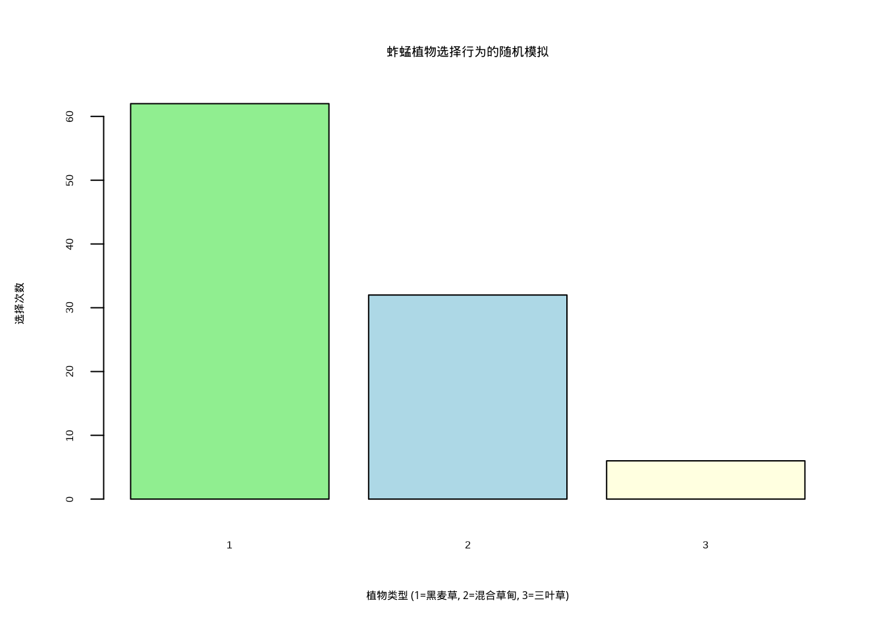
<p class="caption">(\#fig:random-variable-demo)随机变量演示：蚱蜢植物选择行为的概率分布与随机模拟。黑麦草使用浅绿色斜线填充，混合草甸使用浅蓝色网格填充，三叶草使用浅黄色点状填充</p>
</div>


```
## 理论概率分布:
##  黑麦草 (X=1): 0.64 
##  混合草甸 (X=2): 0.29 
##  三叶草 (X=3): 0.07
```

```
## 模拟100次的实际频率:
##  黑麦草 (X=1): 0.62 
##  混合草甸 (X=2): 0.32 
##  三叶草 (X=3): 0.06
```

### 概率分布

接下来，我把随机变量X所有可能的取值及其对应的概率，整理成一张表。

Table: (\#tab:plant-choice-probability) 蚱蜢午餐选择的概率分布

| 随机变量 X 的取值 (植物类型) | 概率 P(X) |
| :--- | :--- |
| 1 (黑麦草) | 0.64 |
| 2 (混合草甸) | 0.29 |
| 3 (三叶草) | 0.07 |

这张表，就构成了一个**概率分布**！它完整地描绘了你的选择偏好全景。它清晰地显示，你最可能去哪（黑麦草），最不可能去哪（三叶草）。

如果我画成柱状图，就得到了一个**概率分布图**，直观地展示了这种"分布"情况。如图\@ref(fig:plant-choice-distribution)所示，通过柱状图可以更直观地看到蚱蜢对三种植物的选择偏好差异：黑麦草的选择概率最高（64%），混合草甸次之（29%），三叶草的选择概率最低（7%）。这种可视化方式让概率分布的特征一目了然，帮助我们更好地理解生物行为模式。

<div class="figure" style="text-align: center">
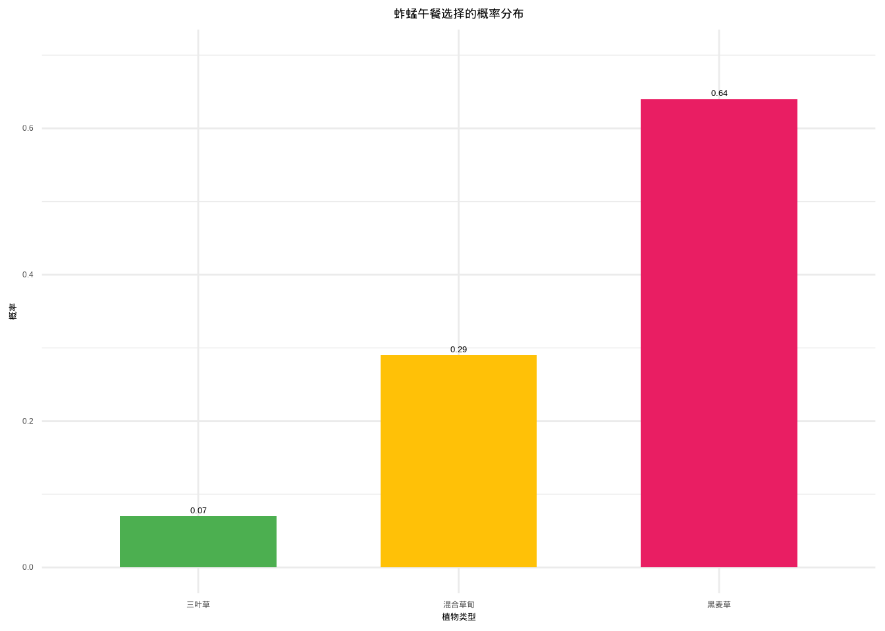
<p class="caption">(\#fig:plant-choice-distribution)蚱蜢午餐选择的概率分布：黑麦草、混合草甸、三叶草的选择概率对比（使用颜色和填充纹理区分）</p>
</div>

### 累积概率分布：从可能性到确定性

除了了解每种植物被选择的概率，我们有时还需要回答这样的问题：“蚱蜢选择黑麦草或混合草甸的概率是多少？"或者”选择价值较低的植物（三叶草）的概率是多少？"这些问题引导我们认识**累积概率分布**。

累积概率分布描述的是随机变量取值小于或等于某个特定值的概率。对于我们的蚱蜢午餐选择问题，我们可以构建如下的累积分布：

Table: (\#tab:plant-choice-cumulative) 蚱蜢午餐选择的累积概率分布

| 随机变量 X 的取值 | 概率 P(X) | 累积概率 F(x) = P(X ≤ x) |
| :--- | :--- | :--- |
| 1 (黑麦草) | 0.64 | 0.64 |
| 2 (混合草甸) | 0.29 | 0.93 |
| 3 (三叶草) | 0.07 | 1.00 |

这里的累积概率告诉我们：

- 蚱蜢选择黑麦草的概率是 0.64；
- 蚱蜢选择黑麦草**或**混合草甸的概率是 0.64 + 0.29 = 0.93；
- 蚱蜢选择任意一种植物的概率是 1.00（必然事件）。

如图\@ref(fig:cumulative-distribution)所示，累积概率分布通过阶梯函数的形式直观地展示了概率的累积过程。这种图形清晰地显示了随着植物类型的增加，累积概率如何逐步上升：从黑麦草的0.64，到混合草甸的0.93，最终达到三叶草的1.00。阶梯函数的跳跃点正好对应着每个植物类型的概率值，让我们能够一目了然地看到"小于等于某个值"的概率是如何累积的。

<div class="figure" style="text-align: center">
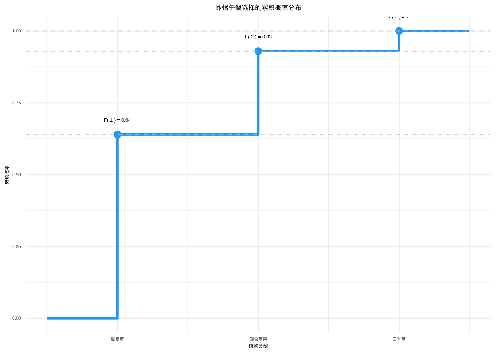
<p class="caption">(\#fig:cumulative-distribution)蚱蜢午餐选择的累积概率分布：阶梯函数展示概率的累积过程</p>
</div>

累积概率分布图呈现为阶梯函数，在每个可能的取值处跳跃，跳跃的高度等于该取值的概率。这种分布特别有用，因为它：

1. **回答区间概率问题**：我们可以直接读出 P(X ≤ 2) = 0.93；
2. **计算任意事件的概率**：P(X > 2) = 1 - P(X ≤ 2) = 1 - 0.93 = 0.07；
3. **提供决策支持**：如果我们想知道"蚱蜢选择营养价值较高的植物（黑麦草或混合草甸）的概率"，累积分布直接给出了答案：0.93。

在生态学中，累积概率分布广泛应用于风险评估、资源分配决策和种群管理策略制定。

**R语言中的概率分布函数家族**

R为各种概率分布提供了完整的函数家族，每个分布都包含四类核心函数：

- d*: 概率密度/质量函数 (density) - 计算特定取值的概率密度或质量  
- p*: 累积分布函数 (probability) - 计算小于等于某值的累积概率  
- q*: 分位数函数 (quantile) - 根据概率值反推对应的分位数  
- r*: 随机数生成函数 (random) - 从该分布中生成随机样本  

例如，对于正态分布：

- dnorm(x, mean, sd)    # 概率密度函数 - 计算x处的概率密度  
- pnorm(q, mean, sd)    # 累积分布函数 - 计算P(X ≤ q)的概率  
- qnorm(p, mean, sd)    # 分位数函数 - 计算累积概率为p时的分位数  
- rnorm(n, mean, sd)    # 随机数生成 - 生成n个服从正态分布的随机数  

这种统一的命名约定使得在R中学习和使用各种分布变得非常直观。生态学家可以轻松地进行概率计算、统计推断和随机模拟。

Table: (\#tab:plant-choice-distribution) 蚱蜢午餐选择的概率分布函数家族

| 分布类型 | 生态学应用场景 | R函数前缀 | 主要参数 |
| :--- | :--- | :--- | :--- |
| 二元选择分布 | 生物行为的是/否决策 | `binom` | 试验次数、成功概率 |
| 计数分布 | 种群数量、事件发生次数 | `pois` | 平均发生率 |
| 等待时间分布 | 生物事件间隔时间 | `geom`, `nbinom` | 成功概率、目标次数 |
| 多元选择分布 | 多物种竞争、资源分配 | `multinom` | 试验次数、各类概率 |
| 连续分布 | 生物体尺寸、环境变量 | `norm`, `unif` | 均值、标准差等 |

这些分布函数为生态学研究提供了强大的数学工具，帮助我们量化自然界的随机现象。

## 午餐菜单：离散随机变量的分布家族

我们已经成功地为蚱蜢的午餐偏好创建了一个数学模型。我们定义了一个随机变量X，它就像一个聪明的代理人，将“吃哪种植物”这个文字问题，转化成了“X等于1，2，还是3？”这个数学问题。

离散型随机变量的核心特征就是：它的可能取值是有限个或可数的无限个（就像整数一样，可以一个一个数出来）。蚱蜢的选择（1，2，3）就是有限的、分立的点，而不是连续的光滑区间。我们整理出的那张概率表格，正是这个随机变量的概率分布。它如同一份“行为密码”，精确地告诉我们这只蚱蜢的习性。

不过，自然界的奥秘在于，许多看似不同的行为背后，可能隐藏着同一种“底层法则”。接下来，就让我们认识几位在生态学中无处不在的离散分布“明星”。


### 伯努利分布：一个“是"或“否"的终极问题

**故事开端：** 现在，我不再关心蚱蜢具体吃了三种植物中的哪一种，而是问一个更简单的问题：它这次进食是否选择了黑麦草？ 结果只有两种：“是"（成功）或 “否"（失败）。这种简化的视角让我们能够专注于最本质的二元选择问题。

**数学定义：** 伯努利分布是描述单次伯努利试验结果的概率分布。伯努利试验具有三个基本特征：

1. 每次试验只有两种可能的结果（成功/失败）；
2. 每次试验中成功的概率$p$保持不变；
3. 各次试验相互独立。

**概率函数表达式：** 伯努利分布的概率质量函数为：

$$P(X = x) = \begin{cases}
p & \text{如果 } x = 1 \\
1-p & \text{如果 } x = 0
\end{cases}$$

或者更简洁地表示为：
$$P(X = x) = p^x(1-p)^{1-x}, \quad x = 0,1$$

其中，$X$是伯努利随机变量，$p$是成功的概率（$0 \leq p \leq 1$）。

如图\@ref(fig:bernoulli-distribution)所示，伯努利分布通过分面图的形式直观地展示了不同成功概率下的二元选择概率分布。该图清晰地显示了当成功概率$p$分别为0.2、0.5、0.8时，成功与失败两种结果的概率如何变化。这种可视化帮助我们理解伯努利分布的核心特征：对于任何给定的成功概率$p$，失败的概率总是$1-p$，且两者之和始终为1。


<div class="figure" style="text-align: center">
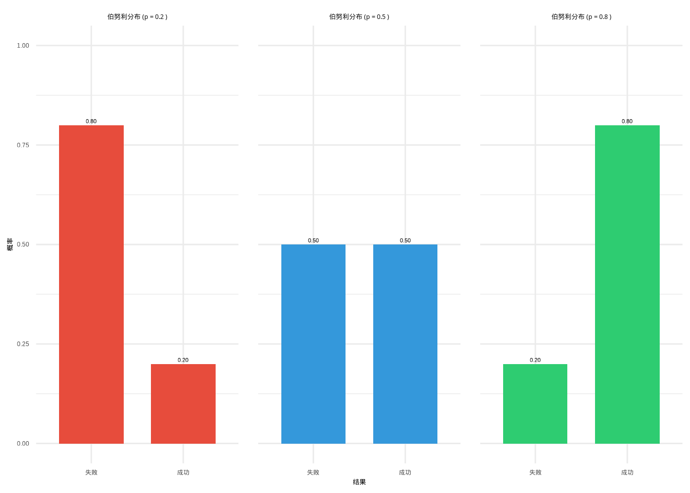
<p class="caption">(\#fig:bernoulli-distribution)伯努利分布：不同成功概率下的二元选择概率分布（使用颜色和填充纹理区分）</p>
</div>

**生态学肖像：**

伯努利分布在生态学中无处不在，它描述的是那些具有二元结局的自然现象。在生态系统的各个层面，我们都能观察到这种简单的二元选择模式：一颗种子是否发芽，一只雏鸟能否成功活到离巢，一次野外调查中样方里是否出现目标物种，一只昆虫是否被天敌捕食，或者一片叶子是否被昆虫取食。这些看似简单的“是"或”否"问题，实际上构成了生态学中最基本的概率单元。

**生态学意义：**

伯努利分布虽然简单，但它是构建更复杂生态学模型的基础。许多重要的生态学分布，如二项分布、几何分布、负二项分布等，都是建立在多次独立伯努利试验的基础之上。理解伯努利分布有助于我们量化二元生态过程，将定性的生态现象转化为可量化的概率；建立基准模型，为更复杂的生态模型提供理论基础；进行统计推断，基于二元数据估计生态过程的参数；以及评估生态事件发生的可能性。

伯努利分布的美妙之处在于它的简洁性和普适性。尽管生态系统的复杂性远超简单的二元选择，但通过将复杂问题分解为基本的伯努利试验，我们能够逐步建立起理解自然界的数学模型框架。

### 二项分布：重复“是非题"的计数法则

**故事延续：** 现在，我连续观察蚱蜢的10次进食选择。每一次选择，都是一个独立的伯努利试验（是否吃黑麦草）。我关心的问题是：在这10次观察中，它总共有多大概率有恰好7次选择了黑麦草？或者，至少有8次？这种从单次试验扩展到多次试验的视角，引导我们认识二项分布。

**数学定义：** 二项分布描述的是在$n$次独立的伯努利试验中，成功次数$k$的概率分布。二项试验满足以下条件：

1. 试验由$n$次相同的伯努利试验组成
2. 每次试验只有两种可能的结果（成功/失败）
3. 每次试验的成功概率$p$保持不变
4. 各次试验相互独立

**概率函数表达式：** 二项分布的概率质量函数为：

$$P(X = k) = \binom{n}{k} p^k (1-p)^{n-k}, \quad k = 0, 1, 2, \ldots, n$$

其中：

- $X$是二项随机变量，表示成功的次数
- $n$是试验总次数
- $k$是成功次数
- $p$是每次试验的成功概率
- $\binom{n}{k} = \frac{n!}{k!(n-k)!}$是二项系数

**分布特性：**

- 期望值：$E[X] = np$
- 方差：$Var(X) = np(1-p)$
- 当$p=0.5$时，分布对称；当$p<0.5$时右偏，$p>0.5$时左偏

如图\@ref(fig:binomial-distribution)所示，二项分布通过分面图的形式直观地展示了不同成功概率下多次试验中成功次数的概率分布。该图清晰地显示了当试验次数$n=10$固定时，成功概率$p$分别为0.2、0.5、0.8时的概率分布特征：当$p=0.5$时分布对称，当$p=0.2$时分布右偏（成功次数集中在较小值），当$p=0.8$时分布左偏（成功次数集中在较大值）。这种可视化帮助我们理解二项分布的形状如何随成功概率的变化而变化。

<div class="figure" style="text-align: center">
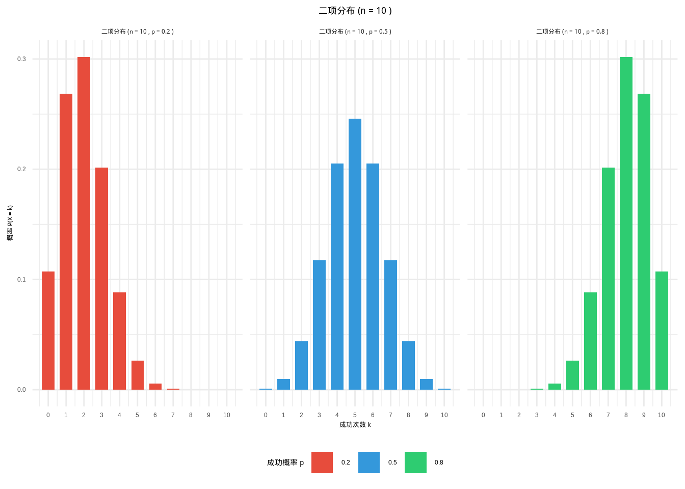
<p class="caption">(\#fig:binomial-distribution)二项分布：不同成功概率下多次试验中成功次数的概率分布（使用颜色和填充纹理区分）</p>
</div>

**生态学肖像：**

二项分布在生态学中广泛应用于计数型数据的建模。当我们播种100颗同种种子时，最终成功发芽的数量$k$服从二项分布，其中$n=100$，$p$代表种子的发芽率。从一个大种群中随机捕获并标记50只动物，放回后再次随机捕获50只，其中被标记个体的数量$k$也服从二项分布，这正是标记重捕法的理论核心。在一片森林中，随机选择的100棵树中有病害的树木数量同样遵循二项分布规律。一次生态调查中，在50个样方中发现目标物种的样方数量，以及一个鸟类种群中在繁殖季节成功孵化的雏鸟数量，都可以用二项分布来精确描述。

**生态学意义：**

二项分布是伯努利分布的自然扩展，它将单次二元事件的概率模型推广到多次独立试验的计数模型。在生态学研究中，二项分布具有广泛的应用价值。例如，在种群估计中，二项分布为标记重捕法提供了理论基础，帮助精确估计种群大小；在患病率研究中，它能够量化疾病在种群中的传播程度；在物种分布分析中，二项分布可用于描述物种在特定区域的出现概率；在繁殖成功率评估中，它为衡量物种的繁殖表现提供了科学依据；在抽样设计优化中，二项分布指导合理确定生态调查的样本大小。二项分布的优势在于其数学简洁性和适用广泛性，使得复杂的生态计数问题能够通过基本的概率计算得到解决，为生态学研究提供了强有力的量化工具。

### 多项式分布：多元选择的“全景图"

**故事视角扩展：** 二项分布处理的是“是/否"的二元选择，但生态学中我们常常面临更复杂的多元选择。回到蚱蜢的午餐选择，现在我想知道：在10次进食观察中，它恰好有6次选择黑麦草、3次选择混合草甸、1次选择三叶草的概率是多少？这种对多个类别同时计数的需求，引导我们认识多项式分布。

**数学定义：** 多项式分布是二项分布向多个类别的自然推广，描述的是在$n$次独立试验中，每个类别出现特定次数的联合概率分布。多项式试验满足以下条件：

1. 每次试验有$k$个可能的结果（类别）
2. 每个结果发生的概率分别为$p_1, p_2, \ldots, p_k$，且$\sum_{i=1}^k p_i = 1$
3. 各次试验相互独立
4. 试验结果互斥且完备

**概率函数表达式：** 多项式分布的概率质量函数为：

$$P(X_1 = x_1, X_2 = x_2, \ldots, X_k = x_k) = \frac{n!}{x_1! x_2! \cdots x_k!} p_1^{x_1} p_2^{x_2} \cdots p_k^{x_k}$$

其中：

- $X_i$表示第$i$个类别出现的次数
- $x_i$是第$i$个类别的实际观察次数，且$\sum_{i=1}^k x_i = n$
- $n$是总的试验次数
- $p_i$是第$i$个类别发生的概率
- $\frac{n!}{x_1! x_2! \cdots x_k!}$是多项式系数

**分布特性：**

- 每个类别的边际分布都是二项分布：$X_i \sim \text{Binomial}(n, p_i)$
- 期望值：$E[X_i] = np_i$
- 方差：$Var(X_i) = np_i(1-p_i)$
- 协方差：$Cov(X_i, X_j) = -np_i p_j$（$i \neq j$）
- 当$k=2$时，多项式分布退化为二项分布

如图\@ref(fig:multinomial-distribution)所示，多项式分布通过分面图的形式直观地展示了蚱蜢10次观察中不同植物选择组合的概率分布。该图清晰地显示了四种典型组合模式（6-3-1、5-4-1、7-2-1、4-4-2）的概率分布，其中每种组合都满足黑麦草、混合草甸、三叶草选择次数之和为10。这种可视化帮助我们理解多项式分布如何描述多类别事件的联合概率分布，以及不同组合模式对应的概率差异。

<div class="figure" style="text-align: center">
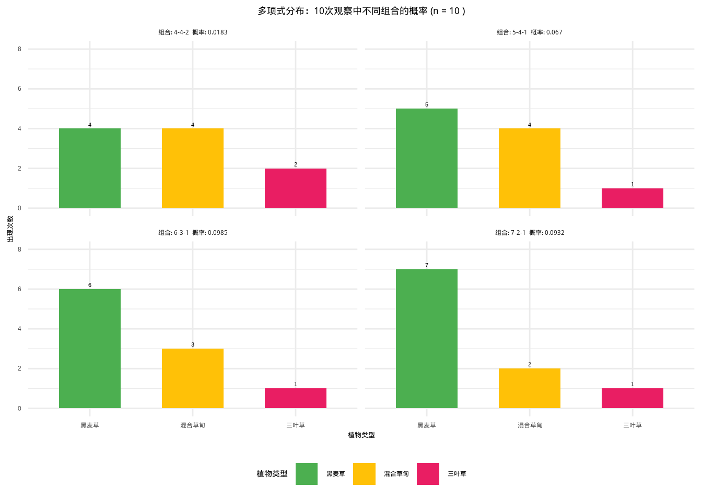
<p class="caption">(\#fig:multinomial-distribution)多项式分布：蚱蜢10次观察中不同植物选择组合的概率分布。黑麦草使用绿色斜线填充，混合草甸使用蓝色网格填充，三叶草使用黄色点状填充</p>
</div>

**生态学肖像：**

多项式分布在生态学中广泛应用于多类别计数数据的建模。一片森林中不同树种幼苗数量的联合分布能够描述植物群落的组成结构；一次鸟类调查中不同物种出现次数的联合概率可以分析鸟类群落的多样性模式；一个湖泊中不同浮游生物类群数量的分布有助于研究水生生态系统的营养结构；一次昆虫采集样本中不同科属昆虫数量的分布能够量化昆虫群落的分类组成；一个动物种群的年龄结构分布则可以分析种群动态的多类别特征。

**生态学意义：**

多项式分布是生态学中描述多变量计数数据的核心工具，它帮助我们在群落生态学中量化物种组成的联合概率分布，在多样性研究中分析多物种共存模式的概率特征，在资源分配中研究生物对不同资源的选择偏好，在种群结构中描述年龄、性别等多类别特征的分布，以及在生态监测中设计多变量生态调查的统计框架。多项式分布的美妙之处在于它能够同时捕捉多个生态类别的联合分布模式，为我们理解生态系统的复杂性和多样性提供了全面的数学框架。

### 泊松分布：罕见事件的“低语者"

**故事新篇：** 这次，我不固定观察次数，而是固定观察时间。我坐在草地上，用一个小时的时间，记录下这只蚱蜢做出剧烈警戒性跳跃的次数。这种跳跃并不频繁，可能一次，可能两次，也可能一次都没有。在一个很短的时间间隔内，发生一次跳跃的概率很小，且事件彼此独立。这种对稀有事件计数的需求，引导我们认识泊松分布。

**数学定义：** 泊松分布描述的是在单位时间间隔、单位面积或单位体积内，稀有事件发生次数的概率分布。泊松过程满足以下条件：

1. 事件在任意小的时间间隔内发生的概率与时间间隔长度成正比
2. 在不相交的时间间隔内，事件发生次数相互独立
3. 事件在任意时间点发生的概率相同（平稳性）
4. 在极短时间间隔内，发生两次或以上事件的概率可以忽略

**概率函数表达式：** 泊松分布的概率质量函数为：

$$P(X = k) = \frac{\lambda^k e^{-\lambda}}{k!}, \quad k = 0, 1, 2, \ldots$$

其中：

- $X$是泊松随机变量，表示事件发生的次数
- $\lambda$是单位时间（或单位面积/体积）内事件发生的平均次数
- $k$是实际观察到的事件次数
- $e$是自然对数的底（约等于2.71828）

**分布特性：**

- 期望值：$E[X] = \lambda$
- 方差：$Var(X) = \lambda$（期望等于方差是泊松分布的重要特征）
- 当$\lambda$较小时，分布右偏；当$\lambda$增大时，分布逐渐接近正态分布
- 泊松分布是二项分布在$n \to \infty$，$p \to 0$，且$np = \lambda$时的极限情况

为了直观展示泊松分布的特性，图\@ref(fig:poisson-distribution)生成了不同平均发生率$\lambda$值下的概率分布可视化。清晰地展示了随着$\lambda$增大，分布形态从右偏逐渐趋于对称的过程，直观验证了泊松分布的数学特性。

<div class="figure" style="text-align: center">
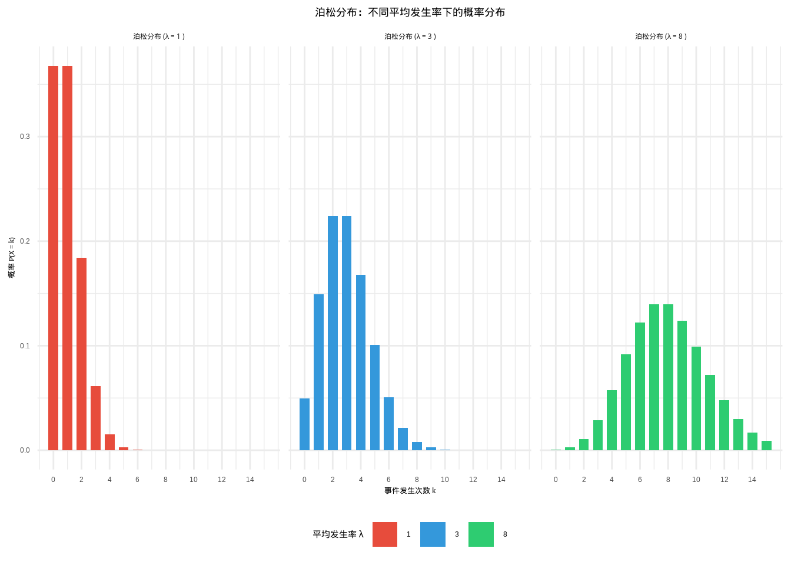
<p class="caption">(\#fig:poisson-distribution)泊松分布：不同平均发生率下稀有事件发生次数的概率分布（使用颜色和填充纹理区分）</p>
</div>

**生态学肖像：**

泊松分布在生态学中广泛应用于稀有事件和空间分布的研究。一平方米的森林样地中某种珍稀兰花的株数能够描述稀有物种的空间分布模式；一台红外相机在一天内拍摄到某种神秘夜行兽的次数可以监测稀有动物的活动频率；一毫升海水中的浮游生物数量有助于量化微生物的密度分布；一片草原上单位面积内某种昆虫的巢穴数量能够研究昆虫的空间分布模式；一个湖泊中特定时间段内鱼类跃出水面的次数则可以记录稀有行为的发生频率。

**生态学意义：**

泊松分布是生态学中描述随机分布模式的重要工具，它帮助我们在物种分布研究中判断物种在空间上是否随机分布，通过单位面积内的个体数估计总体密度，在行为生态学中量化稀有行为的发生频率，在保护生物学中评估稀有物种的分布状况，以及在生态监测中设计合理的监测方案和样本大小。

泊松分布的美妙之处在于它用一个简单的参数$\lambda$就描述了复杂生态现象的概率规律，为我们理解自然界的随机性提供了简洁而强大的数学工具。

### 几何分布：等待“第一次成功"的耐心

**故事视角转换：** 想象现在是清晨，蚱蜢开始了它的第一次觅食。我好奇的是：它需要尝试多少次，才能第一次成功吃到它最爱的黑麦草？ 也许第一次就成功了（X=1），也许前两次都去了别处，第三次才成功（X=3）。这种对“第一次成功"等待时间的关注，引导我们认识几何分布。

**数学定义：** 几何分布描述的是在一系列独立的伯努利试验中，首次获得成功所需要的试验次数。几何分布满足以下条件：

1. 试验由一系列相同的伯努利试验组成
2. 每次试验只有两种可能的结果（成功/失败）
3. 每次试验的成功概率$p$保持不变
4. 各次试验相互独立
5. 试验持续进行直到第一次成功出现

**概率函数表达式：** 几何分布的概率质量函数为：

$$P(X = k) = (1-p)^{k-1} p, \quad k = 1, 2, 3, \ldots$$

其中：

- $X$是几何随机变量，表示首次成功所需的试验次数
- $k$是试验次数（$k \geq 1$）
- $p$是每次试验的成功概率
- $(1-p)^{k-1}$表示前$k-1$次都失败的概率

**分布特性：**

- 期望值：$E[X] = \frac{1}{p}$
- 方差：$Var(X) = \frac{1-p}{p^2}$
- 无记忆性：$P(X > m+n \mid X > m) = P(X > n)$，即过去的失败不影响未来的成功概率
- 当$p$较小时，分布右偏严重；当$p$接近1时，分布集中在较小的$k$值

为了直观展示几何分布的特性，图\@ref(fig:geometric-distribution)通过R代码生成了不同成功概率$p$值下的概率分布可视化。清晰地展示了随着成功概率$p$增大，分布形态从右偏严重逐渐向左侧集中的过程，直观验证了"成功概率越高，等待时间越短"的几何分布特性。

<div class="figure" style="text-align: center">
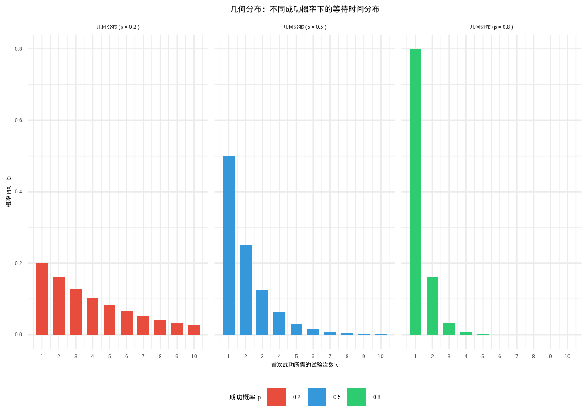
<p class="caption">(\#fig:geometric-distribution)几何分布：不同成功概率下首次成功所需试验次数的概率分布（使用颜色和填充纹理区分）</p>
</div>

**生态学肖像：**

几何分布在生态学中常用以描述“等待时间"和“首次成功"的过程，具有广泛的应用。一只捕食者需要巡视多少个洞穴才能首次发现猎物，这可以量化捕食效率；一只传粉昆虫需要访问多少朵花才能首次成功采集花蜜，这有助于研究传粉行为的成功率；一颗种子需要经历多少个雨季才能首次成功萌发，这能够揭示种子萌发的环境依赖性；一只候鸟需要尝试多少次才能首次找到正确的迁徙路线，这可以分析学习行为的适应性；一个植物种群需要经过多少代才能首次出现抗病突变，这为研究进化过程中的关键事件提供了数学工具。

**生态学意义：**

几何分布是生态学中描述“等待过程"的重要工具，它帮助我们在行为生态学中量化动物行为的效率和成功率，在种群动态中分析种群恢复和重建的时间过程，在进化生态学中研究适应性特征的进化时间尺度，在保护生物学中评估濒危物种恢复的可能性，以及在生态恢复中预测生态系统恢复所需的时间。

几何分布的美妙之处在于它用一个简单的参数$p$就描述了复杂生态过程中的等待时间规律，特别是其“无记忆性"特征，使得我们可以专注于当前的生态过程而不受历史影响。

### 负二项分布：等待“最后一次成功"的耐心

**故事视角深化：** 几何分布关注的是“第一次成功"，但生态学中我们常常需要更复杂的等待模式。比如，我想知道：这只蚱蜢需要尝试多少次，才能**第三次**成功吃到黑麦草？这种对“第r次成功"等待时间的关注，引导我们认识负二项分布。

**数学定义：** 负二项分布描述的是在一系列独立的伯努利试验中，获得第r次成功所需要的试验次数。负二项分布满足以下条件：

1. 试验由一系列相同的伯努利试验组成
2. 每次试验只有两种可能的结果（成功/失败）
3. 每次试验的成功概率$p$保持不变
4. 各次试验相互独立
5. 试验持续进行直到第r次成功出现

**概率函数表达式：** 负二项分布的概率质量函数为：

$$P(X = k) = \binom{k-1}{r-1} p^r (1-p)^{k-r}, \quad k = r, r+1, r+2, \ldots$$

其中：

- $X$是负二项随机变量，表示第r次成功所需的试验次数
- $k$是总的试验次数（$k \geq r$）
- $r$是期望的成功次数
- $p$是每次试验的成功概率
- $\binom{k-1}{r-1}$是组合数，表示前$k-1$次试验中安排$r-1$次成功的方式数

**分布特性：**

- 期望值：$E[X] = \frac{r}{p}$
- 方差：$Var(X) = \frac{r(1-p)}{p^2}$
- 当$r=1$时，负二项分布退化为几何分布
- 分布形状取决于$r$和$p$的值，可以呈现不同的偏斜形态

为了直观展示负二项分布的特性，图\@ref(fig:negative-binomial)展示了不同参数组合下的概率分布。图中清晰地呈现了四种参数组合（$r=2, p=0.3$；$r=2, p=0.6$；$r=5, p=0.3$；$r=5, p=0.6$）对应的概率分布形态。可以观察到：当成功概率$p$较低时（0.3），分布向右偏斜，需要更多试验次数才能达到第$r$次成功；当成功概率$p$较高时（0.6），分布向左集中，所需试验次数较少。同时，随着成功次数目标$r$的增加，分布向右移动且变得更加分散，直观验证了负二项分布作为几何分布推广的数学特性。

<div class="figure" style="text-align: center">
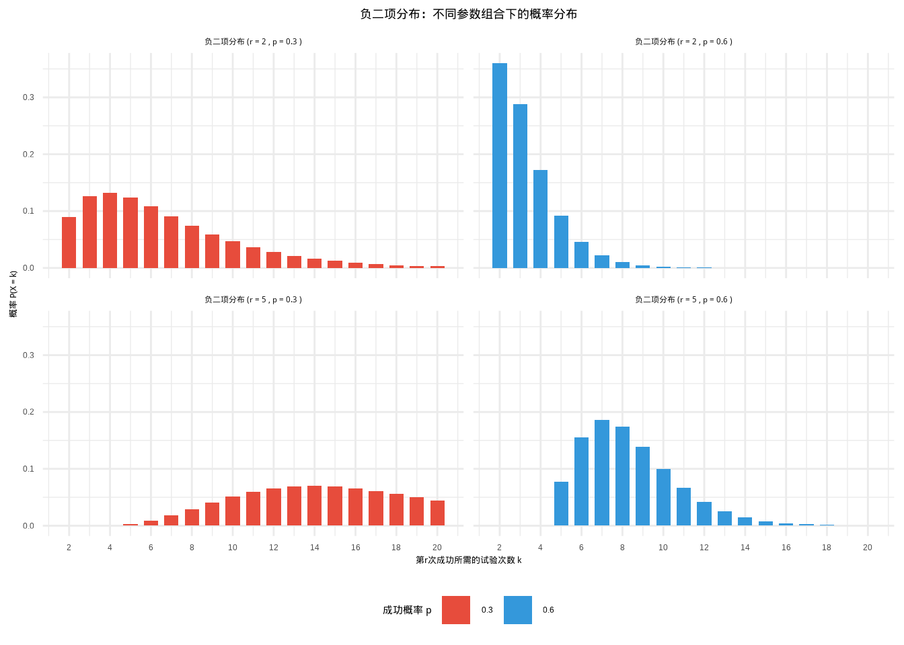
<p class="caption">(\#fig:negative-binomial)负二项分布：不同参数组合下第r次成功所需试验次数的概率分布（使用颜色和填充纹理区分）</p>
</div>

**生态学肖像：**

负二项分布在生态学中广泛应用于需要多次成功才能达到目标的场景。一只捕食者需要捕获多少只猎物才能满足其能量需求（第r次成功捕食），这描述了捕食效率的累积效应。一个植物种群需要经过多少代才能积累到足够的有利突变（第r次有利突变），这有助于分析进化过程的累积性。一次生态调查需要设置多少个样方才能第r次发现目标稀有物种，这有助于优化稀有物种监测方案。一个生态系统需要经历多少次干扰才会达到第r次显著的结构变化，这有助于研究生态系统的累积响应。一个保护项目需要实施多少项措施才能第r次观察到种群恢复迹象，这有助于评估保护措施的有效性。

**生态学意义：**

负二项分布是几何分布的自然推广，它将单次成功的等待时间模型扩展到多次成功的累积等待时间模型。在生态学研究中，负二项分布帮助我们：

1. **资源管理**：预测达到特定资源积累目标所需的时间或努力
2. **种群监测**：设计合理的监测方案来发现稀有物种
3. **保护规划**：评估保护措施实施的时间框架和效果
4. **进化研究**：分析适应性特征积累的时间尺度
5. **风险评估**：评估生态系统达到临界状态所需的干扰次数

负二项分布的美妙之处在于它能够描述生态系统中"累积成功"的复杂模式，为我们理解生态过程的渐进性和累积性提供了有力的数学工具。


## 午餐法则：连续随机变量的分布家族

**从跳跃到体长：描绘连续世界的概率地图**

我们已经为蚱蜢的“午餐选择"绘制了一张清晰的概率分布图，那是由一根根独立的柱子组成的，因为它的选择是分门别类的（植物A、B、C）。这类变量被称为离散型随机变量，它们的取值是可数的。

但现在，让我们拿起尺子和高速摄像机，关注一些更细微、更流畅的特征。比如，这只蚱蜢的体长是多少厘米？或者它受到惊吓时，一次跳跃的距离是多少米？这些数值，可以是3.15厘米，也可以是3.151厘米，甚至在理论上可以是3.1515926...厘米。它们的取值充满了无限的可能性，充满了**连续性**。

连续型随机变量的核心特征就是：它的可能取值构成一个连续的区间，无法一一列举。在生态学中，绝大多数测量值都是连续的——温度、湿度、海拔、生物量、生长速率等等。这些变量构成了我们对自然界的量化认知基础。

**从柱子到光滑的曲线：概率密度函数**

当我们面对这样一个连续型随机变量时，之前那种“给每个特定值分配一个概率"的方法就失效了。因为任何一个精确值的概率（比如P(体长=3.15厘米)）在无限的可能性面前，都几乎等于零！这就像问“在一根无限长的线上，恰好选中某个点的概率是多少？"——答案是零。

那么，我们该如何描述它的概率分布呢？聪明的做法是，我们不再关心“点"的概率，而是关心“区间"的概率。我们问的是：“这只蚱蜢的体长在3.1厘米到3.2厘米之间的概率是多少？" 这时，概率就不再是柱子的高度，而是曲线下某一块区域的面积。

这条至关重要的曲线，就叫做**概率密度函数** 曲线。曲线本身在任意一点的高度（概率密度）并不直接代表概率，但它决定了概率的大小：曲线越高、越“胖"的区域，对应的区间概率就越大。曲线下的总面积，被定义为1，代表了所有可能性的总和（100%）。

**数学定义：** 对于连续随机变量X，其概率密度函数$f(x)$满足：

1. 非负性：$f(x) \geq 0$ 对所有$x$
2. 规范性：$\int_{-\infty}^{\infty} f(x) dx = 1$
3. 区间概率：$P(a \leq X \leq b) = \int_a^b f(x) dx$

**累积分布函数：连续世界的“阶梯"**

与离散随机变量类似，连续随机变量也有其累积分布函数，定义为：

$$F(x) = P(X \leq x) = \int_{-\infty}^x f(t) dt$$

累积分布函数$F(x)$给出了随机变量取值小于或等于$x$的概率。它具有以下重要性质：

1. 单调不减：如果$x_1 < x_2$，则$F(x_1) \leq F(x_2)$
2. 边界条件：$\lim_{x \to -\infty} F(x) = 0$，$\lim_{x \to \infty} F(x) = 1$
3. 右连续性：$F(x)$在任意点$x$处右连续

通过累积分布函数，我们可以方便地计算各种概率：

- $P(a < X \leq b) = F(b) - F(a)$
- $P(X > x) = 1 - F(x)$

为了直观理解概率密度函数与累积分布函数的关系，图\@ref(fig:continuous-pdf-cdf)展示了标准正态分布下PDF和CDF的对比。左侧的概率密度函数（PDF）呈现经典的钟形曲线，曲线下的面积代表概率，其中蓝色填充区域直观展示了特定区间内的概率大小。右侧的累积分布函数（CDF）呈现S形曲线，从0单调递增到1，每个点的函数值表示随机变量取值小于或等于该点的概率。通过对比这两个图形，可以清晰地看到PDF曲线下的面积如何累积形成CDF曲线，以及CDF的单调性和边界条件如何体现连续随机变量的概率特性。

<div class="figure" style="text-align: center">
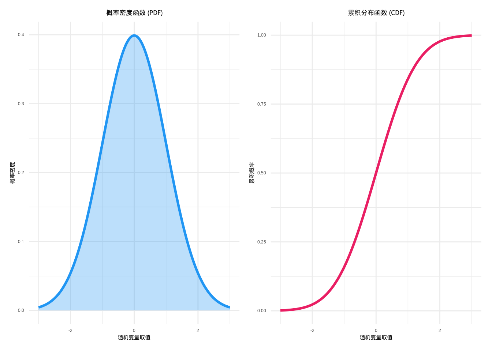
<p class="caption">(\#fig:continuous-pdf-cdf)连续随机变量的概率密度函数与累积分布函数对比</p>
</div>


在连续变量的世界里，有几个声名显赫的“家族"，它们以特定的形态描绘了不同自然现象背后的概率规律。每个分布都有其独特的数学特性和生态学意义，共同构成了我们理解连续生态变量的工具箱。

### 均匀分布：纯粹的平等

**故事引入：** 想象这只蚱蜢找到了一片巨大且质地均匀的叶子，它准备开始享用午餐。这片叶子从叶尖到叶柄的长度是10厘米。蚱蜢会随机选择一个位置开始进食。它第一口吃的位置到叶尖的距离是多少厘米？可能是2厘米，也可能是5厘米，或者8厘米，每个距离被选中的可能性完全相同。这种“完全随机"的选择过程，就是均匀分布的典型场景。

**数学定义：** 均匀分布描述的是在区间$[a, b]$内，所有取值等可能出现的概率分布。其概率密度函数为：

$$f(x) = \begin{cases}
\frac{1}{b-a} & \text{如果 } a \leq x \leq b \\
0 & \text{其他}
\end{cases}$$

**分布特性：**

- 期望值：$E[X] = \frac{a+b}{2}$
- 方差：$Var(X) = \frac{(b-a)^2}{12}$
- 在区间$[a, b]$内，概率密度恒定

**生态学肖像：**

在生态学研究中，均匀分布具有重要的应用价值。在觅食行为研究中，蚱蜢在均匀资源上的随机选择行为服从均匀分布。当食物资源分布均匀时，动物的觅食位置选择可以建模为均匀分布。在行为生态学实验中，动物的随机选择行为可以用均匀分布来描述，这为理解生物在理想化环境中的决策模式提供了理论基准。

为了直观展示均匀分布的特性，图\@ref(fig:uniform-distribution)展示了三种不同区间参数下的概率密度函数。图中清晰地呈现了均匀分布的核心特征：在定义区间内概率密度为常数，区间外概率密度为零。三个分布分别展示了不同区间参数的影响：U(0,1)为标准均匀分布，概率密度为1；U(-2,2)为较宽区间，概率密度降低为0.25；U(1,3)为偏移区间，概率密度为0.5。通过对比可以直观理解均匀分布的"等可能性"特性，以及区间宽度与概率密度的反比关系。

<div class="figure" style="text-align: center">
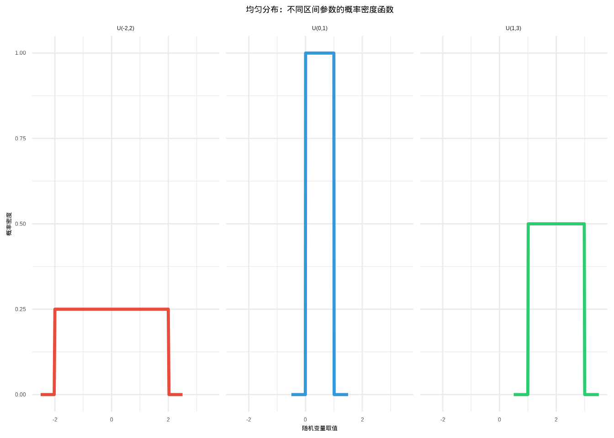
<p class="caption">(\#fig:uniform-distribution)均匀分布：不同区间参数下的概率密度函数（使用颜色和线型纹理区分）</p>
</div>

### 指数分布：等待的艺术

**故事引入：** 现在让我们关注时间维度。这只蚱蜢正在草地上专心享用午餐，但它必须时刻保持警惕。下一次被天敌（如鸟类）发现需要等待多长时间？可能是几分钟，也可能是几十分钟。这种“等待被捕食"的时间间隔，正是指数分布的用武之地。在蚱蜢的午餐过程中，这种生存威胁的随机出现模式可以用指数分布来精确描述。

**数学定义：** 指数分布描述的是泊松过程中事件发生的时间间隔。其概率密度函数为：

$$f(x) = \lambda e^{-\lambda x}, \quad x \geq 0$$

其中$\lambda > 0$是速率参数，表示单位时间内事件发生的平均次数。

**分布特性：**

- 期望值：$E[X] = \frac{1}{\lambda}$
- 方差：$Var(X) = \frac{1}{\lambda^2}$
- **无记忆性**：$P(X > s + t \mid X > s) = P(X > t)$，即过去的等待不影响未来的等待时间
- 分布呈右偏，具有长尾特征

**生态学肖像：**

指数分布在生态学中有着广泛的应用价值。它能够描述蚱蜢在觅食过程中被捕食者发现的等待时间，反映捕食事件的随机性特征，因而可用于捕食风险建模。指数分布的无记忆性特性尤为重要，它表明过去的等待时间不会影响未来的风险概率，这为生存策略研究提供了理论基础，有助于我们深入理解蚱蜢的警戒行为模式。在行为时间模式分析中，指数分布可以用来描述动物在危险环境中的活动间隔，捕捉它们在风险环境中的行为节律。在种群生存分析领域，特别是在高捕食压力的环境下，个体的生存时间分布通常近似于指数分布。这种特性为研究种群动态和制定保护策略提供了重要的数学工具。

为了直观展示指数分布的特性，图\@ref(fig:exponential-distribution)展示了三种不同速率参数下的概率密度函数。图中清晰地呈现了指数分布的核心特征：右偏形态和指数衰减模式。三个分布分别展示了不同速率参数的影响：Exp(λ=0.5)为低速率分布，曲线下降缓慢，表示事件发生频率较低，等待时间较长；Exp(λ=1)为中等速率分布；Exp(λ=2)为高速率分布，曲线急剧下降，表示事件发生频繁，等待时间较短。通过对比可以直观理解指数分布的"无记忆性"特性，以及速率参数与等待时间期望值的反比关系。

<div class="figure" style="text-align: center">

<p class="caption">(\#fig:exponential-distribution)指数分布：不同速率参数下等待时间的概率密度函数（使用颜色和线型纹理区分）</p>
</div>

### 正态分布（高斯分布）：自然界的“钟形"法则

**故事引入：** 仔细观察这只蚱蜢的午餐习惯，你会发现每次它吃的食物量（如叶片面积或花蜜量）存在自然的变异。大部分情况下，它吃的量都集中在某个平均值附近，极端过多或过少的摄食行为相对少见。这种“中间多，两头少"的分布模式，就是正态分布的典型特征。蚱蜢的摄食行为受到多种微小因素的共同影响，最终呈现出这种经典的钟形分布。

**数学定义：** 正态分布的概率密度函数为：

$$f(x) = \frac{1}{\sqrt{2\pi}\sigma} e^{-\frac{(x-\mu)^2}{2\sigma^2}}, \quad -\infty < x < \infty$$

其中$\mu$是均值（决定分布的中心位置），$\sigma$是标准差（决定分布的离散程度）。

**分布特性：**

- 期望值：$E[X] = \mu$
- 方差：$Var(X) = \sigma^2$
- 对称性：分布关于均值$\mu$对称
- 68-95-99.7法则：约68%的数据落在$\mu \pm \sigma$内，95%落在$\mu \pm 2\sigma$内，99.7%落在$\mu \pm 3\sigma$内
- 中心极限定理：大量独立同分布的随机变量的和（或均值）近似服从正态分布

**生态学肖像：**

正态分布在生态学研究中扮演着重要角色。在摄食行为研究中，蚱蜢每次进食的食物量服从正态分布，这种分布模式反映了其稳定的摄食行为特征和生理调节机制。通过营养摄入分析，我们可以利用正态分布来描述个体间的摄食量差异，这种差异模式有助于理解种群内部的资源分配和竞争关系。在行为生态学领域，动物的许多连续行为特征，如觅食时间、移动距离等，往往近似正态分布，这为行为模式的量化分析提供了数学基础。在种群能量学研究中，通过摄食量的正态分布特征，我们可以更准确地估计种群的能量摄入模式，为生态系统能量流动研究提供重要依据。

为了直观展示正态分布的特性，图\@ref(fig:normal-distribution)展示了三种不同参数组合下的概率密度函数。图中清晰地呈现了正态分布的核心特征：经典的钟形曲线和对称性。三个分布分别展示了参数变化的影响：N(0,1)为标准正态分布，呈现理想的钟形形态；N(0,4)为标准差增大的分布，曲线更加扁平分散，体现了标准差对分布离散程度的影响；N(2,1)为均值右移的分布，曲线整体向右平移，体现了均值对分布中心位置的决定作用。图中使用颜色（红色/蓝色/绿色）和线型纹理（实线/虚线/点线）双重区分，确保在彩色显示和黑白打印时都能清晰辨识。通过对比可以直观理解正态分布参数的意义，以及68-95-99.7法则在分布形态中的体现。

<div class="figure" style="text-align: center">
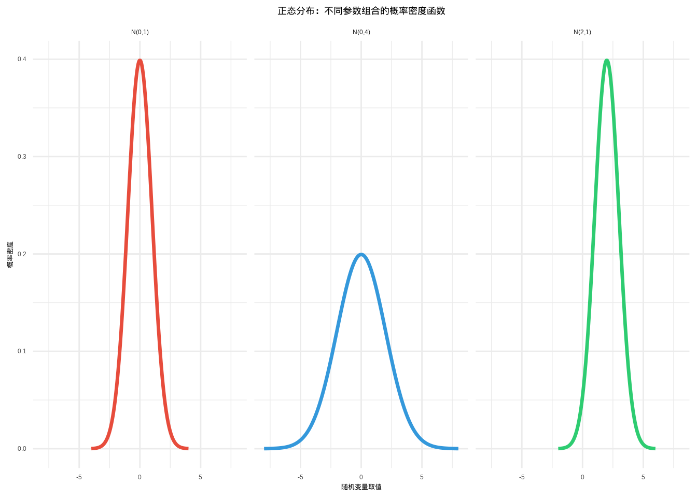
<p class="caption">(\#fig:normal-distribution)正态分布：不同参数组合下的概率密度函数（使用颜色和线型纹理区分）</p>
</div>


### 威布尔分布：生存分析的“时间法则"

**故事引入：** 观察这只蚱蜢的生存历程，你会发现它的死亡风险并非一成不变。在生命的早期，由于适应环境的能力较弱，死亡风险相对较高；进入成年期后，风险逐渐稳定；而到了老年期，由于生理机能衰退，死亡风险又会显著上升。这种随时间变化的死亡风险模式，正是威布尔分布能够精确描述的。蚱蜢的生存时间受到多种风险因素的综合影响，最终呈现出这种“浴盆曲线"的风险特征。

**数学定义：** 威布尔分布的概率密度函数为：

$$f(x) = \frac{k}{\lambda} \left(\frac{x}{\lambda}\right)^{k-1} e^{-(x/\lambda)^k}, \quad x \geq 0$$

其中$k$是形状参数（决定分布形态），$\lambda$是尺度参数（决定分布范围）。

**分布特性：**

- 期望值：$E[X] = \lambda \Gamma(1 + 1/k)$
- 方差：$Var(X) = \lambda^2 [\Gamma(1 + 2/k) - \Gamma^2(1 + 1/k)]$
- 生存函数：$S(x) = e^{-(x/\lambda)^k}$
- 风险函数：$h(x) = \frac{k}{\lambda} \left(\frac{x}{\lambda}\right)^{k-1}$
- 当$k=1$时退化为指数分布（恒定风险）
- 当$k>1$时风险随时间增加（老化效应）
- 当$k<1$时风险随时间减少（早期适应期）

**生态学肖像：**

威布尔分布在生态学研究中具有重要的应用价值。在生存分析研究中，蚱蜢的生存时间服从威布尔分布，这种分布能够精确反映其生命周期中风险变化的动态模式，包括早期适应期的高风险和老年期的生理衰退。通过威布尔分布，我们可以在种群动态建模中更准确地估计种群的死亡率模式和期望寿命，为种群管理提供科学依据。在保护生物学领域，濒危物种的生存时间分析有助于制定有效的保护策略，威布尔分布的风险函数能够揭示不同生命阶段的保护重点。此外，在物候学研究中，植物开花时间、动物迁徙时间等时间事件的分析也可以借助威布尔分布来描述其时间分布特征。  


为了直观展示威布尔分布的特性，图\@ref(fig:weibull-distribution)展示了蚱蜢生存时间分布的直方图与理论曲线的对比。图中浅蓝色直方图显示了模拟的蚱蜢生存时间数据分布，红色实线为理论威布尔分布的概率密度曲线，蓝色虚线为生存函数曲线。通过对比可以直观验证模拟数据与理论分布的拟合程度，同时生存函数曲线清晰地展示了蚱蜢种群随时间递减的生存概率，体现了威布尔分布在生存分析中的实际应用价值。

<div class="figure" style="text-align: center">
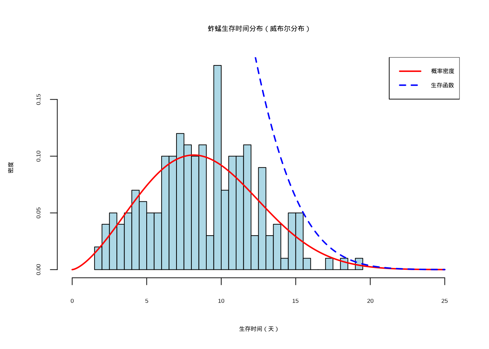
<p class="caption">(\#fig:weibull-distribution)威布尔分布可视化：蚱蜢生存时间分布的直方图与理论曲线对比。概率密度函数使用红色实线，生存函数使用蓝色虚线</p>
</div>

<table class="table" style="margin-left: auto; margin-right: auto;">
<caption>(\#tab:unnamed-chunk-23)(\#tab:weibull-parameter-estimation)威布尔分布参数估计结果</caption>
 <thead>
  <tr>
   <th style="text-align:left;">  </th>
   <th style="text-align:right;"> x </th>
  </tr>
 </thead>
<tbody>
  <tr>
   <td style="text-align:left;"> shape </td>
   <td style="text-align:right;"> 2.706697 </td>
  </tr>
  <tr>
   <td style="text-align:left;"> scale </td>
   <td style="text-align:right;"> 9.885058 </td>
  </tr>
</tbody>
</table>

表 \@ref(tab:weibull-parameter-estimation) 展示了通过最大似然估计得到的威布尔分布参数估计结果，包括形状参数和尺度参数的点估计值、标准误和置信区间。

为了深入理解威布尔分布形状参数对分布形态和风险模式的影响，图\@ref(fig:weibull-shape-comparison)展示了四种不同形状参数下概率密度函数与风险函数的对比。图中四个子图分别对应形状参数k=0.5、1、2、3的情况，每个子图中深红色实线为概率密度曲线，蓝色虚线为风险函数曲线。通过对比可以清晰地观察到：当k<1时（如k=0.5），风险函数随时间递减，体现早期适应期的高风险特征；当k=1时，风险函数为常数，威布尔分布退化为指数分布；当k>1时（如k=2、3），风险函数随时间递增，体现老化效应。这种可视化直观地展示了威布尔分布在描述不同风险模式时的灵活性。

<div class="figure" style="text-align: center">
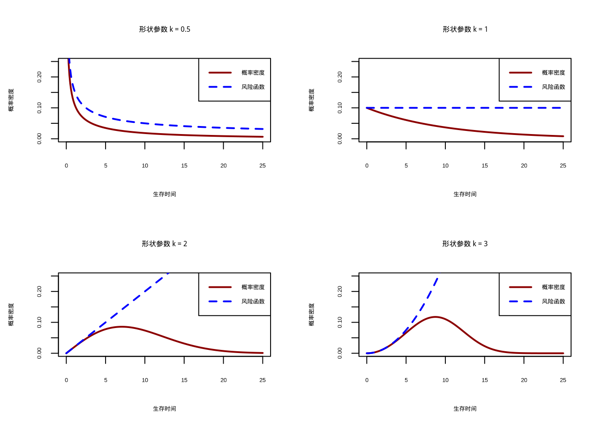
<p class="caption">(\#fig:weibull-shape-comparison)不同形状参数的威布尔分布比较：概率密度函数与风险函数的四种模式对比。概率密度函数使用深红色实线，风险函数使用蓝色虚线</p>
</div>


### 伽马分布：更一般的等待时间模型

**故事引入：** 指数分布描述了“第一次事件发生"的等待时间，但如果我们需要描述“第r次事件发生"的等待时间呢？比如，这只蚱蜢需要等待多久才能完成第三次成功的觅食？伽马分布提供了这个问题的答案。

**数学定义：** 伽马分布的概率密度函数为：

$$f(x) = \frac{\beta^\alpha}{\Gamma(\alpha)} x^{\alpha-1} e^{-\beta x}, \quad x > 0$$

其中$\alpha > 0$是形状参数，$\beta > 0$是速率参数，$\Gamma(\alpha)$是伽马函数。

**分布特性：**

- 期望值：$E[X] = \frac{\alpha}{\beta}$
- 方差：$Var(X) = \frac{\alpha}{\beta^2}$
- 当$\alpha = 1$时，伽马分布退化为指数分布
- 当$\alpha$为整数时，伽马分布描述的是第$\alpha$次泊松事件发生的等待时间
- 分布形状灵活，可以呈现不同的偏斜形态

**生态学肖像：**

伽马分布在生态学中广泛应用于描述累积过程和增长模式。在行为生态学中，伽马分布能够精确描述完成多次成功行为所需的总时间，如捕食者需要捕获多只猎物才能满足能量需求的过程。在生物量积累研究中，伽马分布适用于建模植物生长和动物体重增加的渐进过程，这些过程往往呈现累积性特征。在环境生态学中，特定时间段内的降雨量分布可以用伽马分布来描述，这种分布能够捕捉降水事件的累积效应。在种群动态研究中，伽马分布能够刻画在一定时间内种群数量的累积增长模式，为理解种群扩张过程提供数学工具。

为了直观展示伽马分布的特性，图\@ref(fig:gamma-distribution)展示了三种不同参数组合下的概率密度函数。图中清晰地呈现了伽马分布作为指数分布一般化形式的特征：Gamma(1,1)退化为指数分布，呈现右偏形态，描述第一次事件等待时间；Gamma(2,1)为中等形状分布，曲线更加对称，描述第二次事件等待时间；Gamma(3,2)为复杂形状分布，曲线更加集中，描述第三次事件等待时间。通过对比可以直观理解伽马分布形状参数α对分布形态的影响，以及伽马分布在描述累积等待时间过程中的灵活性。

<div class="figure" style="text-align: center">

<p class="caption">(\#fig:gamma-distribution)伽马分布：不同参数组合下的概率密度函数。Gamma(1,1)使用红色实线，Gamma(2,1)使用蓝色虚线，Gamma(3,2)使用绿色点线</p>
</div>

### 贝塔分布：比例变量的天然选择

**故事引入：** 在蚱蜢的日常生活中，时间分配是一个重要的生态学问题。这只蚱蜢在一天24小时中，用于觅食（午餐和其他进食）的时间比例是多少？可能是30%，也可能是60%，这个比例值总是在0和1之间。贝塔分布是描述这类比例变量的理想选择，它能够灵活地刻画蚱蜢在不同环境条件下时间分配模式的多样性。

**数学定义：** 贝塔分布的概率密度函数为：

$$f(x) = \frac{x^{\alpha-1}(1-x)^{\beta-1}}{B(\alpha, \beta)}, \quad 0 \leq x \leq 1$$

其中$\alpha > 0$和$\beta > 0$是形状参数，$B(\alpha, \beta)$是贝塔函数。

**分布特性：**

- 期望值：$E[X] = \frac{\alpha}{\alpha + \beta}$
- 方差：$Var(X) = \frac{\alpha\beta}{(\alpha+\beta)^2(\alpha+\beta+1)}$
- 分布形状极其灵活，可以呈现U形、J形、钟形等多种形态
- 当$\alpha = \beta = 1$时，贝塔分布退化为均匀分布
- 贝塔分布是二项分布和伯努利分布的共轭先验

**生态学肖像：**

贝塔分布在生态学中具有广泛的应用价值，特别适合描述比例变量的分布特征。在行为生态学中，贝塔分布能够精确刻画蚱蜢一天中用于觅食、休息、警戒等不同行为的时间比例分配模式。这种分布同样适用于建模蚱蜢对不同植物种类的资源选择偏好，通过比例值反映其选择倾向的强度。在能量预算分析方面，贝塔分布帮助研究者通过时间分配比例来深入探讨蚱蜢的能量摄入与消耗平衡机制。贝塔分布的灵活性使其特别适合描述动物在不同环境条件下的适应性行为调整，能够捕捉行为模式随环境变化的动态特征。

为了直观展示贝塔分布的特性，图\@ref(fig:beta-distribution)展示了三种不同参数组合下的概率密度函数。图中清晰地呈现了贝塔分布在[0,1]区间内的形态多样性：Beta(0.5,0.5)为U形分布，两端概率密度高，表示极端值更可能，体现行为选择的极端倾向；Beta(2,2)为对称钟形分布，中心概率密度高，表示中间值更可能，体现行为选择的平衡模式；Beta(5,1)为右偏分布，右侧概率密度高，表示高比例值更可能，体现行为选择的偏向性。通过对比可以直观理解贝塔分布形状参数对分布形态的灵活控制能力。

<div class="figure" style="text-align: center">
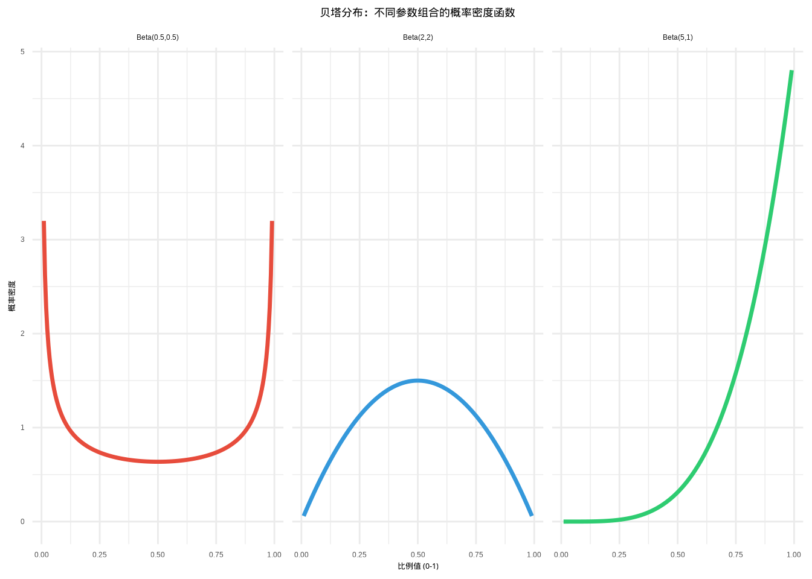
<p class="caption">(\#fig:beta-distribution)贝塔分布：不同参数组合下的概率密度函数。Beta(0.5,0.5)使用红色实线，Beta(2,2)使用蓝色虚线，Beta(5,1)使用绿色点线</p>
</div>

### 正态分布的魔力：中心极限定理

在我们探索蚱蜢午餐行为的过程中，正态分布以其优雅的钟形曲线给我们留下了深刻印象。但正态分布的真正魔力远不止于此——它拥有一个被称为"统计学的魔法石"的非凡性质：**中心极限定理**。这个定理解释了为什么正态分布在自然界和统计学中无处不在，即使原始数据本身并不服从正态分布。

#### 什么是中心极限定理

**中心极限定理**（Central Limit Theorem, CLT）是概率论和统计学中最重要的定理之一。它的核心思想可以概括为：

> 无论原始总体的分布形态如何，只要样本量足够大，样本均值的抽样分布就会近似服从正态分布。

更精确地说，中心极限定理指出：

- 从任意分布（无论是什么形状）的总体中随机抽取样本
- 计算每个样本的均值
- 当样本量$n$足够大时（通常$n \geq 30$），这些样本均值的分布将近似正态分布
- 这个正态分布的均值等于总体均值$\mu$，标准差等于总体标准差$\sigma$除以$\sqrt{n}$

**数学表达：**
如果$X_1, X_2, \ldots, X_n$是来自均值为$\mu$、方差为$\sigma^2$的总体的独立同分布随机变量，那么当$n \to \infty$时：

$$\frac{\bar{X} - \mu}{\sigma/\sqrt{n}} \xrightarrow{d} N(0, 1)$$

其中$\bar{X} = \frac{1}{n}\sum_{i=1}^n X_i$是样本均值，$\xrightarrow{d}$表示依分布收敛。

为了直观验证中心极限定理的强大效果，图\@ref(fig:central-limit-theorem)展示了四种不同总体分布下样本均值的正态收敛过程。图中四个子图分别对应均匀分布、指数分布、伽马分布和贝塔分布四种原始总体分布，每个子图都显示了样本量为30时10000次模拟得到的样本均值分布。浅蓝色直方图表示样本均值的实际分布，红色曲线为理论正态分布。可以清晰地观察到，尽管原始分布形态各异（均匀分布为矩形、指数分布和伽马分布为右偏、贝塔分布为左偏），但它们的样本均值分布都呈现出优美的钟形正态分布形态，完美验证了中心极限定理的核心思想。

<div class="figure" style="text-align: center">
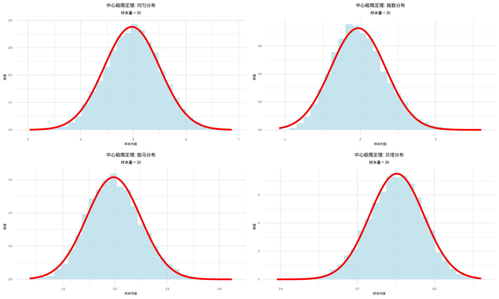
<p class="caption">(\#fig:central-limit-theorem)中心极限定理演示：不同总体分布下样本均值的正态收敛过程</p>
</div>


```
## 中心极限定理正态性检验结果:
##  均匀分布样本均值Kolmogorov-Smirnov p值: 0.9917 
##  指数分布样本均值Kolmogorov-Smirnov p值: 0 
##  伽马分布样本均值Kolmogorov-Smirnov p值: 0.0014 
##  贝塔分布样本均值Kolmogorov-Smirnov p值: 0.0179
```

#### 样本量对中心极限定理的影响

为了深入理解样本量在中心极限定理中的作用，图\@ref(fig:clt-sample-size)展示了从指数分布（典型的非正态总体）中抽样时，不同样本量对样本均值分布的影响。图中五个子图分别对应样本量5、10、30、50、100的情况。可以清晰地观察到：当样本量较小时（如n=5），样本均值分布仍呈现明显的右偏形态，与原始指数分布相似；随着样本量增大，分布逐渐变得更加对称和集中；当样本量达到30时，分布已接近正态形态；当样本量达到100时，分布呈现出完美的钟形正态分布。这一可视化结果直观地验证了中心极限定理中"样本量足够大"的重要性，以及样本量越大、正态近似越精确的规律。

<div class="figure" style="text-align: center">
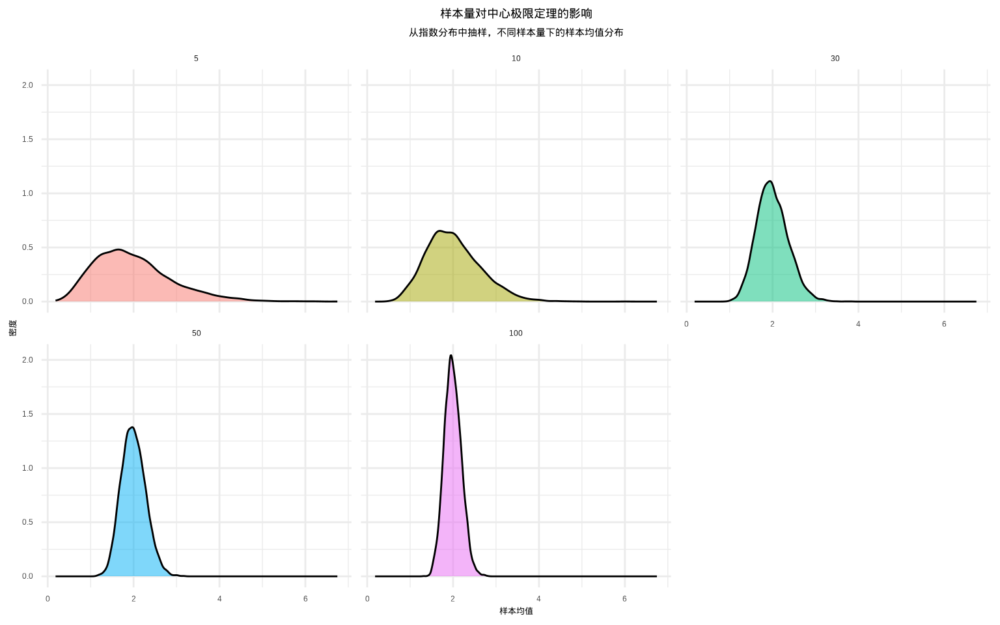
<p class="caption">(\#fig:clt-sample-size)样本量对中心极限定理的影响：样本量越大，样本均值分布越接近正态</p>
</div>

表 \@ref(tab:skewness-kurtosis) 展示了不同样本量下样本均值分布的偏度和峰度值，这些数值量化了分布形态随样本量增加而趋向正态分布的过程。

<table class="table" style="margin-left: auto; margin-right: auto;">
<caption>(\#tab:unnamed-chunk-25)(\#tab:skewness-kurtosis)偏度和峰度随样本量的变化</caption>
 <thead>
  <tr>
   <th style="text-align:right;"> SampleSize </th>
   <th style="text-align:right;"> Skewness </th>
   <th style="text-align:right;"> Kurtosis </th>
  </tr>
 </thead>
<tbody>
  <tr>
   <td style="text-align:right;"> 5 </td>
   <td style="text-align:right;"> 0.8974114 </td>
   <td style="text-align:right;"> 4.109759 </td>
  </tr>
  <tr>
   <td style="text-align:right;"> 10 </td>
   <td style="text-align:right;"> 0.6504552 </td>
   <td style="text-align:right;"> 3.732605 </td>
  </tr>
  <tr>
   <td style="text-align:right;"> 30 </td>
   <td style="text-align:right;"> 0.4054190 </td>
   <td style="text-align:right;"> 3.315501 </td>
  </tr>
  <tr>
   <td style="text-align:right;"> 50 </td>
   <td style="text-align:right;"> 0.2691500 </td>
   <td style="text-align:right;"> 3.072610 </td>
  </tr>
  <tr>
   <td style="text-align:right;"> 100 </td>
   <td style="text-align:right;"> 0.2423726 </td>
   <td style="text-align:right;"> 3.087874 </td>
  </tr>
</tbody>
</table>

#### 蚱蜢午餐中的中心极限定理

在蚱蜢的生态研究中，中心极限定理展现出其强大的应用价值。虽然单个蚱蜢的摄食量可能呈现偏斜分布，但当我们随机抽取30只蚱蜢并计算其平均摄食量，多次重复这一抽样过程后，样本均值的分布将呈现完美的钟形曲线。同样，蚱蜢的觅食时间虽受多种因素影响而分布不规则，但通过中心极限定理，我们能够基于样本均值可靠地估计整个种群的
  平均觅食时间。即使蚱蜢对植物的选择偏好本身不是正态分布，当我们研究多个样本的平均偏好时，结果也会趋于正态分布。这些生态学场景生动地展示了中心极限定理如何将复杂的个体变异转化为可预测的统计规律，为生态学研究提供了坚实的理论基础。

#### 中心极限定理的生态学意义

中心极限定理为生态学研究提供了坚实的理论支撑，确保了统计推断的可靠性。即使我们不知道总体的真实分布，通过样本均值来估计总体参数时，这种估计的误差分布是正态的，这为参数估计提供了数学保障。许多常用的统计检验方法，如t检验和方差分析，都建立在中心极限定理的基础上，假设样本均值的分布是正态的。基于这一定理，我们能够构建总体均值的置信区间，为生态学推断提供量化依据。更重要的是，中心极限定理构成了大样本统计方法的理论基石，使得在样本量足够大的情况下，我们能够做出可靠的统计推断，为生态学的定量研究奠定了坚实的数学基础。

#### 中心极限定理的局限性

尽管中心极限定理非常强大，但在应用时也需要注意其局限性。该定理要求样本量足够大（通常$n \geq 30$），对于小样本情况，正态近似的效果可能不佳。样本必须是独立同分布的，如果存在空间自相关或时间序列依赖，定理可能不适用。总体方差必须是有限的，对于方差无限的重尾分布，中心极限定理可能不成立。此外，不同分布的收敛速度存在差异，有些分布需要更大的样本量才能达到较好的正态近似效果。这些局限性提醒我们在应用中心极限定理时需要谨慎考虑其适用条件。

### 生态学应用实例

**种群密度估计**：
通过在不同样方中计数物种个体数，即使个体分布本身是聚集的（如负二项分布），样本均值的分布仍近似正态，这使得我们能够可靠地估计总体密度。

**环境梯度研究**：
沿着环境梯度（如海拔、温度）测量物种丰富度，即使原始数据呈现复杂模式，样本均值的分布仍趋于正态，便于统计分析和建模。

**行为生态学实验**：
在控制实验中测量动物的行为参数，通过中心极限定理，我们可以基于样本均值进行可靠的统计推断。

#### 总结

中心极限定理是连接概率论与统计推断的桥梁，它解释了为什么正态分布在统计学中占据核心地位。在蚱蜢午餐的研究中，这个定理确保了即使面对复杂的生态数据，我们仍然能够使用基于正态分布的统计方法来获得可靠的科学结论。

正如统计学家乔治·博克斯所言：“所有的模型都是错的，但有些是有用的。"中心极限定理正是这样一个“有用"的模型，它虽然不是绝对精确，但在大多数实际情况下提供了足够好的近似，为生态学的定量研究奠定了坚实的数学基础。


## 生态异质性数据的混合分布

混合分布能够描述来自不同子总体的数据，在生态学中处理异质性非常有用。

为了直观展示混合分布的特性，图\@ref(fig:mixture-distribution)展示了一个典型的双峰混合分布示例。图中浅蓝色直方图显示了由两个不同正态分布混合生成的数据分布，红色曲线为核密度估计。可以清晰地观察到两个明显的峰值：一个位于10附近（来自第一个正态分布N(10,2)），另一个位于20附近（来自第二个正态分布N(20,3)），混合比例为60%和40%。这种双峰形态在生态学中常见于描述来自不同亚种群或不同环境条件下的数据，体现了混合分布在处理异质性数据时的强大能力。

<div class="figure" style="text-align: center">
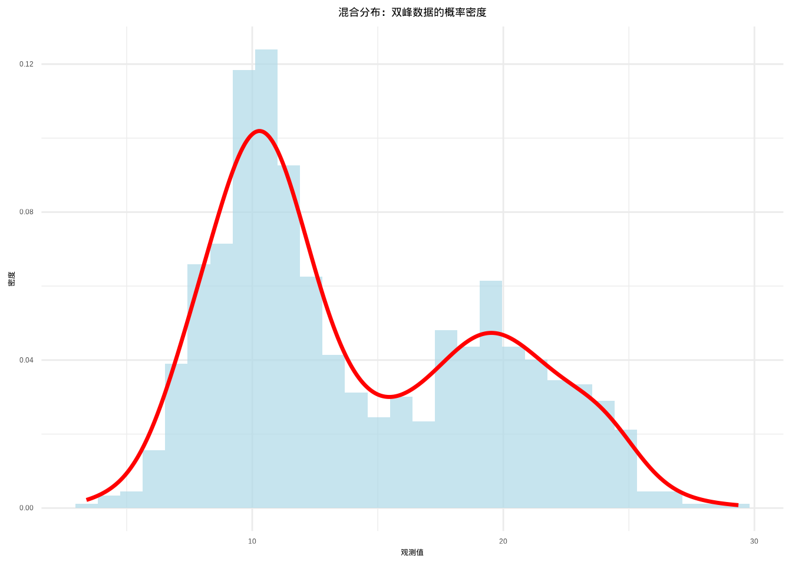
<p class="caption">(\#fig:mixture-distribution)混合分布：双峰数据的概率密度函数</p>
</div>


### 零膨胀分布：处理零值过多的数据

在生态学研究中，我们常常会遇到一种特殊的数据现象——零膨胀（Zero-Inflation）。这种现象在物种分布、种群密度、疾病传播等众多生态学场景中普遍存在。零膨胀分布模型正是为了处理这类包含过多零值的数据而发展起来的统计工具。

### 零膨胀分布的概念与生态学意义

零膨胀分布本质上是一种混合分布，它由两个部分组成：一部分是纯粹的零值生成过程，另一部分是标准的计数分布（如泊松分布或负二项分布）。这种混合结构能够很好地描述生态学中的两种不同状态：

1. **结构性零值**：由于环境条件不适宜、物种不存在或调查方法限制等原因产生的零值
2. **随机性零值**：在适宜环境中由于随机过程产生的零值

例如，在物种分布调查中，某个样方中未发现目标物种可能有两种原因：要么该物种确实不存在于该区域（结构性零值），要么该物种存在但恰好未被观测到（随机性零值）。零膨胀模型能够区分这两种不同的零值生成机制。

**零膨胀分布的数学表达**

零膨胀泊松分布（Zero-Inflated Poisson, ZIP）的概率质量函数可以表示为：

$$P(Y = y) = \begin{cases}
\pi + (1-\pi)e^{-\lambda} & \text{若 } y = 0 \\
(1-\pi)\frac{e^{-\lambda}\lambda^y}{y!} & \text{若 } y > 0
\end{cases}$$

其中 $\pi$ 表示结构性零值的概率，$\lambda$ 是泊松分布的参数。

为了直观展示零膨胀分布的特征，下面的可视化对比了零膨胀泊松分布与普通泊松分布的形状差异。


``` r
# 加载必要的R包
library(ggplot2)
library(dplyr)
library(ggpattern)  # 图案填充支持

# 设置随机数种子确保结果可重现
set.seed(2323)

# 模拟零膨胀数据：80%的零值和20%的泊松分布
n_samples <- 1000
zero_prob <- 0.8
lambda <- 3

# 生成零膨胀泊松数据
zip_data <- numeric(n_samples)
for (i in 1:n_samples) {
  if (runif(1) < zero_prob) {
    zip_data[i] <- 0
  } else {
    zip_data[i] <- rpois(1, lambda)
  }
}

# 统计零值比例
zero_proportion <- mean(zip_data == 0)

# 与普通泊松分布比较：使用相同的期望值
poisson_data <- rpois(n_samples, lambda = mean(zip_data))

# 创建数据框用于绘图
plot_data <- data.frame(
  value = c(zip_data, poisson_data),
  distribution = rep(c("零膨胀泊松", "普通泊松"), each = n_samples)
)

# 计算统计量用于图表标注
zip_stats <- data.frame(
  distribution = c("零膨胀泊松", "普通泊松"),
  zero_prop = c(mean(zip_data == 0), mean(poisson_data == 0)),
  mean_val = c(mean(zip_data), mean(poisson_data))
)

# 绘制分布对比图
ggplot(plot_data, aes(x = value, fill = distribution, pattern = distribution)) +
  geom_histogram_pattern(
    binwidth = 1, alpha = 0.7, position = "identity",
    pattern_fill = "black",
    pattern_density = 0.1,
    pattern_spacing = 0.02
  ) +
  scale_fill_manual(values = c("零膨胀泊松" = "#E69F00", "普通泊松" = "#56B4E9")) +
  scale_pattern_manual(values = c("零膨胀泊松" = "stripe", "普通泊松" = "crosshatch")) +
  labs(
    title = "零膨胀分布与普通泊松分布对比",
    x = "计数值",
    y = "频数",
    fill = "分布类型"
  ) +
  theme_minimal() +
  theme(
    legend.position = "top",
    plot.title = element_text(hjust = 0.5, size = 14, face = "bold"),
    axis.title = element_text(size = 12),
    axis.text = element_text(size = 10),
    legend.text = element_text(size = 10)
  ) +
  facet_wrap(~distribution, ncol = 2, scales = "free_y")
```

<div class="figure" style="text-align: center">
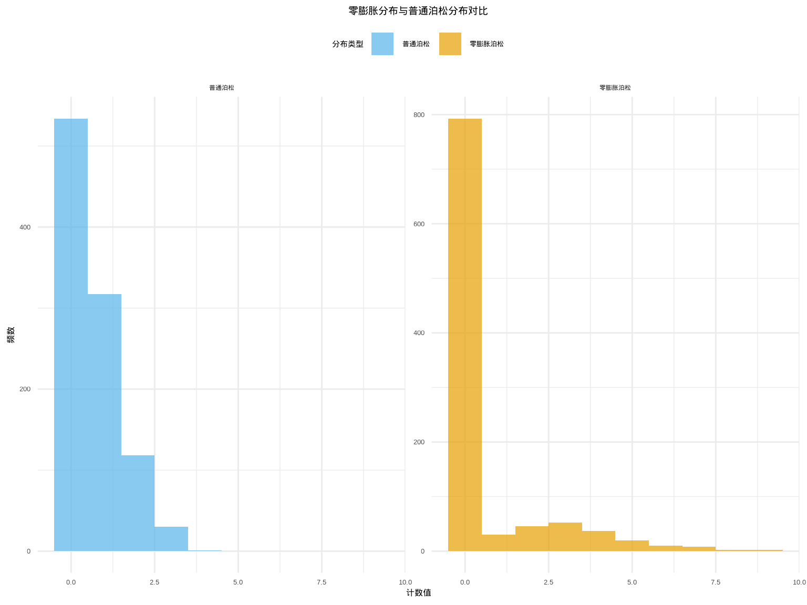
<p class="caption">(\#fig:zero-inflation-plot)零膨胀泊松分布与普通泊松分布的对比可视化。图中清晰地展示了零膨胀分布中零值的过度集中现象，这是生态学中许多稀有物种和低密度种群数据的典型特征。零膨胀泊松分布使用橙色斜线填充，普通泊松分布使用蓝色网格填充</p>
</div>

如图\@ref(fig:zero-inflation-plot)所示，零膨胀分布最显著的特征是零值的过度集中。零膨胀分布在生态学中具有重要的应用价值，专门用于处理存在大量零值的计数数据。这种分布在以下生态学场景中特别有用：

1. **稀有物种的出现数据**：在生态调查中，许多稀有物种在大多数样方中不出现，导致数据中存在大量零值。零膨胀分布能够准确描述这种零值过多的模式。

2. **低密度种群的分布数据**：当种群密度很低时，即使物种存在，也可能在大多数调查点无法观测到，形成零值聚集的数据结构。

3. **间歇性生态过程记录**：某些生态过程（如动物活动、植物开花等）具有间歇性特征，在时间序列中产生大量零值观测。

4. **不完全调查的观测数据**：由于调查方法限制或环境条件影响，某些生态调查可能无法完全覆盖目标区域，导致观测数据中存在系统性的零值。

## 总结

本章系统性地构建了生态学研究中理解不确定性的数学框架，从基础的概率概念到复杂的分布理论，为生态学家提供了量化自然世界随机性的强大工具。通过蚱蜢午餐选择的生动案例，我们逐步揭示了概率理论在生态学中的深刻意义和应用价值。

概率理论为我们提供了三种理解不确定性的不同视角。古典概率基于等可能性假设，为我们提供了理想化的理论基准，虽然其假设在现实生态系统中往往过于简化，但作为思维起点具有重要价值。频率概率通过实际观察数据来量化生态现象，体现了经验主义的研究方法，其核心的大数定律确保了长期观察的稳定性。贝叶斯概率则引入了动态更新的思想，能够结合先验知识和新证据，更接近生态学家实际的认知过程，特别适合处理数据有限但专家知识丰富的生态问题。

随机变量的概念将生态现象转化为数学语言，使我们能够精确描述生物行为和环境变化的不确定性。离散随机变量处理可数的生态事件，如物种选择、行为决策等，而连续随机变量则描述测量值的变化，如生物体尺寸、环境因子等。概率分布作为随机变量的数学指纹，完整刻画了生态现象的统计规律。

在离散分布家族中，伯努利分布描述了二元选择的基本模式，是构建更复杂模型的基础。二项分布将单次试验扩展到多次重复，适用于种群估计、繁殖成功率等计数问题。多项式分布处理多元选择场景，能够描述群落组成、资源分配等复杂生态系统的联合概率分布。泊松分布专门处理稀有事件和空间分布问题，是研究稀有物种分布和随机分布模式的重要工具。几何分布和负二项分布则关注等待时间问题，分别描述第一次成功和第r次成功所需的努力，在行为生态学和进化研究中具有重要应用。

连续分布家族则为我们提供了描述测量值变化的数学工具。均匀分布刻画了完全随机的选择过程，指数分布描述了事件发生的时间间隔，特别适合生存分析和风险建模。正态分布以其经典的钟形曲线和中心极限定理的支撑，成为生态学中最常用的分布之一，能够描述大多数受到多重微小因素影响的生态变量。威布尔分布提供了更灵活的生存分析工具，能够刻画随时间变化的死亡风险模式。伽马分布作为指数分布的一般化，适用于描述累积等待时间和生物量积累过程。贝塔分布则是处理比例变量的理想选择，特别适合行为时间分配和资源选择偏好的研究。

中心极限定理作为概率论的核心成果，解释了为什么正态分布在统计学中如此普遍。无论原始总体分布形态如何，只要样本量足够大，样本均值的分布就会趋于正态，这为生态学的统计推断提供了坚实的理论基础。通过这个定理，我们能够在不知道总体真实分布的情况下，仍然能够进行可靠的参数估计和假设检验。

在生态学实践中，我们还需要处理更复杂的数据结构。混合分布能够描述来自不同子总体的异质性数据，如不同年龄组的种群结构或异质环境中的物种分布。零膨胀分布专门处理存在大量零值的计数数据，这在稀有物种研究和低密度种群监测中尤为重要。

概率与分布理论的价值不仅在于提供具体的计算方法，更在于培养一种“概率思维"——用数学语言理解和描述生态世界的能力。在人工智能技术快速发展的今天，这种能力显得尤为重要。AI模型虽然能够处理海量数据，但其输出本质上是概率性的，只有深刻理解概率原理，才能正确解读AI的预测结果，评估模型的可信度。

生态学研究面对的是自然界中最复杂的系统之一。与物理实验不同，生态学观察通常无法在完全受控的条件下重复进行。概率与分布理论为我们提供了一种量化不确定性的工具，帮助我们设计更科学的生态调查方案，准确解读复杂的生态数据，与数据科学家高效合作，并在AI时代保持批批判性和创造性。

通过本章的学习，我们不仅掌握了概率与分布的基本概念和计算方法，更重要的是建立了连接生态观察与数学分析的桥梁。这种数学框架使我们能够从定性的生态描述迈向定量的科学分析，为理解生物决策机制、种群动态、群落结构等生态学核心问题提供了强有力的工具。在数据驱动的生态学时代，概率与分布理论将继续发挥不可替代的作用，帮助我们更好地理解和保护这个充满不确定性的自然世界。

## 综合练习

### 练习1：蚱蜢觅食行为的概率建模

某生态学家研究蚱蜢的觅食行为，观察到蚱蜢在三种植物（黑麦草、混合草甸、三叶草）上的选择概率分别为0.4、0.35、0.25。如果连续观察10只蚱蜢的觅食选择：

1. 使用二项分布计算恰好有6只蚱蜢选择黑麦草的概率
2. 使用多项式分布计算3只选择黑麦草、4只选择混合草甸、3只选择三叶草的概率
3. 如果蚱蜢平均每分钟成功觅食2次，使用泊松分布计算在5分钟内成功觅食超过12次的概率

### 练习2：生存分析与分布拟合

某生态学家研究某种昆虫的生存时间，收集了100个个体的生存时间数据（单位：天）。经过初步分析，发现数据呈现右偏分布，适合使用威布尔分布进行拟合。

1. 使用R语言生成模拟的生存时间数据（威布尔分布，形状参数k=1.5，尺度参数λ=50）
2. 使用`fitdistrplus`包拟合威布尔分布，并输出参数估计结果
3. 计算该种昆虫的中位生存时间、90天生存概率和30天时的瞬时死亡率
4. 比较威布尔分布与正态分布的拟合效果，说明哪种分布更适合描述生存时间数据

### 练习3：中心极限定理的生态学验证

某生态学家研究森林中某种树木的胸径（直径）分布，已知单个树木的胸径服从伽马分布（形状参数α=2，速率参数β=0.1）。

1. 使用R语言模拟从该伽马分布中随机抽取1000个样本，验证其原始分布形态
2. 进行蒙特卡洛模拟：重复10000次，每次随机抽取30棵树计算平均胸径
3. 绘制样本均值的分布图，验证其是否近似正态分布
4. 计算样本均值分布的偏度和峰度，并与理论正态分布进行比较
5. 讨论中心极限定理在生态学调查设计中的实际意义
