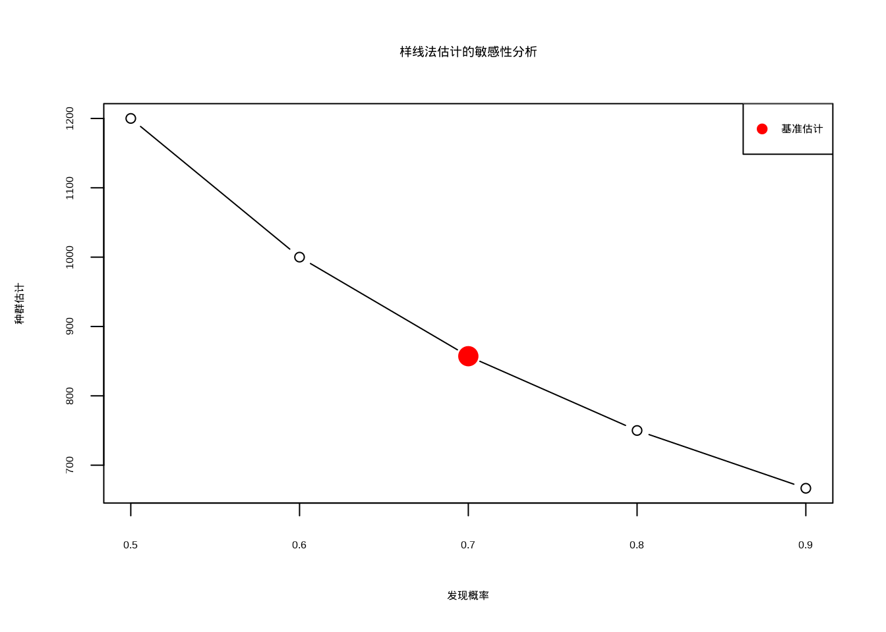
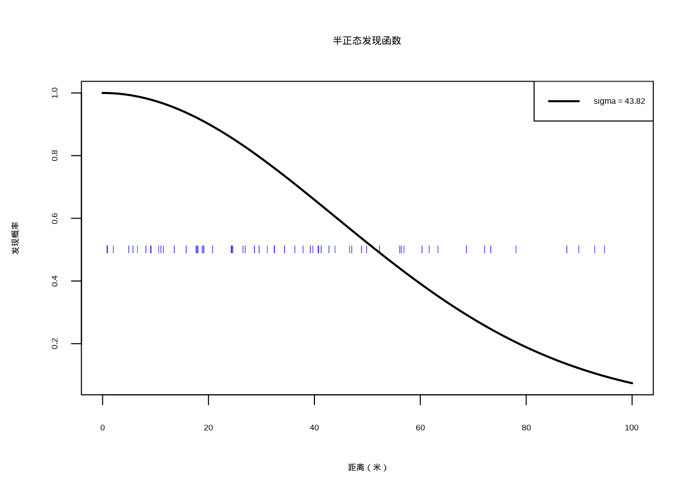
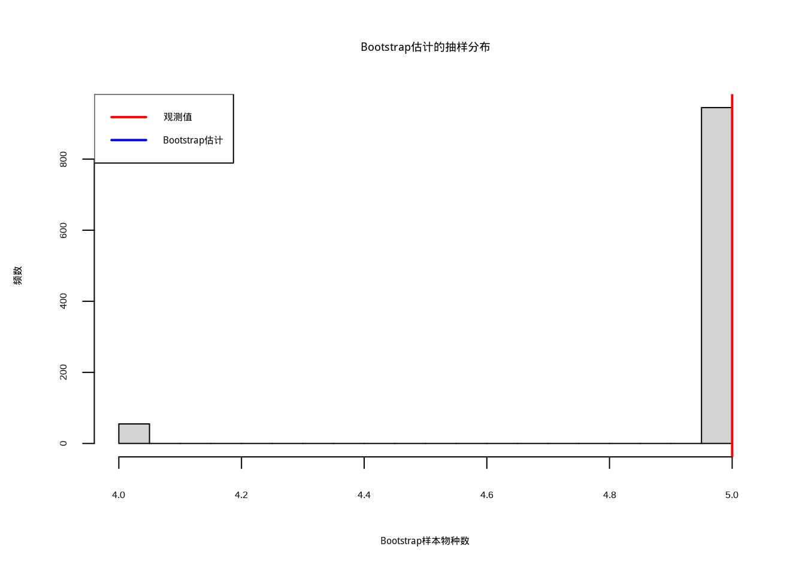
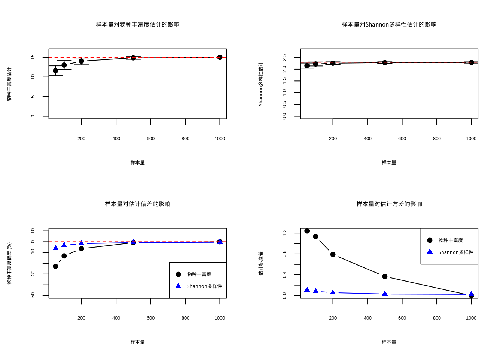

# 参数估计


## 引言

在上一章节中，我们学习了如何通过样本均值、方差等描述统计量来刻画生态群落或生态系统的特征。但您是否曾思考过这样一个问题：我们基于样本获得的结果，与真正想要了解的整个群落或生态系统之间，是否存在差异？

比如，通过调查天童地区的一些样方，您想知道整个天童地区的物种数究竟有多少。这些样方的调查结果能够准确代表整个地区的真实情况吗？如果您曾经思考过这个问题，那么祝贺您，您已经具备了学好生态统计学最根本的直觉。

用标准的统计语言来说，我们收集的只是生态系统的一些样本，而我们真正想要了解的是整个生态系统的特征。那么，如何通过这些有限的样本来推断整体的特征呢？

一个比较直接的办法就是通过完全取样，把生态系统中所有感兴趣的物种全部取样并测量。然而，由于生态系统的复杂性和空间广域性，我们很难做到这一点。即便是像森林大样地那样调查20-50公顷的面积，在整个森林中也只是很小很小的一片区域，而这往往已经是人们从事野外工作的极限。

幸运的是，这个问题已经有很多人思考过，统计学家已经发展出了一套标准化的处理方式。这种通过样本来估计总体特征的方法就叫做**参数估计**。

参数估计构成了统计学理论体系的核心支柱，在生态学研究中发挥着不可替代的方法论作用。生态学参数代表着描述生态系统特征的数量化指标，涵盖了种群平均密度、物种丰富度、生物量空间分布等多个维度，为我们认知生态系统提供了量化基础。

在生态决策层面，参数估计为制定物种保护策略、评估生态修复效果、预测气候变化影响等关键决策提供了科学依据。以濒危物种保护为例，准确的种群数量、分布范围和生存率参数估计直接关系到保护计划的科学性；在湿地恢复工程评估中，生物多样性恢复程度和水质改善幅度的参数估计则决定了工程效果评价的可靠性。

参数估计还深化了我们对生态规律的理解。通过比较不同生态系统的参数特征，研究者能够识别影响生态系统结构和功能的关键因素。物种丰富度随纬度变化的宏观格局、种群增长与竞争捕食等基本生态过程，都依赖于准确的参数估计来揭示其内在规律。这些规律性认识不仅丰富了生态学理论体系，也为生态系统管理和生态预测提供了坚实基础。

参数估计过程本身也培养了研究者的科学思维和严谨态度。从样本代表性考量到估计方法选择，从结果不确定性评估到假设前提检验，每一个环节都需要批判性思维和严谨的科学态度。一个准确的参数估计不仅依赖于正确的统计方法，更需要研究者对生态系统的深入理解和合理的假设设定。

随着统计方法的不断发展，从传统频率学派到现代贝叶斯方法，从简单点估计到复杂区间估计，参数估计技术的进步为生态学研究提供了更强大的工具。这些方法使我们能够更精确地描述生态系统特征，更可靠地预测生态系统变化趋势。在后续章节中，我们将系统阐述参数估计的基本原理、常用方法及其生态学应用，帮助读者全面掌握这一重要的生态学研究工具。


## 样本与总体

理解总体与样本的关系构成了生态学科学推断的理论基石。总体代表着研究对象的完整个体集合，即我们所要研究的完整生态系统或生物群落。以森林鸟类群落研究为例，总体即为该森林中所有鸟类的集合；在水质研究中，总体则指整个湖泊的水体。尽管总体具有明确的边界和特征，但生态系统的复杂性和庞大规模往往使得全面观测难以实现。

样本是从总体中抽取的部分个体集合，作为总体的代表性窗口，为我们了解总体特征提供了可能。生态学实践中，受限于时间、经费和可行性等因素，研究者通常只能观测样本而非总体。例如，在国家级自然保护区哺乳动物多样性调查中，不可能在每一寸土地设置观测点，而是通过代表性样线或样方进行观测。

总体与样本的关系在生态学中蕴含着深刻的实践意义。生态系统的内在复杂性决定了我们往往需要通过"管中窥豹"的方式来探索自然规律。样本质量直接决定了总体认识的准确性，一个具有代表性的样本应当能够充分反映总体的主要特征和变异模式。在生态统计学框架下，我们通过样本统计量（如样本均值、样本方差）来估计总体参数（如总体均值、总体方差），这种从样本到总体的推断过程构成了生态学研究的统计基础。

### 抽样方法及其生态学应用

抽样方法构成了连接总体与样本的重要桥梁，不同方法适用于各异的生态学研究场景。随机抽样作为最基本的抽样方法，确保每个个体被抽中的概率相等，从而保证样本的无偏性。这种方法特别适用于相对均质的生境，如草地植物调查或池塘浮游生物采样。

分层抽样方法则针对生态系统的异质性特点而发展。面对森林不同林层、湖泊不同水深区域、山地不同海拔梯度等空间异质性明显的生境，分层抽样首先将总体划分为相对同质的层（strata），然后在各层内分别进行随机抽样。这种方法显著提高了抽样效率，确保样本能够充分代表总体的不同组成部分。以山地植物多样性调查为例，按海拔梯度分层并在不同海拔带设置样方，既能保证样本代表性，又能揭示物种多样性随海拔变化的规律。

系统抽样按照固定的空间或时间间隔进行抽样，在生态学调查中应用广泛。其优势在于操作简便、覆盖均匀，特别适合大尺度生态调查。鸟类迁徙路线调查中的固定时间间隔观测、森林资源调查中的规则网格样方设置，都是系统抽样的典型应用。然而，这种方法需要注意避免与生态系统的周期性模式重合，以防产生样本偏差。

不同抽样方法对参数估计的准确性和代表性产生重要影响。生态学研究中，抽样方法的选择需要综合考虑研究目的、生态系统特征、资源限制等多重因素。一个优秀的抽样设计不仅能够提升估计精度，还能够揭示生态系统的空间格局和时间动态特征。

### R语言中的抽样实现

在R语言中，我们可以方便地实现各种抽样方法。以下代码展示了不同抽样方法的具体实现：

首先创建模拟的森林鸟类种群数据，为后续抽样方法演示提供基础数据集：


``` r
set.seed(123)

forest_birds <- data.frame(
  species = rep(c("麻雀", "画眉", "啄木鸟", "杜鹃", "黄鹂"), each = 200),
  abundance = c(rpois(200, 50), rpois(200, 30), rpois(200, 10),
                rpois(200, 15), rpois(200, 25)),
  habitat = rep(c("林缘", "林内", "林冠", "灌丛", "空地"), each = 200)
)

cat("数据集结构概览：\n")
```

```
## 数据集结构概览：
```

``` r
str(forest_birds)
```

```
## 'data.frame':	1000 obs. of  3 variables:
##  $ species  : chr  "麻雀" "麻雀" "麻雀" "麻雀" ...
##  $ abundance: int  46 58 38 50 62 53 41 37 58 52 ...
##  $ habitat  : chr  "林缘" "林缘" "林缘" "林缘" ...
```

``` r
cat("\n总体均值：", mean(forest_birds$abundance), "\n")
```

```
## 
## 总体均值： 26.01
```

接下来演示简单随机抽样方法，这是最基本的抽样技术：


``` r
random_sample <- forest_birds[sample(nrow(forest_birds), 100), ]

cat("随机抽样结果：\n")
```

```
## 随机抽样结果：
```

``` r
print(table(random_sample$species))
```

```
## 
## 啄木鸟   杜鹃   画眉   麻雀   黄鹂 
##     12     26     21     19     22
```

``` r
cat("随机抽样均值估计：", mean(random_sample$abundance), "\n")
```

```
## 随机抽样均值估计： 26.64
```

分层抽样方法针对生态系统的异质性特点，按生境类型分层进行抽样：


``` r
library(dplyr)

stratified_sample <- forest_birds %>%
  group_by(habitat) %>%
  sample_n(size = 20)

cat("分层抽样结果：\n")
```

```
## 分层抽样结果：
```

``` r
print(table(stratified_sample$habitat, stratified_sample$species))
```

```
##       
##        啄木鸟 杜鹃 画眉 麻雀 黄鹂
##   林内      0    0   20    0    0
##   林冠     20    0    0    0    0
##   林缘      0    0    0   20    0
##   灌丛      0   20    0    0    0
##   空地      0    0    0    0   20
```

``` r
cat("分层抽样均值估计：", mean(stratified_sample$abundance), "\n")
```

```
## 分层抽样均值估计： 25.45
```

系统抽样按照固定间隔进行抽样，操作简便且覆盖均匀：


``` r
systematic_indices <- seq(1, nrow(forest_birds), by = 10)
systematic_sample <- forest_birds[systematic_indices, ]

cat("系统抽样结果：\n")
```

```
## 系统抽样结果：
```

``` r
print(table(systematic_sample$species))
```

```
## 
## 啄木鸟   杜鹃   画眉   麻雀   黄鹂 
##     20     20     20     20     20
```

``` r
cat("系统抽样均值估计：", mean(systematic_sample$abundance), "\n")
```

```
## 系统抽样均值估计： 26.16
```

最后比较不同抽样方法的估计效果，评估各种方法的性能差异：


``` r
cat("不同抽样方法对种群数量均值的估计比较：\n",
    "总体均值：", mean(forest_birds$abundance), "\n",
    "随机抽样估计：", mean(random_sample$abundance), "\n",
    "分层抽样估计：", mean(stratified_sample$abundance), "\n",
    "系统抽样估计：", mean(systematic_sample$abundance), "\n")
```

```
## 不同抽样方法对种群数量均值的估计比较：
##  总体均值： 26.01 
##  随机抽样估计： 26.64 
##  分层抽样估计： 25.45 
##  系统抽样估计： 26.16
```

``` r
true_mean <- mean(forest_birds$abundance)
cat("\n估计偏差分析：\n",
    "随机抽样偏差：",
    (mean(random_sample$abundance) - true_mean) / true_mean * 100, "%\n",
    "分层抽样偏差：",
    (mean(stratified_sample$abundance) - true_mean) / true_mean * 100, "%\n",
    "系统抽样偏差：",
    (mean(systematic_sample$abundance) - true_mean) / true_mean * 100, "%\n")
```

```
## 
## 估计偏差分析：
##  随机抽样偏差： 2.422145 %
##  分层抽样偏差： -2.153018 %
##  系统抽样偏差： 0.5767013 %
```

### 抽样误差与样本量确定

在生态学研究中，抽样误差是不可避免的。抽样误差的大小取决于样本量、总体变异程度和抽样方法。一般来说，样本量越大，抽样误差越小；总体变异程度越大，需要的样本量也越大。在R中，我们可以使用统计方法来估计所需的样本量：


``` r
library(pwr)

population_sd <- 15
desired_margin <- 2
confidence_level <- 0.95

z_value <- qnorm(1 - (1 - confidence_level) / 2)
required_sample_size <- ceiling((z_value * population_sd / desired_margin)^2)
cat("基于精度要求的所需样本量：", required_sample_size, "\n")
```

```
## 基于精度要求的所需样本量： 217
```

``` r
effect_size <- 0.5  # 中等效应大小
power <- 0.8  # 统计功效
sample_size_t <- pwr.t.test(d = effect_size, power = power,
                            sig.level = 0.05, type = "two.sample")$n
cat("基于统计功效的所需样本量：", ceiling(sample_size_t), "\n")
```

```
## 基于统计功效的所需样本量： 64
```

### 生态学抽样设计的实践考虑

在实际的生态学研究中，抽样设计需要综合考虑多种因素。首先，需要考虑生态系统的空间异质性和时间动态。例如，在调查河流生态系统时，需要考虑上下游的梯度变化；在调查季节性变化的种群时，需要考虑不同季节的抽样时机。

其次，需要考虑抽样单元的大小和形状。在植物生态学中，样方的大小会影响物种-面积关系的估计；在动物生态学中，样线或样点的设置会影响对动物活动范围的覆盖。

最后，需要考虑抽样成本与精度的平衡。在资源有限的情况下，需要在抽样精度和调查成本之间找到最优平衡。有时候，采用分层抽样或多阶段抽样可以在保证精度的同时降低调查成本。

通过科学的抽样设计，我们能够用有限的观测数据来推断生态系统的总体特征，为生态保护和管理决策提供科学依据。在后续的学习中，我们将进一步探讨如何基于样本数据进行参数估计和统计推断。


## 参数估计基础

### 点估计

点估计是统计学中通过样本数据来估计总体未知参数的重要方法。在生态学研究中，我们常常面临这样的困境：想要了解一个生态系统的特征，但由于时间、经费和可行性的限制，我们无法对整个系统进行全面观测。点估计正是解决这一问题的关键工具，它允许我们用有限的样本数据来获得总体参数的一个最佳估计值。

让我们通过一个例子来理解点估计的概念。假设我们想要估计一片湿地中某种两栖动物的平均体重。这片湿地面积广阔，生活着成千上万只这种两栖动物，我们不可能将每一只都捕捉并称重。于是，我们采用科学的抽样方法，随机捕捉了100只个体，测量它们的体重。基于这100个样本数据，我们希望能够给出整个湿地种群平均体重的最佳估计。这个估计过程就是点估计的核心思想——用样本统计量来估计总体参数。

从数学的角度来看，点估计具有严格的定义。设总体参数为$\theta$（例如总体均值$\mu$），我们通过样本数据构造一个估计量$\hat{\theta}$。估计量是一个随机变量，它的具体取值称为估计值。在生态学中，最常用的点估计量包括样本均值、样本方差和样本比例。样本均值$\bar{x} = \frac{1}{n}\sum_{i=1}^{n} x_i$用于估计总体均值$\mu$，样本方差$s^2 = \frac{1}{n-1}\sum_{i=1}^{n} (x_i - \bar{x})^2$用于估计总体方差$\sigma^2$，样本比例$\hat{p} = \frac{k}{n}$用于估计总体比例$\pi$。

点估计的理论基础建立在估计量的良好性质之上。理解这些性质对于正确应用点估计方法至关重要。其中最重要的性质包括无偏性、有效性和一致性，有关这些性质的详细介绍，请见下面相关小节。


点估计在生态学研究中具有重要的实践意义。首先，它为生态学家提供了量化生态系统特征的工具。无论是估计种群的平均大小、物种的分布范围，还是生态过程的速率参数，点估计都是基础的分析方法。其次，点估计为生态模型提供了参数输入。许多生态学模型，如种群动态模型、生态系统过程模型等，都需要基于观测数据来估计模型参数。最后，点估计是更复杂统计推断的基础。在获得点估计的基础上，我们可以进一步构建置信区间、进行假设检验等更深入的统计分析。

然而，点估计也有其局限性。它只提供了一个单一的数值估计，没有包含估计的不确定性信息。在实际生态学应用中，我们往往需要同时考虑点估计和区间估计，以获得对总体参数的全面认识。此外，点估计的质量依赖于样本的代表性和估计方法的适用性。在生态学研究中，我们需要根据具体的研究问题和数据特征选择合适的估计方法，并谨慎解释估计结果。

### 区间估计

区间估计是统计学中通过样本数据来估计总体参数可能取值范围的重要方法。如果说点估计是告诉我们"森林里大概有500只鸟"，那么区间估计就是告诉我们"森林里的鸟数量有95%的可能性在450到550只之间"。这个"可信范围"的概念，让我们的生态学研究变得更加科学和可靠。

#### 置信区间的生态学意义

置信区间是区间估计的核心概念。它告诉我们，在重复抽样的情况下，有多少比例的置信区间会包含真实的参数值。比如，95%的置信区间意味着，如果我们重复进行100次相同的生态调查，大约有95次得到的区间会包含真实的种群参数。

让我们来看几个生态学中的实际例子：

**案例1：湿地鸟类种群调查**
假设你们在研究一片湿地中的白鹭种群。通过标记重捕法，你们估计白鹭数量为1200只，95%置信区间为[1100, 1300]。这个区间估计提供了比单纯点估计更丰富的信息。首先，我们有95%的把握认为这片湿地的白鹭真实数量在1100到1300只之间，这反映了估计的不确定性程度。其次，从生态管理实践的角度看，湿地管理部门在制定保护措施时，可以基于这个范围来规划资源分配和干预强度，而不是仅仅依赖单一的1200只这个数值。最后，在生态监测和趋势分析中，当我们将这个结果与其他年份的数据进行比较时，置信区间能够帮助我们更准确地判断种群是真实增长还是下降，避免了由于抽样误差导致的误判。这种区间估计方法为生态决策提供了更加科学和可靠的基础。

**案例2：森林碳储量估算**
通过遥感技术和地面样方调查，你们估计某片森林的碳储量为50万吨，90%置信区间为[45, 55]万吨。这个区间估计为生态系统的碳循环研究提供了重要的量化基础。首先，在评估森林作为碳汇的作用时，45-55万吨的范围能够更准确地反映森林对大气二氧化碳的吸收能力，避免了单一数值可能带来的高估或低估风险。其次，在制定气候变化应对策略时，决策者可以根据这个区间来规划森林保护和恢复措施，确保政策的科学性和可行性。最后，在参与碳交易市场时，置信区间为碳信用额度的定价和交易提供了可靠的科学依据，增强了市场参与者的信心。这种基于区间估计的碳储量评估方法，为森林生态系统服务功能的量化和管理提供了更加全面和可靠的技术支撑。

#### 置信区间构建方法

在生态学研究中，我们需要根据具体的数据特征和样本量选择合适的置信区间构建方法。置信区间的构建基于中心极限定理，该定理指出，当样本量足够大时，样本均值的抽样分布近似服从正态分布，无论原始总体的分布如何。这一统计规律为生态学中的参数估计提供了坚实的理论基础。

**基于正态分布的置信区间**
当样本量较大（通常n > 30）且总体分布近似正态时，我们可以使用正态分布来构建置信区间。对于总体均值μ的置信区间为：

$$\bar{x} \pm z_{\alpha/2} \times \frac{\sigma}{\sqrt{n}}$$

其中$z_{\alpha/2}$是标准正态分布的上$\alpha/2$分位数，即满足$P(Z > z_{\alpha/2}) = \alpha/2$的临界值。例如，对于95%置信水平，$\alpha = 0.05$，$z_{0.025} \approx 1.96$。

这种方法的理论基础是中心极限定理。在生态学调查中，当我们进行大样本调查时，如全国性的鸟类普查、大范围的森林资源调查等，样本量往往较大，此时使用正态分布构建置信区间是合适的。例如，在调查一个国家级自然保护区的哺乳动物多样性时，如果我们在不同生境类型中设置了足够多的样线或样方，样本量通常能够满足大样本条件。

正态分布置信区间的生态学意义在于，它为大尺度的生态调查提供了可靠的统计推断工具。通过这种方法，我们不仅能够获得种群参数的点估计，还能够量化估计的不确定性，为生态保护决策提供更加全面的科学依据。然而，需要注意的是，这种方法对总体方差σ的准确性要求较高，如果总体方差估计不准确，置信区间的可靠性会受到影响。


``` r
set.seed(123)

egret_counts <- rnorm(30, mean = 1200, sd = 100)

mean_egret <- mean(egret_counts)
sd_egret <- sd(egret_counts)
n_egret <- length(egret_counts)

z_value <- qnorm(0.975)  # 95%置信水平的z值
ci_normal <- c(mean_egret - z_value * sd_egret / sqrt(n_egret),
               mean_egret + z_value * sd_egret / sqrt(n_egret))

cat("基于正态分布的95%置信区间：", ci_normal, "\n")
```

```
## 基于正态分布的95%置信区间： 1160.185 1230.395
```

``` r
t_value <- qt(0.975, df = n_egret - 1)  # 95%置信水平的t值
ci_t <- c(mean_egret - t_value * sd_egret / sqrt(n_egret),
          mean_egret + t_value * sd_egret / sqrt(n_egret))

cat("基于t分布的95%置信区间：", ci_t, "\n")
```

```
## 基于t分布的95%置信区间： 1158.657 1231.922
```


**基于t分布的置信区间**
当样本量较小（n < 30）或总体方差未知时，我们需要使用t分布来构建置信区间：

$$\bar{x} \pm t_{\alpha/2, n-1} \times \frac{s}{\sqrt{n}}$$

其中tα/2,n-1是自由度为n-1的t分布分位数。

t分布由英国统计学家威廉·戈塞特（William Gosset）在1908年提出，当时他在吉尼斯啤酒厂工作，为了解决小样本问题而发展了这种分布。t分布的形状比正态分布更加扁平，尾部更厚，这反映了小样本情况下估计不确定性的增加（图\@ref(fig:t-distribution-comparison,)）。随着样本量的增加，t分布逐渐趋近于正态分布。


``` r
# 生成x轴数据
x <- seq(-4, 4, length.out = 1000)

# 计算不同自由度的t分布密度
pdf_t_5 <- dt(x, df = 5)
pdf_t_10 <- dt(x, df = 10)
pdf_t_30 <- dt(x, df = 30)

# 计算标准正态分布密度
pdf_norm <- dnorm(x)

# 绘制比较图
plot(x, pdf_norm, type = "l", lwd = 2, col = "black",
     xlab = "x", ylab = "密度",
     main = "t分布与正态分布比较",
     ylim = c(0, 0.4))

lines(x, pdf_t_5, col = "red", lwd = 2, lty = 2)
lines(x, pdf_t_10, col = "blue", lwd = 2, lty = 3)
lines(x, pdf_t_30, col = "green", lwd = 2, lty = 4)

# 添加图例
legend("topright",
       legend = c("标准正态分布", "t分布(df=5)", "t分布(df=10)", "t分布(df=30)"),
       col = c("black", "red", "blue", "green"),
       lty = c(1, 2, 3, 4), lwd = 2, bty = "n")

# 添加网格线
grid()
```

<div class="figure" style="text-align: center">

<p class="caption">(\#fig:t-distribution-comparison)t分布与正态分布的比较：不同自由度的t分布（红色、蓝色、绿色）与标准正态分布（黑色）的对比，展示随着自由度增加t分布逐渐趋近正态分布的趋势</p>
</div>

在生态学研究中，小样本情况非常常见。例如，在研究濒危物种时，由于种群数量稀少，我们往往只能获得有限的观测数据；在进行珍稀植物调查时，由于分布范围有限，样本量也往往较小；在开展昂贵的生态实验时，由于成本和时间的限制，样本量也可能受到限制。在这些情况下，使用t分布构建置信区间能够更准确地反映估计的不确定性。

t分布置信区间的生态学意义在于，它为小样本生态学研究提供了可靠的统计工具。通过考虑样本量对估计精度的影响，t分布能够给出更加保守但更加可靠的置信区间，避免了在小样本情况下过度乐观地估计参数精度。这对于濒危物种保护、珍稀生态系统研究等关键生态学问题尤为重要。


``` r
small_sample <- rnorm(10, mean = 1200, sd = 100)
mean_small <- mean(small_sample)
sd_small <- sd(small_sample)
n_small <- length(small_sample)

t_value_small <- qt(0.975, df = n_small - 1)
ci_small <- c(mean_small - t_value_small * sd_small / sqrt(n_small),
              mean_small + t_value_small * sd_small / sqrt(n_small))

cat("小样本（n=10）的95%置信区间：", ci_small, "\n")
```

```
## 小样本（n=10）的95%置信区间： 1194.484 1269.925
```

**基于自助法的置信区间**
当总体分布未知或样本量很小时，我们可以使用自助法（bootstrap）来构建置信区间。这种方法通过重复抽样来估计参数的抽样分布。

自助法由美国统计学家布拉德利·埃夫隆（Bradley Efron）在1979年提出，是一种基于计算机重抽样的非参数统计方法。其基本思想是将原始样本视为"总体"，通过有放回地重复抽样来模拟抽样分布。具体而言，我们从原始样本中随机抽取n个观测值（允许重复），计算感兴趣的统计量，重复这个过程数千次，从而得到统计量的经验分布，基于这个分布构建置信区间。

在生态学研究中，自助法具有独特的优势。许多生态学数据的分布形式复杂，可能不满足传统参数方法的分布假设。例如，物种多度分布往往呈现偏态分布，种群空间分布可能呈现聚集分布，这些复杂的分布模式使得传统的参数方法难以适用。自助法不依赖于特定的分布假设，能够适应各种复杂的生态学数据分布。

自助法置信区间的生态学意义在于，它为处理复杂生态学数据提供了灵活而强大的统计工具。无论是研究物种-面积关系、种群空间分布格局，还是分析生态系统的非线性响应，自助法都能够提供可靠的置信区间估计。此外，自助法特别适用于小样本情况，在生态学研究中，由于研究对象的稀有性或调查成本的限制，小样本问题普遍存在，自助法为这些情况下的统计推断提供了有效的解决方案。

图\@ref(fig:different-confidence-levels)展示了不同置信水平下区间估计的比较，帮助我们理解置信水平对估计精度的影响。


``` r
library(boot)

set.seed(123)
egret_counts <- rnorm(30, mean = 1200, sd = 100)

mean_func <- function(data, indices) {
  return(mean(data[indices]))
}

boot_result <- boot(egret_counts, statistic = mean_func, R = 1000)

ci_bootstrap <- boot.ci(boot_result, type = "perc", conf = 0.95)
cat("自助法95%置信区间：", ci_bootstrap$percent[4:5], "\n")
```

```
## 自助法95%置信区间： 1160.646 1227.409
```

``` r
par(mfrow = c(1, 2))

set.seed(123)
egret_counts <- rnorm(30, mean = 1200, sd = 100)
mean_egret <- mean(egret_counts)
sd_egret <- sd(egret_counts)
n_egret <- length(egret_counts)

confidence_levels <- c(0.90, 0.95, 0.99)
colors <- c("lightblue", "blue", "darkblue")

plot(1, type = "n", xlim = c(1100, 1300), ylim = c(0.5, 3.5),
     xlab = "白鹭数量估计", ylab = "置信水平",
     main = "不同置信水平的区间估计")

for (i in seq_along(confidence_levels)) {
  z_val <- qnorm(1 - (1 - confidence_levels[i]) / 2)
  ci <- c(mean_egret - z_val * sd_egret / sqrt(n_egret),
          mean_egret + z_val * sd_egret / sqrt(n_egret))
  segments(ci[1], i, ci[2], i, lwd = 3, col = colors[i])
  points(mean_egret, i, pch = 19, col = "red")
}

legend("topright", legend = c("90%", "95%", "99%"),
       col = colors, lwd = 3, title = "置信水平")

sample_sizes <- c(10, 30, 50, 100)
ci_widths <- numeric(length(sample_sizes))

for (i in seq_along(sample_sizes)) {
  n <- sample_sizes[i]
  ci_width <- 2 * qt(0.975, df = n - 1) * sd_egret / sqrt(n)
  ci_widths[i] <- ci_width
}

plot(sample_sizes, ci_widths, type = "b", pch = 19,
     xlab = "样本量", ylab = "置信区间宽度",
     main = "样本量对置信区间宽度的影响")
```

<div class="figure" style="text-align: center">

<p class="caption">(\#fig:different-confidence-levels)不同置信水平的区间估计比较</p>
</div>

#### 置信水平的选择

在生态学研究中，我们需要根据具体的研究目的来选择合适的置信水平：

- **90%置信水平**：适用于初步调查、快速评估，或者在资源有限的情况下
- **95%置信水平**：这是生态学研究中最常用的标准，提供了良好的平衡
- **99%置信水平**：适用于关键决策、濒危物种保护等需要更高可靠性的情况

比如，在评估一个重大生态工程的效果时，我们可能会选择99%的置信水平，因为决策的后果很严重。而在进行常规监测时，95%的置信水平通常就足够了。

#### 区间估计在生态学决策中的应用

区间估计不仅仅是统计工具，它直接影响生态学决策的质量。在生态学研究和实践中，决策往往涉及重大的生态、经济和社会后果，而区间估计为这些决策提供了关键的量化支撑。通过提供参数估计的不确定性信息，区间估计帮助决策者更全面地理解生态系统的状态和变化趋势，从而做出更加科学和负责任的决策。

**保护生物学**：在制定濒危物种保护计划时，我们需要知道种群数量的可能范围。濒危物种的保护决策往往具有不可逆性，一旦决策失误，可能导致物种灭绝的严重后果。区间估计为这种高风险决策提供了重要的风险评估工具。例如，当估计某种濒危鸟类的种群数量时，点估计可能显示种群数量为500只，但如果95%置信区间为[300, 700]，这意味着真实的种群数量有相当大的不确定性。这种不确定性信息对于制定保护策略至关重要：如果置信区间的下限接近物种存活的临界阈值，就需要采取更加积极的保护措施；如果置信区间较宽，说明需要进一步调查以获得更精确的估计。此外，在评估保护措施的效果时，区间估计能够帮助我们区分真实的种群变化和抽样误差，为保护策略的调整提供科学依据。

**资源管理**：在规划渔业捕捞配额时，我们需要考虑种群估计的不确定性。渔业资源的可持续利用是生态经济学的重要课题，而捕捞配额的制定直接关系到渔业资源的长期可持续性。区间估计为渔业管理提供了风险管理的工具。例如，在估计某种经济鱼类的资源量时，如果点估计显示资源量为100万吨，95%置信区间为[80, 120]万吨，渔业管理部门就需要考虑最坏情况下的资源量（80万吨）来制定保守的捕捞配额，以确保资源的可持续利用。这种基于区间估计的预防性原则在渔业管理中尤为重要，因为过度捕捞的后果往往是不可逆的。此外，区间估计还能够帮助评估不同管理策略的风险，为渔业政策的制定提供量化支持。

**环境政策**：在制定排放标准时，我们需要了解污染物浓度的可信范围。环境政策的制定往往涉及复杂的权衡，需要在环境保护和经济发展之间找到平衡点。区间估计为这种权衡提供了科学的量化基础。例如，在制定水体污染物排放标准时，如果研究显示某种污染物的安全浓度为10mg/L，95%置信区间为[8, 12]mg/L，政策制定者就需要考虑置信区间的范围来确定排放标准。如果采用较宽松的标准（12mg/L），可能对生态系统造成潜在风险；如果采用较严格的标准（8mg/L），可能对经济发展产生较大影响。区间估计为这种政策权衡提供了透明和可量化的依据，帮助决策者在科学的基础上做出合理的政策选择。

通过科学的区间估计，我们能够更客观地评估生态学研究结果的可靠性，为生态保护和管理决策提供更加科学和可靠的依据。区间估计不仅提供了参数估计的"最佳猜测"，更重要的是提供了估计的"可信程度"，这种不确定性信息的量化是科学决策的重要基础。在生态学研究和实践中，忽视估计的不确定性可能导致决策的盲目性，而充分考虑不确定性则能够提高决策的稳健性和适应性。随着生态学研究的深入和统计方法的发展，区间估计在生态决策中的作用将越来越重要，它将继续为生态保护和可持续发展提供坚实的科学支撑。

### 估计方法

#### 最大似然估计

**什么是最大似然估计？一个生态学的直观理解**

想象一下，你是一位生态学家，正在研究一片森林中某种树种的胸径分布。你测量了50棵树的胸径，得到了一组数据。现在你想知道：这个树种在整片森林中的平均胸径是多少？胸径的变异程度有多大？

最大似然估计就是帮你回答这些问题的一种聪明方法。它的核心思想很简单：**选择那些让观测数据最有可能出现的参数值**。

让我们用一个更生活化的例子来理解：

假设你在一片森林里发现了一些动物的脚印。根据脚印的大小和形状，你猜测这可能是某种鹿。现在你想估计这种鹿的平均体重。最大似然估计的思路就是："如果这种鹿的平均体重是某个值，那么我观察到这些脚印的可能性有多大？"然后我们选择那个让可能性最大的体重值作为我们的估计。


在数学上，对于给定的样本数据$x_1, x_2, \ldots, x_n$，我们构造**似然函数**：

$$L(\theta|x) = \prod_{i=1}^{n} f(x_i|\theta)$$

其中$f(x_i|\theta)$是概率密度函数。最大似然估计就是寻找使似然函数最大的参数值：

$$\hat{\theta}_{\text{MLE}} = \arg\max L(\theta|x)$$

在实际计算中，我们通常使用**对数似然函数**：

$$\ln L(\theta|x) = \sum_{i=1}^{n} \ln f(x_i|\theta)$$

因为乘积的对数更容易处理（把乘法变成加法）。

**生态学实例：森林树木胸径估计**

现在让我们回到刚才的森林树木胸径的例子。假设我们测量了50棵树的胸径，发现这些数据大致服从正态分布。我们想要估计两个参数：
- μ：整个树种的平均胸径
- σ²：胸径的变异程度

在R中，我们可以用以下方法来实现最大似然估计：


``` r
set.seed(123)
tree_diameter <- rnorm(50, mean = 25, sd = 5)  # 真实均值25cm，标准差5cm
```

理解对数似然函数的推导过程对于掌握最大似然估计至关重要。让我们一步步来看这个公式是如何从正态分布的概率密度函数推导出来的：

首先，正态分布的概率密度函数为：

$$f(x|\mu,\sigma) = \frac{1}{\sqrt{2\pi\sigma^2}} \exp\left(-\frac{(x-\mu)^2}{2\sigma^2}\right)$$

当我们有$n$个独立观测数据$x_1, x_2, \ldots, x_n$时，似然函数是这些概率密度的乘积：

$$L(\mu,\sigma|x) = \prod_{i=1}^{n} f(x_i|\mu,\sigma)$$

由于直接处理乘积比较复杂，我们通常取对数将乘积转换为求和，得到对数似然函数：

$$\log L(\mu,\sigma|x) = \sum_{i=1}^{n} \log f(x_i|\mu,\sigma)$$

将概率密度函数代入并展开：

$$\log L = \sum_{i=1}^{n} \left[-\frac{1}{2} \log(2\pi) - \log(\sigma) - \frac{(x_i-\mu)^2}{2\sigma^2}\right]$$

最后，合并同类项得到：

$$\log L = -\frac{n}{2} \log(2\pi) - n \log(\sigma) - \frac{\sum_{i=1}^{n} (x_i-\mu)^2}{2\sigma^2}$$

这就是我们在代码中使用的对数似然函数形式。这个推导过程展示了如何从基本的概率密度函数出发，通过数学变换得到便于优化的对数似然函数。根据这个似然函数的定义，我们就可以使用优化算法来求解最大似然估计。


``` r
# 定义似然函数
log_likelihood <- function(params, data) {
  mu <- params[1]        # 提取均值参数
  sigma <- params[2]     # 提取标准差参数
  # 避免sigma为负值（标准差必须为正数）
  if (sigma <= 0) return(-Inf)
  n <- length(data)

  log_lik <- -n / 2 * log(2 * pi) - n * log(sigma) -
    sum((data - mu)^2) / (2 * sigma^2)
  return(log_lik)
}

initial_params <- c(mean(tree_diameter), sd(tree_diameter))
result <- optim(initial_params, log_likelihood, data = tree_diameter,
                control = list(fnscale = -1), method = "L-BFGS-B",
                lower = c(-Inf, 0.001), upper = c(Inf, Inf))

cat("\n使用优化算法的最大似然估计结果：\n",
  "总体均值估计：", result$par[1], "cm\n",
  "总体标准差估计：", result$par[2], "cm\n")
```

```
## 
## 使用优化算法的最大似然估计结果：
##  总体均值估计： 25.17202 cm
##  总体标准差估计： 4.582823 cm
```

**最大似然估计的生态学意义**

最大似然估计为什么在生态学中如此重要？这要从它的统计性质和生态学实践需求两个方面来理解。作为一种基于"最合理猜测"原理的参数估计方法，最大似然估计已经成为现代生态学研究不可或缺的统计工具。它的重要性不仅体现在理论上的优美性质，更体现在解决实际生态学问题的强大能力上。

**统计性质的生态学价值**

最大似然估计拥有几个非常重要的统计性质，这些性质在生态学研究中具有深刻的意义，为生态学家提供了从有限观测数据推断生态系统规律的可靠基础。

1. **渐进无偏性**：当样本量足够大时，最大似然估计会越来越接近真实值。在生态学中，这个性质具有重要的实践意义。生态学研究往往面临样本量有限的挑战，特别是在研究稀有物种、进行长期监测或开展昂贵的野外实验时。渐进无偏性告诉我们，即使初始样本量较小，只要研究设计合理且持续积累数据，我们的估计最终会收敛到真实参数。

   例如，在国家公园的长期监测项目中，研究人员每年对某种珍稀植物的种群数量进行调查。由于植物分布稀疏且调查成本高昂，前几年的样本量可能有限。但随着监测年份的增加，累积的样本量逐渐增大，最大似然估计给出的种群数量估计会越来越准确。这种渐进无偏性为长期生态监测项目提供了统计保障，让研究人员相信持续的努力最终会带来可靠的认识。

   再比如，在研究气候变化对鸟类迁徙时间的影响时，研究人员需要基于多年的观测数据估计迁徙时间的趋势。最大似然估计的渐进无偏性确保了随着观测年份的增加，趋势估计会越来越接近真实的气候变化影响。这种性质对于制定基于科学证据的气候变化适应策略至关重要。

2. **有效性**：在所有无偏估计中，最大似然估计的方差最小。这个性质在生态学中尤为重要，因为生态数据往往存在较大的自然变异。生态系统是复杂的动态系统，受到多种生物和非生物因素的影响，观测数据中包含了大量的随机变异。最大似然估计的高效性意味着它能够在这种自然变异中给出最精确的估计。

   考虑一个具体的例子：在评估湿地恢复工程对水鸟种群的影响时，研究人员需要检测种群数量的微小变化。由于水鸟种群受到天气、食物供应、捕食压力等多种因素的影响，观测数据中存在显著的年度波动。最大似然估计的有效性使得研究人员能够区分真实的恢复效果和随机波动。如果使用方差较大的估计方法，可能会错过重要的生态恢复信号，或者将随机波动误认为生态变化。

   另一个重要应用是在生物多样性监测中。当研究人员试图检测物种丰富度的长期变化趋势时，最大似然估计的高效性能够提高检测微弱但持续的生态变化的统计功效。这对于早期预警生态系统退化、评估保护措施效果具有重要意义。

3. **一致性**：样本量增大时，估计值会收敛到真实参数。这个性质保证了生态学研究的可积累性——随着研究的深入和数据的丰富，我们的认识会不断接近生态系统的真实状态。一致性是科学研究的基石，它确保了知识的渐进积累和认识的不断深化。

   在宏观生态学研究中，研究人员经常需要整合来自不同地区、不同时间尺度的数据。最大似然估计的一致性保证了这种数据整合的可靠性。例如，在构建全球物种分布模型时，研究人员需要整合来自世界各地的观测记录。最大似然估计确保随着数据覆盖范围的扩大和样本量的增加，模型参数会收敛到反映物种生态需求的真实值。

   同样，在生态系统服务评估中，研究人员需要基于有限的样点数据推断整个区域的生态系统服务价值。最大似然估计的一致性为这种空间外推提供了统计基础，确保了随着调查样点的增加，区域尺度的估计会越来越准确。

**生态学应用的广泛性**

最大似然估计在生态学各个领域都有广泛应用，从微观的个体行为研究到宏观的全球变化分析，几乎涵盖了生态学的所有分支领域。

- **种群动态模型**：在种群生态学中，我们经常需要估计种群增长率、死亡率、繁殖率等关键参数。最大似然估计能够基于观测数据（如标记重捕数据、种群普查数据）给出这些参数的最优估计。例如，在濒危物种保护中，准确的种群增长率估计对于制定保护策略至关重要。

   以东北虎保护为例，研究人员通过红外相机监测和个体识别技术收集种群数据。最大似然估计被用于估计种群大小、存活率、繁殖率等关键参数。这些参数的准确估计直接影响到保护区的管理决策，如栖息地恢复的范围、反盗猎巡逻的强度等。最大似然估计不仅提供了点估计，还通过似然剖面或自助法提供了参数的不确定性信息，为风险评估和适应性管理提供了科学依据。

   在渔业管理中，最大似然估计被广泛应用于估计鱼类种群的生物参数。基于渔获量数据和年龄组成信息，研究人员使用最大似然估计来估计自然死亡率、捕捞死亡率、生长参数等。这些估计对于制定可持续的捕捞配额、保护渔业资源的长时期生产力具有关键作用。最大似然估计的统计性质确保了这些关键管理参数的可靠性。

- **物种分布模型**：随着气候变化和生境丧失，预测物种分布变化成为生态学的重要课题。最大似然估计在逻辑斯蒂回归、广义线性模型等物种分布模型中广泛应用，帮助我们理解环境因子如何影响物种的分布概率。

   以大熊猫保护为例，研究人员使用最大似然估计来构建物种分布模型，预测气候变化背景下适宜栖息地的变化。基于大熊猫的分布记录和环境变量数据，最大似然估计能够确定各个环境因子（如温度、降水、植被类型）对物种分布的影响强度。这些模型不仅用于识别当前的保护优先区，还用于预测未来气候变化对栖息地适宜性的影响，为长期的保护规划提供科学支持。

   在入侵生物学中，最大似然估计被用于预测外来物种的潜在分布范围。基于物种在原产地的分布数据和引入地的环境条件，研究人员使用最大似然估计来估计物种在新环境中的生存概率。这些预测对于早期预警、风险评估和防控策略制定具有重要意义。最大似然估计的统计框架使得研究人员能够量化预测的不确定性，为风险管理决策提供更全面的信息。

- **群落生态学模型**：在分析物种间相互作用和群落结构时，最大似然估计能够处理复杂的多物种数据。比如在食物网分析中，估计物种间的相互作用强度；在群落构建机制研究中，检验生态位理论和中性理论的相对重要性。

   以森林群落研究为例，研究人员使用最大似然估计来分析树种间的竞争关系和共存机制。基于长期的样方监测数据，最大似然估计能够估计不同树种间的竞争系数，揭示群落构建的生态位过程。同时，通过比较不同模型的似然值，研究人员可以检验中性过程在群落构建中的相对重要性。这种模型比较方法为理解生物多样性维持机制提供了有力的统计工具。

   在微生物生态学中，最大似然估计被用于分析微生物群落的组成和功能。基于高通量测序数据，研究人员使用最大似然估计来估计不同微生物类群的相对丰度、物种间的相互作用网络等。这些分析对于理解微生物群落在生态系统功能中的作用、开发基于微生物的生态修复技术具有重要意义。

- **生态系统模型**：在生态系统层面，最大似然估计用于估计碳循环、养分循环等关键过程参数。这些估计对于理解全球变化对生态系统的影响、评估生态系统的服务功能具有重要意义。

   以森林碳汇研究为例，研究人员使用最大似然估计来校准生态系统过程模型。基于通量塔观测的碳通量数据、生物量调查数据等，最大似然估计能够估计光合作用、呼吸作用、碳分配等关键过程参数。这些参数估计的准确性直接影响到对森林碳汇能力的评估，为气候变化减缓政策的制定提供科学依据。

   在水生态系统研究中，最大似然估计被用于估计营养盐循环参数。基于水体化学监测数据和生物观测数据，研究人员使用最大似然估计来估计营养盐的吸收速率、转化速率、输出速率等。这些参数对于理解水体富营养化过程、制定水污染控制策略具有关键作用。最大似然估计的统计框架使得研究人员能够量化参数估计的不确定性，为环境风险管理提供更可靠的科学支撑。

**生态学研究的实际优势**

除了理论性质，最大似然估计在生态学实践中还有几个重要优势：

首先，最大似然估计具有良好的计算性质，可以通过数值优化算法高效求解，这使其能够处理生态学中常见的复杂模型。其次，最大似然估计提供了完整的统计推断框架，包括参数估计、假设检验、模型比较等，为生态学研究的科学严谨性提供了保障。最后，最大似然估计的渐进正态性使得我们可以构建参数的置信区间，量化估计的不确定性，这对于生态风险评估和决策支持尤为重要。

**简单总结**：最大似然估计就像是一个"最合理猜测"的方法——它选择那些让我们的观测数据看起来最合理的参数值。虽然听起来简单，但这种方法在生态学研究中非常强大和实用，为生态学家提供了从有限观测数据推断生态系统规律的可靠工具。

#### 矩估计

**什么是矩估计？一个更直观的方法**

如果说最大似然估计是"最合理猜测"，那么矩估计就是"用样本特征来匹配总体特征"的方法。

让我们用一个简单的生态学例子来理解：

假设你正在研究一片草地中某种昆虫的体长分布。你测量了100只昆虫的体长，得到了样本数据。矩估计的思路很简单：  
- 用样本的平均体长来估计整个种群的平均体长  
- 用样本体长的变异程度来估计整个种群体长的变异程度  

**数学表达**

矩估计法的基本思想是用样本矩来匹配总体矩。如果总体有$k$个未知参数，我们就用样本的前$k$阶矩来估计总体的前$k$阶矩。

对于正态分布$N(\mu, \sigma^2)$，我们有两个未知参数$\mu$和$\sigma^2$。矩估计的具体计算过程如下：

1. **总体矩与样本矩的对应关系**：
   - 总体一阶矩（均值）：$E(X) = \mu$
   - 总体二阶矩：$E(X^2) = \mu^2 + \sigma^2$

2. **样本矩的计算**：
   - 样本一阶矩（样本均值）：$m_1 = \frac{1}{n}\sum_{i=1}^{n} x_i$
   - 样本二阶矩：$m_2 = \frac{1}{n}\sum_{i=1}^{n} x_i^2$

3. **建立矩估计方程**：
   \begin{align*}
   m_1 &= \mu \\
   m_2 &= \mu^2 + \sigma^2
   \end{align*}

4. **求解参数估计**：
   \begin{align*}
   \hat{\mu}_{MM} &= m_1 = \frac{1}{n}\sum_{i=1}^{n} x_i \\
   \hat{\sigma}^2_{MM} &= m_2 - m_1^2 = \frac{1}{n}\sum_{i=1}^{n} x_i^2 - \left(\frac{1}{n}\sum_{i=1}^{n} x_i\right)^2
   \end{align*}

因此，对于正态分布$N(\mu, \sigma^2)$：
- 一阶样本矩（样本均值）用于估计总体均值$\mu$
- 二阶样本矩用于估计总体方差$\sigma^2$


``` r
set.seed(123)
tree_diameter <- rnorm(50, mean = 25, sd = 5)  # 真实均值25cm，标准差5cm

mu_hat_moment <- mean(tree_diameter)  # 一阶矩估计
sigma2_hat_moment <- var(tree_diameter)  # 二阶矩估计（无偏估计）

cat("矩估计结果：\n",
    "总体均值估计：", mu_hat_moment, "cm\n",
    "总体方差估计：", sigma2_hat_moment, "cm²\n")
```

```
## 矩估计结果：
##  总体均值估计： 25.17202 cm
##  总体方差估计： 21.43088 cm²
```

``` r
exp_lifespan <- rexp(100, rate = 0.1)  # 平均寿命10天

lambda_hat_moment <- 1 / mean(exp_lifespan)
cat("\n昆虫寿命分布的矩估计：\n",
    "指数分布参数估计：", lambda_hat_moment, "（真实值：0.1）\n",
    "平均寿命估计：", 1 / lambda_hat_moment, "天（真实值：10天）\n")
```

```
## 
## 昆虫寿命分布的矩估计：
##  指数分布参数估计： 0.1087193 （真实值：0.1）
##  平均寿命估计： 9.197996 天（真实值：10天）
```

**矩估计的生态学意义**

矩估计在生态学研究中为什么有用？作为一种基于样本矩匹配总体矩的估计方法，矩估计以其简单直观的特点在生态学研究中占据着独特而重要的地位。虽然它不像最大似然估计那样具有最优的统计性质，但在许多实际生态学场景中，矩估计的实用价值不容忽视。

**矩估计的核心优势**

矩估计在生态学研究中具有几个显著的优势，这些优势使其在特定情境下成为首选的估计方法：

1. **计算简单**：矩估计不需要复杂的优化算法，计算过程直接明了。在生态学野外调查中，研究人员经常需要在资源有限、时间紧迫的条件下进行快速分析。矩估计的计算简单性使其特别适合这种场景。例如，在进行生物多样性快速评估时，研究人员可以使用矩估计快速估算物种丰富度、种群密度等基本参数，为后续的深入调查提供初步指导。

   在R语言中，矩估计的实现通常只需要几行简单的代码。比如估计正态分布的参数，只需要计算样本均值和样本方差即可。这种计算简单性不仅降低了技术门槛，也提高了分析效率，使得更多的生态学研究者能够掌握和应用统计方法。

2. **直观易懂**：矩估计直接用样本特征来估计总体特征，这种"样本反映总体"的思维方式非常符合生态学研究者的直觉。生态学家经常需要向政策制定者、保护区管理人员或公众解释研究结果，矩估计的直观性使得这种科学传播变得更加容易。

   例如，在向当地社区解释某种鱼类资源的现状时，研究人员可以说："我们捕捞了100条鱼，平均体长为25厘米，因此我们估计整个湖泊中这种鱼的平均体长约为25厘米。"这种基于样本均值的估计方法容易被非专业人士理解和接受。相比之下，最大似然估计的"最合理猜测"概念可能需要更多的统计背景才能完全理解。

3. **应用广泛**：矩估计在生态学初步分析中经常使用，特别是在数据探索和模型诊断阶段。当研究人员面对新的数据集时，矩估计可以快速提供参数的初始估计，为后续的模型选择和参数优化提供参考。在许多生态学软件和统计包中，矩估计被用作默认的初始值计算方法。

   在生态建模中，矩估计还常用于验证更复杂估计方法的结果。如果最大似然估计或贝叶斯估计的结果与矩估计相差甚远，研究人员就需要仔细检查模型设定、数据质量或计算过程是否存在问题。这种验证功能使得矩估计成为生态学统计分析中重要的质量控制工具。

**矩估计的局限性**

尽管矩估计具有诸多优势，生态学研究者也需要清醒地认识到它的局限性：

1. **不一定最优**：在小样本情况下，矩估计可能不如最大似然估计准确。生态学研究经常面临小样本问题，特别是在研究稀有物种、进行昂贵的实验或监测难以到达的生境时。在这些情况下，矩估计的效率较低，估计的方差较大。

   例如，在研究某种极度濒危的兰花种群时，研究人员可能只能找到几十个个体。使用矩估计来估计种群的关键参数（如平均开花数量、种子产量等）可能会产生较大的抽样误差。相比之下，最大似然估计能够更有效地利用有限的信息，给出更精确的估计。

2. **可能不稳健**：矩估计对异常值比较敏感。生态学数据中经常包含异常值，这些异常值可能来源于测量误差、极端环境事件或罕见的生物现象。矩估计基于样本矩，而样本矩对异常值敏感，这可能导致参数估计的偏差。

   考虑一个具体的例子：在调查某种鸟类的巢穴成功率时，如果某个年份遇到了极端天气事件导致大量巢穴失败，这个异常值会显著影响基于矩估计的年均成功率。在这种情况下，使用更稳健的估计方法（如中位数估计或修剪均值）可能更为合适。

**生态学应用场景**

矩估计在生态学研究中有着广泛而具体的应用场景：

1. **快速估算种群参数**：在生态监测和资源评估中，矩估计常用于快速估算种群的基本参数。例如，在渔业资源评估中，研究人员使用矩估计快速计算渔获物的平均体长、体重等指标；在森林资源调查中，矩估计用于估算树木的平均胸径、树高等参数。这些快速估计为资源管理决策提供了及时的信息支持。

2. **初步数据分析**：在生态学研究的早期阶段，矩估计是重要的探索性分析工具。研究人员使用矩估计来了解数据的基本特征，识别数据的分布模式，为后续的模型选择和参数优化奠定基础。例如，在分析物种多度分布时，矩估计可以快速揭示数据的偏度、峰度等特征，帮助研究人员选择合适的统计模型。

3. **教学演示**：由于方法简单直观，矩估计在生态统计学教学中具有重要价值。通过矩估计，学生可以直观地理解参数估计的基本原理，建立统计思维。许多生态统计学课程都以矩估计作为入门内容，帮助学生逐步过渡到更复杂的估计方法。

4. **模型验证和诊断**：在复杂的生态学模型分析中，矩估计常用于验证其他估计方法的结果。如果不同估计方法给出的结果基本一致，研究人员对模型结果的信心就会增强；如果结果差异较大，就需要进一步检查模型的适用性和数据的质量。

**生态学实践建议**

在实际生态学研究中，研究人员应该根据具体的研究目标和数据特征选择合适的估计方法：

- 对于初步探索和快速评估，矩估计是很好的选择
- 对于需要高精度估计的关键决策，建议使用最大似然估计或贝叶斯估计
- 在数据存在异常值或分布偏离假设时，需要考虑使用稳健估计方法
- 在教学和科学传播中，矩估计的直观性使其成为首选的解释工具

**简单总结**：矩估计就像是"用样本的镜子照出总体的样子"——简单直接，但在需要精确估计时可能还需要更复杂的方法。它虽然不是最精确的估计方法，但凭借其简单性、直观性和广泛适用性，在生态学研究中发挥着不可替代的作用。

#### 贝叶斯估计


想象一下，你是一位经验丰富的生态学家，正在研究一片森林中某种树种的胸径。你不仅测量了新的样本数据，还知道过去的研究表明这种树种的胸径通常在20-30厘米之间。贝叶斯估计就是让你能够**结合已有的知识（先验信息）和新的观测数据**来做出更好的估计。

**贝叶斯估计的核心思想**：

贝叶斯估计的公式表达了这种思想：

$$p(\theta|x) \propto p(x|\theta) \times p(\theta)$$

其中：  
- $p(\theta|x)$是**后验分布**：结合了先验和样本信息后的参数分布  
- $p(x|\theta)$是**似然函数**：样本数据的信息  
- $p(\theta)$是**先验分布**：我们已有的知识或信念  

简单来说：**后验 ∝ 似然 × 先验**， 具体有关贝叶斯的介绍请参考上一章节的相关内容。我们这里直接从如何实现这样的贝叶斯估计角度来讲解。


``` r
# 加载贝叶斯回归模型包
library(brms)

# 准备数据：将树木胸径数据转换为数据框格式
bayes_data <- data.frame(diameter = tree_diameter)

# 定义先验分布：基于已有知识设定参数的先验分布
priors <- c(
  prior(normal(22, 3), class = Intercept),  # 均值的先验：基于过去研究，认为均值在22cm左右，标准差3cm
  prior(student_t(3, 0, 5), class = sigma)  # 标准差的先验：使用学生t分布，自由度3，位置0，尺度5
)

# 拟合贝叶斯模型
fit_brm <- brm(
  formula = diameter ~ 1,           # 模型公式：只有截距项，即估计总体均值
  data = bayes_data,                # 输入数据
  prior = priors,                   # 先验分布设置
  family = gaussian(),              # 假设数据服从正态分布
  chains = 4,                       # 使用4条独立的MCMC链进行采样
  iter = 2000,                      # 每条链进行2000次迭代
  warmup = 1000,                    # 前1000次作为预热期（burn-in），不用于后验分析
  seed = 123                        # 设置随机种子保证结果可重现
)
```

```
## 
## SAMPLING FOR MODEL 'anon_model' NOW (CHAIN 1).
## Chain 1: 
## Chain 1: Gradient evaluation took 2.3e-05 seconds
## Chain 1: 1000 transitions using 10 leapfrog steps per transition would take 0.23 seconds.
## Chain 1: Adjust your expectations accordingly!
## Chain 1: 
## Chain 1: 
## Chain 1: Iteration:    1 / 2000 [  0%]  (Warmup)
## Chain 1: Iteration:  200 / 2000 [ 10%]  (Warmup)
## Chain 1: Iteration:  400 / 2000 [ 20%]  (Warmup)
## Chain 1: Iteration:  600 / 2000 [ 30%]  (Warmup)
## Chain 1: Iteration:  800 / 2000 [ 40%]  (Warmup)
## Chain 1: Iteration: 1000 / 2000 [ 50%]  (Warmup)
## Chain 1: Iteration: 1001 / 2000 [ 50%]  (Sampling)
## Chain 1: Iteration: 1200 / 2000 [ 60%]  (Sampling)
## Chain 1: Iteration: 1400 / 2000 [ 70%]  (Sampling)
## Chain 1: Iteration: 1600 / 2000 [ 80%]  (Sampling)
## Chain 1: Iteration: 1800 / 2000 [ 90%]  (Sampling)
## Chain 1: Iteration: 2000 / 2000 [100%]  (Sampling)
## Chain 1: 
## Chain 1:  Elapsed Time: 0.014 seconds (Warm-up)
## Chain 1:                0.012 seconds (Sampling)
## Chain 1:                0.026 seconds (Total)
## Chain 1: 
## 
## SAMPLING FOR MODEL 'anon_model' NOW (CHAIN 2).
## Chain 2: 
## Chain 2: Gradient evaluation took 4e-06 seconds
## Chain 2: 1000 transitions using 10 leapfrog steps per transition would take 0.04 seconds.
## Chain 2: Adjust your expectations accordingly!
## Chain 2: 
## Chain 2: 
## Chain 2: Iteration:    1 / 2000 [  0%]  (Warmup)
## Chain 2: Iteration:  200 / 2000 [ 10%]  (Warmup)
## Chain 2: Iteration:  400 / 2000 [ 20%]  (Warmup)
## Chain 2: Iteration:  600 / 2000 [ 30%]  (Warmup)
## Chain 2: Iteration:  800 / 2000 [ 40%]  (Warmup)
## Chain 2: Iteration: 1000 / 2000 [ 50%]  (Warmup)
## Chain 2: Iteration: 1001 / 2000 [ 50%]  (Sampling)
## Chain 2: Iteration: 1200 / 2000 [ 60%]  (Sampling)
## Chain 2: Iteration: 1400 / 2000 [ 70%]  (Sampling)
## Chain 2: Iteration: 1600 / 2000 [ 80%]  (Sampling)
## Chain 2: Iteration: 1800 / 2000 [ 90%]  (Sampling)
## Chain 2: Iteration: 2000 / 2000 [100%]  (Sampling)
## Chain 2: 
## Chain 2:  Elapsed Time: 0.013 seconds (Warm-up)
## Chain 2:                0.014 seconds (Sampling)
## Chain 2:                0.027 seconds (Total)
## Chain 2: 
## 
## SAMPLING FOR MODEL 'anon_model' NOW (CHAIN 3).
## Chain 3: 
## Chain 3: Gradient evaluation took 4e-06 seconds
## Chain 3: 1000 transitions using 10 leapfrog steps per transition would take 0.04 seconds.
## Chain 3: Adjust your expectations accordingly!
## Chain 3: 
## Chain 3: 
## Chain 3: Iteration:    1 / 2000 [  0%]  (Warmup)
## Chain 3: Iteration:  200 / 2000 [ 10%]  (Warmup)
## Chain 3: Iteration:  400 / 2000 [ 20%]  (Warmup)
## Chain 3: Iteration:  600 / 2000 [ 30%]  (Warmup)
## Chain 3: Iteration:  800 / 2000 [ 40%]  (Warmup)
## Chain 3: Iteration: 1000 / 2000 [ 50%]  (Warmup)
## Chain 3: Iteration: 1001 / 2000 [ 50%]  (Sampling)
## Chain 3: Iteration: 1200 / 2000 [ 60%]  (Sampling)
## Chain 3: Iteration: 1400 / 2000 [ 70%]  (Sampling)
## Chain 3: Iteration: 1600 / 2000 [ 80%]  (Sampling)
## Chain 3: Iteration: 1800 / 2000 [ 90%]  (Sampling)
## Chain 3: Iteration: 2000 / 2000 [100%]  (Sampling)
## Chain 3: 
## Chain 3:  Elapsed Time: 0.014 seconds (Warm-up)
## Chain 3:                0.012 seconds (Sampling)
## Chain 3:                0.026 seconds (Total)
## Chain 3: 
## 
## SAMPLING FOR MODEL 'anon_model' NOW (CHAIN 4).
## Chain 4: 
## Chain 4: Gradient evaluation took 4e-06 seconds
## Chain 4: 1000 transitions using 10 leapfrog steps per transition would take 0.04 seconds.
## Chain 4: Adjust your expectations accordingly!
## Chain 4: 
## Chain 4: 
## Chain 4: Iteration:    1 / 2000 [  0%]  (Warmup)
## Chain 4: Iteration:  200 / 2000 [ 10%]  (Warmup)
## Chain 4: Iteration:  400 / 2000 [ 20%]  (Warmup)
## Chain 4: Iteration:  600 / 2000 [ 30%]  (Warmup)
## Chain 4: Iteration:  800 / 2000 [ 40%]  (Warmup)
## Chain 4: Iteration: 1000 / 2000 [ 50%]  (Warmup)
## Chain 4: Iteration: 1001 / 2000 [ 50%]  (Sampling)
## Chain 4: Iteration: 1200 / 2000 [ 60%]  (Sampling)
## Chain 4: Iteration: 1400 / 2000 [ 70%]  (Sampling)
## Chain 4: Iteration: 1600 / 2000 [ 80%]  (Sampling)
## Chain 4: Iteration: 1800 / 2000 [ 90%]  (Sampling)
## Chain 4: Iteration: 2000 / 2000 [100%]  (Sampling)
## Chain 4: 
## Chain 4:  Elapsed Time: 0.015 seconds (Warm-up)
## Chain 4:                0.013 seconds (Sampling)
## Chain 4:                0.028 seconds (Total)
## Chain 4:
```

``` r
# 输出模型拟合结果
cat("贝叶斯模型拟合结果：\n")
```

```
## 贝叶斯模型拟合结果：
```

``` r
print(summary(fit_brm))
```

```
##  Family: gaussian 
##   Links: mu = identity 
## Formula: diameter ~ 1 
##    Data: bayes_data (Number of observations: 50) 
##   Draws: 4 chains, each with iter = 2000; warmup = 1000; thin = 1;
##          total post-warmup draws = 4000
## 
## Regression Coefficients:
##           Estimate Est.Error l-95% CI u-95% CI Rhat Bulk_ESS Tail_ESS
## Intercept    25.00      0.67    23.65    26.29 1.00     3058     2318
## 
## Further Distributional Parameters:
##       Estimate Est.Error l-95% CI u-95% CI Rhat Bulk_ESS Tail_ESS
## sigma     4.72      0.50     3.86     5.78 1.00     2723     2401
## 
## Draws were sampled using sampling(NUTS). For each parameter, Bulk_ESS
## and Tail_ESS are effective sample size measures, and Rhat is the potential
## scale reduction factor on split chains (at convergence, Rhat = 1).
```

``` r
# 提取后验样本：将MCMC采样结果转换为数据框格式
posterior_samples <- as.data.frame(fit_brm)

# 计算后验分布的均值：参数的点估计
posterior_mean <- mean(posterior_samples$b_Intercept)  # 截距项对应总体均值
posterior_sd <- mean(posterior_samples$sigma)          # 标准差参数

# 输出贝叶斯估计结果
cat("\n贝叶斯估计结果：\n",
    "后验均值：", round(posterior_mean, 2), "cm\n",
    "后验标准差：", round(posterior_sd, 2), "cm\n")
```

```
## 
## 贝叶斯估计结果：
##  后验均值： 25 cm
##  后验标准差： 4.72 cm
```

``` r
# 设置图形布局：1行2列
par(mfrow = c(1, 2))

# 绘制均值的后验分布直方图
hist(posterior_samples$b_Intercept, breaks = 30,
     xlab = "均值 (cm)", ylab = "密度",
     main = "均值的后验分布", col = "lightblue")
abline(v = posterior_mean, col = "red", lwd = 2)  # 添加均值垂直线

# 绘制标准差的后验分布直方图
hist(posterior_samples$sigma, breaks = 30,
     xlab = "标准差 (cm)", ylab = "密度",
     main = "标准差的后验分布", col = "lightgreen")
abline(v = posterior_sd, col = "red", lwd = 2)  # 添加均值垂直线
```

<div class="figure" style="text-align: center">

<p class="caption">(\#fig:bayesian-posterior-distribution)贝叶斯估计的后验分布</p>
</div>

``` r
# 恢复默认图形布局
par(mfrow = c(1, 1))

# 计算95%可信区间：贝叶斯统计中的区间估计
ci_mean <- quantile(posterior_samples$b_Intercept, probs = c(0.025, 0.975))
ci_sigma <- quantile(posterior_samples$sigma, probs = c(0.025, 0.975))

# 输出可信区间结果
cat("\n95%可信区间：\n",
    "均值：[", round(ci_mean[1], 2), ", ", round(ci_mean[2], 2), "] cm\n",
    "标准差：[", round(ci_sigma[1], 2), ", ", round(ci_sigma[2], 2), "] cm\n")
```

```
## 
## 95%可信区间：
##  均值：[ 23.65 ,  26.29 ] cm
##  标准差：[ 3.86 ,  5.78 ] cm
```

贝叶斯估计的核心思想包括：结合先验信息和样本信息、得到参数的后验分布而非点估计（图\@ref(fig:bayesian-posterior-distribution)）、提供完整的参数不确定性信息，以及特别适用于有先验知识的生态学问题。

**贝叶斯估计的生态学意义**

贝叶斯估计为什么在生态学中越来越受欢迎？作为一种能够结合先验信息和样本数据的统计方法，贝叶斯估计在现代生态学研究中正发挥着越来越重要的作用。随着生态学研究问题的复杂化和数据类型的多样化，贝叶斯估计的独特优势使其成为解决许多生态学挑战的有力工具。

**贝叶斯估计的核心优势**

贝叶斯估计在生态学研究中具有几个显著的优势，这些优势使其在处理复杂生态学问题时表现出色：

1. **结合先验知识**：贝叶斯估计能够充分利用历史数据、专家经验等已有信息，这是其最突出的优势之一。在生态学研究中，许多问题都具有丰富的历史背景和专家知识积累。贝叶斯估计通过先验分布的形式将这些知识纳入分析框架，使得估计结果更加合理和稳健。

   例如，在濒危物种保护研究中，研究人员往往积累了多年的监测数据。当进行新的种群评估时，贝叶斯估计可以将历史数据作为先验信息，结合新的观测数据来更新对种群参数的认知。这种"知识积累"的过程非常符合生态学研究的渐进性特点。在东北虎保护研究中，研究人员使用贝叶斯方法结合了过去20年的红外相机监测数据，构建了种群动态的先验分布，然后基于新的调查数据更新了对种群数量、存活率等关键参数的估计。这种方法不仅提高了估计的精度，还使得保护决策能够基于更加全面的信息。

   另一个重要应用是在生态系统服务评估中。许多生态系统服务（如碳储存、水源涵养）的评估需要结合遥感数据、地面观测数据和专家判断。贝叶斯估计提供了一个统一的框架来整合这些不同类型的信息源，通过先验分布的形式表达专家对某些参数的不确定性判断，然后基于观测数据来更新这些判断。

2. **提供完整的不确定性信息**：贝叶斯估计给出参数的整个后验分布，而不仅仅是点估计，这为生态学决策提供了更加全面的信息基础。在生态学研究和实践中，决策往往涉及重大的生态、经济和社会后果，充分理解参数估计的不确定性对于科学决策至关重要。

   考虑气候变化对物种分布影响的研究。传统的点估计方法可能给出物种分布范围变化的单一数值，而贝叶斯估计则提供完整的概率分布，显示不同变化幅度的可能性。这种完整的不确定性信息对于制定适应性管理策略具有重要意义。例如，在预测某种珍稀植物在未来气候情景下的适宜栖息地变化时，贝叶斯估计不仅给出了最可能的变化趋势，还量化了各种可能情景的概率，为保护区的长期规划提供了风险评估基础。

   在生态风险评估中，贝叶斯估计的完整不确定性信息尤为重要。当评估某种污染物对水生生态系统的影响时，贝叶斯方法能够提供效应大小的概率分布，而不仅仅是"显著"或"不显著"的二元结论。这种概率化的风险评估使得决策者能够基于风险水平制定相应的管理措施，而不是简单地依赖统计显著性。

3. **灵活处理复杂问题**：贝叶斯估计特别适合处理小样本、缺失数据、层次结构等复杂情况，这些情况在生态学研究中非常普遍。生态学数据往往具有复杂的结构特征，如空间相关性、时间自相关性、个体异质性等，贝叶斯估计通过层次模型和随机效应能够很好地处理这些复杂性。

   在小样本情况下，贝叶斯估计通过先验信息的引入，能够在一定程度上补偿样本信息的不足。例如，在研究某种极度稀有的两栖动物时，研究人员可能只能获得很少的个体观测数据。通过结合专家对物种生态需求的先验知识，贝叶斯估计能够给出相对合理的参数估计，而传统方法可能由于样本量过小而无法提供可靠的推断。

   在缺失数据处理方面，贝叶斯估计也具有独特优势。生态学监测数据经常存在缺失值，特别是在长期监测项目中。贝叶斯方法将缺失值视为待估计的参数，在模型拟合过程中同时估计模型参数和缺失值，这种方法比传统的缺失值处理方法更加合理和有效。

**生态学应用场景**

贝叶斯估计在生态学研究的各个领域都有广泛而深入的应用：

1. **基于历史数据的种群参数估计**：贝叶斯估计特别适合处理具有时间序列特征的生态学数据。在长期生态监测项目中，研究人员积累了多年的观测数据，贝叶斯方法能够有效地整合这些历史信息。

   以候鸟迁徙研究为例，研究人员使用贝叶斯状态空间模型来估计种群数量的年际变化。这种模型不仅能够估计当前的种群状态，还能够量化观测误差和过程误差，提供更加真实的种群动态描述。通过结合多年的环志数据、计数数据和栖息地变化信息，贝叶斯方法能够揭示种群对气候变化和生境丧失的响应模式。

   在渔业资源评估中，贝叶斯方法被广泛应用于种群动态模型的参数估计。基于多年的渔获量数据、年龄组成数据和环境因子数据，贝叶斯估计能够提供种群生物量、捕捞死亡率等关键参数的后验分布，为渔业管理决策提供概率化的科学依据。

2. **结合专家知识的生态模型**：在许多生态学研究中，特别是在数据稀缺的情况下，专家知识成为重要的信息源。贝叶斯估计提供了一个系统化的框架来整合专家知识和观测数据。

   在生态系统建模中，研究人员经常面临参数众多但数据有限的问题。通过贝叶斯方法，研究人员可以基于文献综述、专家访谈等方式构建参数的先验分布，然后基于有限的观测数据来更新这些先验认识。这种方法在森林碳循环模型、湿地水文模型等复杂生态系统模型中得到广泛应用。

   在保护生物学中，贝叶斯方法被用于整合不同专家的判断。当面对数据稀缺的濒危物种时，研究人员可以通过德尔菲法等方式收集多个专家的意见，将这些意见转化为参数的先验分布，然后基于有限的野外调查数据来更新对物种状况的认识。

3. **风险评估和决策支持**：贝叶斯估计提供的完整概率分布为生态风险评估和决策支持提供了理想的工具。在生态学决策中，往往需要在不确定性条件下做出选择，贝叶斯方法能够量化各种决策后果的概率。

   在入侵物种管理决策中，贝叶斯方法被用于评估不同控制策略的效果和风险。基于物种的生态特征、扩散能力和控制措施的有效性等信息，贝叶斯模型能够预测各种管理情景下入侵物种的扩散概率和生态影响，为管理决策提供风险分析基础。

   在气候变化适应规划中，贝叶斯方法帮助决策者理解不同适应策略在不确定未来气候情景下的效果。通过结合气候模型输出、物种响应数据和专家判断，贝叶斯分析能够评估各种适应措施的成功概率，支持基于风险的决策制定。

4. **模型比较和选择**：通过贝叶斯因子，研究人员可以系统地比较不同生态学模型的相对证据支持程度。这种模型比较方法比传统的假设检验更加灵活和全面。

   在群落生态学中，研究人员使用贝叶斯模型比较来检验不同的群落构建机制。例如，通过比较生态位模型和中性模型的贝叶斯因子，研究人员可以评估生态位过程和中性过程在特定群落中的相对重要性。这种模型比较为理解生物多样性维持机制提供了有力的统计工具。

   在物种分布建模中，贝叶斯模型平均被用于整合多个竞争模型的预测结果。通过计算各个模型的后验概率，研究人员可以构建基于模型权重的综合预测，这种预测通常比单一模型的预测更加稳健和可靠。

**贝叶斯估计的发展趋势**

随着计算技术的进步和统计软件的发展，贝叶斯估计在生态学中的应用正在不断扩展和深化：

- **计算方法的改进**：马尔可夫链蒙特卡洛（MCMC）算法、变分推断等计算方法的发展使得贝叶斯估计能够处理越来越复杂的生态学模型
- **软件工具的普及**：Stan、JAGS、NIMBLE等贝叶斯建模软件的出现降低了贝叶斯方法的技术门槛
- **多学科整合**：贝叶斯方法促进了生态学与其他学科（如经济学、社会学）的交叉研究
- **决策支持应用**：贝叶斯决策分析在生态管理中的应用日益广泛

**简单总结**：贝叶斯估计就像是"站在前人的肩膀上"——它让我们能够利用已有的知识，结合新的观测，做出更加全面和稳健的估计。这种方法特别适合那些数据有限但知识丰富的生态学研究。随着生态学研究问题的日益复杂和对科学决策支持需求的增加，贝叶斯估计在生态学中的地位和作用将会越来越重要。


### 估计量性质：如何评价一个估计方法的好坏？

在生态学研究中，我们经常需要选择不同的估计方法。那么，如何判断一个估计方法的好坏呢？统计学家们定义了几个重要的性质来评价估计量。理解这些性质不仅有助于我们选择合适的统计方法，更重要的是能够帮助我们正确解释和评估研究结果。在生态学实践中，这些性质就像是一把尺子，帮助我们衡量统计推断的质量和可靠性。

**无偏性：长期准确性的保证**

**数学定义**：估计量的期望等于总体参数真值：$E(\hat{\theta}) = \theta$

无偏性就像是使用一把校准准确的尺子来测量长度。如果尺子本身没有系统偏差，那么长期来看，多次测量的平均值就会接近真实长度。在生态学中，这意味着如果我们重复进行相同的抽样调查，估计量的平均值会收敛到总体参数的真实值。

无偏性保证了长期估计的准确性，避免了系统性偏差。在生态学研究中，系统性偏差可能导致严重的决策错误。例如，在评估某种濒危物种的种群数量时，如果估计方法存在系统性低估，可能会导致保护措施不足，增加物种灭绝的风险。相反，如果存在系统性高估，可能会浪费有限的保护资源。

在森林碳储量估算中，研究人员使用样方法估计单位面积的碳储量。如果样方设置存在系统性偏差（如倾向于选择树木较大的区域），就会导致碳储量估计的系统性高估。无偏性要求我们的抽样设计和估计方法能够避免这种系统性偏差，确保长期估计的准确性。

在渔业资源评估中，无偏性尤为重要。如果捕捞死亡率估计存在系统性偏差，可能导致过度捕捞或资源利用不足。例如，在某些渔业中，基于渔获量的估计方法可能由于选择性捕捞而存在系统性偏差，需要使用更复杂的标记重捕方法来获得无偏估计。


无偏性是估计量的基本要求，指估计量的期望等于总体参数的真值。以样本均值$\bar{x}$为例，我们来证明为什么样本均值是总体均值的无偏估计。设总体均值为$\mu$，样本$x_1, x_2, \ldots, x_n$来自该总体，则样本均值的期望为：

$$E(\bar{x}) = E\left[\frac{1}{n}\sum_{i=1}^{n} x_i\right] = \frac{1}{n}\sum_{i=1}^{n} E(x_i) = \frac{1}{n}\sum_{i=1}^{n} \mu = \mu$$  

在这个公式中：
- $E(\bar{x})$ 表示样本均值的期望
- $\bar{x}$ 是样本均值，计算公式为 $\frac{1}{n}\sum_{i=1}^{n} x_i$
- $n$ 是样本容量
- $x_i$ 是第 $i$ 个样本观测值
- $E(x_i)$ 是第 $i$ 个样本观测值的期望
- $\mu$ 是总体均值


这个简单的数学推导表明，无论样本量大小如何，样本均值的期望总是等于总体均值，因此样本均值是总体均值的无偏估计。

相比之下，样本方差的无偏性证明更为复杂。如果我们使用公式$s^2 = \frac{1}{n-1}\sum_{i=1}^{n} (x_i - \bar{x})^2$作为总体方差$\sigma^2$的估计量，我们来证明为什么需要除以$n-1$而不是$n$。首先，我们考虑偏差：

$$E\left[\sum_{i=1}^{n} (x_i - \bar{x})^2\right] = E\left[\sum_{i=1}^{n} (x_i - \mu + \mu - \bar{x})^2\right]$$
$$= E\left[\sum_{i=1}^{n} (x_i - \mu)^2\right] - 2E\left[\sum_{i=1}^{n} (x_i - \mu)(\bar{x} - \mu)\right] + E\left[\sum_{i=1}^{n} (\bar{x} - \mu)^2\right]$$

由于$\sum_{i=1}^{n} (x_i - \mu) = n(\bar{x} - \mu)$，我们有：

$$\begin{aligned}
E\left[\sum_{i=1}^{n} (x_i - \mu)(\bar{x} - \mu)\right] &= E\left[(\bar{x} - \mu)\sum_{i=1}^{n} (x_i - \mu)\right] \\
&= E\left[n(\bar{x} - \mu)^2\right] \\
&= n\text{Var}(\bar{x}) \\
&= n\left(\frac{\sigma^2}{n}\right) \\
&= \sigma^2
\end{aligned}$$

同时，$E\left[\sum_{i=1}^{n} (\bar{x} - \mu)^2\right] = n\text{Var}(\bar{x}) = \sigma^2$

因此：

$$E\left[\sum_{i=1}^{n} (x_i - \bar{x})^2\right] = n\sigma^2 - 2\sigma^2 + \sigma^2 = (n-1)\sigma^2$$

这就证明了$E\left[\sum_{i=1}^{n} (x_i - \bar{x})^2\right] = (n-1)\sigma^2$，所以$E[s^2] = E\left[\frac{1}{n-1}\sum_{i=1}^{n} (x_i - \bar{x})^2\right] = \sigma^2$。这就是为什么样本方差需要除以$n-1$而不是$n$的原因——只有这样才能保证估计量的无偏性。

**有效性：估计精度的关键**

**数学定义**：估计量的方差尽可能小：$\text{Var}(\hat{\theta})$最小

有效性就像是使用高精度的测量仪器。即使测量没有系统偏差，如果仪器精度不够，每次测量的结果也会有很大波动。在生态学中，有效性意味着我们的估计结果具有较小的随机波动，能够提供稳定可靠的参数估计。

有效性提高了估计精度，让我们的估计更加稳定可靠。在生态监测和资源管理中，高精度的估计能够帮助研究人员检测微小的生态变化，为早期预警和适应性管理提供可靠依据。

在气候变化对物候影响的研究中，研究人员需要检测物种开花或迁徙时间的微小变化。如果使用的估计方法方差较大，可能无法检测到气候变暖导致的物候提前。有效的估计方法能够提高检测这种微弱但持续变化的统计功效。

在生物多样性监测中，有效性直接影响对物种丰富度变化的检测能力。例如，在使用样线法调查鸟类多样性时，不同的估计方法可能给出不同的物种丰富度估计方差。选择有效的估计方法能够提高对多样性变化趋势的检测灵敏度，为保护决策提供更及时的信息。


**有效性**是指估计量的方差尽可能小。在所有无偏估计量中，方差最小的估计量称为有效估计量。例如，对于正态分布，样本均值不仅是总体均值的无偏估计，还是有效估计。

然而，需要注意的是，样本方差 $s^2 = \frac{1}{n-1}\sum_{i=1}^{n} (x_i - \bar{x})^2$ 虽然是总体方差 $\sigma^2$ 的无偏估计，但它不是有效估计。根据Cramér-Rao下界，对于正态分布，$\sigma^2$ 的任何无偏估计量的方差不能小于 $\frac{2\sigma^4}{n}$，而样本方差的方差为 $\frac{2\sigma^4}{n-1}$，当 $n > 1$ 时，$\frac{2\sigma^4}{n-1} > \frac{2\sigma^4}{n}$，因此样本方差不是有效估计。

让我们通过R代码来验证这一点：


``` r
set.seed(123)
simulation_variance <- function(n_sim = 10000, n_sample = 10,
                                true_sigma2 = 25) {
  s2_estimates <- numeric(n_sim)  # 无偏样本方差
  mle_estimates <- numeric(n_sim) # 最大似然估计

  for (i in 1:n_sim) {
    sample_data <- rnorm(n_sample, mean = 0, sd = sqrt(true_sigma2))
    s2_estimates[i] <- var(sample_data)  # 无偏估计
    mle_estimates[i] <- sum((sample_data - mean(sample_data))^2) / n_sample
  }

  var_s2 <- var(s2_estimates)
  var_mle <- var(mle_estimates)

  cr_lower_bound <- 2 * true_sigma2^2 / n_sample

  relative_efficiency <- var_mle / var_s2
  cat("有效性分析结果（样本量n =", n_sample, "）：\n",
      "无偏样本方差的方差：", var_s2, "\n",
      "最大似然估计的方差：", var_mle, "\n",
      "Cramér-Rao下界：", cr_lower_bound, "\n",
      "无偏样本方差是否达到Cramér-Rao下界：", var_s2 >= cr_lower_bound, "\n",
      "最大似然估计是否达到Cramér-Rao下界：", var_mle >= cr_lower_bound, "\n",
      "最大似然估计相对于无偏样本方差的效率：", relative_efficiency, "\n")
}

simulation_variance(n_sim = 1000, n_sample = 10)
```

```
## 有效性分析结果（样本量n = 10 ）：
##  无偏样本方差的方差： 139.1433 
##  最大似然估计的方差： 112.7061 
##  Cramér-Rao下界： 125 
##  无偏样本方差是否达到Cramér-Rao下界： TRUE 
##  最大似然估计是否达到Cramér-Rao下界： FALSE 
##  最大似然估计相对于无偏样本方差的效率： 0.81
```

这个模拟研究代码在最大似然估计部分具有重要的教学意义。虽然我们刚刚学习了最大似然估计的理论和方法，但理解估计量的实际表现需要通过模拟来验证。

模拟研究在参数估计教学中具有不可替代的价值。通过计算机模拟，我们能够直观地验证理论性质，例如观察样本均值的无偏性和最大似然方差估计的有偏性在实际抽样中的表现。更重要的是，模拟揭示了统计学中经典的偏差-方差权衡问题：最大似然方差估计虽然存在偏差，但其方差通常小于无偏估计，这为实际应用中的方法选择提供了重要启示。这种从理论到实践的桥梁作用，特别适用于生态学研究中的小样本场景，帮助学生理解不同估计方法的性质差异，为他们在真实生态调查中做出明智的统计方法选择奠定基础。这个模拟显示，虽然最大似然估计量是有偏的，但它的方差可能更小，这体现了估计量性质之间的权衡。

**一致性**是指当样本量趋于无穷大时，估计量依概率收敛于总体参数真值。用数学语言表达就是：对于任意$\epsilon > 0$，有$\lim_{n \to \infty} P(|\hat{\theta} - \theta| > \epsilon) = 0$。样本均值和样本方差都具有一致性。

这些理论性质在生态学研究中具有重要的实践意义。无偏性保证了我们的估计在长期平均意义上是准确的；有效性保证了我们的估计具有较高的精度；一致性保证了随着样本量的增加，我们的估计会越来越接近真实值。在实际生态学研究中，我们需要根据这些性质来选择合适的估计方法，并正确解释估计结果。

**一致性：科学积累的基础**

**数学定义**：样本量增大时估计量收敛于参数真值：$\lim_{n \to \infty} P(|\hat{\theta} - \theta| > \epsilon) = 0$

一致性就像是调查一片森林的过程。当我们只调查几个样方时，对森林的了解可能不够全面；但随着调查样方的增加，我们对森林的认识会越来越接近真实情况。在生态学中，一致性保证了随着数据积累，我们的认识会不断深化和准确化。

一致性保证了大样本下的估计可靠性，样本越多结果越可信。这个性质是科学知识积累的基础，它确保了生态学研究能够通过持续的数据收集和分析不断接近生态系统的真实状态。

在长期生态监测项目中，一致性具有特别重要的意义。例如，在美国 Hubbard Brook 生态系统研究站的长期研究中，研究人员通过数十年的数据积累，对森林生态系统的碳循环、养分循环等过程有了越来越准确的认识。一致性确保了这种长期研究的科学价值，随着观测年份的增加，对关键生态过程参数的估计会越来越可靠。

在物种分布建模中，一致性保证了随着观测记录的增加，模型对物种生态需求的估计会越来越准确。这对于预测物种对气候变化的响应、识别保护优先区等应用具有重要意义。

**充分性：信息利用的效率**

**定义**：估计量包含样本中关于参数的所有信息

充分性就像是使用最有效的方式总结观测数据。如果我们有一组复杂的生态观测数据，充分估计量能够提取其中所有关于参数的信息，不浪费任何有用的观测信息。

充分性避免了信息损失，充分利用样本数据。在生态学研究中，数据收集往往需要大量的时间、经费和人力投入，充分估计量能够确保我们最大限度地利用这些宝贵的数据资源。

在种群遗传学研究中，充分估计量能够充分利用基因型数据中的信息来估计种群遗传参数。如果使用非充分估计量，可能会丢失重要的遗传信息，导致对种群分化、基因流等关键过程的错误认识。

在群落生态学中，充分估计量能够有效利用物种多度数据中的信息来估计群落多样性参数。这对于理解群落构建机制、评估保护措施效果等应用具有重要价值。

**估计量性质在生态学实践中的权衡**

在实际生态学研究中，我们通常希望估计量同时具备这些优良性质，但有时候需要在不同性质之间进行权衡。理解这些权衡关系对于选择合适的统计方法至关重要。

**最大似然估计的优良性质**：最大似然估计通常具有良好的性质组合。在大多数情况下，最大似然估计具有渐进无偏性、有效性和一致性。这使得它成为生态学研究中应用最广泛的估计方法之一。例如，在种群动态模型、物种分布模型、群落生态学模型等各种生态学模型中，最大似然估计都是首选的参数估计方法。

**矩估计的实用价值**：矩估计虽然不一定是最优的估计方法，但其计算简单、直观易懂的特点使其在生态学初步分析中具有重要价值。在快速评估、教学演示等场景中，矩估计的简单性往往比最优性更为重要。

**贝叶斯估计的独特优势**：贝叶斯估计能够结合先验知识，提供完整的不确定性信息。虽然贝叶斯估计不一定具有频率学派意义上的无偏性，但它能够通过先验信息的引入，在小样本情况下提供相对合理的估计，并为决策提供完整的概率分布信息。

**生态学实践建议**：

在选择估计方法时，生态学研究者应该考虑以下几个因素：

1. **研究目标**：如果研究目标是精确的参数估计，应该优先选择具有良好统计性质的估计方法（如最大似然估计）；如果目标是快速评估或初步探索，可以考虑使用计算简单的方法（如矩估计）。

2. **数据特征**：对于大样本数据，最大似然估计通常是最佳选择；对于小样本数据，贝叶斯估计可能更为合适；对于存在异常值的数据，需要考虑使用稳健估计方法。

3. **先验信息**：如果有丰富的先验信息（如历史数据、专家知识），贝叶斯估计能够充分利用这些信息，提高估计的可靠性。

4. **决策需求**：如果需要为风险管理或政策制定提供决策支持，贝叶斯估计提供的完整不确定性信息具有重要价值。

**总结**：估计量的性质为我们评价和选择统计方法提供了重要的理论依据。在生态学研究中，理解这些性质不仅有助于我们做出正确的统计选择，更重要的是能够帮助我们正确解释研究结果，评估结论的可靠性。随着生态学研究问题的日益复杂和对科学严谨性要求的提高，对这些统计性质的理解和应用将变得越来越重要。

## 种群大小估计

种群大小估计是生态学研究的核心任务之一，也是保护生物学、野生动物管理和生态监测的基础工作。在生态学实践中，由于研究对象的规模庞大、分布广泛或难以接近，我们往往无法对种群进行全面的普查。种群大小估计方法正是为了解决这一困境而发展起来的统计工具，它允许我们通过有限的观测数据来推断整个种群的规模。

种群大小估计的重要性体现在多个方面。首先，准确的种群数量信息是制定保护策略的基础。无论是制定濒危物种的保护计划、规划自然保护区的范围，还是评估生态恢复工程的效果，都需要基于可靠的种群数量估计。其次，种群大小估计为资源管理提供了科学依据。在渔业、林业、野生动物管理等资源利用领域，可持续利用的前提是对资源数量的准确评估。最后，种群大小估计有助于我们理解生态系统的结构和功能。种群数量是生态系统能量流动和物质循环的基础，也是物种间相互作用的重要决定因素。

在生态学研究中，不同的种群大小估计方法适用于不同的研究对象和研究条件。选择合适的方法需要考虑种群的特征（如移动性、分布模式）、研究的目的（如精确估计、趋势监测）、可用的资源（如时间、经费、人力）以及数据的可获得性。在接下来的内容中，我们将详细介绍几种主要的种群大小估计方法，包括它们的原理、适用条件、优缺点以及在生态学中的具体应用。

### 标记重捕法

标记重捕法是生态学中最经典和广泛应用的种群大小估计方法之一，特别适用于移动性较强的动物种群。这种方法的基本思想是通过标记部分个体，然后重新捕获样本，根据标记个体在重捕样本中的比例来估计整个种群的规模。

**Lincoln-Petersen估计**是最简单的标记重捕方法，其核心公式为：

$$N = \frac{M \times C}{R}$$

其中：  
- $N$：种群大小估计值  
- $M$：第一次捕获并标记的个体数  
- $C$：第二次捕获的总个体数   
- $R$：第二次捕获中标记个体的数量  

这个公式的直观理解是：标记个体在种群中的比例应该等于它们在重捕样本中的比例。如果标记个体在重捕样本中的比例较低，说明种群规模较大；反之，如果比例较高，说明种群规模较小。

让我们通过一个具体的生态学例子来理解Lincoln-Petersen估计的应用。假设研究人员想要估计一片湿地中某种蛙类的种群数量。他们在第一次调查中捕获了100只蛙，进行了标记后释放。一周后进行第二次调查，捕获了80只蛙，其中20只是之前标记过的。根据Lincoln-Petersen公式：

$$N = \frac{100 \times 80}{20} = 400$$

因此，估计这片湿地中该种蛙类的种群数量约为400只。

Lincoln-Petersen估计的关键假设包括：  
1. 种群是封闭的，没有出生、死亡、迁入或迁出  
2. 标记不会影响个体的行为或存活率  
3. 标记不会丢失或难以识别  
4. 捕获是随机的，所有个体被捕获的概率相等  
5. 两次捕获之间个体充分混合 

在实际生态学研究中，这些假设往往难以完全满足。例如，在真实的生态系统中，种群通常是开放的，个体会有出生、死亡和迁移；标记可能会影响个体的行为或存活率；捕获可能不是完全随机的。因此，Lincoln-Petersen估计通常只适用于短期的封闭种群研究。

**Chapman修正估计**

为了改进Lincoln-Petersen估计在小样本情况下的表现，统计学家Chapman提出了一个修正公式。当重捕样本中标记个体数量较少时，原始Lincoln-Petersen估计可能产生偏差。Chapman修正公式通过添加常数项来减少这种偏差：

$$\hat{N}_{\text{Chapman}} = \frac{(M+1)(C+1)}{R+1} - 1$$

这个修正公式在小样本情况下通常比原始Lincoln-Petersen估计具有更好的统计性质，特别是在重捕样本中标记个体数量较少时。


我们用R代码来实现上面的估计：


``` r
marked_first <- 100  # 第一次标记的个体数
captured_second <- 80   # 第二次捕获的总个体数
recaptured_marked <- 20   # 第二次捕获中标记个体的数量

# 计算Lincoln-Petersen估计：使用基本公式 N = (M × C) / R
population_lp <- (marked_first * captured_second) / recaptured_marked
cat("Lincoln-Petersen估计的种群数量：", population_lp, "只\n")
```

```
## Lincoln-Petersen估计的种群数量： 400 只
```

``` r
# 计算Chapman修正估计：通过添加常数项减少小样本偏差
# 公式：N_chapman = [(M+1)(C+1)/(R+1)] - 1
population_chapman <- ((marked_first + 1) * (captured_second + 1)) /
  (recaptured_marked + 1) - 1
cat("Chapman修正后的种群估计：", population_chapman, "只\n")
```

```
## Chapman修正后的种群估计： 388.5714 只
```

``` r
# 计算Lincoln-Petersen估计的标准误
# 标准误公式：SE = sqrt[M² × C × (C - R) / R³]
# 这个公式基于超几何分布的方差推导
standard_error_population <- sqrt((marked_first^2 * captured_second *
                                     (captured_second - recaptured_marked)) /
                                     (recaptured_marked^3))

# 计算95%置信区间：使用正态近似
# 下界：估计值 - 1.96 × 标准误
ci_lower <- population_lp - 1.96 * standard_error_population
# 上界：估计值 + 1.96 × 标准误
ci_upper <- population_lp + 1.96 * standard_error_population
cat("95%置信区间：[", ci_lower, ",", ci_upper, "]\n")
```

```
## 95%置信区间：[ 248.1791 , 551.8209 ]
```

**Schnabel多重标记估计**是对Lincoln-Petersen方法的改进，适用于多次标记重捕的情况。这种方法通过多次捕获和标记，能够提供更可靠的种群估计，并且可以检验估计的稳定性。Schnabel估计的公式为：

$$N = \frac{\sum (M_t \times C_t)}{\sum R_t}$$

其中：  
- $M_t$：第t次捕获前已标记的个体总数   
- $C_t$：第t次捕获的总个体数  
- $R_t$：第t次捕获中标记个体的数量  

Schnabel方法的主要优势在于它能够利用多次捕获的信息，提高估计的精度，并且可以通过不同时间点的估计值来检验方法的稳定性（图\@ref(fig:schnabel-stability-test)）。


``` r
capture_data <- data.frame(
  session = 1:5,
  M_t = c(0, 50, 120, 180, 240),  # 累计标记数
  C_t = c(50, 60, 70, 65, 55),    # 本次捕获总数
  R_t = c(0, 10, 25, 35, 40)      # 本次捕获中标记个体数
)

numerator <- sum(capture_data$M_t * capture_data$C_t)
denominator <- sum(capture_data$R_t)
population_schnabel <- numerator / denominator

cat("Schnabel估计的种群数量：", population_schnabel, "只\n")
```

```
## Schnabel估计的种群数量： 330 只
```

``` r
# 创建存储累计估计值的向量，长度与捕获次数相同
cumulative_estimates <- numeric(nrow(capture_data))

# 循环计算每次捕获后的累计种群估计值
# 从第2次捕获开始，因为第1次捕获没有标记个体重捕数据
for (i in 2:nrow(capture_data)) {
  # 计算累计估计值：累计标记个体数×累计捕获总数 / 累计重捕标记个体数
  cumulative_estimates[i] <- sum(capture_data$M_t[1:i] *
                                 capture_data$C_t[1:i]) /
                                 sum(capture_data$R_t[1:i])
}

# 输出各次捕获后的累计估计值
cat("各次捕获后的累计估计值：\n")
```

```
## 各次捕获后的累计估计值：
```

``` r
print(cumulative_estimates)
```

```
## [1]   0.0000 300.0000 325.7143 330.0000 330.0000
```

``` r
# 绘制累计估计值随捕获次数的变化图
# 检验Schnabel估计方法的稳定性
plot(capture_data$session, cumulative_estimates, type = "b",
     xlab = "捕获次数", ylab = "种群估计",
     main = "Schnabel估计的稳定性检验")

# 添加最终种群估计值的水平参考线
# 红色虚线表示最终的Schnabel估计值
abline(h = population_schnabel, col = "red", lty = 2)
```

<div class="figure" style="text-align: center">

<p class="caption">(\#fig:schnabel-stability-test)Schnabel估计的稳定性检验</p>
</div>

**Jolly-Seber模型**是标记重捕法中最复杂和最强大的方法，专门用于处理开放种群的情况。开放种群是指存在出生、死亡、迁入和迁出的种群，这在真实的生态系统中更为常见。Jolly-Seber模型不仅能够估计种群大小，还能够估计存活率、迁入率等种群动态参数。

Jolly-Seber模型的基本思想是通过多次标记重捕数据，构建一个描述种群动态的状态空间模型。模型假设：  
1. 每次捕获时，所有个体被捕获的概率相等  
2. 标记不会影响个体的行为或存活率  
3. 标记不会丢失  
4. 迁入和迁出是随机的  

Jolly-Seber模型的估计过程相对复杂，通常需要专门的统计软件来实现。在R语言中，可以使用`RMark`、`marked`等包来拟合Jolly-Seber模型。


``` r
# 加载marked包，用于Jolly-Seber模型分析
library(marked)

# 定义捕获历史数据
# 每个字符串表示一个个体在5次捕获中的出现情况
# "1"表示在该次捕获中被捕获，"0"表示未被捕获
capture_history <- c(
  "10000", "01000", "00100", "00010", "00001",  # 仅在第1-5次捕获中出现的个体
  "11000", "10100", "10010", "10001",           # 在第1次和其他次捕获中出现的个体
  "01100", "01010", "01001",                    # 在第2次和其他次捕获中出现的个体
  "00110", "00101",                             # 在第3次和其他次捕获中出现的个体
  "00011"                                       # 在第4次和第5次捕获中出现的个体
)

# 创建Jolly-Seber模型所需的数据框
# ch列：捕获历史字符串
# freq列：对应捕获历史的个体数量
js_data <- data.frame(
  ch = capture_history,
  freq = c(20, 18, 15, 12, 10, 8, 7, 6, 5, 6, 5, 4, 4, 3, 2)
)

# 输出关于Jolly-Seber模型使用的说明
cat("Jolly-Seber模型需要专门的数据格式和模型设定\n",
    "在实际应用中，建议使用RMark包进行完整的Jolly-Seber分析\n")
```

```
## Jolly-Seber模型需要专门的数据格式和模型设定
##  在实际应用中，建议使用RMark包进行完整的Jolly-Seber分析
```

``` r
# 简化的存活率计算示例
# 定义每次捕获时标记的个体数量
marked_counts <- c(50, 45, 40, 35, 30)  # 每次捕获的标记个体数
# 定义每次捕获中重捕的标记个体数量
# 第1次捕获没有重捕数据，因此设为NA
recaptures <- c(NA, 10, 8, 7, 6)        # 每次捕获的重捕数

# 创建存储存活率估计值的向量
# 存活率数量比标记次数少1，因为需要相邻两次捕获的数据
survival_rates <- numeric(length(marked_counts) - 1)

# 循环计算相邻捕获期之间的存活率
# 从第2次捕获开始，因为需要前一次捕获的标记数据
for (i in 2:length(marked_counts)) {
  # 计算存活率：本次重捕数 / 前一次标记数
  # 表示从前一次捕获到本次捕获期间个体的存活比例
  survival_rates[i - 1] <- recaptures[i] / marked_counts[i - 1]
}

# 输出简化的存活率估计结果
cat("简化的存活率估计：\n")
```

```
## 简化的存活率估计：
```

``` r
print(survival_rates)
```

```
## [1] 0.2000000 0.1777778 0.1750000 0.1714286
```

**生态学意义**：标记重捕法在生态学研究中具有广泛的应用价值。它不仅是估计动物种群数量的重要工具，还为研究种群动态、个体行为、空间分布等生态学问题提供了数据基础。在保护生物学中，标记重捕法被用于监测濒危物种的种群趋势；在野生动物管理中，它被用于评估狩猎配额和制定保护措施；在生态毒理学中，它被用于研究污染物对种群的影响。

然而，标记重捕法也有其局限性。它通常需要较多的人力物力投入，对研究对象的干扰较大，且在某些情况下（如极度稀有的物种）可能不适用。此外，标记重捕法的准确性依赖于关键假设的满足程度，当这些假设被严重违反时，估计结果可能产生较大偏差。

### 面积取样法

面积取样法是生态学中另一种重要的种群大小估计方法，特别适用于植物和移动性较弱的动物种群。这种方法的基本思想是通过在代表性样地内计数个体，然后根据样地面积与总面积的比例来推断整个种群的规模。

**样方法**是面积取样法中最常用的方法。研究人员在研究对象区域内设置一定数量和大小的小样方（quadrat），在每个样方内计数所有个体，然后根据样方覆盖的比例来估计整个区域的种群数量。

样方估计的基本公式为：

$$N = \frac{A}{a} \times \bar{n}$$

其中：  
- $N$：种群大小估计值  
- $A$：研究区域的总面积  
- $a$：样方的总面积  
- $\bar{n}$：样方内个体的平均数量  

让我们通过一个具体的例子来理解样方法的应用。假设研究人员想要估计一片草原中某种草本植物的种群数量。草原总面积为10公顷（100,000平方米），研究人员设置了50个1平方米的样方，样方内该植物的平均数量为8株。根据样方估计公式：

$$N = \frac{100,000}{50} \times 8 = 16,000$$

因此，估计这片草原中该种植物的种群数量约为16,000株。

样方法的关键考虑因素包括：
1. **样方大小**：样方大小应该能够包含足够数量的个体，但又不能太大以至于难以调查
2. **样方数量**：样方数量越多，估计的精度越高，但调查成本也越高
3. **样方布局**：样方的布局应该能够代表研究区域的异质性，常用的布局方式包括随机布局、系统布局和分层布局
4. **边界效应**：对于分布在样方边界的个体，需要明确的计数规则

通过样方调查获得的植物数量分布数据可以帮助我们了解种群的分布模式（图\@ref(fig:quadrat-plant-distribution)）。


``` r
area_total <- 100000

quadrat_area <- 1  # 每个样方面积（平方米）
quadrat_count <- 50  # 样方数量

set.seed(123)
plants_per_quadrat <- rnorm(quadrat_count, mean = 8, sd = 2)
plants_per_quadrat <- round(pmax(plants_per_quadrat, 0))  # 确保非负

mean_plants <- mean(plants_per_quadrat)

population_quadrat <- (area_total / (quadrat_area * quadrat_count)) *
  sum(plants_per_quadrat)

cat("样方估计的种群数量：", round(population_quadrat), "株\n",
  "平均每样方个体数：", round(mean_plants, 2), "株\n")
```

```
## 样方估计的种群数量： 810000 株
##  平均每样方个体数： 8.1 株
```

``` r
se_mean <- sd(plants_per_quadrat) / sqrt(quadrat_count)
ci_lower <- (area_total / (quadrat_area * quadrat_count)) *
  (sum(plants_per_quadrat) - 1.96 * se_mean * quadrat_count)
ci_upper <- (area_total / (quadrat_area * quadrat_count)) *
  (sum(plants_per_quadrat) + 1.96 * se_mean * quadrat_count)

cat("95%置信区间：[", round(ci_lower), ",", round(ci_upper), "]\n")
```

```
## 95%置信区间：[ 758905 , 861095 ]
```

``` r
hist(plants_per_quadrat, breaks = 10,
     xlab = "每样方个体数", ylab = "频数",
     main = "样方内植物数量分布")
abline(v = mean_plants, col = "red", lwd = 2)
legend("topright", legend = paste("均值 =", round(mean_plants, 2)),
       col = "red", lwd = 2)
```

<div class="figure" style="text-align: center">

<p class="caption">(\#fig:quadrat-plant-distribution)样方内植物数量分布</p>
</div>

**样线法**是面积取样法的另一种形式，特别适用于调查移动性较强的动物或在大尺度区域进行调查。研究人员沿着预设的样线（transect）行进，记录在样线两侧一定宽度内观察到的个体数量。

样线估计的基本公式为：

$$N = \frac{A}{2wL} \times n$$

其中：
- $N$：种群大小估计值
- $A$：研究区域的总面积
- $w$：样线单侧的宽度
- $L$：样线的总长度
- $n$：观察到的个体总数

样线法的主要优势在于它能够覆盖较大的区域，调查效率较高。然而，样线法的准确性依赖于对样线宽度内个体发现概率的准确估计，这通常需要额外的校正方法。发现概率的变化对种群估计结果具有重要影响，需要进行敏感性分析（图\@ref(fig:line-transect-sensitivity)）。


``` r
area_total <- 100

transect_length <- 50  # 样线总长度（公里）
transect_width <- 0.1  # 样线单侧宽度（公里）

n_observed <- 60

population_transect <- (area_total / (2 * transect_width * transect_length)) *
  n_observed

cat("样线法估计的种群数量：", round(population_transect), "只\n")
```

```
## 样线法估计的种群数量： 600 只
```

``` r
detection_prob <- 0.7
population_corrected <- population_transect / detection_prob

cat("校正后的种群估计：", round(population_corrected), "只\n")
```

```
## 校正后的种群估计： 857 只
```

``` r
detection_probs <- seq(0.5, 0.9, 0.1)
population_estimates <- population_transect / detection_probs

output_lines <- "\n不同发现概率下的种群估计：\n"
for (i in seq_along(detection_probs)) {
  output_lines <- paste0(output_lines,
                        sprintf("发现概率 %.1f: %.0f 只\n",
                                detection_probs[i], population_estimates[i]))
}
cat(output_lines)
```

```
## 
## 不同发现概率下的种群估计：
## 发现概率 0.5: 1200 只
## 发现概率 0.6: 1000 只
## 发现概率 0.7: 857 只
## 发现概率 0.8: 750 只
## 发现概率 0.9: 667 只
```

``` r
plot(detection_probs, population_estimates, type = "b",
     xlab = "发现概率", ylab = "种群估计",
     main = "样线法估计的敏感性分析")
points(0.7, population_corrected, col = "red", pch = 19, cex = 2)
legend("topright", legend = "基准估计", col = "red", pch = 19)
```

<div class="figure" style="text-align: center">

<p class="caption">(\#fig:line-transect-sensitivity)样线法估计的敏感性分析</p>
</div>

**生态学意义**：面积取样法在植物生态学、无脊椎动物生态学和某些脊椎动物生态学中具有广泛的应用。它不仅是估计种群数量的重要工具，还为研究种群的空间分布、种间关系、生境偏好等生态学问题提供了数据基础。在生态监测中，面积取样法被用于长期跟踪种群的变化趋势；在保护生物学中，它被用于评估保护措施的效果；在生态恢复中，它被用于监测恢复过程的进展。

面积取样法的主要局限性在于它对种群空间分布的假设。如果种群呈现强烈的聚集分布，而样方的布局未能充分捕捉这种聚集模式，估计结果可能产生较大偏差。此外，面积取样法通常假设所有个体在样方内都能被完全检测到，这在某些情况下（如隐蔽的物种、复杂的生境）可能不成立。

### 距离抽样法

距离抽样法是一种基于概率模型的种群大小估计方法，特别适用于调查大型动物和鸟类种群。这种方法的基本思想是通过记录个体与样线的距离，构建一个描述个体发现概率随距离变化的函数，然后基于这个函数来估计整个种群的规模。

距离抽样法的核心概念是**发现函数**（detection function），它描述了在样线上发现个体的概率如何随距离变化。通常，发现概率随着距离样线的增加而递减。最常见的发现函数形式包括半正态函数、负指数函数和危险率函数。

距离抽样估计的基本公式为：

$$N = \frac{A}{2wL} \times \frac{n}{\hat{P}_a}$$

其中：
- $N$：种群大小估计值  
- $A$：研究区域的总面积  
- $w$：样线的最大观测宽度  
- $L$：样线的总长度  
- $n$：观察到的个体总数  
- $\hat{P}_a$：平均发现概率的估计值  

平均发现概率$\hat{P}_a$是通过拟合发现函数来估计的，它反映了在样线宽度范围内发现个体的平均概率。

距离抽样法的关键假设包括：

1. **在样线上的完美发现**：所有直接在样线上的个体都能被100%发现。这个假设要求调查人员在样线正上方或正下方时，必须能够100%发现所有个体。在实际生态调查中，这意味着调查人员需要具备敏锐的观察能力，不受植被遮挡、光线条件或个体隐蔽行为的影响。例如，在森林鸟类调查中，如果鸟类隐藏在茂密树冠中，即使它们在样线上方，也可能被遗漏，从而违反这一假设。这个假设的满足程度直接影响距离抽样法的准确性，因为它是整个方法的基础——如果连样线上的个体都无法完全发现，那么基于距离的发现函数估计就会产生系统性偏差。

2. **距离测量的准确性**：个体与样线的距离能够被准确测量。这个假设强调距离测量的精确性对于方法有效性的关键作用。在实际操作中，调查人员需要使用激光测距仪、卷尺或其他测量工具准确测定每个观测个体与样线的垂直距离。任何测量误差都会导致发现函数的错误估计，进而影响种群数量的最终计算结果。例如，在开阔草原调查大型哺乳动物时，距离测量相对容易；但在复杂林地环境中，地形起伏和植被遮挡可能使距离估计变得困难。现代技术如GPS设备和无人机辅助测量有助于提高距离测量的准确性，但在某些野外条件下，这一假设仍然面临挑战。

3. **个体的独立性**：个体的发现是相互独立的。这个统计假设要求每个个体的被发现概率不受其他个体存在的影响。在生态学实践中，这意味着个体的空间分布和行为应该是随机的，而不是聚集或排斥的。如果个体倾向于成群活动（如鸟群、兽群），那么发现一个个体可能会提高发现其同伴的概率，从而违反独立性假设。同样，如果个体之间存在竞争关系导致它们相互避开，也会影响发现的独立性。这个假设的重要性在于它保证了发现概率可以基于简单的概率模型进行估计，而不需要考虑复杂的个体间相互作用。

4. **不移动的个体**：在观测过程中个体不会移动（或者移动可以被准确记录）。这个假设要求在被观测的瞬间，个体保持相对静止状态，或者其移动能够被准确追踪和记录。对于快速移动的动物，这个假设往往难以满足，因为个体可能在观测过程中改变位置，导致距离测量不准确。在实际调查中，研究人员通常采取瞬时观测策略，在发现个体的瞬间记录其位置。对于移动性较强的物种，可能需要使用更复杂的方法，如记录个体的初始位置和移动轨迹，或者采用专门处理移动个体的距离抽样变体方法。这个假设的违反会导致距离数据的系统性偏差，进而影响种群估计的准确性。

让我们通过一个具体的例子来理解距离抽样法的应用。假设研究人员想要估计一片森林中某种鹿类的种群数量。森林总面积为100平方公里，研究人员设置了总长度为50公里的样线，样线单侧的最大观测宽度为100米。在调查过程中，共观察到60只鹿，并记录了每只鹿与样线的距离。通过拟合发现函数，估计平均发现概率为0.7。根据距离抽样公式：

$$N = \frac{100}{2 \times 0.1 \times 50} \times \frac{60}{0.7} = \frac{100}{10} \times 85.7 = 10 \times 85.7 = 857$$

因此，估计这片森林中该种鹿类的种群数量约为857只。

在R语言中，距离抽样法可以通过`Distance`包来实现。这个包提供了完整的距离抽样分析框架，包括发现函数的拟合、种群数量的估计以及不确定性分析。半正态发现函数是距离抽样中最常用的发现函数形式之一（图\@ref(fig:distance-sampling-halfnormal)）。


``` r
library(Distance)

set.seed(123)
distance_data <- data.frame(
  distance = c(runif(20, 0, 20),   # 近距离观测
               runif(25, 20, 50),  # 中等距离观测
               runif(15, 50, 100)) # 远距离观测
)

area_total <- 100  # 总面积（平方公里）
transect_length <- 50   # 样线总长度（公里）
transect_width <- 0.1  # 最大观测宽度（公里）


fit_halfnormal <- function(distances, w_max) {
  # 半正态发现函数：g(x) = exp(-x^2/(2*sigma^2))
  # 使用最大似然估计sigma
  sigma_hat <- sqrt(mean(distances^2))
  return(sigma_hat)
}

sigma <- fit_halfnormal(distance_data$distance, transect_width * 1000)  # 转换为米

detection_prob_avg <- sqrt(2 / pi) * sigma / (transect_width * 1000)

cat("半正态发现函数参数sigma：", round(sigma, 2), "米\n",
  "平均发现概率：", round(detection_prob_avg, 3), "\n")
```

```
## 半正态发现函数参数sigma： 43.82 米
##  平均发现概率： 0.35
```

``` r
n_observed <- nrow(distance_data)
population_distance <- (area_total / (2 * transect_width * transect_length)) *
  (n_observed / detection_prob_avg)

cat("距离抽样法估计的种群数量：", round(population_distance), "只\n")
```

```
## 距离抽样法估计的种群数量： 1716 只
```

``` r
x_vals <- seq(0, transect_width * 1000, length.out = 100)
g_x <- exp(-x_vals^2 / (2 * sigma^2))

plot(x_vals, g_x, type = "l", lwd = 2,
     xlab = "距离（米）", ylab = "发现概率",
     main = "半正态发现函数")
points(distance_data$distance, rep(0.5, nrow(distance_data)),
       pch = "|", col = "blue")
legend("topright", legend = paste("sigma =", round(sigma, 2)),
       lty = 1, lwd = 2)
```

<div class="figure" style="text-align: center">

<p class="caption">(\#fig:distance-sampling-halfnormal)半正态发现函数</p>
</div>

**生态学意义**：距离抽样法在野生动物生态学和保护生物学中具有重要的应用价值。它特别适用于调查分布范围广、密度较低的动物种群，如大型哺乳动物、鸟类和海洋哺乳动物。在保护生物学中，距离抽样法被用于监测濒危物种的种群趋势；在野生动物管理中，它被用于评估种群状况和制定管理策略；在生态监测中，它被用于长期跟踪种群的变化。

距离抽样法的主要优势在于它能够提供相对准确的种群估计，同时考虑了发现概率的不完全性。然而，这种方法对关键假设的依赖性较强，当这些假设被违反时，估计结果可能产生较大偏差。此外，距离抽样法通常需要专门的培训和设备，调查成本较高。

### 去除法

去除法是一种基于连续捕获中捕获率变化的种群大小估计方法，特别适用于封闭的动物种群，如鱼类和昆虫种群。这种方法的基本思想是通过连续的捕获努力，观察捕获率随捕获次数的变化，从而推断种群的初始规模。

去除法的核心原理是：在封闭种群中，随着捕获的进行，种群数量逐渐减少，因此单位努力捕获量（catch per unit effort, CPUE）会逐渐下降。通过拟合CPUE与累积捕获量的关系，可以估计种群的初始规模。

最简单的去除法是**一次去除法**（single removal method），它基于两次连续的捕获。假设第一次捕获移除了$C_1$个个体，第二次捕获移除了$C_2$个个体，那么种群大小的估计值为：

$$N = \frac{C_1^2}{C_1 - C_2}$$

更一般化的去除法是**多次去除法**（multiple removal method），它基于多次连续的捕获。通过拟合捕获率与累积捕获量的线性关系，可以估计种群的初始规模。

让我们通过一个具体的例子来理解去除法的应用。假设研究人员想要估计一个池塘中某种鱼类的种群数量。他们进行了三次连续的捕捞，每次使用相同的努力（如相同的渔网、相同的捕捞时间），捕获量分别为：第一次80条，第二次60条，第三次40条。

如果使用一次去除法，基于第一次和第二次捕获：

$$N = \frac{80^2}{80 - 60} = \frac{6400}{20} = 320$$

如果使用多次去除法，可以通过线性回归来估计种群规模。设$C_i$为第i次捕获量，$K_i$为前i-1次累积捕获量，那么有：

$$C_i = q(N - K_i)$$

其中$q$是捕获效率系数。通过线性回归$C_i$对$K_i$，截距为$qN$，斜率为$-q$，因此$N = -\frac{\text{截距}}{\text{斜率}}$。

去除法的关键假设包括：

1. **种群封闭性**：在捕获期间没有出生、死亡、迁入或迁出。这个假设要求在整个捕获过程中，种群数量保持稳定，不受任何人口统计学过程的影响。在实际生态学应用中，这意味着去除法通常只适用于短期的封闭环境，如池塘中的鱼类、围栏中的哺乳动物或温室中的昆虫。如果种群是开放的，比如在自然环境中存在个体迁移、繁殖或死亡，那么基于捕获率递减的估计就会产生系统性偏差。例如，在河流鱼类调查中，如果调查期间有鱼类从上游游入或向下游迁出，就会违反封闭性假设，导致种群估计不准确。

2. **捕获效率恒定**：每次捕获的努力和效率相同。这个假设强调在整个捕获序列中，每次捕获的技术条件、设备性能、操作人员技能和环境因素都应该保持一致。任何捕获效率的变化都会导致捕获率递减模式的扭曲，从而影响种群估计的准确性。在实际操作中，这意味着需要使用相同的渔具、相同的捕捞时间、相同的操作人员，并且在相似的环境条件下进行每次捕获。例如，在鱼类去除法中，如果第一次使用大网目渔网，第二次使用小网目渔网，捕获效率就会发生变化，违反这一关键假设。

3. **个体同质性**：所有个体被捕获的概率相等。这个统计假设要求种群中每个个体具有相同的被捕获可能性，不受年龄、性别、体型、行为差异等因素的影响。在真实的生态系统中，个体异质性普遍存在——幼体可能比成体更容易被捕获，某些个体可能具有更强的逃避行为，或者不同性别可能表现出不同的活动模式。这些差异都会导致捕获概率的不均等，从而影响去除法的估计准确性。例如，在昆虫去除法中，如果某些个体对诱捕器更敏感，而其他个体具有回避行为，就会违反同质性假设。

4. **捕获的彻底性**：每次捕获能够移除观察到的所有个体。这个假设要求每次捕获操作都能够完全移除目标区域内的所有可捕获个体，没有遗漏或逃避。在实际生态调查中，这个假设往往难以完全满足，特别是在复杂生境或对隐蔽性强的物种进行调查时。个体可能隐藏在难以到达的区域，或者具有逃避捕获的行为策略。例如，在森林地面无脊椎动物调查中，某些个体可能隐藏在落叶层深处或土壤缝隙中，无法被完全捕获。捕获的不彻底性会导致种群数量的系统性低估，因为未被捕获的个体不会被计入后续的捕获率递减分析中。

在实际生态学研究中，这些假设往往难以完全满足。特别是捕获效率恒定和个体同质性的假设，在真实的生态系统中经常被违反。因此，去除法通常只适用于人工环境或高度控制的自然环境。通过分析捕获量随累积捕获量的变化关系，可以估计种群的初始规模（图\@ref(fig:removal-method-analysis)）。


``` r
# 定义三次捕获的个体数量数据
# 这些数据模拟了一个池塘中鱼类种群的连续捕获过程
captures <- c(80, 60, 40)  # 三次捕获的个体数

# 计算一次去除法的种群估计
# 一次去除法基于前两次捕获数据：N = C1² / (C1 - C2)
# 这个公式假设捕获效率恒定，种群封闭
population_single_removal <- captures[1]^2 / (captures[1] - captures[2])
cat("一次去除法估计的种群数量：", round(population_single_removal), "条\n")
```

```
## 一次去除法估计的种群数量： 320 条
```

``` r
# 计算累积捕获量：每次捕获后种群中已移除的个体总数
cumulative_captures <- cumsum(captures)
# 计算前i-1次累积捕获量：用于线性回归的自变量
# 第1次捕获时前0次累积为0，第2次捕获时前1次累积为C1，第3次捕获时前2次累积为C1+C2
previous_captures <- c(0, cumulative_captures[1:2])  # 前i-1次累积捕获量

# 使用线性回归拟合多次去除法模型
# 模型：本次捕获量 ~ 前i-1次累积捕获量
# 理论关系：C_i = q(N - K_i)，其中K_i是前i-1次累积捕获量
model <- lm(captures ~ previous_captures)
# 提取捕获效率系数：斜率取负号得到q值
# 在模型C_i = qN - qK_i中，斜率是-q，所以q = -斜率
capture_efficiency <- -coef(model)[2]  # 捕获效率系数
# 计算种群数量估计：截距除以捕获效率系数
# 在模型C_i = qN - qK_i中，截距是qN，所以N = 截距/q
population_multiple_removal <- coef(model)[1] / capture_efficiency

# 输出多次去除法的估计结果
cat("多次去除法估计的种群数量：", round(population_multiple_removal), "条\n",
  "捕获效率系数：", round(capture_efficiency, 4), "\n")
```

```
## 多次去除法估计的种群数量： 285 条
##  捕获效率系数： 0.2838
```

``` r
# 计算种群估计的标准误和置信区间
# 获取线性回归模型的详细统计信息
summary_model <- summary(model)
# 提取截距的标准误
se_intercept <- summary_model$coefficients[1, 2]
# 提取斜率的标准误
se_slope <- summary_model$coefficients[2, 2]

# 计算种群估计的方差：使用误差传播公式
# 方差公式：Var(N) = (1/q²)Var(截距) + (截距²/q⁴)Var(q)
variance_population <- (1 / capture_efficiency^2) * se_intercept^2 +
  (coef(model)[1]^2 / capture_efficiency^4) * se_slope^2
# 计算标准误：方差的平方根
standard_error_population <- sqrt(variance_population)

# 计算95%置信区间：估计值 ± 1.96 × 标准误
ci_lower <- population_multiple_removal - 1.96 * standard_error_population
ci_upper <- population_multiple_removal + 1.96 * standard_error_population

# 输出置信区间结果
cat("95%置信区间：[", round(ci_lower), ",", round(ci_upper), "]\n")
```

```
## 95%置信区间：[ 236 , 333 ]
```

``` r
# 绘制捕获量随累积捕获量变化的散点图和拟合直线
# 展示去除法的核心关系：捕获量随累积捕获量线性递减
plot(previous_captures, captures, type = "b", pch = 19, cex = 1.5,
     xlab = "累积捕获量", ylab = "本次捕获量",
     main = "去除法：捕获量随累积捕获量的变化")
# 添加线性回归拟合直线
abline(model, col = "red", lwd = 2)
# 添加图例说明
legend("topright", legend = c("观测数据", "拟合直线"),
       pch = c(19, NA), lty = c(NA, 1), col = c("black", "red"))
```

<div class="figure" style="text-align: center">

<p class="caption">(\#fig:removal-method-analysis)去除法：捕获量随累积捕获量的变化</p>
</div>

``` r
# 进行敏感性分析：比较使用不同捕获次数的估计结果
cat("\n敏感性分析：不同捕获次数的估计\n")
```

```
## 
## 敏感性分析：不同捕获次数的估计
```

``` r
# 循环分析使用2次和3次捕获数据的情况
for (n_captures in 2:length(captures)) {
  # 提取前n_captures次捕获数据
  sub_captures <- captures[1:n_captures]
  # 计算对应的前i-1次累积捕获量
  sub_previous_captures <- c(0, cumsum(sub_captures)[1:(n_captures - 1)])

  # 根据捕获次数选择估计方法
  if (n_captures == 2) {
    # 一次去除法：仅使用前两次捕获数据
    population_estimate <- sub_captures[1]^2 /
      (sub_captures[1] - sub_captures[2])
    method <- "一次去除法"
  } else {
    # 多次去除法：使用线性回归拟合
    sub_model <- lm(sub_captures ~ sub_previous_captures)
    capture_efficiency_sub <- -coef(sub_model)[2]
    population_estimate <- coef(sub_model)[1] / capture_efficiency_sub
    method <- "多次去除法"
  }

  # 输出不同方法的估计结果
  cat(sprintf("使用前%d次捕获（%s）：%.0f 条\n",
              n_captures, method, population_estimate))
}
```

```
## 使用前2次捕获（一次去除法）：320 条
## 使用前3次捕获（多次去除法）：285 条
```

**生态学意义**：去除法在渔业管理、害虫控制和某些野生动物管理中具有重要的应用价值。它特别适用于估计封闭或半封闭环境中的动物种群数量，如池塘中的鱼类、围栏中的哺乳动物、温室中的昆虫等。在渔业管理中，去除法被用于评估养殖池塘的鱼类数量；在害虫控制中，它被用于估计害虫种群的规模；在野生动物管理中，它被用于评估特定区域的动物承载量。

去除法的主要优势在于它的操作相对简单，不需要标记个体，适用于某些难以标记的物种。然而，这种方法对关键假设的依赖性较强，当这些假设被违反时，估计结果可能产生较大偏差。此外，去除法通常会对种群造成较大的干扰，在某些保护敏感的场合可能不适用。

### 种群大小估计方法的选择与比较

在生态学研究中，选择合适的种群大小估计方法需要考虑多个因素，包括研究对象的特征、研究的目的、可用的资源以及方法的适用条件。不同的估计方法各有优缺点，适用于不同的研究场景。

**方法选择的关键考虑因素**：

1. **种群特征**：
   - 移动性：移动性强的动物适合标记重捕法，移动性弱的适合面积取样法
   - 分布模式：均匀分布的种群适合样方法，聚集分布的可能需要更复杂的抽样设计
   - 种群规模：大规模种群可能需要抽样方法，小规模种群可能适合全面普查

2. **研究目的**：
   - 精确估计：需要高精度的方法，如标记重捕法或距离抽样法
   - 趋势监测：需要可重复的方法，便于长期比较
   - 快速评估：需要效率高的方法，如样线法

3. **可用资源**：
   - 时间：长期研究可以选择更复杂的方法，短期研究需要快速方法
   - 经费：昂贵的方法（如标记重捕法）需要充足的经费支持
   - 人力：人力密集型方法（如样方法）需要足够的调查人员

4. **数据质量要求**：
   - 精度要求：高精度要求需要更复杂的统计方法和更大的样本量
   - 不确定性量化：某些方法（如距离抽样法）能够提供完整的不确定性信息

**不同方法的比较**：

Table: (\#tab:population-estimation-methods) 不同种群大小估计方法的比较

| 方法 | 适用对象 | 主要优势 | 主要局限 | 生态学应用 |
|------|----------|----------|----------|------------|
| 标记重捕法 | 移动动物 | 估计精度高，能估计动态参数 | 假设严格，干扰大 | 野生动物管理，保护生物学 |
| 面积取样法 | 植物，固着动物 | 操作简单，适用性广 | 对空间分布敏感 | 植物生态学，生态监测 |
| 距离抽样法 | 大型动物，鸟类 | 考虑发现概率，适用大尺度 | 假设严格，需要专门培训 | 野生动物调查，保护监测 |
| 去除法 | 封闭种群 | 操作简单，无需标记 | 假设严格，干扰大 | 渔业管理，害虫控制 |

**生态学实践建议**：

在实际生态学研究中，研究人员应该根据具体的研究情境选择合适的种群大小估计方法，并注意以下几个关键方面。首先，方法验证是确保估计结果可靠性的基础，在使用任何估计方法前必须仔细验证其关键假设是否得到满足，这就像使用精密仪器前需要校准一样重要。其次，不确定性评估不可或缺，研究人员应该完整报告估计结果的不确定性，包括置信区间、标准误等量化指标，这有助于决策者理解估计的精确程度。第三，方法比较能够提供额外的验证，在条件允许的情况下，使用多种独立方法进行估计并比较结果的一致性，可以增强结论的可靠性，正如多角度观察能够提供更全面的视野。第四，长期监测需要标准化，对于重要的生态监测项目，建立标准化的调查方法和数据收集流程至关重要，这确保了不同时期、不同地点数据的可比性，为长期趋势分析奠定基础。最后，适应性管理体现了生态学研究的动态性，根据监测结果和新的科学认识，适时调整估计方法和调查策略，这种灵活性和学习能力是应对生态系统复杂性和不确定性的关键。这些实践建议共同构成了生态学研究中种群大小估计的严谨框架，既保证了科学研究的可靠性，又适应了生态系统的动态特征。

**总结**：种群大小估计是生态学研究的基础工作，为理解生态系统、制定保护策略和管理自然资源提供了重要的量化信息。不同的估计方法各有特点和适用条件，研究人员应该根据具体的研究目标和条件选择合适的方法，并谨慎解释估计结果。随着统计方法和技术的发展，种群大小估计的精度和效率正在不断提高，为生态学研究和实践提供了更加有力的工具。

## 物种多样性估计

物种多样性估计是生态学研究的核心内容之一，它量化了生物群落的物种组成和分布特征。在生态学实践中，由于时间、经费和可行性的限制，我们往往无法对群落进行全面的普查。物种多样性估计方法正是为了解决这一困境而发展起来的统计工具，它允许我们通过有限的样本数据来推断整个群落的多样性特征。

物种多样性估计的重要性体现在多个方面。首先，准确的多样性信息是评估生态系统健康状况的基础。无论是监测生物多样性变化、评估保护措施效果，还是预测生态系统对干扰的响应，都需要基于可靠的多样性估计。其次，多样性估计为生态保护提供了科学依据。在自然保护区规划、濒危物种保护和生态修复工程中，多样性数据是决策的重要支撑。最后，多样性估计有助于我们理解生态系统的结构和功能。物种多样性是生态系统稳定性和功能多样性的重要决定因素，也是生态学理论检验的基础。

在生态学研究中，不同的多样性估计方法适用于不同的研究目标和数据特征。选择合适的方法需要考虑群落的特征（如物种丰富度、多度分布）、研究的目的（如精确估计、趋势监测）、可用的资源（如样本量、数据质量）以及估计的尺度（如α多样性、β多样性）。在接下来的内容中，我们将详细介绍几种主要的物种多样性估计方法，包括它们的原理、适用条件、优缺点以及在生态学中的具体应用。

### 外推和内插方法

外推和内插方法是物种多样性估计中的重要技术，它们解决了由于采样不足导致的多样性低估问题。在生态学调查中，由于时间和资源的限制，我们往往只能获得部分样本，而这些样本可能无法完全代表整个群落的多样性特征。外推和内插方法通过统计模型来预测未采样区域的多样性，或者比较不同采样强度的群落多样性。

**基于样本积累曲线的外推**是一种常用的多样性估计方法。样本积累曲线描述了随着样本量的增加，新发现物种数量的变化趋势。通过拟合积累曲线的渐近线，我们可以估计群落的真实物种丰富度。

样本积累曲线的数学表达通常采用负指数函数或逻辑斯蒂函数：

$$S(n) = S_{max} \times (1 - e^{-kn})$$

其中：
- $S(n)$：样本量为n时的累计物种数
- $S_{max}$：群落的总物种数估计值
- $k$：物种发现率参数
- $n$：样本量

让我们通过一个具体的生态学例子来理解基于积累曲线的外推方法。假设研究人员调查了一片森林的鸟类多样性，随着调查样点数量的增加，累计发现的物种数量如下（表 \@ref(tab:bird-species-accumulation)）：

Table: (\#tab:bird-species-accumulation) 森林鸟类多样性调查的物种积累数据

| 样点数 | 累计物种数 |
|--------|------------|
| 5      | 15         |
| 10     | 25         |
| 15     | 32         |
| 20     | 37         |
| 25     | 41         |

通过拟合积累曲线，研究人员可以估计这片森林的鸟类总物种数。如果拟合的渐近线在45种左右，那么可以估计该森林的鸟类多样性约为45种。

基于积累曲线外推的关键假设包括：  
1. 采样是随机的，能够代表整个群落  
2. 物种在空间上的分布是随机的或均匀的  
3. 随着样本量的增加，新物种的发现率逐渐降低  
4. 积累曲线具有明确的渐近线  

在实际生态学研究中，这些假设往往难以完全满足。例如，物种可能呈现聚集分布，采样可能不是完全随机的，积累曲线可能没有明显的渐近线。因此，基于积累曲线的外推通常需要结合其他方法进行验证。


``` r
# 定义样本努力量（样点数）
sample_effort <- c(5, 10, 15, 20, 25)  # 样点数

# 定义累计发现的物种数量
species_accumulated <- c(15, 25, 32, 37, 41)  # 累计物种数

# 使用非线性最小二乘法拟合指数增长模型
# 模型形式：S(n) = S_max * (1 - exp(-k * n))
# 其中S(n)是样本量为n时的累计物种数，S_max是总物种数估计值，k是物种发现率参数
fit_exponential <- nls(
  species_accumulated ~ species_max *
    (1 - exp(-discovery_rate * sample_effort)),
  start = list(species_max = 50, discovery_rate = 0.1)  # 设置初始参数值
)

# 提取模型参数估计值
species_max_est <- coef(fit_exponential)["species_max"]  # 总物种数估计值
discovery_rate_est <- coef(fit_exponential)["discovery_rate"]  # 物种发现率参数

# 输出估计结果
cat("基于积累曲线外推的物种丰富度估计：", round(species_max_est), "种\n",
  "物种发现率参数：", round(discovery_rate_est, 3), "\n")
```

```
## 基于积累曲线外推的物种丰富度估计： 49 种
##  物种发现率参数： 0.072
```

``` r
# 生成预测用的样点序列（从5到50，步长为5）
predicted_effort <- seq(5, 50, by = 5)

# 使用拟合模型预测不同样点数下的物种数
predicted_species <- predict(fit_exponential,
  newdata = data.frame(sample_effort = predicted_effort))

# 绘制观测数据点（黑色实心圆点连线）
plot(sample_effort, species_accumulated, type = "b", pch = 19,
     xlab = "样点数", ylab = "累计物种数",
     xlim = c(0, 50), ylim = c(0, 50),
     main = "样本积累曲线与外推")

# 添加拟合曲线（红色实线）
lines(predicted_effort, predicted_species, col = "red", lwd = 2)

# 添加渐近线（蓝色虚线）表示总物种数估计值
abline(h = species_max_est, col = "blue", lty = 2)

# 添加图例说明
legend("bottomright",
       legend = c("观测数据", "拟合曲线", "渐近线估计"),
       col = c("black", "red", "blue"),
       lty = c(1, 1, 2), pch = c(19, NA, NA))
```

<div class="figure" style="text-align: center">

<p class="caption">(\#fig:accumulation-curve-extrapolation)样本积累曲线与外推</p>
</div>

``` r
# 计算模型拟合优度R²
# R² = 1 - (残差平方和 / 总平方和)
r_squared <- 1 - sum(residuals(fit_exponential)^2) /
  sum((species_accumulated - mean(species_accumulated))^2)

# 输出拟合优度
cat("模型拟合优度R²：", round(r_squared, 3), "\n")
```

```
## 模型拟合优度R²： 0.999
```

图\@ref(fig:accumulation-curve-extrapolation)展示了基于样本积累曲线的外推方法，通过拟合指数增长模型来估计群落的真实物种丰富度。

**基于物种多度分布的内插**是另一种重要的多样性估计方法。这种方法基于观测到的物种多度分布，通过统计模型来预测整个群落的多样性特征。与基于积累曲线的外推不同，内插方法通常用于估计特定样本量下的期望多样性，或者比较不同群落的多样性。

最常见的基于多度分布的内插方法是**稀有种校正**。由于稀有种在样本中容易被遗漏，基于原始样本的多样性估计往往偏低。通过多度分布模型，我们可以估计稀有种对总体多样性的贡献。

让我们通过一个具体的例子来理解基于多度分布的内插方法。假设研究人员调查了两个森林样地的树木多样性，但由于采样强度不同，直接比较原始物种数可能产生偏差。通过多度分布内插，研究人员可以估计在相同样本量下两个样地的期望物种数。

基于多度分布内插的关键假设包括：
1. 物种多度分布遵循特定的统计模型
2. 采样过程是随机的
3. 多度分布在不同样本量下保持稳定
4. 稀有种的发现概率可以通过多度分布模型预测

在实际生态学研究中，这些假设的满足程度会影响内插方法的准确性。特别是物种多度分布的稳定性假设，在异质性较强的群落中可能不成立。


``` r
library(vegan)

set.seed(123)

community_a <- c(50, 40, 35, 30, 25, 20, 15, 10, 8, 6, 5, 4, 3, 2, 1, 1, 1)

community_b <- c(80, 60, 40, 20, 10, 5, 3, 2, 1, 1)

species_obs_a <- length(community_a)
species_obs_b <- length(community_b)

cat("观测物种丰富度：\n",
  "样地A：", species_obs_a, "种\n",
  "样地B：", species_obs_b, "种\n")
```

```
## 观测物种丰富度：
##  样地A： 17 种
##  样地B： 10 种
```

``` r
rare_a <- rarefy(community_a, sample = c(50, 100, 150))
rare_b <- rarefy(community_b, sample = c(50, 100, 150))

cat("\n内插比较（相同个体数下的期望物种数）：\n",
    "样本量50个体：样地A =", round(rare_a[1], 1),
    "种，样地B =", round(rare_b[1], 1), "种\n",
    "样本量100个体：样地A =", round(rare_a[2], 1),
    "种，样地B =", round(rare_b[2], 1), "种\n",
    "样本量150个体：样地A =", round(rare_a[3], 1),
    "种，样地B =", round(rare_b[3], 1), "种\n")
```

```
## 
## 内插比较（相同个体数下的期望物种数）：
##  样本量50个体：样地A = 12.1 种，样地B = 7 种
##  样本量100个体：样地A = 14.3 种，样地B = 8.4 种
##  样本量150个体：样地A = 15.5 种，样地B = 9.2 种
```

``` r
plot(x=c(0,200), y= range(c(rare_a, rare_b)),
    xlab = "样本量", ylab = "期望物种数",
    main = "物种丰富度内插比较")
lines(x=c(50, 100, 150), y=rare_a, type = "b", col = "blue", lwd = 2, pch = 19)
lines(x=c(50,100,150), y=rare_b, type = "b", col = "red", lwd = 2, pch = 17)

legend("bottomright", legend = c("样地A", "样地B"),
       col = c("blue", "red"), lwd = 2, pch = c(19, 17))
```

<div class="figure" style="text-align: center">

<p class="caption">(\#fig:rarefaction-comparison)物种丰富度内插比较</p>
</div>

``` r
chao1_a <- estimateR(community_a)["S.chao1"]
chao1_b <- estimateR(community_b)["S.chao1"]

cat("\nChao1校正后的物种丰富度估计：\n",
    "样地A：", round(chao1_a), "种\n",
    "样地B：", round(chao1_b), "种\n")
```

```
## 
## Chao1校正后的物种丰富度估计：
##  样地A： 18 种
##  样地B： 10 种
```

图\@ref(fig:rarefaction-comparison)展示了物种丰富度内插比较的结果，通过稀化曲线方法在不同样本量下比较两个群落的期望物种数。

**生态学意义**：外推和内插方法在生态学研究中具有重要的应用价值。它们不仅是估计物种多样性的重要工具，还为比较不同采样强度的群落、评估保护优先区和监测生物多样性变化提供了科学基础。在保护生物学中，这些方法被用于识别生物多样性热点区域；在生态监测中，它们被用于长期跟踪多样性的变化趋势；在生态恢复中，它们被用于评估恢复过程的效果。

然而，外推和内插方法也有其局限性。它们对关键假设的依赖性较强，当这些假设被严重违反时，估计结果可能产生较大偏差。此外，不同外推和内插方法可能给出不同的估计结果，需要研究人员根据具体的研究情境选择合适的方法。

### 多样性估计的抽样偏差

多样性估计中的抽样偏差是生态学研究中的重要问题，它直接影响我们对群落多样性认识的准确性。由于生态系统的复杂性和采样资源的限制，多样性估计往往受到多种偏差的影响。理解这些偏差的来源和影响，对于正确解释多样性估计结果至关重要。

**稀有种对多样性估计的影响**是抽样偏差中最显著的问题之一。稀有种在样本中出现的概率较低，容易被遗漏，从而导致多样性低估。这种影响在物种丰富度估计中尤为明显，因为稀有种对物种总数的贡献往往被低估。

稀有种对多样性估计的影响可以通过数学公式来量化。设群落中有$S$个物种，其中$S_r$个是稀有种（在样本中出现次数很少），$S_c$个是常见种。基于样本的物种丰富度估计$\hat{S}$通常满足：

$$\hat{S} = S_c + \alpha S_r$$

其中$\alpha < 1$反映了稀有种的发现概率。当$\alpha$较小时，基于样本的估计会显著低估真实的物种丰富度。

让我们通过一个具体的生态学例子来理解稀有种的影响。假设研究人员调查了一个热带雨林的昆虫多样性，由于许多昆虫物种非常稀有，在有限的样本中可能完全未被发现。如果基于样本估计物种数为200种，而实际物种数可能达到300种或更多，这种差异主要来源于稀有种的遗漏。

稀有种影响的校正方法包括：

1. **Chao估计器**：基于物种出现频率的稀有性校正

Chao估计器是生态学中最经典的稀有种校正方法之一，由统计学家Anne Chao在1984年提出。这种方法的核心思想是利用物种在样本中的出现频率来估计未观测到的稀有种数量。Chao估计器的基本公式为：

$$\hat{S}_{Chao1} = S_{obs} + \frac{f_1^2}{2f_2}$$

其中：
- $S_{obs}$：观测到的物种数
- $f_1$：在样本中仅出现1次的物种数（单例种）
- $f_2$：在样本中出现2次的物种数（双例种）

这个公式的生态学直觉是：单例种的数量反映了稀有种的丰富程度，而双例种的数量则提供了关于这些稀有种出现概率的信息。如果单例种很多而双例种很少，说明还有很多稀有种未被发现，因此需要较大的校正。

Chao估计器的优势在于其计算简单、对数据要求低，且具有较好的统计性质。然而，它也有局限性：当样本量较小时，估计可能不稳定；当群落中稀有种比例很高时，可能仍然低估真实物种数。


``` r
set.seed(123)
observed_species <- c(
  rep(1, 15),  # 15个单例种
  rep(2, 8),   # 8个双例种
  rep(3, 6),   # 6个出现3次的物种
  rep(4, 4),   # 4个出现4次的物种
  rep(5, 3)    # 3个出现5次的物种
)

species_obs <- length(observed_species)
freq_single <- sum(observed_species == 1)
freq_double <- sum(observed_species == 2)

species_chao1 <- species_obs + (freq_single^2) / (2 * freq_double)

cat("Chao1估计结果：\n",
    "观测物种数：", species_obs, "种\n",
    "单例种数(f1)：", freq_single, "种\n",
    "双例种数(f2)：", freq_double, "种\n",
    "Chao1校正估计：", round(species_chao1, 1), "种\n")
```

```
## Chao1估计结果：
##  观测物种数： 36 种
##  单例种数(f1)： 15 种
##  双例种数(f2)： 8 种
##  Chao1校正估计： 50.1 种
```

``` r
var_chao <- freq_double * ((freq_single / freq_double)^4 / 4 +
                            (freq_single / freq_double)^3 +
                            (freq_single / freq_double)^2 / 2)
ci_lower <- species_chao1 - 1.96 * sqrt(var_chao)
ci_upper <- species_chao1 + 1.96 * sqrt(var_chao)

cat("95%置信区间：[", round(ci_lower, 1), ",", round(ci_upper, 1), "]\n")
```

```
## 95%置信区间：[ 31.3 , 68.8 ]
```

2. **Jackknife估计**：基于样本组合的稀有性校正

Jackknife估计是一种基于样本重组的非参数估计方法，特别适合处理稀有种问题。其基本思想是通过系统地删除样本中的观测值，观察物种丰富度估计的变化，从而推断未观测物种的数量。

最常用的是**一阶Jackknife估计**：

$$\hat{S}_{jack1} = S_{obs} + \frac{n-1}{n}f_1$$

其中$n$是样本数。这个公式的直观理解是：每个单例种在删除一个样本时可能消失，因此需要根据样本数量来校正这些潜在被遗漏的物种。

还有**二阶Jackknife估计**，考虑更复杂的样本组合：

$$\hat{S}_{jack2} = S_{obs} + \frac{2n-3}{n}f_1 - \frac{(n-2)^2}{n(n-1)}f_2$$

Jackknife估计的优势在于它不依赖于特定的分布假设，适用于各种类型的群落数据。然而，当样本量较小时，估计可能不够稳定。


``` r
library(vegan)

set.seed(123)
species_matrix <- matrix(0, nrow = 10, ncol = 36)

for (i in 1:36) {
  occurrences <- sample(1:10, size = sample(1:5, 1))
  species_matrix[occurrences, i] <- 1
}

S_obs <- sum(colSums(species_matrix) > 0)

jack_estimates <- specpool(species_matrix)

cat("Jackknife估计结果：\n",
    "观测物种数：", S_obs, "种\n",
    "一阶Jackknife估计：", round(jack_estimates$jack1, 1), "种\n",
    "二阶Jackknife估计：", round(jack_estimates$jack2, 1), "种\n")
```

```
## Jackknife估计结果：
##  观测物种数： 36 种
##  一阶Jackknife估计： 43.2 种
##  二阶Jackknife估计： 46 种
```

``` r
n_samples <- nrow(species_matrix)
f1 <- sum(colSums(species_matrix) == 1)
S_jack1_manual <- S_obs + ((n_samples - 1) / n_samples) * f1

cat("手动计算的一阶Jackknife：", round(S_jack1_manual, 1), "种\n")
```

```
## 手动计算的一阶Jackknife： 43.2 种
```

图\@ref(fig:Jackknife-results)展示了Jackknife估计方法的结果，通过样本重组技术来校正稀有种对物种丰富度估计的影响。

3. **Bootstrap估计**：基于重抽样的稀有性校正

Bootstrap估计是一种基于计算机重抽样的统计方法，通过从原始样本中有放回地重复抽样来估计统计量的抽样分布。在多样性估计中，Bootstrap方法可以用来估计物种丰富度的期望值和置信区间。

Bootstrap估计的基本步骤是：
1. 从原始样本中有放回地抽取$B$个bootstrap样本（$B$通常取1000或更多）
2. 对每个bootstrap样本计算物种丰富度
3. 基于bootstrap样本的物种丰富度分布计算期望值和置信区间

Bootstrap估计的公式为：

$$\hat{S}_{boot} = 2S_{obs} - \frac{1}{B}\sum_{b=1}^B S_b^*$$

其中$S_b^*$是第$b$个bootstrap样本的物种丰富度。

Bootstrap方法的优势在于它能够提供完整的不确定性信息，且不依赖于特定的分布假设。然而，计算量较大，且在小样本情况下可能不够准确。


``` r
# 设置随机数种子，确保结果可重现
set.seed(123)

# 创建原始数据：模拟一个群落的物种多度分布
# 数据表示：物种1出现10次，物种2出现8次，物种3出现6次，物种4出现4次，物种5出现3次
original_data <- c(rep(1, 10), rep(2, 8), rep(3, 6), rep(4, 4), rep(5, 3))

# 计算观测到的物种数（唯一值的数量）
S_obs <- length(unique(original_data))

# 设置Bootstrap重复次数
bootstrap_reps <- 1000  # Bootstrap重复次数

# 创建空向量存储每次Bootstrap的物种数估计
bootstrap_estimates <- numeric(bootstrap_reps)

# 执行Bootstrap重抽样
for (rep in 1:bootstrap_reps) {
  # 从原始数据中有放回地抽取样本，样本大小与原始数据相同
  bootstrap_sample <- sample(original_data, size = length(original_data),
                           replace = TRUE)
  # 计算Bootstrap样本中的物种数（唯一值的数量）
  bootstrap_estimates[rep] <- length(unique(bootstrap_sample))
}

# 计算Bootstrap估计值：使用偏差校正公式
# 公式：S_boot = 2 * S_obs - mean(bootstrap_estimates)
# 这种方法校正了Bootstrap估计的偏差
S_boot <- 2 * S_obs - mean(bootstrap_estimates)

# 计算Bootstrap估计的95%置信区间
ci_boot <- quantile(bootstrap_estimates, probs = c(0.025, 0.975))

# 输出Bootstrap估计结果
cat("Bootstrap估计结果：\n",
    "观测物种数：", S_obs, "种\n",
    "Bootstrap估计：", round(S_boot, 1), "种\n",
    "Bootstrap 95%置信区间：[", ci_boot[1], ",", ci_boot[2], "]\n")
```

```
## Bootstrap估计结果：
##  观测物种数： 5 种
##  Bootstrap估计： 5.1 种
##  Bootstrap 95%置信区间：[ 4 , 5 ]
```

``` r
# 绘制Bootstrap估计的抽样分布直方图
hist(bootstrap_estimates, breaks = 20,
     xlab = "Bootstrap样本物种数", ylab = "频数",
     main = "Bootstrap估计的抽样分布")

# 添加观测值的垂直线（红色）
abline(v = S_obs, col = "red", lwd = 2)

# 添加Bootstrap估计值的垂直线（蓝色）
abline(v = S_boot, col = "blue", lwd = 2)

# 添加图例说明
legend("topleft", legend = c("观测值", "Bootstrap估计"),
       col = c("red", "blue"), lwd = 2)
```

<div class="figure" style="text-align: center">

<p class="caption">(\#fig:bootstrap-estimation)Bootstrap估计的抽样分布</p>
</div>

图\@ref(fig:bootstrap-estimation)展示了Bootstrap估计的抽样分布，通过重抽样技术构建物种丰富度估计的置信区间和不确定性信息。

4. **多度分布模型**：基于物种多度分布的稀有性校正

多度分布模型方法基于对群落物种多度分布的拟合来估计未观测物种的数量。这种方法假设群落的物种多度遵循某种统计分布，如对数正态分布、几何级数分布或零和多项式分布。

以**对数正态分布模型**为例，该方法的基本步骤是：
1. 拟合观测物种的多度数据到对数正态分布
2. 估计分布参数（均值$\mu$和方差$\sigma^2$）
3. 基于拟合的分布预测未观测物种的数量

对数正态分布模型的估计公式为：

$$\hat{S} = S_{obs} + S_0 \Phi(-\frac{\log x_0 - \mu}{\sigma})$$

其中$S_0$是估计的稀有种总数，$x_0$是观测阈值，$\Phi$是标准正态分布函数。

多度分布模型方法的优势在于它能够充分利用物种多度信息，提供更精细的校正。然而，它对分布假设的依赖性较强，当真实分布与假设分布不符时，估计可能产生偏差。


``` r
# 加载fitdistrplus包，用于分布拟合
library(fitdistrplus)

# 设置随机数种子，确保结果可重现
set.seed(123)

# 生成模拟的物种多度数据：从对数正态分布中随机抽取30个值
# 参数：meanlog=2, sdlog=1.2，然后四舍五入为整数
observed_abundances <- round(rlnorm(30, meanlog = 2, sdlog = 1.2))

# 确保所有多度值至少为1（物种至少出现一次）
observed_abundances <- pmax(observed_abundances, 1)  # 确保多度≥1

# 计算观测到的物种数
S_obs <- length(observed_abundances)

# 使用最大似然估计拟合对数正态分布
fit_lnorm <- fitdist(observed_abundances, "lnorm")

# 提取拟合的参数估计值
mu_est <- fit_lnorm$estimate["meanlog"]  # 对数尺度下的均值参数
sigma_est <- fit_lnorm$estimate["sdlog"]  # 对数尺度下的标准差参数

# 输出拟合结果
cat("多度分布模型估计结果：\n",
    "观测物种数：", S_obs, "种\n",
    "对数正态分布参数：mu =", round(mu_est, 3), ", sigma =", round(sigma_est, 3), "\n")
```

```
## 多度分布模型估计结果：
##  观测物种数： 30 种
##  对数正态分布参数：mu = 1.954 , sigma = 1.13
```

``` r
# 设置检测阈值：假设我们只能检测到多度≥1的物种
threshold <- 1

# 计算观测到物种的概率：P(X > threshold)
# 即物种多度大于检测阈值的概率
prob_observed <- plnorm(threshold, meanlog = mu_est, sdlog = sigma_est,
                       lower.tail = FALSE)

# 估计总物种数：观测物种数 / 观测概率
# 这是基于截断分布的概念：如果观测概率为p，则总物种数 ≈ S_obs / p
S_total_est <- S_obs / prob_observed

# 输出物种丰富度估计结果
cat("基于对数正态分布的物种丰富度估计：", round(S_total_est), "种\n",
  "估计的未观测物种数：", round(S_total_est - S_obs), "种\n")
```

```
## 基于对数正态分布的物种丰富度估计： 31 种
##  估计的未观测物种数： 1 种
```

``` r
# 设置图形布局：1行2列
par(mfrow = c(1, 2))

# 绘制第一个图形：对数尺度下的多度分布直方图与拟合曲线
hist(log(observed_abundances), breaks = 10, freq = FALSE,
     xlab = "log(多度)", ylab = "密度",
     main = "观测多度分布与拟合曲线")

# 在对数尺度上添加拟合的对数正态分布密度曲线
# 注意：由于我们绘制的是log(x)的分布，需要调整密度函数
curve(dlnorm(exp(x), meanlog = mu_est, sdlog = sigma_est) * exp(x),
      add = TRUE, col = "red", lwd = 2)

# 绘制第二个图形：累积分布函数比较
plot(ecdf(observed_abundances), main = "累积分布函数比较")

# 添加拟合的对数正态分布的累积分布函数
curve(plnorm(x, meanlog = mu_est, sdlog = sigma_est),
      add = TRUE, col = "red", lwd = 2)

# 添加图例说明
legend("bottomright", legend = c("经验分布", "拟合分布"),
       col = c("black", "red"), lwd = 2)
```

<div class="figure" style="text-align: center">

<p class="caption">(\#fig:abundance-distribution-fit)多度分布模型拟合结果</p>
</div>

``` r
# 恢复默认的图形布局设置
par(mfrow = c(1, 1))
```

**生态学意义与选择建议**：

这些稀有种校正方法在生态学研究中具有重要的应用价值。Chao估计器适合快速初步估计，Jackknife方法适用于样本量适中的情况，Bootstrap方法能够提供完整的不确定性信息，而多度分布模型方法则适合对群落结构有较深理解的研究。图\@ref(fig:abundance-distribution-fit)展示了多度分布模型拟合的结果，通过拟合对数正态分布来估计未观测物种的数量。

在实际应用中，研究人员应该根据数据特征和研究目标选择合适的校正方法。通常建议使用多种方法进行比较，如果不同方法给出的估计结果相近，则对估计值的信心会增强。此外，这些校正方法主要针对物种丰富度估计，对于其他多样性指数（如Shannon多样性、Simpson多样性）的校正需要不同的方法。

下面我们就用一个综合的例子来展示稀有种对多样性估计的影响。


``` r
# =============================================================================
# 第一部分：构建真实群落
# 目的：模拟一个真实的生态群落，包含100个物种，多度呈对数正态分布
# 这是我们的"真实世界"，我们将其作为基准来评估采样偏差
# =============================================================================

# 设置随机数种子，确保每次运行结果一致，便于教学和重复验证
set.seed(123)

# 生成物种多度数据：从对数正态分布中抽取100个物种的多度值
# 使用10^(rnorm(...))生成对数正态分布数据，然后四舍五入为整数
species_abundances <- round(10^(rnorm(100, mean = 1.5, sd = 1.2)))

# 确保所有物种至少出现1次：使用pmax函数将小于1的值设为1
species_abundances <- pmax(species_abundances, 1)  # 确保所有物种至少出现1次

# 计算真实物种丰富度：统计物种数量
S_true <- length(species_abundances)

# =============================================================================
# 第二部分：模拟采样过程
# 目的：模拟生态学野外调查的采样过程，展示稀有种如何被遗漏
# 这是我们的"观测数据"，反映了实际调查中能获得的信息
# =============================================================================

# 计算每个物种被采样的概率：多度越大，被观测到的概率越高
sampling_prob <- species_abundances / sum(species_abundances)

# 模拟采样过程：从100个物种中随机抽取500个个体
# rmultinom函数实现多项式抽样，模拟实际野外调查
sampled_species <- rmultinom(1, size = 500, prob = sampling_prob)

# 识别哪些物种在采样中被观测到（多度>0）
observed_species <- which(sampled_species > 0)

# 计算观测到的物种数
S_obs <- length(observed_species)

# 输出基本分析结果：比较真实与观测的物种丰富度
cat("稀有种影响分析：\n",
    "真实物种丰富度：", S_true, "种\n",
    "观测物种丰富度：", S_obs, "种\n",
    "观测遗漏率：", round((S_true - S_obs) / S_true * 100, 1), "%\n")
```

```
## 稀有种影响分析：
##  真实物种丰富度： 100 种
##  观测物种丰富度： 40 种
##  观测遗漏率： 60 %
```

``` r
# =============================================================================
# 第三部分：稀有种与常见种分析
# 目的：分别分析稀有种和常见种的观测情况，揭示稀有种问题的严重性
# 稀有种定义为多度≤5的物种，这是生态学中常用的阈值
# =============================================================================

# 定义稀有种阈值：多度≤5的物种被认为是稀有种
rare_threshold <- 5  # 定义稀有种阈值（多度≤5）

# 识别稀有种：找出多度小于等于阈值的物种
rare_species <- which(species_abundances <= rare_threshold)

# 识别常见种：找出多度大于阈值的物种
common_species <- which(species_abundances > rare_threshold)

# 统计在采样中被观测到的稀有种数量
rare_observed <- sum(sampled_species[rare_species] > 0)

# 统计稀有种总数
rare_total <- length(rare_species)

# 输出稀有种分析结果
cat("\n稀有种分析：\n",
    "稀有种总数：", rare_total, "种\n",
    "观测到的稀有种：", rare_observed, "种\n",
    "稀有种观测率：", round(rare_observed / rare_total * 100, 1), "%\n")
```

```
## 
## 稀有种分析：
##  稀有种总数： 19 种
##  观测到的稀有种： 1 种
##  稀有种观测率： 5.3 %
```

``` r
# 统计在采样中被观测到的常见种数量
common_observed <- sum(sampled_species[common_species] > 0)

# 统计常见种总数
common_total <- length(common_species)

# 输出常见种分析结果
cat("\n常见种分析：\n",
    "常见种总数：", common_total, "种\n",
    "观测到的常见种：", common_observed, "种\n",
    "常见种观测率：", round(common_observed / common_total * 100, 1), "%\n")
```

```
## 
## 常见种分析：
##  常见种总数： 81 种
##  观测到的常见种： 39 种
##  常见种观测率： 48.1 %
```

``` r
# =============================================================================
# 第四部分：稀有种校正效果评估
# 目的：使用Chao1估计器校正稀有种遗漏，评估校正效果
# 展示统计方法如何帮助我们更准确地估计物种丰富度
# =============================================================================

# 使用Chao1估计器对观测数据进行校正
# estimateR函数返回多个估计值，我们提取其中的Chao1估计
chao1_estimate <- estimateR(as.numeric(sampled_species[observed_species]))[
  "S.chao1"]

# 输出Chao1校正结果和改善程度
cat("\nChao1校正后的物种丰富度估计：", round(chao1_estimate), "种\n",
    "Chao1校正的改善程度：",
    round((chao1_estimate - S_obs) / (S_true - S_obs) * 100, 1), "%\n")
```

```
## 
## Chao1校正后的物种丰富度估计： 61 种
##  Chao1校正的改善程度： 35 %
```


``` r
# =============================================================================
# 第五部分：可视化分析
# 目的：通过图形直观展示真实群落与观测群落的差异
# 帮助读者理解稀有种问题的可视化表现
# =============================================================================

# 设置图形布局：1行2列，便于对比真实和观测分布
par(mfrow = c(1, 2))

# 绘制第一个图形：真实多度分布
# 使用对数尺度显示，因为多度通常呈对数正态分布
hist(log10(species_abundances), breaks = 20,
     xlab = "log10(多度)", ylab = "物种数",
     main = "真实多度分布")

# 在真实分布图上添加稀有种阈值线（红色虚线）
abline(v = log10(rare_threshold), col = "red", lty = 2)

# 提取观测到的物种的多度数据
observed_abundances <- sampled_species[observed_species]

# 绘制第二个图形：观测多度分布
# 同样使用对数尺度，便于与真实分布比较
hist(log10(observed_abundances), breaks = 20,
     xlab = "log10(多度)", ylab = "物种数",
     main = "观测多度分布")

# 在观测分布图上添加稀有种阈值线（红色虚线）
abline(v = log10(rare_threshold), col = "red", lty = 2)
```

<div class="figure" style="text-align: center">

<p class="caption">(\#fig:rare-species-distribution)稀有种对多样性估计的影响分析</p>
</div>

``` r
# 恢复默认的图形布局设置
par(mfrow = c(1, 1))
```

图\@ref(fig:rare-species-distribution)直观展示了稀有种对多样性估计的影响，通过对比真实群落与观测群落的分布差异，揭示了稀有种在采样过程中容易被遗漏的问题。

**样本量对多样性估计的影响**是另一个重要的抽样偏差来源。样本量不足会导致多样性估计的不稳定和偏差，这种影响在多样性指数的估计中尤为明显。

样本量对多样性估计的影响可以通过抽样理论来理解。对于大多数多样性指数，估计的方差随着样本量的增加而减小。具体而言，物种丰富度的估计方差通常与样本量成反比：

$$\text{Var}(\hat{S}) \propto \frac{1}{n}$$

其中$n$是样本量。这意味着要获得精确的多样性估计，需要足够大的样本量。

让我们通过一个具体的例子来理解样本量的影响。假设研究人员想要估计一个湖泊的浮游植物多样性。如果只采集10个水样，多样性估计可能非常不稳定；如果采集100个水样，估计的精度会显著提高；如果采集1000个水样，估计可能接近真实值。

样本量影响的评估是生态学研究中确保结果可靠性的关键环节，需要采用多种统计方法来全面评估抽样充分性。首先，**稀化曲线分析**通过系统性地比较不同样本量下的多样性估计值来评估估计的稳定性。这种方法通过构建物种积累曲线，观察随着样本量的增加，多样性估计值是否趋于稳定。如果曲线在某个样本量后变得平缓，说明该样本量可能已经足够；反之，如果曲线仍在快速上升，则表明需要更大的样本量。稀化曲线分析不仅能够评估物种丰富度的稳定性，还可以扩展到其他多样性指数，如Shannon多样性和Simpson多样性，为研究设计提供全面的参考依据。

其次，**自助法分析**通过重抽样技术来评估多样性估计的抽样方差和置信区间。这种方法通过从原始数据中有放回地抽取大量Bootstrap样本，计算每个样本的多样性估计值，从而构建估计值的抽样分布。通过分析这个分布，研究人员可以获得估计值的标准误、置信区间以及偏差信息。自助法分析特别适用于那些难以推导解析方差公式的复杂多样性指数，它能够提供关于估计精度的直观信息，帮助研究人员理解在给定样本量下估计结果的不确定性程度。

第三，**样本量规划**基于期望的估计精度来计算所需的样本量。这种方法通常需要预先设定一个可接受的误差范围或置信区间宽度，然后通过统计公式或模拟方法确定达到这一精度所需的样本量。样本量规划可以基于理论分布假设，也可以基于预调查数据，通过构建样本量与估计精度之间的关系模型来指导研究设计。这种方法特别适用于大型生态监测项目，能够在研究开始前就确定合理的采样强度，避免资源浪费或数据不足的问题。

最后，**功效分析**专门用于评估检测多样性差异所需的样本量。在比较不同群落或处理组的多样性时，功效分析可以帮助确定能够可靠检测到特定效应大小所需的样本量。这种方法考虑了第一类错误（假阳性）和第二类错误（假阴性）的风险，通过统计模拟或解析计算来确定在给定显著性水平和检验功效下所需的样本量。功效分析对于实验设计、保护效果评估和环境影响评价等需要比较不同情境的研究尤为重要，它能够确保研究具有足够的统计能力来检测生态学上重要的差异。

下面我们将用一段详细的例子代码展示样本量对多样性估计的影响。这个例子通过模拟不同样本量下的抽样过程，分析样本量如何影响物种丰富度和Shannon多样性估计的精度和稳定性。


``` r
# =============================================================================
# 第一部分：定义真实群落和基准多样性
# 目的：建立一个已知多样性的真实群落作为评估基准
# 这个群落包含15个物种，多度从30到1不等，模拟典型的生态群落结构
# =============================================================================

# 设置随机数种子，确保模拟结果可重现
set.seed(123)

# 定义真实群落：包含15个物种，多度呈递减分布
# 数据表示：物种1有30个个体，物种2有25个个体，...，最后3个物种各有1个个体
real_community <- c(30, 25, 20, 15, 12, 10, 8, 6, 5, 4, 3, 2, 1, 1, 1)

# 计算真实物种丰富度：统计物种数量
S_true <- length(real_community)  # 物种丰富度

# 计算真实Shannon多样性：使用vegan包的diversity函数
H_true <- diversity(real_community, index = "shannon")  # Shannon多样性

# 输出真实群落的多样性信息
cat("真实群落多样性：\n",
    "物种丰富度：", S_true, "种\n",
    "Shannon多样性：", round(H_true, 3), "\n")
```

```
## 真实群落多样性：
##  物种丰富度： 15 种
##  Shannon多样性： 2.295
```

``` r
# =============================================================================
# 第二部分：设置模拟参数
# 目的：定义要测试的样本量范围和模拟重复次数
# 通过比较不同样本量下的估计表现，分析样本量的影响
# =============================================================================

# 定义要测试的样本量序列：从50到1000个体
sample_sizes <- c(50, 100, 200, 500, 1000)

# 设置每个样本量的模拟重复次数：100次重复确保统计稳定性
n_sim <- 100  # 每个样本量的模拟次数

# 创建结果数据框：存储所有模拟结果
results <- data.frame(
  sample_size = rep(sample_sizes, each = n_sim),  # 样本量列
  S_est = NA,  # 物种丰富度估计值
  H_est = NA   # Shannon多样性估计值
)

# =============================================================================
# 第三部分：执行抽样模拟
# 目的：模拟不同样本量下的生态调查过程
# 通过多项式抽样模拟实际野外调查，计算多样性估计值
# =============================================================================

# 外层循环：遍历不同的样本量
for (i in seq_along(sample_sizes)) {
  n <- sample_sizes[i]  # 当前样本量

  # 内层循环：每个样本量重复模拟n_sim次
  for (j in 1:n_sim) {
    # 从真实群落中抽样：使用多项式分布模拟个体抽样
    # rmultinom函数实现有放回抽样，size=n表示抽取n个个体
    sampled <- rmultinom(1, size = n,
  prob = real_community / sum(real_community))

    # 识别在抽样中被观测到的物种（多度>0）
    observed <- which(sampled > 0)

    # 计算当前模拟的多样性估计值
    idx <- (i - 1) * n_sim + j  # 计算结果数据框中的索引位置
    results$S_est[idx] <- length(observed)  # 物种丰富度估计
    results$H_est[idx] <- diversity(sampled[observed], index = "shannon")  # Shannon多样性估计
  }
}

# =============================================================================
# 第四部分：结果统计分析
# 目的：汇总模拟结果，计算精度指标
# 分析不同样本量下的估计均值、标准差和偏差
# =============================================================================

# 使用dplyr包对结果进行分组汇总
precision_analysis <- results %>%
  group_by(sample_size) %>%  # 按样本量分组
  summarise(
    S_mean = mean(S_est),    # 物种丰富度估计均值
    S_sd = sd(S_est),        # 物种丰富度估计标准差
    H_mean = mean(H_est),    # Shannon多样性估计均值
    H_sd = sd(H_est),        # Shannon多样性估计标准差
    S_bias = (S_mean - S_true) / S_true * 100,  # 物种丰富度相对偏差(%)
    H_bias = (H_mean - H_true) / H_true * 100   # Shannon多样性相对偏差(%)
  )

# 输出统计分析结果
cat("\n样本量对多样性估计精度的影响：\n")
```

```
## 
## 样本量对多样性估计精度的影响：
```

``` r
# 使用knitr::kable输出格式化的表格
knitr::kable(
  precision_analysis,
  caption = "样本量对多样性估计精度的影响分析",
  col.names = c(
    "样本量",
    "物种丰富度均值",
    "物种丰富度标准差",
    "Shannon多样性均值",
    "Shannon多样性标准差",
    "物种丰富度偏差(%)",
    "Shannon多样性偏差(%)"
  ),
  digits = c(0, 1, 2, 3, 3, 1, 1),
  align = "c"
)
```


Table: (\#tab:unnamed-chunk-13)样本量对多样性估计精度的影响分析

| 样本量 | 物种丰富度均值 | 物种丰富度标准差 | Shannon多样性均值 | Shannon多样性标准差 | 物种丰富度偏差(%) | Shannon多样性偏差(%) |
|:------:|:--------------:|:----------------:|:-----------------:|:-------------------:|:-----------------:|:--------------------:|
|   50   |      11.6      |       1.24       |       2.153       |        0.108        |       -22.7       |         -6.2         |
|  100   |      13.0      |       1.13       |       2.220       |        0.084        |       -13.1       |         -3.3         |
|  200   |      14.0      |       0.79       |       2.253       |        0.057        |       -6.4        |         -1.8         |
|  500   |      14.9      |       0.37       |       2.279       |        0.032        |       -0.9        |         -0.7         |
|  1000  |      15.0      |       0.00       |       2.284       |        0.025        |        0.0        |         -0.5         |


``` r
# =============================================================================
# 第五部分：可视化分析
# 目的：通过图形直观展示样本量对估计精度的影响
# 使用4个子图分别展示不同方面的样本量效应
# =============================================================================

# 设置图形布局：2行2列，便于比较不同指标
par(mfrow = c(2, 2))

# 第一个图形：样本量对物种丰富度估计的影响
plot(precision_analysis$sample_size, precision_analysis$S_mean,
     type = "b", pch = 19, ylim = c(0, S_true * 1.1),
     xlab = "样本量", ylab = "物种丰富度估计",
     main = "样本量对物种丰富度估计的影响")

# 添加误差线：显示估计值的标准差范围
arrows(precision_analysis$sample_size,
       precision_analysis$S_mean - precision_analysis$S_sd,
       precision_analysis$sample_size,
       precision_analysis$S_mean + precision_analysis$S_sd,
       angle = 90, code = 3, length = 0.1)

# 添加真实值参考线（红色虚线）
abline(h = S_true, col = "red", lty = 2)

# 第二个图形：样本量对Shannon多样性估计的影响
plot(precision_analysis$sample_size, precision_analysis$H_mean,
     type = "b", pch = 19, ylim = c(0, H_true * 1.2),
     xlab = "样本量", ylab = "Shannon多样性估计",
     main = "样本量对Shannon多样性估计的影响")

# 添加误差线：显示估计值的标准差范围
arrows(precision_analysis$sample_size,
       precision_analysis$H_mean - precision_analysis$H_sd,
       precision_analysis$sample_size,
       precision_analysis$H_mean + precision_analysis$H_sd,
       angle = 90, code = 3, length = 0.1)

# 添加真实值参考线（红色虚线）
abline(h = H_true, col = "red", lty = 2)

# 第三个图形：样本量对估计偏差的影响
plot(precision_analysis$sample_size, precision_analysis$S_bias,
     type = "b", pch = 19, ylim = c(-50, 10),
     xlab = "样本量", ylab = "物种丰富度偏差 (%)",
     main = "样本量对估计偏差的影响")

# 添加Shannon多样性偏差曲线（蓝色三角形）
lines(precision_analysis$sample_size, precision_analysis$H_bias,
      type = "b", pch = 17, col = "blue")

# 添加图例说明
legend("bottomright", legend = c("物种丰富度", "Shannon多样性"),
       pch = c(19, 17), col = c("black", "blue"))

# 添加零偏差参考线（红色虚线）
abline(h = 0, col = "red", lty = 2)

# 第四个图形：样本量对估计方差的影响
plot(precision_analysis$sample_size, precision_analysis$S_sd,
     type = "b", pch = 19,
     ylim = c(0, max(c(precision_analysis$S_sd, precision_analysis$H_sd))),
     xlab = "样本量", ylab = "估计标准差",
     main = "样本量对估计方差的影响")

# 添加Shannon多样性标准差曲线（蓝色三角形）
lines(precision_analysis$sample_size, precision_analysis$H_sd,
      type = "b", pch = 17, col = "blue")

# 添加图例说明
legend("topright", legend = c("物种丰富度", "Shannon多样性"),
       pch = c(19, 17), col = c("black", "blue"))
```

<div class="figure" style="text-align: center">

<p class="caption">(\#fig:sample-size-precision-effect)样本量对多样性估计精度的影响</p>
</div>

``` r
# 恢复默认的图形布局设置
par(mfrow = c(1, 1))
```


``` r
desired_precision <- 0.1  # 期望的相对精度（10%）

model_S <- nls(S_sd ~ scale_S / sqrt(sample_size),
               data = precision_analysis,
               start = list(scale_S = 10))
model_H <- nls(H_sd ~ scale_H / sqrt(sample_size),
               data = precision_analysis,
               start = list(scale_H = 1))

required_n_S <- (coef(model_S) / (S_true * desired_precision))^2
required_n_H <- (coef(model_H) / (H_true * desired_precision))^2

cat("\n基于期望精度的样本量规划：\n")
```

```
## 
## 基于期望精度的样本量规划：
```

``` r
cat("期望相对精度：", desired_precision * 100, "%\n")
```

```
## 期望相对精度： 10 %
```

``` r
cat("物种丰富度估计所需样本量：", round(required_n_S), "\n")
```

```
## 物种丰富度估计所需样本量： 40
```

``` r
cat("Shannon多样性估计所需样本量：", round(required_n_H), "\n")
```

```
## Shannon多样性估计所需样本量： 12
```

这个模拟分析清晰地展示了样本量在生态多样性估计中的关键作用：随着样本量的增加，多样性估计的准确性提高，变异性和偏差减小。通过比较不同样本量下的估计表现，研究人员可以确定在特定精度要求下所需的合理样本量。图\@ref(fig:sample-size-precision-effect)直观地展示了样本量对多样性估计精度的影响，通过四个子图分别呈现了样本量对物种丰富度和Shannon多样性估计的均值、标准差、偏差和方差的影响。这种分析方法为生态学研究中的样本量规划提供了实证基础，帮助研究人员在资源有限的情况下做出科学的采样决策。

**生态学意义**：理解多样性估计中的抽样偏差对于生态学研究的科学性和可靠性至关重要。正确的偏差评估和校正能够提高多样性估计的准确性，为生态保护和管理决策提供更加可靠的科学依据。在保护生物学中，准确的多样性估计有助于识别真正的生物多样性热点；在生态监测中，正确的偏差理解有助于区分真实的生态变化和抽样误差；在生态恢复中，可靠的多样性评估有助于客观评价恢复效果。

然而，抽样偏差的校正也面临挑战。不同的校正方法基于不同的假设，可能给出不同的结果。研究人员需要根据具体的研究情境选择合适的校正方法，并谨慎解释校正后的估计结果。此外，抽样偏差的校正通常只能减少偏差而不能完全消除偏差，因此结合多种方法和独立验证仍然是重要的研究策略。

### 多样性估计方法的选择与比较

在生态学研究中，选择合适的多样性估计方法需要考虑多个因素，包括研究目标、群落特征、可用资源和数据质量。不同的估计方法各有优缺点，适用于不同的研究场景。

**方法选择的关键考虑因素**：

1. **研究目标**：
   - 物种丰富度估计：适合使用外推方法和稀有种校正
   - 多样性指数比较：适合使用内插方法和标准化比较
   - 趋势监测：需要可重复的方法和足够的样本量

2. **群落特征**：
   - 物种丰富度：高丰富度群落需要更强的稀有种校正
   - 多度分布：不同的多度分布模式适合不同的估计方法
   - 空间异质性：高异质性群落需要更复杂的抽样设计

3. **可用资源**：
   - 样本量：小样本情况需要更保守的估计方法
   - 数据质量：不完整数据需要适当的插补方法
   - 计算资源：复杂方法需要更多的计算支持

4. **估计尺度**：
   - α多样性：关注单个群落的多样性
   - β多样性：关注群落间的差异
   - γ多样性：关注区域尺度的多样性

**不同方法的比较**：

Table: (\#tab:species-diversity-methods) 物种多样性估计方法比较

| 方法类型 | 主要优势 | 主要局限 | 适用场景 |
|----------|----------|----------|----------|
| 外推方法 | 估计总物种数，考虑未发现种 | 对模型假设敏感，可能高估 | 物种清单编制，保护优先区识别 |
| 内插方法 | 标准化比较，减少采样偏差 | 依赖于多度分布稳定性 | 群落比较，监测趋势 |
| 稀有种校正 | 减少遗漏偏差，提高估计准确性 | 不同校正方法结果可能不同 | 高多样性群落，不完全采样 |
| 样本量规划 | 确保估计精度，优化资源利用 | 需要先验信息，计算复杂 | 研究设计，监测方案制定 |

**生态学实践建议**：

在实际生态学研究中，研究人员应该根据具体的研究情境选择合适的多样性估计方法，并注意以下几点：

1. **方法验证**：在使用某种估计方法前，应该验证其关键假设是否得到满足。不同的多样性估计方法基于不同的统计假设，这些假设的满足程度直接影响估计结果的可靠性。例如，Chao估计器假设物种在样本中的出现频率能够反映其稀有程度，而基于积累曲线的外推方法则假设物种在空间上的分布是随机的。在验证假设时，研究人员可以通过探索性数据分析、残差分析、拟合优度检验等方法来评估假设的合理性。如果关键假设被严重违反，可能需要选择其他更合适的方法或对数据进行适当的变换。

2. **不确定性评估**：应该报告估计结果的不确定性，如置信区间或标准误。多样性估计本质上是一个统计推断过程，必然存在抽样误差和估计不确定性。完整的不确定性信息对于正确解释研究结果和进行科学决策至关重要。在生态学实践中，可以通过自助法、Jackknife方法、Delta方法或基于似然函数的剖面置信区间来量化估计的不确定性。例如，在报告Chao1估计值时，应该同时报告其95%置信区间；在使用外推方法时，应该提供预测区间来反映外推的不确定性。这种不确定性信息的透明报告有助于避免对研究结果的过度解读，也为后续的元分析和证据综合提供了必要的信息。

3. **方法比较**：在条件允许的情况下，可以使用多种方法进行估计，比较结果的一致性。不同的多样性估计方法可能基于不同的统计原理和假设，因此可能给出不同的估计结果。通过使用多种方法进行比较，研究人员可以评估估计结果的稳健性。如果不同方法给出的估计结果相近，则对估计值的信心会增强；如果结果差异较大，则需要仔细分析差异的原因，可能是某些方法的假设不满足，或者是数据特征的特殊性导致的。方法比较还可以帮助研究人员选择最适合特定研究情境的估计方法。在实际操作中，可以同时计算Chao估计器、Jackknife估计、Bootstrap估计等多种方法的估计值，并比较它们的一致性和稳定性。

4. **长期监测**：对于重要的生态监测项目，应该建立标准化的调查方法，确保数据的可比性。长期生态监测是理解生态系统动态、评估保护措施效果、预测环境变化影响的重要手段。为了确保长期监测数据的科学价值，需要建立标准化的调查协议，包括固定的样地设置、统一的调查方法、规范的记录格式等。标准化不仅包括野外调查方法的标准化，也包括数据分析方法的标准化。在多样性估计方面，应该确定统一的估计方法和报告格式，确保不同时期、不同地点的数据具有可比性。同时，应该建立完善的数据管理和质量控制体系，确保数据的完整性和可靠性。

5. **适应性管理**：根据监测结果和新的认识，适时调整估计方法和调查策略。生态系统是动态变化的，生态学研究方法和认识也在不断发展。适应性管理要求研究人员根据新的监测结果、技术进步和认识深化，不断优化研究方法和调查策略。例如，如果在长期监测中发现某种估计方法 consistently 低估或高估多样性，可能需要考虑调整估计方法；如果新的统计方法被证明更加准确和稳健，可以考虑将其纳入标准分析流程。适应性管理还包括根据前期调查结果优化后续的抽样设计，如调整样地数量、改变调查频率、优化样方大小等，以提高调查效率和估计精度。

**总结**：物种多样性估计是生态学研究的基础工作，为理解生态系统、制定保护策略和管理生物资源提供了重要的量化信息。不同的估计方法各有特点和适用条件，研究人员应该根据具体的研究目标和条件选择合适的方法，并谨慎解释估计结果。随着统计方法和技术的发展，物种多样性估计的精度和效率正在不断提高，为生态学研究和实践提供了更加有力的工具。


## 总结

参数估计作为生态统计学中的核心方法论，为生态学研究提供了从有限样本数据推断总体特征的科学工具。本文系统阐述了参数估计的基本原理、主要方法及其在生态学中的广泛应用，构建了一个完整的参数估计知识体系。

### 参数估计的生态学意义与理论基础

参数估计在生态学研究中具有不可替代的重要性。生态系统的复杂性和规模决定了我们往往无法进行全面观测，而参数估计正是解决这一困境的关键。通过科学的抽样设计和统计推断，我们能够用有限的观测数据来量化生态系统的特征参数，如种群数量、物种多样性、生态过程速率等。这些参数估计不仅为生态学理论检验提供了量化基础，更为生态保护、资源管理和环境决策提供了科学依据。

参数估计的理论基础建立在抽样理论和统计推断之上。总体与样本的关系构成了参数估计的逻辑起点——总体代表我们研究的完整生态系统，而样本则是通过科学抽样获得的代表性观测。不同的抽样方法（随机抽样、分层抽样、系统抽样）适用于不同的生态学研究场景，其选择直接影响参数估计的准确性和代表性。

### 点估计与区间估计：从单一数值到可信范围

点估计和区间估计构成了参数估计的两个基本维度。点估计通过样本统计量给出总体参数的最佳估计值，如样本均值估计总体均值、样本方差估计总体方差。点估计的优良性质——无偏性、有效性和一致性——为估计结果的可靠性提供了理论保障。无偏性确保长期估计的准确性，有效性保证估计的精度，一致性则保证了随着样本量的增加，估计会收敛到真实参数。

区间估计则提供了参数估计的不确定性信息，通过置信区间给出参数的可能取值范围。在生态学研究中，95%置信区间是最常用的标准，它意味着在重复抽样的情况下，95%的置信区间会包含真实的参数值。区间估计的构建方法包括基于正态分布的方法（适用于大样本）、基于t分布的方法（适用于小样本）以及基于自助法的非参数方法（适用于复杂分布）。区间估计为生态学决策提供了风险评估基础，特别是在保护生物学、资源管理和环境政策等高风险决策领域。

### 主要估计方法及其生态学应用

最大似然估计、矩估计和贝叶斯估计构成了参数估计的三大主要方法体系，每种方法都有其独特的优势和适用场景。

最大似然估计基于"最合理猜测"原理，选择那些让观测数据最有可能出现的参数值。这种方法具有渐进无偏性、有效性和一致性等优良统计性质，在种群动态模型、物种分布模型、群落生态学模型等各种生态学模型中广泛应用。最大似然估计的计算通常涉及似然函数的构建和优化，在R语言中可以通过`optim`函数或专门的包来实现。

矩估计则采用"用样本特征匹配总体特征"的直观方法，通过样本矩来估计总体矩。虽然矩估计不一定是最优的估计方法，但其计算简单、直观易懂的特点使其在生态学初步分析、快速评估和教学演示中具有重要价值。在R语言中，矩估计的实现通常只需要计算样本均值和样本方差等基本统计量。

贝叶斯估计代表了参数估计的现代发展方向，它能够结合先验信息和样本数据，提供参数的完整后验分布。贝叶斯估计特别适合处理小样本、缺失数据、层次结构等复杂情况，在基于历史数据的种群参数估计、结合专家知识的生态模型、风险评估和决策支持等领域具有独特优势。随着计算技术的发展，贝叶斯估计在生态学中的应用正在不断扩展。

### 种群大小估计：生态学实践的核心任务

种群大小估计是生态学研究中的基础工作，不同的估计方法适用于不同的研究对象和研究条件。标记重捕法特别适用于移动性较强的动物种群，通过标记部分个体和重捕样本中的标记比例来估计种群规模。Lincoln-Petersen估计是最简单的标记重捕方法，而Schnabel多重标记估计和Jolly-Seber模型则提供了更复杂的开放种群估计框架。

面积取样法适用于植物和移动性较弱的动物种群，通过代表性样地内的个体计数来推断整个种群的规模。样方法和样线法是面积取样法的两种主要形式，分别适用于不同的空间尺度和研究对象。距离抽样法则基于概率模型，通过记录个体与样线的距离和构建发现函数来估计种群规模，特别适用于大型动物和鸟类种群。

去除法基于连续捕获中捕获率的变化来估计种群规模，适用于封闭的动物种群。虽然去除法对关键假设的依赖性较强，但其操作简单的特点使其在渔业管理、害虫控制等特定场景中具有应用价值。

### 物种多样性估计：群落生态学的量化基础

物种多样性估计量化了生物群落的物种组成和分布特征，为生态系统健康评估、保护优先区识别和生态恢复效果评价提供了科学基础。外推和内插方法是多样性估计中的重要技术，解决了由于采样不足导致的多样性低估问题。

基于样本积累曲线的外推方法通过拟合积累曲线的渐近线来估计群落的真实物种丰富度，而基于物种多度分布的内插方法则用于估计特定样本量下的期望多样性或比较不同群落的多样性。稀有种校正是多样性估计中的关键环节，Chao估计器、Jackknife估计、Bootstrap估计和多度分布模型等方法为校正稀有种影响提供了不同的解决方案。

多样性估计中的抽样偏差直接影响估计结果的准确性。稀有种对多样性估计的影响是最显著的偏差来源，而样本量不足则会导致估计的不稳定和偏差。正确的偏差评估和校正是确保多样性估计科学性和可靠性的关键。

### 参数估计在生态学决策中的重要性

参数估计不仅仅是统计工具，它直接影响生态学决策的质量和科学性。在保护生物学中，准确的种群参数估计是制定濒危物种保护计划的基础；在资源管理中，可靠的资源量估计是制定可持续利用策略的前提；在环境政策中，科学的参数估计为排放标准制定和环境影响评估提供了量化依据。

参数估计的不确定性信息对于风险评估和适应性管理尤为重要。通过置信区间、后验分布等形式提供的完整不确定性信息，帮助决策者更全面地理解生态系统的状态和变化趋势，从而做出更加科学和负责任的决策。

### 未来发展方向与挑战

随着生态学研究问题的日益复杂和对科学决策支持需求的增加，参数估计方法正在不断发展和完善。计算技术的进步使得贝叶斯估计、复杂层次模型等现代统计方法在生态学中的应用越来越广泛。同时，大数据和机器学习技术的发展为参数估计提供了新的工具和思路。

然而，参数估计也面临诸多挑战。生态系统的复杂性、空间异质性、时间动态性等特征使得许多统计假设难以完全满足。小样本问题、缺失数据、测量误差等实际问题也增加了参数估计的难度。未来的发展需要在方法创新、假设检验、不确定性量化等方面继续努力。

### 结语

参数估计作为生态统计学的重要组成部分，为生态学研究提供了从现象描述到规律发现的科学桥梁。通过系统的抽样设计、恰当的估计方法和谨慎的结果解释，我们能够用有限的观测数据来揭示生态系统的内在规律，为生态保护、资源管理和可持续发展提供科学支撑。随着统计方法的不断发展和生态学研究的深入，参数估计将继续在生态学研究和实践中发挥不可替代的作用。


## 综合练习
