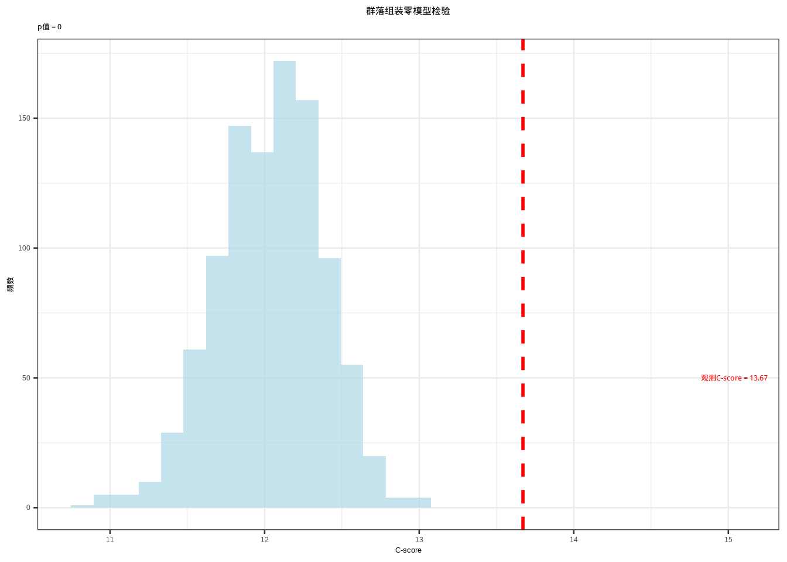
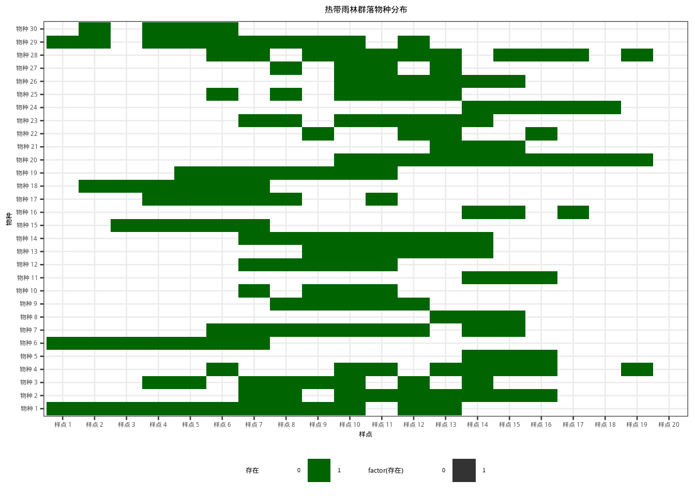
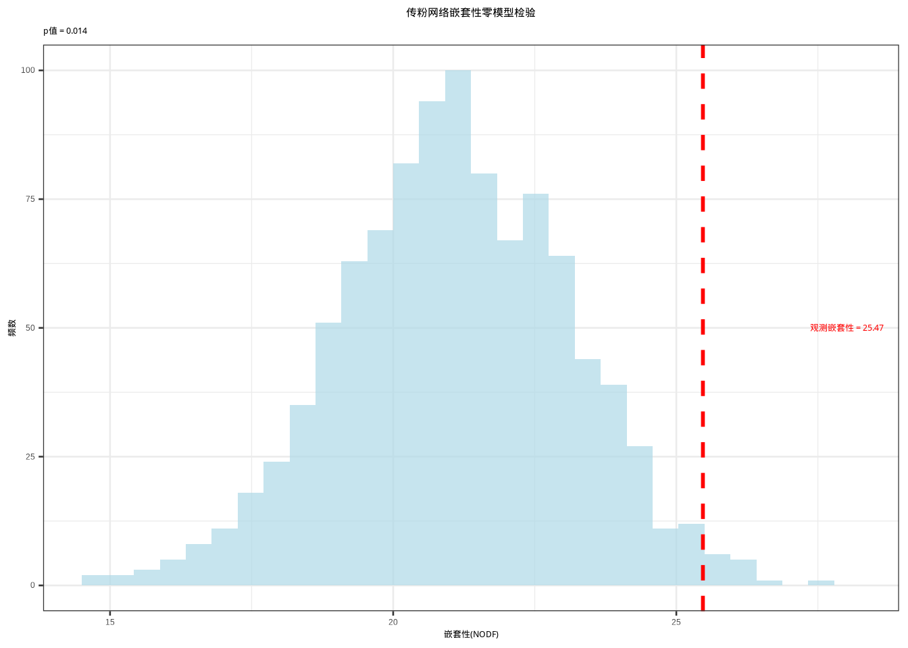
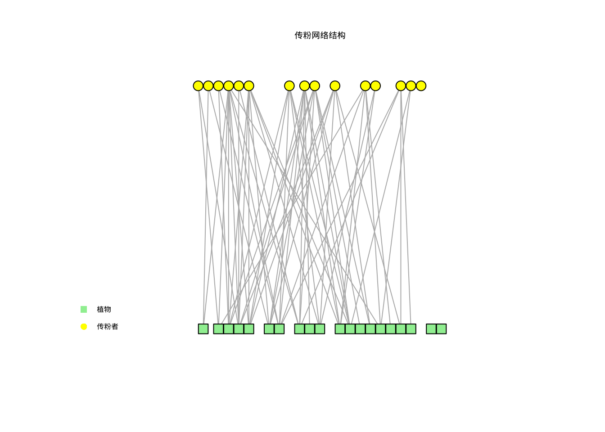
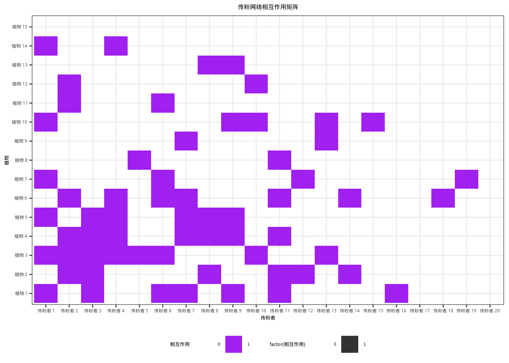
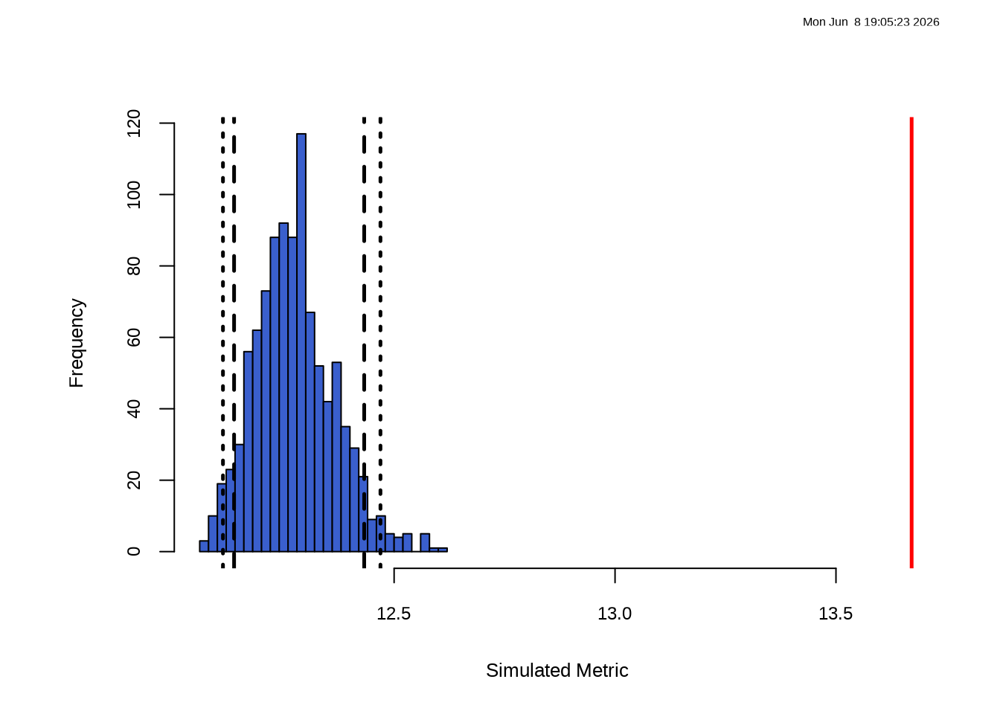
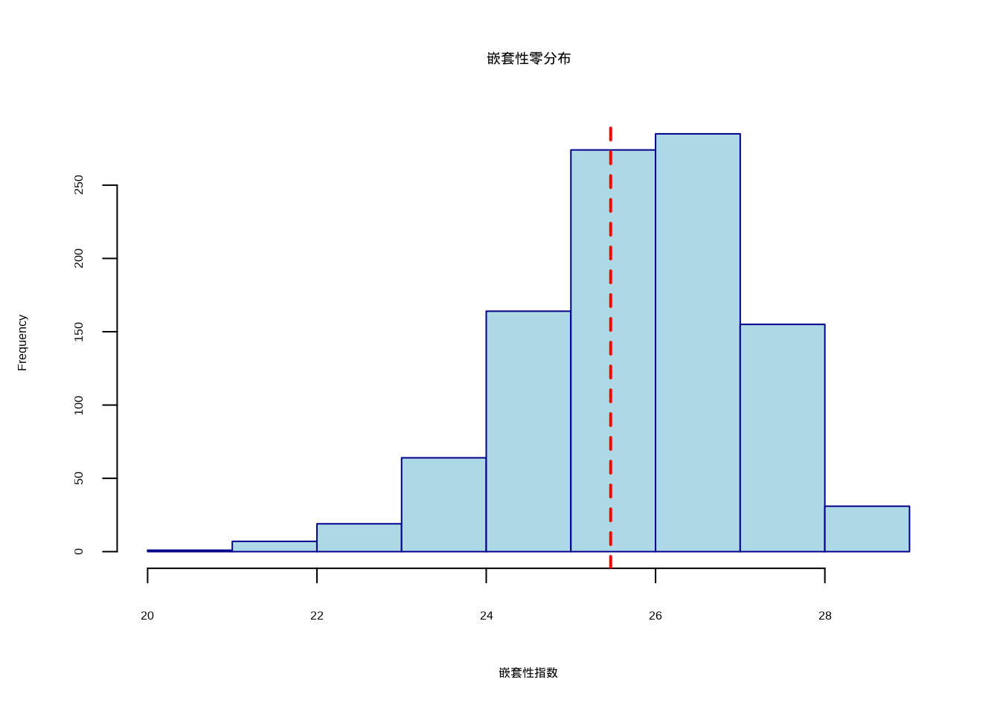

# 生态假设的模拟检验方法


## 引言

在梅花鹿保护研究的探索旅程中，我们已经掌握了基于经典统计分布的假设检验方法，这些方法如同保护生物学家手中的传统工具，在种群动态监测、保护效果评估、栖息地适宜性分析等众多场景中发挥着重要作用。然而，当我们面对梅花鹿保护研究中日益复杂的挑战时，传统方法有时显得力不从心。

本章将带领我们进入统计推断的新天地——基于模拟的假设检验方法。这些现代计算统计技术代表了统计思维的重要演进，它们不再拘泥于传统的理论分布框架，而是通过计算机模拟和概率推理来构建统计量的经验分布。我们将重点探讨蒙特卡洛检验、置换检验和自助法检验这三种核心方法，它们为梅花鹿保护研究提供了处理复杂生态问题的全新视角和强大工具。

在梅花鹿保护研究实践中，我们常常遇到这样的困境：精心设计的统计量却找不到对应的理论分布。比如在研究梅花鹿栖息地选择时，我们可能发现梅花鹿活动位点到水源的距离呈现出某种聚集模式，但如何量化这种聚集程度？即使设计出"平均最近邻距离与随机期望的比值"这样的统计量，其理论分布也无从查考。

这时候，基于模拟的方法展现出其独特价值。我们可以将这种方法想象成保护生物学家的"数字实验室"——在计算机上模拟成千上万次随机过程，构建统计量的经验分布，然后将实际观测值与这个经验分布进行比较。如果观测值落在经验分布的极端位置，我们就有了拒绝随机假设的证据。

这种思维方式打破了传统统计推断的局限，让数据本身"诉说"其内在规律，而不是强行套入预设的理论框架。它特别适合处理梅花鹿保护研究中常见的复杂统计量，为那些经典方法难以解决的问题提供了可行的解决方案。

基于模拟的方法在梅花鹿保护研究中展现出广泛的应用前景，尤其擅长处理那些传统统计方法难以应对的复杂场景。当我们研究梅花鹿的空间分布时，需要量化聚集或分散的程度；分析梅花鹿种群遗传结构时，要评估基因型频率的偏离程度；比较不同保护措施效果时，则要衡量种群参数的差异显著性。这些统计量往往缺乏现成的理论分布支持，但通过计算机模拟，我们可以为它们构建"经验分布"，实现可靠的统计推断。

为了更具体地理解这种方法的实际价值，让我们继续第6章中梅花鹿保护的故事。假设我们在梅花鹿自然保护区内设置了多个固定监测样线，并精确记录了梅花鹿个体的空间坐标。观察发现，梅花鹿在某些区域呈现出明显的聚集分布特征，而另一些区域则相对分散。

为了客观量化这种分布模式，我们采用Ripley's K函数作为统计指标。然而，这个函数的理论分布极其复杂，特别是在考虑边界效应和生境异质性的情况下。

此时，基于模拟的方法展现出其独特优势：我们可以在计算机上模拟成千上万次完全空间随机过程，每次都在相同的保护区范围内随机分布相同数量的梅花鹿个体，然后计算每次模拟的Ripley's K函数值。通过这种方式，我们构建了该统计量在零假设（梅花鹿分布完全随机）下的经验分布。

将实际观测的Ripley's K函数值与这个经验分布进行比较，如果观测值落在分布的极端区域（如前5%或后5%），我们就可以得出梅花鹿分布模式显著偏离随机期望的结论。这种分析方法为理解梅花鹿空间分布的形成机制提供了有力的统计支持。

基于模拟的统计推断方法在梅花鹿保护的多个研究领域都展现出强大的应用潜力。在种群遗传学研究中，这种方法帮助检验梅花鹿基因型频率是否偏离Hardy-Weinberg平衡；保护效果评估中，生态学家利用它比较不同保护措施下的种群动态差异；栖息地适宜性分析中，研究人员则借助它分析环境因子与梅花鹿分布的非随机关联。面对这些多样化的研究问题，基于模拟的方法提供了灵活而可靠的统计解决方案。

从方法学角度看，基于模拟的假设检验主要分为两大类型：置换检验和蒙特卡洛方法。置换检验通过随机重排观测数据的标签来构建零分布，属于非参数检验范畴，不依赖于特定的分布假设。蒙特卡洛方法则是一个更广泛的概念，涵盖了所有基于随机模拟的统计推断技术。

在梅花鹿保护实践中，蒙特卡洛方法主要包含两种形式：参数化蒙特卡洛检验基于理论模型生成模拟数据来构建零分布；非参数化蒙特卡洛方法则通过观测数据的重抽样来实现统计推断，其中最具代表性的就是**自助法（bootstrap）**。自助法检验通过有放回的重抽样来估计统计量的抽样分布，既可以构建置信区间，也能进行假设检验，从概念上可以视为蒙特卡洛方法的一种特殊形式。

这些方法在梅花鹿保护研究中日益重要的原因在于它们能够有效处理生态数据的复杂性特征。梅花鹿保护数据通常具有空间自相关性、时间序列依赖性、异方差性等特点，这些特性往往使得传统参数检验的前提条件难以满足。相比之下，基于模拟的方法更加灵活，不依赖于严格的前提假设，让数据本身揭示其内在规律。

当然，我们也需要认识到基于模拟方法的局限性。它们对计算资源的要求较高，需要进行大量的重复模拟；结果的解释需要格外谨慎，因为模拟次数和具体方法都会影响最终结论。更重要的是，这些统计工具不能替代对梅花鹿生态学机制的深入理解，它们的主要作用是帮助我们评估观测模式是否显著偏离随机期望。

本章将系统介绍基于模拟的假设检验方法，帮助大家掌握蒙特卡洛检验的原理和应用，了解R语言中的具体实现方式；深入理解置换检验的技术细节，学会通过随机化构建零分布；探索自助法检验的强大功能，掌握通过重抽样估计统计量不确定性的技巧。

通过系统学习这些方法，大家将获得处理复杂梅花鹿保护问题的统计工具包，能够应对传统统计方法难以解决的挑战。需要强调的是，统计方法本质上是工具，真正的科学洞察源于对梅花鹿生态学问题的深刻理解和严谨的推理过程。基于模拟的假设检验提供了更灵活、更强大的统计工具，但最终的科学结论必须建立在扎实的生态学理论基础和严谨的实验设计之上。

让我们共同开启这段探索统计推断新天地的旅程，在这里，梅花鹿保护数据不再是需要强行套入理论分布的被动对象，而是能够主动"诉说"种群动态规律的生动主体。

在深入探讨具体的基于模拟的统计方法之前，我们需要首先建立对这些方法在整个统计方法学体系中定位的清晰认识。理解统计方法的发展脉络和层次结构，将帮助我们更好地把握不同方法的应用场景和相互关系。

## 生态假设检验的方法学演进

为了准确把握本章内容在梅花鹿保护研究统计方法体系中的定位，我们需要简要回顾统计方法学的发展历程及其在保护生物学中的应用演进。

**经典统计方法**（前一章内容）主要建立在参数理论基础上，依赖于已知的概率分布（如正态分布、t分布、F分布等）。这些方法包括参数检验（如t检验、方差分析）和传统非参数检验（如符号检验、秩和检验、卡方检验）。在梅花鹿保护研究中，经典方法为种群数量监测、保护效果评估等基础问题提供了可靠的统计工具。

**现代计算统计方法**（本章内容）突破了传统理论分布的限制，主要介绍基于模拟的统计推断技术。这些方法特别适合处理梅花鹿保护研究中常见的复杂问题，如空间分布模式分析、遗传多样性评估、种群动态模拟等。

**基于模拟的方法**通过计算机模拟构建统计量的经验分布，按照数据生成机制可以分为置换检验和蒙特卡洛方法两大类。置换检验通过随机重排观测标签构建零分布，主要用于假设检验，在梅花鹿保护中可用于检验保护区内外的种群参数差异、不同季节活动模式的差异等。

蒙特卡洛方法作为广义的随机模拟方法，包括参数化蒙特卡洛检验和非参数化蒙特卡洛方法。参数化蒙特卡洛检验基于理论模型生成模拟数据，如模拟梅花鹿种群在随机散布假设下的空间分布模式。非参数化蒙特卡洛方法基于观测数据的重抽样，其中自助法（bootstrap）通过有放回重抽样来估计梅花鹿种群参数的抽样分布和构建置信区间，其他蒙特卡洛算法如马尔可夫链蒙特卡洛（MCMC）、重要性抽样等可用于复杂的梅花鹿种群动态模型。

**方法学演进的意义**：
从经典方法到现代方法的演进体现了梅花鹿保护研究统计推断从"理论驱动"向"数据驱动"的重要转变。经典方法依赖于严格的数学理论和分布假设，而现代方法更加灵活，能够处理梅花鹿保护研究中常见的复杂问题，如空间自相关、小样本遗传分析、非标准统计量等。这种演进不是简单的替代关系，而是互补关系——经典方法为现代方法提供了理论基础，现代方法则扩展了经典方法在梅花鹿保护研究中的应用范围。

在梅花鹿保护研究中，选择何种统计方法应该基于研究问题的性质、数据的特性以及可用的计算资源。优秀的保护生物学家应该掌握多种统计工具，能够根据具体保护问题选择最合适的方法，为梅花鹿保护决策提供更可靠的统计支持。

基于对统计方法学演进脉络的理解，我们现在可以深入探讨本章的核心内容——基于模拟的假设检验方法。我们将从最基础且应用广泛的置换检验开始，逐步展开对各类基于模拟方法的系统学习。

## 生态假设的置换检验

置换检验（Permutation Test），又称随机化检验（Randomization Test），是一种基于数据重排的非参数统计检验方法。其核心思想可以追溯到20世纪30年代，由R.A. Fisher和E.J.G. Pitman等人提出，但直到计算机技术普及后才在梅花鹿保护研究中得到广泛应用。

### 置换检验的基本原理

置换检验的基本原理极其优雅：**如果零假设为真，那么观测数据的标签（如处理组和对照组）就是可以任意交换的**。换句话说，如果保护措施确实没有效应，那么将梅花鹿种群参数随机分配到不同组别中，应该不会改变我们感兴趣的统计量（如组间均值差异）的分布特征。

### 置换检验的技术实现过程

置换检验的实施包含三个关键步骤：

**1. 计算观测统计量**
首先，基于原始数据计算我们关心的检验统计量。在梅花鹿保护研究中，这可能是：
- 保护区内外的梅花鹿种群密度差异
- 不同季节梅花鹿活动模式的相似性指数
- 环境梯度上的梅花鹿分布模式统计量

**2. 构建零分布**
通过随机重排观测数据的标签（如保护区标签），每次重排后重新计算检验统计量。重复这一过程数千次，构建统计量在零假设下的经验分布——即零分布。这一过程相当于在计算机上模拟"如果零假设为真，统计量可能呈现的随机变异"。

**3. 计算p值**
将观测统计量与零分布进行比较，计算p值。p值定义为：在零假设下，获得与观测统计量同样极端或更极端结果的概率。具体而言，p值等于零分布中统计量绝对值大于或等于观测统计量绝对值的比例。


### R语言实现示例

以下通过几个典型的梅花鹿保护研究场景展示置换检验在R中的实现：

**示例1：保护区内外的梅花鹿种群密度差异检验**

下面通过保护区内和保护区外梅花鹿种群密度比较的实例，展示置换检验的具体实现过程。这个例子模拟了保护区内和保护区外各20个监测样点的梅花鹿种群密度数据，通过置换检验来评估两组间的差异是否具有统计显著性。

首先进行数据准备和观测统计量计算：


``` r
load(file="data/protected_unprotected.Rdata")
# 计算观测统计量：两组平均梅花鹿种群密度的差异
obs_diff <- mean(protected) - mean(unprotected)
```

接下来进行置换检验的核心过程，通过随机重排构建零分布：


``` r
# 置换检验：通过随机重排构建零分布
n_perm <- 1000  # 置换次数，通常需要足够多次以确保结果稳定
perm_diffs <- numeric(n_perm)  # 存储每次置换得到的梅花鹿种群密度差异值
combined <- c(protected, unprotected)  # 合并两组梅花鹿种群密度数据用于随机重排

# 置换检验循环：每次迭代进行一次随机重排
for (i in 1:n_perm) {
  # 随机重排合并后的数据，模拟零假设下的随机分配
  perm_sample <- sample(combined)

  # 计算重排后的组间梅花鹿种群密度差异
  perm_diffs[i] <- mean(perm_sample[1:20]) - mean(perm_sample[21:40])
}

# 计算p值：评估观测梅花鹿种群密度差异在零分布中的极端程度
p_value <- mean(abs(perm_diffs) >= abs(obs_diff))
```


```
## 梅花鹿保护研究 - 置换检验结果：
```

```
## 观测梅花鹿种群密度差异: 5.25
```

```
## p值: 0
```

**示例2：梅花鹿栖息地植物群落组成差异检验（置换ANOVA）**

群落组成差异检验在梅花鹿保护研究中具有重要意义，特别是在评估不同栖息地类型对植物群落组成的影响时。下面使用vegan包中的adonis2函数进行置换多元方差分析（PERMANOVA），检验核心栖息地和边缘栖息地在植物群落组成上的差异。


``` r
load(file="data/comm_data_groups.Rdata")
# 置换ANOVA检验群落组成差异
# adonis2函数执行基于距离的置换多元方差分析（PERMANOVA）
# 该方法通过置换检验评估组间在群落组成上的差异显著性
adonis_result <- adonis2(comm_data ~ groups, method = "bray")

# 输出分析结果
knitr::kable(adonis_result, caption = "置换ANOVA分析结果", booktabs = TRUE) %>%
  kableExtra::kable_styling(latex_options = c("hold_position"))
```

<table class="table" style="margin-left: auto; margin-right: auto;">
<caption>(\#tab:adonis-result-table)(\#tab:adonis-result-table)置换ANOVA分析结果</caption>
 <thead>
  <tr>
   <th style="text-align:left;">  </th>
   <th style="text-align:right;"> Df </th>
   <th style="text-align:right;"> SumOfSqs </th>
   <th style="text-align:right;"> R2 </th>
   <th style="text-align:right;"> F </th>
   <th style="text-align:right;"> Pr(&gt;F) </th>
  </tr>
 </thead>
<tbody>
  <tr>
   <td style="text-align:left;"> Model </td>
   <td style="text-align:right;"> 1 </td>
   <td style="text-align:right;"> 0.0098147 </td>
   <td style="text-align:right;"> 0.0145518 </td>
   <td style="text-align:right;"> 0.2658007 </td>
   <td style="text-align:right;"> 0.791 </td>
  </tr>
  <tr>
   <td style="text-align:left;"> Residual </td>
   <td style="text-align:right;"> 18 </td>
   <td style="text-align:right;"> 0.6646505 </td>
   <td style="text-align:right;"> 0.9854482 </td>
   <td style="text-align:right;"> NA </td>
   <td style="text-align:right;"> NA </td>
  </tr>
  <tr>
   <td style="text-align:left;"> Total </td>
   <td style="text-align:right;"> 19 </td>
   <td style="text-align:right;"> 0.6744652 </td>
   <td style="text-align:right;"> 1.0000000 </td>
   <td style="text-align:right;"> NA </td>
   <td style="text-align:right;"> NA </td>
  </tr>
</tbody>
</table>

表 \@ref(tab:adonis-result-table) 展示了置换ANOVA分析的结果，从中可以看出不同栖息地类型对植物群落组成的影响是否具有统计显著性。

**示例3：空间自相关检验**

空间自相关分析是空间生态学中的重要内容，用于检验空间数据中是否存在非随机的空间模式。Moran's I指数是常用的空间自相关度量指标，下面通过置换检验来评估其统计显著性。

首先加载空间分析包并准备空间数据：


``` r
# 加载空间数据分析包
library(spdep)  # 提供空间自相关分析和置换检验功能

# 模拟空间数据：30个空间点的坐标和属性值
set.seed(123)  # 设置随机种子确保结果可重复

# 生成30个空间点的坐标，在单位正方形内均匀分布
coords <- cbind(runif(30), runif(30))

# 生成空间属性数据，使用标准正态分布
sp_data <- rnorm(30)
```

接下来构建空间权重矩阵并进行Moran's I置换检验：


``` r
# 创建空间权重矩阵：定义空间邻接关系
# 使用k近邻方法构建邻接关系，每个点选择最近的5个邻居
nb <- knn2nb(knearneigh(coords, k = 5))

# 将邻接关系转换为空间权重列表
w <- nb2listw(nb)

# Moran's I置换检验：检验空间自相关的显著性
# 使用999次置换构建零分布，评估观测Moran's I的极端程度
moran_test <- moran.mc(sp_data, w, nsim = 999)

# 输出检验结果
print(moran_test)
```

```
## 
## 	Monte-Carlo simulation of Moran I
## 
## data:  sp_data 
## weights: w  
## number of simulations + 1: 1000 
## 
## statistic = -0.2891, observed rank = 1, p-value = 0.999
## alternative hypothesis: greater
```

**示例4：使用coin包进行置换检验**

coin包提供了基于条件推断的置换检验框架，支持多种非参数统计检验。下面使用coin包重新分析示例1中的保护区内外物种丰富度数据，展示其简洁的语法和强大的功能。

首先加载coin包并准备数据：


``` r
# 加载条件推断包
library(coin)  # 提供基于置换的非参数检验方法

# 准备数据：使用示例1中的保护区内外物种丰富度数据
# 创建包含数值变量和分组变量的数据框
data <- data.frame(
  value = c(protected, unprotected),  # 合并两组物种丰富度数据
  group = factor(rep(c("保护区内", "保护区外"), each = 20))  # 定义分组因子
)
```

接下来使用coin包进行置换t检验：


``` r
# 置换t检验：检验两组均值差异的显著性
# independence_test函数执行基于置换的独立样本检验
# 使用近似分布，重抽样1000次构建零分布
test_result <- independence_test(value ~ group,
                                data = data,
                                distribution = approximate(
                                  nresample = 1000))

# 输出检验结果
print(test_result)
```

```
## 
## 	Approximative General Independence Test
## 
## data:  value by group (保护区内, 保护区外)
## Z = 3.8802, p-value < 0.001
## alternative hypothesis: two.sided
```

这些示例展示了置换检验在不同生态学场景中的应用，从简单的均值差异检验到复杂的空间分析和群落分析。研究人员可以根据具体研究问题选择合适的置换检验方法。

### 置换检验在生态学中的应用价值与局限

置换检验在生态学研究中展现出独特的应用价值，这主要源于其对生态数据特性的良好适应性。生态数据往往具有复杂的分布特征，如偏态分布、异方差性等，这些特征使得传统的参数检验方法难以适用。置换检验完全基于数据本身，不依赖于任何理论分布假设，这使其能够有效处理生态学中常见的非正态数据。更重要的是，许多生态学研究中关心的统计量，如多样性指数、空间自相关指数、网络拓扑指标等，根本没有现成的理论分布可供参照。置换检验通过构建经验分布的方式，为这些复杂统计量的统计推断提供了可行的解决方案。

在具体应用层面，置换检验能够保持数据的原始结构特征，包括样本量、数据范围等关键信息，这在实际应用中具有重要价值。与传统的参数检验相比，置换检验在小样本情况下表现出更好的适用性。当样本量较小时，参数检验的功效往往不足，而置换检验通过大量的随机化模拟，能够提供相对可靠的统计推断。这种特性使得置换检验特别适合处理生态学研究中常见的有限样本问题。

置换检验在生态学的各个分支领域都有广泛的应用。在群落生态学中，研究人员通过置换ANOVA或置换MANOVA来检验不同处理（如施肥、放牧）对植物群落组成的影响，评估处理间在物种组成上的差异显著性。在空间生态学中，置换检验被用于检验物种的空间分布是否偏离随机模式，通过随机重排物种在空间中的位置来构建Ripley's K函数或Moran's I指数的零分布。行为生态学家利用置换检验来分析动物的行为序列是否具有特定模式，通过随机重排行为事件的时间顺序来检验观测行为序列的非随机性。在保护生物学领域，置换检验被用于比较保护区内外的生物多样性，评估保护措施对物种丰富度和群落结构的影响。

然而，置换检验也存在一些固有的局限性。首先，置换检验对计算资源的要求较高，通常需要进行1000-10000次的随机化重复，这在大规模数据分析中可能成为瓶颈。其次，不同的随机化方案可能导致不同的结果，研究人员需要根据具体研究问题谨慎选择适当的随机化策略。最重要的是，统计显著性并不等同于生态重要性，置换检验的结果仍需结合生态学机制进行深入解释，避免过度依赖p值而忽视生态学意义。

在与其他统计方法的比较中，置换检验与参数检验形成互补关系而非替代关系。当参数检验的前提条件满足时，参数检验通常具有更高的统计效率；当前提条件不满足时，置换检验提供了可靠的替代方案。与自助法相比，两者虽然都基于重抽样思想，但应用目的不同：自助法通过有放回抽样来估计统计量的抽样分布，主要用于构建置信区间；而置换检验通过无放回的标签重排来构建零分布，主要用于假设检验。与蒙特卡洛检验的关系则体现在数据生成机制的差异上：蒙特卡洛检验基于理论模型生成模拟数据，而置换检验基于观测数据的重排，两者都是基于模拟的统计方法，但理论基础和应用场景有所不同。

在实际应用中，研究人员需要注意几个关键的技术细节。随机化次数的选择直接影响结果的精确性，建议至少进行1000次随机化，对于精确的p值估计，可能需要10000次或更多。为确保结果的可重复性，应在每次分析前设置随机数种子。当进行多个检验时，需要考虑多重比较问题，可采用Bonferroni校正或错误发现率控制等方法进行校正。最重要的是，统计显著性必须结合生态学意义进行解释，避免过度依赖p值而忽视生态学机制的理解。

置换检验代表了生态统计学从理论驱动向数据驱动的重要转变，为处理复杂的生态学问题提供了灵活而强大的统计工具。通过理解其原理、掌握其应用、认识其局限，生态学家能够在面对各种非标准统计问题时做出更加可靠的统计推断，推动生态学研究的深入发展。

在掌握了置换检验的基本原理和应用方法后，我们现在转向另一种重要的基于模拟的统计方法——蒙特卡洛检验。虽然两者都基于随机模拟的思想，但它们在数据生成机制和应用场景上存在重要差异，理解这些差异将帮助我们更好地选择合适的方法。

## 生态假设的蒙特卡洛检验

### 蒙特卡洛方法的概念体系

蒙特卡洛方法是一个广义的概念，指所有基于随机模拟的统计推断方法。在生态统计学中，蒙特卡洛方法按照数据生成机制可以分为两大类：

**参数化蒙特卡洛检验**基于理论模型或假设分布生成全新的模拟数据，主要用于检验观测数据与理论模型的拟合优度。**非参数化蒙特卡洛方法**基于观测数据的重抽样，其中最重要的就是**自助法（bootstrap）**，它通过有放回的重抽样来估计统计量的抽样分布，主要用于构建置信区间和参数估计。

### 蒙特卡洛检验的基本原理

蒙特卡洛检验特指参数化蒙特卡洛检验，是一种基于随机模拟的统计推断方法，其名称来源于著名的蒙特卡洛赌场，反映了该方法依赖于随机抽样的本质。与置换检验不同，蒙特卡洛检验不是基于观测数据的重排，而是基于理论模型或假设分布生成模拟数据，通过大量的随机模拟来构建统计量的经验分布。

蒙特卡洛检验的核心思想是通过计算机模拟来近似统计量的抽样分布，特别适用于那些理论分布未知或过于复杂的统计量。在生态学研究中，许多复杂的统计量，如空间生态学中的Ripley's K函数、群落生态学中的$\beta$多样性指数、系统发育分析中的进化速率等，都没有现成的理论分布可供参照。蒙特卡洛检验为这些复杂统计量的统计推断提供了可行的解决方案。

蒙特卡洛检验的实施过程通常包括三个关键步骤。首先，基于零假设构建理论模型或假设分布，这个模型描述了在零假设成立时数据应该遵循的分布特征。其次，从这个理论模型中重复生成大量的模拟数据集，每次模拟都计算我们关心的统计量。最后，基于这些模拟统计量构建经验分布，将观测统计量与这个经验分布进行比较，计算p值或构建置信区间。

让我们通过一个具体的生态学例子来详细说明这三个步骤。假设我们正在研究梅花鹿在保护区内的空间分布模式，我们想要检验观测到的梅花鹿个体间距是否显著偏离随机分布的期望。零假设是梅花鹿在保护区内遵循完全空间随机分布模式。

**步骤1：构建理论模型**
基于零假设，我们构建一个完全空间随机的理论模型。在这个模型中，梅花鹿个体在保护区内随机分布，个体间距和分布方向都是随机的。具体来说，我们可以假设梅花鹿个体的空间位置在保护区内均匀分布，个体间距遵循特定的空间分布模式。这个理论模型描述了在零假设成立时梅花鹿空间分布应该遵循的分布特征。

**步骤2：生成模拟数据集并计算统计量**
从构建的理论模型中，我们重复生成大量的模拟数据集。每次模拟都随机生成与观测数据相同数量的梅花鹿个体位置。对于每个模拟数据集，我们计算关心的统计量，比如平均个体间距、最近邻距离、或者空间聚集指数。假设我们关心的是梅花鹿个体的平均间距，那么每次模拟都会计算这个平均间距统计量。重复这个过程1000次，我们就得到了1000个在零假设下的平均间距值。

**步骤3：构建经验分布并比较**
基于这1000个模拟统计量，我们构建了平均个体间距在零假设下的经验分布。然后，我们将实际观测到的梅花鹿平均个体间距与这个经验分布进行比较。如果观测值落在这个经验分布的极端位置（比如最高的5%或最低的5%），那么我们就可以拒绝零假设，认为梅花鹿的空间分布模式显著偏离了随机分布的期望。

这个例子清晰地展示了蒙特卡洛检验的逻辑流程：从理论模型构建，到模拟数据生成，再到统计比较。整个过程不依赖于任何现成的理论分布，而是完全基于计算机模拟来构建统计推断的基础。

与置换检验相比，蒙特卡洛检验在数据生成机制上存在根本差异。置换检验基于观测数据的重排，通过随机交换数据标签来构建零分布，其前提假设是如果零假设为真，那么数据的标签就是可以任意交换的。而蒙特卡洛检验则基于理论模型生成全新的模拟数据，其前提假设是我们能够准确描述零假设下的数据生成过程。这种差异使得两种方法适用于不同的研究场景：置换检验更适合于比较组间差异的检验，而蒙特卡洛检验更适合于检验观测数据与理论模型的拟合优度。

在生态学应用中，蒙特卡洛检验具有独特的优势。它能够处理那些置换检验难以适用的场景，比如检验观测数据是否来自某个特定的理论分布，或者评估复杂生态模型的拟合优度。例如，在检验物种的空间分布是否遵循完全空间随机过程时，蒙特卡洛检验可以通过模拟完全空间随机过程来构建期望分布；在检验系统发育信号时，可以通过模拟布朗运动演化过程来构建零分布。

### 蒙特卡洛检验的主要类型

在生态学研究中，常用的蒙特卡洛检验方法包括完全空间随机性检验、系统发育信号检验、群落零模型检验和模型拟合优度检验。完全空间随机性检验用于检验物种的空间分布是否遵循完全空间随机过程，通过模拟完全空间随机过程生成期望分布并与观测空间模式进行比较。系统发育信号检验用于检验性状是否具有系统发育保守性，通过模拟布朗运动演化过程构建零分布来检验观测性状的系统发育信号强度。群落零模型检验用于检验群落物种共存是否随机，通过随机化群落矩阵构建期望分布来检验观测群落的非随机性。模型拟合优度检验用于检验观测数据与理论模型的拟合程度，通过从理论模型生成模拟数据来构建拟合优度统计量的经验分布。

### R语言实现示例：空间分布随机性检验

下面通过空间分布随机性检验的R代码来具体说明蒙特卡洛检验的三个步骤：


``` r
# 检验物种空间分布是否随机
set.seed(123)  # 设置随机种子保证结果可重复
observed_pattern <- matrix(runif(100), ncol = 2) # 在单位正方形内生成100个观测空间点

# 蒙特卡洛模拟：完全空间随机过程
n_sim <- 1000  # 模拟次数
sim_stats <- numeric(n_sim)  # 存储每次模拟的统计量

for (i in 1:n_sim) {
  # 模拟完全空间随机过程：在相同区域内随机生成100个点
  sim_pattern <- matrix(runif(100), ncol = 2)
  # 计算空间聚集统计量：使用点间平均距离作为聚集程度指标
  sim_stats[i] <- mean(dist(sim_pattern))
}

# 计算观测统计量：观测数据的点间平均距离
obs_stat <- mean(dist(observed_pattern))

# 计算p值：观测统计量在零分布中的位置
p_value <- mean(sim_stats <= obs_stat)
```


```
## 蒙特卡洛检验结果：
```

```
## 观测统计量: 0.5167571
```

```
## p值: 0.43
```

**代码与蒙特卡洛检验步骤的对应关系：**

**步骤1：构建理论模型**
- 理论模型：完全空间随机过程（Complete Spatial Randomness, CSR）
- 代码体现：`matrix(runif(100), ncol = 2)` 在单位正方形内随机生成100个点
- 生态学意义：假设物种在空间中的分布是完全随机的，没有任何聚集或分散模式

**步骤2：生成模拟数据集并计算统计量**
- 模拟数据生成：`for (i in 1:n_sim)` 循环生成1000个模拟数据集
- 统计量计算：`mean(dist(sim_pattern))` 计算每个模拟数据集的空间点间平均距离
- 生态学意义：平均距离统计量反映了空间点的聚集程度，较小的平均距离表示空间聚集

**步骤3：构建经验分布并比较**
- 经验分布构建：`sim_stats` 向量包含了1000个模拟统计量
- 观测统计量：`mean(dist(observed_pattern))` 计算观测数据的平均距离
- 统计比较：`mean(sim_stats <= obs_stat)` 计算p值，即模拟统计量小于等于观测统计量的比例
- 生态学解释：如果p值很小（如<0.05），说明观测到的空间聚集模式在随机过程中很少出现，物种分布显著偏离随机模式

这个具体的代码示例清晰地展示了蒙特卡洛检验从理论模型构建到统计推断的完整流程，为生态学家检验空间分布模式提供了实用的工具。

这些示例展示了蒙特卡洛检验在生态学不同领域的应用，从空间生态学到系统发育分析，再到群落生态学。蒙特卡洛检验为处理那些理论分布未知的复杂统计问题提供了强大的工具，是生态统计学家工具箱中不可或缺的一部分。

在了解了参数化蒙特卡洛检验后，我们现在转向蒙特卡洛方法中的另一个重要分支——非参数化蒙特卡洛方法，其中最具代表性的就是自助法检验。自助法作为蒙特卡洛方法的一种特殊形式，在参数估计和置信区间构建方面具有独特的优势。

## 生态假设的自助法检验

### 自助法的基本原理

自助法（bootstrap）是蒙特卡洛方法的一种特殊形式，属于非参数化蒙特卡洛方法。其核心思想是通过对观测数据进行有放回的重抽样来估计统计量的抽样分布。自助法由Bradley Efron在1979年提出，现已成为现代统计学中最重要的工具之一。

自助法的基本假设是：观测样本能够代表总体的分布特征。通过对观测样本进行有放回的重抽样，我们可以生成大量的"自助样本"，这些自助样本在统计上等价于从原始总体中抽取的新样本。

### 自助法的实施步骤

自助法的实施过程包括三个关键步骤：

**步骤1：生成自助样本**
从原始观测数据中进行有放回的重抽样，生成与原始样本大小相同的自助样本。这个过程重复B次（通常B=1000-10000），得到B个自助样本。

**步骤2：计算统计量**
对每个自助样本计算我们关心的统计量，比如均值、中位数、回归系数、多样性指数等。这样就得到了统计量的自助分布。

**步骤3：构建置信区间或进行假设检验**
基于自助分布，我们可以构建统计量的置信区间，或者进行假设检验。常用的置信区间构建方法包括百分位数法、偏差校正法等。

### 自助法在生态学中的应用

自助法在生态学研究中有着广泛的应用，特别是在梅花鹿保护研究中：

**参数估计的不确定性评估**：估计生态学参数（如梅花鹿种群增长率、物种丰富度、多样性指数）的置信区间。

**模型参数的不确定性分析**：评估生态模型参数估计的不确定性，如梅花鹿栖息地适宜性模型的系数、种群动态模型的参数等。

**假设检验**：通过构建统计量的自助分布，进行非参数的假设检验，如检验梅花鹿种群参数的差异显著性。

**小样本问题处理**：在小样本情况下，自助法能够提供比传统参数方法更可靠的统计推断，特别适合梅花鹿保护研究中的有限样本分析。

### R语言实现示例

**示例1：多样性指数置信区间估计**

``` r
# 使用boot包进行自助法分析
library(boot)

# 模拟群落数据
set.seed(123)
species_counts <- rpois(30, lambda = 5)

# 定义多样性指数计算函数
shannon_func <- function(data, indices) {
  d <- data[indices]
  p <- d / sum(d)
  -sum(p * log(p))
}

# 自助法估计
boot_result <- boot(species_counts, shannon_func, R = 1000)
print(boot_result)
```

```
## 
## ORDINARY NONPARAMETRIC BOOTSTRAP
## 
## 
## Call:
## boot(data = species_counts, statistic = shannon_func, R = 1000)
## 
## 
## Bootstrap Statistics :
##     original      bias    std. error
## t1* 3.318858 0.002494391  0.01870289
```

``` r
# 计算95%置信区间
boot_ci <- boot.ci(boot_result, type = "perc")
print(boot_ci)
```

```
## BOOTSTRAP CONFIDENCE INTERVAL CALCULATIONS
## Based on 1000 bootstrap replicates
## 
## CALL : 
## boot.ci(boot.out = boot_result, type = "perc")
## 
## Intervals : 
## Level     Percentile     
## 95%   ( 3.281,  3.356 )  
## Calculations and Intervals on Original Scale
```

### 自助法的优势与局限

**优势**：
- 不依赖于理论分布假设
- 适用于复杂统计量和模型
- 在小样本情况下表现良好
- 能够处理非标准统计问题

**局限**：
- 对异常值敏感
- 在极端偏态分布中可能表现不佳
- 计算强度较大
- 需要足够大的原始样本

自助法作为蒙特卡洛方法的重要组成部分，为生态学家提供了强大的统计推断工具，特别适用于处理那些传统参数方法难以解决的复杂生态学问题。

在掌握了基于模拟的统计方法的基本原理后，我们现在转向这些方法在具体生态学问题中的应用。首先探讨基于模拟的假设检验在种群遗传学中的应用，特别是基因型频率检验这一重要领域。

## 生态学零模型检验

### 零模型的基本概念与生态学意义

**生态学问题背景**：零模型（Null Model）是生态学中用于检验观测模式是否显著偏离随机期望的统计工具。在生态学研究中，我们经常观察到各种复杂的生态模式——物种在群落中的特定组合、生态网络中物种间的相互作用、空间分布中的聚集或分散模式等。这些模式是真实的生态过程（如竞争、捕食、环境过滤）的结果，还是仅仅反映了随机过程？零模型为我们提供了回答这个问题的严谨统计框架。

**零模型的核心思想**：零模型通过构建一个"随机期望"来检验观测模式。其基本逻辑是：如果观测模式与随机期望没有显著差异，那么我们可以认为观测模式可能只是随机过程的产物；如果观测模式显著偏离随机期望，那么可能存在某种生态过程在起作用。

**生态学意义**：零模型检验在生态学中具有广泛的应用价值。它帮助我们区分真实的生态规律与随机波动，为理解群落组装机制、物种共存模式、生态网络结构等基本生态学问题提供了重要的统计工具。

### 群落组装零模型检验

**生态学问题背景**：群落组装是生态学的核心问题之一。我们想要理解为什么特定的物种会在特定的群落中共同出现。是环境过滤、种间竞争、扩散限制等生态过程决定了群落的物种组成，还是物种的组合只是随机过程的结果？

**传统方法的局限性**：传统的群落分析方法（如多样性指数、相似性分析）虽然能够描述群落的特征，但难以区分这些特征是生态过程的结果还是随机期望。传统的统计检验往往依赖于特定的分布假设，而这些假设在复杂的群落数据中往往不成立。

**基于模拟的优势**：群落组装零模型通过随机化群落矩阵来构建期望分布，不依赖于特定的分布假设，特别适合处理：
- 复杂的物种-环境关系
- 多物种间的相互作用
- 空间和时间异质性
- 小样本群落数据

**生态学实例：检验梅花鹿栖息地植物群落共存机制**

假设我们研究梅花鹿栖息地中植物物种的共存机制。我们在一个1平方公里的固定监测区域中记录了所有主要植物物种，获得了物种组成数据。我们想要检验植物物种在群落中的共存是否随机，还是受到生态过程的约束。

**零模型检验过程**：

1. **构建零模型**：基于不同的随机化算法构建零模型
   - **固定行和列总和**：保持物种出现频率和样点物种丰富度不变
   - **固定行总和**：只保持物种出现频率不变
   - **固定列总和**：只保持样点物种丰富度不变

2. **计算检验统计量**：使用群落结构指数，如：
   - **C-score**：衡量物种共现的非随机性
   - **Checkerboard score**：检测竞争排斥模式
   - **Nestedness**：检验群落的嵌套结构

3. **随机化模拟**：重复模拟1000次，每次计算检验统计量

4. **构建经验分布**：基于模拟结果构建统计量的零分布

5. **计算p值**：比较观测统计量与零分布的位置

**R语言实现示例**：

下面的代码展示了群落组装零模型检验的具体实现过程。首先我们模拟热带雨林群落数据并执行零模型分析：


``` r
# 群落组装零模型检验
library(vegan)
library(bipartite)

load(file="data/comm_matrix.RData")
# 计算观测C-score（物种共现非随机性）
calc_c_score <- function(mat) {
  n_spp <- nrow(mat)
  c_scores <- numeric(choose(n_spp, 2))
  idx <- 1

  for (i in 1:(n_spp - 1)) {
    for (j in (i + 1):n_spp) {
      # 计算物种i和j的共现模式
      both_present <- sum(mat[i, ] == 1 & mat[j, ] == 1)
      only_i <- sum(mat[i, ] == 1 & mat[j, ] == 0)
      only_j <- sum(mat[i, ] == 0 & mat[j, ] == 1)

      c_scores[idx] <- only_i * only_j
      idx <- idx + 1
    }
  }
  return(mean(c_scores))
}

obs_c_score <- calc_c_score(comm_matrix)

# 零模型模拟：固定行和列总和
n_sim <- 1000
sim_c_scores <- numeric(n_sim)

for (i in 1:n_sim) {
  # 使用swap算法随机化群落矩阵
  sim_matrix <- comm_matrix

  # 简单的随机化：保持行和列总和不变
  # 在实际应用中可以使用更复杂的算法如swap算法
  sim_matrix <- r2dtable(1, rowSums(comm_matrix),
                         colSums(comm_matrix))[[1]]
  sim_matrix[sim_matrix > 0] <- 1

  sim_c_scores[i] <- calc_c_score(sim_matrix)
}

# 计算p值
p_value <- mean(sim_c_scores >= obs_c_score)
cat("观测C-score:", obs_c_score, "\n")
```

```
## 观测C-score: 13.67126
```

``` r
cat("零模型检验p值:", p_value, "\n")
```

```
## 零模型检验p值: 0
```

图\@ref(fig:c-score-null-dist)展示了群落组装零模型检验的C-score零分布：

<div class="figure" style="text-align: center">

<p class="caption">(\#fig:c-score-null-dist)热带雨林群落组装零模型检验：C-score零分布与观测值比较。使用虚线标识观测值位置，确保在彩色显示和黑白打印时都能清晰识别</p>
</div>

图\@ref(fig:community-matrix-heatmap)展示了热带雨林群落的物种分布热图：

<div class="figure" style="text-align: center">

<p class="caption">(\#fig:community-matrix-heatmap)热带雨林群落物种分布热图：基于环境梯度的物种分布模式。使用颜色和透明度组合表示物种存在状态</p>
</div>

**生态学意义**：如果零模型检验显示显著的C-score（p < 0.05），表明树种的共现模式显著偏离随机期望。较高的C-score通常表示物种间存在竞争排斥——物种倾向于避免在相同的样点中共存。这支持了"竞争排斥"假说在热带雨林群落组装中的重要性。

### 生态网络零模型检验

**生态学问题背景**：生态网络（如食物网、传粉网络、种子散布网络）是生态系统中物种间相互作用的复杂表现形式。理解生态网络的结构特征对于揭示生态系统的稳定性和功能至关重要。我们想要知道观测到的网络结构（如模块化、嵌套性、连接性）是否显著偏离随机期望。

**传统方法的挑战**：传统的网络分析方法主要描述网络的结构特征，但难以评估这些特征是否具有统计显著性。网络结构的复杂性使得理论分布难以确定，特别是对于真实生态网络中常见的非随机模式。

**基于模拟的优势**：生态网络零模型通过随机化网络结构来构建期望分布，能够：
- 检验网络拓扑特征的统计显著性
- 区分不同生态过程对网络结构的影响
- 处理各种类型的生态网络（二分网络、加权网络等）
- 考虑网络的生物学约束（如物种的生态位）

**生态学实例：检验传粉网络的嵌套结构**

假设我们研究地中海灌丛生态系统的传粉网络。我们记录了植物物种与传粉昆虫物种之间的相互作用，构建了一个传粉网络。我们想要检验这个网络是否具有显著的嵌套结构——一种常见的生态网络模式，其中特化物种倾向于与泛化物种的子集相互作用。

**零模型检验过程**：

1. **构建零模型**：使用不同的随机化算法
   - **固定度分布**：保持每个物种的连接数不变
   - **固定连接数**：只保持网络的总连接数不变
   - **概率模型**：基于物种特性生成随机网络

2. **计算检验统计量**：使用网络嵌套性指数，如：
   - **NODF**（Nestedness based on Overlap and Decreasing Fill）
   - **温度**（Matrix Temperature）
   - **二分网络嵌套性**

3. **随机化模拟**：重复模拟1000次，每次计算嵌套性指数

4. **构建经验分布**：基于模拟结果构建嵌套性指数的零分布

5. **计算p值**：比较观测嵌套性与零分布的位置

**R语言实现示例**：

下面的代码展示了传粉网络嵌套性零模型检验的具体实现过程。首先我们模拟传粉网络数据并执行零模型分析：


``` r
# 生态网络零模型检验：传粉网络嵌套性
library(bipartite)
library(igraph)

load(file="data/pollination_network.RData")
# 计算观测嵌套性（NODF）
obs_nestedness <- nested(pollination_network, method = "NODF2")

# 零模型模拟：固定行和列总和
n_sim <- 1000
sim_nestedness <- numeric(n_sim)

for (i in 1:n_sim) {
  # 使用nullmodel函数生成零模型
  sim_network <- pollination_network

  # 保持行和列总和不变的随机化
  sim_network <- r2dtable(
    1, rowSums(pollination_network),
    colSums(pollination_network)
  )[[1]]
  sim_network[sim_network > 0] <- 1

  sim_nestedness[i] <- nested(sim_network, method = "NODF2")
}

# 计算p值
p_value <- mean(sim_nestedness >= obs_nestedness)
cat("观测嵌套性(NODF):", obs_nestedness, "\n")
```

```
## 观测嵌套性(NODF): 25.46973
```

``` r
cat("零模型检验p值:", p_value, "\n")
```

```
## 零模型检验p值: 0.014
```

图\@ref(fig:nestedness-null-dist)展示了传粉网络嵌套性零模型检验的零分布：

<div class="figure" style="text-align: center">

<p class="caption">(\#fig:nestedness-null-dist)传粉网络嵌套性零模型检验：嵌套性零分布与观测值比较。使用虚线标识观测值位置，确保在彩色显示和黑白打印时都能清晰识别</p>
</div>

图\@ref(fig:pollination-network-structure)展示了传粉网络的结构图：

<div class="figure" style="text-align: center">

<p class="caption">(\#fig:pollination-network-structure)传粉网络结构可视化：植物与传粉者的二分网络。使用颜色和形状组合区分不同类型节点</p>
</div>

图\@ref(fig:pollination-matrix-heatmap)展示了传粉网络相互作用的矩阵热图：

<div class="figure" style="text-align: center">

<p class="caption">(\#fig:pollination-matrix-heatmap)传粉网络相互作用矩阵热图：嵌套结构的可视化。使用颜色和透明度组合表示相互作用存在状态</p>
</div>

**生态学意义**：如果零模型检验显示显著的嵌套性（p < 0.05），表明传粉网络的结构确实具有嵌套模式。嵌套结构通常被认为能够增强生态网络的稳定性和韧性——当某些物种消失时，嵌套结构有助于维持网络的连接性。这种结构信息对于理解传粉服务的稳定性和设计保护策略具有重要意义。

### 零模型检验的方法学比较与选择

**不同类型的零模型算法**：

1. **完全随机模型**：
   - 算法：完全随机重排相互作用
   - 适用场景：检验网络连接性的非随机性
   - 生态学意义：最基本的零模型，检验是否存在任何非随机结构

2. **固定度分布模型**：
   - 算法：保持每个物种的连接数不变
   - 适用场景：检验网络结构的其他特征（如嵌套性、模块化）
   - 生态学意义：考虑物种生态位宽度的约束

3. **概率模型**：
   - 算法：基于物种特性生成随机网络
   - 适用场景：检验特定生态假说
   - 生态学意义：整合生物学知识构建更真实的零模型

**生态学研究的最佳实践**：

1. **多模型比较**：使用多种零模型算法相互验证
2. **生物学合理性**：选择与生态过程相符的随机化算法
3. **敏感性分析**：检验结果对不同零模型算法的敏感性
4. **生态学解释**：结合生态学机制解释统计结果

**R语言中的零模型分析工具**：

下面的代码展示了常用的零模型分析工具及其应用。首先我们加载相关包并执行物种共现零模型分析：


``` r
# 常用的零模型分析包
library(vegan) # 群落生态学零模型
library(bipartite) # 二分网络零模型
library(igraph) # 网络分析
library(EcoSimR) # 生态学零模型
library(spaa) # 物种关联分析

# EcoSimR包中的零模型分析示例
library(EcoSimR)

# 物种共现零模型
# 使用固定行和列总和的算法
cooc_null <- cooc_null_model(comm_matrix,
  algo = "sim9",
  nReps = 1000,
  suppressProg = TRUE
)

summary(cooc_null)
```

```
## Time Stamp:  Thu Dec 11 04:31:04 2025 
## Reproducible:  
## Number of Replications:  
## Elapsed Time:  0.55 secs 
## Metric:  c_score 
## Algorithm:  sim9 
## Observed Index:  13.671 
## Mean Of Simulated Index:  12.275 
## Variance Of Simulated Index:  0.0081194 
## Lower 95% (1-tail):  12.138 
## Upper 95% (1-tail):  12.432 
## Lower 95% (2-tail):  12.113 
## Upper 95% (2-tail):  12.469 
## Lower-tail P >  0.999 
## Upper-tail P <  0.001 
## Observed metric > 1000 simulated metrics 
## Observed metric < 0 simulated metrics 
## Observed metric = 0 simulated metrics 
## Standardized Effect Size (SES):  15.494
```

``` r
# 网络嵌套性零模型
# 使用vegan包中的permatswap函数
net_null <- permatswap(pollination_network,
                       method = "quasiswap",
                       times = 1000)

# 提取模拟结果并计算嵌套性
null_results <- sapply(net_null$perm, function(mat) {
  nested(mat, method = "NODF2")
})

# 计算观测嵌套性
obs_nestedness <- nested(pollination_network, method = "NODF2")

# 计算p值
p_value <- mean(null_results >= obs_nestedness)
cat("观测嵌套性:", obs_nestedness, "\n")
```

```
## 观测嵌套性: 25.46973
```

``` r
cat("p值:", p_value, "\n")
```

```
## p值: 0.628
```

图\@ref(fig:cooc-null-model-plot)展示了EcoSimR包中物种共现零模型的检验结果：

<div class="figure" style="text-align: center">

<p class="caption">(\#fig:cooc-null-model-plot)物种共现零模型检验：EcoSimR包分析结果</p>
</div>

图\@ref(fig:nestedness-null-hist)展示了网络嵌套性零模型的零分布直方图：

<div class="figure" style="text-align: center">

<p class="caption">(\#fig:nestedness-null-hist)网络嵌套性零模型检验：嵌套性指数零分布。使用虚线标识观测值位置，确保在彩色显示和黑白打印时都能清晰识别</p>
</div>

### 生态学应用与保护意义

**保护生物学应用**：

- **保护区设计**：基于物种共现模式优化保护区网络
- **入侵物种风险评估**：检验外来物种与本地物种的相互作用模式
- **生态系统恢复**：评估恢复后群落的组装过程

**群落生态学应用**：

- **群落构建机制**：区分环境过滤、竞争排斥、扩散限制的相对重要性
- **生物多样性维持**：理解物种共存机制
- **生态系统功能**：检验网络结构与生态系统功能的关系

**全球变化研究**：

- **气候变化响应**：监测群落结构对气候变化的响应
- **栖息地破碎化**：检验生境破碎对物种相互作用的影响
- **物种分布变化**：预测物种分布范围变化的生态后果

**生态学意义**：零模型检验为生态学家提供了强大的统计工具来检验生态学假说。通过构建合理的随机期望，我们能够更可靠地推断观测生态模式的形成机制，为理解生态过程、预测生态系统变化和制定有效的保护策略提供坚实的科学基础。这些方法特别适合处理生态学中常见的复杂模式和小样本问题，是现代生态学研究不可或缺的统计工具。

## 总结

基于模拟的假设检验方法代表了生态统计学从理论驱动向数据驱动的重要转变，为处理复杂的生态学问题提供了灵活而强大的统计工具。本章系统介绍了置换检验、蒙特卡洛检验和自助法检验这三种核心方法的基本原理、技术实现和生态学应用，展现了这些方法在梅花鹿保护研究中的独特价值。

置换检验通过随机重排观测数据的标签来构建零分布，其核心思想是如果零假设为真，那么数据的标签就是可以任意交换的。这种方法特别适合检验组间差异的显著性，如保护区内外的梅花鹿种群密度差异、不同栖息地类型的植物群落组成差异等。置换检验的优势在于完全不依赖于理论分布假设，能够有效处理生态学中常见的非正态数据、小样本问题和复杂统计量。在R语言中，我们可以通过简单的循环实现置换检验，也可以使用专门的包如coin和vegan来执行更复杂的置换分析。

蒙特卡洛检验则基于理论模型或假设分布生成模拟数据来构建统计量的经验分布，特别适用于那些理论分布未知或过于复杂的统计量。与置换检验不同，蒙特卡洛检验不是基于观测数据的重排，而是基于理论模型生成全新的模拟数据。这种方法在空间生态学、系统发育分析和群落生态学中具有广泛应用，如检验物种空间分布是否遵循完全空间随机过程、评估系统发育信号的显著性等。蒙特卡洛检验的实施过程包括构建理论模型、生成模拟数据集、计算统计量和构建经验分布三个关键步骤。

自助法作为蒙特卡洛方法的一种特殊形式，通过对观测数据进行有放回的重抽样来估计统计量的抽样分布。自助法主要用于构建置信区间和参数估计，特别适合处理小样本问题和复杂统计量的不确定性评估。在梅花鹿保护研究中，自助法可以用于估计多样性指数的置信区间、评估生态模型参数的不确定性、进行非参数的假设检验等。自助法的基本假设是观测样本能够代表总体的分布特征，通过对观测样本进行有放回的重抽样，我们可以生成大量的自助样本，这些自助样本在统计上等价于从原始总体中抽取的新样本。

这些基于模拟的方法在生态学的各个分支领域都展现出广泛的应用价值。在种群遗传学中，它们为Hardy-Weinberg平衡检验和连锁不平衡检验提供了可靠的统计框架，特别是在小样本和稀有等位基因情况下。在群落生态学中，基于模拟的方法支持多样性差异检验、相似性分析和群落组装机制研究，为理解物种共存模式提供了重要的统计工具。在空间生态学中，这些方法能够有效处理边界效应、空间自相关和多重尺度分析等复杂问题，为理解物种空间分布的形成机制提供了可靠的统计推断。在系统发育分析中，基于模拟的方法支持系统发育信号检验和系统发育独立对比分析，为理解性状的进化历史提供了严谨的统计框架。

生态学零模型检验作为基于模拟方法的综合应用，为理解生态模式的形成机制提供了系统的统计框架。通过构建合理的随机期望，零模型检验帮助我们区分真实的生态规律与随机波动，为理解群落组装机制、物种共存模式、生态网络结构等基本生态学问题提供了重要的统计工具。在群落组装研究中，零模型检验可以检验物种共现的非随机性；在生态网络分析中，零模型检验可以评估网络结构特征（如嵌套性、模块化）的统计显著性。

基于模拟的假设检验方法虽然具有诸多优势，但也存在一些固有的局限性。这些方法对计算资源的要求较高，通常需要进行大量的重复模拟；不同的随机化方案可能导致不同的结果，研究人员需要根据具体研究问题谨慎选择适当的随机化策略；最重要的是，统计显著性并不等同于生态重要性，基于模拟的检验结果仍需结合生态学机制进行深入解释，避免过度依赖p值而忽视生态学意义。

在梅花鹿保护研究中，基于模拟的假设检验方法为处理复杂的生态问题提供了可靠的统计解决方案。从种群动态监测到栖息地适宜性分析，从遗传多样性评估到空间分布模式研究，这些方法都能够适应生态数据的复杂性特征，为保护决策提供坚实的科学基础。通过系统掌握这些方法，保护生物学家能够在面对各种非标准统计问题时做出更加可靠的统计推断，推动梅花鹿保护研究的深入发展。

基于模拟的假设检验方法代表了现代生态统计学的重要发展方向，它们与经典统计方法形成互补关系而非替代关系。当参数检验的前提条件满足时，参数检验通常具有更高的统计效率；当前提条件不满足时，基于模拟的方法提供了可靠的替代方案。优秀的生态学家应该掌握多种统计工具，能够根据具体生态问题选择最合适的方法，为生态学研究和保护实践提供更可靠的统计支持。

## 综合练习

**练习1：变量间相关性检验**

下面代码定义了两个变量x和y的值，请用基于模拟的统计检验方法，回答这两个变量之间是否存在显著的相关性。


``` r
x=c(0.1, 0.2, 0.3, 0.4, 0.5, 0.6)
y=c(0.2, 0.5, 0.1, 0.6, 0.7, 0.5)
```


**练习2：梅花鹿保护效果的综合评估**

假设你在一个梅花鹿自然保护区工作，需要评估不同保护措施对梅花鹿种群和栖息地的影响。你收集了种群数据（在保护区内和保护区外记录的梅花鹿种群密度）、遗传数据（保护区内梅花鹿种群的微卫星位点基因型频率）、植物群落数据（不同保护年限栖息地的植物物种组成）和空间分布数据（保护区内梅花鹿个体的空间坐标）。

请设计一个综合的统计分析方案，使用本章介绍的基于模拟的假设检验方法回答以下问题：保护区内外的梅花鹿种群密度是否存在显著差异？使用置换检验进行检验。保护区内梅花鹿种群是否处于Hardy-Weinberg平衡状态？使用蒙特卡洛检验进行检验。不同保护年限栖息地的植物群落组成是否存在显著差异？使用ANOSIM置换检验。梅花鹿在保护区内的空间分布是否显著偏离随机模式？使用Ripley's K函数包络分析。  

请详细说明每种检验的零假设、检验统计量、随机化策略，并解释统计结果在梅花鹿保护实践中的生态学意义。

**练习3：生态网络结构与保护优先区识别**

你正在研究一个包含梅花鹿、其主要食物植物和传粉昆虫的生态网络。网络数据包括植物-传粉者网络（15种植物与20种传粉者的相互作用矩阵）、梅花鹿-植物网络（梅花鹿对10种主要食物植物的取食偏好）和空间分布数据（所有物种在景观中的分布位置）。

请使用基于模拟的零模型检验方法：检验植物-传粉者网络是否具有显著的嵌套结构，并解释嵌套结构对网络稳定性的意义。检验梅花鹿-植物网络中是否存在显著的物种共现模式（使用C-score检验），分析竞争排斥或生态位分化的证据。结合空间分布数据，使用系统发育信号检验分析梅花鹿食物偏好的系统发育保守性。基于以上分析结果，提出保护优先区的识别标准，并说明如何利用网络结构信息优化保护策略。  

请详细说明每种零模型检验的算法选择理由，并讨论统计结果对梅花鹿栖息地管理的指导意义。

**练习4：气候变化对梅花鹿栖息地影响的模拟研究**

假设你正在评估气候变化对梅花鹿栖息地适宜性的潜在影响。你拥有历史气候数据（过去30年的温度、降水等气候变量）、梅花鹿分布数据（当前梅花鹿在保护区的分布点位）、栖息地变量（植被类型、海拔、坡度等环境因子）和未来气候情景（两种气候变化情景下的预测数据）。

请设计一个基于蒙特卡洛模拟的综合分析方法：使用自助法构建当前栖息地适宜性模型的参数置信区间，评估模型的不确定性。使用置换检验检验梅花鹿分布与环境因子之间的空间关联显著性。基于未来气候情景，使用蒙特卡洛模拟预测梅花鹿适宜栖息地的变化范围和不确定性。设计一个零模型检验，评估观测到的栖息地变化是否显著偏离随机期望。  

请详细说明每种模拟方法的技术细节，包括模拟次数、随机化策略、统计量选择等，并讨论分析结果对梅花鹿保护气候适应策略的启示。  

