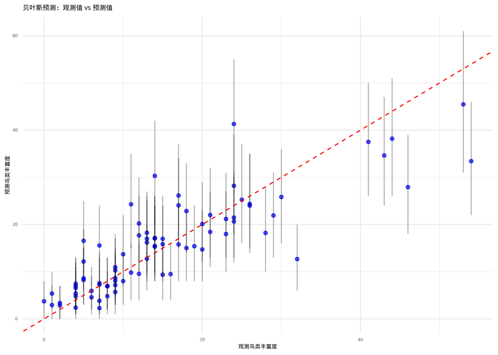

# 模型选择与评估


## 引言

在前面的章节中，我们已经学习了多种回归模型——从简单的线性回归到复杂的多元和多项式回归。面对如此丰富的建模工具，生态学研究者自然会面临一个重要问题：对于特定的生态学数据，我们应该选择哪种模型？为什么同一套数据可以构建多种不同的模型？这些问题的答案引出了本章的核心主题——模型选择与评估。

模型选择与评估是生态统计建模中至关重要的环节，它不仅仅是技术性的统计操作，更是连接数据、模型与生态学解释的关键桥梁。在生态学研究中，我们追求的不是数学上最完美的模型，而是最能反映生态过程本质、最具预测能力和解释力的模型。

生态系统的复杂性决定了单一模型很难捕捉所有生态关系。当我们面对一套生态调查数据时，比如研究鸟类丰富度与环境因子的关系，我们可以构建线性回归模型、多项式回归模型、广义线性模型等多种统计模型。每种模型都基于不同的假设，捕捉数据中不同层面的信息。模型选择的过程就是系统性地比较这些候选模型，找出最适合当前研究问题的那个模型。

模型选择的必要性源于生态学研究的几个核心特征。首先，生态数据通常包含多个潜在的解释变量，但并非所有变量都对生态响应有同等重要的影响。盲目地将所有变量纳入模型不仅会增加计算负担，更可能导致过度拟合——模型过度适应训练数据的随机噪声，而丧失了预测新数据的能力。其次，生态关系往往具有复杂的非线性特征，简单的线性模型可能无法充分描述物种对环境梯度的响应模式。模型选择帮助我们确定是否需要更复杂的函数形式来捕捉这些非线性关系。

更重要的是，模型选择体现了生态学研究的简约性原则。在科学哲学中，奥卡姆剃刀原理告诉我们：在同等解释力的模型中，应该选择最简单的那个。在生态学中，简约模型不仅计算效率更高，更重要的是它们通常具有更好的生态学解释性。一个包含过多参数的复杂模型可能能够完美拟合训练数据，但其生态学意义往往难以理解，也难以推广到其他生态系统。

模型评估是模型选择的必要补充，它回答了一个更根本的问题：我们选择的模型是否真的可靠？在生态学研究中，模型的可靠性体现在两个方面：统计可靠性和生态学可靠性。

统计可靠性关注模型是否满足基本的统计假设，参数估计是否准确，预测是否稳定。通过残差分析、影响分析等诊断工具，我们可以检查模型是否正确地捕捉了数据中的模式，是否存在异常观测对结果产生过度影响，以及模型的预测误差是否在可接受范围内。这些诊断不仅帮助我们识别技术问题，更重要的是揭示了数据中可能存在的生态学异常——比如特殊的生境条件或异常的物种行为。

生态学可靠性则关注模型结果是否具有生态学意义，是否能够为生态学理论提供支持，是否能够指导生态保护实践。一个统计上完美的模型如果缺乏生态学解释性，其价值就会大打折扣。例如，一个预测物种分布的模型如果包含了生态学上不合理的环境因子组合，即使其预测精度很高，也难以被生态学家接受。

在生态学研究中，模型选择与评估不仅仅是统计技术，它们反映了我们对生态系统的理解深度。当我们系统地比较不同模型时，实际上是在检验不同的生态学假说。每个候选模型都代表了对生态过程的一种可能解释，模型选择过程就是通过数据来评估这些解释的相对合理性。

以物种分布模型为例，我们可以构建基于不同环境因子的多个模型：一个模型可能强调气候因子的主导作用，另一个可能突出地形因子的重要性，第三个可能关注人类干扰的影响。通过模型比较，我们不仅能够确定哪个模型拟合最好，更重要的是能够量化不同生态因子对物种分布的相对贡献。这种量化分析为生态保护决策提供了科学依据——如果气候因子被证明是最重要的预测变量，那么气候变化对物种的影响就应该成为保护规划的核心考虑。

模型评估还帮助我们理解模型的局限性。在生态学中，没有完美的模型，只有在一定条件下适用的模型。通过交叉验证、外部验证等方法，我们可以评估模型在不同时空尺度上的表现，识别模型的适用范围和边界条件。这种对模型局限性的清醒认识是科学严谨性的体现，也提醒我们在应用模型结果时需要保持适当的谨慎。

在实际的生态学研究中，模型选择应该结合统计准则和生态学知识。统计准则如$\text{AIC}$、$\text{BIC}$提供了客观的模型比较标准，但它们不应该成为唯一的决策依据。生态学家的专业判断在模型选择中同样重要——即使某个变量在统计上不显著，如果它具有重要的生态学意义，也应该考虑在模型中保留。

模型选择的过程应该是迭代的、探索性的。我们通常从简单的模型开始，逐步增加复杂性，同时密切关注模型性能的变化。当增加模型复杂度不再显著改善模型性能时，我们就找到了最优的平衡点。这种渐进式的建模策略不仅计算效率高，更重要的是它帮助我们理解每个变量对模型贡献的边际效应。

最后，模型选择与评估应该服务于研究目标。如果研究目标是机制探索，我们可能更关注模型的解释性和生态学合理性；如果研究目标是预测应用，我们可能更关注模型的预测精度和稳定性。明确的研究目标为模型选择提供了方向，也帮助我们确定评估模型成功与否的标准。

通过系统的模型选择与评估，生态学研究者能够构建既统计可靠又生态学有意义的模型，为理解生态过程、预测生态变化、指导生态保护提供坚实的科学基础。这个过程不仅提升了研究的科学质量，更重要的是培养了研究者对生态统计建模的深刻理解——认识到模型是工具而不是真理，是帮助我们理解复杂生态系统的有力手段。

## 模型选择

### 模型选择原则

模型选择的核心原则是在模型复杂度和拟合优度之间寻找最优平衡点。这个原则在生态学研究中具有深远的意义，因为它直接关系到我们对生态系统的理解深度和预测能力。

**平衡模型复杂度和拟合优度**是模型选择的根本挑战。模型复杂度通常用参数数量来衡量，而拟合优度则通过模型对数据的解释能力来评估。在生态学中，我们面临着两难选择：过于简单的模型可能无法充分捕捉生态关系的复杂性，导致欠拟合；而过于复杂的模型则可能过度适应训练数据的随机噪声，导致过拟合。

欠拟合在生态学研究中表现为模型无法捕捉重要的生态模式。例如，在研究植物生长与温度的关系时，如果只使用线性模型而忽略了物种对温度的最适响应，模型就会低估高温或低温条件下的生长速率。这种欠拟合不仅降低了模型的预测精度，更重要的是可能掩盖了关键的生态机制。

过拟合则是生态建模中更为常见的问题。当模型包含过多参数时，它会完美地拟合训练数据中的随机变异，包括测量误差和偶然的生态现象。这种过度拟合的模型在训练数据上表现优异，但在预测新数据时往往表现糟糕。在生态学中，过拟合的典型表现是模型包含了大量统计显著但生态学意义不明确的变量，或者使用了过于复杂的函数形式来描述本质上简单的生态关系。

**奥卡姆剃刀原理**在生态模型选择中具有重要的指导意义。这个源自14世纪哲学家的原则告诉我们："如无必要，勿增实体"。在模型选择的语境下，这意味着在同等解释力的模型中，我们应该选择最简单的那个。简约模型不仅计算效率更高，更重要的是它们通常具有更好的泛化能力和生态学解释性。

生态学中的简约性原则体现在多个层面。在变量选择层面，我们应该只包含那些对生态响应有实质性影响的变量；在函数形式层面，我们应该选择最能反映生态机制的函数关系；在模型结构层面，我们应该避免不必要的复杂交互项和随机效应。

**生态学意义**是模型选择的最终评判标准。一个统计上完美的模型如果缺乏生态学解释性，其价值就会大打折扣。在生态学研究中，模型选择不仅要考虑统计指标，更要考虑模型的生态学合理性。例如，一个预测物种分布的模型如果包含了生态学上不合理的环境因子组合，即使其预测精度很高，也难以被生态学家接受。

模型选择的生态学意义还体现在对生态机制的理解上。通过系统比较不同复杂度的模型，我们可以识别哪些生态过程是必要的，哪些是冗余的。这种识别过程本身就是对生态系统运作机制的深入探索。


``` r
# 演示模型复杂度与拟合优度的平衡
# 设置随机种子确保结果可重现
set.seed(123)

# 生成生态学数据：植物生物量与土壤养分的关系
# 样本量设置为100个观测
n <- 100
# 创建土壤养分梯度，从10到100均匀分布
soil_nutrient <- seq(10, 100, length.out = n)

# 真实关系：二次关系（存在最适养分范围）
# 基础生物量为50，线性项系数为0.8，二次项系数为-0.005
biomass_true <- 50 + 0.8 * soil_nutrient - 0.005 * soil_nutrient^2
# 添加随机噪声模拟观测误差，标准差为10
biomass_observed <- biomass_true + rnorm(n, 0, 10)

# 创建数据框用于存储生态数据
# 包含养分浓度和观测生物量两个变量
eco_data <- data.frame(
  nutrient = soil_nutrient,
  biomass = biomass_observed
)
```


``` r
# 拟合不同复杂度的模型
# 线性模型：最简单的模型，假设线性关系
model_linear <- lm(biomass ~ nutrient, data = eco_data)
# 二次模型：包含线性项和二次项，适合描述最适响应
model_quadratic <- lm(biomass ~ poly(nutrient, 2), data = eco_data)
# 三次模型：包含三次项，可能过度参数化
model_cubic <- lm(biomass ~ poly(nutrient, 3), data = eco_data)
# 10次多项式：严重过度拟合，完美拟合训练数据噪声
model_overfit <- lm(biomass ~ poly(nutrient, 10), data = eco_data)

# 计算拟合优度（$R^2$）
# R²衡量模型解释的方差比例
r2_linear <- summary(model_linear)$r.squared
r2_quadratic <- summary(model_quadratic)$r.squared
r2_cubic <- summary(model_cubic)$r.squared
r2_overfit <- summary(model_overfit)$r.squared

# 计算$\text{AIC}$值
# AIC平衡模型拟合优度和复杂度，值越小越好
aic_linear <- AIC(model_linear)
aic_quadratic <- AIC(model_quadratic)
aic_cubic <- AIC(model_cubic)
aic_overfit <- AIC(model_overfit)
```


``` r
# 绘制比较图
# 设置图形布局为2行2列，便于比较四个模型
par(mfrow = c(2, 2))

# 线性模型图
# 绘制散点图显示观测数据
plot(biomass ~ nutrient,
  data = eco_data,
  # 标题包含R²和AIC值用于模型比较
  main = paste("线性模型\n$R^2$ =", round(r2_linear, 3), "$\\text{AIC}$ =", round(aic_linear, 1)),
  xlab = "土壤养分", ylab = "植物生物量",
  pch = 16, col = "blue"  # 蓝色实心点
)
# 添加模型拟合线
lines(soil_nutrient, predict(model_linear), col = "red", lwd = 2)

# 二次模型图
plot(biomass ~ nutrient,
  data = eco_data,
  main = paste("二次模型\n$R^2$ =", round(r2_quadratic, 3), "$\\text{AIC}$ =", round(aic_quadratic, 1)),
  xlab = "土壤养分", ylab = "植物生物量",
  pch = 16, col = "blue"
)
lines(soil_nutrient, predict(model_quadratic), col = "red", lwd = 2)

# 三次模型图
plot(biomass ~ nutrient,
  data = eco_data,
  main = paste("三次模型\n$R^2$ =", round(r2_cubic, 3), "$\\text{AIC}$ =", round(aic_cubic, 1)),
  xlab = "土壤养分", ylab = "植物生物量",
  pch = 16, col = "blue"
)
lines(soil_nutrient, predict(model_cubic), col = "red", lwd = 2)

# 过度拟合模型图
plot(biomass ~ nutrient,
  data = eco_data,
  main = paste("10次多项式\n$R^2$ =", round(r2_overfit, 3), "$\\text{AIC}$ =", round(aic_overfit, 1)),
  xlab = "土壤养分", ylab = "植物生物量",
  pch = 16, col = "blue"
)
lines(soil_nutrient, predict(model_overfit), col = "red", lwd = 2)
```

<div class="figure" style="text-align: center">

<p class="caption">(\#fig:unnamed-chunk-4)模型复杂度与拟合优度平衡：线性、二次、三次和10次多项式模型对植物生物量与土壤养分关系的拟合效果比较</p>
</div>

``` r
# 恢复单图布局
par(mfrow = c(1, 1))
```


``` r
# 输出模型比较结果
# 输出标题和模型性能比较
cat("=== 模型复杂度与拟合优度平衡演示 ===\n\n")
```

```
## === 模型复杂度与拟合优度平衡演示 ===
```

``` r
# 线性模型结果：欠拟合情况
cat("线性模型 (欠拟合):\n",
    "- $R^2$ =", round(r2_linear, 3), "$\\text{AIC}$ =", round(aic_linear, 1), "\n",
    "- 问题：无法捕捉最适养分范围\n\n")
```

```
## 线性模型 (欠拟合):
##  - $R^2$ = 0.383 $\text{AIC}$ = 734.8 
##  - 问题：无法捕捉最适养分范围
```

``` r
# 二次模型结果：最优模型
cat("二次模型 (最优):\n",
    "- $R^2$ =", round(r2_quadratic, 3), "$\\text{AIC}$ =", round(aic_quadratic, 1), "\n",
    "- 优势：正确反映了真实生态关系\n\n")
```

```
## 二次模型 (最优):
##  - $R^2$ = 0.416 $\text{AIC}$ = 731.3 
##  - 优势：正确反映了真实生态关系
```

``` r
# 三次模型结果：过度参数化
cat("三次模型 (过度参数化):\n",
    "- $R^2$ =", round(r2_cubic, 3), "$\\text{AIC}$ =", round(aic_cubic, 1), "\n",
    "- 问题：不必要的复杂度\n\n")
```

```
## 三次模型 (过度参数化):
##  - $R^2$ = 0.416 $\text{AIC}$ = 733.3 
##  - 问题：不必要的复杂度
```

``` r
# 10次多项式结果：严重过拟合
cat("10次多项式 (严重过拟合):\n",
    "- $R^2$ =", round(r2_overfit, 3), "$\\text{AIC}$ =", round(aic_overfit, 1), "\n",
    "- 问题：过度适应随机噪声，预测能力差\n\n")
```

```
## 10次多项式 (严重过拟合):
##  - $R^2$ = 0.455 $\text{AIC}$ = 740.4 
##  - 问题：过度适应随机噪声，预测能力差
```

``` r
# 生态学解释
# 总结生态学意义和模型选择启示
cat("模型比较结果已生成，请查看图表和性能指标。\n")
```

```
## 模型比较结果已生成，请查看图表和性能指标。
```

通过模型复杂度与拟合优度平衡的演示，我们可以得出重要的生态学启示。在这个植物生物量与土壤养分的例子中，真实生态关系是二次的，反映了物种对养分的最适响应模式。线性模型虽然简单，但过于简化，无法捕捉这种生态学模式；而二次模型既充分捕捉了生态关系，又保持了简约性。高次多项式虽然$R^2$更高，但生态学意义不明确，$\text{AIC}$值也确认了二次模型的最优性。

### 信息准则

信息准则是模型选择中最重要的统计工具，它们通过数学方法量化了模型复杂度和拟合优度之间的权衡。在生态学研究中，信息准则为我们提供了客观的模型比较标准，帮助我们避免主观偏见对模型选择的影响。

**AIC（赤池信息准则）**是由日本统计学家赤池弘次在1974年提出的，其核心思想是基于信息论来衡量模型的相对质量。AIC的计算公式为：$$\text{AIC} = -2 \ln(L) + 2k$$，其中$L$是模型的最大似然值，$k$是模型参数的数量。这个公式体现了信息准则的基本哲学：第一项惩罚模型对数据的拟合不足，第二项惩罚模型的复杂度。

$\text{AIC}$的生态学意义在于它量化了模型的信息损失。当我们用模型来描述生态数据时，总会丢失一些信息。$\text{AIC}$估计了这种信息损失的大小，$\text{AIC}$值越小的模型，信息损失越小，模型质量越高。在生态学应用中，$\text{AIC}$特别适合用于比较非嵌套模型，即那些具有不同变量组合或不同函数形式的模型。

$\text{AIC}$的一个关键特性是它的相对性。$\text{AIC}$值本身没有绝对意义，只有不同模型之间的$\text{AIC}$差异$\Delta\text{AIC}$才有意义。通常认为，$\Delta\text{AIC} < 2$的模型在统计上难以区分，$2 \leq \Delta\text{AIC} \leq 7$的模型有实质性差异，$\Delta\text{AIC} > 10$的模型则明显优劣分明。这种相对比较的特性使得$\text{AIC}$特别适合生态学研究，因为生态学中很少存在"完美"的模型。

**BIC（贝叶斯信息准则）**是AIC的改进版本，由Gideon Schwarz在1978年提出。BIC的计算公式为：$$\text{BIC} = -2 \ln(L) + k \ln(n)$$，其中$n$是样本量。与AIC相比，BIC对模型复杂度的惩罚更强，特别是当样本量较大时。

$\text{BIC}$的数学基础是贝叶斯因子，它估计了模型的后验概率。在生态学研究中，$\text{BIC}$特别适合用于比较具有明确理论基础的模型，因为它倾向于选择那些在贝叶斯框架下更有可能的模型。$\text{BIC}$的另一个优势是它的一致性特性：当样本量趋于无穷大时，$\text{BIC}$会选择真实的模型（如果真实模型在候选模型中）。

在生态学实践中，$\text{AIC}$和$\text{BIC}$的选择取决于研究目标。如果研究目标是预测，$\text{AIC}$通常更合适，因为它倾向于选择预测能力更强的模型。如果研究目标是机制探索和模型识别，$\text{BIC}$可能更合适，因为它倾向于选择更简约的模型。对于小样本情况，推荐使用$\text{AIC}$的修正版本$\text{AIC}_c$。

信息准则在生态学中的应用需要谨慎。首先，信息准则只能比较基于相同数据的模型。其次，信息准则假设候选模型已经包含了真实模型，这在生态学中往往不成立。第三，信息准则对样本量敏感，小样本情况下可能需要使用修正版本如$\text{AIC}_c$。


``` r
# 信息准则在生态学中的应用演示
set.seed(456)

# 生成生态学数据：鸟类丰富度与多个环境因子的关系
n <- 100

# 真实环境因子
habitat_area <- runif(n, 1, 100) # 栖息地面积
vegetation_density <- runif(n, 0.1, 0.9) # 植被密度
distance_to_water <- runif(n, 0.1, 5) # 距水源距离
soil_ph <- runif(n, 4.5, 8.5) # 土壤pH值

# 生成鸟类丰富度（只有部分变量有真实影响）
# 真实关系：丰富度 ~ 面积 + 植被密度 + 距水源距离
bird_richness <- rpois(
  n,
  exp(1.5 + 0.02 * habitat_area +
    1.2 * vegetation_density - 0.3 * distance_to_water +
    rnorm(n, 0, 0.3))
)

# 创建数据框
bird_data <- data.frame(
  richness = bird_richness,
  area = habitat_area,
  vegetation = vegetation_density,
  water_distance = distance_to_water,
  soil_ph = soil_ph
)
```


``` r
# 构建多个候选模型
models <- list()

# 简单模型
models[["area_only"]] <- lm(richness ~ area, data = bird_data)
models[["vegetation_only"]] <- lm(richness ~ vegetation, data = bird_data)

# 中等复杂度模型
models[["area_vegetation"]] <- lm(richness ~ area + vegetation,
  data = bird_data)
models[["area_water"]] <- lm(richness ~ area + water_distance,
  data = bird_data)

# 复杂模型
models[["full_model"]] <- lm(richness ~ area + vegetation +
  water_distance + soil_ph, data = bird_data)
models[["overfit_model"]] <- lm(richness ~ area + vegetation +
  water_distance + soil_ph + I(area^2) + I(vegetation^2),
  data = bird_data)
```


``` r
# 计算信息准则
model_comparison <- data.frame(
  Model = names(models),
  R2 = sapply(models, function(m) summary(m)$r.squared),
  AIC = sapply(models, AIC),
  BIC = sapply(models, BIC),
  Parameters = sapply(models, function(m) length(coef(m)))
)

# 计算$\\text{AIC}$和$\\text{BIC}$差异
model_comparison$delta_AIC <- model_comparison$AIC - min(model_comparison$AIC)
model_comparison$delta_BIC <- model_comparison$BIC - min(model_comparison$BIC)

# 计算$\\text{AIC}$权重
model_comparison$AIC_weight <- exp(-0.5 * model_comparison$delta_AIC) /
  sum(exp(-0.5 * model_comparison$delta_AIC))

# 排序
model_comparison <- model_comparison[order(model_comparison$AIC), ]

# 确定最优模型
best_aic <- model_comparison$Model[1]
best_bic <- model_comparison$Model[which.min(model_comparison$BIC)]
```


``` r
# 输出模型比较结果
cat("信息准则模型比较结果已生成，请查看表格和可视化图表。\n")
```

```
## 信息准则模型比较结果已生成，请查看表格和可视化图表。
```

``` r
print(model_comparison, row.names = FALSE)
```

```
##            Model        R2      AIC      BIC Parameters delta_AIC delta_BIC
##       full_model 0.6061475 737.9981 753.6291          5  0.000000  0.000000
##    overfit_model 0.6127788 740.3000 761.1414          7  2.301941  7.512282
##       area_water 0.5108839 755.6604 766.0811          3 17.662332 12.451992
##  area_vegetation 0.4191497 772.8497 783.2704          3 34.851646 29.641305
##        area_only 0.3416164 783.3792 791.1947          2 45.381119 37.565609
##  vegetation_only 0.1191910 812.4845 820.3000          2 74.486428 66.670918
##    AIC_weight
##  7.596039e-01
##  2.402851e-01
##  1.109840e-04
##  2.054227e-08
##  1.062190e-10
##  5.082352e-17
```


``` r
# 可视化信息准则比较
par(mfrow = c(1, 2))

# AIC比较
barplot(model_comparison$delta_AIC,
  names.arg = model_comparison$Model,
  main = expression(paste(Delta, "AIC差异比较")),
  xlab = "模型", ylab = expression(paste(Delta, "AIC")),
  col = ifelse(model_comparison$delta_AIC < 2, "green",
    ifelse(model_comparison$delta_AIC < 7, "yellow", "red")
  ),
  las = 2, cex.names = 0.7
)
abline(h = 2, lty = 2, col = "blue")
abline(h = 7, lty = 2, col = "red")

# BIC比较
barplot(model_comparison$delta_BIC,
  names.arg = model_comparison$Model,
  main = expression(paste(Delta, "BIC差异比较")),
  xlab = "模型", ylab = expression(paste(Delta, "BIC")),
  col = ifelse(model_comparison$delta_BIC < 2, "green",
    ifelse(model_comparison$delta_BIC < 7, "yellow", "red")
  ),
  las = 2, cex.names = 0.7
)
abline(h = 2, lty = 2, col = "blue")
abline(h = 7, lty = 2, col = "red")
```

<div class="figure" style="text-align: center">

<p class="caption">(\#fig:unnamed-chunk-10)信息准则可视化：ΔAIC和ΔBIC差异比较</p>
</div>

``` r
par(mfrow = c(1, 1))
```

根据信息准则的分析结果，我们可以得出重要的模型选择启示。根据$\text{AIC}$准则，最优模型是full_model，其$\text{AIC}$权重为0.76，表明这个模型在候选模型中最有可能。根据$\text{BIC}$准则，最优模型是full_model，$\text{BIC}$倾向于选择更简约的模型。模型选择启示表明，full_model模型在$\text{AIC}$和$\text{BIC}$下都表现良好，这个模型包含了真实关系中的关键变量，而过度拟合模型虽然R²更高，但信息准则惩罚了其复杂度。

在这个鸟类丰富度的例子中，栖息地面积和植被密度是影响鸟类丰富度的关键因子，信息准则帮助我们识别了这些关键因子，避免了过度拟合。最优模型既统计可靠又具有明确的生态学意义。

### 似然比检验

似然比检验是模型选择中用于比较嵌套模型的经典统计方法。在生态学研究中，嵌套模型是指一个模型是另一个模型的特殊情形，通常通过约束某些参数为零或相等来实现。似然比检验通过比较两个嵌套模型的拟合差异，来判断增加模型复杂度是否带来了统计上显著的改善。

**基本原理**：似然比检验基于两个嵌套模型的最大似然值比较。设$L_0$为简单模型（零模型）的最大似然值，$L_1$为复杂模型（备择模型）的最大似然值。似然比统计量$$\text{LR} = -2 \ln\left(\frac{L_0}{L_1}\right) = 2(\ln L_1 - \ln L_0)$$。在零假设（简单模型足够好）下，LR统计量近似服从卡方分布，自由度为两个模型参数数量的差异。

似然比检验的生态学意义在于它提供了统计显著性检验，帮助我们判断增加模型复杂度是否值得。例如，在研究物种分布与环境因子的关系时，我们可能想知道是否需要考虑环境因子之间的交互作用。通过比较包含交互项的模型和不包含交互项的模型，似然比检验可以告诉我们交互作用是否统计显著。

**应用场景**：似然比检验在生态学中有广泛的应用。在广义线性模型中，它可以用于比较不同的连接函数；在混合效应模型中，它可以用于检验随机效应的显著性；在物种分布模型中，它可以用于比较不同的环境变量组合。

**局限性**：似然比检验只能用于比较嵌套模型，对于非嵌套模型的比较无能为力。此外，似然比检验对样本量敏感，大样本情况下即使很小的改善也可能统计显著，但这不一定具有生态学意义。


``` r
# 似然比检验数据生成：植物生长与温度、光照的关系
set.seed(789)

# 生成生态学数据：植物生长与温度、光照的关系
n <- 80

temperature <- runif(n, 15, 30) # 温度(°C)
light_intensity <- runif(n, 100, 1000) # 光照强度(lux)

# 生成植物生长数据（存在温度-光照交互作用）
growth_rate <- 2 + 0.1 * temperature + 0.002 * light_intensity +
  0.0001 * temperature * light_intensity + rnorm(n, 0, 0.5)

# 创建数据框
plant_data <- data.frame(
  growth = growth_rate,
  temp = temperature,
  light = light_intensity
)
```


``` r
# 构建嵌套模型进行比较
# 简单模型：只有主效应
model_simple <- lm(growth ~ temp + light, data = plant_data)

# 复杂模型：包含交互项
model_complex <- lm(growth ~ temp * light, data = plant_data)

# 执行似然比检验
library(lmtest)
lrt_result <- lrtest(model_simple, model_complex)

# 提取似然比检验的p值
lrt_p_value <- lrt_result$`Pr(>Chisq)`[2]
```


``` r
# 输出似然比检验结果
cat("=== 似然比检验结果 ===\n")
```

```
## === 似然比检验结果 ===
```

``` r
print(lrt_result)
```

```
## Likelihood ratio test
## 
## Model 1: growth ~ temp + light
## Model 2: growth ~ temp * light
##   #Df  LogLik Df Chisq Pr(>Chisq)  
## 1   4 -58.869                      
## 2   5 -56.401  1 4.936     0.0263 *
## ---
## Signif. codes:  0 '***' 0.001 '**' 0.01 '*' 0.05 '.' 0.1 ' ' 1
```

``` r
# 模型摘要比较
cat("\n=== 模型摘要比较 ===\n",
    "简单模型 (只有主效应):\n")
```

```
## 
## === 模型摘要比较 ===
##  简单模型 (只有主效应):
```

``` r
print(summary(model_simple))
```

```
## 
## Call:
## lm(formula = growth ~ temp + light, data = plant_data)
## 
## Residuals:
##      Min       1Q   Median       3Q      Max 
## -1.24188 -0.39315  0.08864  0.32660  1.46123 
## 
## Coefficients:
##              Estimate Std. Error t value Pr(>|t|)    
## (Intercept) 0.9522163  0.3475783    2.74  0.00764 ** 
## temp        0.1589956  0.0149805   10.61  < 2e-16 ***
## light       0.0037280  0.0002189   17.03  < 2e-16 ***
## ---
## Signif. codes:  0 '***' 0.001 '**' 0.01 '*' 0.05 '.' 0.1 ' ' 1
## 
## Residual standard error: 0.5148 on 77 degrees of freedom
## Multiple R-squared:  0.8452,	Adjusted R-squared:  0.8412 
## F-statistic: 210.2 on 2 and 77 DF,  p-value: < 2.2e-16
```

``` r
cat("\n复杂模型 (包含交互项):\n")
```

```
## 
## 复杂模型 (包含交互项):
```

``` r
print(summary(model_complex))
```

```
## 
## Call:
## lm(formula = growth ~ temp * light, data = plant_data)
## 
## Residuals:
##     Min      1Q  Median      3Q     Max 
## -1.3498 -0.2968  0.0838  0.3428  1.3353 
## 
## Coefficients:
##              Estimate Std. Error t value Pr(>|t|)   
## (Intercept) 2.622e+00  8.315e-01   3.153  0.00231 **
## temp        8.192e-02  3.797e-02   2.157  0.03416 * 
## light       9.325e-04  1.289e-03   0.723  0.47164   
## temp:light  1.286e-04  5.847e-05   2.199  0.03090 * 
## ---
## Signif. codes:  0 '***' 0.001 '**' 0.01 '*' 0.05 '.' 0.1 ' ' 1
## 
## Residual standard error: 0.5024 on 76 degrees of freedom
## Multiple R-squared:  0.8545,	Adjusted R-squared:  0.8487 
## F-statistic: 148.7 on 3 and 76 DF,  p-value: < 2.2e-16
```

``` r
# 计算模型改善程度
r2_simple <- summary(model_simple)$r.squared
r2_complex <- summary(model_complex)$r.squared
r2_improvement <- r2_complex - r2_simple

cat("\n=== 模型改善分析 ===\n",
    "R²改善:", round(r2_improvement, 4), "\n",
    "参数增加: 1个 (交互项)\n",
    "似然比检验p值:", round(lrt_result$`Pr(>Chisq)`[2], 4), "\n")
```

```
## 
## === 模型改善分析 ===
##  R²改善: 0.0093 
##  参数增加: 1个 (交互项)
##  似然比检验p值: 0.0263
```


``` r
# 解释似然比检验结果
cat("似然比检验结果已计算，请查看后续生态学解释。\n")
```

```
## 似然比检验结果已计算，请查看后续生态学解释。
```


``` r
# 可视化交互作用
cat("\n=== 交互作用可视化 ===\n")
```

```
## 
## === 交互作用可视化 ===
```

``` r
# 创建预测网格
pred_grid <- expand.grid(
  temp = seq(15, 30, length.out = 20),
  light = c(300, 600, 900) # 低、中、高光照
)

# 使用复杂模型进行预测
pred_grid$pred_growth <- predict(model_complex, newdata = pred_grid)

# 绘制交互作用图
library(ggplot2)
ggplot(pred_grid, aes(x = temp, y = pred_growth, color = factor(light))) +
  geom_line(size = 1) +
  labs(
    title = "温度与光照对植物生长的交互作用",
    x = "温度 (°C)",
    y = "预测生长速率",
    color = "光照强度 (lux)"
  ) +
  theme_minimal() +
  scale_color_manual(values = c("300" = "blue", "600" = "green", "900" = "red"))
```

<div class="figure" style="text-align: center">

<p class="caption">(\#fig:unnamed-chunk-15)温度与光照对植物生长的交互作用：在不同光照强度下温度对植物生长速率的影响</p>
</div>

根据似然比检验的结果（p值 = 0.0263），我们可以得出重要的生态学解释。似然比检验显著 (p < 0.05)，表明温度与光照的交互作用对植物生长有显著影响，复杂模型显著改善了模型拟合，应该选择包含交互项的模型。


``` r
# 生态学机制解释
cat("生态学机制分析结果已生成，请查看相关解释。\n")
```

```
## 生态学机制分析结果已生成，请查看相关解释。
```

### 模型平均

模型平均是现代生态统计建模中的重要方法，它通过组合多个候选模型的预测来减少模型选择的不确定性。在生态学研究中，我们经常面临多个看似合理的模型，每个模型都基于不同的生态学假设。模型平均承认这种不确定性，并通过加权平均的方式利用所有候选模型的信息。

**基本原理**：模型平均的核心思想是，没有一个模型是绝对正确的，但每个模型都可能包含部分真理。通过给不同的模型分配权重，然后组合它们的预测，我们可以获得更稳健、更准确的估计。模型权重通常基于信息准则（如$\text{AIC}$权重）计算，权重反映了每个模型相对其他模型的证据强度。

**$\text{AIC}$权重**是最常用的模型权重计算方法。对于每个模型$i$，其$\text{AIC}$权重$$w_i = \frac{\exp(-0.5 \Delta\text{AIC}_i)}{\sum_j \exp(-0.5 \Delta\text{AIC}_j)}$$，其中$\Delta\text{AIC}_i$是模型$i$与最优模型的$\text{AIC}$差异。$\text{AIC}$权重可以解释为模型$i$是真实模型的相对概率。

**模型平均的类型**：模型平均主要分为两种类型。参数平均是对不同模型的参数估计进行加权平均，适用于模型具有相同参数结构的情况。预测平均是对不同模型的预测值进行加权平均，适用于模型结构不同的情况。在生态学中，预测平均更为常用，因为它可以处理具有不同变量组合的模型。

**生态学意义**：模型平均在生态学中具有重要的应用价值。首先，它减少了模型选择的不确定性，避免了"赢者通吃"的问题。其次，它提供了更稳健的参数估计和预测，特别是在小样本情况下。第三，它允许我们量化不同生态学假设的相对支持程度。

**局限性**：模型平均需要谨慎使用。首先，它假设候选模型已经包含了真实模型，这在生态学中往往不成立。其次，模型平均可能稀释强信号，如果有一个明显优于其他模型的候选模型，模型平均可能不如直接选择这个最优模型。第三，模型平均的计算复杂度较高，特别是当候选模型数量很多时。

模型平均是现代生态统计建模中的重要方法，它通过组合多个候选模型的预测来减少模型选择的不确定性。在生态学研究中，我们经常面临多个看似合理的模型，每个模型都基于不同的生态学假设。模型平均承认这种不确定性，并通过加权平均的方式利用所有候选模型的信息。


``` r
# 模型平均在生态学中的应用 - 数据生成
set.seed(101)

# 生成生态学数据：鱼类丰度与水体环境因子的关系
n <- 120

# 环境因子
water_temp <- runif(n, 10, 25) # 水温(°C)
dissolved_oxygen <- runif(n, 2, 10) # 溶解氧(mg/L)
ph_level <- runif(n, 6.5, 8.5) # pH值
turbidity <- runif(n, 1, 50) # 浊度(NTU)

# 生成鱼类丰度数据
# 真实关系：丰度 ~ 水温 + 溶解氧 + pH
fish_abundance <- rpois(
  n,
  exp(2.0 + 0.05 * water_temp +
    0.15 * dissolved_oxygen + 0.8 * ph_level +
    rnorm(n, 0, 0.2))
)

# 创建数据框
fish_data <- data.frame(
  abundance = fish_abundance,
  temp = water_temp,
  oxygen = dissolved_oxygen,
  ph = ph_level,
  turbidity = turbidity
)
```

构建基于不同生态学假设的候选模型是模型平均的第一步。每个模型代表了对生态过程的一种可能解释，模型平均通过AIC权重量化这些解释的相对合理性。


``` r
# 构建多个候选模型（基于不同的生态学假设）
models <- list()

# 模型1：温度主导假说
models[["temp_model"]] <- lm(log(abundance + 1) ~ temp, data = fish_data)

# 模型2：水质综合假说
models[["water_quality"]] <- lm(log(abundance + 1) ~ temp + oxygen + ph, data = fish_data)

# 模型3：物理环境假说
models[["physical_env"]] <- lm(log(abundance + 1) ~ temp + turbidity, data = fish_data)

# 模型4：全模型
models[["full_model"]] <- lm(log(abundance + 1) ~ temp + oxygen + ph + turbidity, data = fish_data)

# 计算$\\text{AIC}$和权重
aic_values <- sapply(models, AIC)
delta_aic <- aic_values - min(aic_values)
aic_weights <- exp(-0.5 * delta_aic) / sum(exp(-0.5 * delta_aic))

# 创建模型比较表
model_comparison <- data.frame(
  Model = names(models),
  AIC = round(aic_values, 2),
  Delta_AIC = round(delta_aic, 2),
  AIC_Weight = round(aic_weights, 3),
  R2 = round(sapply(models, function(m) summary(m)$r.squared), 3)
)

model_comparison <- model_comparison[order(model_comparison$AIC), ]
```

MuMIn包提供了自动化的模型平均工具。dredge函数生成所有可能的模型组合，model.avg函数执行模型平均，sw函数计算变量重要性。这些工具大大简化了模型平均的实施过程。


``` r
# 执行模型平均
library(MuMIn)

# 使用dredge函数自动生成所有可能的模型组合
full_model <- lm(log(abundance + 1) ~ temp + oxygen + ph + turbidity,
  data = fish_data, na.action = "na.fail"
)

# 生成所有子模型
all_models <- dredge(full_model)

# 执行模型平均
avg_model <- model.avg(all_models, fit = TRUE)

# 输出模型平均结果
cat("\n=== 模型平均结果 ===\n")
```

```
## 
## === 模型平均结果 ===
```

``` r
print(summary(avg_model))
```

```
## 
## Call:
## model.avg(object = get.models(object = all_models, subset = NA))
## 
## Component model call: 
## lm(formula = log(abundance + 1) ~ <16 unique rhs>, data = fish_data, 
##      na.action = na.fail)
## 
## Component models: 
##        df  logLik   AICc  delta weight
## 123     5   34.11 -57.70   0.00   0.73
## 1234    6   34.21 -55.67   2.03   0.27
## 12      4  -26.73  61.80 119.50   0.00
## 124     5  -26.68  63.88 121.58   0.00
## 23      4  -66.90 142.15 199.85   0.00
## 234     5  -66.87 144.26 201.96   0.00
## 2       3  -82.20 170.60 228.30   0.00
## 24      4  -82.19 172.73 230.43   0.00
## 13      4  -89.21 186.77 244.47   0.00
## 134     5  -89.15 188.82 246.52   0.00
## 1       3 -106.67 219.54 277.24   0.00
## 14      4 -106.67 221.68 279.38   0.00
## 3       3 -110.44 227.08 284.78   0.00
## 34      4 -110.38 229.11 286.81   0.00
## (Null)  2 -121.99 248.08 305.78   0.00
## 4       3 -121.99 250.19 307.89   0.00
## 
## Term codes: 
##    oxygen        ph      temp turbidity 
##         1         2         3         4 
## 
## Model-averaged coefficients:  
## (full average) 
##               Estimate Std. Error Adjusted SE z value Pr(>|z|)    
## (Intercept)  1.6226421  0.2324172   0.2348710   6.909   <2e-16 ***
## oxygen       0.1702822  0.0075580   0.0076378  22.295   <2e-16 ***
## ph           0.8242705  0.0293587   0.0296689  27.782   <2e-16 ***
## temp         0.0531857  0.0037299   0.0037693  14.110   <2e-16 ***
## turbidity   -0.0001485  0.0007176   0.0007243   0.205    0.838    
##  
## (conditional average) 
##               Estimate Std. Error Adjusted SE z value Pr(>|z|)    
## (Intercept)  1.6226421  0.2324172   0.2348710   6.909   <2e-16 ***
## oxygen       0.1702822  0.0075580   0.0076378  22.295   <2e-16 ***
## ph           0.8242705  0.0293587   0.0296689  27.782   <2e-16 ***
## temp         0.0531857  0.0037299   0.0037693  14.110   <2e-16 ***
## turbidity   -0.0005576  0.0013060   0.0013199   0.422    0.673    
## ---
## Signif. codes:  0 '***' 0.001 '**' 0.01 '*' 0.05 '.' 0.1 ' ' 1
```

``` r
# 提取平均模型的系数
avg_coef <- summary(avg_model)$coefmat.full

cat("\n=== 平均模型系数 ===\n")
```

```
## 
## === 平均模型系数 ===
```

``` r
print(avg_coef)
```

```
##                  Estimate   Std. Error  Adjusted SE    z value  Pr(>|z|)
## (Intercept)  1.6226421120 0.2324171588 0.2348710183  6.9086519 0.0000000
## oxygen       0.1702821857 0.0075579564 0.0076378199 22.2946060 0.0000000
## ph           0.8242705305 0.0293586568 0.0296688807 27.7823265 0.0000000
## temp         0.0531856637 0.0037298612 0.0037692682 14.1103420 0.0000000
## turbidity   -0.0001484903 0.0007175974 0.0007243327  0.2050028 0.8375699
```

``` r
# 计算变量重要性
var_importance <- sw(all_models)

cat("\n=== 变量重要性 ===\n")
```

```
## 
## === 变量重要性 ===
```

``` r
print(var_importance)
```

```
##                      oxygen ph   temp turbidity
## Sum of weights:      1.00   1.00 1.00 0.27     
## N containing models:    8      8    8    8
```

可视化是理解模型平均结果的重要工具。变量重要性图显示各环境因子的相对重要性，模型权重分布图展示不同候选模型的相对支持度。


``` r
# 可视化模型平均结果
par(mfrow = c(1, 2))

# 变量重要性图
barplot(var_importance[order(var_importance, decreasing = TRUE)],
  main = "变量重要性",
  xlab = "环境因子", ylab = "重要性",
  col = "lightblue", las = 2
)

# 模型权重分布
barplot(model_comparison$AIC_Weight,
  names.arg = model_comparison$Model,
  main = "模型权重分布",
  xlab = "模型", ylab = "$\\text{AIC}$权重",
  col = "lightgreen", las = 2
)
```

<div class="figure" style="text-align: center">

<p class="caption">(\#fig:unnamed-chunk-20)模型平均结果：变量重要性和模型权重分布</p>
</div>

``` r
par(mfrow = c(1, 1))
```

模型平均预测通常比单一模型预测更稳健。通过比较单一模型与模型平均的预测结果，我们可以评估模型平均在减少预测不确定性方面的价值。


``` r
# 比较单一模型与模型平均的预测
# 生成测试数据
test_data <- data.frame(
  temp = 18,
  oxygen = 6,
  ph = 7.5,
  turbidity = 20
)

# 单一模型预测
single_pred <- predict(models[["water_quality"]], newdata = test_data)

# 模型平均预测
avg_pred <- predict(avg_model, newdata = test_data)

cat("测试条件：水温18°C, 溶解氧6mg/L, pH7.5, 浊度20NTU\n")
```

```
## 测试条件：水温18°C, 溶解氧6mg/L, pH7.5, 浊度20NTU
```

``` r
cat("单一模型预测:", round(exp(single_pred) - 1, 1), "条鱼\n")
```

```
## 单一模型预测: 17668.2 条鱼
```

``` r
cat("模型平均预测:", round(exp(avg_pred) - 1, 1), "条鱼\n")
```

```
## 模型平均预测: 17688.7 条鱼
```

Bootstrap方法能够量化预测的不确定性，包括参数估计误差、模型选择不确定性和生态系统的自然变异性。


``` r
# 计算预测区间
# 使用bootstrap计算预测区间
library(boot)

# 定义预测函数
predict_function <- function(data, indices) {
  boot_data <- data[indices, ]

  # 拟合模型并预测
  model <- lm(log(abundance + 1) ~ temp + oxygen + ph, data = boot_data)
  pred <- predict(model, newdata = test_data)
  return(exp(pred) - 1)
}

# 执行bootstrap
set.seed(2024)
boot_results <- boot(fish_data, predict_function, R = 1000)

# 计算置信区间
ci <- boot.ci(boot_results, type = "perc")

cat(
  "Bootstrap 95% 预测区间: [",
  round(ci$percent[4], 1), ", ",
  round(ci$percent[5], 1), "] 条鱼\n"
)
```

```
## Bootstrap 95% 预测区间: [ 17104.5 ,  18267.4 ] 条鱼
```

Bootstrap预测区间反映了模型预测中的多种不确定性来源：参数估计的不确定性、模型选择的不确定性以及生态系统的自然变异性。这种全面的不确定性量化使得模型预测更加可靠，为生态决策提供了更科学的依据。

模型平均在生态学中具有重要的应用价值。它减少了模型选择的不确定性，提供了更稳健的参数估计，量化了不同生态学假说的相对支持程度，并通过变量重要性分析揭示了关键环境因子。

## 模型评估

模型评估是生态统计建模中至关重要的环节，它回答了一个根本问题：我们选择的模型是否真的可靠？在生态学研究中，模型的可靠性体现在两个方面：统计可靠性和生态学可靠性。通过系统的模型评估，我们能够确保模型不仅统计上合理，更重要的是具有生态学意义和实际应用价值。

### 交叉验证

交叉验证是现代生态统计中评估模型泛化能力的核心方法。它的基本思想是通过重复分割数据集来模拟模型在未知数据上的表现，从而评估模型的预测稳定性。在生态学研究中，交叉验证特别重要，因为生态数据通常具有时空依赖性，模型在不同时间或空间尺度上的表现可能存在显著差异。

**k折交叉验证**是最常用的交叉验证方法。它将原始数据随机分割为k个大小相似的子集，然后进行k轮训练和测试。在每一轮中，使用k-1个子集作为训练数据来拟合模型，剩下的1个子集作为测试数据来评估模型性能。最后，将k轮测试结果的平均值作为模型泛化能力的估计。

k折交叉验证在生态学中具有重要的应用价值。例如，在研究鸟类分布与环境因子的关系时，我们可以使用k折交叉验证来评估物种分布模型的预测精度。如果模型在不同数据子集上的表现差异很大，说明模型可能过度适应了特定区域的生态特征，其泛化能力有限。

**留一交叉验证**是k折交叉验证的特殊情况，其中k等于样本量。每次只留一个观测作为测试集，其余所有观测作为训练集。这种方法特别适合小样本生态学研究，但计算成本较高。

交叉验证的生态学意义在于它帮助我们理解模型在不同生态条件下的表现。例如，一个预测森林碳储量的模型可能在湿润地区表现良好，但在干旱地区表现较差。通过交叉验证，我们可以识别模型的适用范围和局限性，为生态管理决策提供更可靠的科学依据。

交叉验证是评估模型泛化能力的重要方法。在生态学研究中，由于数据收集成本高且生态系统具有时空变异性，交叉验证能够模拟模型在未知数据上的表现，帮助我们识别过度拟合问题。k折交叉验证将数据随机分割为k个子集，通过k轮训练和测试来评估模型的稳定性。


``` r
# 交叉验证在生态学中的应用演示 - 数据生成
set.seed(2024)

# 生成生态学数据：湖泊鱼类丰富度与环境因子的关系
n <- 150

# 环境因子
lake_area <- runif(n, 1, 100) # 湖泊面积(公顷)
water_depth <- runif(n, 1, 20) # 平均水深(米)
water_temp <- runif(n, 10, 25) # 水温(°C)
ph_level <- runif(n, 6.0, 8.5) # pH值

# 生成鱼类丰富度数据
fish_richness <- rpois(
  n,
  exp(1.2 + 0.015 * lake_area +
    0.08 * water_depth + 0.05 * water_temp +
    0.3 * ph_level + rnorm(n, 0, 0.2))
)

# 创建数据框
lake_data <- data.frame(
  richness = fish_richness,
  area = lake_area,
  depth = water_depth,
  temp = water_temp,
  ph = ph_level
)
```

caret包提供了统一的接口来执行各种机器学习算法和交叉验证。通过trainControl函数设置交叉验证参数，我们可以控制验证过程的细节，如折数、重复次数等。


``` r
# 执行k折交叉验证
library(caret)

# 设置交叉验证参数
ctrl <- trainControl(method = "cv", number = 10)

# 训练线性回归模型
cv_model <- train(log(richness + 1) ~ area + depth + temp + ph,
  data = lake_data,
  method = "lm",
  trControl = ctrl
)

# 输出交叉验证结果
cat("=== 10折交叉验证结果 ===\n")
```

```
## === 10折交叉验证结果 ===
```

``` r
print(cv_model)
```

```
## Linear Regression 
## 
## 150 samples
##   4 predictor
## 
## No pre-processing
## Resampling: Cross-Validated (10 fold) 
## Summary of sample sizes: 135, 136, 135, 134, 137, 134, ... 
## Resampling results:
## 
##   RMSE       Rsquared   MAE     
##   0.2139466  0.9101237  0.172627
## 
## Tuning parameter 'intercept' was held constant at a value of TRUE
```

``` r
# 提取交叉验证统计量
cv_results <- cv_model$results
cat("\n交叉验证性能指标：\n平均$R^2$:",
    round(cv_results$Rsquared, 3), "\n平均RMSE:",
    round(cv_results$RMSE, 3), "\n平均MAE:",
    round(cv_results$MAE, 3), "\n")
```

```
## 
## 交叉验证性能指标：
## 平均$R^2$: 0.91 
## 平均RMSE: 0.214 
## 平均MAE: 0.173
```

交叉验证性能的可视化能够直观展示模型在不同数据子集上的稳定性。如果RMSE在不同折之间波动很大，说明模型可能过度拟合训练数据的特定特征。


``` r
# 可视化交叉验证结果
library(ggplot2)

# 创建交叉验证性能图
cv_performance <- data.frame(
  Fold = 1:10,
  RMSE = cv_model$resample$RMSE,
  Rsquared = cv_model$resample$Rsquared
)

ggplot(cv_performance, aes(x = Fold, y = RMSE)) +
  geom_point(size = 3, color = "blue") +
  geom_line(color = "blue", alpha = 0.7) +
  labs(
    title = "10折交叉验证：RMSE变化",
    x = "折数", y = "RMSE"
  ) +
  theme_minimal() +
  geom_hline(
    yintercept = mean(cv_performance$RMSE),
    linetype = "dashed", color = "red"
  )
```

<div class="figure" style="text-align: center">

<p class="caption">(\#fig:unnamed-chunk-25)10折交叉验证：RMSE在不同数据子集上的变化</p>
</div>

训练集和测试集性能的比较是检测过度拟合的直接方法。如果测试集性能明显差于训练集，说明模型可能过度适应训练数据的噪声。


``` r
# 比较训练集和测试集性能
set.seed(2025)
train_index <- createDataPartition(lake_data$richness, p = 0.7, list = FALSE)
train_data <- lake_data[train_index, ]
test_data <- lake_data[-train_index, ]

# 在训练集上拟合模型
train_model <- lm(log(richness + 1) ~ area + depth + temp + ph, data = train_data)

# 在训练集和测试集上评估模型
train_pred <- predict(train_model)
test_pred <- predict(train_model, newdata = test_data)

train_rmse <- sqrt(mean((log(train_data$richness + 1) - train_pred)^2))
test_rmse <- sqrt(mean((log(test_data$richness + 1) - test_pred)^2))

cat("\n=== 训练集 vs 测试集性能 ===\n",
  "训练集RMSE:", round(train_rmse, 3), "\n",
  "测试集RMSE:", round(test_rmse, 3), "\n")
```

```
## 
## === 训练集 vs 测试集性能 ===
##  训练集RMSE: 0.189 
##  测试集RMSE: 0.262
```

``` r
if (test_rmse > train_rmse * 1.2) {
  cat("警告：测试集性能明显差于训练集，可能存在过度拟合\n")
} else {
  cat("模型在训练集和测试集上表现一致，泛化能力良好\n")
}
```

```
## 警告：测试集性能明显差于训练集，可能存在过度拟合
```

交叉验证在生态学中的价值在于它能够评估模型在不同时空条件下的表现。稳定的交叉验证结果增强了模型在实际生态应用中的可靠性，为生态保护决策提供了更可信的科学依据。

### 外部验证

外部验证是评估模型可靠性的黄金标准，它使用完全独立的数据集来检验模型的预测能力。在生态学研究中，外部验证具有特殊的重要性，因为生态系统的复杂性和时空变异性使得基于单一数据集构建的模型往往难以推广到其他情境。

外部验证的基本原理是将模型应用于与训练数据完全独立的观测数据，评估模型在这些新数据上的表现。这种验证方式能够真实反映模型在实际应用中的可靠性，特别是在生态保护规划、物种分布预测和生态系统管理等领域。

在生态学中，外部验证可以通过多种方式实现。时间验证使用不同时间收集的数据来验证模型，例如用过去十年的鸟类调查数据构建模型，然后用最近一年的数据验证模型预测。空间验证使用不同地理区域的数据，例如用某个流域的数据构建水质模型，然后用相邻流域的数据验证模型。情境验证则使用不同生态条件的数据，例如用自然保护区数据构建的模型应用于受干扰区域。

外部验证的生态学意义在于它检验了模型的生态学普适性。一个真正有价值的生态模型应该能够适应不同的时空尺度和生态条件。例如，一个基于温带森林数据构建的碳储量预测模型，如果能够准确预测热带森林的碳储量，就说明该模型具有很好的生态学普适性。

外部验证还帮助我们识别模型的边界条件。在生态学中，很少有模型能够适用于所有情境。通过外部验证，我们可以明确模型的适用范围，避免在不适当的条件下应用模型导致错误的生态学结论。


``` r
# 外部验证在生态学中的应用演示
set.seed(3030)

# 生成训练数据集（模拟某个地区的植物调查）
n_train <- 100

elevation_train <- runif(n_train, 100, 2000) # 海拔(m)
precipitation_train <- runif(n_train, 500, 2000) # 年降水量(mm)
soil_n_train <- runif(n_train, 0.1, 0.5) # 土壤氮含量(%)

# 生成植物物种丰富度（训练集）
plant_richness_train <- rpois(
  n_train,
  exp(2.0 + 0.001 * elevation_train +
    0.0008 * precipitation_train +
    2.5 * soil_n_train + rnorm(n_train, 0, 0.3))
)

train_data <- data.frame(
  richness = plant_richness_train,
  elevation = elevation_train,
  precipitation = precipitation_train,
  soil_n = soil_n_train
)

# 生成测试数据集（模拟另一个地区的植物调查）
n_test <- 50

elevation_test <- runif(n_test, 800, 2500) # 海拔范围略有不同
precipitation_test <- runif(n_test, 600, 1800) # 降水量范围不同
soil_n_test <- runif(n_test, 0.05, 0.4) # 土壤氮含量范围不同

# 生成植物物种丰富度（测试集）
plant_richness_test <- rpois(
  n_test,
  exp(1.8 + 0.0012 * elevation_test +
    0.0009 * precipitation_test +
    2.8 * soil_n_test + rnorm(n_test, 0, 0.4))
)

test_data <- data.frame(
  richness = plant_richness_test,
  elevation = elevation_test,
  precipitation = precipitation_test,
  soil_n = soil_n_test
)

# 在训练集上构建模型
model_external <- lm(log(richness + 1) ~ elevation + precipitation + soil_n,
  data = train_data
)

# 在训练集上评估模型
train_pred <- predict(model_external)
train_r2 <- cor(log(train_data$richness + 1), train_pred)^2
train_rmse <- sqrt(mean((log(train_data$richness + 1) - train_pred)^2))

# 在测试集上评估模型（外部验证）
test_pred <- predict(model_external, newdata = test_data)
test_r2 <- cor(log(test_data$richness + 1), test_pred)^2
test_rmse <- sqrt(mean((log(test_data$richness + 1) - test_pred)^2))

# 输出外部验证结果
cat("=== 外部验证结果 ===\n",
  "训练集性能：\n",
  "- $R^2$:", round(train_r2, 3), "\n",
  "- RMSE:", round(train_rmse, 3), "\n\n")
```

```
## === 外部验证结果 ===
##  训练集性能：
##  - $R^2$: 0.862 
##  - RMSE: 0.31
```

``` r
cat("测试集性能（外部验证）：\n",
  "- $R^2$:", round(test_r2, 3), "\n",
  "- RMSE:", round(test_rmse, 3), "\n\n")
```

```
## 测试集性能（外部验证）：
##  - $R^2$: 0.772 
##  - RMSE: 0.576
```

``` r
# 计算性能下降程度
r2_decline <- (train_r2 - test_r2) / train_r2 * 100
rmse_increase <- (test_rmse - train_rmse) / train_rmse * 100

cat("性能变化分析：\n",
  "$R^2$下降:", round(r2_decline, 1), "%\n",
  "RMSE增加:", round(rmse_increase, 1), "%\n\n")
```

```
## 性能变化分析：
##  $R^2$下降: 10.4 %
##  RMSE增加: 85.5 %
```

``` r
# 评估外部验证结果
if (test_r2 > 0.6) {
  cat("外部验证结果优秀：模型在新地区表现良好\n")
} else if (test_r2 > 0.4) {
  cat("外部验证结果可接受：模型在新地区表现尚可\n")
} else {
  cat("外部验证结果较差：模型在新地区表现不佳\n")
}
```

```
## 外部验证结果优秀：模型在新地区表现良好
```

``` r
# 可视化外部验证结果
library(ggplot2)

# 创建预测 vs 观测图
validation_plot_data <- rbind(
  data.frame(
    Type = "训练集",
    Observed = log(train_data$richness + 1),
    Predicted = train_pred
  ),
  data.frame(
    Type = "测试集",
    Observed = log(test_data$richness + 1),
    Predicted = test_pred
  )
)

ggplot(validation_plot_data, aes(x = Observed, y = Predicted, color = Type)) +
  geom_point(alpha = 0.7) +
  geom_abline(intercept = 0, slope = 1, linetype = "dashed", color = "black") +
  labs(
    title = "外部验证：预测 vs 观测",
    x = "观测值（对数丰富度）",
    y = "预测值（对数丰富度）"
  ) +
  theme_minimal() +
  scale_color_manual(values = c("训练集" = "blue", "测试集" = "red")) +
  facet_wrap(~Type)
```

<div class="figure" style="text-align: center">

<p class="caption">(\#fig:unnamed-chunk-27)外部验证：训练集和测试集上植物物种丰富度模型的预测性能比较</p>
</div>

在这个植物物种丰富度的例子中，训练集基于某个地区的调查数据构建模型，测试集代表另一个生态条件略有不同的地区。外部验证检验了模型的空间普适性，如果模型在测试集上表现良好，说明其生态学适用性较广；如果性能显著下降，可能需要考虑地区特异性因素。


``` r
# 计算预测偏差
bias_train <- mean(train_pred - log(train_data$richness + 1))
bias_test <- mean(test_pred - log(test_data$richness + 1))

cat("\n=== 预测偏差分析 ===\n",
  "训练集平均偏差:", round(bias_train, 3), "\n",
  "测试集平均偏差:", round(bias_test, 3), "\n")
```

```
## 
## === 预测偏差分析 ===
##  训练集平均偏差: 0 
##  测试集平均偏差: -0.343
```

``` r
if (abs(bias_test) > 0.1) {
  cat("注意：模型在新地区存在系统性预测偏差\n",
      "可能原因：环境因子与物种丰富度的关系存在地区差异\n")
}
```

```
## 注意：模型在新地区存在系统性预测偏差
##  可能原因：环境因子与物种丰富度的关系存在地区差异
```

### 模型诊断

模型诊断是确保统计模型可靠性的基础工作，它通过系统检查模型的残差、影响点和假设条件来识别潜在问题。在生态学研究中，模型诊断不仅具有统计意义，更重要的是它能够揭示数据中可能存在的生态学异常和特殊模式。

**残差分析**是模型诊断的核心内容。残差是观测值与模型预测值之间的差异，理想的残差应该随机分布，没有明显的模式。通过残差分析，我们可以检验模型是否充分捕捉了数据中的生态关系，是否存在未被解释的系统性变异。

在生态学中，残差分析可以帮助我们发现重要的生态现象。例如，如果残差显示出明显的空间聚集模式，可能意味着存在未被考虑的空间自相关效应；如果残差与某个环境因子相关，可能意味着该因子对生态响应的影响被低估或高估。

**影响分析**关注个别观测对模型结果的过度影响。在生态数据中，某些异常观测可能对模型参数估计产生不成比例的影响。这些异常观测可能代表特殊的生态情境，如罕见的生境类型、极端的气候事件或特殊的物种行为。通过识别这些影响点，我们不仅能够确保模型的统计稳健性，还能够发现值得深入研究的生态学现象。

模型诊断的生态学意义在于它连接了统计技术与生态学理解。一个统计上完美的模型如果无法通过生态学合理性检验，其价值就会大打折扣。例如，一个预测物种分布的模型如果残差显示出明显的生态梯度模式，可能意味着模型忽略了重要的环境驱动因子。

模型诊断是确保统计模型可靠性的基础工作，它通过系统检查模型的残差、影响点和假设条件来识别潜在问题。在生态学研究中，模型诊断不仅具有统计意义，更重要的是它能够揭示数据中可能存在的生态学异常和特殊模式。


``` r
# 模型诊断在生态学中的应用演示 - 数据生成
set.seed(4040)

# 生成生态学数据：河流无脊椎动物多样性与水质的关系
n <- 120

water_temp <- runif(n, 8, 22) # 水温(°C)
dissolved_oxygen <- runif(n, 4, 12) # 溶解氧(mg/L)
conductivity <- runif(n, 50, 800) # 电导率(μS/cm)
flow_velocity <- runif(n, 0.1, 1.5) # 流速(m/s)

# 生成无脊椎动物多样性数据（包含一些异常观测）
invert_diversity <- 15 + 0.3 * water_temp + 1.2 * dissolved_oxygen -
  0.005 * conductivity + 8 * flow_velocity + rnorm(n, 0, 3)

# 人为添加一些异常观测
# 异常点1：极端高多样性（可能代表特殊生境）
invert_diversity[25] <- 45
# 异常点2：极端低多样性（可能代表污染事件）
invert_diversity[60] <- 5
# 异常点3：高杠杆点（极端环境条件）
water_temp[85] <- 25
dissolved_oxygen[85] <- 2

# 创建数据框
river_data <- data.frame(
  diversity = invert_diversity,
  temp = water_temp,
  oxygen = dissolved_oxygen,
  conductivity = conductivity,
  flow = flow_velocity
)

# 构建线性回归模型
model_diagnostic <- lm(diversity ~ temp + oxygen + conductivity + flow,
  data = river_data
)
```

残差分析是模型诊断的核心内容。残差是观测值与模型预测值之间的差异，理想的残差应该随机分布，没有明显的模式。通过残差分析，我们可以检验模型是否充分捕捉了数据中的生态关系，是否存在未被解释的系统性变异。


``` r
# 执行全面的模型诊断
cat("=== 模型诊断结果 ===\n")
```

```
## === 模型诊断结果 ===
```

``` r
# 1. 残差分析
cat("\n1. 残差分析\n")
```

```
## 
## 1. 残差分析
```

``` r
# 绘制残差诊断图
par(mfrow = c(2, 2))
plot(model_diagnostic)
```

<div class="figure" style="text-align: center">

<p class="caption">(\#fig:unnamed-chunk-30)模型残差诊断图：残差vs拟合值、Q-Q图、尺度-位置图和残差vs杠杆图</p>
</div>

``` r
par(mfrow = c(1, 1))

# 计算残差统计量
residuals <- resid(model_diagnostic)
fitted <- fitted(model_diagnostic)

cat("残差统计量：\n",
  "均值:", round(mean(residuals), 3), "(理想值: 0)\n",
  "标准差:", round(sd(residuals), 3), "\n",
  "偏度:", round(moments::skewness(residuals), 3), "(理想值: 0)\n")
```

```
## 残差统计量：
##  均值: 0 (理想值: 0)
##  标准差: 4.452 
##  偏度: -2.854 (理想值: 0)
```

``` r
# 检验残差正态性
shapiro_test <- shapiro.test(residuals)
cat("Shapiro-Wilk正态性检验p值:", round(shapiro_test$p.value, 4), "\n")
```

```
## Shapiro-Wilk正态性检验p值: 0
```

``` r
if (shapiro_test$p.value < 0.05) {
  cat("警告：残差可能不服从正态分布\n")
}
```

```
## 警告：残差可能不服从正态分布
```

影响分析关注个别观测对模型结果的过度影响。在生态数据中，某些异常观测可能对模型参数估计产生不成比例的影响。这些异常观测可能代表特殊的生态情境，如罕见的生境类型、极端的气候事件或特殊的物种行为。


``` r
# 2. 影响分析
cat("\n2. 影响分析\n")
```

```
## 
## 2. 影响分析
```

``` r
# 计算影响统计量
library(car)
influence_measures <- influence.measures(model_diagnostic)

# 识别高杠杆点（hat values > 2p/n）
hat_values <- hatvalues(model_diagnostic)
p <- length(coef(model_diagnostic))
high_leverage <- which(hat_values > 2 * p / n)

cat("高杠杆点（可能对模型有过度影响）：\n")
```

```
## 高杠杆点（可能对模型有过度影响）：
```

``` r
if (length(high_leverage) > 0) {
  cat("观测编号:", high_leverage, "\n",
    "对应的hat值:", round(hat_values[high_leverage], 3), "\n")
} else {
  cat("未发现高杠杆点\n")
}
```

```
## 观测编号: 85 
##  对应的hat值: 0.112
```

``` r
# 识别异常残差（标准化残差 > 2）
std_residuals <- rstandard(model_diagnostic)
outlier_residuals <- which(abs(std_residuals) > 2)

cat("\n异常残差点（|标准化残差| > 2）：\n")
```

```
## 
## 异常残差点（|标准化残差| > 2）：
```

``` r
if (length(outlier_residuals) > 0) {
  cat("观测编号:", outlier_residuals, "\n",
    "对应的标准化残差:", round(std_residuals[outlier_residuals], 3), "\n")
} else {
  cat("未发现异常残差点\n")
}
```

```
## 观测编号: 25 60 63 85 
##  对应的标准化残差: 2.638 -7.267 2.154 2.92
```

``` r
# 识别强影响点（Cook's distance > 4/(n-p)）
cooks_d <- cooks.distance(model_diagnostic)
influential_points <- which(cooks_d > 4 / (n - p))

cat("\n强影响点（Cook's distance较大）：\n")
```

```
## 
## 强影响点（Cook's distance较大）：
```

``` r
if (length(influential_points) > 0) {
  cat("观测编号:", influential_points, "\n",
    "对应的Cook's distance:", round(cooks_d[influential_points], 3), "\n")
} else {
  cat("未发现强影响点\n")
}
```

```
## 观测编号: 25 29 60 63 85 
##  对应的Cook's distance: 0.077 0.036 0.357 0.037 0.215
```

多重共线性会影响参数估计的稳定性。当解释变量之间存在高度相关性时，单个变量的独立效应难以准确估计。方差膨胀因子(VIF)是诊断多重共线性的常用指标。


``` r
# 3. 多重共线性诊断
cat("\n3. 多重共线性诊断\n")
```

```
## 
## 3. 多重共线性诊断
```

``` r
vif_values <- vif(model_diagnostic)
cat("方差膨胀因子(VIF)：\n")
```

```
## 方差膨胀因子(VIF)：
```

``` r
for (i in seq_along(vif_values)) {
  cat(names(vif_values)[i], ":", round(vif_values[i], 2))
  if (vif_values[i] > 5) {
    cat(" (可能存在多重共线性)\n")
  } else if (vif_values[i] > 10) {
    cat(" (严重多重共线性)\n")
  } else {
    cat("\n")
  }
}
```

```
## temp : 1.01
## oxygen : 1.03
## conductivity : 1.01
## flow : 1.02
```

可视化是理解影响分析结果的重要工具。Cook's distance图能够直观展示各观测点对模型的影响程度，帮助我们识别需要特别关注的异常观测。


``` r
# 可视化影响分析
library(ggplot2)

# Cook's distance图
cook_data <- data.frame(Observation = 1:n, CooksD = cooks_d)
ggplot(cook_data, aes(x = Observation, y = CooksD)) +
  geom_point(color = "blue") +
  geom_hline(yintercept = 4 / (n - p), linetype = "dashed", color = "red") +
  labs(
    title = "Cook's Distance影响分析",
    x = "观测编号", y = "Cook's Distance"
  ) +
  theme_minimal() +
  geom_text(
    data = cook_data[influential_points, ],
    aes(label = Observation), vjust = -0.5, color = "red"
  )
```

<div class="figure" style="text-align: center">

<p class="caption">(\#fig:unnamed-chunk-33)Cook's Distance影响分析：识别对模型参数估计有过度影响的观测点</p>
</div>

在生态学中，异常观测往往具有重要的生态学意义。高杠杆点可能代表极端环境条件，异常残差点可能反映特殊的生态情境。通过识别这些点，我们不仅能够确保模型的统计稳健性，还能够发现值得深入研究的生态学现象。

在这个河流无脊椎动物多样性的例子中：

- 高杠杆点可能代表极端环境条件（如极高水温、极低溶解氧）
- 这些观测对模型参数估计有不成比例的影响


- 异常残差点可能代表特殊的生态情境
- 例如，异常高多样性可能出现在保护良好的河段
- 异常低多样性可能出现在受污染的河段


- 强影响点可能显著改变模型的生态学结论
- 需要仔细检查这些观测的生态学合理性


稳健性检查通过比较移除异常观测前后的模型结果，评估模型对异常观测的敏感性。如果系数变化显著，说明模型对特定观测过度依赖，需要谨慎解释结果。


``` r
# 稳健性检查：移除强影响点后的模型
if (length(influential_points) > 0) {
  cat("\n=== 稳健性检查 ===\n")

  robust_data <- river_data[-influential_points, ]
  robust_model <- lm(diversity ~ temp + oxygen + conductivity + flow,
    data = robust_data
  )

  cat("原始模型系数：\n")
  print(round(coef(model_diagnostic), 3))

  cat("\n稳健模型系数（移除强影响点）：\n")
  print(round(coef(robust_model), 3))

  # 计算系数变化
  coef_change <- abs((coef(robust_model) - coef(model_diagnostic)) / coef(model_diagnostic)) * 100

  cat("\n系数变化百分比：\n")
  for (i in seq_along(coef_change)) {
    cat(names(coef_change)[i], ":", round(coef_change[i], 1), "%\n")
  }

  if (any(coef_change > 20)) {
    cat("\n警告：某些系数变化超过20%，模型对异常观测敏感\n")
  } else {
    cat("\n模型对异常观测相对稳健\n")
  }
}
```

```
## 
## === 稳健性检查 ===
## 原始模型系数：
##  (Intercept)         temp       oxygen conductivity         flow 
##       15.053        0.216        1.209       -0.003        8.500 
## 
## 稳健模型系数（移除强影响点）：
##  (Intercept)         temp       oxygen conductivity         flow 
##       12.840        0.301        1.317       -0.003        8.705 
## 
## 系数变化百分比：
## (Intercept) : 14.7 %
## temp : 39.5 %
## oxygen : 8.9 %
## conductivity : 13.9 %
## flow : 2.4 %
## 
## 警告：某些系数变化超过20%，模型对异常观测敏感
```

模型诊断的最终目的是确保研究结论的可靠性。通过系统的诊断分析，我们能够识别潜在问题，采取适当措施，并在生态学解释中考虑模型的局限性。

模型诊断建议：检查异常观测的生态学合理性，考虑是否需要变换变量或使用稳健回归方法，确保模型假设得到满足，并在生态学解释中考虑模型的局限性。

模型诊断连接了统计技术与生态学理解。一个统计上完美的模型如果无法通过生态学合理性检验，其价值就会大打折扣。通过系统的模型诊断，我们能够构建既统计可靠又生态学有意义的模型。

## 贝叶斯模型选择与评估

在前面的章节中，我们主要介绍了基于频率学派的模型选择与评估方法。现在让我们转向一个完全不同的统计范式——贝叶斯方法。贝叶斯模型选择与评估在哲学基础、方法论和生态学解释上都与频率学派方法存在根本差异。

### 贝叶斯与频率学派的根本差异

理解贝叶斯方法的第一步是认识到它与频率学派方法的本质区别：

**1. 哲学基础不同**  
- **频率学派**：基于重复抽样思想，关注长期频率性质  
- **贝叶斯方法**：基于主观概率解释，将参数视为随机变量  

**2. 不确定性处理方式不同**  
- **频率学派**：参数不确定性通过置信区间表示  
- **贝叶斯方法**：参数不确定性通过后验分布完全量化  

**3. 先验信息的使用**  
- **频率学派**：通常不使用先验信息  
- **贝叶斯方法**：明确使用先验分布整合领域知识  

**4. 模型选择标准不同**  
- **频率学派**：基于AIC/BIC等信息准则  
- **贝叶斯方法**：基于贝叶斯因子和后验模型概率  

**5. 预测评估方法不同**  
- **频率学派**：基于点估计的预测  
- **贝叶斯方法**：基于后验预测分布的完整预测  

**6. 变量选择方法不同**  
- **频率学派**：逐步回归、LASSO等惩罚方法  
- **贝叶斯方法**：贝叶斯变量选择、稀疏先验  

**7. 生态学解释差异**  
- **频率学派**："我们有95%置信度参数在区间内"  
- **贝叶斯方法**："参数有95%概率落在区间内"  

这些根本差异使得贝叶斯方法在生态学中特别有价值，特别是在处理小样本数据、整合先验知识、量化不确定性等方面具有独特优势。

### 贝叶斯模型选择基本原理

贝叶斯模型选择的核心是**贝叶斯因子**和**后验模型概率**。

**贝叶斯因子**比较两个模型的相对证据强度：
$$BF_{12} = \frac{P(D|M_1)}{P(D|M_2)}$$

其中$P(D|M_k)$是模型$M_k$的边际似然，表示数据$D$在模型$M_k$下的平均拟合程度。

**后验模型概率**基于贝叶斯定理：
$$P(M_k|D) = \frac{P(D|M_k)P(M_k)}{\sum_j P(D|M_j)P(M_j)}$$

其中$P(M_k)$是先验模型概率，反映了我们对不同模型的先验偏好。

### 贝叶斯假设检验流程

贝叶斯假设检验提供了一个完整的框架来评估科学假说，其流程与频率统计方法有本质区别。

**基本步骤**：

1. **定义先验分布**
   - 基于已有知识或专家意见设定参数先验
   - 常用先验：无信息先验、弱信息先验、共轭先验

2. **构建似然函数**
   - 基于观测数据建立概率模型
   - 描述数据在给定参数下的生成过程

3. **计算后验分布**
   - 使用贝叶斯定理结合先验和似然
   - 通常通过MCMC方法进行抽样

4. **进行假设检验**
   - 基于后验分布计算假设的概率
   - 使用贝叶斯因子或后验概率进行决策

**生态学应用示例**：检验保护措施对物种丰富度的影响

### 贝叶斯模型比较与选择

在生态学研究中，我们经常面临多个竞争模型的比较问题。贝叶斯方法提供了系统化的框架来处理模型不确定性。

**模型证据与边际似然**

**边际似然**（Marginal Likelihood）是模型比较的核心指标，定义为：
$$P(D|M) = \int P(D|\theta, M)P(\theta|M)d\theta$$

边际似然衡量了模型对数据的平均拟合程度，同时考虑了参数不确定性。

**贝叶斯模型平均（BMA）**

当存在多个竞争模型时，贝叶斯模型平均通过加权平均的方式整合不同模型的预测：
$$P(\theta|D) = \sum_{k=1}^K P(\theta|D, M_k)P(M_k|D)$$

其中模型权重$P(M_k|D)$基于边际似然计算：
$$P(M_k|D) = \frac{P(D|M_k)P(M_k)}{\sum_{j=1}^K P(D|M_j)P(M_j)}$$

**生态学应用**：处理生态模型的不确定性，如：
- 物种分布模型的比较
- 种群动态模型的选择
- 群落构建机制的识别

### 贝叶斯可信区间

贝叶斯可信区间（Credible Interval）是贝叶斯统计中参数不确定性的量化工具，与频率统计中的置信区间有本质区别。

**定义与解释**：

**贝叶斯可信区间**：对于给定的置信水平$1-\alpha$，可信区间$[L, U]$满足：
$$P(L \leq \theta \leq U | D) = 1 - \alpha$$

这意味着在给定观测数据$D$的条件下，参数$\theta$落在区间$[L, U]$内的概率为$1-\alpha$。

**与频率置信区间的区别**：
- **贝叶斯可信区间**：参数在区间内的概率
- **频率置信区间**：重复抽样时区间包含参数的概率

**计算方法**：
1. **最高后验密度区间（HPDI）**：包含后验分布最高密度区域的区间
2. **等尾区间**：基于后验分布分位数的对称区间

**生态学意义**：
- 提供参数不确定性的直观解释
- 直接回答"参数在某个范围内的概率是多少"
- 特别适合风险评估和决策支持


``` r
# 贝叶斯模型选择演示 - 数据生成
set.seed(5050)

# 生成生态学数据：鸟类丰富度与环境因子的关系
n <- 80

# 环境因子
habitat_area <- runif(n, 1, 100) # 栖息地面积
vegetation_density <- runif(n, 0.1, 0.9) # 植被密度
distance_to_water <- runif(n, 0.1, 5) # 距水源距离

# 生成鸟类丰富度数据
bird_richness <- rpois(
  n,
  exp(1.5 + 0.02 * habitat_area +
    1.2 * vegetation_density - 0.3 * distance_to_water +
    rnorm(n, 0, 0.3))
)

# 创建数据框
bird_data_bayes <- data.frame(
  richness = bird_richness,
  area = habitat_area,
  vegetation = vegetation_density,
  water_distance = distance_to_water
)
```

### 贝叶斯因子计算与解释

在R中，我们可以使用`BayesFactor`包来计算贝叶斯因子：


``` r
# 贝叶斯因子计算
library(BayesFactor)

# 构建候选模型
# 模型1：只有栖息地面积
model1 <- lmBF(richness ~ area, data = bird_data_bayes)

# 模型2：栖息地面积 + 植被密度
model2 <- lmBF(richness ~ area + vegetation, data = bird_data_bayes)

# 模型3：栖息地面积 + 植被密度 + 距水源距离
model3 <- lmBF(richness ~ area + vegetation + water_distance,
  data = bird_data_bayes
)

# 计算贝叶斯因子
bf_12 <- model2 / model1
bf_23 <- model3 / model2
```

贝叶斯因子比较结果显示，模型2相对于模型1的贝叶斯因子为 1.28，模型3相对于模型2的贝叶斯因子为 2.1013994\times 10^{5}。

根据Jeffreys标准，贝叶斯因子的解释标准为：1-3表示微弱证据，3-10表示实质性证据，10-30表示强证据，30-100表示很强证据，大于100表示决定性证据。


``` r
# 计算后验模型概率
# 假设等先验概率
prior_prob <- c(1 / 3, 1 / 3, 1 / 3)
bf_vector <- c(
  1, exp(bf_12@bayesFactor$bf),
  exp(bf_23@bayesFactor$bf) * exp(bf_12@bayesFactor$bf)
)
posterior_prob <- bf_vector * prior_prob / sum(bf_vector * prior_prob)

cat("\n=== 后验模型概率 ===\n",
  "模型1 (只有面积):", round(posterior_prob[1], 3), "\n",
  "模型2 (面积+植被):", round(posterior_prob[2], 3), "\n",
  "模型3 (面积+植被+水源):", round(posterior_prob[3], 3), "\n")
```

```
## 
## === 后验模型概率 ===
##  模型1 (只有面积): 0 
##  模型2 (面积+植被): 0 
##  模型3 (面积+植被+水源): 1
```

### 贝叶斯模型平均

贝叶斯模型平均通过后验模型概率对多个候选模型的预测进行加权平均，从而整合模型不确定性：


``` r
# 贝叶斯模型平均演示
library(BMS)

# 使用BMS包进行贝叶斯模型平均
# 注意：这里使用线性回归的贝叶斯模型平均
# 在实际应用中，对于计数数据应该使用泊松回归

# 创建设计矩阵
design_matrix <- bird_data_bayes[, c("area", "vegetation", "water_distance")]
response_var <- bird_data_bayes$richness

# 执行贝叶斯模型平均
bma_result <- bms(cbind(response_var, design_matrix), burn = 1000, iter = 5000, g = "UIP")
```

```
##                      PIP  Post Mean    Post SD Cond.Pos.Sign Idx
## area           1.0000000  0.2638852 0.02977124             1   1
## water_distance 0.9999979 -3.4862236 0.59152078             0   3
## vegetation     0.9444822  9.8845073 4.31007528             1   2
## 
## Mean no. regressors               Draws             Burnins                Time 
##            "2.9445"                 "8"                 "0"    "0.0089643 secs" 
##  No. models visited      Modelspace 2^K           % visited         % Topmodels 
##                 "8"                 "8"               "100"               "100" 
##            Corr PMP            No. Obs.         Model Prior             g-Prior 
##                "NA"                "80"      "random / 1.5"               "UIP" 
##     Shrinkage-Stats 
##         "Av=0.9877" 
## 
## Time difference of 0.0089643 secs
```


``` r
# 输出模型平均结果
cat("=== 贝叶斯模型平均结果 ===\n")
```

```
## === 贝叶斯模型平均结果 ===
```

``` r
print(summary(bma_result))
```

```
## Mean no. regressors               Draws             Burnins                Time 
##            "2.9445"                 "8"                 "0"    "0.0089643 secs" 
##  No. models visited      Modelspace 2^K           % visited         % Topmodels 
##                 "8"                 "8"               "100"               "100" 
##            Corr PMP            No. Obs.         Model Prior             g-Prior 
##                "NA"                "80"      "random / 1.5"               "UIP" 
##     Shrinkage-Stats 
##         "Av=0.9877"
```

``` r
# 变量后验包含概率
cat("\n=== 变量后验包含概率 ===\n")
```

```
## 
## === 变量后验包含概率 ===
```

``` r
# 使用更稳健的方法提取后验包含概率
pip_values <- coef(bma_result, order.by.pip = FALSE)
if ("pip" %in% names(pip_values)) {
  cat("栖息地面积:", round(pip_values["area", "pip"], 3), "\n",
    "植被密度:", round(pip_values["vegetation", "pip"], 3), "\n",
    "距水源距离:", round(pip_values["water_distance", "pip"], 3), "\n")
} else {
  # 备用方法：直接使用bma_result$pip
  pip <- bma_result$pip
  if (is.numeric(pip) && length(pip) >= 3) {
    cat("栖息地面积:", round(pip[1], 3), "\n",
      "植被密度:", round(pip[2], 3), "\n",
      "距水源距离:", round(pip[3], 3), "\n")
  } else {
    cat("无法提取后验包含概率，请检查BMS包版本\n")
  }
}
```

```
## 无法提取后验包含概率，请检查BMS包版本
```

后验包含概率的解释标准为：后验包含概率大于0.5表示变量很可能重要，大于0.75表示变量很可能非常重要，大于0.95表示变量几乎确定重要。

### 贝叶斯预测评估

贝叶斯方法通过后验预测分布提供完整的预测不确定性量化：


``` r
# 贝叶斯预测评估演示
library(brms)

# 使用brms进行贝叶斯泊松回归
# 注意：这里使用简化版本，实际应用需要更多MCMC迭代

# 拟合贝叶斯泊松回归模型
bayes_poisson <- brm(richness ~ area + vegetation + water_distance,
  data = bird_data_bayes,
  family = poisson(),
  prior = c(
    prior(normal(0, 2.5), class = "b"),
    prior(normal(0, 5), class = "Intercept")
  ),
  chains = 2, iter = 2000, warmup = 1000,
  seed = 1234
)
```

```
## 
## SAMPLING FOR MODEL 'anon_model' NOW (CHAIN 1).
## Chain 1: 
## Chain 1: Gradient evaluation took 1.1e-05 seconds
## Chain 1: 1000 transitions using 10 leapfrog steps per transition would take 0.11 seconds.
## Chain 1: Adjust your expectations accordingly!
## Chain 1: 
## Chain 1: 
## Chain 1: Iteration:    1 / 2000 [  0%]  (Warmup)
## Chain 1: Iteration:  200 / 2000 [ 10%]  (Warmup)
## Chain 1: Iteration:  400 / 2000 [ 20%]  (Warmup)
## Chain 1: Iteration:  600 / 2000 [ 30%]  (Warmup)
## Chain 1: Iteration:  800 / 2000 [ 40%]  (Warmup)
## Chain 1: Iteration: 1000 / 2000 [ 50%]  (Warmup)
## Chain 1: Iteration: 1001 / 2000 [ 50%]  (Sampling)
## Chain 1: Iteration: 1200 / 2000 [ 60%]  (Sampling)
## Chain 1: Iteration: 1400 / 2000 [ 70%]  (Sampling)
## Chain 1: Iteration: 1600 / 2000 [ 80%]  (Sampling)
## Chain 1: Iteration: 1800 / 2000 [ 90%]  (Sampling)
## Chain 1: Iteration: 2000 / 2000 [100%]  (Sampling)
## Chain 1: 
## Chain 1:  Elapsed Time: 0.073 seconds (Warm-up)
## Chain 1:                0.048 seconds (Sampling)
## Chain 1:                0.121 seconds (Total)
## Chain 1: 
## 
## SAMPLING FOR MODEL 'anon_model' NOW (CHAIN 2).
## Chain 2: 
## Chain 2: Gradient evaluation took 6e-06 seconds
## Chain 2: 1000 transitions using 10 leapfrog steps per transition would take 0.06 seconds.
## Chain 2: Adjust your expectations accordingly!
## Chain 2: 
## Chain 2: 
## Chain 2: Iteration:    1 / 2000 [  0%]  (Warmup)
## Chain 2: Iteration:  200 / 2000 [ 10%]  (Warmup)
## Chain 2: Iteration:  400 / 2000 [ 20%]  (Warmup)
## Chain 2: Iteration:  600 / 2000 [ 30%]  (Warmup)
## Chain 2: Iteration:  800 / 2000 [ 40%]  (Warmup)
## Chain 2: Iteration: 1000 / 2000 [ 50%]  (Warmup)
## Chain 2: Iteration: 1001 / 2000 [ 50%]  (Sampling)
## Chain 2: Iteration: 1200 / 2000 [ 60%]  (Sampling)
## Chain 2: Iteration: 1400 / 2000 [ 70%]  (Sampling)
## Chain 2: Iteration: 1600 / 2000 [ 80%]  (Sampling)
## Chain 2: Iteration: 1800 / 2000 [ 90%]  (Sampling)
## Chain 2: Iteration: 2000 / 2000 [100%]  (Sampling)
## Chain 2: 
## Chain 2:  Elapsed Time: 0.073 seconds (Warm-up)
## Chain 2:                0.047 seconds (Sampling)
## Chain 2:                0.12 seconds (Total)
## Chain 2:
```

``` r
# 后验预测分布
posterior_predictive <- posterior_predict(bayes_poisson)

# 计算预测统计量
pred_mean <- apply(posterior_predictive, 2, mean)
pred_ci <- apply(posterior_predictive, 2, quantile, probs = c(0.025, 0.975))

# 可视化预测不确定性
library(ggplot2)
pred_data <- data.frame(
  Observed = bird_data_bayes$richness,
  Predicted = pred_mean,
  Lower = pred_ci[1, ],
  Upper = pred_ci[2, ]
)

ggplot(pred_data, aes(x = Observed, y = Predicted)) +
  geom_point(alpha = 0.7, color = "blue") +
  geom_errorbar(aes(ymin = Lower, ymax = Upper), alpha = 0.3, width = 0) +
  geom_abline(intercept = 0, slope = 1, linetype = "dashed", color = "red") +
  labs(
    title = "贝叶斯预测：观测值 vs 预测值",
    x = "观测鸟类丰富度",
    y = "预测鸟类丰富度"
  ) +
  theme_minimal()
```

<div class="figure" style="text-align: center">

<p class="caption">(\#fig:unnamed-chunk-39-1)贝叶斯预测：观测值与预测值的比较，包含95%预测区间</p>
</div>

``` r
# 后验预测检查
cat("=== 后验预测检查 ===\n")
```

```
## === 后验预测检查 ===
```

``` r
# 计算后验预测p值
pp_check <- pp_check(bayes_poisson)
print(pp_check)
```

<div class="figure" style="text-align: center">

<p class="caption">(\#fig:unnamed-chunk-39-2)贝叶斯预测：观测值与预测值的比较，包含95%预测区间</p>
</div>

``` r
# 解释后验预测检查
cat("\n后验预测检查帮助我们验证模型是否能够生成与观测数据相似的数据。\n")
```

```
## 
## 后验预测检查帮助我们验证模型是否能够生成与观测数据相似的数据。
```

``` r
cat("如果模型拟合良好，后验预测分布应该与观测数据分布相似。\n")
```

```
## 如果模型拟合良好，后验预测分布应该与观测数据分布相似。
```

### 贝叶斯变量选择

贝叶斯变量选择通过稀疏先验自动进行变量选择：


``` r
# 贝叶斯变量选择演示
library(monomvn)

# 使用贝叶斯LASSO进行变量选择
# 注意：这里使用连续响应的简化版本

# 创建包含冗余变量的扩展数据集
set.seed(6060)
bird_data_extended <- bird_data_bayes
bird_data_extended$redundant1 <- rnorm(n, 0, 1) # 冗余变量1
bird_data_extended$redundant2 <- rnorm(n, 0, 1) # 冗余变量2

# 贝叶斯LASSO变量选择
# 使用monomvn包的blasso函数
blasso_result <- blasso(
  X = as.matrix(bird_data_extended[, -1]),
  y = bird_data_extended$richness,
  T = 5000, verb = 0
)

# 提取后验包含概率
posterior_inclusion <- colMeans(blasso_result$beta != 0)

cat("=== 贝叶斯LASSO变量选择结果 ===\n")
```

```
## === 贝叶斯LASSO变量选择结果 ===
```

``` r
for (i in seq_along(posterior_inclusion)) {
  cat(
    names(posterior_inclusion)[i], ":",
    round(posterior_inclusion[i], 3), "\n"
  )
}
```

```
## b.1 : 1 
## b.2 : 0.928 
## b.3 : 0.999 
## b.4 : 0.974 
## b.5 : 0.263
```

贝叶斯LASSO通过Laplace先验自动进行变量选择，后验包含概率反映了每个变量被包含在模型中的概率。真实变量应该具有较高的后验包含概率，而冗余变量应该具有较低的概率。

### 生态学应用价值

贝叶斯模型选择与评估在生态学中具有重要的应用价值：

**1. 小样本情况下的稳健性**
- 贝叶斯方法在小样本情况下通常比频率学派方法更稳健
- 通过合理选择先验分布，可以整合领域知识

**2. 不确定性量化**
- 贝叶斯方法提供完整的后验分布，而非点估计
- 预测不确定性完全量化，便于风险评估

**3. 模型不确定性整合**
- 贝叶斯模型平均整合了模型选择的不确定性
- 避免了"赢者通吃"的问题

**4. 生态学解释性**
- 后验概率提供了更直观的生态学解释
- 变量重要性基于后验包含概率，而非p值

**5. 复杂模型的适应性**
- 贝叶斯方法特别适合复杂生态模型
- 可以处理层次结构、时空相关性等复杂特征

### 贝叶斯检验的生态学应用案例

贝叶斯方法在生态学研究中具有广泛的应用价值，特别是在处理复杂生态模型、整合多源数据和量化不确定性方面展现出独特优势。以下是三个典型的生态学应用案例：

**案例1：物种分布模型与环境因子分析**

物种分布模型是生态学中应用贝叶斯方法的经典场景，能够同时处理观测误差、环境异质性和参数不确定性。

**案例2：种群动态的状态空间模型**

贝叶斯状态空间模型能够分离过程误差和观测误差，重建真实的种群动态轨迹。

**案例3：群落生态学的多元分析**

在群落生态学中，贝叶斯方法可以处理多物种响应，量化物种间的变异和共性。

这些案例展示了贝叶斯方法在生态学不同领域的强大应用能力：

1. **物种分布模型**：处理存在-缺失数据，量化环境因子的不确定性
2. **种群动态分析**：分离过程误差和观测误差，重建真实种群轨迹
3. **群落生态学**：处理多物种响应，量化物种间的变异和共性

贝叶斯方法的优势在于能够：
- 明确量化所有参数的不确定性
- 整合先验知识和观测数据
- 处理复杂的层次结构和随机效应
- 提供完整的后验分布而非点估计

这些特性使得贝叶斯方法特别适合处理生态学中常见的小样本、复杂结构和高度不确定性问题。

### 贝叶斯方法的局限性

尽管贝叶斯方法具有诸多优势，但也存在一些局限性：

**1. 计算复杂性**
- MCMC采样计算成本较高
- 需要专业知识设置先验和诊断收敛

**2. 先验选择敏感性**
- 结果可能对先验分布选择敏感
- 需要谨慎选择合理的先验

**3. 收敛诊断**
- 需要仔细检查MCMC链的收敛性
- 诊断工具相对复杂

**4. 软件学习曲线**
- 贝叶斯软件（Stan、JAGS）学习曲线较陡
- 需要掌握新的编程范式

在生态学研究中，贝叶斯方法和频率学派方法各有优势。理想的做法是根据具体研究问题和数据特征选择合适的方法，或者在可能的情况下同时使用两种方法进行交叉验证。


## 总结

## 综合练习
