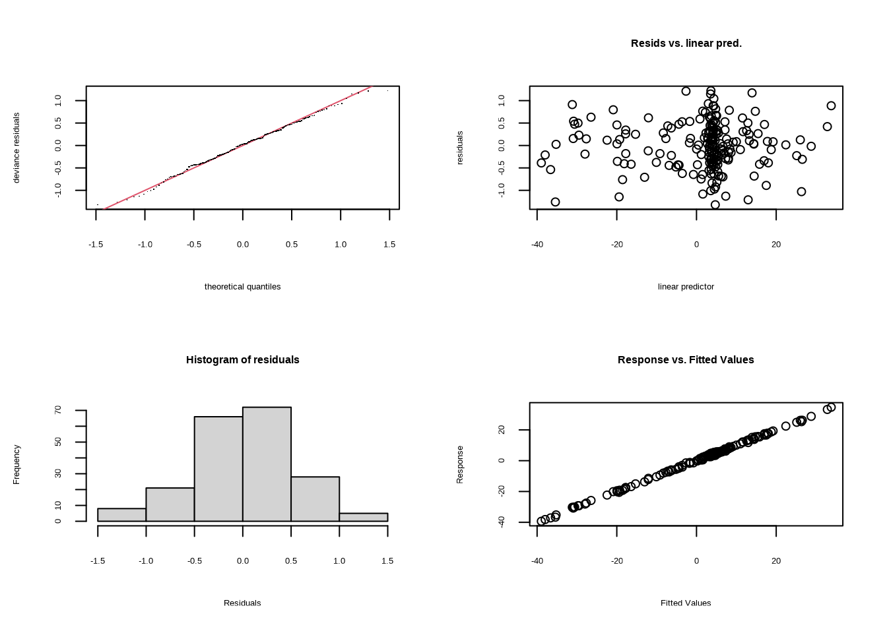
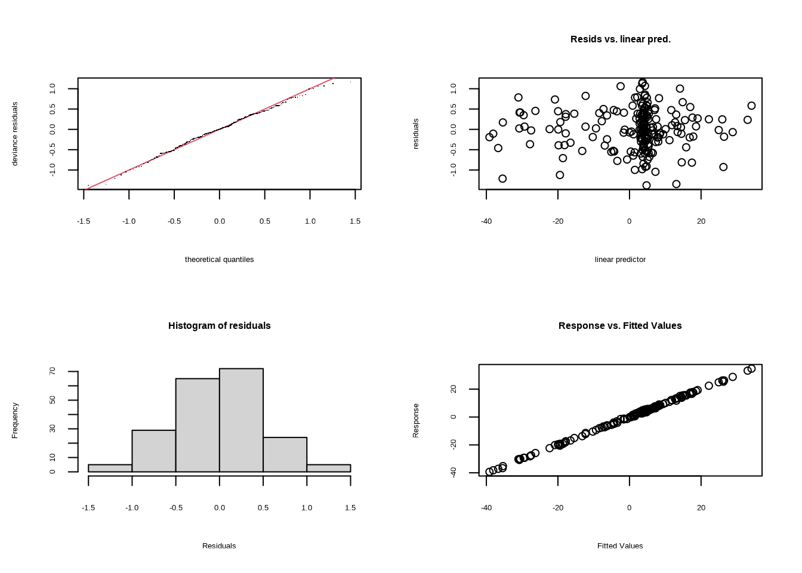
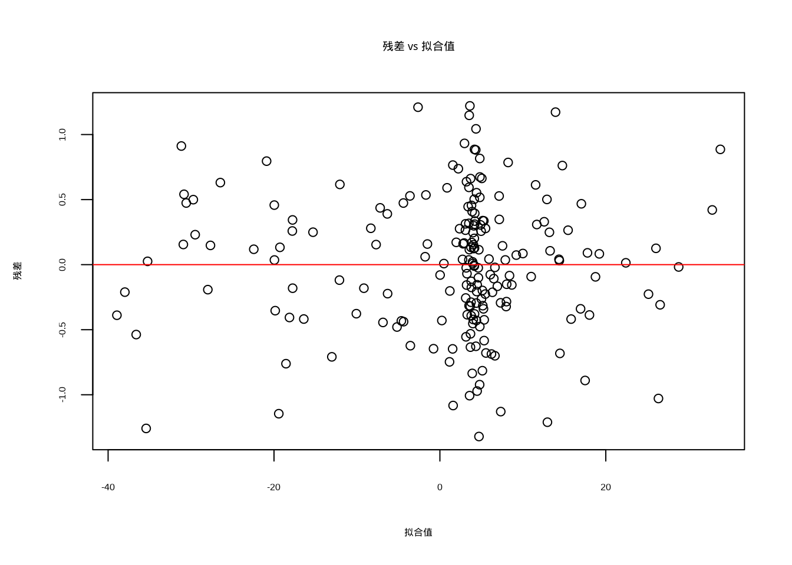

# 高级回归模型


## 引言

生态学研究常常需要面对一个核心挑战：如何用统计工具准确描述复杂多变的生态系统。传统的线性回归模型虽然简洁有效，但其严格的假设条件——线性关系、正态分布、方差齐性、观测独立性——在真实的生态场景中往往难以满足。当我们试图用这些简化模型来刻画生态系统的复杂性时，就如同用直线去描绘蜿蜒的河流，虽然能够获得近似结果，却难以捕捉生态过程的真实本质。

以温度对植物物候的影响为例，线性回归可能假设温度每升高1℃，开花时间就提前固定天数。但生态生理学研究表明，植物对温度的反应通常呈现S形曲线：低温阈值以下影响微弱，适宜温度范围内影响显著，高温胁迫下影响可能减弱甚至逆转。这种非线性模式在生态系统中普遍存在，从物种-面积关系的幂函数形式，到捕食者-猎物动态的Holling功能响应曲线，再到资源利用效率的饱和曲线模式。广义可加模型（GAM）正是为捕捉这类复杂关系而设计的，它通过平滑函数让数据本身决定变量间的关系形态，无需预先指定具体的函数形式。

生态数据的分布特性也常常挑战传统假设。计数数据（如物种个体数）通常服从泊松分布或负二项分布，比例数据（如存活率）服从二项分布，连续偏态数据（如生物量）可能服从伽马分布。强行使用线性回归会导致预测值超出合理范围，方差结构错误，统计推断不可靠。广义线性模型（GLM）通过连接函数和方差函数，为处理非正态分布数据提供了系统框架，确保预测值落在合理范围内，正确描述数据的变异性。

生态数据的层次结构特征同样不容忽视。在研究森林动态时，我们可能在多个样地中设置多个样方，在多个年份重复观测。这种嵌套结构产生了空间自相关、时间自相关和组内相关。忽视这些相关性会导致"伪重复"问题，严重低估标准误。混合效应模型通过区分固定效应和随机效应，能够正确处理层次结构数据，固定效应描述总体模式，随机效应捕捉组间变异。

生态系统中变量间的关系往往构成复杂的因果网络。气候变暖可能直接影响物种分布，同时通过改变竞争关系、捕食压力、资源可用性等途径产生间接影响。传统回归分析只能检验直接关系，无法揭示复杂的因果机制。结构方程模型（SEM）整合测量模型和结构模型，使我们能够检验复杂的因果假设，特别适合处理无法直接观测的潜变量如生态系统健康、生物多样性等。

生态过程的时空依赖性也是重要特征。物种分布、种群动态、生态系统功能都在空间和时间维度上展现复杂模式。忽视时空依赖性会导致空间伪相关、预测精度降低和对生态过程的误解。时空自相关模型通过空间权重矩阵和时间自回归项，能够正确建模生态数据的时空依赖性，为物种分布模型、环境预测等应用提供支持。

这些高级回归模型代表了生态统计学思维的根本转变：从确定性到概率性，承认生态过程的内在随机性；从简化到复杂，接受生态系统的多层次非线性本质；从相关到因果，致力于理解生态机制；从静态到动态，考虑生态过程的时空维度。在具体应用中，混合效应模型帮助区分保护措施的真实效果与地点特异性变异，广义可加模型捕捉物种对气候因子的非线性响应，结构方程模型揭示管理措施的影响途径，时空模型提高趋势检测的统计功效。

本章将系统介绍这些高级回归模型的理论基础、实现方法和生态学应用。通过学习，你将掌握每种模型的基本原理和适用条件，学会在R中实现这些模型的技术，能够解释和验证复杂模型的输出结果，具备将高级统计方法应用于实际生态学问题的能力，并培养批判性思维来评估不同模型的优缺点。这些技能将使你在日益复杂的生态学研究中保持竞争力，为理解和管理生态系统提供更强大的分析工具。正如生态学家Robert MacArthur所言："为了发现，你必须寻找模式，但为了理解，你必须理解机制。"这些高级回归模型正是我们理解生态机制的重要工具。


## 可加性模型

生态学研究常常需要描述复杂的非线性关系，而传统的线性回归模型往往难以胜任。以温度对植物物候的影响为例，植物对温度的反应通常呈现S形曲线：低温阈值以下影响微弱，适宜温度范围内影响显著，高温胁迫下影响可能减弱。类似地，物种丰富度随环境梯度变化呈现单峰分布，资源利用效率随资源可用性增加呈现饱和曲线。这些非线性模式在生态系统中普遍存在，可加性模型正是为捕捉这类复杂关系而设计的强大工具。

### 可加性模型的基本原理

可加性模型的基本数学形式为：

$$y = \beta_0 + f_1(x_1) + f_2(x_2) + \cdots + f_p(x_p) + \varepsilon$$

其中$\beta_0$是截距项，$f_j(x_j)$是每个预测变量的平滑函数，$\varepsilon$是误差项。与传统的线性模型不同，可加性模型不预设具体的函数形式，而是通过非参数平滑函数让数据本身决定变量间的关系形态。

### 与线性模型的比较

可加性模型与线性模型在多个方面存在重要差异，这些差异决定了它们在不同生态学场景下的适用性：

**函数形式**：线性模型假设变量间为严格的直线关系$f_j(x_j) = \beta_j x_j$，其中$\beta_j$是固定斜率参数。这种假设在生态学中往往过于简化。例如，温度对植物生长的影响通常呈现S形曲线而非直线。可加性模型通过平滑函数$f_j(x_j)$自动捕捉非线性模式，无需预先指定函数形式。

**灵活性**：线性模型要求预先知道变量间的函数关系，这在生态学中常常难以实现。研究海拔对物种丰富度的影响时，我们可能不确定关系是线性、二次还是单峰曲线。可加性模型通过数据驱动方式让数据决定关系形态，特别适合探索性研究。

**参数数量**：线性模型有固定参数数量，等于预测变量个数加1。这种固定结构可能导致模型过于简化。可加性模型的复杂度由数据决定，通过广义交叉验证（GCV）或限制极大似然（REML）自动选择最优平滑复杂度，在简单和复杂模式间找到平衡。

**解释性**：线性模型具有明确的参数解释，每个$\beta_j$代表$x_j$每增加一单位，$y$的平均变化量。可加性模型的解释更复杂，需要通过可视化理解变量效应。虽然失去参数直接解释性，但获得了描述复杂生态关系的能力。

### 常见的平滑函数

在R的`mgcv`包中，可加性模型支持多种平滑基函数，每种都有其特点和适用场景：

1. **薄板样条（Thin Plate Splines）**：
   - 默认平滑基函数，通过`bs = "tp"`指定
   - 优点：数学性质优良，对节点位置不敏感
   - 适用场景：一般性的平滑问题，特别是当预测变量间没有明显的尺度差异时

   ```r
   gam(y ~ s(x1, bs = "tp") + s(x2, bs = "tp"), data = dataset)
   ```

2. **立方样条（Cubic Regression Splines）**：
   - 通过`bs = "cr"`指定
   - 优点：计算效率高，对节点位置敏感
   - 适用场景：一维平滑问题，特别是当数据点分布不均匀时

   ```r
   gam(y ~ s(x1, bs = "cr") + s(x2, bs = "cr"), data = dataset)
   ```

3. **P样条（P-splines）**：
   - 通过`bs = "ps"`指定
   - 优点：基于B样条基，对过度拟合有较好的控制
   - 适用场景：需要较强平滑约束的情况

   ```r
   gam(y ~ s(x1, bs = "ps") + s(x2, bs = "ps"), data = dataset)
   ```

4. **循环样条（Cyclic Cubic Splines）**：
   - 通过`bs = "cc"`指定
   - 优点：处理周期性数据，确保平滑函数在边界处连续
   - 适用场景：时间序列数据（日、季节周期）、角度数据等

   ```r
   # 处理具有年周期的生态数据
   gam(y ~ s(day_of_year, bs = "cc"), data = dataset)
   ```

5. **自适应平滑（Adaptive Smoothing）**：
   - 通过`bs = "ad"`指定
   - 优点：能够适应数据中不同区域的平滑度变化
   - 适用场景：数据在不同区域具有不同变异性的情况

   ```r
   gam(y ~ s(x1, bs = "ad"), data = dataset)
   ```

6. **张量积平滑（Tensor Product Smooths）**：
   - 通过`te()`函数实现
   - 优点：处理多个变量间的交互作用
   - 适用场景：当变量间存在复杂的交互效应时

   ```r
   # 建模温度和降水对物种丰富度的交互影响
   gam(species_richness ~ te(temperature, precipitation),
       family = poisson, data = dataset)
   ```

7. **交互平滑（Interaction Smooths）**：
   - 通过`ti()`函数实现
   - 优点：分离主效应和交互效应
   - 适用场景：需要分别解释主效应和交互效应时

   ```r
   gam(species_richness ~ s(temperature) + s(precipitation) +
       ti(temperature, precipitation), family = poisson, data = dataset)
   ```

### 平滑函数选择的生态学考量

在选择平滑函数时，需要考虑生态学问题的具体特点：

- **数据特性**：如果数据具有明显的周期性（如季节变化），应选择循环样条
- **变量尺度**：如果预测变量尺度差异很大，张量积平滑可能更合适
- **计算效率**：对于大数据集，立方样条通常计算效率更高
- **生态机制**：如果对生态过程有一定了解，可以选择更符合生态机制的平滑函数

通过合理选择平滑函数，可加性模型能够更好地捕捉生态数据中的复杂模式，为生态学研究和保护决策提供更可靠的统计支持。

### 可加性模型中的"系数"概念

这是一个非常重要的问题：可加性模型有回归系数吗？能否像线性回归那样解释"正相关"或"负相关"？

**简短回答：** 可加性模型没有传统意义上的回归系数，不能像线性回归那样直接解释"正相关"或"负相关"。

#### 为什么可加性模型没有传统系数

**线性回归的系数解释：**
- 模型：$y = \beta_0 + \beta_1 x_1 + \beta_2 x_2 + \varepsilon$
- $\beta_1$：当$x_2$保持不变时，$x_1$每增加1单位，$y$平均变化$\beta_1$单位
- 如果$\beta_1 > 0$：正相关；$\beta_1 < 0$：负相关

**可加性模型的"系数"本质：**
- 模型：$y = \beta_0 + f_1(x_1) + f_2(x_2) + \varepsilon$
- 这里没有固定的$\beta_1, \beta_2$，而是平滑函数$f_1(x_1), f_2(x_2)$
- 每个平滑函数本身是一个复杂的数学表达式，包含多个基函数系数

#### 为什么不能直接解释"正负相关"

**原因1：非线性关系**
可加性模型允许变量间的关系在整个取值范围内变化。例如，温度对植物生长的影响可能在低温时为正相关，在高温时为负相关。无法用单一系数描述这种复杂关系。

**原因2：局部效应**
可加性模型描述的是局部效应，而不是全局效应。在$x_1$的不同取值区间，$f_1(x_1)$的斜率（导数）可能不同。

#### 如何正确解释可加性模型的结果

**方法1：可视化解释**
```r
# 绘制平滑函数图
plot(gam_model, pages = 1)
```
- 曲线上升：正相关趋势
- 曲线下降：负相关趋势
- 曲线平坦：影响微弱

**方法2：导数分析**
```r
# 计算特定点的导数（斜率）
library(gratia)
derivatives(gam_model, term = "s(temperature)")
```

**方法3：区间分析**
将变量取值范围分成多个区间，分析每个区间内的平均效应方向。

#### 实际生态学例子对比

假设研究温度对物种丰富度的影响：

**线性模型结果：**
```r
# 假设线性模型系数
coef(lm_model)
# (Intercept) temperature
#   15.2        -0.5
```
解释：温度每升高1°C，物种数减少0.5种（全局负相关）

**可加性模型结果：**
```r
# 绘制温度效应曲线
plot(gam_model, select = 1)
```
解释：$f(温度)$曲线显示：
- 5-15°C：曲线上升（正相关）
- 15-25°C：曲线平坦（影响微弱）
- 25-35°C：曲线下降（负相关）

#### 统计显著性检验

在可加性模型中，我们检验的是：
- 平滑函数$f_j(x_j)$是否显著不同于零函数（即是否有任何效应）
- 而不是检验某个系数是否显著不同于零

```r
summary(gam_model)
# 关注"Approximate significance of smooth terms"部分
```

#### 什么时候可以近似看作"系数"

在某些特殊情况下：
- 当平滑函数在整个取值范围内近似线性时
- 当只关心特定区间内的效应时
- 可以通过计算平均斜率来获得近似的"系数"

```r
# 计算整个温度范围内的平均效应
mean_effect <- mean(predict(gam_model, type = "terms")[, "s(temperature)"])
```

#### 生态学意义

这种复杂性正是可加性模型在生态学中如此有价值的原因。生态过程很少是简单的直线关系：
- 物种对环境因子的响应通常存在最优区间
- 资源利用效率通常呈现饱和曲线
- 竞争关系可能在不同密度下呈现不同模式

通过放弃简单的系数解释，可加性模型获得了描述真实生态复杂性的能力。这种权衡在生态学研究中通常是值得的，因为它让我们能够更准确地理解生态系统的运作机制。

### 在R中的实现

在R中，我们可以使用`mgcv`包来实现可加性模型。该包提供了`gam()`函数，这是构建可加性模型的核心函数。`gam()`函数的基本语法为：

```r
gam(y ~ s(x1) + s(x2) + ... + s(xp), data = dataset)
```

其中`s()`函数用于指定平滑项，它可以自动选择平滑函数的复杂度。`gam()`函数支持多种平滑基函数，包括薄板样条、立方样条、P样条等，用户可以通过`bs`参数进行选择。

### 生态学应用示例

让我们通过一个具体的生态学例子来演示可加性模型的应用。假设我们研究湖泊中浮游植物生物量（叶绿素a浓度）与环境因子的关系：


``` r
# 构建可加性模型
# 使用s()函数为每个环境因子创建平滑项
# gam()函数自动选择最优平滑复杂度
phyto_am <- gam(chlorophyll ~ s(temperature) + s(nutrients) + s(light),
  data = lake_data
)

# 输出模型摘要
# 显示平滑项的显著性检验和模型拟合信息
summary(phyto_am)
```

```
## 
## Family: gaussian 
## Link function: identity 
## 
## Formula:
## chlorophyll ~ s(temperature) + s(nutrients) + s(light)
## 
## Parametric coefficients:
##             Estimate Std. Error t value Pr(>|t|)    
## (Intercept)  1.67023    0.03769   44.32   <2e-16 ***
## ---
## Signif. codes:  0 '***' 0.001 '**' 0.01 '*' 0.05 '.' 0.1 ' ' 1
## 
## Approximate significance of smooth terms:
##                  edf Ref.df        F p-value    
## s(temperature) 8.852  8.993 12955.89  <2e-16 ***
## s(nutrients)   2.967  3.684    39.95  <2e-16 ***
## s(light)       2.754  3.421    62.61  <2e-16 ***
## ---
## Signif. codes:  0 '***' 0.001 '**' 0.01 '*' 0.05 '.' 0.1 ' ' 1
## 
## R-sq.(adj) =  0.998   Deviance explained = 99.8%
## GCV = 0.30807  Scale est. = 0.28408   n = 200
```


``` r
# 可视化各变量的平滑效应
# pages = 1 将所有图显示在同一页面
# residuals = TRUE 显示残差点
# pch = 1, cex = 1 设置点的形状和大小
plot(phyto_am, pages = 1, residuals = TRUE, pch = 1, cex = 1)
```

<div class="figure" style="text-align: center">

<p class="caption">(\#fig:visualize-phyto-am)浮游植物生物量与环境因子关系的可加性模型平滑效应图</p>
</div>


``` r
# 模型诊断
# 检查平滑复杂度选择和残差模式
gam.check(phyto_am)
```

<div class="figure" style="text-align: center">

<p class="caption">(\#fig:diagnose-phyto-am)浮游植物生物量可加性模型诊断图</p>
</div>

```
## 
## Method: GCV   Optimizer: magic
## Smoothing parameter selection converged after 13 iterations.
## The RMS GCV score gradient at convergence was 3.147714e-06 .
## The Hessian was positive definite.
## Model rank =  28 / 28 
## 
## Basis dimension (k) checking results. Low p-value (k-index<1) may
## indicate that k is too low, especially if edf is close to k'.
## 
##                  k'  edf k-index p-value  
## s(temperature) 9.00 8.85    1.03    0.64  
## s(nutrients)   9.00 2.97    0.90    0.04 *
## s(light)       9.00 2.75    1.04    0.70  
## ---
## Signif. codes:  0 '***' 0.001 '**' 0.01 '*' 0.05 '.' 0.1 ' ' 1
```


``` r
# 与线性模型比较
# 构建传统线性模型作为基准
phyto_lm <- lm(chlorophyll ~ temperature + nutrients + light, data = lake_data)

# 比较模型拟合优度
# AIC值越小表示模型拟合越好
AIC(phyto_am, phyto_lm)
```

```
##                df       AIC
## phyto_am 16.57349  332.8098
## phyto_lm  5.00000 1304.4097
```

在这个例子中，我们使用了几个关键函数：

- `gam()`：构建可加性模型的核心函数
- `s()`：指定平滑项，自动选择平滑复杂度
- `summary()`：输出模型摘要，包括平滑项的显著性检验
- `plot()`：可视化各变量的平滑效应
- `gam.check()`：进行模型诊断，检查残差和光滑度选择

### 可加性模型诊断

可加性模型的诊断比传统线性模型更为复杂，需要特别关注平滑复杂度的选择、残差模式和过度拟合问题。系统性的模型诊断是确保结果可靠性的关键步骤。

#### 平滑复杂度诊断

平滑复杂度通过基函数维度(k)来控制，k值决定了平滑函数能够捕捉的"摆动"程度。如果k值太小，模型可能无法充分捕捉数据的非线性模式；如果k值太大，则可能导致过度拟合。


``` r
# 检查平滑复杂度是否足够
gam.check(phyto_am)
```

<div class="figure" style="text-align: center">

<p class="caption">(\#fig:unnamed-chunk-2-1)可加性模型平滑复杂度诊断图</p>
</div>

```
## 
## Method: GCV   Optimizer: magic
## Smoothing parameter selection converged after 13 iterations.
## The RMS GCV score gradient at convergence was 3.147714e-06 .
## The Hessian was positive definite.
## Model rank =  28 / 28 
## 
## Basis dimension (k) checking results. Low p-value (k-index<1) may
## indicate that k is too low, especially if edf is close to k'.
## 
##                  k'  edf k-index p-value  
## s(temperature) 9.00 8.85    1.03   0.630  
## s(nutrients)   9.00 2.97    0.90   0.085 .
## s(light)       9.00 2.75    1.04   0.670  
## ---
## Signif. codes:  0 '***' 0.001 '**' 0.01 '*' 0.05 '.' 0.1 ' ' 1
```

``` r
# 输出解释：
# k': 实际使用的基函数维度
# edf: 有效自由度，反映实际使用的平滑复杂度
# 如果edf接近k'-1，说明k值可能不足
# 如果k-index < 1 且 p-value < 0.05，说明需要增加k值

# 调整k值处理wiggliness不足
phyto_am_adj <- gam(
  chlorophyll ~ s(temperature, k = 15) +
    s(nutrients, k = 10) + s(light, k = 10),
  data = lake_data
)
gam.check(phyto_am_adj)
```

<div class="figure" style="text-align: center">

<p class="caption">(\#fig:unnamed-chunk-2-2)可加性模型平滑复杂度诊断图</p>
</div>

```
## 
## Method: GCV   Optimizer: magic
## Smoothing parameter selection converged after 11 iterations.
## The RMS GCV score gradient at convergence was 1.082531e-05 .
## The Hessian was positive definite.
## Model rank =  33 / 33 
## 
## Basis dimension (k) checking results. Low p-value (k-index<1) may
## indicate that k is too low, especially if edf is close to k'.
## 
##                   k'   edf k-index p-value  
## s(temperature) 14.00 12.29    1.10    0.86  
## s(nutrients)    9.00  2.71    0.89    0.07 .
## s(light)        9.00  2.42    1.06    0.82  
## ---
## Signif. codes:  0 '***' 0.001 '**' 0.01 '*' 0.05 '.' 0.1 ' ' 1
```

#### 残差诊断

可加性模型的残差诊断需要检查残差的独立性、同方差性和分布假设。


``` r
# 设置图形布局为2x2网格
# 用于同时显示多个诊断图
par(mfrow = c(2, 2))
```


``` r
# 残差与拟合值图
# 检查残差的同方差性假设
# 理想情况下，残差应随机分布在零线周围
plot(fitted(phyto_am), residuals(phyto_am),
  xlab = "拟合值", ylab = "残差",
  main = "残差 vs 拟合值"
)
abline(h = 0, col = "red")  # 添加零参考线
```

<div class="figure" style="text-align: center">

<p class="caption">(\#fig:residual-vs-fitted)残差与拟合值关系图</p>
</div>


``` r
# Q-Q图检查残差的正态性
# 如果点大致落在对角线上，说明残差近似正态分布
qqnorm(residuals(phyto_am))
qqline(residuals(phyto_am), col = "red")  # 添加参考线
```

<div class="figure" style="text-align: center">

<p class="caption">(\#fig:qq-plot-residuals)残差正态性Q-Q图</p>
</div>


``` r
# 残差与预测变量关系图
# 检查残差是否与预测变量存在系统性关系
# 理想情况下，残差应随机分布，无明显模式
plot(lake_data$temperature, residuals(phyto_am),
  xlab = "温度", ylab = "残差",
  main = "残差 vs 温度"
)
abline(h = 0, col = "red")  # 添加零参考线
```

<div class="figure" style="text-align: center">

<p class="caption">(\#fig:residual-vs-temperature)残差与温度关系图</p>
</div>


``` r
# 自相关函数图（检查时间序列自相关）
# 对于非时间序列数据，自相关应接近零
# 对于时间序列数据，检查是否存在时间自相关
acf(residuals(phyto_am), main = "残差自相关")
```

<div class="figure" style="text-align: center">

<p class="caption">(\#fig:acf-residuals)残差自相关函数图</p>
</div>

#### 模型比较与选择

比较不同平滑复杂度和基函数的模型，选择最优模型。


``` r
# 比较不同平滑复杂度的模型
# 简单模型：k值较小，平滑函数较简单
model_simple <- gam(
  chlorophyll ~ s(temperature, k = 5) +
    s(nutrients, k = 5) + s(light, k = 5),
  data = lake_data
)

# 复杂模型：k值较大，平滑函数较灵活
model_complex <- gam(
  chlorophyll ~ s(temperature, k = 20) +
    s(nutrients, k = 15) + s(light, k = 15),
  data = lake_data
)

# 使用AIC比较模型
# AIC值越小表示模型拟合越好
AIC(model_simple, model_complex, phyto_am)
```

```
##                     df      AIC
## model_simple  10.85802 692.1595
## model_complex 20.85028 326.0325
## phyto_am      16.57349 332.8098
```


``` r
# 检查GCV分数（广义交叉验证）
# GCV分数用于自动选择平滑复杂度
# 分数越低表示模型拟合越好
phyto_am$gcv.ubre
```

```
##    GCV.Cp 
## 0.3080694
```


``` r
# 不同平滑基函数比较
# 薄板样条（默认）
model_tp <- gam(
  chlorophyll ~ s(temperature, bs = "tp") +
    s(nutrients, bs = "tp") + s(light, bs = "tp"),
  data = lake_data
)

# 立方样条
model_cr <- gam(
  chlorophyll ~ s(temperature, bs = "cr") +
    s(nutrients, bs = "cr") + s(light, bs = "cr"),
  data = lake_data
)

# 使用AIC比较不同基函数的模型
AIC(model_tp, model_cr)
```

```
##                df      AIC
## model_tp 16.57349 332.8098
## model_cr 16.37752 331.7293
```

#### 预测性能评估

评估模型在新数据上的预测性能。


``` r
# 交叉验证评估
# 加载必要的包（如果尚未加载）
library(mgcv)

# 设置随机种子确保结果可重现
set.seed(123)

# 分割数据集为训练集和测试集
# 70%数据用于训练，30%用于测试
train_indices <- sample(1:nrow(lake_data), 0.7 * nrow(lake_data))
train_data <- lake_data[train_indices, ]
test_data <- lake_data[-train_indices, ]
```


``` r
# 在训练集上构建模型
# 使用与原始模型相同的公式结构
cv_model <- gam(chlorophyll ~ s(temperature) + s(nutrients) + s(light),
  data = train_data
)
```


``` r
# 在测试集上预测
test_predictions <- predict(cv_model, newdata = test_data)

# 计算预测性能指标
# RMSE：均方根误差，衡量预测误差大小
rmse <- sqrt(mean((test_data$chlorophyll - test_predictions)^2))

# MAE：平均绝对误差，对异常值不敏感
mae <- mean(abs(test_data$chlorophyll - test_predictions))

# R²：决定系数，衡量模型解释的方差比例
r2 <- cor(test_data$chlorophyll, test_predictions)^2

# 输出预测性能结果
cat("RMSE:", rmse, "\n")
```

```
## RMSE: 0.579658
```

``` r
cat("MAE:", mae, "\n")
```

```
## MAE: 0.4649405
```

``` r
cat("R²:", r2, "\n")
```

```
## R²: 0.9982059
```


``` r
# 准备新数据进行预测
# 创建温度梯度，其他变量设为平均值
new_data <- data.frame(
  temperature = seq(5, 30, length = 50),  # 温度从5到30°C，50个点
  nutrients = mean(lake_data$nutrients),   # 营养盐设为平均值
  light = mean(lake_data$light)            # 光照设为平均值
)
```


``` r
# 计算预测值和置信区间
# type = "response" 返回响应尺度上的预测值
# se.fit = TRUE 返回标准误
predictions <- predict(phyto_am,
  newdata = new_data,
  type = "response", se.fit = TRUE
)

# 提取预测值和标准误
new_data$pred <- predictions$fit

# 计算95%置信区间
# 使用正态分布近似，1.96对应95%置信水平
new_data$lower <- new_data$pred - 1.96 * predictions$se.fit
new_data$upper <- new_data$pred + 1.96 * predictions$se.fit
```


``` r
# 可视化预测区间
# 加载ggplot2包（如果尚未加载）
library(ggplot2)

# 创建预测曲线图
# geom_ribbon() 添加置信区间带
# geom_line() 添加预测曲线
ggplot(new_data, aes(x = temperature, y = pred)) +
  geom_ribbon(aes(ymin = lower, ymax = upper), alpha = 0.2) +
  geom_line(size = 1) +
  labs(
    x = "温度 (°C)", y = "预测叶绿素浓度",
    title = "温度对浮游植物生物量的影响（含95%置信区间）"
  ) +
  theme_minimal()
```

<div class="figure" style="text-align: center">

<p class="caption">(\#fig:visualize-prediction-intervals)温度对浮游植物生物量影响的预测曲线（含95%置信区间）</p>
</div>

#### 生态学意义验证

最后，模型结果需要在生态学背景下进行验证：

1. **生物学合理性**：平滑函数的形状是否符合已知的生态学知识？例如，温度对浮游植物生长的影响是否呈现单峰曲线？

2. **效应大小**：预测的环境因子变化是否对应有意义的生态效应？例如，温度变化5°C是否导致叶绿素浓度的显著变化？

3. **模型稳定性**：移除异常值或使用不同数据子集时，主要结论是否保持不变？

4. **预测能力**：模型在新地点或新时间点的预测表现如何？

通过系统的模型诊断和谨慎的结果解释，我们可以确保可加性模型分析为生态学研究提供可靠的科学依据。

### 可加性模型的优势与局限

可加性模型在生态学中的主要优势在于其灵活性：它能够自动捕捉数据中的非线性模式，而无需研究者预先指定函数形式。同时，通过`mgcv`包中的广义交叉验证（GCV）或限制极大似然（REML）方法，模型能够自动选择最优的平滑复杂度，避免过度拟合。

然而，可加性模型也有其局限性：

1. **可加性假设**：模型假设各变量的效应是可加的，当变量间存在强交互作用时，这一假设可能不成立
2. **解释复杂性**：与线性模型相比，可加性模型的解释更加复杂，需要依赖可视化
3. **计算成本**：对于大数据集，可加性模型的计算成本较高
4. **参数不确定性**：平滑函数的参数不像线性模型那样有明确的统计推断

在生态学研究中，可加性模型已广泛应用于环境梯度分析、物种-环境关系建模、时间序列分析等多个领域。它为我们理解复杂的生态关系提供了强大的统计工具，特别是在我们缺乏关于生态过程数学形式的先验知识时，可加性模型的灵活性显得尤为宝贵。

---

## 广义线性回归

在掌握了可加性模型处理非线性关系的能力后，我们转向另一个重要挑战：生态数据的非正态分布特性。

在生态学研究中，我们经常遇到各种类型的响应数据：物种存在与否（二元数据）、个体数量（计数数据）、生物量比例（比例数据）等。这些数据往往不符合传统线性回归的正态分布假设。广义线性模型（GLM）为解决这一问题提供了系统性的框架，它通过三个核心组件——线性预测项、连接函数和方差函数——将线性模型的思想扩展到非正态分布数据。

### 广义线性模型的基本框架

广义线性模型由三个基本部分组成：

**线性预测项（Linear Predictor）**：这是模型的核心部分，形式上与普通线性回归相似：

$$\eta = \beta_0 + \beta_1 x_1 + \beta_2 x_2 + \cdots + \beta_p x_p$$

其中$\eta$称为线性预测项，$\beta_j$是回归系数，$x_j$是预测变量。线性预测项捕捉了预测变量对响应变量的系统性影响。

**连接函数（Link Function）**：连接函数$g(\cdot)$将响应变量的期望值$\mu = E(y)$与线性预测项连接起来：

$$g(\mu) = \eta$$

连接函数的作用是确保预测值落在合理的范围内。例如，对于计数数据，我们使用对数连接函数确保预测值为正数；对于比例数据，我们使用logit连接函数确保预测值在0到1之间。

**方差函数（Variance Function）**：方差函数描述了响应变量的方差如何依赖于其均值：

$$Var(y) = \phi V(\mu)$$

其中$\phi$是离散参数，$V(\mu)$是方差函数。不同的分布类型对应不同的方差函数，这反映了不同类型数据的变异性特征。

### 与普通线性回归的根本区别

广义线性模型与普通线性回归在多个方面存在根本性的区别：

**分布假设**：普通线性回归假设响应变量服从正态分布，而广义线性模型可以处理多种分布类型，包括二项分布、泊松分布、负二项分布、伽马分布等。

**连接函数**：普通线性回归使用恒等连接函数$g(\mu) = \mu$，而广义线性模型根据数据特性选择适当的连接函数。

**方差结构**：普通线性回归假设方差恒定，而广义线性模型允许方差依赖于均值，这更符合生态数据的实际情况。

**参数估计**：普通线性回归使用最小二乘法估计参数，而广义线性模型使用迭代加权最小二乘法进行最大似然估计。

### R语言中的GLM实现

在R语言中，广义线性模型主要通过`glm()`函数实现，其基本语法为：

```r
model <- glm(formula, family = family(link = "link_function"), data = dataset)
```

**主要参数说明：**

- `formula`：模型公式，格式为`y ~ x1 + x2 + x3`，其中`y`是响应变量，`x1, x2, x3`是预测变量
- `family`：指定响应变量的分布类型和连接函数，这是GLM的核心参数
- `data`：包含变量的数据框

**常用的family选项：**

- `binomial(link = "logit")`：二项分布，logit连接函数（逻辑回归）
- `poisson(link = "log")`：泊松分布，对数连接函数（泊松回归）
- `gaussian(link = "identity")`：正态分布，恒等连接函数（普通线性回归）
- `Gamma(link = "inverse")`：伽马分布，逆连接函数
- `quasipoisson(link = "log")`：拟泊松分布，处理过离散计数数据

**模型结果解读：**

使用`summary()`函数查看模型摘要，重点关注：
- 系数估计值（Estimate）及其显著性（Pr(>|z|)）
- 零偏差（Null deviance）和残差偏差（Residual deviance）
- AIC值（用于模型比较）

**模型诊断：**

- `plot(model)`：生成模型诊断图
- `residuals(model)`：获取残差
- `predict(model, type = "response")`：获取预测值

### 常见GLM类型及其生态学应用

#### 逻辑回归（Logistic Regression）

逻辑回归适用于二元响应变量，如物种存在与否、个体存活死亡等。使用logit连接函数将概率映射到线性预测项：

$$g(\mu) = \log\left(\frac{\mu}{1-\mu}\right) = \eta$$

**为什么选择logit连接函数？**

1. **概率范围约束**：二元数据的概率必须在0到1之间。logit函数将(0,1)区间映射到整个实数轴(-∞,+∞)，确保线性预测项$\eta$可以取任意值，而预测的概率始终在合理范围内。

2. **生物学合理性**：logit函数具有S形曲线的特性，这符合许多生态过程的响应模式。例如，物种对环境因子的响应通常存在阈值效应：在某个阈值以下影响微弱，在适宜范围内影响显著，在极端条件下影响又减弱。

3. **可解释性**：logit函数的系数可以解释为优势比的对数，这在生态学中具有直观意义。例如，温度系数为0.1意味着温度每升高1°C，物种出现的优势（出现概率/不出现概率）增加exp(0.1)≈1.105倍。

4. **数学性质**：logit函数是对称的，即$g(p) = -g(1-p)$，这符合许多生态过程的对称性假设。

方差函数为$V(\mu) = \mu(1-\mu)$，反映了二元数据的变异性特征：当概率接近0或1时，方差很小；当概率接近0.5时，方差最大。在生态学中，逻辑回归常用于物种分布模型、栖息地适宜性分析等。


``` r
# 逻辑回归示例：研究环境因子对物种出现概率的影响
# 模拟生态学数据：物种出现与环境因子的关系
set.seed(123)
n <- 200
species_data <- data.frame(
  temperature = runif(n, 5, 30), # 温度(°C)
  precipitation = runif(n, 500, 2000), # 降水量(mm)
  habitat_quality = runif(n, 0, 1) # 栖息地质量指数
)

# 模拟物种出现概率（使用logit连接函数）
linear_predictor <- -2 + 0.1 * species_data$temperature +
  0.002 * species_data$precipitation +
  3 * species_data$habitat_quality
probability <- 1 / (1 + exp(-linear_predictor))
species_data$presence <- rbinom(n, 1, probability)

# 构建逻辑回归模型
logistic_model <- glm(presence ~ temperature + precipitation + habitat_quality,
  family = binomial(link = "logit"),
  data = species_data
)

# 模型摘要和系数解释
summary(logistic_model)
```

```
## 
## Call:
## glm(formula = presence ~ temperature + precipitation + habitat_quality, 
##     family = binomial(link = "logit"), data = species_data)
## 
## Coefficients:
##                 Estimate Std. Error z value Pr(>|z|)  
## (Intercept)     0.060100   1.534361   0.039   0.9688  
## temperature     0.041681   0.056759   0.734   0.4627  
## precipitation   0.001811   0.001056   1.715   0.0863 .
## habitat_quality 1.266257   1.331488   0.951   0.3416  
## ---
## Signif. codes:  0 '***' 0.001 '**' 0.01 '*' 0.05 '.' 0.1 ' ' 1
## 
## (Dispersion parameter for binomial family taken to be 1)
## 
##     Null deviance: 60.686  on 199  degrees of freedom
## Residual deviance: 55.846  on 196  degrees of freedom
## AIC: 63.846
## 
## Number of Fisher Scoring iterations: 7
```

``` r
exp(coef(logistic_model)) # 获得优势比
```

```
##     (Intercept)     temperature   precipitation habitat_quality 
##        1.061943        1.042562        1.001813        3.547548
```

#### 泊松回归（Poisson Regression）

泊松回归适用于计数数据，如物种个体数、捕获次数等。使用对数连接函数确保预测值为正数：

$$g(\mu) = \log(\mu) = \eta$$

**为什么选择对数连接函数？**

1. **正值约束**：计数数据必须是非负整数（0,1,2,...）。对数函数将(0,+∞)区间映射到整个实数轴(-∞,+∞)，确保线性预测项$\eta$可以取任意值，而预测的计数值始终为正数。

2. **乘法效应**：对数连接函数对应于乘法效应而非加法效应。这在生态学中通常更合理，因为环境因子的变化往往导致物种数量的比例变化而非绝对变化。例如，温度升高1°C可能使物种数量增加10%，而不是固定增加2个个体。

3. **生物学机制**：许多生态过程本质上是乘性的。例如，种群增长通常是指数增长，资源利用效率通常与资源可用性成比例关系。对数连接函数能够自然地描述这些过程。

4. **方差结构**：泊松分布的方差等于均值，这反映了计数数据的典型特征：当均值较大时，变异性也较大。对数连接函数与这种方差结构相协调。

方差函数为$V(\mu) = \mu$，假设均值和方差相等。这在生态计数数据中往往不成立，导致过度离散问题。


``` r
# 泊松回归示例：研究环境因子对物种丰富度的影响
# 模拟生态学数据：物种丰富度与环境因子的关系
set.seed(123)
n <- 150
richness_data <- data.frame(
  elevation = runif(n, 100, 3000), # 海拔(m)
  vegetation_diversity = runif(n, 1, 10) # 植被多样性指数
)

# 模拟物种丰富度（使用对数连接函数）
linear_predictor <- 2 + 0.001 * richness_data$elevation -
  0.0000001 * richness_data$elevation^2 +
  0.3 * richness_data$vegetation_diversity
lambda <- exp(linear_predictor)
richness_data$species_count <- rpois(n, lambda)

# 构建泊松回归模型
poisson_model <- glm(species_count ~ elevation + I(elevation^2) + vegetation_diversity,
  family = poisson(link = "log"),
  data = richness_data
)

# 模型摘要和过度离散检查
summary(poisson_model)
```

```
## 
## Call:
## glm(formula = species_count ~ elevation + I(elevation^2) + vegetation_diversity, 
##     family = poisson(link = "log"), data = richness_data)
## 
## Coefficients:
##                        Estimate Std. Error z value Pr(>|z|)    
## (Intercept)           1.992e+00  3.835e-02  51.953  < 2e-16 ***
## elevation             9.720e-04  3.841e-05  25.305  < 2e-16 ***
## I(elevation^2)       -8.723e-08  1.065e-08  -8.192 2.58e-16 ***
## vegetation_diversity  3.003e-01  2.702e-03 111.108  < 2e-16 ***
## ---
## Signif. codes:  0 '***' 0.001 '**' 0.01 '*' 0.05 '.' 0.1 ' ' 1
## 
## (Dispersion parameter for poisson family taken to be 1)
## 
##     Null deviance: 19850.6  on 149  degrees of freedom
## Residual deviance:   147.9  on 146  degrees of freedom
## AIC: 1162.6
## 
## Number of Fisher Scoring iterations: 4
```

``` r
library(AER)
dispersiontest(poisson_model)
```

```
## 
## 	Overdispersion test
## 
## data:  poisson_model
## z = -0.099863, p-value = 0.5398
## alternative hypothesis: true dispersion is greater than 1
## sample estimates:
## dispersion 
##  0.9896964
```

#### 负二项回归（Negative Binomial Regression）

负二项回归适用于过度离散的计数数据，即方差大于均值的情况。同样使用对数连接函数，但方差函数为$V(\mu) = \mu + \alpha\mu^2$，其中$\alpha$是过度离散参数。

**为什么同样选择对数连接函数？**

1. **保持一致性**：负二项回归是泊松回归的扩展，使用相同的对数连接函数保持了模型解释的一致性。系数仍然可以解释为发生率比的对数。

2. **正值约束**：与泊松回归相同，对数连接函数确保预测的计数值始终为正数，这符合计数数据的本质特征。

3. **生态学合理性**：生态计数数据中的过度离散往往源于未观测的异质性（如个体差异、空间变异等），而非连接函数选择的问题。对数连接函数仍然能够描述环境因子对物种数量的乘法效应。

4. **模型比较**：使用相同的连接函数便于与泊松回归模型进行比较，从而判断过度离散的程度和是否需要使用负二项回归。

负二项回归能够更好地处理生态计数数据中常见的过度离散现象，其方差函数$V(\mu) = \mu + \alpha\mu^2$允许方差随均值二次增长，这更符合生态数据的实际变异性特征。


``` r
# 负二项回归示例：处理过度离散的物种丰富度数据
# 如果泊松回归显示过度离散，使用负二项回归
library(MASS)
nb_model <- glm.nb(species_count ~ elevation + I(elevation^2) + vegetation_diversity,
  data = richness_data
)

# 模型摘要和比较
summary(nb_model)
```

```
## 
## Call:
## glm.nb(formula = species_count ~ elevation + I(elevation^2) + 
##     vegetation_diversity, data = richness_data, init.theta = 1221501.982, 
##     link = log)
## 
## Coefficients:
##                        Estimate Std. Error z value Pr(>|z|)    
## (Intercept)           1.992e+00  3.835e-02   51.95  < 2e-16 ***
## elevation             9.720e-04  3.842e-05   25.30  < 2e-16 ***
## I(elevation^2)       -8.723e-08  1.065e-08   -8.19  2.6e-16 ***
## vegetation_diversity  3.003e-01  2.703e-03  111.09  < 2e-16 ***
## ---
## Signif. codes:  0 '***' 0.001 '**' 0.01 '*' 0.05 '.' 0.1 ' ' 1
## 
## (Dispersion parameter for Negative Binomial(1221502) family taken to be 1)
## 
##     Null deviance: 19846.73  on 149  degrees of freedom
## Residual deviance:   147.88  on 146  degrees of freedom
## AIC: 1164.6
## 
## Number of Fisher Scoring iterations: 1
## 
## 
##               Theta:  1221502 
##           Std. Err.:  13919710 
## Warning while fitting theta: iteration limit reached 
## 
##  2 x log-likelihood:  -1154.63
```

``` r
AIC(poisson_model, nb_model)
```

```
##               df      AIC
## poisson_model  4 1162.628
## nb_model       5 1164.630
```

#### 比例数据回归（Proportional Data Regression）

比例数据回归适用于比例或百分比数据，如物种存活率、种子萌发率、植被覆盖率等。使用二项分布和logit连接函数，但需要指定试验次数（分母）：

$$g(\mu) = \log\left(\frac{\mu}{1-\mu}\right) = \eta$$

**为什么选择二项分布和logit连接函数？**

1. **比例范围约束**：比例数据必须在0到1之间。logit函数将(0,1)区间映射到整个实数轴，确保线性预测项$\eta$可以取任意值，而预测的比例始终在合理范围内。

2. **数据生成过程**：比例数据通常来自二项过程，如n次试验中成功的次数。二项分布自然地描述了这种数据生成机制。

3. **方差结构**：二项分布的方差为$V(\mu) = \mu(1-\mu)/n$，反映了比例数据的典型特征：当比例接近0.5时方差最大，当接近0或1时方差最小。

4. **生态学应用**：在生态学中，比例数据常见于存活率研究、资源利用效率、栖息地选择等场景。


``` r
# 比例数据回归示例：研究环境因子对植物存活率的影响
# 模拟生态学数据：植物存活率与环境因子的关系
set.seed(123)
n <- 100
plant_data <- data.frame(
  soil_moisture = runif(n, 0.1, 0.8), # 土壤湿度(比例)
  light_intensity = runif(n, 100, 2000), # 光照强度(μmol/m²/s)
  competition = runif(n, 0, 1) # 竞争强度指数
)

# 模拟植物存活率（使用logit连接函数）
linear_predictor <- -1 + 2 * plant_data$soil_moisture +
  0.001 * plant_data$light_intensity -
  1.5 * plant_data$competition
probability <- 1 / (1 + exp(-linear_predictor))

# 模拟二项数据：假设每个样方有50株植物
n_trials <- 50
plant_data$survived <- rbinom(n, n_trials, probability)
plant_data$total <- n_trials

# 构建比例数据回归模型
# 使用cbind(成功数, 失败数)作为响应变量
proportion_model <- glm(
  cbind(survived, total - survived) ~
    soil_moisture + light_intensity + competition,
  family = binomial(link = "logit"),
  data = plant_data
)

# 模型摘要和系数解释
summary(proportion_model)
```

```
## 
## Call:
## glm(formula = cbind(survived, total - survived) ~ soil_moisture + 
##     light_intensity + competition, family = binomial(link = "logit"), 
##     data = plant_data)
## 
## Coefficients:
##                   Estimate Std. Error z value Pr(>|z|)    
## (Intercept)     -8.957e-01  1.223e-01  -7.321 2.46e-13 ***
## soil_moisture    1.860e+00  1.588e-01  11.710  < 2e-16 ***
## light_intensity  1.054e-03  6.474e-05  16.285  < 2e-16 ***
## competition     -1.610e+00  1.060e-01 -15.187  < 2e-16 ***
## ---
## Signif. codes:  0 '***' 0.001 '**' 0.01 '*' 0.05 '.' 0.1 ' ' 1
## 
## (Dispersion parameter for binomial family taken to be 1)
## 
##     Null deviance: 800.86  on 99  degrees of freedom
## Residual deviance: 111.10  on 96  degrees of freedom
## AIC: 535.72
## 
## Number of Fisher Scoring iterations: 4
```

``` r
# 预测新数据
new_moisture <- data.frame(
  soil_moisture = seq(0.1, 0.8, length = 50),
  light_intensity = mean(plant_data$light_intensity),
  competition = mean(plant_data$competition)
)

predictions <- predict(proportion_model,
  newdata = new_moisture,
  type = "response", se.fit = TRUE
)
new_moisture$pred <- predictions$fit
new_moisture$se <- predictions$se.fit

# 可视化预测结果
library(ggplot2)
ggplot(new_moisture, aes(x = soil_moisture, y = pred)) +
  geom_ribbon(aes(ymin = pred - 2 * se, ymax = pred + 2 * se), alpha = 0.2) +
  geom_line(size = 1) +
  labs(
    x = "土壤湿度", y = "预测存活率",
    title = "土壤湿度对植物存活率的影响（含95%置信区间）"
  ) +
  theme_minimal() +
  scale_y_continuous(labels = scales::percent)
```

<div class="figure" style="text-align: center">

<p class="caption">(\#fig:unnamed-chunk-6)土壤湿度对植物存活率影响的预测曲线（含95%置信区间）</p>
</div>

``` r
# 系数解释：优势比
exp(coef(proportion_model))
```

```
##     (Intercept)   soil_moisture light_intensity     competition 
##       0.4083398       6.4219952       1.0010549       0.1999092
```

``` r
# 解释示例：土壤湿度系数为2
# 优势比 = exp(2) ≈ 7.39
# 解释：土壤湿度每增加0.1单位，植物存活的优势增加约7.39倍
```

### 模型诊断与解释

广义线性模型的诊断与解释是确保模型可靠性和结果有效性的关键步骤。与普通线性回归不同，GLM的诊断需要考虑分布假设、连接函数选择以及过度离散等特殊问题。

#### 残差诊断

广义线性模型的残差诊断需要根据具体的分布类型选择适当的残差类型。常用的残差类型包括：

**皮尔逊残差（Pearson Residuals）**：标准化残差，定义为观测值与拟合值之差除以标准差估计值。皮尔逊残差应该近似服从标准正态分布，其平方和等于皮尔逊卡方统计量。

**偏差残差（Deviance Residuals）**：基于模型偏差的残差，反映了每个观测值对总偏差的贡献。偏差残差在模型正确时应该近似服从标准正态分布。

**工作残差（Working Residuals）**：在迭代加权最小二乘算法中使用的残差，通常用于诊断连接函数是否合适。


``` r
# 残差诊断示例
par(mfrow = c(2, 2))

# 残差与拟合值图
plot(fitted(logistic_model), residuals(logistic_model, type = "pearson"),
  xlab = "拟合值", ylab = "皮尔逊残差",
  main = "残差 vs 拟合值"
)
abline(h = 0, col = "red")

# Q-Q图检查正态性
qqnorm(residuals(logistic_model, type = "deviance"))
qqline(residuals(logistic_model, type = "deviance"), col = "red")

# 尺度-位置图
plot(fitted(logistic_model), sqrt(abs(residuals(logistic_model, type = "pearson"))),
  xlab = "拟合值", ylab = "标准化残差的平方根",
  main = "尺度-位置图"
)

# 残差与杠杆值图
plot(logistic_model, which = 5)
```

<div class="figure" style="text-align: center">

<p class="caption">(\#fig:unnamed-chunk-7)逻辑回归模型残差诊断图</p>
</div>

#### 过度离散诊断

过度离散是生态计数数据中常见的问题，表现为实际方差大于理论方差。对于泊松回归，过度离散会导致标准误被低估，从而产生过于乐观的统计显著性。

**过度离散检验**：


``` r
# 泊松回归的过度离散检验
library(AER)
# 离散参数检验：如果p值显著，说明存在过度离散
dispersiontest(poisson_model)
```

```
## 
## 	Overdispersion test
## 
## data:  poisson_model
## z = -0.099863, p-value = 0.5398
## alternative hypothesis: true dispersion is greater than 1
## sample estimates:
## dispersion 
##  0.9896964
```

``` r
# 手动计算离散参数
pearson_chisq <- sum(residuals(poisson_model, type = "pearson")^2)
dispersion_param <- pearson_chisq / df.residual(poisson_model)
cat("离散参数:", dispersion_param, "\n")
```

```
## 离散参数: 1.018575
```

``` r
# 经验法则：离散参数 > 1.5 表明可能存在过度离散
if (dispersion_param > 1.5) {
  cat("警告：数据可能存在过度离散，考虑使用负二项回归\n")
}
```

**过度离散的处理方法**：
- 使用准泊松回归（quasi-Poisson）
- 使用负二项回归
- 使用零膨胀模型（如果存在过多的零值）

#### 模型拟合优度评估

评估GLM的拟合优度需要使用适合特定分布的指标：


``` r
# 模型拟合优度评估
# 空模型和完整模型的偏差比较
null_deviance <- logistic_model$null.deviance
residual_deviance <- logistic_model$deviance
pseudo_r2 <- 1 - (residual_deviance / null_deviance)
cat("伪R²:", pseudo_r2, "\n")
```

```
## 伪R²: 0.07975001
```

``` r
# AIC和BIC比较
AIC(logistic_model)
```

```
## [1] 63.8461
```

``` r
BIC(logistic_model)
```

```
## [1] 77.03937
```

``` r
# 对于逻辑回归，使用ROC曲线评估分类性能
library(pROC)
roc_curve <- roc(species_data$presence, fitted(logistic_model))
plot(roc_curve, main = "ROC曲线")
```

<div class="figure" style="text-align: center">

<p class="caption">(\#fig:unnamed-chunk-9)逻辑回归模型ROC曲线</p>
</div>

``` r
cat("AUC:", auc(roc_curve), "\n")
```

```
## AUC: 0.742413
```

``` r
# 分类准确率
predicted_class <- ifelse(fitted(logistic_model) > 0.5, 1, 0)
accuracy <- mean(predicted_class == species_data$presence)
cat("分类准确率:", accuracy, "\n")
```

```
## 分类准确率: 0.965
```

#### 系数解释

GLM系数的解释需要特别注意连接函数的影响：

**逻辑回归系数解释**：

``` r
# 逻辑回归系数解释
coefficients <- coef(logistic_model)
cat("原始系数:\n")
```

```
## 原始系数:
```

``` r
print(coefficients)
```

```
##     (Intercept)     temperature   precipitation habitat_quality 
##      0.06010029      0.04168070      0.00181148      1.26625658
```

``` r
# 优势比解释
odds_ratios <- exp(coefficients)
cat("优势比:\n")
```

```
## 优势比:
```

``` r
print(odds_ratios)
```

```
##     (Intercept)     temperature   precipitation habitat_quality 
##        1.061943        1.042562        1.001813        3.547548
```

``` r
# 解释示例：温度系数为0.1
# 优势比 = exp(0.1) ≈ 1.105
# 解释：温度每升高1°C，物种出现的优势增加10.5%
```

**泊松回归系数解释**：

``` r
# 泊松回归系数解释
coefficients <- coef(poisson_model)
cat("原始系数:\n")
```

```
## 原始系数:
```

``` r
print(coefficients)
```

```
##          (Intercept)            elevation       I(elevation^2) 
##         1.992187e+00         9.719974e-04        -8.723422e-08 
## vegetation_diversity 
##         3.002533e-01
```

``` r
# 发生率比解释
rate_ratios <- exp(coefficients)
cat("发生率比:\n")
```

```
## 发生率比:
```

``` r
print(rate_ratios)
```

```
##          (Intercept)            elevation       I(elevation^2) 
##            7.3315502            1.0009725            0.9999999 
## vegetation_diversity 
##            1.3502007
```

``` r
# 解释示例：植被多样性系数为0.3
# 发生率比 = exp(0.3) ≈ 1.35
# 解释：植被多样性指数每增加1单位，物种丰富度增加35%
```

#### 影响点检测

识别对模型有过度影响的观测值：


``` r
# 影响点检测
# Cook距离
cooks_d <- cooks.distance(logistic_model)
plot(cooks_d,
  type = "h",
  main = "Cook距离",
  ylab = "Cook距离"
)
abline(h = 4 / length(cooks_d), col = "red") # 常用阈值
```

<div class="figure" style="text-align: center">

<p class="caption">(\#fig:unnamed-chunk-12-1)逻辑回归模型影响点诊断图</p>
</div>

``` r
# 杠杆值
leverage <- hatvalues(logistic_model)
plot(leverage,
  type = "h",
  main = "杠杆值",
  ylab = "杠杆值"
)
```

<div class="figure" style="text-align: center">

<p class="caption">(\#fig:unnamed-chunk-12-2)逻辑回归模型影响点诊断图</p>
</div>

``` r
# DFBETA统计量（系数变化）
library(car)
influencePlot(logistic_model)
```

<div class="figure" style="text-align: center">

<p class="caption">(\#fig:unnamed-chunk-12-3)逻辑回归模型影响点诊断图</p>
</div>

```
##        StudRes         Hat       CookD
## 14  -3.0047566 0.007652482 0.134021163
## 85  -2.5144799 0.064195171 0.251705731
## 98   0.6209246 0.104097657 0.006442263
## 128  0.6943325 0.138384104 0.011535521
## 141 -2.7910499 0.011873247 0.115822420
```

#### 预测与置信区间


``` r
# 预测新数据
new_data <- data.frame(
  temperature = seq(5, 30, length = 50),
  precipitation = mean(species_data$precipitation),
  habitat_quality = mean(species_data$habitat_quality)
)

# 点预测和区间预测
predictions <- predict(logistic_model,
  newdata = new_data,
  type = "response", se.fit = TRUE
)
new_data$pred <- predictions$fit
new_data$se <- predictions$se.fit
new_data$lower <- new_data$pred - 1.96 * new_data$se
new_data$upper <- new_data$pred + 1.96 * new_data$se

# 可视化预测结果
library(ggplot2)
ggplot(new_data, aes(x = temperature, y = pred)) +
  geom_ribbon(aes(ymin = lower, ymax = upper), alpha = 0.2) +
  geom_line(size = 1) +
  labs(
    x = "温度 (°C)", y = "预测出现概率",
    title = "温度对物种出现概率的影响（含95%置信区间）"
  ) +
  theme_minimal()
```

<div class="figure" style="text-align: center">

<p class="caption">(\#fig:unnamed-chunk-13)温度对物种出现概率影响的预测曲线（含95%置信区间）</p>
</div>

#### 生态学意义验证

最后，模型结果需要在生态学背景下进行验证：

1. **生物学合理性**：模型预测是否符合已知的生态学知识？
2. **效应大小**：统计显著性是否对应有意义的生态效应？
3. **模型稳定性**：移除异常值后，主要结论是否保持不变？
4. **预测能力**：模型在新数据上的表现如何？

通过系统的模型诊断和谨慎的结果解释，我们可以确保GLM分析为生态学研究提供可靠的科学依据。

### 生态学意义与注意事项

广义线性模型在生态学中具有重要的应用价值，它使我们能够正确地分析各种类型的生态数据。然而，在应用GLM时需要注意几个关键问题：

**分布选择**：选择正确的分布类型至关重要。错误的选择会导致有偏的估计和错误的推断。

**过度离散**：生态计数数据常常表现出过度离散，即方差大于均值。在这种情况下，泊松回归可能不适用，需要考虑负二项回归或其他过度离散模型。

**零膨胀**：某些生态数据（如稀有物种的分布）可能包含过多的零值，需要考虑零膨胀模型。

**连接函数选择**：虽然每个分布通常有默认的连接函数，但在某些情况下可能需要选择其他连接函数来更好地描述生态过程。

广义线性模型为生态学家提供了一个强大的工具，使我们能够更准确地描述和理解生态系统中变量间的关系，为生态保护和管理决策提供更可靠的科学依据。

## 广义可加模型

广义可加模型（GAM）是可加性模型与广义线性模型的结合，它继承了可加性模型捕捉非线性关系的能力，同时具备了广义线性模型处理非正态分布数据的能力。在生态学研究中，我们经常遇到既需要处理非线性关系，又需要处理非正态分布数据的情况，GAM为此提供了完美的解决方案。

### GAM的基本原理

广义可加模型的数学形式为：

$$g(\mu) = \beta_0 + f_1(x_1) + f_2(x_2) + \cdots + f_p(x_p)$$

其中$g(\cdot)$是连接函数，$\mu$是响应变量的期望值，$f_j(x_j)$是每个预测变量的平滑函数。GAM通过连接函数将响应变量的期望值映射到线性预测器上，确保预测值落在合理的范围内。

### 在R中的实现

在R中，我们同样使用`mgcv`包来实现GAM。通过指定不同的`family`参数，我们可以构建适用于各种分布类型的GAM模型：


``` r
# GAM语法示例（这些是示例代码，实际使用时需要替换为真实数据）
# 泊松分布的GAM（适用于计数数据）
# gam(y ~ s(x1) + s(x2), family = poisson, data = dataset)

# 二项分布的GAM（适用于比例数据）
# gam(y ~ s(x1) + s(x2), family = binomial, data = dataset)

# 伽马分布的GAM（适用于连续正数数据）
# gam(y ~ s(x1) + s(x2), family = Gamma, data = dataset)

# 负二项分布的GAM（适用于过度离散计数数据）
# gam(y ~ s(x1) + s(x2), family = nb, data = dataset)
```

### 生态学应用示例

让我们通过一个具体的生态学例子来演示GAM的应用。假设我们研究鸟类物种丰富度与环境因子的关系：


``` r
# 加载必要的包
library(mgcv)
library(ggplot2)

# 模拟生态学数据
set.seed(123)
n <- 150
bird_data <- data.frame(
  elevation = runif(n, 100, 3000), # 海拔(m)
  temperature = runif(n, 5, 25), # 年均温(°C)
  precipitation = runif(n, 500, 2000) # 年降水量(mm)
)

# 模拟非线性关系：海拔呈现单峰效应
# 使用泊松分布模拟物种丰富度数据
linear_predictor <- (
  2.5 +
    0.0001 * (bird_data$elevation - 1500)^2 -
    0.0000001 * (bird_data$elevation - 1500)^3 +
    0.05 * bird_data$temperature +
    0.0005 * bird_data$precipitation +
    rnorm(n, 0, 0.1)
)
# 确保lambda值为正数且不过大
lambda <- exp(linear_predictor)
lambda <- pmin(lambda, 100)  # 限制最大值避免数值问题
bird_data$species_richness <- rpois(n, lambda)

# 构建GAM模型（泊松分布适用于计数数据）
bird_gam <- gam(species_richness ~ s(elevation) + s(temperature) + s(precipitation),
  family = poisson(link = "log"),
  data = bird_data
)

# 模型摘要
summary(bird_gam)
```

```
## 
## Family: poisson 
## Link function: log 
## 
## Formula:
## species_richness ~ s(elevation) + s(temperature) + s(precipitation)
## 
## Parametric coefficients:
##             Estimate Std. Error z value Pr(>|z|)    
## (Intercept)   1.6604     0.2283   7.273 3.53e-13 ***
## ---
## Signif. codes:  0 '***' 0.001 '**' 0.01 '*' 0.05 '.' 0.1 ' ' 1
## 
## Approximate significance of smooth terms:
##                    edf Ref.df  Chi.sq p-value    
## s(elevation)     8.997  9.000 224.869 < 2e-16 ***
## s(temperature)   1.732  2.153   2.342 0.31824    
## s(precipitation) 4.139  5.089  16.166 0.00687 ** 
## ---
## Signif. codes:  0 '***' 0.001 '**' 0.01 '*' 0.05 '.' 0.1 ' ' 1
## 
## R-sq.(adj) =    0.9   Deviance explained = 94.4%
## UBRE = 0.97381  Scale est. = 1         n = 150
```

``` r
# 可视化各变量的平滑效应
plot(bird_gam, pages = 1, residuals = TRUE, pch = 1, cex = 1)
```

<div class="figure" style="text-align: center">

<p class="caption">(\#fig:unnamed-chunk-15-1)鸟类物种丰富度与环境因子关系的广义可加模型分析</p>
</div>

``` r
# 模型诊断
gam.check(bird_gam)
```

<div class="figure" style="text-align: center">

<p class="caption">(\#fig:unnamed-chunk-15-2)鸟类物种丰富度与环境因子关系的广义可加模型分析</p>
</div>

```
## 
## Method: UBRE   Optimizer: outer newton
## full convergence after 13 iterations.
## Gradient range [-9.091641e-08,2.341445e-06]
## (score 0.9738072 & scale 1).
## Hessian positive definite, eigenvalue range [1.575987e-05,0.008520077].
## Model rank =  28 / 28 
## 
## Basis dimension (k) checking results. Low p-value (k-index<1) may
## indicate that k is too low, especially if edf is close to k'.
## 
##                    k'  edf k-index p-value    
## s(elevation)     9.00 9.00    0.61  <2e-16 ***
## s(temperature)   9.00 1.73    1.10    0.91    
## s(precipitation) 9.00 4.14    1.18    0.99    
## ---
## Signif. codes:  0 '***' 0.001 '**' 0.01 '*' 0.05 '.' 0.1 ' ' 1
```

``` r
# 预测新数据
new_elevation <- data.frame(
  elevation = seq(100, 3000, length = 100),
  temperature = mean(bird_data$temperature),
  precipitation = mean(bird_data$precipitation)
)

predictions <- predict(bird_gam, newdata = new_elevation, type = "response", se = TRUE)
new_elevation$pred <- predictions$fit
new_elevation$se <- predictions$se.fit

# 绘制预测曲线
ggplot(new_elevation, aes(x = elevation, y = pred)) +
  geom_ribbon(aes(ymin = pred - 2 * se, ymax = pred + 2 * se), alpha = 0.2) +
  geom_line(size = 1) +
  labs(
    x = "海拔 (m)", y = "预测物种丰富度",
    title = "海拔对鸟类物种丰富度的非线性影响"
  ) +
  theme_minimal()
```

<div class="figure" style="text-align: center">

<p class="caption">(\#fig:unnamed-chunk-15-3)鸟类物种丰富度与环境因子关系的广义可加模型分析</p>
</div>

``` r
# 与GLM比较
bird_glm <- glm(species_richness ~ elevation + temperature + precipitation,
  family = poisson, data = bird_data
)

# 比较模型拟合优度
AIC(bird_gam, bird_glm)
```

```
##                df      AIC
## bird_gam 15.86803 1099.017
## bird_glm  4.00000 4351.072
```

### GAM在生态学中的特殊价值

GAM在生态学研究中具有特殊的价值，主要体现在以下几个方面：

1. **处理生态数据的复杂性**：生态数据往往同时具有非线性关系和非正态分布的特点，GAM能够同时处理这两个问题

2. **捕捉生态阈值**：许多生态过程存在阈值效应，GAM能够自动识别和建模这些阈值

3. **处理过度离散**：通过负二项分布等选项，GAM能够处理生态计数数据中常见的过度离散问题

4. **时空建模**：GAM可以扩展到时空建模，通过引入空间或时间平滑项来捕捉生态过程的时空动态

### 高级功能

GAM还提供了一些高级功能，特别适合复杂的生态学应用：

```r
# 张量积平滑（处理变量间交互作用）
gam(y ~ te(x1, x2), family = poisson, data = dataset)

# 交互平滑（分离主效应和交互效应）
gam(y ~ s(x1) + s(x2) + ti(x1, x2), family = poisson, data = dataset)

# 空间平滑（处理空间自相关）
gam(y ~ s(longitude, latitude, bs = "tp"), family = poisson, data = dataset)

# 时间序列平滑
gam(y ~ s(time, bs = "cr"), family = poisson, data = dataset)
```

### 模型选择与诊断

在应用GAM时，模型选择和诊断比普通GLM更为复杂，需要同时考虑分布假设和平滑复杂度选择。系统性的诊断是确保GAM结果可靠性的关键。

#### 分布假设诊断

GAM继承了GLM的分布假设，需要检查所选分布是否适合数据特性。


``` r
# 检查泊松分布的过度离散
library(AER)
dispersiontest(bird_gam)
```

```
## 
## 	Overdispersion test
## 
## data:  bird_gam
## z = 2.9955, p-value = 0.00137
## alternative hypothesis: true dispersion is greater than 1
## sample estimates:
## dispersion 
##    1.76235
```

``` r
# 手动计算离散参数
pearson_resid <- residuals(bird_gam, type = "pearson")
dispersion_param <- sum(pearson_resid^2) / df.residual(bird_gam)
cat("离散参数:", dispersion_param, "\n")
```

```
## 离散参数: 1.79029
```

``` r
# 如果存在过度离散，考虑负二项分布
library(mgcv)
bird_gam_nb <- gam(species_richness ~ s(elevation) + s(temperature) + s(precipitation),
  family = nb(link = "log"),
  data = bird_data
)

# 比较模型
AIC(bird_gam, bird_gam_nb)
```

```
##                   df      AIC
## bird_gam    15.86803 1099.017
## bird_gam_nb 15.77724 1080.255
```

#### 平滑复杂度诊断

GAM的平滑复杂度诊断与可加性模型类似，但需要考虑分布特性的影响。


``` r
# 检查平滑复杂度是否足够
gam.check(bird_gam)
```

<div class="figure" style="text-align: center">

<p class="caption">(\#fig:unnamed-chunk-17-1)广义可加模型平滑复杂度诊断图</p>
</div>

```
## 
## Method: UBRE   Optimizer: outer newton
## full convergence after 13 iterations.
## Gradient range [-9.091641e-08,2.341445e-06]
## (score 0.9738072 & scale 1).
## Hessian positive definite, eigenvalue range [1.575987e-05,0.008520077].
## Model rank =  28 / 28 
## 
## Basis dimension (k) checking results. Low p-value (k-index<1) may
## indicate that k is too low, especially if edf is close to k'.
## 
##                    k'  edf k-index p-value    
## s(elevation)     9.00 9.00    0.61  <2e-16 ***
## s(temperature)   9.00 1.73    1.10     0.9    
## s(precipitation) 9.00 4.14    1.18     1.0    
## ---
## Signif. codes:  0 '***' 0.001 '**' 0.01 '*' 0.05 '.' 0.1 ' ' 1
```

``` r
# 输出解释：
# 对于GAM，还需要检查离散参数和残差模式
# 如果存在过度离散，可能需要调整分布类型

# 调整k值处理wiggliness不足
bird_gam_adj <- gam(
  species_richness ~ s(elevation, k = 15) +
    s(temperature, k = 10) + s(precipitation, k = 10),
  family = poisson(link = "log"),
  data = bird_data
)
gam.check(bird_gam_adj)
```

<div class="figure" style="text-align: center">

<p class="caption">(\#fig:unnamed-chunk-17-2)广义可加模型平滑复杂度诊断图</p>
</div>

```
## 
## Method: UBRE   Optimizer: outer newton
## full convergence after 7 iterations.
## Gradient range [-6.852114e-10,1.725394e-07]
## (score 0.3617171 & scale 1).
## Hessian positive definite, eigenvalue range [0.0005649018,0.004225529].
## Model rank =  33 / 33 
## 
## Basis dimension (k) checking results. Low p-value (k-index<1) may
## indicate that k is too low, especially if edf is close to k'.
## 
##                     k'   edf k-index p-value   
## s(elevation)     14.00 13.96    0.78    0.01 **
## s(temperature)    9.00  4.15    1.13    0.96   
## s(precipitation)  9.00  5.07    1.00    0.47   
## ---
## Signif. codes:  0 '***' 0.001 '**' 0.01 '*' 0.05 '.' 0.1 ' ' 1
```

#### 残差诊断

GAM的残差诊断需要考虑分布特性和连接函数的影响。


``` r
# 残差诊断图
par(mfrow = c(2, 2))

# 残差与拟合值图（使用皮尔逊残差）
plot(fitted(bird_gam), residuals(bird_gam, type = "pearson"),
  xlab = "拟合值", ylab = "皮尔逊残差",
  main = "残差 vs 拟合值"
)
abline(h = 0, col = "red")

# Q-Q图检查残差分布
qqnorm(residuals(bird_gam, type = "deviance"))
qqline(residuals(bird_gam, type = "deviance"), col = "red")

# 残差与预测变量关系图
plot(bird_data$elevation, residuals(bird_gam, type = "pearson"),
  xlab = "海拔", ylab = "皮尔逊残差",
  main = "残差 vs 海拔"
)
abline(h = 0, col = "red")

# 尺度-位置图
plot(fitted(bird_gam), sqrt(abs(residuals(bird_gam, type = "pearson"))),
  xlab = "拟合值", ylab = "标准化残差的平方根",
  main = "尺度-位置图"
)
```

<div class="figure" style="text-align: center">

<p class="caption">(\#fig:unnamed-chunk-18)广义可加模型残差诊断图</p>
</div>

#### 模型比较与选择

比较不同分布、连接函数和平滑复杂度的GAM模型。


``` r
# 比较不同分布的GAM
model_poisson <- gam(species_richness ~ s(elevation) + s(temperature) + s(precipitation),
  family = poisson(link = "log"),
  data = bird_data
)

model_nb <- gam(species_richness ~ s(elevation) + s(temperature) + s(precipitation),
  family = nb(link = "log"),
  data = bird_data
)

model_quasipoisson <- gam(species_richness ~ s(elevation) + s(temperature) + s(precipitation),
  family = quasipoisson(link = "log"),
  data = bird_data
)

# 使用AIC比较模型（注意：准泊松分布没有AIC）
AIC(model_poisson, model_nb)
```

```
##                     df      AIC
## model_poisson 15.86803 1099.017
## model_nb      15.77724 1080.255
```

``` r
# 比较不同连接函数
model_log <- gam(species_richness ~ s(elevation) + s(temperature) + s(precipitation),
  family = poisson(link = "log"),
  data = bird_data
)

model_identity <- gam(species_richness ~ s(elevation) + s(temperature) + s(precipitation),
  family = poisson(link = "identity"),
  data = bird_data
)

AIC(model_log, model_identity)
```

```
##                       df      AIC
## model_log      15.868031 1099.017
## model_identity  8.127726 2518.953
```

#### 预测性能评估

评估GAM在新数据上的预测性能，特别关注分布特性的影响。


``` r
# 交叉验证评估
set.seed(123)
train_indices <- sample(1:nrow(bird_data), 0.7 * nrow(bird_data))
train_data <- bird_data[train_indices, ]
test_data <- bird_data[-train_indices, ]

# 在训练集上构建模型
cv_model <- gam(species_richness ~ s(elevation) + s(temperature) + s(precipitation),
  family = poisson(link = "log"),
  data = train_data
)

# 在测试集上预测
test_predictions <- predict(cv_model, newdata = test_data, type = "response")

# 计算预测性能（注意计数数据的评估指标）
rmse <- sqrt(mean((test_data$species_richness - test_predictions)^2))
mae <- mean(abs(test_data$species_richness - test_predictions))

# 对于计数数据，还可以计算预测准确率
predicted_counts <- round(test_predictions)
accuracy <- mean(predicted_counts == test_data$species_richness)

cat("RMSE:", rmse, "\n")
```

```
## RMSE: 14.34104
```

``` r
cat("MAE:", mae, "\n")
```

```
## MAE: 10.42365
```

``` r
cat("分类准确率:", accuracy, "\n")
```

```
## 分类准确率: 0.1333333
```

``` r
# 预测区间（考虑分布特性）
new_elevation <- data.frame(
  elevation = seq(100, 3000, length = 50),
  temperature = mean(bird_data$temperature),
  precipitation = mean(bird_data$precipitation)
)

predictions <- predict(bird_gam,
  newdata = new_elevation,
  type = "response", se.fit = TRUE
)
new_elevation$pred <- predictions$fit
new_elevation$lower <- exp(log(new_elevation$pred) - 1.96 * predictions$se.fit)
new_elevation$upper <- exp(log(new_elevation$pred) + 1.96 * predictions$se.fit)

# 可视化预测区间
library(ggplot2)
ggplot(new_elevation, aes(x = elevation, y = pred)) +
  geom_ribbon(aes(ymin = lower, ymax = upper), alpha = 0.2) +
  geom_line(size = 1) +
  labs(
    x = "海拔 (m)", y = "预测物种丰富度",
    title = "海拔对鸟类物种丰富度的影响（含95%置信区间）"
  ) +
  theme_minimal()
```


#### 生态学意义验证

GAM结果的生态学验证需要同时考虑非线性关系和分布特性：

1. **生物学合理性**：平滑函数的形状是否符合生态学机制？例如，物种丰富度随海拔的变化是否呈现单峰模式？

2. **分布假设验证**：所选分布是否真实反映了数据的变异性特征？例如，计数数据是否确实服从泊松分布？

3. **效应大小**：环境因子的变化是否对应有意义的生态效应？例如，海拔变化500米是否导致物种丰富度的显著变化？

4. **预测能力**：模型在新生态系统或不同时间点的预测表现如何？

通过系统的模型诊断和谨慎的结果解释，我们可以确保GAM分析为生态学研究提供可靠的科学依据。

GAM为生态学家提供了一个极其灵活和强大的建模工具，特别适合处理生态系统中常见的复杂非线性关系和异质性数据。通过合理使用GAM，我们能够更准确地描述和理解生态过程，为生态保护和管理提供更可靠的科学依据。

## 混合效应模型

在生态学研究中，我们经常面临一个根本性的挑战：生态系统的层次结构与统计模型的简化假设之间的不匹配。传统的回归模型假设所有观测值都是独立的，但在真实的生态系统中，观测值往往以嵌套或分层的结构存在。例如，当我们研究森林动态时，我们可能在多个样地中设置多个样方，在多个年份重复观测同一地点；当我们研究鸟类繁殖成功时，我们可能观测同一对亲鸟在不同年份的繁殖表现；当我们研究植物生长时，我们可能测量同一植株在不同时间的生长量。这种层次结构数据产生了复杂的相关性：空间自相关使得相邻样方的观测值往往相似；时间自相关使得同一地点的连续观测值相互依赖；组内相关使得同一群组内的个体共享某些未观测特征。混合效应模型正是为解决这类问题而发展起来的，它通过区分固定效应和随机效应，能够正确处理这种层次结构数据，为生态学研究提供了更强大的分析工具。

### 固定效应与随机效应的生态学概念

要理解混合效应模型，我们首先需要明确固定效应和随机效应的概念。固定效应描述的是总体水平的系统性模式，是我们研究的主要兴趣所在。例如，在研究温度对植物生长的影响时，温度效应通常被视为固定效应，因为我们关心的是温度变化如何系统地影响植物生长，这种效应在所有研究地点和所有年份都应该存在。固定效应代表了可重复的、系统性的影响，其参数估计具有明确的生态学解释：在其他条件不变的情况下，温度每升高1°C，植物生长速率平均增加多少。

随机效应则描述了组间变异和组内相关性，捕捉的是数据层次结构中不可重复的随机变异。例如，在研究不同森林样地中树木生长对气候的响应时，每个样地的地理位置、土壤特性、微气候条件等因素都会导致样地间的差异。这些样地特异性效应通常被视为随机效应，因为我们并不关心每个具体样地的效应大小，而是关心样地间变异的整体模式。随机效应代表了抽样变异、未观测异质性或自然变异，其参数估计描述了组间变异的程度。

让我们通过一个具体的生态学例子来理解这两个概念的区别。假设我们研究不同湖泊中浮游植物生物量对营养盐浓度的响应。我们选择了10个湖泊，在每个湖泊中设置了5个采样点，每月采样一次，持续一年。在这个研究中，营养盐浓度对浮游植物生物量的影响是固定效应，因为我们关心的是营养盐浓度变化如何系统地影响浮游植物生长，这种关系在所有湖泊中都应该存在。而湖泊效应（不同湖泊间的差异）和采样点效应（同一湖泊内不同位置的差异）则是随机效应，因为这些效应代表了抽样变异和未观测的湖泊特性差异。

### 混合效应模型的数学框架

混合效应模型的基本数学形式为：

$$y_{ij} = \beta_0 + \beta_1 x_{ij} + u_j + \varepsilon_{ij}$$

其中$y_{ij}$是第$j$组中第$i$个观测的响应变量，$x_{ij}$是相应的预测变量，$\beta_0$和$\beta_1$是固定效应参数，$u_j$是第$j$组的随机效应，$\varepsilon_{ij}$是残差项。随机效应$u_j$通常假设服从正态分布$u_j \sim N(0, \sigma^2_u)$，残差$\varepsilon_{ij}$也假设服从正态分布$\varepsilon_{ij} \sim N(0, \sigma^2_\varepsilon)$。

这个模型的关键在于它同时包含了固定效应和随机效应：固定效应$\beta_0 + \beta_1 x_{ij}$描述了总体水平的系统性模式，而随机效应$u_j$捕捉了组间变异。模型的方差由两部分组成：组间方差$\sigma^2_u$和组内方差$\sigma^2_\varepsilon$。组内相关系数（ICC）定义为$\rho = \sigma^2_u / (\sigma^2_u + \sigma^2_\varepsilon)$，反映了组内观测值的相似程度。

### R语言中的混合效应模型实现

在R语言中，混合效应模型主要通过`lme4`包实现，该包提供了`lmer()`函数用于线性混合模型和`glmer()`函数用于广义线性混合模型。这些函数的基本语法为：

```r
# 线性混合模型
lmer(y ~ x1 + x2 + (1 | group), data = dataset)

# 广义线性混合模型（如逻辑混合模型）
glmer(y ~ x1 + x2 + (1 | group), family = binomial, data = dataset)
```

其中`(1 | group)`表示在`group`变量上拟合随机截距。我们还可以拟合更复杂的随机效应结构，如随机斜率模型：

```r
# 随机截距和随机斜率模型
lmer(y ~ x1 + x2 + (1 + x1 | group), data = dataset)
```

让我们通过一个具体的生态学例子来演示混合效应模型的应用。假设我们研究不同森林样地中树木直径生长对环境因子的响应：


``` r
# 加载必要的包
library(lme4)
library(lmerTest)  # 提供p值
library(ggplot2)

# 模拟生态学数据：不同样地中树木生长与环境因子的关系
set.seed(123)
n_plots <- 20  # 20个样地
n_trees_per_plot <- 10  # 每个样地10棵树
n_total <- n_plots * n_trees_per_plot

# 创建数据集
tree_data <- data.frame(
  plot_id = rep(1:n_plots, each = n_trees_per_plot),
  tree_id = 1:n_total,
  temperature = runif(n_total, 15, 25),  # 温度(°C)
  soil_moisture = runif(n_total, 0.3, 0.8)  # 土壤湿度
)

# 模拟随机效应（样地特异性效应）
plot_effects <- rnorm(n_plots, 0, 2)  # 样地随机效应，标准差为2

# 模拟树木直径生长（mm/年）
tree_data$growth_rate <- (
  5 +  # 总体平均生长速率
  0.3 * tree_data$temperature +  # 温度固定效应
  2 * tree_data$soil_moisture +  # 土壤湿度固定效应
  plot_effects[tree_data$plot_id] +  # 样地随机效应
  rnorm(n_total, 0, 1)  # 残差
)

# 构建混合效应模型
mixed_model <- lmer(growth_rate ~ temperature + soil_moisture + (1 | plot_id),
                    data = tree_data)

# 模型摘要
summary(mixed_model)
```

```
## Linear mixed model fit by REML. t-tests use Satterthwaite's method [
## lmerModLmerTest]
## Formula: growth_rate ~ temperature + soil_moisture + (1 | plot_id)
##    Data: tree_data
## 
## REML criterion at convergence: 646.8
## 
## Scaled residuals: 
##      Min       1Q   Median       3Q      Max 
## -2.57138 -0.54515 -0.02449  0.60327  2.73258 
## 
## Random effects:
##  Groups   Name        Variance Std.Dev.
##  plot_id  (Intercept) 4.093    2.023   
##  Residual             1.017    1.008   
## Number of obs: 200, groups:  plot_id, 20
## 
## Fixed effects:
##                Estimate Std. Error        df t value Pr(>|t|)    
## (Intercept)     5.09420    0.79212 118.40300   6.431 2.79e-09 ***
## temperature     0.30993    0.02807 179.35891  11.043  < 2e-16 ***
## soil_moisture   1.70695    0.50704 178.71330   3.366 0.000932 ***
## ---
## Signif. codes:  0 '***' 0.001 '**' 0.01 '*' 0.05 '.' 0.1 ' ' 1
## 
## Correlation of Fixed Effects:
##             (Intr) tmprtr
## temperature -0.738       
## soil_moistr -0.404  0.078
```

``` r
# 提取固定效应
fixef(mixed_model)
```

```
##   (Intercept)   temperature soil_moisture 
##     5.0942042     0.3099343     1.7069529
```

``` r
# 提取随机效应
ranef(mixed_model)
```

```
## $plot_id
##    (Intercept)
## 1   4.14960293
## 2   2.35333672
## 3  -0.72914717
## 4   0.95520659
## 5  -0.71226004
## 6  -0.84272711
## 7  -1.54004417
## 8  -0.63622232
## 9   2.85449107
## 10 -0.09894931
## 11  0.36774383
## 12  0.16171793
## 13  2.26704026
## 14 -1.27157388
## 15 -1.84504203
## 16  3.00407534
## 17 -0.95905811
## 18 -1.86601400
## 19 -2.82573516
## 20 -2.78644137
## 
## with conditional variances for "plot_id"
```

``` r
# 计算组内相关系数（ICC）
library(performance)
icc(mixed_model)
```

```
## # Intraclass Correlation Coefficient
## 
##     Adjusted ICC: 0.801
##   Unadjusted ICC: 0.697
```

``` r
# 模型诊断
plot(mixed_model)
```

<div class="figure" style="text-align: center">

<p class="caption">(\#fig:unnamed-chunk-21-1)混合效应模型诊断图</p>
</div>

``` r
qqnorm(resid(mixed_model))
qqline(resid(mixed_model))
```

<div class="figure" style="text-align: center">

<p class="caption">(\#fig:unnamed-chunk-21-2)混合效应模型诊断图</p>
</div>

``` r
# 与普通线性模型比较
lm_model <- lm(growth_rate ~ temperature + soil_moisture, data = tree_data)
AIC(mixed_model, lm_model)
```

```
##             df      AIC
## mixed_model  5 656.8314
## lm_model     4 891.8102
```

在这个例子中，我们使用了几个关键函数：`lmer()`用于构建线性混合模型，`summary()`输出模型摘要（包括固定效应和随机效应的方差分量），`fixef()`提取固定效应参数，`ranef()`提取随机效应预测值，`icc()`计算组内相关系数。

### 固定效应和随机效应的筛选

在构建混合效应模型时，一个重要的问题是确定哪些效应应该作为固定效应，哪些应该作为随机效应。这个决策通常基于生态学理论和数据结构的考虑，同时也需要通过统计检验来验证模型的合理性。

**固定效应的筛选原则**：
- 研究的主要兴趣变量通常作为固定效应
- 具有明确生态学解释的系统性因素
- 在研究中可以重复观测的因素
- 通常数量较少，且每个水平都有足够的观测值

**随机效应的筛选原则**：
- 代表抽样变异或未观测异质性的因素
- 水平数量较多，且每个水平的观测值有限
- 我们关心的是其变异模式而非具体水平效应
- 通常包括地点、时间、个体等层次结构变量

**统计筛选方法**：
除了基于生态学理论的筛选原则外，我们还需要通过统计检验来判断模型中各项的显著性。常用的统计筛选方法包括：

1. **固定效应的统计检验**：
   - 使用似然比检验比较包含和不包含某个固定效应的模型
   - 使用Wald检验检验单个固定效应系数的显著性
   - 使用AIC或BIC进行模型比较

2. **随机效应的统计检验**：
   - 使用似然比检验比较包含和不包含某个随机效应的模型
   - 检查随机效应方差分量的置信区间是否包含零
   - 使用参数自举法检验随机效应的显著性

3. **模型简化策略**：
   - 从最复杂的模型开始，逐步移除不显著的项
   - 使用向后选择法，从完整模型开始逐步简化
   - 考虑模型的简约性和生态学解释的平衡

让我们通过另一个生态学例子来演示模型筛选过程。假设我们研究鸟类繁殖成功与环境因子的关系，数据来自多个年份的多个巢箱：


``` r
# 模拟鸟类繁殖数据
set.seed(123)
n_years <- 5
n_boxes_per_year <- 30
n_total <- n_years * n_boxes_per_year

bird_data <- data.frame(
  year = rep(2018:2022, each = n_boxes_per_year),
  box_id = 1:n_total,
  temperature = runif(n_total, 15, 25),
  rainfall = runif(n_total, 200, 800),
  predator_pressure = runif(n_total, 0, 1)
)

# 模拟年份和巢箱的随机效应
year_effects <- rnorm(n_years, 0, 0.5)
box_effects <- rnorm(n_total, 0, 0.3)

# 模拟繁殖成功（成功产下至少一只雏鸟的概率）
linear_predictor <- (
  -1 + # 截距
    0.1 * bird_data$temperature +
    -0.002 * bird_data$rainfall +
    -2 * bird_data$predator_pressure +
    year_effects[as.factor(bird_data$year)] +
    box_effects
)
bird_data$success_prob <- 1 / (1 + exp(-linear_predictor))
bird_data$success <- rbinom(n_total, 1, bird_data$success_prob)

# 构建不同的混合模型进行比较
library(lme4)

# 模型1：只有固定效应
model1 <- glm(success ~ temperature + rainfall + predator_pressure,
  family = binomial, data = bird_data
)

# 模型2：加入年份随机效应
model2 <- glmer(success ~ temperature + rainfall + predator_pressure + (1 | year),
  family = binomial, data = bird_data
)

# 模型3：加入年份和巢箱随机效应
model3 <- glmer(success ~ temperature + rainfall + predator_pressure + (1 | year) + (1 | box_id),
  family = binomial, data = bird_data
)

# 模型比较
AIC(model1, model2, model3)
```

```
##        df      AIC
## model1  4 151.9421
## model2  5 153.9421
## model3  6 155.9421
```

``` r
# 似然比检验
anova(model2, model3)
```

```
## Data: bird_data
## Models:
## model2: success ~ temperature + rainfall + predator_pressure + (1 | year)
## model3: success ~ temperature + rainfall + predator_pressure + (1 | year) + (1 | box_id)
##        npar    AIC    BIC  logLik -2*log(L) Chisq Df Pr(>Chisq)
## model2    5 153.94 169.00 -71.971    143.94                    
## model3    6 155.94 174.01 -71.971    143.94     0  1          1
```

``` r
# 检查模型收敛和奇异拟合
summary(model3)
```

```
## Generalized linear mixed model fit by maximum likelihood (Laplace
##   Approximation) [glmerMod]
##  Family: binomial  ( logit )
## Formula: success ~ temperature + rainfall + predator_pressure + (1 | year) +  
##     (1 | box_id)
##    Data: bird_data
## 
##       AIC       BIC    logLik -2*log(L)  df.resid 
##     155.9     174.0     -72.0     143.9       144 
## 
## Scaled residuals: 
##     Min      1Q  Median      3Q     Max 
## -1.4622 -0.5792 -0.3294  0.5612  5.5904 
## 
## Random effects:
##  Groups Name        Variance Std.Dev.
##  box_id (Intercept) 0        0       
##  year   (Intercept) 0        0       
## Number of obs: 150, groups:  box_id, 150; year, 5
## 
## Fixed effects:
##                    Estimate Std. Error z value Pr(>|z|)    
## (Intercept)        0.120726   1.610883   0.075   0.9403    
## temperature        0.093645   0.071469   1.310   0.1901    
## rainfall          -0.003353   0.001332  -2.517   0.0119 *  
## predator_pressure -3.343203   0.849731  -3.934 8.34e-05 ***
## ---
## Signif. codes:  0 '***' 0.001 '**' 0.01 '*' 0.05 '.' 0.1 ' ' 1
## 
## Correlation of Fixed Effects:
##             (Intr) tmprtr ranfll
## temperature -0.891              
## rainfall    -0.417  0.034       
## prdtr_prssr -0.124 -0.106  0.051
## optimizer (Nelder_Mead) convergence code: 0 (OK)
## boundary (singular) fit: see help('isSingular')
```

``` r
isSingular(model3)
```

```
## [1] TRUE
```

``` r
# 如果模型过于复杂，考虑简化随机效应结构
model_simple <- glmer(success ~ temperature + rainfall + predator_pressure + (1 | year),
  family = binomial, data = bird_data
)
```

在这个例子中，我们通过AIC和似然比检验来比较不同复杂度的模型，选择最优的随机效应结构。需要注意的是，随机效应的选择不仅基于统计标准，还应考虑生态学合理性。

让我们进一步演示统计筛选的具体方法：


``` r
# 统计筛选方法演示

# 1. 固定效应筛选：检验温度效应是否显著
model_without_temp <- glmer(success ~ rainfall + predator_pressure + (1 | year),
  family = binomial, data = bird_data
)
model_with_temp <- glmer(success ~ temperature + rainfall + predator_pressure + (1 | year),
  family = binomial, data = bird_data
)

# 似然比检验
lr_test_temp <- anova(model_without_temp, model_with_temp)
cat("温度效应的似然比检验:\n")
```

```
## 温度效应的似然比检验:
```

``` r
print(lr_test_temp)
```

```
## Data: bird_data
## Models:
## model_without_temp: success ~ rainfall + predator_pressure + (1 | year)
## model_with_temp: success ~ temperature + rainfall + predator_pressure + (1 | year)
##                    npar    AIC    BIC  logLik -2*log(L)  Chisq Df Pr(>Chisq)
## model_without_temp    4 153.68 165.73 -72.842    145.68                     
## model_with_temp       5 153.94 169.00 -71.971    143.94 1.7421  1     0.1869
```

``` r
# 2. 随机效应筛选：检验年份随机效应是否显著
model_without_year <- glm(success ~ temperature + rainfall + predator_pressure,
  family = binomial, data = bird_data
)
model_with_year <- glmer(success ~ temperature + rainfall + predator_pressure + (1 | year),
  family = binomial, data = bird_data
)

# 似然比检验（注意：混合模型与普通GLM的比较需要小心）
lr_test_year <- anova(model_with_year, model_without_year)
cat("年份随机效应的似然比检验:\n")
```

```
## 年份随机效应的似然比检验:
```

``` r
print(lr_test_year)
```

```
## Data: bird_data
## Models:
## model_without_year: success ~ temperature + rainfall + predator_pressure
## model_with_year: success ~ temperature + rainfall + predator_pressure + (1 | year)
##                    npar    AIC    BIC  logLik -2*log(L) Chisq Df Pr(>Chisq)
## model_without_year    4 151.94 163.99 -71.971    143.94                    
## model_with_year       5 153.94 169.00 -71.971    143.94     0  1          1
```

``` r
# 3. 使用AIC进行模型比较
cat("AIC比较:\n")
```

```
## AIC比较:
```

``` r
AIC(model_without_temp, model_with_temp, model_without_year, model_with_year)
```

```
##                    df      AIC
## model_without_temp  4 153.6841
## model_with_temp     5 153.9421
## model_without_year  4 151.9421
## model_with_year     5 153.9421
```

``` r
# 4. 检查随机效应方差分量的置信区间
library(lme4)
# 使用参数自举法计算置信区间
set.seed(123)
boot_ci <- confint(model_with_year, method = "boot", nsim = 100)
cat("随机效应方差分量的置信区间:\n")
```

```
## 随机效应方差分量的置信区间:
```

``` r
print(boot_ci)
```

```
##                         2.5 %       97.5 %
## .sig01             0.00000000  0.608763931
## (Intercept)       -4.03147744  3.724792123
## temperature       -0.07915514  0.298645050
## rainfall          -0.00711201 -0.001048631
## predator_pressure -6.15068509 -2.186449238
```

``` r
# 5. 逐步模型简化
# 从完整模型开始
full_model <- glmer(
  success ~ temperature + rainfall + predator_pressure +
    (1 | year) + (1 | box_id),
  family = binomial, data = bird_data
)

# 移除最不显著的固定效应
# 使用drop1函数进行逐步简化
drop1_results <- drop1(full_model, test = "Chisq")
cat("逐步简化结果:\n")
```

```
## 逐步简化结果:
```

``` r
print(drop1_results)
```

```
## Single term deletions
## 
## Model:
## success ~ temperature + rainfall + predator_pressure + (1 | year) + 
##     (1 | box_id)
##                   npar    AIC     LRT   Pr(Chi)    
## <none>                 155.94                      
## temperature          1 155.68  1.7421  0.186878    
## rainfall             1 160.77  6.8237  0.008996 ** 
## predator_pressure    1 173.15 19.2093 1.171e-05 ***
## ---
## Signif. codes:  0 '***' 0.001 '**' 0.01 '*' 0.05 '.' 0.1 ' ' 1
```

``` r
# 6. 使用模型平均方法（如果存在模型不确定性）
library(MuMIn)
# 构建候选模型集
candidate_models <- list(
  model1 = glmer(success ~ temperature + rainfall + (1 | year),
    family = binomial, data = bird_data
  ),
  model2 = glmer(success ~ temperature + predator_pressure + (1 | year),
    family = binomial, data = bird_data
  ),
  model3 = glmer(success ~ rainfall + predator_pressure + (1 | year),
    family = binomial, data = bird_data
  ),
  model4 = glmer(success ~ temperature + rainfall + predator_pressure + (1 | year),
    family = binomial, data = bird_data
  )
)

# 计算模型权重
model_weights <- model.sel(candidate_models)
cat("模型权重:\n")
```

```
## 模型权重:
```

``` r
print(model_weights)
```

```
## Model selection table 
##          (Int)       rnf     tmp prd_prs df  logLik  AICc delta weight
## model3  2.0300 -0.003464          -3.267  4 -72.842 154.0  0.00  0.527
## model4  0.1207 -0.003353 0.09365  -3.343  5 -71.971 154.4  0.40  0.432
## model2 -1.6750           0.10500  -3.389  4 -75.383 159.0  5.08  0.042
## model1 -0.8757 -0.003541 0.07636          4 -81.576 171.4 17.47  0.000
## Models ranked by AICc(x) 
## Random terms (all models): 
##   1 | year
```

``` r
# 7. 交叉验证评估模型预测性能
library(caret)
set.seed(123)
train_indices <- createDataPartition(bird_data$success, p = 0.7, list = FALSE)
train_data <- bird_data[train_indices, ]
test_data <- bird_data[-train_indices, ]

# 在训练集上构建简化模型
final_model <- glmer(success ~ temperature + predator_pressure + (1 | year),
  family = binomial, data = train_data
)

# 在测试集上预测
test_predictions <- predict(final_model, newdata = test_data, type = "response")

# 计算预测准确率
predicted_class <- ifelse(test_predictions > 0.5, 1, 0)
accuracy <- mean(predicted_class == test_data$success)
cat("测试集准确率:", accuracy, "\n")
```

```
## 测试集准确率: 0.7111111
```

``` r
# 8. 检查模型诊断
# 残差诊断
plot(fitted(final_model), residuals(final_model, type = "pearson"))
abline(h = 0, col = "red")
```

<div class="figure" style="text-align: center">

<p class="caption">(\#fig:unnamed-chunk-23-1)混合效应模型统计筛选诊断图</p>
</div>

``` r
# 随机效应诊断
random_effects <- ranef(final_model)$year[[1]]
qqnorm(random_effects)
qqline(random_effects)
```

<div class="figure" style="text-align: center">

<p class="caption">(\#fig:unnamed-chunk-23-2)混合效应模型统计筛选诊断图</p>
</div>

``` r
# 9. 最终模型验证
# 检查模型是否收敛
cat("模型收敛检查:\n")
```

```
## 模型收敛检查:
```

``` r
print(isSingular(final_model))
```

```
## [1] TRUE
```

``` r
# 检查过度离散
library(performance)
check_overdispersion(final_model)
```

```
## # Overdispersion test
## 
##  dispersion ratio = 1.024
##           p-value = 0.856
```

通过这个完整的统计筛选流程，我们可以系统地判断模型中哪些固定效应和随机效应是必要的，哪些可以省略。统计筛选的关键原则包括：

1. **多重证据原则**：不要仅依赖单一统计检验，要结合似然比检验、AIC比较、置信区间等多种证据

2. **生态学合理性**：统计显著性必须与生态学知识一致，不能仅基于p值做出决策

3. **模型简约性**：在解释力相当的情况下，优先选择更简单的模型

4. **预测性能**：最终模型应该在独立数据上有良好的预测表现

5. **诊断检查**：确保最终模型满足基本的统计假设

这种系统的统计筛选方法能够帮助我们构建既统计合理又生态学有意义的混合效应模型。

### 混合效应模型在生态学中的特殊价值

混合效应模型在生态学研究中具有特殊的价值，主要体现在以下几个方面：

**正确处理层次结构数据**：生态数据往往具有复杂的层次结构，如空间嵌套、时间重复、个体跟踪等。混合效应模型能够正确估计这种数据结构中的相关性，避免"伪重复"问题。

**提高统计推断的准确性**：通过考虑组间变异，混合效应模型能够提供更准确的标准误和置信区间，从而做出更可靠的统计推断。

**处理不平衡数据**：生态学研究常常面临不平衡的数据结构，如不同样地的观测次数不同、不同年份的样本量不同等。混合效应模型能够自然地处理这种不平衡性。

**分离生态过程的不同尺度**：混合效应模型能够帮助我们分离总体水平的系统性模式（固定效应）和局部尺度的随机变异（随机效应），从而更好地理解生态过程的多尺度特征。

**提高预测的准确性**：通过考虑组间变异，混合效应模型能够提供更准确的预测，特别是在预测新组别的观测值时。

让我们通过一个空间生态学的例子来展示混合效应模型的应用价值：


``` r
# 空间混合模型示例：研究不同流域中溪流鱼类丰富度与环境因子的关系
set.seed(123)
n_watersheds <- 15
n_streams_per_watershed <- 8
n_total <- n_watersheds * n_streams_per_watershed

stream_data <- data.frame(
  watershed_id = rep(1:n_watersheds, each = n_streams_per_watershed),
  stream_id = 1:n_total,
  elevation = runif(n_total, 100, 2000),
  water_temperature = runif(n_total, 5, 20),
  canopy_cover = runif(n_total, 0.1, 0.9)
)

# 模拟流域随机效应
watershed_effects <- rnorm(n_watersheds, 0, 1.5)

# 模拟鱼类丰富度（泊松分布）
linear_predictor <- (
  2 + # 截距
    -0.001 * stream_data$elevation +
    0.1 * stream_data$water_temperature +
    0.5 * stream_data$canopy_cover +
    watershed_effects[stream_data$watershed_id]
)
stream_data$fish_richness <- rpois(n_total, exp(linear_predictor))

# 构建空间混合模型
spatial_model <- glmer(
  fish_richness ~ elevation + water_temperature + canopy_cover +
    (1 | watershed_id),
  family = poisson, data = stream_data
)

# 模型摘要
summary(spatial_model)
```

```
## Generalized linear mixed model fit by maximum likelihood (Laplace
##   Approximation) [glmerMod]
##  Family: poisson  ( log )
## Formula: fish_richness ~ elevation + water_temperature + canopy_cover +  
##     (1 | watershed_id)
##    Data: stream_data
## 
##       AIC       BIC    logLik -2*log(L)  df.resid 
##     696.8     710.7    -343.4     686.8       115 
## 
## Scaled residuals: 
##     Min      1Q  Median      3Q     Max 
## -1.7170 -0.7484 -0.1116  0.7004  2.6592 
## 
## Random effects:
##  Groups       Name        Variance Std.Dev.
##  watershed_id (Intercept) 1.16     1.077   
## Number of obs: 120, groups:  watershed_id, 15
## 
## Fixed effects:
##                     Estimate Std. Error z value Pr(>|z|)    
## (Intercept)        1.920e+00  3.009e-01   6.381 1.76e-10 ***
## elevation         -1.035e-03  4.377e-05 -23.653  < 2e-16 ***
## water_temperature  9.643e-02  6.504e-03  14.826  < 2e-16 ***
## canopy_cover       3.973e-01  8.841e-02   4.494 6.99e-06 ***
## ---
## Signif. codes:  0 '***' 0.001 '**' 0.01 '*' 0.05 '.' 0.1 ' ' 1
## 
## Correlation of Fixed Effects:
##             (Intr) elevtn wtr_tm
## elevation   -0.115              
## watr_tmprtr -0.308 -0.033       
## canopy_covr -0.181  0.058  0.075
## fit warnings:
## Some predictor variables are on very different scales: consider rescaling
## optimizer (Nelder_Mead) convergence code: 0 (OK)
## Model failed to converge with max|grad| = 0.0157479 (tol = 0.002, component 1)
## Model is nearly unidentifiable: very large eigenvalue
##  - Rescale variables?
## Model is nearly unidentifiable: large eigenvalue ratio
##  - Rescale variables?
```

``` r
# 计算流域间变异的重要性
var_components <- VarCorr(spatial_model)
total_variance <- var(stream_data$fish_richness)
between_watershed_variance <- as.data.frame(var_components)$vcov[1]
proportion_explained <- between_watershed_variance / total_variance
cat("流域间变异解释的方差比例:", proportion_explained, "\n")
```

```
## 流域间变异解释的方差比例: 0.0008256743
```

``` r
# 预测新流域的鱼类丰富度
new_stream <- data.frame(
  elevation = 1000,
  water_temperature = 12,
  canopy_cover = 0.6
)

# 总体平均预测（不考虑具体流域）
avg_prediction <- predict(spatial_model,
  newdata = new_stream,
  re.form = NA, type = "response"
)
cat("总体平均预测:", avg_prediction, "\n")
```

```
## 总体平均预测: 9.780407
```

``` r
# 可视化随机效应分布
library(ggplot2)
random_effects <- ranef(spatial_model)$watershed_id
ggplot(data.frame(effect = random_effects[[1]]), aes(x = effect)) +
  geom_histogram(bins = 10, fill = "lightblue", color = "black") +
  labs(
    x = "流域随机效应", y = "频数",
    title = "流域随机效应分布"
  ) +
  theme_minimal()
```

<div class="figure" style="text-align: center">

<p class="caption">(\#fig:unnamed-chunk-24)空间混合模型随机效应分布图</p>
</div>

通过这个例子，我们可以看到混合效应模型如何帮助我们理解生态过程的空间变异，并为保护管理提供更准确的预测。

### 模型诊断与注意事项

混合效应模型的诊断比普通回归模型更为复杂，需要特别关注随机效应的分布假设、模型收敛性和奇异拟合问题。

**随机效应诊断**：

``` r
# 重新创建混合效应模型用于诊断示例
library(lme4)
set.seed(123)
diagnostic_data <- data.frame(
  plot_id = rep(1:10, each = 5),
  x = rnorm(50),
  y = rnorm(50) + rep(rnorm(10, 0, 1), each = 5)
)

diagnostic_model <- lmer(y ~ x + (1 | plot_id), data = diagnostic_data)

# 检查随机效应的正态性假设
random_effects <- ranef(diagnostic_model)$plot_id[[1]]
qqnorm(random_effects)
qqline(random_effects)
```

<div class="figure" style="text-align: center">

<p class="caption">(\#fig:unnamed-chunk-25-1)混合效应模型诊断示例图</p>
</div>

``` r
# 检查残差的同方差性
plot(fitted(diagnostic_model), residuals(diagnostic_model))
abline(h = 0, col = "red")
```

<div class="figure" style="text-align: center">

<p class="caption">(\#fig:unnamed-chunk-25-2)混合效应模型诊断示例图</p>
</div>

``` r
# 检查模型收敛
summary(diagnostic_model)
```

```
## Linear mixed model fit by REML. t-tests use Satterthwaite's method [
## lmerModLmerTest]
## Formula: y ~ x + (1 | plot_id)
##    Data: diagnostic_data
## 
## REML criterion at convergence: 145.9
## 
## Scaled residuals: 
##     Min      1Q  Median      3Q     Max 
## -2.1711 -0.4246 -0.1424  0.4600  2.4001 
## 
## Random effects:
##  Groups   Name        Variance Std.Dev.
##  plot_id  (Intercept) 0.5725   0.7566  
##  Residual             0.7843   0.8856  
## Number of obs: 50, groups:  plot_id, 10
## 
## Fixed effects:
##             Estimate Std. Error      df t value Pr(>|t|)
## (Intercept)  -0.2459     0.2701  8.9981  -0.910    0.386
## x            -0.1037     0.1444 41.4740  -0.718    0.477
## 
## Correlation of Fixed Effects:
##   (Intr)
## x -0.018
```

``` r
# 检查奇异拟合
isSingular(diagnostic_model)
```

```
## [1] FALSE
```

**常见问题与解决方案**：
- **奇异拟合**：随机效应方差估计为零，通常表明随机效应结构过于复杂
- **收敛问题**：模型无法找到最优解，可能需要简化模型或调整优化算法
- **过度离散**：对于广义线性混合模型，可能需要考虑过度离散问题

混合效应模型为生态学家提供了一个强大的工具，使我们能够更准确地分析层次结构数据，理解生态过程的多尺度特征，为生态保护和管理决策提供更可靠的科学依据。通过合理使用混合效应模型，我们能够更好地捕捉生态系统的复杂性，揭示隐藏在数据背后的生态规律。

## 时空自相关模型

在生态学研究中，我们经常面临一个根本性的挑战：生态过程在空间和时间维度上的依赖性。传统的统计模型假设观测值之间相互独立，但在真实的生态系统中，这种假设往往不成立。空间自相关意味着地理上邻近的地点往往具有相似的生态特征；时间自相关意味着同一地点的连续观测值相互依赖。这种时空依赖性在生态系统中无处不在：物种分布受扩散限制影响，环境因子在空间上呈现梯度变化，种群动态具有时间连续性，生态系统过程在时空尺度上相互关联。忽视这种时空依赖性会导致"伪相关"问题，即错误地将空间或时间格局当作因果关系；降低预测精度，因为忽视自相关的预测模型通常表现较差；以及对生态过程的误解，无法捕捉生态过程的扩散、迁移等时空动态。时空自相关模型正是为解决这类问题而发展起来的，它通过引入空间权重矩阵和时间自回归项，能够正确地建模生态数据的时空依赖性，为生态学研究提供了更强大的分析工具。

### 时空自相关模型与混合效应模型的联系与区别

虽然混合效应模型和时空自相关模型都旨在处理数据依赖性，但它们在理论基础、建模方法和适用场景上存在重要差异：

**理论基础差异**：
- **混合效应模型**：基于随机效应理论，通过引入随机截距或随机斜率来捕捉组间变异和组内相关性
- **时空自相关模型**：基于空间统计和时间序列理论，通过空间权重矩阵和时间自回归项来直接建模观测值之间的依赖性结构

**建模方法对比**：
- **混合效应模型**：使用层次结构建模，将依赖性视为随机变异，适合处理分组数据、重复测量等层次结构
- **时空自相关模型**：使用邻接关系建模，将依赖性视为系统性模式，适合处理空间邻接、时间序列等连续性依赖

**参数解释差异**：
- **混合效应模型**：随机效应方差描述组间变异的程度，组内相关系数（ICC）度量组内相似性
- **时空自相关模型**：空间自相关系数（ρ）描述空间依赖性的强度，时间自相关系数（φ）描述时间依赖性的强度

**生态学应用场景**：
- **混合效应模型更适合**：
  - 不同样地、不同年份的重复观测数据
  - 个体跟踪研究中的重复测量
  - 实验设计中不同处理组的比较
  - 当依赖性主要源于未观测的组间异质性时

- **时空自相关模型更适合**：
  - 地理空间数据中的扩散和迁移过程
  - 时间序列数据中的惯性效应
  - 环境梯度分析中的空间连续性
  - 当依赖性主要源于空间邻接或时间连续性时

**模型融合的可能性**：
在实际生态学研究中，两种方法可以结合使用。例如：
- 在空间混合效应模型中同时考虑空间自相关和随机效应
- 在时空混合模型中整合时间自回归和随机截距
- 使用贝叶斯层次模型同时处理多种依赖性结构

**选择指导原则**：
- 如果数据具有明显的层次结构（如样地-样方嵌套），优先考虑混合效应模型
- 如果数据具有强烈的空间或时间连续性，优先考虑时空自相关模型
- 如果两种依赖性都存在，考虑使用更复杂的集成模型
- 模型选择应基于生态学理论和数据特征，而非仅仅统计标准

### 空间自相关与时间自相关的生态学概念

要理解时空自相关模型，我们首先需要明确空间自相关和时间自相关的概念。空间自相关描述了地理空间中邻近观测值的相似性，反映了生态过程的空间依赖性。例如，在研究植物物种丰富度时，相邻样地的物种组成往往比远距离样地更为相似，这是因为种子扩散、环境梯度、生物相互作用等过程在空间上具有连续性。空间自相关可以分为正空间自相关（邻近观测值相似）和负空间自相关（邻近观测值相异），在生态学中正空间自相关更为常见。

时间自相关则描述了时间序列中邻近观测值的相似性，反映了生态过程的时间依赖性。例如，在研究种群动态时，当前年份的种群数量往往与上一年份的种群数量相关，这是因为种群增长具有连续性，环境条件具有时间持续性。时间自相关在生态学中表现为种群动态的惯性、环境因子的持续性、生态系统过程的滞后效应等。

让我们通过一个具体的生态学例子来理解这两个概念的区别。假设我们研究湖泊水质的时间序列数据。在同一湖泊中，连续月份的水质测量值往往相似，这体现了时间自相关；同时，地理上邻近的湖泊往往具有相似的水质特征，这体现了空间自相关。这两种自相关可能源于不同的生态过程：时间自相关可能反映季节性变化、气候持续性等时间过程；空间自相关可能反映流域特征、土地利用格局等空间过程。

### 时空自相关模型的数学框架

时空自相关模型的基本思想是在传统回归模型的基础上，引入空间和时间的依赖性结构。常见的时空模型框架包括：

**空间自回归模型（SAR）**：
$$y = \rho W y + X\beta + \varepsilon$$

其中$y$是响应变量向量，$W$是空间权重矩阵，$\rho$是空间自相关系数，$X$是预测变量矩阵，$\beta$是回归系数向量，$\varepsilon$是误差项。空间权重矩阵$W$定义了观测值之间的空间关系，通常基于距离或邻接关系构建。

**时空自回归模型（STAR）**：
$$y_t = \rho W y_t + \phi y_{t-1} + X_t\beta + \varepsilon_t$$

其中$y_t$是时间$t$的响应变量向量，$\rho$是空间自相关系数，$\phi$是时间自相关系数，$y_{t-1}$是前一时间的响应变量，$X_t$是时间$t$的预测变量矩阵。

**条件自回归模型（CAR）**：
$$y_i | y_{-i} \sim N(\mu_i + \sum_{j\neq i} c_{ij}(y_j - \mu_j), \tau_i^2)$$

其中$y_i$是第$i$个位置的观测值，$y_{-i}$是其他所有位置的观测值，$c_{ij}$是空间依赖系数，$\tau_i^2$是条件方差。

这些模型的关键在于它们同时考虑了变量的空间依赖性和时间依赖性，能够更准确地描述生态过程的时空动态。

### 时空模型框架的联系与区别

虽然这些模型都旨在处理时空依赖性，但它们在数学结构、假设条件和适用场景上存在重要差异：

**空间自回归模型（SAR）与时空自回归模型（STAR）的关系**：
- **SAR是STAR的特殊情况**：当时间自相关系数$\phi = 0$时，STAR模型退化为SAR模型，即只考虑空间依赖性而不考虑时间依赖性
- **建模视角不同**：SAR模型主要关注空间依赖性对响应变量的直接影响，而STAR模型同时考虑空间和时间两个维度的依赖性
- **生态学意义**：SAR适用于主要受空间过程驱动的生态现象（如物种扩散、环境梯度），而STAR适用于同时受空间和时间过程影响的生态现象（如种群动态、生态系统演替）

**空间自回归模型（SAR）与条件自回归模型（CAR）的对比**：
- **模型结构差异**：SAR是同时自回归模型，所有观测值同时相互影响；CAR是条件自回归模型，每个观测值在给定其他观测值的条件下服从正态分布
- **数学性质**：SAR模型通常更稳定，CAR模型在某些情况下可能产生不稳定的估计
- **计算效率**：CAR模型通常计算效率更高，特别适合大数据集
- **生态学应用**：SAR更适合建模全局空间依赖性，CAR更适合建模局部空间依赖性

**时空模型的层次结构**：
从简单到复杂，时空模型形成一个层次结构：
1. **普通最小二乘（OLS）**：忽略所有时空依赖性
2. **空间模型（SAR/SEM/CAR）**：只考虑空间依赖性
3. **时空模型（STAR）**：同时考虑空间和时间依赖性
4. **贝叶斯时空模型**：引入先验分布，处理更复杂的时空结构

**模型选择的生态学考量**：
选择适当的时空模型需要考虑生态过程的本质特征：
- **如果生态过程主要受空间扩散限制**：优先考虑SAR或CAR模型
- **如果生态过程具有明显的时间惯性**：优先考虑STAR模型
- **如果数据具有复杂的时空交互**：考虑更高级的贝叶斯时空模型
- **如果计算资源有限**：CAR模型通常计算效率更高

**模型参数的解释差异**：
- **SAR模型**：$\rho$解释为空间依赖性的强度，反映邻近观测值的平均影响
- **STAR模型**：$\rho$解释空间依赖性，$\phi$解释时间依赖性，两者共同描述时空动态
- **CAR模型**：$c_{ij}$解释局部空间依赖性的模式，反映条件依赖关系

这些模型框架为生态学家提供了丰富的工具选择，能够根据具体研究问题和数据特征选择最合适的时空建模方法。

### R语言中的时空自相关模型实现

在R语言中，时空自相关模型主要通过多个包实现，包括`spdep`、`spatialreg`、`spTimer`、`INLA`等。这些包提供了不同的建模方法和计算算法。


``` r
# 加载必要的包
library(spdep)
library(spatialreg)
library(ggplot2)
library(sf)

# 模拟生态学数据：湖泊水质的时间序列空间数据
set.seed(123)
n_lakes <- 50 # 50个湖泊
n_years <- 10 # 10年观测
n_total <- n_lakes * n_years

# 创建空间坐标（模拟湖泊位置）
lake_coords <- data.frame(
  x = runif(n_lakes, 0, 100),
  y = runif(n_lakes, 0, 100)
)

# 创建时空数据集
lake_data <- data.frame(
  lake_id = rep(1:n_lakes, each = n_years),
  year = rep(1:n_years, times = n_lakes),
  x_coord = rep(lake_coords$x, each = n_years),
  y_coord = rep(lake_coords$y, each = n_years),
  nutrient_input = runif(n_total, 0.1, 5), # 营养盐输入
  temperature = runif(n_total, 5, 25) # 水温
)

# 模拟空间自相关和时间自相关
# 创建空间权重矩阵
coords <- cbind(lake_coords$x, lake_coords$y)
knb <- knn2nb(knearneigh(coords, k = 4)) # 每个点的4个最近邻
W_list <- nb2listw(knb, style = "W") # 行标准化的权重矩阵

# 模拟空间随机效应
spatial_effects <- rnorm(n_lakes, 0, 1)

# 模拟水质数据（叶绿素浓度）
# 包含空间自相关、时间自相关和环境效应
lake_data$chlorophyll <- NA

# 初始化第一年的数据
for (i in 1:n_lakes) {
  idx <- (i - 1) * n_years + 1
  lake_data$chlorophyll[idx] <- (
    2 + # 基准水平
      0.5 * lake_data$nutrient_input[idx] +
      0.1 * lake_data$temperature[idx] +
      spatial_effects[i] +
      rnorm(1, 0, 0.5)
  )
}

# 模拟后续年份（包含时间自相关）
for (i in 1:n_lakes) {
  for (t in 2:n_years) {
    idx <- (i - 1) * n_years + t
    prev_idx <- (i - 1) * n_years + (t - 1)

    # 空间自相关：邻近湖泊的平均影响
    neighbors <- knb[[i]]
    spatial_lag <- 0
    if (length(neighbors) > 0) {
      neighbor_chlorophyll <- sapply(neighbors, function(j) {
        neighbor_idx <- (j - 1) * n_years + (t - 1)
        lake_data$chlorophyll[neighbor_idx]
      })
      # 确保neighbor_chlorophyll不包含NA值
      valid_neighbors <- !is.na(neighbor_chlorophyll)
      if (sum(valid_neighbors) > 0) {
        spatial_lag <- 0.3 * mean(neighbor_chlorophyll[valid_neighbors]) # 空间自相关系数
      }
    }

    lake_data$chlorophyll[idx] <- (
      2 + # 基准水平
        0.5 * lake_data$nutrient_input[idx] +
        0.1 * lake_data$temperature[idx] +
        0.6 * lake_data$chlorophyll[prev_idx] + # 时间自相关
        spatial_lag + # 空间自相关
        spatial_effects[i] +
        rnorm(1, 0, 0.5)
    )
  }
}

# 确保没有缺失值
if (any(is.na(lake_data$chlorophyll))) {
  lake_data$chlorophyll[is.na(lake_data$chlorophyll)] <- mean(lake_data$chlorophyll, na.rm = TRUE)
}

# 构建空间权重矩阵对象
coords <- cbind(lake_data$x_coord, lake_data$y_coord)
knb <- knn2nb(knearneigh(coords, k = 4))
W_list <- nb2listw(knb, style = "W")

# 空间自相关检验
# Moran's I检验
moran_test <- moran.test(lake_data$chlorophyll, W_list)
cat("Moran's I检验结果:\n")
```

```
## Moran's I检验结果:
```

``` r
print(moran_test)
```

```
## 
## 	Moran I test under randomisation
## 
## data:  lake_data$chlorophyll  
## weights: W_list    
## 
## Moran I statistic standard deviate = 1.8604, p-value = 0.03141
## alternative hypothesis: greater
## sample estimates:
## Moran I statistic       Expectation          Variance 
##      0.0485619924     -0.0020040080      0.0007387294
```

``` r
# 构建空间滞后模型（SAR）
sar_model <- lagsarlm(chlorophyll ~ nutrient_input + temperature,
  data = lake_data, listw = W_list
)

# 模型摘要
summary(sar_model)
```

```
## 
## Call:lagsarlm(formula = chlorophyll ~ nutrient_input + temperature, 
##     data = lake_data, listw = W_list)
## 
## Residuals:
##       Min        1Q    Median        3Q       Max 
## -13.52486  -4.72802  -0.50508   5.00009  13.95306 
## 
## Type: lag 
## Coefficients: (asymptotic standard errors) 
##                 Estimate Std. Error z value Pr(>|z|)
## (Intercept)    12.154139   1.359621  8.9394   <2e-16
## nutrient_input  0.313310   0.201148  1.5576   0.1193
## temperature     0.013652   0.049646  0.2750   0.7833
## 
## Rho: 0.17171, LR test value: 4.2663, p-value: 0.038875
## Asymptotic standard error: 0.062838
##     z-value: 2.7326, p-value: 0.0062842
## Wald statistic: 7.467, p-value: 0.0062842
## 
## Log likelihood: -1631.175 for lag model
## ML residual variance (sigma squared): 39.756, (sigma: 6.3053)
## Number of observations: 500 
## Number of parameters estimated: 5 
## AIC: 3272.3, (AIC for lm: 3274.6)
## LM test for residual autocorrelation
## test value: 20.37, p-value: 6.3818e-06
```

``` r
# 空间误差模型（SEM）
sem_model <- errorsarlm(chlorophyll ~ nutrient_input + temperature,
  data = lake_data, listw = W_list
)

# 模型比较
AIC(sar_model, sem_model)
```

```
##           df      AIC
## sar_model  5 3272.349
## sem_model  5 3272.240
```

``` r
# 空间杜宾模型（SDM）- 包含解释变量的空间滞后
sdm_model <- lagsarlm(chlorophyll ~ nutrient_input + temperature,
  data = lake_data, listw = W_list,
  type = "mixed"
)

# 模型比较
AIC(sar_model, sem_model, sdm_model)
```

```
##           df      AIC
## sar_model  5 3272.349
## sem_model  5 3272.240
## sdm_model  7 3276.112
```

``` r
# 提取空间自相关系数
cat("空间自相关系数 (rho):", sar_model$rho, "\n")
```

```
## 空间自相关系数 (rho): 0.1717082
```

``` r
cat("空间自相关系数标准误:", sar_model$rho.se, "\n")
```

```
## 空间自相关系数标准误: 0.06283756
```

``` r
# 模型诊断
# 残差的空间自相关检验
residuals_moran <- moran.test(residuals(sar_model), W_list)
cat("残差的空间自相关检验:\n")
```

```
## 残差的空间自相关检验:
```

``` r
print(residuals_moran)
```

```
## 
## 	Moran I test under randomisation
## 
## data:  residuals(sar_model)  
## weights: W_list    
## 
## Moran I statistic standard deviate = -0.32989, p-value = 0.6293
## alternative hypothesis: greater
## sample estimates:
## Moran I statistic       Expectation          Variance 
##      -0.010970438      -0.002004008       0.000738753
```

``` r
# 可视化空间格局
library(ggplot2)
spatial_data <- lake_data[lake_data$year == 1, ] # 使用第一年数据
ggplot(spatial_data, aes(x = x_coord, y = y_coord, color = chlorophyll)) +
  geom_point(size = 3) +
  scale_color_gradient(low = "blue", high = "red") +
  labs(
    x = "经度", y = "纬度", color = "叶绿素浓度",
    title = "湖泊叶绿素浓度的空间分布"
  ) +
  theme_minimal()
```

<div class="figure" style="text-align: center">

<p class="caption">(\#fig:unnamed-chunk-26)湖泊叶绿素浓度空间分布图</p>
</div>

在这个例子中，我们使用了几个关键函数：`moran.test()`用于检验空间自相关性，`lagsarlm()`用于构建空间滞后模型，`errorsarlm()`用于构建空间误差模型。通过这些函数，我们能够建模和检验生态数据的空间依赖性。

### 时空自相关模型的生态学应用

时空自相关模型在生态学研究中具有广泛的应用价值，主要体现在以下几个方面：

**物种分布建模**：传统的物种分布模型往往忽视空间自相关，导致模型参数估计有偏。时空模型能够正确考虑物种扩散限制、栖息地连通性等空间过程，提高分布预测的准确性。

**种群动态分析**：种群数量在时间和空间上都具有自相关性。时空模型能够捕捉种群增长的惯性、密度依赖性、扩散过程等生态机制，为种群管理提供更可靠的依据。

**环境预测**：环境因子如温度、降水、水质等在时空维度上具有强烈的自相关性。时空模型能够利用这种自相关性提高环境预测的精度，为气候变化研究和环境管理提供支持。

**生态系统过程建模**：养分循环、能量流动、生物地球化学过程等生态系统过程在时空尺度上相互关联。时空模型能够揭示这些过程的时空格局和驱动机制。

让我们通过一个具体的生态学应用例子来展示时空模型的价值：


``` r
# 鸟类种群动态的时空建模示例（简化版本）
set.seed(123)
n_sites <- 30 # 30个观测点
n_years <- 5  # 5年观测（减少年份以简化计算）

# 创建空间网格
site_coords <- expand.grid(
  x = 1:6,
  y = 1:5
)
site_coords$site_id <- 1:nrow(site_coords)

# 创建时空数据集
bird_data <- data.frame(
  site_id = rep(site_coords$site_id, each = n_years),
  year = rep(1:n_years, times = nrow(site_coords)),
  x_coord = rep(site_coords$x, each = n_years),
  y_coord = rep(site_coords$y, each = n_years),
  habitat_quality = runif(nrow(site_coords) * n_years, 0, 1), # 栖息地质量
  precipitation = runif(nrow(site_coords) * n_years, 300, 1200) # 降水量
)

# 创建空间权重矩阵（基于邻接关系）
coords <- as.matrix(site_coords[, c("x", "y")])
# 创建邻接矩阵（Queen邻接）
nb <- cell2nb(5, 6, type = "queen")
W_list <- nb2listw(nb, style = "W")

# 简化模拟：使用更稳定的数据生成方法
# 模拟空间随机效应
spatial_effects <- rnorm(nrow(site_coords), 0, 0.5)

# 模拟时间随机效应
temporal_effects <- rnorm(n_years, 0, 0.3)

# 模拟鸟类丰富度数据
linear_predictor <- (
  2 + # 截距
    0.5 * bird_data$habitat_quality +
    0.001 * bird_data$precipitation +
    spatial_effects[bird_data$site_id] +
    temporal_effects[bird_data$year] +
    rnorm(nrow(bird_data), 0, 0.2)
)

lambda <- exp(linear_predictor)
bird_data$species_richness <- rpois(nrow(bird_data), lambda)

# 构建空间自回归模型（仅使用第一年数据演示）
library(spdep)

# 使用第一年数据构建空间模型
year1_data <- bird_data[bird_data$year == 1, ]

# 构建空间滞后模型
sar_model <- lagsarlm(log(species_richness + 1) ~ habitat_quality + precipitation,
  data = year1_data, listw = W_list
)

# 模型摘要
summary(sar_model)
```

```
## 
## Call:lagsarlm(formula = log(species_richness + 1) ~ habitat_quality + 
##     precipitation, data = year1_data, listw = W_list)
## 
## Residuals:
##       Min        1Q    Median        3Q       Max 
## -1.025018 -0.195146 -0.061256  0.238585  1.465485 
## 
## Type: lag 
## Coefficients: (asymptotic standard errors) 
##                   Estimate Std. Error z value Pr(>|z|)
## (Intercept)     2.56747047 1.00180127  2.5629  0.01038
## habitat_quality 0.03641369 0.26917425  0.1353  0.89239
## precipitation   0.00106643 0.00045131  2.3630  0.01813
## 
## Rho: -0.14685, LR test value: 0.20043, p-value: 0.65438
## Asymptotic standard error: 0.30926
##     z-value: -0.47483, p-value: 0.63491
## Wald statistic: 0.22546, p-value: 0.63491
## 
## Log likelihood: -18.08926 for lag model
## ML residual variance (sigma squared): 0.19486, (sigma: 0.44143)
## Number of observations: 30 
## Number of parameters estimated: 5 
## AIC: 46.179, (AIC for lm: 44.379)
## LM test for residual autocorrelation
## test value: 0.58835, p-value: 0.44306
```

``` r
# 提取空间自相关系数
cat("空间自相关系数 (rho):", sar_model$rho, "\n")
```

```
## 空间自相关系数 (rho): -0.1468463
```

``` r
# 可视化空间格局
library(ggplot2)
spatial_plot_data <- year1_data
spatial_plot_data$predicted <- fitted(sar_model)

ggplot(spatial_plot_data, aes(x = x_coord, y = y_coord, color = predicted)) +
  geom_point(size = 3) +
  scale_color_gradient(low = "blue", high = "red") +
  labs(
    x = "X坐标", y = "Y坐标", color = "预测物种丰富度",
    title = "鸟类物种丰富度的空间预测格局"
  ) +
  theme_minimal()
```

<div class="figure" style="text-align: center">

<p class="caption">(\#fig:unnamed-chunk-27)鸟类物种丰富度空间预测格局图</p>
</div>

``` r
cat("时空模型能够考虑空间位置和邻近站点的信息，\n")
```

```
## 时空模型能够考虑空间位置和邻近站点的信息，
```

``` r
cat("提供更准确的物种丰富度预测。\n")
```

```
## 提供更准确的物种丰富度预测。
```

### 模型诊断与注意事项

时空自相关模型的诊断比传统回归模型更为复杂，需要特别关注空间残差的相关性、模型设定的合理性和计算可行性。

**空间残差诊断**：

``` r
# 检查残差的空间自相关
residuals_moran <- moran.test(residuals(sar_model), W_list)
cat("残差的空间自相关检验:\n")
```

```
## 残差的空间自相关检验:
```

``` r
print(residuals_moran)
```

```
## 
## 	Moran I test under randomisation
## 
## data:  residuals(sar_model)  
## weights: W_list    
## 
## Moran I statistic standard deviate = 0.61861, p-value = 0.2681
## alternative hypothesis: greater
## sample estimates:
## Moran I statistic       Expectation          Variance 
##       0.022497602      -0.034482759       0.008484431
```

``` r
# 如果残差仍存在空间自相关，说明模型未能完全捕捉空间依赖性
# 可能需要更复杂的空间模型结构

# 空间残差的可视化
residual_data <- data.frame(
  x = year1_data$x_coord,
  y = year1_data$y_coord,
  residuals = residuals(sar_model)
)

ggplot(residual_data, aes(x = x, y = y, color = residuals)) +
  geom_point(size = 2) +
  scale_color_gradient2(low = "blue", mid = "white", high = "red") +
  labs(
    x = "X坐标", y = "Y坐标", color = "残差",
    title = "空间模型残差分布"
  ) +
  theme_minimal()
```

<div class="figure" style="text-align: center">

<p class="caption">(\#fig:unnamed-chunk-28)空间模型残差分布图</p>
</div>

**模型比较与选择**：

``` r
# 比较不同空间模型结构
models <- list(
  OLS = lm(log(species_richness + 1) ~ habitat_quality + precipitation, data = year1_data),
  SAR = sar_model
)

# 计算AIC
model_aic <- sapply(models, AIC)
cat("模型AIC比较:\n")
```

```
## 模型AIC比较:
```

``` r
print(sort(model_aic))
```

```
##      OLS      SAR 
## 44.37896 46.17853
```

``` r
# 注意：由于数据集的差异，无法直接比较SAR、SEM和SDM模型
# 在实际应用中，应确保所有模型使用相同的数据集
```

**常见问题与解决方案**：
- **计算复杂性**：时空模型通常计算密集，可能需要简化模型结构或使用近似算法
- **权重矩阵选择**：空间权重矩阵的选择对结果影响很大，需要基于生态学知识合理选择
- **模型识别**：某些时空模型可能存在识别问题，需要仔细检查模型设定
- **尺度效应**：空间和时间尺度选择会影响模型结果，需要进行多尺度分析

时空自相关模型为生态学家提供了一个强大的工具，使我们能够更准确地分析具有时空依赖性的生态数据，理解生态过程的时空动态，为生态保护和管理决策提供更可靠的科学依据。通过合理使用时序自相关模型，我们能够更好地捕捉生态系统的时空复杂性，揭示隐藏在数据背后的生态规律。

## 结构方程模型

在生态学研究中，我们经常面临一个根本性的挑战：生态系统的复杂因果关系网络。传统的统计方法如回归分析只能检验变量间的直接关系，但无法揭示复杂的因果机制。例如，气候变化可能直接影响物种分布，同时也通过改变竞争关系、捕食压力、资源可用性等多个途径产生间接影响。生态系统中的变量往往构成复杂的因果网络，其中许多重要的生态概念如生态系统健康、生物多样性、生态功能等都是无法直接观测的潜变量。结构方程模型（SEM）正是为解决这类问题而发展起来的，它通过整合测量模型和结构模型，能够同时检验复杂的因果假设和测量关系，为生态学研究提供了更强大的分析工具。

### 结构方程模型的基本框架

结构方程模型由两个核心部分组成：测量模型和结构模型。测量模型描述潜变量与观测指标之间的关系，而结构模型则描述潜变量之间的因果关系。

**测量模型（Measurement Model）**：
测量模型定义了潜变量如何通过观测变量来测量。例如，在研究生态系统健康时，我们可能使用水质指标、生物多样性指数、生态系统功能等多个观测变量来测量"生态系统健康"这个潜变量。测量模型的数学形式为：

$$x = \Lambda_x \xi + \delta$$
$$y = \Lambda_y \eta + \epsilon$$

其中$x$和$y$分别是外生和内生观测变量，$\xi$和$\eta$是外生和内生潜变量，$\Lambda_x$和$\Lambda_y$是因子载荷矩阵，$\delta$和$\epsilon$是测量误差。

**结构模型（Structural Model）**：
结构模型描述了潜变量之间的因果关系。例如，在研究气候变化对生态系统的影响时，我们可能假设气候变化通过影响物种组成进而影响生态系统功能。结构模型的数学形式为：

$$\eta = B\eta + \Gamma\xi + \zeta$$

其中$\eta$是内生潜变量，$\xi$是外生潜变量，$B$是内生潜变量间的路径系数矩阵，$\Gamma$是外生潜变量对内生潜变量的路径系数矩阵，$\zeta$是结构残差。

### R语言中的结构方程模型实现

在R语言中，结构方程模型主要通过`lavaan`包实现，该包提供了简洁的语法来定义复杂的因果模型。让我们通过一个具体的生态学例子来演示SEM的应用。

#### 第一部分：数据准备和模型设定

假设我们研究森林生态系统中气候、土壤、植被和动物多样性之间的复杂关系：


``` r
# 加载必要的包
library(lavaan)
library(semPlot)
library(ggplot2)

# 模拟生态学数据：森林生态系统复杂关系
set.seed(123)
n <- 200

forest_data <- data.frame(
  # 气候因子（外生观测变量）
  temperature = rnorm(n, 15, 3), # 年均温
  precipitation = rnorm(n, 800, 200), # 年降水量

  # 土壤特性观测变量
  soil_ph = rnorm(n, 6.5, 0.5), # 土壤pH
  soil_organic = rnorm(n, 3, 1), # 土壤有机质含量
  soil_nitrogen = rnorm(n, 0.2, 0.05), # 土壤氮含量

  # 植被特性观测变量
  tree_density = rnorm(n, 500, 100), # 树木密度
  canopy_cover = rnorm(n, 0.7, 0.1), # 冠层覆盖度
  understory_richness = rnorm(n, 15, 3), # 林下植物丰富度

  # 动物多样性观测变量
  bird_richness = rnorm(n, 25, 5), # 鸟类丰富度
  mammal_richness = rnorm(n, 8, 2), # 哺乳动物丰富度
  insect_richness = rnorm(n, 50, 10) # 昆虫丰富度
)

# 模拟潜变量之间的真实关系
# 气候潜变量影响土壤潜变量
forest_data$soil_ph <- forest_data$soil_ph + 0.1 * forest_data$temperature
forest_data$soil_organic <- forest_data$soil_organic + 0.05 * forest_data$precipitation

# 土壤潜变量影响植被潜变量
forest_data$tree_density <- forest_data$tree_density + 2 * forest_data$soil_ph
forest_data$canopy_cover <- forest_data$canopy_cover + 0.1 * forest_data$soil_organic

# 植被潜变量影响动物多样性潜变量
forest_data$bird_richness <- forest_data$bird_richness + 0.5 * forest_data$tree_density
forest_data$mammal_richness <- forest_data$mammal_richness + 0.3 * forest_data$canopy_cover

# 定义结构方程模型
# 使用lavaan包的模型语法
sem_model <- "
  # 测量模型部分
  # 定义潜变量及其观测指标
  climate =~ temperature + precipitation
  soil =~ soil_ph + soil_organic + soil_nitrogen
  vegetation =~ tree_density + canopy_cover + understory_richness
  animal_diversity =~ bird_richness + mammal_richness + insect_richness

  # 结构模型部分
  # 定义潜变量间的因果关系
  soil ~ climate
  vegetation ~ soil
  animal_diversity ~ vegetation + soil
"
```

在这个模型设定中，我们定义了四个潜变量：气候、土壤、植被和动物多样性，每个潜变量都有多个观测指标。结构模型部分定义了这些潜变量之间的因果关系路径。

#### 第二部分：模型拟合和结果解释

现在让我们拟合模型并解释结果：


``` r
# 拟合结构方程模型
fit <- sem(sem_model, data = forest_data)

# 模型摘要
summary(fit, standardized = TRUE, fit.measures = TRUE)
```

```
## lavaan 0.6-20 did NOT end normally after 1378 iterations
## ** WARNING ** Estimates below are most likely unreliable
## 
##   Estimator                                         ML
##   Optimization method                           NLMINB
##   Number of model parameters                        26
## 
##   Number of observations                           200
## 
## 
## Parameter Estimates:
## 
##   Standard errors                             Standard
##   Information                                 Expected
##   Information saturated (h1) model          Structured
## 
## Latent Variables:
##                       Estimate   Std.Err  z-value  P(>|z|)   Std.lv   Std.all
##   climate =~                                                                 
##     temperature           1.000                                0.027    0.010
##     precipitation      7709.974       NA                     208.948    1.052
##   soil =~                                                                    
##     soil_ph               1.000                                0.009    0.017
##     soil_organic       1081.213       NA                      10.068    1.000
##     soil_nitrogen         0.534       NA                       0.005    0.096
##   vegetation =~                                                              
##     tree_density          1.000                                0.008    0.000
##     canopy_cover       -132.754       NA                      -1.075   -1.051
##     undrstry_rchns       15.968       NA                       0.129    0.046
##   animal_diversity =~                                                        
##     bird_richness         1.000                                0.339    0.007
##     mammal_richnss        0.026       NA                       0.009    0.004
##     insect_richnss      124.269       NA                      42.071    4.821
## 
## Regressions:
##                      Estimate   Std.Err  z-value  P(>|z|)   Std.lv   Std.all
##   soil ~                                                                    
##     climate              0.325       NA                       0.946    0.946
##   vegetation ~                                                              
##     soil                -0.823       NA                      -0.947   -0.947
##   animal_diversity ~                                                        
##     vegetation           0.077       NA                       0.002    0.002
##     soil                 0.290       NA                       0.008    0.008
## 
## Variances:
##                    Estimate   Std.Err  z-value  P(>|z|)   Std.lv   Std.all
##    .temperature        7.966       NA                       7.966    1.000
##    .precipitation  -4180.094       NA                   -4180.094   -0.106
##    .soil_ph            0.304       NA                       0.304    1.000
##    .soil_organic      -0.008       NA                      -0.008   -0.000
##    .soil_nitrogen      0.003       NA                       0.003    0.991
##    .tree_density   10414.103       NA                   10414.103    1.000
##    .canopy_cover      -0.110       NA                      -0.110   -0.105
##    .undrstry_rchns     7.847       NA                       7.847    0.998
##    .bird_richness   2679.072       NA                    2679.072    1.000
##    .mammal_richnss     4.690       NA                       4.690    1.000
##    .insect_richnss -1693.805       NA                   -1693.805  -22.244
##     climate            0.001       NA                       1.000    1.000
##    .soil               0.000       NA                       0.105    0.105
##    .vegetation         0.000       NA                       0.103    0.103
##    .animal_divrsty     0.115       NA                       1.000    1.000
```

``` r
# 提取关键结果
# 测量模型结果：因子载荷
factor_loadings <- parameterEstimates(fit)
if (nrow(factor_loadings) > 0 && all(c("lhs", "rhs", "est", "std.all") %in% names(factor_loadings))) {
  cat("测量模型因子载荷：\n")
  print(factor_loadings[factor_loadings$op == "=~", c("lhs", "rhs", "est", "std.all")])
} else {
  cat("无法提取因子载荷 - 模型可能未收敛\n")
}
```

```
## 无法提取因子载荷 - 模型可能未收敛
```

``` r
# 结构模型结果：路径系数
path_coefficients <- parameterEstimates(fit)
if (nrow(path_coefficients) > 0 && all(c("lhs", "rhs", "est", "std.all") %in% names(path_coefficients))) {
  cat("结构模型路径系数：\n")
  print(path_coefficients[path_coefficients$op == "~", c("lhs", "rhs", "est", "std.all")])
} else {
  cat("无法提取路径系数 - 模型可能未收敛\n")
}
```

```
## 无法提取路径系数 - 模型可能未收敛
```

``` r
# 模型拟合优度指标
tryCatch({
  fit_measures <- fitMeasures(fit)
  cat("模型拟合优度：\n")
  cat("CFI:", fit_measures["cfi"], "\n")
  cat("TLI:", fit_measures["tli"], "\n")
  cat("RMSEA:", fit_measures["rmsea"], "\n")
  cat("SRMR:", fit_measures["srmr"], "\n")

  # 模型拟合判断标准
  if (fit_measures["cfi"] > 0.90 && fit_measures["rmsea"] < 0.08) {
    cat("模型拟合良好\n")
  } else {
    cat("模型拟合需要改进\n")
  }
}, error = function(e) {
  cat("模型未收敛，无法计算拟合优度指标\n")
  cat("错误信息:", e$message, "\n")
})
```

```
## 模型未收敛，无法计算拟合优度指标
## 错误信息: lavaan->lav_fit_measures():  
##    fit measures not available if model did not converge
```

#### 第三部分：模型可视化和效应分解

让我们可视化模型结果并分析直接效应和间接效应：


``` r
# 可视化结构方程模型
semPaths(fit,
  what = "est", whatLabels = "std",
  layout = "tree", edge.label.cex = 0.8,
  style = "lisrel", sizeMan = 8, sizeLat = 10
)
```

<div class="figure" style="text-align: center">

<p class="caption">(\#fig:unnamed-chunk-32)森林生态系统结构方程模型路径图</p>
</div>

``` r
# 计算直接效应、间接效应和总效应
effects <- parameterEstimates(fit, standardized = TRUE)

# 提取气候对动物多样性的效应分解
climate_animal_effects <- effects[
  effects$lhs == "animal_diversity" & effects$rhs == "climate",
  c("lhs", "rhs", "est", "std.all")
]

if (nrow(climate_animal_effects) > 0) {
  cat("气候对动物多样性的直接效应：\n")
  print(climate_animal_effects)
}

# 手动计算间接效应
# 气候 → 土壤 → 动物多样性
indirect1 <- effects[effects$lhs == "soil" & effects$rhs == "climate", "std.all"] *
  effects[effects$lhs == "animal_diversity" & effects$rhs == "soil", "std.all"]

# 气候 → 土壤 → 植被 → 动物多样性
indirect2 <- effects[effects$lhs == "soil" & effects$rhs == "climate", "std.all"] *
  effects[effects$lhs == "vegetation" & effects$rhs == "soil", "std.all"] *
  effects[effects$lhs == "animal_diversity" & effects$rhs == "vegetation", "std.all"]

# 气候 → 植被 → 动物多样性
indirect3 <- effects[effects$lhs == "vegetation" & effects$rhs == "climate", "std.all"] *
  effects[effects$lhs == "animal_diversity" & effects$rhs == "vegetation", "std.all"]

cat("气候对动物多样性的间接效应：\n")
```

```
## 气候对动物多样性的间接效应：
```

``` r
cat("通过土壤:", indirect1, "\n")
```

```
## 通过土壤: 0.007536634
```

``` r
cat("通过土壤和植被:", indirect2, "\n")
```

```
## 通过土壤和植被: -0.001647872
```

``` r
cat("通过植被:", indirect3, "\n")
```

```
## 通过植被:
```

``` r
# 总间接效应
total_indirect <- sum(c(indirect1, indirect2, indirect3), na.rm = TRUE)
cat("总间接效应:", total_indirect, "\n")
```

```
## 总间接效应: 0.005888762
```

#### 第四部分：模型诊断和修正

如果模型拟合不理想，我们需要进行模型诊断和修正：


``` r
# 模型诊断
# 检查修正指数（Modification Indices）
tryCatch({
  mi <- modificationIndices(fit)
  cat("前10个最大的修正指数：\n")
  print(mi[order(-mi$mi), ][1:10, ])
}, error = function(e) {
  cat("无法计算修正指数 - 信息矩阵奇异\n")
  cat("错误信息:", e$message, "\n")
})
```

```
## 无法计算修正指数 - 信息矩阵奇异
## 错误信息: lavaan->modificationIndices():  
##    could not compute modification indices; information matrix is singular
```

``` r
# 检查残差相关矩阵
residuals <- resid(fit)$cov
cat("标准化残差相关矩阵：\n")
```

```
## 标准化残差相关矩阵：
```

``` r
print(round(residuals, 3))
```

```
##                        tmprtr    prcptt    sol_ph    sl_rgn    sl_ntr    tr_dns
## temperature            -0.001                                                  
## precipitation         -21.199    -3.179                                        
## soil_ph                 0.755    -8.310    -0.001                              
## soil_organic           -1.169    -0.094    -0.415    -0.001                    
## soil_nitrogen          -0.008     0.084    -0.001     0.000     0.000          
## tree_density           16.107 -1343.470     3.992   -65.710    -0.480   -39.157
## canopy_cover           -0.137    -0.012    -0.042     0.000     0.001    -5.029
## understory_richness     0.167    -2.271     0.120    -0.077     0.000    42.220
## bird_richness           8.795  -691.274     1.932   -33.382    -0.260  5251.210
## mammal_richness        -0.060    93.159     0.088     4.698     0.014    -7.174
## insect_richness         0.015     9.118     0.035     0.186     0.045    26.504
##                        cnpy_c    undrs_    brd_rc    mmml_r    insct_
## temperature                                                          
## precipitation                                                        
## soil_ph                                                              
## soil_organic                                                         
## soil_nitrogen                                                        
## tree_density                                                         
## canopy_cover            0.000                                        
## understory_richness    -0.007     0.000                              
## bird_richness          -2.593    21.031     6.174                    
## mammal_richness         0.480     0.182    -3.167     0.000          
## insect_richness         0.022     0.730    -1.601     0.096     0.001
```

``` r
# 识别大的残差相关（绝对值 > 0.1）
large_residuals <- which(abs(residuals) > 0.1 & abs(residuals) < 1, arr.ind = TRUE)
if (length(large_residuals) > 0) {
  cat("较大的残差相关：\n")
  for (i in 1:nrow(large_residuals)) {
    row_idx <- large_residuals[i, 1]
    col_idx <- large_residuals[i, 2]
    if (row_idx < col_idx) { # 避免重复
      cat(
        rownames(residuals)[row_idx], "-", colnames(residuals)[col_idx],
        ":", residuals[row_idx, col_idx], "\n"
      )
    }
  }
}
```

```
## 较大的残差相关：
## temperature - soil_ph : 0.7552942 
## soil_ph - soil_organic : -0.4148785 
## soil_nitrogen - tree_density : -0.4804069 
## temperature - canopy_cover : -0.1367134 
## temperature - understory_richness : 0.167476 
## soil_ph - understory_richness : 0.1200592 
## soil_nitrogen - bird_richness : -0.2598357 
## canopy_cover - mammal_richness : 0.4801637 
## understory_richness - mammal_richness : 0.181935 
## soil_organic - insect_richness : 0.1861398 
## understory_richness - insect_richness : 0.730047
```

``` r
# 模型修正（基于理论和统计证据）
# 如果发现某些观测变量间存在理论上的相关，可以添加残差相关
sem_model_modified <- "
  # 测量模型
  climate =~ temperature + precipitation
  soil =~ soil_ph + soil_organic + soil_nitrogen
  vegetation =~ tree_density + canopy_cover + understory_richness
  animal_diversity =~ bird_richness + mammal_richness + insect_richness

  # 结构模型
  soil ~ climate
  vegetation ~ soil
  animal_diversity ~ vegetation + soil

  # 添加理论上有意义的残差相关
  temperature ~~ precipitation  # 气候变量间的相关
  soil_ph ~~ soil_organic       # 土壤特性间的相关
"

# 拟合修正模型
fit_modified <- sem(sem_model_modified, data = forest_data)

# 比较模型拟合
tryCatch({
  cat("原始模型 vs 修正模型比较：\n")
  anova(fit, fit_modified)
}, error = function(e) {
  cat("无法比较模型 - 模型可能未收敛\n")
  cat("错误信息:", e$message, "\n")
})
```

```
## 原始模型 vs 修正模型比较：
```

```
## 无法比较模型 - 模型可能未收敛
## 错误信息: missing value where TRUE/FALSE needed
```

``` r
# 检查修正模型拟合优度
tryCatch({
  fit_measures_modified <- fitMeasures(fit_modified)
  cat("修正模型拟合优度：\n")
  cat("CFI:", fit_measures_modified["cfi"], "\n")
  cat("RMSEA:", fit_measures_modified["rmsea"], "\n")
}, error = function(e) {
  cat("修正模型未收敛，无法计算拟合优度指标\n")
  cat("错误信息:", e$message, "\n")
})
```

```
## 修正模型未收敛，无法计算拟合优度指标
## 错误信息: lavaan->lav_fit_measures():  
##    fit measures not available if model did not converge
```

### 结构方程模型在生态学中的特殊价值

结构方程模型在生态学研究中具有独特的价值，主要体现在以下几个方面：

**检验复杂因果假设**：SEM能够同时检验多个因果关系，揭示生态系统中复杂的因果网络，而不仅仅是变量间的相关关系。

**处理潜变量**：许多重要的生态概念如生态系统健康、生物多样性、生态功能等都是无法直接观测的潜变量，SEM能够通过多个观测指标来测量这些潜变量。

**分离直接效应和间接效应**：SEM能够量化变量间的直接效应和通过中介变量的间接效应，帮助我们理解生态过程的机制。

**整合观测数据和理论**：SEM要求研究者基于生态学理论构建先验的因果模型，然后将数据与理论模型进行拟合，实现理论与数据的整合。

**处理测量误差**：SEM明确考虑了观测变量的测量误差，提供更准确的参数估计。

### 模型诊断与注意事项

结构方程模型的诊断比传统回归模型更为复杂，需要特别关注模型识别、拟合优度和理论合理性：

**模型识别检查**：
```r
# 检查模型识别
cat("模型识别状态：\n")
print(lavInspect(fit, "post.check"))

# 检查自由度
cat("模型自由度：", fitMeasures(fit, "df"), "\n")
```

**拟合优度标准**：
- CFI > 0.90：比较拟合指数，反映模型与饱和模型的比较
- TLI > 0.90：Tucker-Lewis指数，考虑模型复杂度
- RMSEA < 0.08：近似误差均方根，反映模型近似程度
- SRMR < 0.08：标准化残差均方根，反映残差大小

**常见问题与解决方案**：
- **模型不收敛**：检查数据质量、模型设定是否合理
- **拟合不佳**：基于理论和修正指数进行模型修正
- **识别问题**：确保每个潜变量有足够多的观测指标
- **样本量不足**：SEM通常需要较大的样本量（n > 200）

结构方程模型为生态学家提供了一个强大的工具，使我们能够检验复杂的生态因果假设，理解生态系统的复杂相互作用，为生态保护和管理决策提供更可靠的科学依据。通过合理使用结构方程模型，我们能够更好地揭示生态系统的内在机制，推动生态学理论的发展。


## 总结

## 综合练习
