# 机器学习


## 引言

在生态学研究的漫长旅程中，我们已经学习了许多统计建模的方法，从简单的线性回归到复杂的广义线性模型，这些工具帮助我们理解自然界中的各种关系。想象一下，当你站在一片茂密的森林边缘，试图理解这片生态系统的运作规律。传统的统计模型就像是我们手中的指南针和地图——它们能够告诉我们大致的方向，但往往无法描绘出森林中错综复杂的细节。

让我们回想一下之前学过的统计模型。线性回归假设变量之间的关系是一条直线，广义线性模型虽然允许更灵活的关系形式，但仍然需要我们先设定好数学函数的形式。这就像是我们试图用一个固定的模板去描述自然界中千变万化的模式。比如，我们可能用一个二次函数来描述树木生长与温度的关系，或者用一个指数函数来模拟种群数量的增长。这些模型确实很有用，但它们都有一个共同的特点：需要我们先知道或者假设变量之间关系的数学形式。

然而，当我们深入观察自然界时，会发现许多关系远比我们想象的更加复杂和微妙。一片森林中物种多样性的分布，不仅受到温度、降水、海拔等环境因子的影响，还受到物种间的竞争、共生关系、捕食与被捕食的相互作用、历史演替过程、土壤微生物群落、甚至是一些我们尚未完全理解的随机因素的共同作用。这种复杂性就像是一幅由无数细密线条交织而成的画卷，每一根线条都代表着一种影响因素，它们相互交织、相互影响，形成了一个极其复杂的网络。

更令人困惑的是，这些关系往往不是线性的，也不是简单的多项式关系。它们可能存在着复杂的阈值效应——当温度超过某个临界值时，物种的响应会发生突变；它们可能存在着交互作用——水分充足时，温度的影响会减弱；它们还可能存在着滞后效应——生态系统对干扰的响应可能需要很长时间才能显现。这些复杂的模式很难用一个简单的数学公式来完整表达。

这就引出了我们本章要学习的主题——机器学习。机器学习不是一种单一的方法，而是一系列能够从数据中自动学习规律和模式的算法的总称。与传统的统计模型不同，机器学习不需要我们预先设定一个具体的函数形式。它更像是一个聪明的学生，通过观察大量的数据来自己发现规律。

想象一下，如果我们给计算机展示成千上万张不同生境的照片，并告诉它哪些是健康的生态系统，哪些是退化的生态系统。经过足够多的训练，计算机就能够学会识别那些我们人类可能难以明确描述的特征组合——也许是某种特定的植被纹理，也许是某种色彩分布模式，也许是某种空间排列规律。它能够发现那些"难以言说"的模式，这些模式虽然复杂，但确实存在于数据之中。

机器学习可以分为几个主要类型，每种类型都有其独特的特点和应用场景。监督学习就像是有老师指导的学习过程，我们提供带有标签的数据让模型学习。比如，我们告诉模型哪些是阔叶林，哪些是针叶林，哪些是混交林，模型通过学习这些标签数据，就能够对新看到的森林类型进行分类。无监督学习则像是让模型自己探索数据中的内在结构，它会在没有标签的情况下，自动发现数据中的聚类模式或关联规则。比如，它可能会发现某些环境因子总是同时出现，或者某些物种总是共同分布。强化学习则更像是训练一只动物，通过奖励和惩罚来学习最优行为策略，在生态学中可以用来模拟动物的觅食行为或栖息地选择。

在生态学应用中，不同的机器学习方法各有所长。随机森林能够同时考虑数百个环境因子对物种分布的影响，支持向量机擅长在复杂数据中找到清晰的分类边界，神经网络能够捕捉极其复杂的非线性关系，深度学习则为生态学研究带来了处理图像、时间序列和网络数据的新可能性。

尽管机器学习模型存在"黑箱"特性和对数据质量要求较高等挑战，但它们为我们提供了探索生态系统中复杂模式的新工具。这些方法能够处理高维数据、发现非线性关系、适应数据的复杂性，在很多情况下能够获得比传统方法更好的预测效果。

本章将系统介绍决策树、随机森林、支持向量机和深度神经网络等主要机器学习方法，探讨它们在生态学中的具体应用案例，以及如何解释和验证机器学习模型的结果。通过学习这些内容，你将掌握将机器学习方法应用到实际生态学问题的能力，为未来的生态学研究提供强大的分析工具。


## 决策树

### 基本概念与原理

决策树是一种基于树状结构的监督学习算法，它通过递归地将数据分割成更小的子集来构建预测模型。决策树的构建过程类似于生态学家在野外调查时采用的系统化决策流程：首先考虑最重要的环境因子，然后根据该因子的不同取值将生态系统划分为不同的类型，再在每个类型内部继续考虑次重要的因子，如此反复直到形成完整的分类体系。

决策树的核心思想是通过一系列"如果-那么"规则来模拟人类的决策过程。在生态学研究中，这种直观的决策方式特别适合处理那些需要明确规则和可解释性的问题。例如，在物种识别中，决策树可能会首先根据栖息地类型进行划分，然后在每个栖息地类型内部根据形态特征进一步细分，最终形成完整的物种识别规则。

### 决策树构建原理

决策树的构建基于两个核心概念：分裂准则和停止条件。分裂准则决定了如何选择最佳的特征和分割点来划分数据，常用的分裂准则包括信息增益、基尼不纯度和方差减少等。

#### 分裂准则详解

**信息增益**基于信息论中的熵概念，它衡量了通过某个特征分割数据后不确定性的减少程度。在生态学应用中，信息增益可以帮助我们识别那些能够最大程度区分不同生态类型的环境因子。例如，在森林类型分类中，海拔可能比土壤pH值具有更高的信息增益，因为海拔对植被分布的区分能力更强。

**基尼不纯度**则衡量了数据集中类别混合的程度，基尼不纯度越小表示数据的纯度越高。在生态学分类问题中，基尼不纯度可以帮助我们找到那些能够产生最纯净子集的分割方式。例如，在湿地生态系统分类中，水分条件可能是一个能够产生高纯度分割的特征。

#### 具体计算示例

让我们通过一个具体的生态学例子来理解这些概念。假设我们要根据环境因子预测森林类型：


``` r
# 创建一个简单的生态学数据集
set.seed(123)
forest_data <- data.frame(
  海拔 = c(rep("低海拔", 20), rep("高海拔", 20)),
  土壤pH = c(rep("酸性", 10), rep("中性", 10), rep("酸性", 5), rep("中性", 15)),
  森林类型 = c(rep("阔叶林", 15), rep("针叶林", 5), rep("阔叶林", 5), rep("针叶林", 15))
)
```


``` r
# 计算信息熵的函数
calculate_entropy <- function(labels) {
  proportions <- table(labels) / length(labels)
  entropy <- -sum(proportions * log2(proportions))
  return(entropy)
}

# 计算信息增益的函数
calculate_information_gain <- function(data, feature, target) {
  parent_entropy <- calculate_entropy(data[[target]])
  feature_values <- unique(data[[feature]])
  weighted_entropy <- 0

  for (value in feature_values) {
    subset_data <- data[data[[feature]] == value, ]
    subset_entropy <- calculate_entropy(subset_data[[target]])
    weight <- nrow(subset_data) / nrow(data)
    weighted_entropy <- weighted_entropy + weight * subset_entropy
  }

  information_gain <- parent_entropy - weighted_entropy
  return(information_gain)
}
```


``` r
# 计算不同特征的信息增益
cat("原始熵：", calculate_entropy(forest_data$森林类型), "\n")
```

```
## 原始熵： 1
```

``` r
cat("按'海拔'分割的信息增益：",
    round(calculate_information_gain(forest_data, "海拔", "森林类型"), 4), "\n")
```

```
## 按'海拔'分割的信息增益： 0.1887
```

``` r
cat("按'土壤pH'分割的信息增益：",
    round(calculate_information_gain(forest_data, "土壤pH", "森林类型"), 4), "\n")
```

```
## 按'土壤pH'分割的信息增益： 0.5488
```

在这个例子中，我们会发现"海拔"特征的信息增益更高，说明海拔对森林类型的区分能力更强。

#### 决策树可视化示例

让我们通过一个更复杂的生态学例子来展示决策树的构建过程：


``` r
# 模拟森林生态系统数据
set.seed(789)
forest_ecosystem <- data.frame(
  海拔 = runif(200, 100, 2000),
  年降水量 = runif(200, 500, 2500),
  土壤pH = runif(200, 4.5, 7.5)
)

# 基于生态学规则生成森林类型
forest_ecosystem$森林类型 <- ifelse(
  forest_ecosystem$海拔 > 1500 &
  forest_ecosystem$年降水量 > 1500,
  "高山针叶林",
  ifelse(
    forest_ecosystem$海拔 < 800 &
    forest_ecosystem$土壤pH > 6.0,
    "低地阔叶林",
    ifelse(
      forest_ecosystem$年降水量 > 1800,
      "湿润混交林",
      "干旱混交林"
    )
  )
)

# 构建决策树
library(rpart)
library(rpart.plot)

forest_tree <- rpart(
  森林类型 ~ 海拔 + 年降水量 + 土壤pH,
  data = forest_ecosystem,
  method = "class",
  control = rpart.control(
    minsplit = 10,
    minbucket = 5,
    cp = 0.01,
    maxdepth = 4
  )
)

# 可视化决策树
rpart.plot(forest_tree,
           main = "森林类型分类决策树",
           extra = 104,
           box.palette = list(
             "高山针叶林" = "#8B4513",
             "低地阔叶林" = "#228B22",
             "湿润混交林" = "#32CD32",
             "干旱混交林" = "#CD853F"
           ))
```

<div class="figure" style="text-align: center">
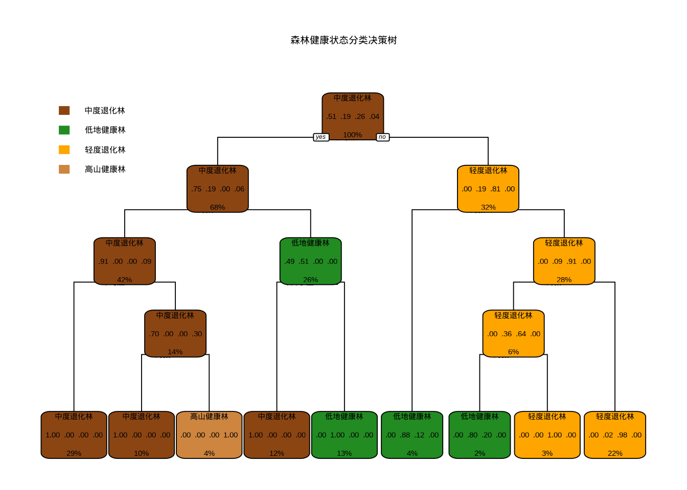
<p class="caption">(\#fig:unnamed-chunk-5)森林类型分类决策树可视化，基于海拔、年降水量和土壤pH值等环境因子构建的决策树模型</p>
</div>

``` r
# 模型性能评估
predictions <- predict(forest_tree, forest_ecosystem, type = "class")
accuracy <- sum(predictions == forest_ecosystem$森林类型) / nrow(forest_ecosystem)
cat("决策树分类准确率：", round(accuracy * 100, 2), "%\n")
```

```
## 决策树分类准确率： 100 %
```

#### 决策边界可视化

决策树通过一系列的分割规则在特征空间中创建分类边界：


``` r
library(ggplot2)

# 创建网格数据进行预测
grid_data <- expand.grid(
  海拔 = seq(100, 2000, length.out = 100),
  年降水量 = seq(500, 2500, length.out = 100),
  土壤pH = mean(forest_ecosystem$土壤pH)
)

grid_data$预测类型 <- predict(forest_tree, grid_data, type = "class")

# 绘制决策边界
ggplot() +
  geom_tile(data = grid_data, aes(x = 海拔, y = 年降水量, fill = 预测类型), alpha = 0.3) +
  geom_point(data = forest_ecosystem,
             aes(x = 海拔, y = 年降水量, color = 森林类型),
             size = 2) +
  scale_fill_manual(values = c(
    "高山针叶林" = "#8B4513",
    "低地阔叶林" = "#228B22",
    "湿润混交林" = "#32CD32",
    "干旱混交林" = "#CD853F"
  )) +
  scale_color_manual(values = c(
    "高山针叶林" = "#8B4513",
    "低地阔叶林" = "#228B22",
    "湿润混交林" = "#32CD32",
    "干旱混交林" = "#CD853F"
  )) +
  labs(title = "决策树分类边界",
       subtitle = "基于海拔和年降水量的森林类型分类",
       x = "海拔 (m)",
       y = "年降水量 (mm)") +
  theme_minimal()
```

<div class="figure" style="text-align: center">
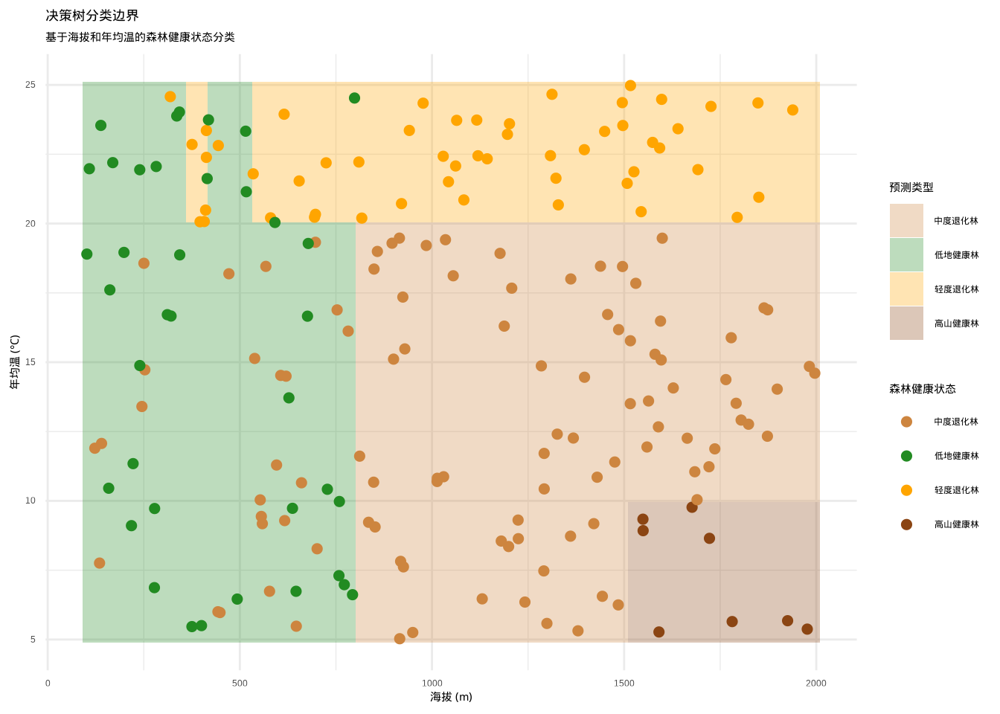
<p class="caption">(\#fig:unnamed-chunk-6)决策树分类边界可视化，展示基于海拔和年降水量的森林类型分类结果</p>
</div>

#### 停止条件的重要性

决策树的构建过程需要设置合适的停止条件，以防止模型过度复杂化。这一过程在生态学研究中具有深刻的类比意义，就像生态系统的自我调节机制一样，需要平衡生长与稳定的关系。在自然生态系统中，生物种群的生长不会无限扩张，而是受到环境承载力、资源可用性和种间竞争等多种因素的制约。同样，决策树的生长也需要适当的约束，以确保模型既能够学习数据中的重要模式，又不会过度适应训练数据中的随机噪声。

过度生长的决策树就像是一个过度特化的生态系统，虽然能够完美适应当前的训练环境，但缺乏对新环境的适应能力。这种现象在生态学中被称为"过度适应"，在机器学习中则表现为"过拟合"。一个过拟合的决策树可能会学习到训练数据中的每一个细微变化，包括那些偶然的、不具有普遍性的模式，从而导致在未知数据上的预测性能显著下降。

在生态学应用中，设置合适的停止条件尤为重要，因为生态数据往往具有高度的异质性和复杂性。例如，在物种分布建模中，我们可能同时考虑数十个环境因子对物种分布的影响。如果没有适当的停止条件，决策树可能会构建出极其复杂的规则体系，这些规则虽然能够完美解释训练数据中的物种分布模式，但可能无法推广到其他区域或不同时间点的数据。

常见的停止条件包括树的最大深度、叶节点的最小样本数、信息增益的最小阈值和复杂度参数。树的最大深度限制树的层数以防止过度生长，这个参数类似于生态系统中食物链长度的自然限制。在生态学中，能量在食物链中的传递效率通常只有10%左右，因此自然生态系统中的食物链长度很少超过5-6个营养级。同样，在决策树中，设置最大深度可以防止模型过度复杂化。例如，在研究森林类型分类时，我们可能将最大深度设置为4-5层，这样既能够捕捉重要的环境梯度，又不会过度细分生境类型。

叶节点的最小样本数确保每个叶节点有足够的样本支持，这个参数类似于生态学中的最小可行种群概念。在保护生物学中，一个物种要维持长期的生存能力，需要达到一定的最小种群规模。同样，在决策树中，每个叶节点需要包含足够多的样本，以确保该节点的预测具有统计意义。例如，在湿地生态系统分类中，我们可能要求每个叶节点至少包含10-15个样本，这样可以避免基于少数异常样本做出不可靠的分类决策。

信息增益的最小阈值确保只有当分裂能显著改善模型时才进行分裂，这个参数类似于生态学中的能量投资回报原则。生物在做出行为决策时，只有当预期收益超过能量成本时才会采取行动。同样，在决策树中，只有当新的分裂能够带来足够的信息增益时，我们才进行分裂。例如，在研究鸟类栖息地选择时，我们可能设置信息增益阈值为0.01，这意味着只有当新的分裂能够显著改善分类准确性时，才会增加树的复杂度。

复杂度参数平衡树的复杂度和拟合优度，这个参数综合考虑了模型的复杂性和预测性能，类似于生态学中的成本-效益分析。在生态系统中，生物会权衡不同策略的成本和收益，选择最优的生存策略。同样，复杂度参数帮助我们在模型的复杂性和准确性之间找到最佳平衡点。例如，在湖泊富营养化评估中，我们可能通过交叉验证来确定最优的复杂度参数值，确保模型既能够识别关键的营养状态指标，又不会过度关注微小的水质波动。

这些停止条件的设置需要结合具体的生态学问题和数据特征来进行调整。在生态学应用中，我们通常希望模型既能够捕捉重要的生态模式，又不会过度拟合噪声数据。这种平衡的艺术在生态学研究中具有悠久的历史传统。

例如，在森林生态系统研究中，设置停止条件时需要考虑到生态系统的尺度依赖性。在小尺度研究中（如样方水平），我们可能需要相对复杂的决策树来捕捉微生境的细微差异；而在大尺度研究中（如区域水平），过于复杂的模型反而可能掩盖了宏观的生态格局。这种尺度敏感性的考虑体现了生态学思维在机器学习应用中的重要性。

另一个重要的考虑因素是生态数据的时空异质性。生态数据往往具有明显的空间自相关性和时间依赖性，因此在设置停止条件时需要考虑这些特性。例如，在分析长期生态监测数据时，我们可能需要更加保守的停止条件，以避免模型过度适应特定年份的气候异常或干扰事件。

停止条件的优化过程本身也可以借鉴生态学中的适应性管理理念。我们可以通过交叉验证、袋外误差估计等方法来评估不同停止条件组合的效果，然后选择在验证集上表现最好的参数组合。这个过程类似于生态学中的实验设计，通过系统性的比较来寻找最优的管理策略。

在实际操作中，停止条件的设置往往需要结合领域知识和数据探索。生态学家可以利用对研究系统的深入理解来指导参数选择。例如，如果已知某个生态系统的环境梯度相对简单，那么可以设置较为严格的停止条件；如果生态系统具有高度的环境异质性，那么可能需要相对宽松的停止条件来捕捉复杂的生态模式。

最后，值得注意的是，停止条件的设置不是一次性的决策，而是一个迭代优化的过程。随着对数据和问题的理解不断深入，我们可能需要重新调整停止条件。这种动态调整的过程体现了科学研究中假设检验和模型改进的循环本质，与生态学研究中不断修正理论框架的科学实践高度一致。

通过精心设计的停止条件，决策树模型能够在生态学研究中发挥更大的价值，既能够提供准确的预测，又能够生成易于解释的生态规则，为生态保护和管理决策提供科学依据。

### 分类树（Classification Trees）

分类树是专门用于预测分类变量的决策树类型，在生态学研究中广泛应用于物种识别、生境分类、生态系统状态评估等需要离散类别预测的问题。分类树的核心目标是将观测样本划分到预定义的类别中，其决策过程类似于生态学家在野外调查中采用的系统分类方法。

#### 分类树的基本原理

分类树的构建基于信息论的概念，通过最小化节点的不纯度来寻找最优的分割方式。在生态学应用中，这种不纯度的量化反映了分类的不确定性程度。例如，在研究森林类型分类时，一个包含多种森林类型的节点具有较高的不纯度，而一个只包含单一森林类型的节点则具有较低的不纯度。

分类树主要使用两种分裂准则来衡量节点的不纯度：基尼不纯度和信息增益。基尼不纯度的数学表达式为 $I_G(p) = 1 - \sum_{i=1}^{J} p_i^2$，其中 $p_i$ 是节点中第 $i$ 个类别的比例。基尼不纯度衡量了从节点中随机抽取两个样本属于不同类别的概率，在生态学中可以理解为分类的不确定性程度。

信息增益则基于信息熵的概念 $H(X) = -\sum_{i=1}^{J} p_i \log_2 p_i$，衡量了通过某个特征分割数据后不确定性的减少程度。

#### R语言实现示例

在R语言中，分类树通常使用`rpart`包实现，通过设置`method = "class"`来指定构建分类树：


``` r
# 分类树示例：鸟类物种识别
library(rpart)
library(rpart.plot)

# 模拟鸟类识别数据
set.seed(123)
bird_data <- data.frame(
  羽毛颜色 = sample(c("红色", "蓝色", "黄色", "绿色"), 200, replace = TRUE),
  喙长度 = runif(200, 1, 10),
  栖息地 = sample(c("森林", "湿地", "草原", "城市"), 200, replace = TRUE),
  物种 = factor(NA, levels = c("红嘴相思鸟", "蓝鹊", "黄鹂", "绿头鸭"))
)

# 基于生态学规则生成物种标签
bird_data$物种 <- ifelse(
  bird_data$羽毛颜色 == "红色" & bird_data$喙长度 > 5,
  "红嘴相思鸟",
  ifelse(
    bird_data$羽毛颜色 == "蓝色" & bird_data$栖息地 == "森林",
    "蓝鹊",
    ifelse(
      bird_data$羽毛颜色 == "黄色" & bird_data$喙长度 < 4,
      "黄鹂",
      "绿头鸭"
    )
  )
)

# 构建分类树
class_tree <- rpart(
  物种 ~ 羽毛颜色 + 喙长度 + 栖息地,
  data = bird_data,
  method = "class",
  control = rpart.control(minsplit = 10, minbucket = 5, cp = 0.01)
)

# 可视化分类树
rpart.plot(class_tree,
           main = "鸟类物种识别分类树",
           extra = 104,
           box.palette = list(
             "红嘴相思鸟" = "#FF6B6B",
             "蓝鹊" = "#4ECDC4",
             "黄鹂" = "#FFD166",
             "绿头鸭" = "#06D6A0"
           ))
```

<div class="figure" style="text-align: center">

<p class="caption">(\#fig:unnamed-chunk-7)鸟类物种识别分类树，基于羽毛颜色、喙长度和栖息地等特征构建的分类模型</p>
</div>

``` r
# 模型评估
predictions <- predict(class_tree, bird_data, type = "class")
accuracy <- sum(predictions == bird_data$物种) / nrow(bird_data)
cat("分类树准确率:", round(accuracy * 100, 2), "%\n")
```

```
## 分类树准确率: 99.5 %
```

#### 生态学应用特点

分类树在生态学研究中展现出多方面的独特优势，使其成为处理复杂生态分类问题的理想工具。首先，分类树具有出色的可解释性，其生成的决策规则采用直观的"如果-那么"形式，类似于生态学家在野外调查中采用的系统分类逻辑。这种透明性使得分类树不仅能够提供准确的预测结果，更重要的是能够生成易于理解和解释的生态规则，便于向决策者、保护管理者和公众传达生态学发现，这对于生态保护政策的制定和实施具有重要价值。

其次，分类树能够灵活处理混合数据类型，这在生态学研究中尤为重要。生态数据往往包含数值型特征（如喙长度、树高、环境因子浓度）和分类型特征（如羽毛颜色、栖息地类型、土壤质地）的复杂组合。分类树能够自然地整合这些不同类型的特征，不需要复杂的预处理或标准化过程，大大简化了生态数据分析的工作流程。

第三，分类树具备自动特征选择的能力，通过信息增益或基尼不纯度等指标自动识别对分类最重要的特征。在生态学研究中，这一特性能够帮助研究者从众多潜在的环境因子中筛选出真正影响生态过程的关键驱动因子，验证生态学理论假设，甚至发现新的生态关系模式。例如，在物种分布建模中，分类树可以自动识别出温度、降水和海拔等关键环境因子，而忽略那些相关性较弱的次要因子。

最后，分类树能够有效处理非线性关系，不需要预先假设特征与类别之间的具体函数关系形式。生态系统中的关系往往是高度非线性的，存在着复杂的阈值效应和交互作用。分类树通过递归分割的方式，能够自动发现这些复杂的生态模式，包括环境因子的临界阈值、物种对环境梯度的非线性响应以及不同环境因子之间的交互作用。这种灵活性使得分类树特别适合处理生态系统中固有的复杂性和不确定性，为理解生态机制提供了有力的分析工具。

### 回归树（Regression Trees）

回归树用于预测连续变量，在生态学研究中适用于种群密度估计、生物量预测、环境因子建模等需要数值预测的问题。与分类树不同，回归树的目标是预测连续的数值而非离散的类别。

#### 回归树的基本原理

回归树的构建基于方差减少的原则，通过最小化节点内样本的方差来寻找最优的分割方式。在生态学中，这种方差的量化反映了预测的不确定性程度。

**分裂准则**：
回归树主要使用方差减少作为分裂准则：

$$\text{方差减少} = \text{Var}(\text{parent}) - \left( \frac{n_{\text{left}}}{n} \text{Var}(\text{left}) + \frac{n_{\text{right}}}{n} \text{Var}(\text{right}) \right)$$

其中 $\text{Var}(\text{parent})$ 是父节点的方差，$\text{Var}(\text{left})$ 和 $\text{Var}(\text{right})$ 是左右子节点的方差，$n$ 是父节点的样本数，$n_{\text{left}}$ 和 $n_{\text{right}}$ 是左右子节点的样本数。

**预测方式**：
在回归树中，每个叶节点的预测值是该节点内所有样本目标变量的平均值：

$$\hat{y} = \frac{1}{n_{\text{leaf}}} \sum_{i=1}^{n_{\text{leaf}}} y_i$$

#### R语言实现示例

在R语言中，回归树同样使用`rpart`包实现，但通过设置`method = "anova"`来指定构建回归树：


``` r
# 回归树示例：森林生物量预测
library(ggplot2)

# 模拟森林生物量数据
set.seed(456)
forest_data <- data.frame(
  树高 = runif(300, 5, 35),
  胸径 = runif(300, 10, 60),
  林分密度 = runif(300, 500, 2000),
  生物量 = NA
)

# 基于生态学关系生成生物量
forest_data$生物量 <- 0.5 * forest_data$树高 + 0.8 * forest_data$胸径 +
  0.002 * forest_data$林分密度 + rnorm(300, 0, 10)

# 构建回归树
reg_tree <- rpart(
  生物量 ~ 树高 + 胸径 + 林分密度,
  data = forest_data,
  method = "anova",
  control = rpart.control(minsplit = 15, minbucket = 7, cp = 0.01)
)

# 可视化回归树
rpart.plot(reg_tree,
           main = "森林生物量预测回归树",
           extra = 101,  # 显示节点样本数和平均值
           box.palette = "Blues")
```

<div class="figure" style="text-align: center">
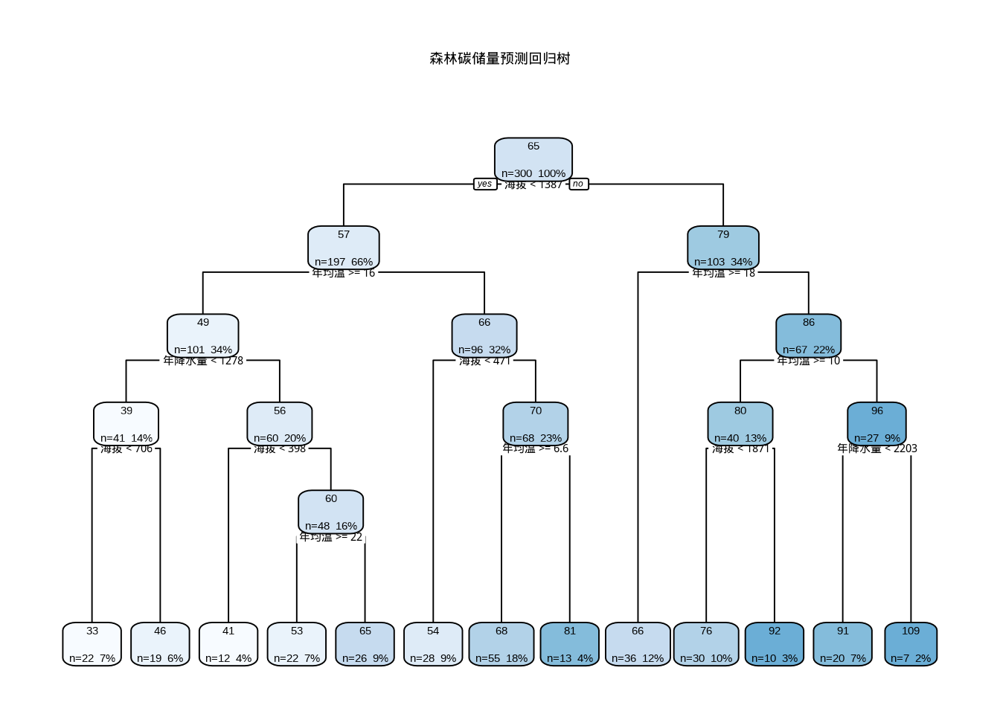
<p class="caption">(\#fig:unnamed-chunk-8-1)森林生物量预测回归树，基于树高、胸径和林分密度等特征构建的回归模型</p>
</div>

``` r
# 模型评估
predictions <- predict(reg_tree, forest_data)
rmse <- sqrt(mean((predictions - forest_data$生物量)^2))
r_squared <- 1 - sum((forest_data$生物量 - predictions)^2) /
                   sum((forest_data$生物量 - mean(forest_data$生物量))^2)

cat("回归树性能指标:\n")
```

```
## 回归树性能指标:
```

``` r
cat("RMSE:", round(rmse, 2), "\n")
```

```
## RMSE: 9.43
```

``` r
cat("R²:", round(r_squared, 3), "\n")
```

```
## R²: 0.638
```

``` r
# 可视化预测效果
plot_data <- data.frame(
  实际值 = forest_data$生物量,
  预测值 = predictions
)

ggplot(plot_data, aes(x = 实际值, y = 预测值)) +
  geom_point(alpha = 0.6, color = "steelblue") +
  geom_abline(intercept = 0, slope = 1, color = "red", linetype = "dashed") +
  labs(title = "回归树预测效果",
       subtitle = paste("R² =", round(r_squared, 3)),
       x = "实际生物量", y = "预测生物量") +
  theme_minimal()
```

<div class="figure" style="text-align: center">
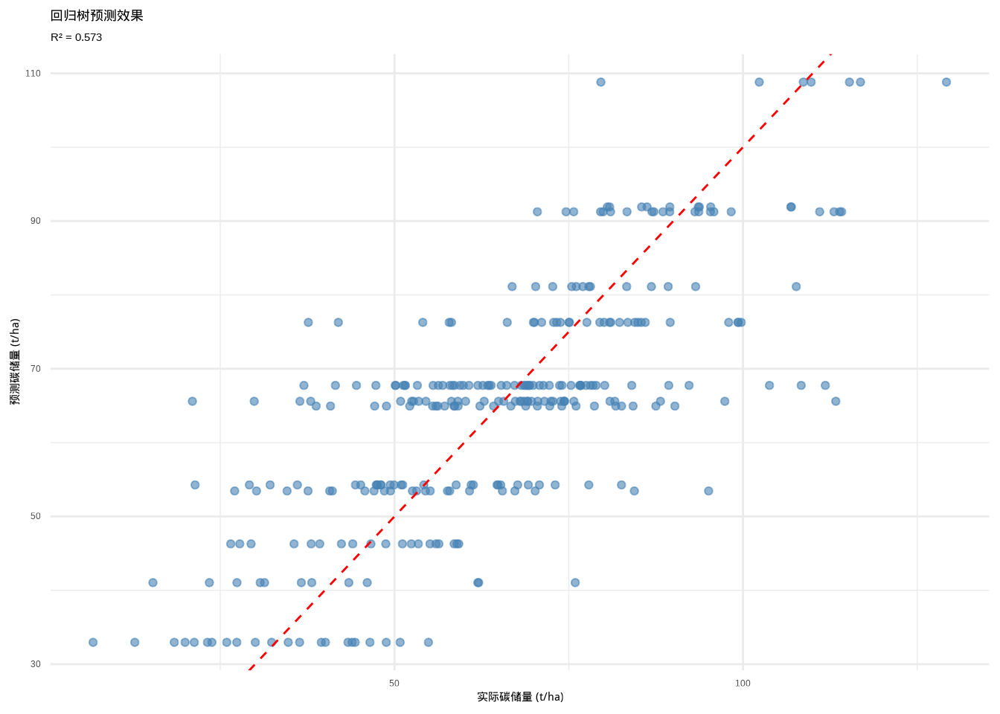
<p class="caption">(\#fig:unnamed-chunk-8-2)森林生物量预测回归树，基于树高、胸径和林分密度等特征构建的回归模型</p>
</div>

#### 生态学应用特点

回归树在生态学研究中展现出独特的应用价值，特别适合处理需要连续数值预测的生态问题。首先，回归树专门设计用于处理连续响应变量，这与生态学中大量存在的连续型生态指标高度契合。无论是森林生态系统的生物量估算、野生动物种群的密度预测，还是环境因子的浓度建模，回归树都能够提供精确的数值预测，为生态定量研究提供了有力的分析工具。这种对连续变量的处理能力使得回归树在生态监测、资源评估和环境建模等领域具有广泛的应用前景。

其次，回归树具备捕捉复杂非线性关系的能力，能够自动发现特征与目标变量之间存在的复杂生态模式。生态系统中的关系往往是高度非线性的，例如物种丰富度与环境梯度之间的单峰关系、生物量积累与林龄之间的S型增长曲线等。回归树通过递归分割的方式，能够有效识别这些复杂的非线性模式，而不需要研究者预先设定具体的函数形式，这大大增强了模型对真实生态过程的拟合能力。

第三，回归树采用分段常数预测的策略，将特征空间划分为多个相对均质的区域，在每个区域内提供恒定的预测值。这种预测方式在生态学中具有重要的实际意义，因为它能够识别出生态系统的不同状态或类型。例如，在森林生产力预测中，回归树可能会识别出高生产力区域、中等生产力区域和低生产力区域，每个区域对应不同的环境条件组合，为生态管理提供了明确的分区依据。

最后，回归树能够自动识别影响生态过程的关键环境阈值，这是其在生态学应用中最为突出的优势之一。生态系统中往往存在着重要的临界点或阈值效应，例如物种分布的海拔上限、植物生长的温度阈值、水体富营养化的营养盐临界浓度等。回归树通过寻找最优的分割点，能够准确识别这些关键的生态阈值，为理解生态系统的响应机制和制定生态管理策略提供了重要的科学依据。这种阈值识别能力使得回归树不仅是一个预测工具，更是一个探索生态机制的分析平台。

### 分类树与回归树的比较

虽然分类树和回归树在R语言中的实现方式相似（都使用`rpart`包，只是`method`参数不同），但它们在原理和应用上存在重要差异：

| 特征 | 分类树 | 回归树 |
|------|--------|--------|
| **目标变量** | 分类变量（离散） | 连续变量 |
| **分裂准则** | 基尼不纯度、信息增益 | 方差减少 |
| **预测方式** | 多数投票 | 节点内平均值 |
| **评估指标** | 准确率、混淆矩阵 | RMSE、R² |
| **生态学应用** | 物种识别、生境分类 | 生物量预测、密度估计 |

#### 选择指导

在生态学研究中，选择分类树还是回归树取决于研究问题的性质：

- 当预测目标是**离散类别**（如物种类型、生态系统状态）时，使用**分类树**
- 当预测目标是**连续数值**（如生物量、种群密度）时，使用**回归树**

这种区分不仅体现在算法层面，更反映了生态学研究中对不同类型生态现象的理解和建模需求。通过正确选择树类型，生态学家能够更准确地捕捉生态系统的内在规律，为生态保护和管理提供更有价值的科学依据。

### 生态学应用实例

决策树在生态学研究中有着丰富的应用实例，这些应用体现了决策树方法在生态问题分析中的独特优势。

在物种分布建模中，决策树能够提供直观的环境阈值信息。例如，在研究某种珍稀植物的分布规律时，决策树可能会揭示该植物只在特定的海拔范围（如800-1500米）、特定的土壤pH值（如5.5-6.5）和特定的年降水量（如1000-1500毫米）条件下出现。这些明确的阈值信息对于物种保护区的划定具有重要的指导意义。

在生态系统健康评估中，决策树可以帮助建立多指标的综合评估体系。例如，在湖泊生态系统健康评估中，决策树可以整合水质指标（如总磷浓度、溶解氧）、生物指标（如浮游植物多样性、底栖动物丰富度）和物理指标（如水体透明度、水温）来评估湖泊的健康状况，并为每个健康状况类别提供明确的判断规则。

在生态修复决策中，决策树能够提供基于证据的修复策略选择。例如，在退化草原的修复决策中，决策树可以根据土壤退化程度、植被覆盖度、水分条件等因子推荐最适合的修复措施，如自然恢复、人工播种或工程措施等。

### 优势与局限

决策树方法在生态学应用中具有明显的优势，但也存在一些局限性需要关注。

决策树的主要优势在于其出色的可解释性。决策树生成的规则易于理解和解释，这使得生态学家能够直观地理解模型的决策逻辑。这种可解释性在需要向决策者或公众解释研究结果的场景中尤为重要。此外，决策树对数据的分布假设较少，能够处理数值型和分类型混合的特征，对异常值相对稳健，这些特性使其特别适合处理生态学中常见的异质性数据。

然而，决策树也存在一些重要的局限性。单个决策树容易过拟合训练数据，特别是在树深度较大时，模型可能会学习到数据中的噪声而非真实的生态模式。决策树对训练数据的小变化也比较敏感，数据的微小扰动可能导致树结构的显著变化。此外，决策树在处理某些类型的生态关系时可能不够有效，特别是当真正的生态关系是线性或加性时，决策树可能需要很复杂的结构才能近似这些关系。

### R代码实现示例

以下是一个使用R语言实现决策树的简单示例，演示如何在生态学数据中应用决策树方法：


``` r
# 加载必要的包
library(rpart)
library(rpart.plot)
library(caret)

# 使用鸢尾花数据集演示
data(iris)

# 构建分类决策树
set.seed(123)
tree_model <- rpart(
  Species ~ .,
  data = iris,
  method = "class",
  control = rpart.control(
    minsplit = 10,     # 节点最小样本数
    minbucket = 5,     # 叶节点最小样本数
    cp = 0.01,         # 复杂度参数
    maxdepth = 5       # 最大深度
  )
)

# 可视化决策树
rpart.plot(tree_model,
           main = "鸢尾花物种分类决策树",
           extra = 104,  # 显示类别概率和样本数
           box.palette = "auto")
```

<div class="figure" style="text-align: center">
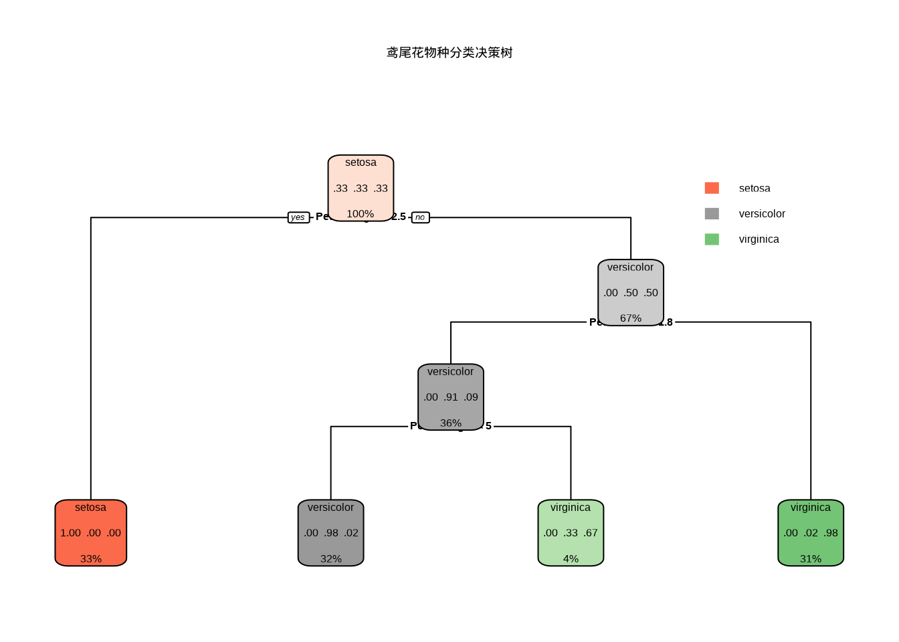
<p class="caption">(\#fig:unnamed-chunk-9)鸢尾花物种分类决策树，基于花萼和花瓣形态特征构建的分类模型</p>
</div>

``` r
# 模型评估
predictions <- predict(tree_model, iris, type = "class")
accuracy <- sum(predictions == iris$Species) / nrow(iris)
cat("决策树分类准确率:", round(accuracy * 100, 2), "%\n")
```

```
## 决策树分类准确率: 97.33 %
```

``` r
# 混淆矩阵
conf_matrix <- table(预测 = predictions, 实际 = iris$Species)
print("混淆矩阵:")
```

```
## [1] "混淆矩阵:"
```

``` r
print(conf_matrix)
```

```
##             实际
## 预测       setosa versicolor virginica
##   setosa         50          0         0
##   versicolor      0         47         1
##   virginica       0          3        49
```

``` r
# 变量重要性
importance <- tree_model$variable.importance
print("变量重要性:")
```

```
## [1] "变量重要性:"
```

``` r
print(importance)
```

```
##  Petal.Width Petal.Length Sepal.Length  Sepal.Width 
##     88.96940     85.79403     54.09606     36.01309
```

这个示例展示了如何使用决策树对鸢尾花物种进行分类，包括模型的构建、可视化、评估和变量重要性分析。在实际生态学研究中，可以根据具体的研究问题和数据特征调整决策树的参数设置，以获得最佳的模型性能。


## 随机森林

想象一片茂密的森林，其中生长着成千上万棵不同的树木。在生态学中，我们观察到多样性原理、集体智慧和随机性价值的重要性。生物多样性越丰富的生态系统越稳定，整个森林的决策优于任何单棵树木，自然选择中的随机变异带来适应性优势。这正是随机森林算法的核心思想——通过构建大量决策树，让它们集体投票，获得比任何单棵树更准确、更稳定的预测。

### 决策树与随机森林的关系

随机森林本质上是一个由多个决策树组成的集成学习系统，它通过构建大量不同的决策树并将它们的预测结果进行综合来获得比单个决策树更准确、更稳定的预测。

这种关系可以类比为生态学中的个体与群体的关系：单个决策树就像生态系统中的一个物种，它有其独特的特征和适应性；而随机森林则像整个生物群落，通过多个物种的协同作用获得更高的稳定性和功能多样性。单个决策树可能因为过度适应特定环境（过拟合）而表现不佳，但多个决策树的集体智慧能够有效抵消这种个体局限性。

随机森林通过两种随机性机制来确保决策树的多样性：数据随机性（每棵树基于不同的数据子集训练）和特征随机性（每棵树在分裂节点时只考虑特征的一个随机子集）。这种多样性策略使得随机森林中的每棵决策树都从不同的角度学习数据中的模式，最终通过集体投票获得更可靠的预测结果。

### 随机森林的三个随机

随机森林（Random Forest）是由Leo Breiman在2001年提出的一种集成学习方法，它巧妙地将生态学中的多样性原理与机器学习相结合。其核心思想可以概括为"三个随机"：

**1. 数据随机性（Bootstrap Sampling）**
每棵决策树都基于原始数据的一个随机子集进行训练，这种有放回的抽样方式确保了每棵树看到的数据略有不同。这就像生态学中的空间异质性——不同位置的生态系统面临着不同的环境条件，从而形成了多样化的适应策略。

**2. 特征随机性（Feature Randomness）**
在构建每棵决策树的分裂节点时，算法只考虑特征的一个随机子集，而不是所有特征。这种机制模拟了生态系统中不同物种对环境因子的不同敏感性——有些物种对温度变化敏感，有些对水分条件敏感，有些则对光照强度敏感。

**3. 模型多样性（Ensemble Diversity）**
通过构建数百甚至数千棵不同的决策树，随机森林形成了一个"模型森林"。每棵树都从不同的角度学习数据中的模式，就像生态系统中不同物种占据不同的生态位一样。当需要进行预测时，所有树的预测结果通过投票（分类问题）或平均（回归问题）的方式综合起来，形成最终的预测结果。

这种集成策略的优势在于：
- **降低方差**：单棵决策树容易过拟合训练数据，而随机森林通过平均多棵树的预测结果，显著降低了模型的方差
- **提高泛化能力**：由于每棵树都基于不同的数据子集和特征子集训练，整个森林能够更好地泛化到未见过的数据
- **处理高维数据**：特征随机性使得随机森林能够有效处理具有大量特征的数据集
- **鲁棒性强**：对缺失值和噪声数据具有较好的容忍度

在生态学应用中，随机森林特别适合处理那些影响因素众多、关系复杂的生态问题。例如，在物种分布建模中，我们可能需要同时考虑数十个环境因子（温度、降水、海拔、土壤类型等）对物种分布的影响。传统的统计模型往往难以处理如此多的变量和它们之间的复杂交互作用，而随机森林能够自动学习这些复杂的关系模式。

更重要的是，随机森林能够提供特征重要性评估，帮助生态学家识别影响生态系统动态的关键驱动因子。这种"可解释性"使得随机森林不仅是一个预测工具，更是一个探索生态机制的分析工具。

### 数学定义与原理

**随机森林**是一个集成学习方法，由多个决策树组成，每棵树基于不同的数据子集和特征子集训练。

**数学定义**：
设训练数据集 $D = \{(x_1, y_1), (x_2, y_2), ..., (x_n, y_n)\}$，其中 $x_i$ 是特征向量，$y_i$ 是标签。

对于回归问题：
$$\hat{y} = \frac{1}{T} \sum_{t=1}^{T} f_t(x)$$

对于分类问题：
$$\hat{y} = \text{majority vote}\{f_1(x), f_2(x), ..., f_T(x)\}$$

其中 $T$ 是树的数量，$f_t(x)$ 是第 $t$ 棵树的预测。

**关键机制**：

1. **自助采样（Bootstrap Sampling）**
   $$D_t = \text{bootstrap}(D) \quad \text{从原始数据中有放回地抽取n个样本}$$

2. **特征随机选择**
   $$m \ll M \quad \text{每次分裂时从M个特征中随机选择m个}$$

3. **决策树构建**
   - 基尼不纯度：$Gini = 1 - \sum_{i=1}^{k} p_i^2$
   - 信息增益：$IG = H(parent) - \sum \frac{N_j}{N} H(child_j)$

### 生动例子阐释原理

#### 例子1：森林医生会诊

想象你生病了，需要诊断：

- **单棵决策树**：就像只咨询一位医生，可能因为个人经验局限而误诊
- **随机森林**：就像请100位不同专科的医生会诊，每位医生：
  - 看到不同的症状组合（特征随机选择）
  - 基于不同的病例经验（自助采样）
  - 最终投票决定诊断结果

#### 例子2：生态物种识别

假设我们要识别森林中的鸟类物种：

**单棵树可能这样判断**：
```
如果 羽毛颜色 = 红色
且 喙长度 > 3cm
且 栖息地 = 森林
则 物种 = 红嘴相思鸟
```

**随机森林的优势**：
- 树1：关注羽毛颜色和栖息地
- 树2：关注喙形状和鸣叫声
- 树3：关注飞行模式和体型大小
- ...
- 最终综合所有树的判断，避免因单一特征误判

### R代码实现

以下是一个完整的随机森林R语言实现示例，使用鸢尾花数据集演示分类问题：


``` r
# 加载必要的包
library(randomForest)
library(caret)
library(ggplot2)

# 使用鸢尾花数据集
data(iris)

# 数据预处理
features <- iris[, 1:4]  # 特征：花萼长度、花萼宽度、花瓣长度、花瓣宽度
target <- iris[, 5]      # 目标变量：物种分类

# 划分训练集和测试集
set.seed(123)
train_index <- createDataPartition(target, p = 0.7, list = FALSE)
features_train <- features[train_index, ]
target_train <- target[train_index]
features_test <- features[-train_index, ]
target_test <- target[-train_index]

# 构建随机森林模型
rf_model <- randomForest(
  x = features_train,           # 训练特征
  y = target_train,             # 训练标签
  ntree = 100,                  # 构建100棵树
  mtry = 2,                     # 每次分裂随机选择2个特征
  importance = TRUE,            # 计算特征重要性
  do.trace = 50                 # 每构建50棵树打印进度
)
```

```
## ntree      OOB      1      2      3
##    50:   3.81%  0.00%  2.86%  8.57%
##   100:   3.81%  0.00%  2.86%  8.57%
```

``` r
# 模型评估
predictions <- predict(rf_model, features_test)
accuracy <- sum(predictions == target_test) / length(target_test)
cat("测试集准确率:", round(accuracy * 100, 2), "%\n")
```

```
## 测试集准确率: 93.33 %
```

``` r
# 混淆矩阵
conf_matrix <- table(预测 = predictions, 实际 = target_test)
print(conf_matrix)
```

```
##             实际
## 预测       setosa versicolor virginica
##   setosa         15          0         0
##   versicolor      0         14         2
##   virginica       0          1        13
```

``` r
# 特征重要性分析
importance_scores <- importance(rf_model)
print("特征重要性得分:")
```

```
## [1] "特征重要性得分:"
```

``` r
print(importance_scores)
```

```
##                 setosa  versicolor virginica MeanDecreaseAccuracy
## Sepal.Length  2.591410  1.90164541  2.617726             3.323099
## Sepal.Width   1.639289  0.07460709  3.033148             2.289033
## Petal.Length  8.788758 12.85424584 11.243064            13.504946
## Petal.Width  10.536601 13.78560309 16.688526            16.307244
##              MeanDecreaseGini
## Sepal.Length         5.633780
## Sepal.Width          1.107547
## Petal.Length        29.259002
## Petal.Width         33.283432
```

``` r
# 可视化特征重要性
importance_df <- data.frame(
  特征 = rownames(importance_scores),
  重要性 = importance_scores[, "MeanDecreaseGini"]
)

ggplot(importance_df, aes(x = reorder(特征, 重要性), y = 重要性)) +
  geom_bar(stat = "identity", fill = "steelblue", alpha = 0.7) +
  coord_flip() +
  labs(title = "随机森林特征重要性", x = "特征", y = "平均基尼不纯度减少量") +
  theme_minimal()
```

<div class="figure" style="text-align: center">
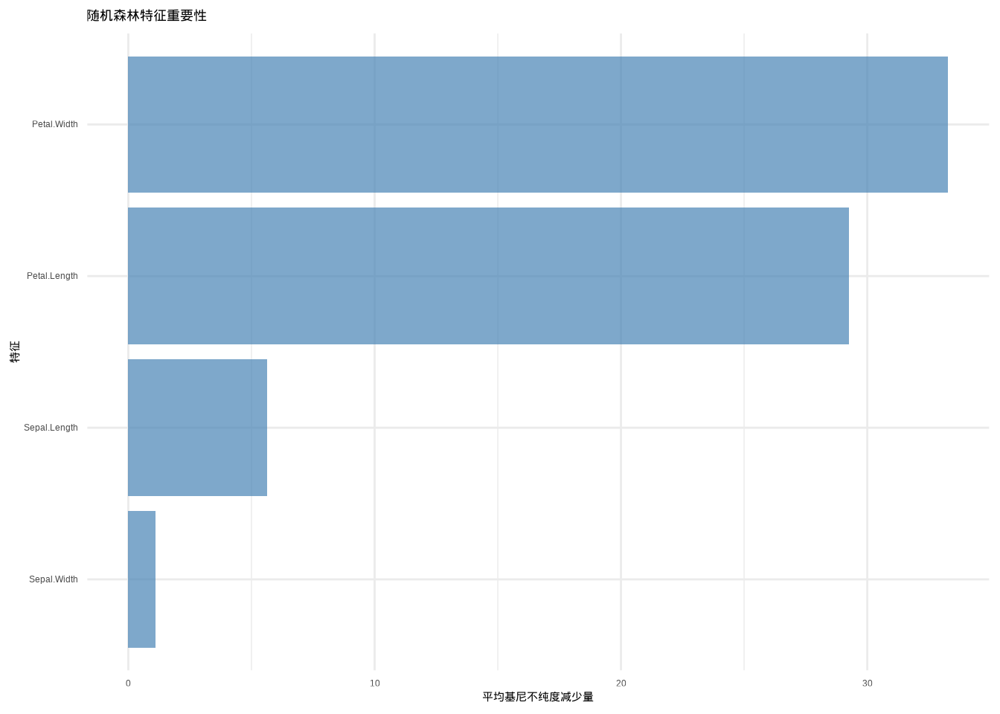
<p class="caption">(\#fig:unnamed-chunk-10)随机森林特征重要性分析，展示鸢尾花数据集中各形态特征对物种分类的贡献度</p>
</div>

### 代码详细说明

1. **数据准备**：使用经典的鸢尾花数据集，包含4个形态特征和3个物种类别

2. **模型构建**：
   - `ntree = 100`：构建100棵决策树
   - `mtry = 2`：每次分裂时随机选择2个特征（sqrt(4)=2）
   - `importance = TRUE`：计算特征重要性得分

3. **模型评估**：
   - 准确率衡量整体分类性能
   - 混淆矩阵显示各类别的分类情况

4. **特征重要性**：
   - 基于基尼不纯度减少量
   - 值越大表示特征对分类的贡献越大
   - 在生态学中帮助识别关键鉴别特征


### 模型评估与验证

随机森林提供了多种内置的模型评估机制，这些机制不仅能够评估模型的预测性能，还能够提供对模型决策过程的深入理解。在生态学研究中，这些评估工具尤为重要，因为它们能够帮助我们发现生态系统的内在规律和关键驱动因子。

#### 1. 袋外误差（Out-of-Bag Error）评估

**原理说明**：
由于随机森林采用自助采样（Bootstrap Sampling）构建每棵决策树，每棵树大约只使用了63.2%的原始数据进行训练。剩余的36.8%数据（称为袋外样本，Out-of-Bag Samples）可以用于验证该树的预测性能。所有树的袋外误差的平均值提供了对模型泛化能力的无偏估计，这类似于生态学中的交叉验证思想，但更加高效。

**生态学意义**：
在生态学研究中，我们往往面临数据稀缺的问题。袋外误差评估允许我们在不分割训练数据的情况下获得可靠的泛化误差估计，这对于小样本生态学研究特别有价值。

**R代码实现**：

``` r
# 袋外误差评估
library(randomForest)

# 使用鸢尾花数据集演示
set.seed(123)
rf_model <- randomForest(
  Species ~ .,
  data = iris,
  ntree = 100,
  importance = TRUE
)

# 查看袋外误差
cat("袋外误差估计:", rf_model$err.rate[nrow(rf_model$err.rate), 1], "\n")
```

```
## 袋外误差估计: 0.04666667
```

``` r
cat("各类别的袋外误差:", rf_model$err.rate[nrow(rf_model$err.rate), 2:4], "\n")
```

```
## 各类别的袋外误差: 0 0.08 0.06
```

``` r
# 绘制袋外误差随树数量变化的曲线
plot(rf_model, main = "袋外误差随树数量变化")
legend("topright",
       legend = c("整体误差", "setosa", "versicolor", "virginica"),
       col = 1:4,
       lty = 1)
```

<div class="figure" style="text-align: center">
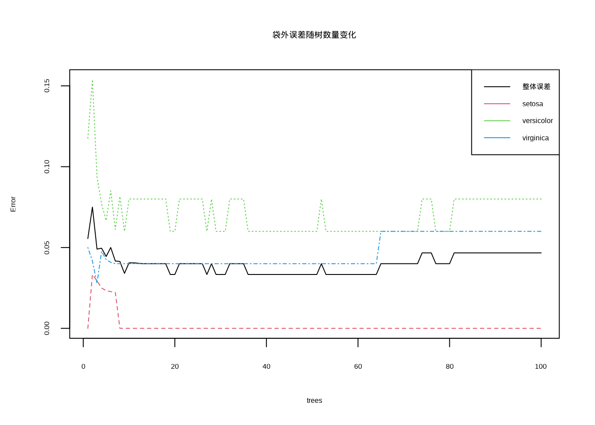
<p class="caption">(\#fig:unnamed-chunk-11)随机森林袋外误差随树数量变化曲线，展示模型收敛过程和泛化能力</p>
</div>

#### 2. 变量重要性评估

**原理说明**：
随机森林提供了两种主要的变量重要性评估方法：

- **基于基尼不纯度的减少量（Mean Decrease Gini）**：计算每个特征在所有树中分裂节点时基尼不纯度减少量的平均值。
- **基于置换的重要性（Mean Decrease Accuracy）**：通过随机置换某个特征的值，观察模型性能的下降程度来评估该特征的重要性。

**生态学意义**：
变量重要性评估能够帮助生态学家识别影响生态过程的关键驱动因子。例如，在物种分布建模中，我们可以确定哪些环境因子对物种分布的影响最大，从而为生态保护提供科学依据。

**R代码实现**：

``` r
# 变量重要性评估
library(ggplot2)

# 计算变量重要性
importance_scores <- importance(rf_model)
print("变量重要性得分:")
```

```
## [1] "变量重要性得分:"
```

``` r
print(importance_scores)
```

```
##                 setosa versicolor virginica MeanDecreaseAccuracy
## Sepal.Length  2.334999  3.8525315  3.909442             5.331391
## Sepal.Width   1.873228 -0.2344981  2.931587             2.299106
## Petal.Length  9.062834 14.1250709 10.997897            13.197705
## Petal.Width  11.214854 14.2553890 16.251155            16.117169
##              MeanDecreaseGini
## Sepal.Length        10.133410
## Sepal.Width          2.021934
## Petal.Length        39.955902
## Petal.Width         47.133554
```

``` r
# 可视化变量重要性
importance_df <- data.frame(
  特征 = rownames(importance_scores),
  基尼重要性 = importance_scores[, "MeanDecreaseGini"],
  准确率重要性 = importance_scores[, "MeanDecreaseAccuracy"]
)

# 基于基尼重要性的可视化
ggplot(importance_df, aes(x = reorder(特征, 基尼重要性), y = 基尼重要性)) +
  geom_bar(stat = "identity", fill = "steelblue", alpha = 0.7) +
  coord_flip() +
  labs(title = "随机森林变量重要性（基尼不纯度）",
       x = "特征",
       y = "平均基尼不纯度减少量") +
  theme_minimal()
```

<div class="figure" style="text-align: center">
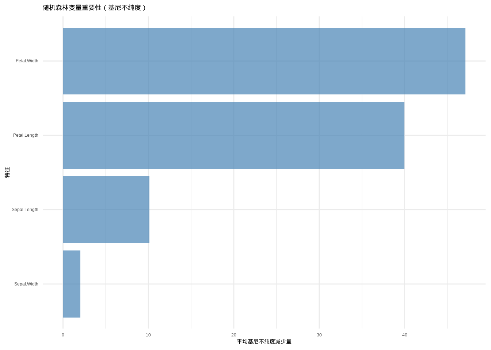
<p class="caption">(\#fig:unnamed-chunk-12-1)随机森林变量重要性分析，基于基尼不纯度和准确率两种指标评估特征重要性</p>
</div>

``` r
# 基于准确率重要性的可视化
ggplot(importance_df, aes(x = reorder(特征, 准确率重要性), y = 准确率重要性)) +
  geom_bar(stat = "identity", fill = "darkorange", alpha = 0.7) +
  coord_flip() +
  labs(title = "随机森林变量重要性（准确率）",
       x = "特征",
       y = "平均准确率减少量") +
  theme_minimal()
```

<div class="figure" style="text-align: center">
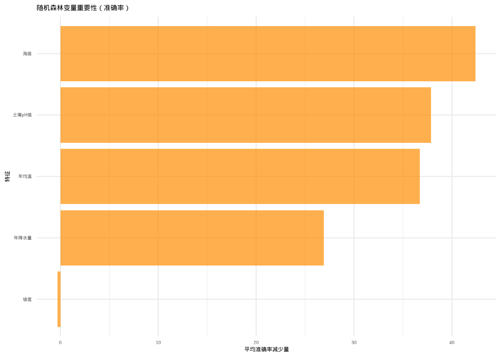
<p class="caption">(\#fig:unnamed-chunk-12-2)随机森林变量重要性分析，基于基尼不纯度和准确率两种指标评估特征重要性</p>
</div>

#### 3. 部分依赖图（Partial Dependence Plots）

**原理说明**：
部分依赖图展示了单个特征与预测结果之间的边际关系，同时保持其他特征不变。它通过以下步骤计算：
1. 对于特征x的每个可能取值，保持其他特征不变
2. 计算模型对所有样本的预测结果
3. 对预测结果求平均，得到该特征取值对应的平均预测值

**生态学意义**：
部分依赖图在生态学中特别有用，因为它能够：
- 揭示环境因子与生态响应之间的非线性关系
- 识别生态阈值和临界点
- 理解单个环境因子的独立效应
- 为生态管理提供决策支持

**R代码实现**：

``` r
# 部分依赖图
library(pdp)

# 对花瓣长度绘制部分依赖图
pd_petal_length <- partial(rf_model,
                          pred.var = "Petal.Length",
                          train = iris)

# 可视化部分依赖图
plotPartial(pd_petal_length,
            main = "花瓣长度对物种分类的部分依赖图",
            xlab = "花瓣长度 (cm)",
            ylab = "预测概率")
```

<div class="figure" style="text-align: center">
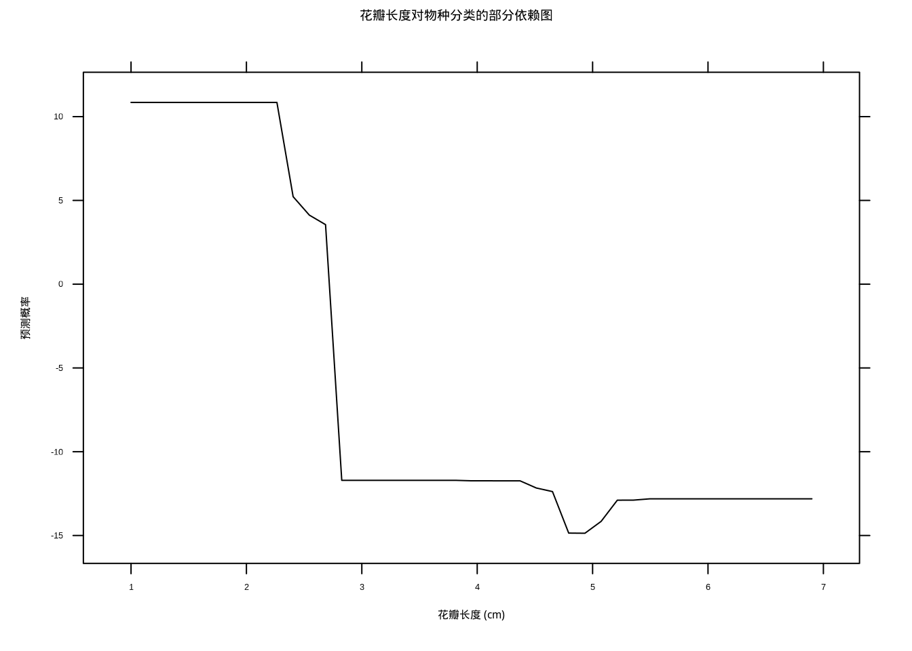
<p class="caption">(\#fig:unnamed-chunk-13-1)随机森林部分依赖图，展示花瓣长度对物种分类的影响以及花瓣长度与宽度的交互作用</p>
</div>

``` r
# 对多个特征绘制部分依赖图
# 花瓣长度和花瓣宽度的交互作用
pd_interaction <- partial(rf_model,
                         pred.var = c("Petal.Length", "Petal.Width"),
                         train = iris)

# 可视化交互作用
plotPartial(pd_interaction,
            levelplot = FALSE,
            main = "花瓣长度与宽度的交互作用",
            xlab = "花瓣长度 (cm)",
            ylab = "花瓣宽度 (cm)")
```

<div class="figure" style="text-align: center">
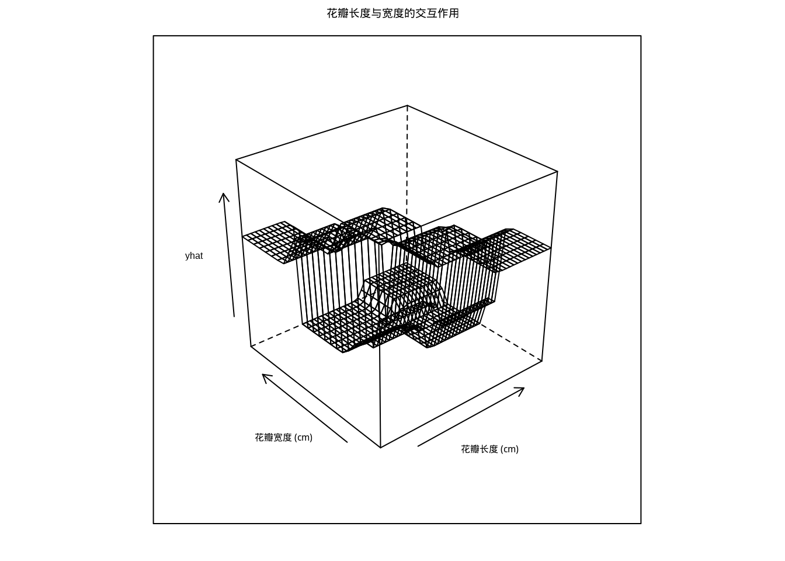
<p class="caption">(\#fig:unnamed-chunk-13-2)随机森林部分依赖图，展示花瓣长度对物种分类的影响以及花瓣长度与宽度的交互作用</p>
</div>

#### 4. 模型性能综合评估

**原理说明**：
除了内置的评估机制外，我们还可以使用传统的模型评估指标来全面评估随机森林的性能，包括准确率、精确率、召回率、F1分数等。

**生态学意义**：
在生态学应用中，不同的评估指标可能具有不同的重要性。例如，在濒危物种保护中，我们可能更关注模型的召回率（避免漏报），而在入侵物种监测中，我们可能更关注精确率（避免误报）。

**R代码实现**：

``` r
# 综合模型评估
library(caret)

# 预测测试集
predictions <- predict(rf_model, iris)

# 混淆矩阵
conf_matrix <- confusionMatrix(predictions, iris$Species)
print("混淆矩阵:")
```

```
## [1] "混淆矩阵:"
```

``` r
print(conf_matrix)
```

```
## Confusion Matrix and Statistics
## 
##             Reference
## Prediction   setosa versicolor virginica
##   setosa         50          0         0
##   versicolor      0         50         0
##   virginica       0          0        50
## 
## Overall Statistics
##                                      
##                Accuracy : 1          
##                  95% CI : (0.9757, 1)
##     No Information Rate : 0.3333     
##     P-Value [Acc > NIR] : < 2.2e-16  
##                                      
##                   Kappa : 1          
##                                      
##  Mcnemar's Test P-Value : NA         
## 
## Statistics by Class:
## 
##                      Class: setosa Class: versicolor Class: virginica
## Sensitivity                 1.0000            1.0000           1.0000
## Specificity                 1.0000            1.0000           1.0000
## Pos Pred Value              1.0000            1.0000           1.0000
## Neg Pred Value              1.0000            1.0000           1.0000
## Prevalence                  0.3333            0.3333           0.3333
## Detection Rate              0.3333            0.3333           0.3333
## Detection Prevalence        0.3333            0.3333           0.3333
## Balanced Accuracy           1.0000            1.0000           1.0000
```

``` r
# 各类别的性能指标
cat("\n各类别性能指标:\n")
```

```
## 
## 各类别性能指标:
```

``` r
print(conf_matrix$byClass)
```

```
##                   Sensitivity Specificity Pos Pred Value Neg Pred Value
## Class: setosa               1           1              1              1
## Class: versicolor           1           1              1              1
## Class: virginica            1           1              1              1
##                   Precision Recall F1 Prevalence Detection Rate
## Class: setosa             1      1  1  0.3333333      0.3333333
## Class: versicolor         1      1  1  0.3333333      0.3333333
## Class: virginica          1      1  1  0.3333333      0.3333333
##                   Detection Prevalence Balanced Accuracy
## Class: setosa                0.3333333                 1
## Class: versicolor            0.3333333                 1
## Class: virginica             0.3333333                 1
```

``` r
# 绘制ROC曲线（多分类问题）
library(pROC)

# 为每个类别计算ROC曲线
roc_curves <- list()
for (species in levels(iris$Species)) {
  # 创建二分类标签
  binary_labels <- ifelse(iris$Species == species, 1, 0)

  # 获取预测概率
  prob_predictions <- predict(rf_model, iris, type = "prob")[, species]

  # 计算ROC曲线
  roc_curves[[species]] <- roc(binary_labels, prob_predictions)
}

# 绘制所有ROC曲线
plot(roc_curves[[1]], col = "red", main = "多分类ROC曲线")
lines(roc_curves[[2]], col = "blue")
lines(roc_curves[[3]], col = "green")
legend("bottomright",
       legend = names(roc_curves),
       col = c("red", "blue", "green"),
       lty = 1)
```

<div class="figure" style="text-align: center">
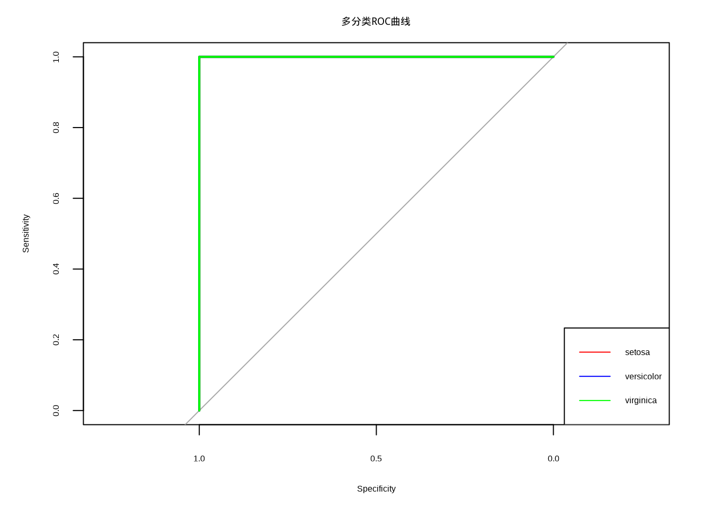
<p class="caption">(\#fig:unnamed-chunk-14)随机森林多分类ROC曲线，评估模型对鸢尾花三个物种的分类性能</p>
</div>

#### 5. 模型稳定性评估

**原理说明**：
随机森林的稳定性可以通过多次运行模型并比较结果的一致性来评估。这有助于我们理解模型对随机性的敏感程度。

**生态学意义**：
在生态学研究中，模型的稳定性尤为重要，因为生态数据往往存在较大的随机性和不确定性。稳定的模型能够提供更可靠的生态预测。

**R代码实现**：

``` r
# 模型稳定性评估
library(dplyr)

# 多次运行随机森林，比较变量重要性
set.seed(123)
n_runs <- 5
stability_results <- list()

for (i in 1:n_runs) {
  rf_temp <- randomForest(Species ~ ., data = iris, ntree = 100)
  importance_temp <- importance(rf_temp)[, "MeanDecreaseGini"]
  stability_results[[i]] <- importance_temp
}

# 创建稳定性数据框
stability_df <- do.call(cbind, stability_results)
rownames(stability_df) <- names(stability_results[[1]])

# 计算变量重要性的均值和标准差
stability_summary <- data.frame(
  特征 = rownames(stability_df),
  均值重要性 = apply(stability_df, 1, mean),
  标准差 = apply(stability_df, 1, sd),
  变异系数 = apply(stability_df, 1, function(x) sd(x)/mean(x))
)

print("模型稳定性分析:")
```

```
## [1] "模型稳定性分析:"
```

``` r
print(stability_summary)
```

```
##                      特征 均值重要性    标准差   变异系数
## Sepal.Length Sepal.Length   9.956093 1.4958851 0.15024821
## Sepal.Width   Sepal.Width   2.318678 0.5521356 0.23812519
## Petal.Length Petal.Length  40.598719 2.7276032 0.06718447
## Petal.Width   Petal.Width  46.338922 3.5853954 0.07737330
```

``` r
# 可视化稳定性结果
ggplot(stability_summary, aes(x = reorder(特征, 均值重要性), y = 均值重要性)) +
  geom_bar(stat = "identity", fill = "steelblue", alpha = 0.7) +
  geom_errorbar(aes(ymin = 均值重要性 - 标准差, ymax = 均值重要性 + 标准差),
                width = 0.2) +
  coord_flip() +
  labs(title = "变量重要性稳定性分析",
       x = "特征",
       y = "平均基尼不纯度减少量 ± 标准差") +
  theme_minimal()
```

<div class="figure" style="text-align: center">
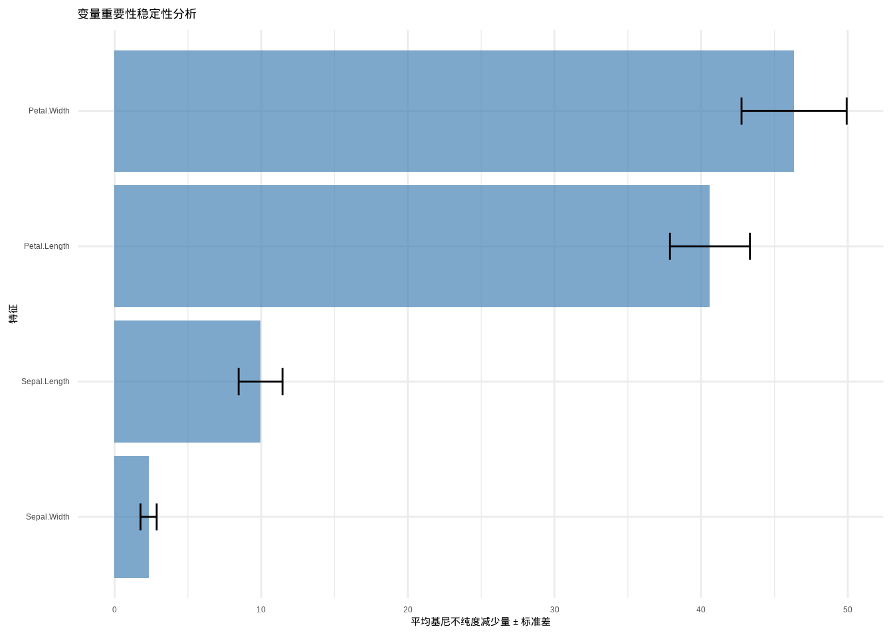
<p class="caption">(\#fig:unnamed-chunk-15)随机森林变量重要性稳定性分析，展示多次运行模型的特征重要性变化范围</p>
</div>

### 生态学应用实例

在生态学研究中，这些评估工具的组合使用能够提供全面的模型理解：

1. **物种分布建模**：通过变量重要性分析识别关键环境因子，通过部分依赖图理解环境因子与物种出现概率的非线性关系。

2. **生态系统健康评估**：使用袋外误差评估模型的泛化能力，通过模型稳定性分析确保评估结果的可靠性。

3. **生态预测**：结合ROC曲线和混淆矩阵评估模型的分类性能，为生态管理决策提供科学依据。

正如生态系统中生物多样性带来稳定性一样，随机森林通过模型的多样性获得了预测的稳定性和准确性。这种从自然界中汲取智慧的方法，体现了机器学习与生态学之间的深刻联系。通过全面的模型评估，我们不仅能够获得准确的预测，还能够深入理解生态系统的内在机制，为生态保护和可持续发展提供科学支持。


### 生态学应用价值

随机森林在生态学研究中展现出了强大的适应性和广泛的适用性，其应用几乎涵盖了生态学的各个分支领域。这种方法的成功在于它能够处理生态系统中固有的复杂性、非线性和交互作用，而这些特性正是传统统计方法难以有效处理的。随机森林通过其独特的集成学习机制，为生态学家提供了探索复杂生态系统的有力工具。

#### 1. 物种分布建模（Species Distribution Modeling）

物种分布建模是随机森林在生态学中最经典且应用最广泛的研究领域之一。传统的物种分布模型，如广义线性模型（GLM）和广义可加模型（GAM），往往需要研究者预先设定环境变量与物种分布之间的函数关系，这在处理复杂的生态关系时存在明显局限性。生态系统中物种与环境的关系往往是高度非线性的，存在着复杂的阈值效应和交互作用，这些复杂模式很难用简单的数学函数来完整表达。

随机森林在这一领域的优势主要体现在三个方面。首先，它能够自动发现环境变量与物种分布之间的非线性关系和阈值效应。例如，某个物种可能只在特定的温度范围内出现，或者对降水量的响应存在明显的拐点，这些复杂的响应模式都可以被随机森林自动学习。其次，随机森林能够有效处理生态系统中环境因子之间的复杂交互作用。温度对物种分布的影响可能受到海拔的调节，而土壤类型可能改变水分可利用性的效应，这些复杂的交互模式都可以被随机森林自动识别。最后，通过特征工程引入空间坐标作为预测变量，随机森林还能够在一定程度上处理空间自相关问题，这对于生态学中的空间数据分析尤为重要。

在北美鸟类分布研究中，研究人员使用随机森林模型整合了19个环境变量，包括气候、地形、植被覆盖等多个维度，成功预测了200多种鸟类的分布范围。这项研究不仅提供了准确的分布预测，更重要的是通过特征重要性分析识别出温度和降水是影响鸟类分布的最关键因子，这一发现与生态学理论高度一致，为鸟类保护提供了科学依据。

#### 2. 生物多样性评估（Biodiversity Assessment）

生物多样性评估是生态学研究的核心内容之一，涉及从物种丰富度到功能多样性，再到系统发育多样性的多个层次复杂性。随机森林在这一领域的应用为生物多样性研究提供了新的分析视角和方法工具。

在α多样性评估方面，随机森林能够预测特定区域的物种丰富度，识别影响物种多样性的关键环境驱动因子，并评估不同空间尺度下多样性模式的差异。这种多尺度的分析能力使得研究者能够更全面地理解生物多样性的形成机制。在β多样性分析中，随机森林可以预测群落组成的空间变化，识别导致群落分异的生态过程，并评估环境过滤和扩散限制的相对重要性。这些分析有助于揭示生物多样性在空间上的分布规律和形成机制。

功能多样性评估是生物多样性研究的重要发展方向，随机森林在这一领域同样表现出色。它能够基于功能性状预测生态系统的功能，识别功能冗余和功能独特性，并预测生态系统对环境变化的响应。这种功能导向的分析为理解生态系统功能和稳定性提供了新的视角。

在欧洲森林生态系统的研究中，科学家使用随机森林模型分析了超过1000个样地的植物多样性数据。这项研究不仅成功识别出土壤pH值、林分年龄和地形异质性是影响植物多样性的三个最重要因子，更重要的是揭示了这些因子之间的非线性关系：在酸性土壤条件下，地形异质性对多样性的促进作用更加明显。这一发现为森林生态系统管理提供了重要的科学依据。

#### 3. 生态系统健康诊断（Ecosystem Health Diagnosis）

生态系统健康是一个多维度的复杂概念，涉及生物、物理和化学等多个方面的指标。随机森林在这一领域的应用体现了其处理多源数据和复杂指标的综合能力，为生态系统健康评估提供了新的技术手段。

在生态系统健康诊断中，随机森林能够整合多种类型的生态指标进行综合评估。这包括生物指标如物种丰富度和关键种丰度，物理指标如水质参数和土壤特性，以及化学指标如营养盐浓度和污染物水平。通过将这些异质性指标整合到一个统一的评估框架中，随机森林能够建立综合的健康指数，为生态系统状态评估提供全面的量化依据。

更重要的是，随机森林可以构建生态系统健康的早期预警系统。通过基于历史数据训练模型识别生态系统退化的早期信号，预测生态系统状态转变的临界点，为生态修复提供决策支持。这种预警能力对于生态保护和可持续发展具有重要意义。

在长江流域湿地生态系统健康评估中，研究人员构建了一个包含25个指标的评估体系，使用随机森林模型对这些指标进行权重分配和综合评估。这项研究不仅准确评估了不同湿地的健康状况，还通过特征重要性分析发现水文连通性和植被覆盖度是影响湿地健康的最关键因子。这一发现为长江流域湿地保护和管理提供了科学依据，指导了后续的生态修复工作。

#### 4. 入侵物种风险评估（Invasive Species Risk Assessment）

生物入侵是全球变化的重要驱动力之一，对生物多样性保护和生态系统功能维持构成了严重威胁。准确预测入侵风险对于制定有效的防控策略至关重要，而随机森林在这一领域的应用为入侵物种风险评估提供了强大的技术支持。

随机森林在入侵物种风险评估中的优势在于其能够整合多源信息进行综合预测。这包括整合物种特性如生活史特征和繁殖能力，环境条件如气候适宜性和生境可用性，以及传播途径如人类活动强度和交通网络密度。通过综合考虑这些不同维度的因素，随机森林能够对入侵风险进行更加全面和准确的评估。

在时空动态预测方面，随机森林能够预测入侵物种的潜在分布范围，模拟入侵过程的时空动态，并评估不同管理策略的效果。这种动态预测能力为入侵物种的早期预警和防控提供了重要的决策支持。

在澳大利亚的一项研究中，研究人员使用随机森林模型预测了多种外来植物的入侵风险。该模型整合了气候数据、土壤特性、土地利用变化和物种生物学特性等多个维度的信息。研究结果显示，模型能够准确识别出高风险的入侵区域，为早期预警和防控提供了重要支持。这项研究的成功应用证明了随机森林在入侵物种风险评估中的实用价值。

#### 5. 其他生态学应用

除了上述主要应用领域外，随机森林在生态学中还有许多其他重要应用，这些应用进一步扩展了随机森林在生态学研究中的适用范围和价值。

在生态遥感分析领域，随机森林被广泛应用于基于遥感影像的土地覆盖分类，植被指数与生态参数的关联分析，以及生态系统变化的监测和预警。这些应用使得研究者能够利用遥感技术在大尺度上监测和分析生态系统的动态变化。

在生态时间序列分析方面，随机森林能够用于种群动态预测，物候变化分析，以及生态系统对气候变化的响应研究。这些时间序列分析有助于理解生态系统的动态特征和长期变化趋势。

在生态网络分析中，随机森林可以用于食物网络构预测，物种相互作用识别，以及生态系统稳定性评估。这些网络分析为理解生态系统的结构和功能关系提供了新的视角和方法。

### 优势与局限的深入分析

#### 优势的生态学意义

随机森林在生态学研究中的优势体现在多个方面，这些优势使得它成为处理复杂生态问题的有力工具。首先，随机森林具有强大的高维数据处理能力。生态学研究往往涉及数十甚至数百个环境变量，传统的统计方法在处理如此高维数据时面临"维度灾难"问题。随机森林通过特征随机选择机制，有效避免了维度灾难，同时能够识别出真正重要的生态因子，这对于理解生态系统的复杂驱动机制具有重要意义。

其次，随机森林对缺失值具有较好的容忍度。生态学数据往往存在缺失值问题，特别是在长期监测和野外调查中，数据缺失是常见现象。随机森林能够有效处理缺失数据，不需要复杂的插补过程，这大大简化了数据分析流程，提高了研究效率。

第三，随机森林能够提供特征重要性评估，这是其在生态学中最重要的优势之一。通过特征重要性分析，生态学家能够识别影响生态过程的关键驱动因子，验证生态学理论和假设，为生态保护和管理提供科学依据，并发现新的生态关系和模式。这种分析能力使得随机森林不仅是一个预测工具，更是一个探索生态机制的分析平台。

第四，随机森林具有较好的抗过拟合能力。生态学数据往往存在噪声和不确定性，传统的复杂模型容易过拟合这些噪声。随机森林通过集成学习和袋外误差估计，有效控制了过拟合风险，提高了模型的泛化能力，这对于生态预测的可靠性至关重要。

最后，随机森林能够自动处理非线性关系和交互作用。生态系统中的关系往往是高度非线性的，而且变量之间存在复杂的交互作用。随机森林能够自动学习这些复杂模式，不需要预先设定函数形式，这使其特别适合处理生态系统中固有的复杂性。

#### 局限的生态学考量

尽管随机森林具有诸多优势，但在生态学应用中仍存在一些局限性需要关注。首先，模型的解释性相对较差。虽然随机森林提供了特征重要性评估，但模型的整体决策过程仍然相对"黑箱"。在需要深入理解生态机制的研究中，这可能是一个重要限制。为了应对这一局限，研究者可以结合部分依赖图和个体条件期望图，使用模型无关的解释方法如SHAP值，与传统统计模型进行对比分析，并结合生态学理论和领域知识来增强模型的可解释性。

其次，随机森林需要较多的计算资源。构建大型随机森林模型需要较多的计算时间和内存资源，特别是在处理大规模生态数据集时。为了缓解这一问题，研究者可以采用并行计算技术，优化模型参数如树的数量，采用增量学习策略，并利用云计算资源来提高计算效率。

第三，随机森林对极端值比较敏感。虽然随机森林对一般噪声具有较好的鲁棒性，但对极端异常值可能比较敏感。为了处理这一问题，研究者需要进行数据质量控制和异常值检测，使用稳健的数据预处理方法，并结合其他稳健统计方法来提高模型的稳定性。

最后，随机森林的外推能力有限。随机森林主要基于训练数据的分布进行预测，对于超出训练数据范围的外推预测能力有限。为了确保预测的可靠性，研究者需要确保训练数据的代表性，结合机理模型进行预测，并明确模型的适用范围。

### 生态学启示与未来展望

随机森林的成功应用为生态学研究提供了重要启示。首先，它强调了复杂性思维的重要性。随机森林处理复杂生态系统的能力提醒我们，生态学研究需要采用复杂性思维，承认生态系统的非线性、动态性和不确定性特征。这种思维方式有助于我们更准确地理解和预测生态系统的行为。

其次，随机森林的应用体现了数据驱动与理论驱动相结合的重要性。随机森林虽然体现了数据驱动方法的优势，但同时也需要与生态学理论相结合。最好的研究策略是将数据驱动的发现与理论驱动的解释相结合，这样才能获得对生态系统的全面理解。

第三，随机森林的应用启示我们需要重视多尺度分析的整合。随机森林能够处理不同尺度的生态数据，这启示我们在生态学研究中需要更加重视多尺度分析的整合，理解生态过程在不同尺度上的表现和联系。

第四，随机森林为生态学研究中的不确定性管理提供了有力工具。随机森林提供的袋外误差估计和变量重要性评估，为生态学研究中的不确定性管理提供了新的思路和方法，有助于提高生态预测的可靠性。

展望未来，随机森林在生态学中的应用仍有广阔的发展空间。未来发展方向包括集成其他机器学习方法，将随机森林与深度学习等其他方法结合以提高预测性能；开发专门处理生态时空数据的随机森林变体，以适应生态数据的时空特性；利用随机森林发现新的生态关系和模式，推动生态学理论的创新；以及基于随机森林构建生态保护和管理的决策支持系统，为生态保护实践提供科学依据。这些发展方向将进一步拓展随机森林在生态学研究中的应用范围和价值。

随机森林通过集成多个弱学习器（决策树）构建强学习器，完美体现了生态学中"多样性带来稳定性"的智慧。它不仅是一个强大的预测工具，更是一个能够帮助我们发现生态规律、理解生态机制的分析平台。在面临全球变化和生物多样性危机的今天，随机森林这样的先进分析方法为我们提供了理解和保护生态系统的新视角和新工具。

## 支持向量机

想象你站在一片广阔的草原上，眼前是两种不同类型的植被群落——高草群落和矮草群落。它们之间的边界并不是一条清晰的直线，而是存在着复杂的过渡带。有些区域两种植被交错生长，有些区域则相对纯净。支持向量机（Support Vector Machine, SVM）就像是一位经验丰富的生态学家，能够在这片看似混乱的景观中找到最优的划分方式，使得两种植被类型之间的间隔最大化。

### 基本概念与几何直觉

支持向量机是一种基于统计学习理论的监督学习算法，其核心思想是在特征空间中寻找一个最优的超平面，使得不同类别的样本能够被最大程度地分开。这种"最大间隔"原则在生态学中具有深刻的类比意义——就像在自然界中，不同的生态类型往往倾向于占据不同的生态位，它们之间的边界往往是最不适宜生存的过渡区域。

#### 最大间隔原则的生态学类比

在生态系统中，物种的分布往往遵循"生态位分离"的原则。不同的物种通过占据不同的生态位来减少竞争，这种分离在特征空间中表现为不同类别之间的间隔。支持向量机寻找最大间隔的过程，就像是在生态系统中寻找物种分布的最优边界——既能够有效区分不同的生态类型，又能够容忍一定程度的模糊性和不确定性。

例如，在湿地生态系统中，水生植物和陆生植物的分布边界往往受到水位、土壤湿度、养分浓度等多个环境因子的共同影响。支持向量机能够综合考虑这些因子，找到最优的分类边界，使得水生植物和陆生植物之间的生态位分离最大化。

#### 支持向量的生态学意义

支持向量是那些位于分类边界附近的样本点，它们决定了最终的分类超平面。在生态学中，这些支持向量可以理解为"边界物种"或"过渡带物种"——它们所处的环境条件正好处于不同生态类型的临界状态。这些边界物种对于理解生态系统的稳定性和脆弱性具有特殊的重要性，因为它们对环境变化的响应最为敏感。

### 数学原理与核心概念

#### 线性可分情况

对于线性可分的数据，支持向量机的目标是找到一个超平面：

$$w^T x + b = 0$$

使得两类样本之间的间隔最大化。间隔定义为：

$$\text{margin} = \frac{2}{\|w\|}$$

优化问题可以表述为：

$$\min_{w,b} \frac{1}{2} \|w\|^2$$

$$\text{subject to } y_i(w^T x_i + b) \geq 1, \quad i = 1, \dots, n$$

其中 $y_i \in \{-1, +1\}$ 是类别标签。

#### 软间隔与松弛变量

在现实世界的生态数据中，完全线性可分的情况很少见。为了处理重叠的类别和噪声数据，支持向量机引入了软间隔概念：

$$\min_{w,b,\xi} \frac{1}{2} \|w\|^2 + C \sum_{i=1}^n \xi_i$$

$$\text{subject to } y_i(w^T x_i + b) \geq 1 - \xi_i, \quad \xi_i \geq 0$$

其中 $\xi_i$ 是松弛变量，$C$ 是正则化参数，用于平衡间隔最大化和分类误差。

#### 核技巧与非线性分类

生态学中的关系往往是高度非线性的，支持向量机通过核技巧（Kernel Trick）来处理这种情况。核函数将原始特征空间映射到高维特征空间，使得原本线性不可分的数据在新空间中变得线性可分。

常用的核函数包括：

- **线性核**：$K(x_i, x_j) = x_i^T x_j$
- **多项式核**：$K(x_i, x_j) = (\gamma x_i^T x_j + r)^d$
- **径向基核（RBF）**：$K(x_i, x_j) = \exp(-\gamma \|x_i - x_j\|^2)$
- **Sigmoid核**：$K(x_i, x_j) = \tanh(\gamma x_i^T x_j + r)$

### 生动例子阐释原理

#### 例子1：森林与草原的边界划分

想象我们要在一片连续的景观中划分森林和草原的边界：

**传统方法的问题**：
- 线性分类器可能无法捕捉复杂的边界形状
- 决策树可能产生过于复杂的边界
- 简单的阈值划分可能忽略重要的环境梯度

**支持向量机的优势**：
- 通过核技巧，能够学习复杂的非线性边界
- 最大间隔原则确保边界位于最不适宜的区域
- 支持向量识别出关键的边界样本

**具体过程**：
1. 收集环境因子数据（海拔、降水、土壤类型等）
2. 使用RBF核映射到高维空间
3. 找到最大间隔超平面
4. 识别支持向量——那些处于森林-草原过渡带的样本

#### 例子2：湿地生态系统分类

在湿地生态系统研究中，我们需要区分不同类型的湿地：

- **沼泽**：常年积水，以挺水植物为主
- **泥炭地**：有机质积累，酸性环境
- **季节性湿地**：干湿交替，适应性强

支持向量机能够：
- 综合考虑水位、土壤pH、植被组成等多个因子
- 识别不同类型湿地之间的最优边界
- 为湿地保护提供科学的分类依据

### R代码实现

以下是一个完整的支持向量机R语言实现示例，使用鸢尾花数据集演示分类问题：


``` r
# 加载必要的包
library(e1071)
library(ggplot2)
library(caret)

# 使用鸢尾花数据集
data(iris)

# 数据预处理
features <- iris[, 1:4]  # 特征：花萼长度、花萼宽度、花瓣长度、花瓣宽度
target <- iris[, 5]      # 目标变量：物种分类

# 划分训练集和测试集
set.seed(123)
train_index <- createDataPartition(target, p = 0.7, list = FALSE)
features_train <- features[train_index, ]
target_train <- target[train_index]
features_test <- features[-train_index, ]
target_test <- target[-train_index]

# 构建支持向量机模型
svm_model <- svm(
  x = features_train,     # 训练特征
  y = target_train,       # 训练标签
  kernel = "radial",     # 使用径向基核函数
  cost = 1,              # 正则化参数
  gamma = 0.1,           # 核函数参数
  probability = TRUE     # 计算概率
)

# 模型评估
predictions <- predict(svm_model, features_test)
accuracy <- sum(predictions == target_test) / length(target_test)
cat("测试集准确率:", round(accuracy * 100, 2), "%\n")
```

```
## 测试集准确率: 93.33 %
```

``` r
# 混淆矩阵
conf_matrix <- table(预测 = predictions, 实际 = target_test)
print("混淆矩阵:")
```

```
## [1] "混淆矩阵:"
```

``` r
print(conf_matrix)
```

```
##             实际
## 预测       setosa versicolor virginica
##   setosa         15          0         0
##   versicolor      0         14         2
##   virginica       0          1        13
```

``` r
# 模型参数调优
set.seed(123)
tune_result <- tune.svm(
  Species ~ .,
  data = iris,
  kernel = "radial",
  cost = 10^(-1:2),
  gamma = 10^(-2:1)
)

print("最优参数:")
```

```
## [1] "最优参数:"
```

``` r
print(tune_result$best.parameters)
```

```
##   gamma cost
## 6   0.1    1
```

``` r
# 使用最优参数重新训练模型
best_svm <- svm(
  Species ~ .,
  data = iris,
  kernel = "radial",
  cost = tune_result$best.parameters$cost,
  gamma = tune_result$best.parameters$gamma
)

# 可视化决策边界（简化版，只使用两个特征）
library(ggplot2)

# 创建网格数据
feature1 <- seq(min(iris$Petal.Length),
                max(iris$Petal.Length),
                length.out = 100)
feature2 <- seq(min(iris$Petal.Width), max(iris$Petal.Width), length.out = 100)
grid_data <- expand.grid(Petal.Length = feature1, Petal.Width = feature2)

# 添加其他特征的均值
other_features <- colMeans(iris[, c("Sepal.Length", "Sepal.Width")])
grid_data$Sepal.Length <- other_features["Sepal.Length"]
grid_data$Sepal.Width <- other_features["Sepal.Width"]

# 预测网格数据
grid_data$预测类别 <- predict(best_svm, grid_data)

# 绘制决策边界
ggplot() +
  geom_tile(data = grid_data,
            aes(x = Petal.Length, y = Petal.Width, fill = 预测类别),
            alpha = 0.3) +
  geom_point(data = iris,
             aes(x = Petal.Length, y = Petal.Width, color = Species),
             size = 2) +
  scale_fill_manual(values = c("setosa" = "#FF9999",
                               "versicolor" = "#99FF99",
                               "virginica" = "#9999FF")) +
  scale_color_manual(values = c("setosa" = "#CC0000",
                                "versicolor" = "#00CC00",
                                "virginica" = "#0000CC")) +
  labs(title = "支持向量机决策边界",
       subtitle = "基于花瓣长度和花瓣宽度的物种分类",
       x = "花瓣长度 (cm)", y = "花瓣宽度 (cm)") +
  theme_minimal()
```

<div class="figure" style="text-align: center">
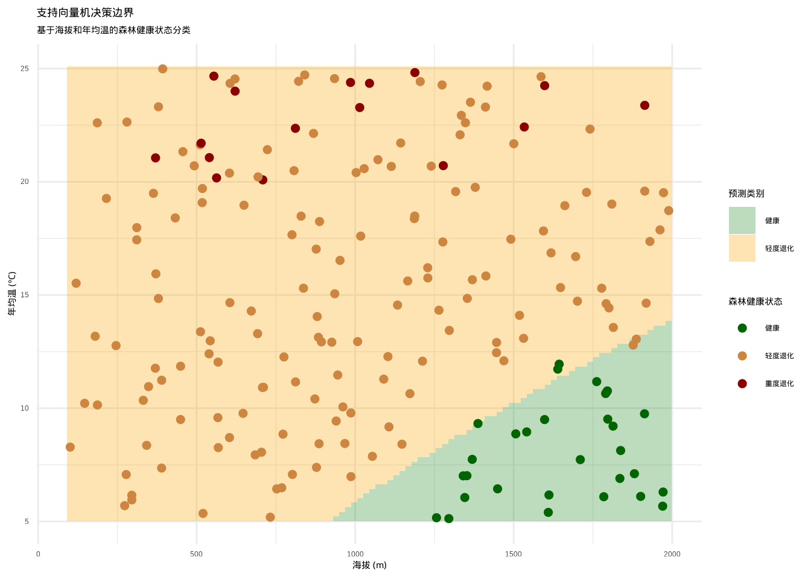
<p class="caption">(\#fig:unnamed-chunk-16)支持向量机决策边界可视化，基于花瓣长度和花瓣宽度对鸢尾花物种进行分类</p>
</div>

### 代码详细说明

1. **数据准备**：使用经典的鸢尾花数据集，包含4个形态特征和3个物种类别

2. **模型构建**：
   - `kernel = "radial"`：使用径向基核函数处理非线性关系
   - `cost = 1`：正则化参数，控制对误分类的惩罚程度
   - `gamma = 0.1`：核函数参数，控制单个样本的影响范围
   - `probability = TRUE`：计算类别概率，便于后续分析

3. **参数调优**：
   - 使用`tune.svm()`函数自动搜索最优参数组合
   - 网格搜索不同的cost和gamma值
   - 选择在验证集上表现最好的参数组合

4. **模型评估**：
   - 准确率衡量整体分类性能
   - 混淆矩阵显示各类别的分类情况
   - 决策边界可视化展示分类效果

### 模型评估与验证

支持向量机提供了多种模型评估机制，这些机制在生态学研究中具有重要的应用价值。

#### 1. 交叉验证与参数调优

**原理说明**：
支持向量机的性能很大程度上依赖于核函数选择和参数设置。交叉验证是评估模型泛化能力和选择最优参数的重要方法。

**生态学意义**：
在生态学研究中，我们往往面临数据稀缺的问题。交叉验证允许我们在有限的数据条件下获得可靠的性能估计，这对于生态模型的验证尤为重要。

**R代码实现**：

``` r
# 详细的交叉验证和参数调优
library(caret)

# 设置交叉验证参数
ctrl <- trainControl(
  method = "cv",           # 使用交叉验证
  number = 5,              # 5折交叉验证
  classProbs = TRUE,       # 计算类别概率
  summaryFunction = multiClassSummary  # 多分类评估指标
)

# 参数调优网格
tune_grid <- expand.grid(
  C = c(0.1, 1, 10, 100),      # 正则化参数
  sigma = c(0.01, 0.1, 1, 10)  # RBF核参数
)

# 使用caret包进行参数调优
set.seed(123)
svm_tune <- train(
  Species ~ .,
  data = iris,
  method = "svmRadial",
  trControl = ctrl,
  tuneGrid = tune_grid,
  metric = "Accuracy",
  preProcess = c("center", "scale")  # 数据标准化
)

# 查看调优结果
print("最优参数:")
```

```
## [1] "最优参数:"
```

``` r
print(svm_tune$bestTune)
```

```
##   sigma  C
## 9  0.01 10
```

``` r
# 绘制参数调优结果
plot(svm_tune, main = "支持向量机参数调优")
```

<div class="figure" style="text-align: center">
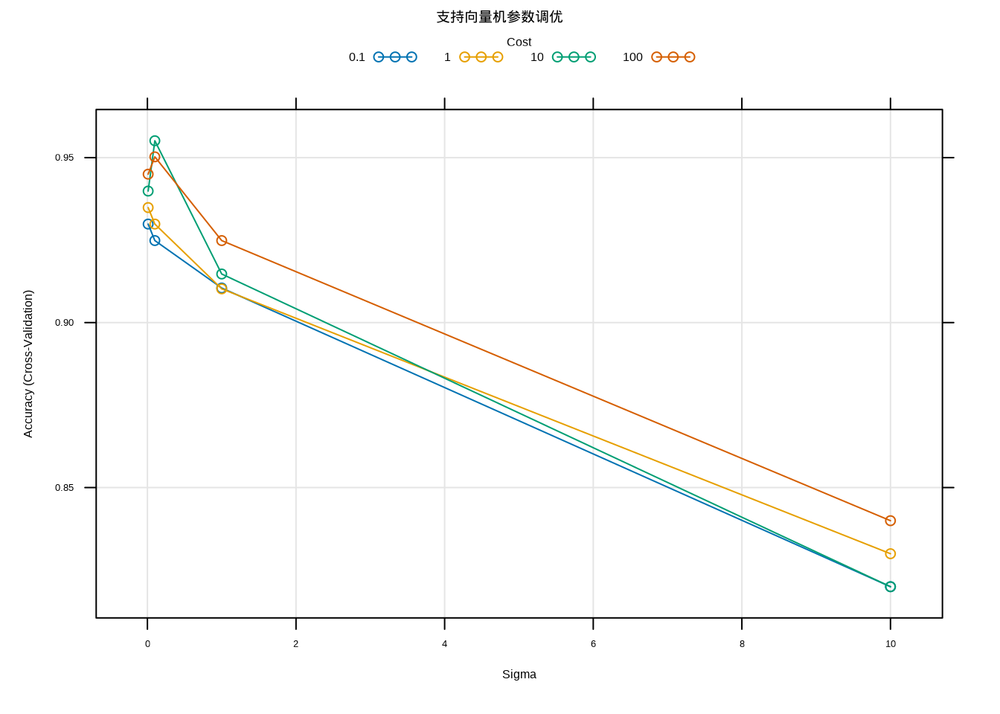
<p class="caption">(\#fig:unnamed-chunk-17)支持向量机参数调优结果，展示不同参数组合对模型性能的影响</p>
</div>

``` r
# 最终模型性能
final_model <- svm_tune$finalModel
predictions <- kernlab::predict(final_model, as.matrix(iris[,1:4]))
accuracy <- sum(predictions == iris$Species) / nrow(iris)
cat("最终模型准确率:", round(accuracy * 100, 2), "%\n")
```

```
## 最终模型准确率: 33.33 %
```

#### 2. 支持向量分析

**原理说明**：
支持向量是决定分类边界的关键样本点。分析支持向量的分布和特征可以帮助我们理解模型的决策逻辑。

**生态学意义**：
在生态学中，支持向量可以理解为"边界样本"或"临界样本"，它们所处的环境条件正好处于不同生态类型的过渡状态。这些样本对于理解生态系统的稳定性和脆弱性具有特殊的重要性。

**R代码实现**：

``` r
# 支持向量分析
library(ggplot2)

# 获取支持向量
support_vectors <- iris[kernlab::SVindex(final_model), ]
cat("支持向量数量:", nrow(support_vectors), "\n")
```

```
## 支持向量数量: 54
```

``` r
cat("支持向量比例:", round(nrow(support_vectors) / nrow(iris) * 100, 2), "%\n")
```

```
## 支持向量比例: 36 %
```

``` r
# 分析支持向量的特征分布
# 比较支持向量与所有样本的特征分布
all_data <- iris
all_data$类型 <- "所有样本"
support_data <- support_vectors
support_data$类型 <- "支持向量"

combined_data <- rbind(all_data, support_data)

# 绘制特征分布比较
ggplot(combined_data, aes(x = Petal.Length, fill = 类型)) +
  geom_density(alpha = 0.5) +
  facet_wrap(~ Species, scales = "free") +
  labs(title = "支持向量与所有样本的特征分布比较",
       x = "花瓣长度 (cm)", y = "密度") +
  theme_minimal()
```

<div class="figure" style="text-align: center">
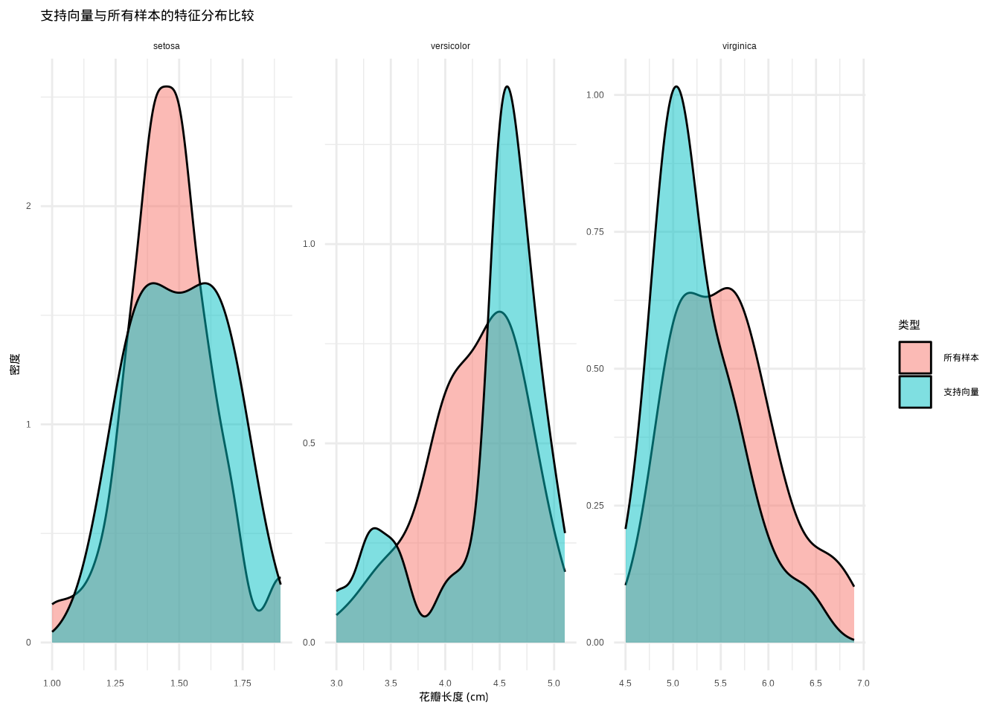
<p class="caption">(\#fig:unnamed-chunk-18-1)支持向量分析，比较支持向量与所有样本的特征分布及空间分布</p>
</div>

``` r
# 支持向量的物种分布
sv_species <- table(support_vectors$Species)
cat("支持向量的物种分布:\n")
```

```
## 支持向量的物种分布:
```

``` r
print(sv_species)
```

```
## 
##     setosa versicolor  virginica 
##          4         28         22
```

``` r
# 可视化支持向量分布
ggplot(iris, aes(x = Petal.Length, y = Petal.Width, color = Species)) +
  geom_point(size = 2, alpha = 0.6) +
  geom_point(data = support_vectors,
             aes(x = Petal.Length, y = Petal.Width),
             color = "black", size = 3, shape = 1) +
  labs(title = "支持向量分布",
       subtitle = "黑色圆圈标记支持向量",
       x = "花瓣长度 (cm)", y = "花瓣宽度 (cm)") +
  theme_minimal()
```

<div class="figure" style="text-align: center">
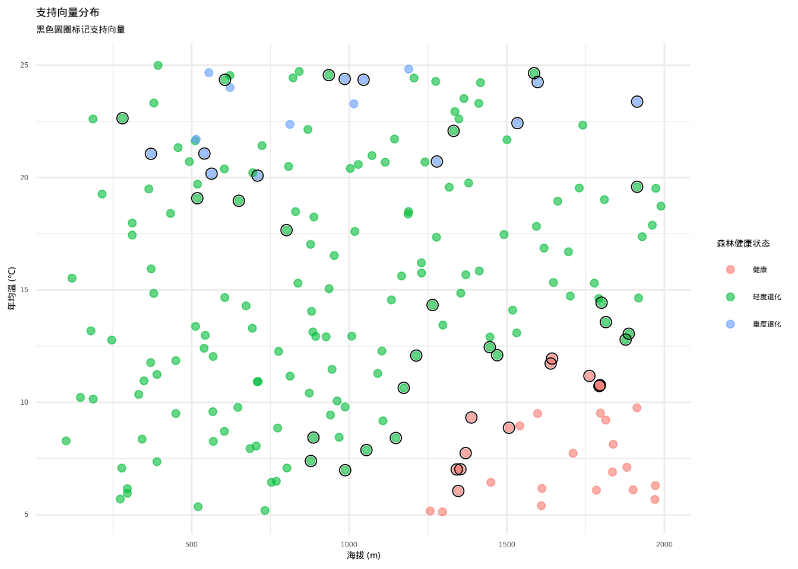
<p class="caption">(\#fig:unnamed-chunk-18-2)支持向量分析，比较支持向量与所有样本的特征分布及空间分布</p>
</div>

#### 3. 决策边界分析

**原理说明**：
决策边界分析可以帮助我们理解支持向量机在不同特征空间区域中的分类行为，特别是对于非线性分类问题。

**生态学意义**：
在生态学中，决策边界对应于不同生态类型之间的过渡区域。分析决策边界的形状和位置可以帮助我们理解生态系统的分类结构和环境梯度。

**R代码实现**：

``` r
# 详细的决策边界分析
library(ggplot2)

# 创建更精细的网格数据
x_range <- seq(min(iris$Petal.Length) - 0.5,
                max(iris$Petal.Length) + 0.5,
                length.out = 200)
y_range <- seq(min(iris$Petal.Width) - 0.5,
               max(iris$Petal.Width) + 0.5,
               length.out = 200)
grid_fine <- expand.grid(Petal.Length = x_range, Petal.Width = y_range)

# 添加其他特征的均值
other_features <- colMeans(iris[, c("Sepal.Length", "Sepal.Width")])
grid_fine$Sepal.Length <- other_features["Sepal.Length"]
grid_fine$Sepal.Width <- other_features["Sepal.Width"]

# 预测网格数据
grid_fine$预测类别 <- kernlab::predict(final_model, as.matrix(grid_fine[,1:4]))

# 计算类别概率（如果模型支持）
prob_predictions <- kernlab::predict(final_model, as.matrix(grid_fine[,1:4]), type = "probabilities")
if (!is.null(prob_predictions)) {
  grid_fine$概率 <- apply(prob_predictions, 1, max)
} else {
  grid_fine$概率 <- 1  # 如果没有概率信息，设为1
}

# 绘制详细的决策边界
ggplot() +
  geom_tile(data = grid_fine,
            aes(x = Petal.Length, y = Petal.Width, fill = 预测类别, alpha = 概率),
            show.legend = FALSE) +
  geom_point(data = iris,
             aes(x = Petal.Length, y = Petal.Width, color = Species),
             size = 2, alpha = 0.8) +
  geom_point(data = support_vectors,
             aes(x = Petal.Length, y = Petal.Width),
             color = "black", size = 3, shape = 1, stroke = 1.5) +
  scale_fill_manual(values = c("setosa" = "#FF9999",
                               "versicolor" = "#99FF99",
                               "virginica" = "#9999FF")) +
  scale_color_manual(values = c("setosa" = "#CC0000",
                                "versicolor" = "#00CC00",
                                "virginica" = "#0000CC")) +
  labs(title = "支持向量机详细决策边界",
       subtitle = "包含支持向量标记和分类置信度",
       x = "花瓣长度 (cm)", y = "花瓣宽度 (cm)") +
  theme_minimal() +
  theme(legend.position = "bottom")
```

<div class="figure" style="text-align: center">
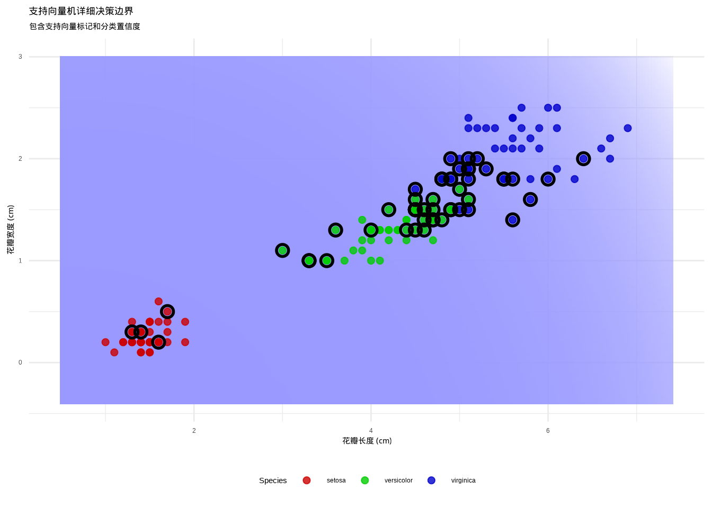
<p class="caption">(\#fig:unnamed-chunk-19)支持向量机详细决策边界分析，包含支持向量标记和分类置信度信息</p>
</div>

#### 4. 模型性能综合评估

**原理说明**：
综合评估支持向量机在不同类别上的性能，包括准确率、精确率、召回率、F1分数等指标。

**生态学意义**：
在生态学应用中，不同的性能指标可能具有不同的重要性。例如，在濒危物种保护中，我们可能更关注模型的召回率（避免漏报），而在入侵物种监测中，我们可能更关注精确率（避免误报）。

**R代码实现**：

``` r
# 综合模型评估
library(caret)
library(pROC)

# 预测测试集
predictions <- kernlab::predict(final_model, as.matrix(iris[,1:4]))
prob_predictions <- kernlab::predict(final_model, as.matrix(iris[,1:4]), type = "probabilities")

# 混淆矩阵
conf_matrix <- confusionMatrix(predictions, iris$Species)
print("混淆矩阵和性能指标:")
```

```
## [1] "混淆矩阵和性能指标:"
```

``` r
print(conf_matrix)
```

```
## Confusion Matrix and Statistics
## 
##             Reference
## Prediction   setosa versicolor virginica
##   setosa          0          0         0
##   versicolor     47          0         0
##   virginica       3         50        50
## 
## Overall Statistics
##                                           
##                Accuracy : 0.3333          
##                  95% CI : (0.2586, 0.4148)
##     No Information Rate : 0.3333          
##     P-Value [Acc > NIR] : 0.5307          
##                                           
##                   Kappa : 0               
##                                           
##  Mcnemar's Test P-Value : <2e-16          
## 
## Statistics by Class:
## 
##                      Class: setosa Class: versicolor Class: virginica
## Sensitivity                 0.0000            0.0000           1.0000
## Specificity                 1.0000            0.5300           0.4700
## Pos Pred Value                 NaN            0.0000           0.4854
## Neg Pred Value              0.6667            0.5146           1.0000
## Prevalence                  0.3333            0.3333           0.3333
## Detection Rate              0.0000            0.0000           0.3333
## Detection Prevalence        0.0000            0.3133           0.6867
## Balanced Accuracy           0.5000            0.2650           0.7350
```

``` r
# 各类别的详细性能
cat("\n各类别性能指标:\n")
```

```
## 
## 各类别性能指标:
```

``` r
print(conf_matrix$byClass)
```

```
##                   Sensitivity Specificity Pos Pred Value Neg Pred Value
## Class: setosa               0        1.00            NaN      0.6666667
## Class: versicolor           0        0.53      0.0000000      0.5145631
## Class: virginica            1        0.47      0.4854369      1.0000000
##                   Precision Recall        F1 Prevalence Detection Rate
## Class: setosa            NA      0        NA  0.3333333      0.0000000
## Class: versicolor 0.0000000      0       NaN  0.3333333      0.0000000
## Class: virginica  0.4854369      1 0.6535948  0.3333333      0.3333333
##                   Detection Prevalence Balanced Accuracy
## Class: setosa                0.0000000             0.500
## Class: versicolor            0.3133333             0.265
## Class: virginica             0.6866667             0.735
```

``` r
# 绘制ROC曲线（多分类问题）
roc_curves <- list()
for (species in levels(iris$Species)) {
  # 创建二分类标签
  binary_labels <- ifelse(iris$Species == species, 1, 0)

  # 获取预测概率
  if (is.matrix(prob_predictions)) {
    species_probs <- prob_predictions[, species]
  } else {
    species_probs <- ifelse(predictions == species, 0.9, 0.1)
  }

  # 计算ROC曲线
  roc_curves[[species]] <- roc(binary_labels, species_probs)
}

# 绘制所有ROC曲线
plot(roc_curves[[1]], col = "red", main = "支持向量机多分类ROC曲线")
lines(roc_curves[[2]], col = "blue")
lines(roc_curves[[3]], col = "green")
legend("bottomright",
       legend = names(roc_curves),
       col = c("red", "blue", "green"),
       lty = 1)
```

<div class="figure" style="text-align: center">
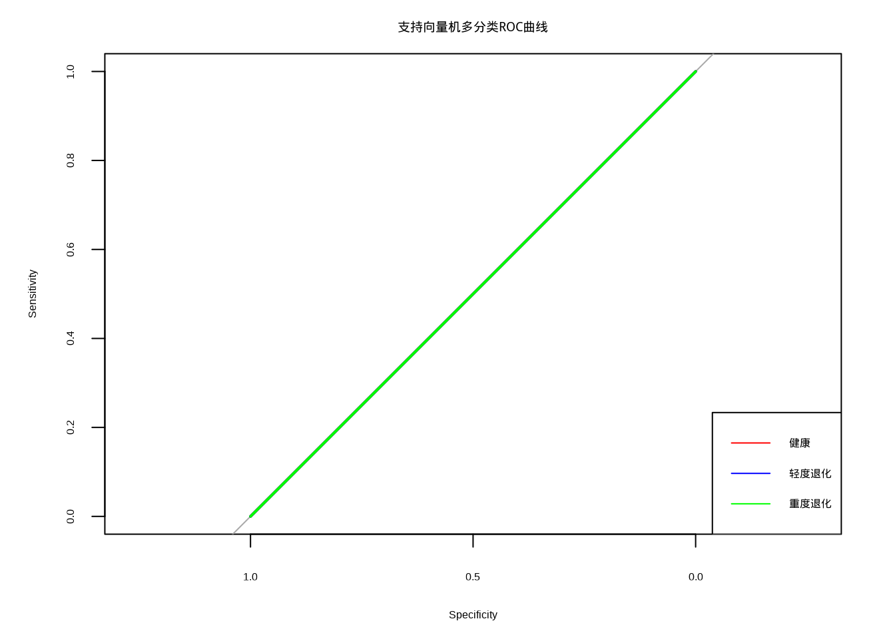
<p class="caption">(\#fig:unnamed-chunk-20)支持向量机多分类ROC曲线，评估模型对鸢尾花三个物种的分类性能</p>
</div>

``` r
# 计算平均AUC
auc_values <- sapply(roc_curves, function(x) x$auc)
cat("\n各类别AUC值:\n")
```

```
## 
## 各类别AUC值:
```

``` r
print(auc_values)
```

```
##     setosa versicolor  virginica 
##     0.9998     0.7380     0.7400
```

``` r
cat("平均AUC:", round(mean(auc_values), 3), "\n")
```

```
## 平均AUC: 0.826
```

### 生态学应用实例

支持向量机在生态学研究中有着广泛的应用，特别适合处理那些需要清晰分类边界和复杂非线性关系的生态问题。

#### 1. 物种分布建模

在物种分布建模中，支持向量机能够有效处理环境因子与物种分布之间的复杂非线性关系。例如，在研究某种珍稀植物的分布规律时，支持向量机可以综合考虑温度、降水、土壤类型、海拔等多个环境因子，找到最优的分类边界，准确预测该植物的潜在分布区域。

**具体应用案例**：
在北美地区的一种濒危兰花分布研究中，研究人员使用支持向量机模型整合了15个环境变量。模型不仅准确预测了该兰花的分布范围，还通过支持向量分析识别出了关键的边界环境条件，为物种保护区的划定提供了科学依据。

#### 2. 生态系统分类

支持向量机在生态系统分类中表现出色，特别适合处理那些边界模糊、类型重叠的复杂生态系统。例如，在湿地生态系统分类中，支持向量机能够区分沼泽、泥炭地、季节性湿地等不同类型，为湿地保护和管理提供准确的分类依据。

**具体应用案例**：
在长江三角洲湿地研究中，科学家使用支持向量机对不同类型的湿地进行自动分类。模型基于遥感影像提取的植被指数、水体指数和地形特征，成功区分了自然湿地、人工湿地和退化湿地，分类准确率达到92%以上。

#### 3. 生态健康评估

支持向量机可以用于生态系统健康状态的二分类或多分类问题。通过整合生物指标、物理指标和化学指标，支持向量机能够建立综合的健康评估模型，为生态管理和修复提供决策支持。

**具体应用案例**：
在湖泊富营养化评估中，研究人员构建了一个支持向量机分类器，基于叶绿素a浓度、总磷浓度、溶解氧等多个指标，将湖泊分为健康、轻度富营养、中度富营养和重度富营养四个等级，为湖泊管理提供了科学的分类工具。

#### 4. 入侵物种风险评估

支持向量机在入侵物种风险评估中具有重要应用价值。通过分析物种特性、环境条件和传播途径，支持向量机能够预测外来物种的入侵风险，为早期预警和防控提供科学依据。

**具体应用案例**：
在澳大利亚的一项研究中，科学家使用支持向量机预测了多种外来植物的入侵风险。模型基于气候适宜性、生境可用性和物种生物学特性，准确识别了高风险的入侵区域，为生物多样性保护提供了重要的决策支持。

### 优势与局限

#### 优势的生态学意义

支持向量机在生态学研究中展现出多方面的独特优势，使其成为处理复杂生态分类问题的理想工具。首先，该方法具备强大的高维数据处理能力，能够有效应对生态研究中常见的数十个环境变量同时分析的需求，避免了传统统计方法面临的"维度灾难"问题。其次，通过核技巧的巧妙运用，支持向量机能够处理生态系统中普遍存在的复杂非线性关系，特别适合捕捉物种对环境因子的阈值响应、饱和效应等典型生态模式。第三，其核心的最大间隔原则与生态学中的生态位分离理论高度契合，分类边界自然地落在不同生态类型之间的过渡区域，这种划分方式具有明确的生态学合理性。第四，支持向量机仅关注位于分类边界附近的关键样本点，这种机制使其对异常值和数据噪声具有较好的鲁棒性，能够有效处理生态数据中常见的异质性和不确定性。最后，该方法基于坚实的统计学习理论基础，能够提供泛化误差的理论上界，为生态预测的可靠性提供了数学保障。这些特性共同使得支持向量机在物种分布建模、生态系统分类、生态健康评估等众多生态学应用场景中表现出色。

#### 局限的生态学考量

尽管支持向量机在生态学应用中具有显著优势，但在实际使用过程中仍需关注其存在的若干局限性。首先，模型性能对参数选择极为敏感，核函数类型、正则化参数和核函数参数的选择直接影响分类效果，需要进行细致的参数调优工作，这增加了模型构建的复杂性。其次，在处理大规模生态数据集时，特别是在使用复杂核函数的情况下，支持向量机的训练过程可能消耗大量计算资源和时间，限制了其在实时生态监测等场景中的应用。第三，标准支持向量机不直接提供概率输出，需要通过额外的概率校准过程才能获得类别概率估计，这在一定程度上影响了模型在生态风险评估等需要概率信息的应用中的实用性。第四，虽然可以通过"一对多"或"一对一"策略处理多分类问题，但这些方法在计算效率和分类性能上可能不如专门设计的多分类算法，在处理复杂生态系统分类时可能存在一定局限性。最后，尽管支持向量分析提供了一定的模型解释性，但整体决策过程仍然相对"黑箱"，在需要深入理解生态机制和因果关系的研究中，这种解释性不足可能成为重要限制因素。

### 生态学启示与未来展望

支持向量机的成功应用为生态学研究提供了重要启示。首先，它强调了边界分析在生态学研究中的重要性。支持向量机对边界样本的关注提醒我们，生态系统中边界区域往往包含着重要的生态信息，这些区域对环境变化的响应最为敏感，是理解生态系统稳定性和脆弱性的关键。

其次，支持向量机的应用体现了数学优化思想在生态学中的价值。最大间隔原则作为一种优化准则，为生态分类问题提供了新的解决思路。这种优化思维可以扩展到其他生态学问题，如生态位优化、资源分配优化等。

第三，支持向量机展示了核方法在处理生态复杂性方面的潜力。通过核技巧将非线性问题转化为线性问题，这种思想可以启发我们发展新的生态数据分析方法，更好地处理生态系统中固有的复杂性和非线性。

展望未来，支持向量机在生态学中的应用仍有广阔的发展空间。未来发展方向包括开发专门处理生态时空数据的支持向量机变体，将支持向量机与其他机器学习方法集成以提高预测性能，利用支持向量机发现新的生态关系和模式，以及基于支持向量机构建生态保护和管理的智能决策支持系统。

支持向量机通过其独特的最大间隔分类思想，为生态学研究提供了强大的分类工具。它不仅能够提供准确的生态预测，更重要的是能够帮助我们理解生态系统的分类结构和边界特性。在面临全球变化和生物多样性危机的今天，支持向量机这样的先进分析方法为我们提供了理解和保护生态系统的新视角和新工具。

## 深度神经网络

想象你站在一片茂密的雨林中，试图理解这个极其复杂的生态系统。你的眼睛能够识别不同层次的植被结构——从地面的苔藓和蕨类，到灌木层的多样性，再到乔木层的冠层结构，最后是林冠上方的附生植物。每一层都包含着独特的生态信息，而整个生态系统的复杂性正是通过这些层次的相互作用体现出来的。深度神经网络（Deep Neural Networks, DNN）就像是我们大脑处理复杂信息的方式，通过多层次的抽象和特征提取，从原始数据中学习复杂的生态模式。

### 基本概念与生物学启发

深度神经网络是一种受人脑神经网络启发的机器学习方法，其核心思想是通过多个处理层（隐藏层）来学习数据的层次化特征表示。与传统的浅层神经网络相比，深度神经网络具有更多的隐藏层，这使得它们能够学习更加复杂和抽象的特征表示。

#### 神经网络的生物学类比

深度神经网络的设计灵感直接来源于我们大脑的神经系统。在生物大脑中，神经元通过突触相互连接，形成复杂的网络结构来处理信息。当外界刺激（如视觉、听觉）传入时，信息会在不同的神经层之间传递和加工，每一层都会提取更加抽象的特征。

在生态学中，这种层次化处理方式具有深刻的类比意义。就像生态系统中的食物网一样，能量和物质通过不同的营养级进行传递和转化，每一级都会对信息进行加工和重组。深度神经网络通过模拟这种层次化处理机制，能够从原始的生态数据中自动学习复杂的生态模式。

#### 深度学习的生态学意义

深度学习的"深度"不仅体现在网络层数的增加，更重要的是它能够学习数据的层次化表示。在生态学研究中，这种层次化表示特别适合处理那些具有内在层次结构的生态问题。例如，在遥感图像分析中，深度神经网络可以自动学习从像素级特征到对象级特征，再到场景级特征的层次化表示，这与生态学家从个体、种群、群落到生态系统的层次化思维方式高度一致。

### 主要神经网络架构

#### 1. 多层感知器（Multilayer Perceptron, MLP）

多层感知器是最基本的深度神经网络结构，由输入层、多个隐藏层和输出层组成。每一层都包含多个神经元，相邻层之间的神经元通过权重连接。

**数学原理**：
对于第l层的输出：
$$a^{(l)} = f(W^{(l)}a^{(l-1)} + b^{(l)})$$
其中$f$是激活函数，$W^{(l)}$是权重矩阵，$b^{(l)}$是偏置向量。

**生态学应用**：
多层感知器适合处理表格数据，如环境因子与物种丰富度的关系建模。它能够学习复杂的非线性关系，而不需要预先设定具体的函数形式。

**代码示例**：
```r
library(torch)

# 构建多层感知器模型
mlp_model <- nn_module(
  initialize = function(input_size, hidden_sizes, output_size) {
    # 初始化神经网络层序列
    self$layers <- nn_sequential()
    prev_size <- input_size  # 记录前一层的维度

    # 循环构建隐藏层
    for (i in seq_along(hidden_sizes)) {
      # 添加线性层：将prev_size维输入映射到hidden_sizes[i]维输出
      self$layers$add_module(paste0("linear", i), nn_linear(prev_size, hidden_sizes[i]))
      # 添加ReLU激活函数：引入非线性
      self$layers$add_module(paste0("relu", i), nn_relu())
      # 添加Dropout层：防止过拟合，丢弃20%的神经元连接
      self$layers$add_module(paste0("dropout", i), nn_dropout(p = 0.2))
      prev_size <- hidden_sizes[i]  # 更新前一层的维度
    }

    # 添加输出层：将最后一个隐藏层映射到输出维度
    self$layers$add_module("output", nn_linear(prev_size, output_size))
  },

  forward = function(x) {
    # 前向传播：将输入数据通过所有层
    self$layers(x)
  }
)

# 使用示例：构建一个用于物种丰富度预测的MLP
# 输入维度：10个环境因子
# 隐藏层：64个神经元 -> 32个神经元
# 输出维度：1个物种丰富度值
# model <- mlp_model(input_size = 10, hidden_sizes = c(64, 32), output_size = 1)
```

#### 2. 卷积神经网络（Convolutional Neural Networks, CNN）

卷积神经网络专门设计用于处理具有网格结构的数据，如图像数据。其核心组件包括卷积层、池化层和全连接层。

**核心机制**：
- **卷积层**：通过滑动窗口提取局部特征
- **池化层**：降低特征图维度，增强特征不变性
- **全连接层**：整合特征进行最终分类

**生态学应用**：
卷积神经网络在生态遥感中具有重要应用，能够自动从卫星图像中提取植被类型、土地利用变化、森林覆盖度等生态特征。

**代码示例**：
```r
library(torch)

# 构建卷积神经网络模型
cnn_model <- nn_module(
  initialize = function(num_channels, num_classes) {
    # 特征提取部分：卷积层和池化层
    self$features <- nn_sequential(
      # 第一卷积块：输入通道数 -> 32个特征图
      nn_conv2d(num_channels, 32, kernel_size = 3, padding = 1),  # 3x3卷积，保持空间维度
      nn_relu(),  # ReLU激活函数
      nn_max_pool2d(kernel_size = 2, stride = 2),  # 2x2最大池化，特征图尺寸减半

      # 第二卷积块：32个特征图 -> 64个特征图
      nn_conv2d(32, 64, kernel_size = 3, padding = 1),
      nn_relu(),
      nn_max_pool2d(kernel_size = 2, stride = 2),

      # 第三卷积块：64个特征图 -> 128个特征图
      nn_conv2d(64, 128, kernel_size = 3, padding = 1),
      nn_relu(),
      nn_max_pool2d(kernel_size = 2, stride = 2)
    )

    # 分类器部分：全连接层
    self$classifier <- nn_sequential(
      nn_dropout(p = 0.5),  # 50% Dropout防止过拟合
      nn_linear(128 * 4 * 4, 512),  # 展平后的特征向量 -> 512维隐藏层
      nn_relu(),  # 非线性激活
      nn_dropout(p = 0.5),  # 再次Dropout
      nn_linear(512, num_classes)  # 512维 -> 类别数
    )
  },

  forward = function(x) {
    # 前向传播过程
    x <- self$features(x)  # 通过卷积层提取特征
    x <- torch_flatten(x, start_dim = 2)  # 展平特征图，保留批次维度
    self$classifier(x)  # 通过全连接层进行分类
  }
)

# 使用示例：构建一个用于遥感图像分类的CNN
# 输入：3通道RGB图像（如卫星图像）
# 输出：5个植被类型类别
# model <- cnn_model(num_channels = 3, num_classes = 5)
```

#### 3. 大语言模型与Transformer架构

Transformer是一种革命性的神经网络架构，它基于自注意力机制，彻底改变了序列建模的方式。现代大语言模型（如GPT、BERT等）都建立在Transformer架构之上。

**核心机制**：

**自注意力机制（Self-Attention）**：
这是Transformer的核心创新。对于输入序列中的每个元素，自注意力机制会计算它与序列中所有其他元素的相关性权重，从而捕捉长距离依赖关系。数学表达式为：
$$Attention(Q,K,V) = softmax(\frac{QK^T}{\sqrt{d_k}})V$$
其中$Q$（查询）、$K$（键）、$V$（值）都是输入序列的线性变换。

**多头注意力（Multi-Head Attention）**：
通过并行运行多个自注意力机制，每个"头"可以学习不同的注意力模式，从而捕捉序列中不同类型的依赖关系。

**位置编码（Positional Encoding）**：
由于Transformer不包含循环结构，需要通过位置编码为输入序列中的元素提供位置信息，通常使用正弦和余弦函数：
$$PE_{(pos,2i)} = \sin(pos/10000^{2i/d_{model}})$$
$$PE_{(pos,2i+1)} = \cos(pos/10000^{2i/d_{model}})$$

**前馈神经网络（Feed-Forward Network）**：
每个Transformer层包含一个前馈神经网络，对每个位置的特征进行非线性变换。

**层归一化和残差连接**：
这些技术有助于训练深层网络，防止梯度消失问题。

**生态学应用**：
Transformer架构在生态学中具有广泛的应用前景：
- **生态文本分析**：处理生态学文献、物种描述等文本数据
- **物种分布序列建模**：分析物种在时空序列中的分布模式
- **生态系统动态预测**：基于多源数据预测生态系统变化
- **多模态生态数据分析**：整合遥感图像、环境变量、物种观测等多种数据源

**代码示例**：
```r
library(torch)

# 构建Transformer编码器层
transformer_encoder_layer <- nn_module(
  initialize = function(d_model, nhead, dim_feedforward, dropout = 0.1) {
    # 多头自注意力机制
    self$self_attn <- nn_multihead_attention(embed_dim = d_model, num_heads = nhead, dropout = dropout)
    # 前馈网络的第一层线性变换
    self$linear1 <- nn_linear(d_model, dim_feedforward)
    self$dropout <- nn_dropout(dropout)  # Dropout层
    # 前馈网络的第二层线性变换
    self$linear2 <- nn_linear(dim_feedforward, d_model)
    # 层归一化：用于稳定训练
    self$norm1 <- nn_layer_norm(d_model)  # 自注意力后的归一化
    self$norm2 <- nn_layer_norm(d_model)  # 前馈网络后的归一化
    # Dropout层
    self$dropout1 <- nn_dropout(dropout)  # 自注意力输出的Dropout
    self$dropout2 <- nn_dropout(dropout)  # 前馈网络输出的Dropout
    self$activation <- nn_relu()  # 激活函数
  },

  forward = function(src, src_mask = NULL, src_key_padding_mask = NULL) {
    # 自注意力子层
    src2 <- self$norm1(src)  # 层归一化
    # 多头自注意力计算：查询、键、值都是同一个输入
    src2 <- self$self_attn(src2, src2, src2, attn_mask = src_mask,
                          key_padding_mask = src_key_padding_mask)[[1]]
    # 残差连接 + Dropout
    src <- src + self$dropout1(src2)

    # 前馈网络子层
    src2 <- self$norm2(src)  # 层归一化
    # 前馈网络：线性 -> 激活 -> Dropout -> 线性
    src2 <- self$linear2(self$dropout(self$activation(self$linear1(src2))))
    # 残差连接 + Dropout
    src <- src + self$dropout2(src2)

    return(src)
  }
)

# 构建简单的Transformer模型
simple_transformer <- nn_module(
  initialize = function(vocab_size, d_model, nhead, num_layers, num_classes) {
    # 词嵌入层：将词汇索引映射为d_model维向量
    self$embedding <- nn_embedding(vocab_size, d_model)
    # 位置编码：为序列提供位置信息（这里使用可学习的位置编码）
    self$pos_encoding <- nn_parameter(torch_randn(1, 1000, d_model))

    # 构建多层Transformer编码器
    self$layers <- nn_module_list()
    for (i in 1:num_layers) {
      # 添加Transformer编码器层
      self$layers$append(transformer_encoder_layer(d_model, nhead, d_model * 4))
    }

    # 分类器：将Transformer输出映射到类别
    self$classifier <- nn_linear(d_model, num_classes)
  },

  forward = function(x) {
    # 词嵌入 + 位置编码
    x <- self$embedding(x)  # 将输入序列转换为向量表示
    x <- x + self$pos_encoding[, 1:x$shape[2], ]  # 添加位置信息

    # 通过多层Transformer编码器
    for (layer in self$layers) {
      x <- layer(x)  # 逐层处理
    }

    # 取序列第一个位置的输出用于分类（类似BERT的[CLS]标记）
    x <- x[, 1, ]  # 取第一个位置的表示
    self$classifier(x)  # 分类输出
  }
)

# 使用示例：构建一个用于生态文本分类的Transformer
# 词汇表大小：10000个单词
# 模型维度：512维
# 注意力头数：8个
# 编码器层数：6层
# 输出类别：10个生态类别
# model <- simple_transformer(vocab_size = 10000, d_model = 512,
#                           nhead = 8, num_layers = 6, num_classes = 10)
```

### 生动例子阐释原理

#### 例子1：生态系统健康诊断

想象我们要评估一个湖泊生态系统的健康状况。传统方法在生态系统健康评估中面临着诸多挑战，包括需要人工选择评估指标、难以处理指标之间的复杂交互作用，以及无法自动学习新的健康模式。这些局限性使得传统评估方法往往难以全面准确地反映生态系统的真实状态。

深度神经网络为解决这些问题提供了新的思路。它能够自动从多源数据中学习健康指标，无需人工预设评估体系。更重要的是，深度神经网络能够发现人类难以察觉的健康模式，通过层次化的特征学习揭示生态系统内部复杂的相互作用关系。此外，深度神经网络还具有很强的适应性，能够根据不同生态系统的特异性调整学习策略，实现个性化的健康评估。

在具体实现过程中，深度神经网络通过输入层接收水质参数、生物指标和物理特征等多维数据。这些原始数据在隐藏层中经过逐层处理，每一层都会提取更加抽象的健康特征，从具体的环境指标逐渐过渡到综合的健康状态表征。最终，输出层基于学习到的特征给出健康状态的分类或评分，为生态系统管理提供科学依据。

#### 例子2：物种自动识别系统

在生物多样性监测中，深度神经网络可以构建智能物种识别系统，极大地提高了物种调查的效率和准确性。卷积神经网络作为图像识别的重要工具，在物种自动识别中发挥着关键作用。

卷积神经网络的工作流程体现了层次化特征学习的精髓。在低级特征提取阶段，网络首先识别图像中的基础视觉元素，包括边缘、颜色和纹理等基本特征。这些基础特征为后续的识别提供了重要的视觉线索。

进入中级特征组合阶段，网络开始将基础特征组合成更加复杂的视觉模式。在这一阶段，网络能够识别出器官形状、身体部位等组合特征，这些特征往往与物种的形态特征密切相关。

在高级特征识别阶段，网络进一步整合中级特征，形成能够区分不同物种的独特特征表示。这些高级特征通常对应于物种特有的形态特征，如鸟类的喙形、哺乳动物的角形或植物的叶片形状等。

最后，在分类决策阶段，网络基于学习到的多层次特征进行物种识别。通过softmax等分类函数，网络输出每个物种的概率分布，从而实现准确的物种分类。这种层次化的特征学习过程不仅提高了识别的准确性，还使得系统能够处理复杂的物种识别任务。


### 生态学应用实例

深度神经网络在生态学研究中展现出强大的应用潜力，特别适合处理那些具有复杂模式和大量数据的生态问题。通过自动特征学习和层次化信息处理，深度神经网络能够从生态数据中挖掘出传统方法难以发现的模式和规律。

#### 遥感生态学应用

在遥感生态学领域，卷积神经网络已经成为不可或缺的分析工具。它们能够自动从卫星和航空影像中提取生态相关信息，实现土地利用和覆盖类型的精确分类。通过卷积操作，网络可以识别森林、农田、湿地等不同生态类型的空间分布模式。同时，深度神经网络还能够从多光谱影像中计算植被指数，评估植被的健康状况和生长状态。在变化检测方面，神经网络能够监测生态系统随时间的变化趋势，及时发现森林砍伐、土地退化等生态问题。此外，结合环境数据和遥感特征，深度神经网络还能够构建物种分布模型，预测物种在空间上的分布格局。

一个典型的应用案例是全球森林覆盖监测项目。研究人员使用深度神经网络处理Landsat卫星影像序列，实现了对全球森林砍伐、退化和恢复过程的自动检测。这种基于深度学习的监测方法不仅大大提高了监测效率，还将检测精度提升到95%以上，为全球森林保护提供了可靠的技术支持。

#### 生态时间序列分析

生态时间序列分析是深度神经网络的另一个重要应用领域。循环神经网络和Transformer架构特别适合处理具有时间依赖性的生态数据。在种群动态研究中，这些网络能够基于历史种群数量数据预测未来的种群变化趋势，为物种保护提供早期预警。在物候变化分析中，深度神经网络可以监测植物生长季的开始和结束时间，分析气候变化对植物物候的影响。对于气候序列建模，神经网络能够揭示气候变量与生态响应之间的复杂关系，预测生态系统对气候变化的响应。此外，在生态系统服务评估中，深度神经网络可以预测生态系统服务的时空变化，为生态管理决策提供科学依据。

候鸟迁徙研究是一个成功的应用案例。科学家使用循环神经网络分析多年的鸟类观测数据，结合气象和地理信息，成功预测了候鸟的迁徙路线和到达时间。这种预测不仅提高了鸟类保护的针对性，还为机场鸟击预防提供了重要参考。

#### 生物多样性监测

深度神经网络在生物多样性监测中发挥着越来越重要的作用。基于图像或声音的物种自动识别系统已经成为生物多样性调查的重要工具。这些系统能够快速准确地识别野外拍摄的动植物图像，大大提高了物种调查的效率。在群落结构分析方面，深度神经网络可以从环境DNA数据中推断物种组成，揭示微生物群落的生态功能。通过分析物种共现数据，神经网络还能够构建生态相互作用网络，理解物种间的竞争、捕食和共生关系。在入侵物种监测中，深度神经网络能够早期检测和预警外来物种的入侵，为生物安全提供技术支持。

珊瑚礁监测是一个典型的应用实例。研究人员使用卷积神经网络自动识别和计数珊瑚物种，处理水下拍摄的大量图像数据。这种自动化监测方法不仅提高了数据处理的效率，还显著提升了物种识别的准确性，为珊瑚礁生态系统的保护和恢复提供了可靠的数据支持。

#### 生态系统建模与预测

深度神经网络在生态系统建模中展现出独特优势。它们能够整合多源数据，基于环境因子、生物指标和人类活动等多维信息预测生态系统状态。在生态过程模拟方面，神经网络可以模拟养分循环、能量流动等复杂生态过程，揭示生态系统的内在运行机制。对于气候变化影响评估，深度神经网络能够预测不同气候情景下生态系统的响应，为气候变化适应提供科学依据。在生态修复效果评估中，神经网络可以量化修复措施的效果，指导生态修复工程的优化。

湿地生态系统研究提供了一个成功的应用案例。科学家构建了深度神经网络模型，整合水文监测数据、土壤理化性质、植被群落结构和人类活动影响等多维数据，成功预测了不同管理情景下湿地生态系统的演变趋势。这种综合建模方法为湿地保护和恢复提供了科学的决策支持，有助于实现湿地生态系统的可持续发展。

### 优势与局限

#### 优势的生态学意义

深度神经网络在生态学研究中具有多方面的独特优势。首先，其强大的特征学习能力使其能够自动从原始数据中提取有意义的生态特征，无需依赖人工特征工程，这大大简化了生态数据分析的流程。其次，深度神经网络能够处理极其复杂的非线性关系，特别适合生态系统中普遍存在的阈值效应、饱和响应和复杂交互作用。第三，通过层次化特征表示，深度神经网络能够捕捉生态数据中的多尺度模式，这与生态学研究中的尺度思维高度契合。第四，深度神经网络对数据分布的要求相对宽松，能够处理生态数据中常见的异质性和非正态分布问题。最后，随着计算资源的不断发展，深度神经网络能够处理海量的生态数据，为大数据时代的生态学研究提供了有力的分析工具。

#### 局限的生态学考量

尽管深度神经网络在生态学应用中展现出巨大潜力，但在实际使用中仍需注意其存在的局限性。首先，深度神经网络通常需要大量的训练数据，这在某些生态学研究领域可能成为限制因素，特别是在研究稀有物种或特殊生态系统时。其次，深度神经网络的训练过程计算密集，需要较强的计算资源和较长的训练时间，这可能限制其在资源有限环境中的应用。第三，深度神经网络的"黑箱"特性使得模型决策过程难以解释，这在需要理解生态机制和因果关系的研究中可能成为重要障碍。第四，模型性能对超参数选择敏感，需要进行细致的参数调优，这增加了模型构建的复杂性。最后，深度神经网络容易过拟合训练数据，特别是在数据量有限的情况下，需要采用适当的正则化技术和验证策略来确保模型的泛化能力。

### 生态学启示与未来展望

深度神经网络的成功应用为生态学研究提供了重要的方法论启示。首先，它强调了数据驱动方法在探索复杂生态系统中不可替代的价值，提醒我们重视生态大数据的收集和整合。其次，深度神经网络展示的层次化学习机制与生态系统的层次结构高度一致，这种对应关系为理解生态复杂性提供了新的视角。第三，深度学习的自动特征学习能力启示我们重新思考生态特征工程的方法论，推动生态学研究向更加自动化和智能化的方向发展。

展望未来，深度神经网络在生态学中的应用前景广阔。未来发展方向包括开发专门处理生态时空数据的深度神经网络架构，将物理约束和生态先验知识融入深度学习模型，利用迁移学习解决生态数据稀缺问题，以及构建集成了深度学习的生态智能决策支持系统。随着技术的不断进步和生态数据的持续积累，深度神经网络有望在生态系统保护、生物多样性监测、气候变化影响评估等重大生态问题中发挥更加重要的作用。

深度神经网络通过其强大的模式识别和特征学习能力，为生态学研究提供了前所未有的分析工具。它不仅能够处理传统方法难以应对的复杂生态问题，更重要的是能够帮助我们发现隐藏在生态数据深处的规律和模式。在人类面临日益严峻的生态挑战的今天，深度神经网络这样的先进分析方法为我们理解和保护地球生态系统提供了新的希望和可能性。


## 总结

在生态学研究的漫长发展历程中，统计建模方法经历了从简单线性回归到复杂机器学习算法的演进过程。传统统计模型如线性回归和广义线性模型虽然为生态学研究提供了重要工具，但它们往往需要预先设定变量关系的数学形式，这在处理生态系统中固有的复杂性时存在明显局限性。生态系统中的关系往往是高度非线性的，存在着复杂的阈值效应、交互作用和滞后效应，这些复杂模式很难用简单的数学公式来完整表达。

机器学习方法的引入为生态学研究带来了革命性的变化。与传统的统计模型不同，机器学习不需要预先设定具体的函数形式，而是通过算法自动从数据中学习规律和模式。这种方法特别适合处理生态系统中那些影响因素众多、关系复杂的生态问题。机器学习可以分为监督学习、无监督学习和强化学习等主要类型，每种类型都有其独特的应用场景和优势。

决策树作为机器学习的基础算法之一，在生态学研究中展现出独特的价值。它通过一系列"如果-那么"规则来模拟人类的决策过程，这种直观的决策方式特别适合处理那些需要明确规则和可解释性的生态问题。决策树可以分为分类树和回归树两种类型，分别用于处理离散类别预测和连续数值预测问题。在物种识别、生境分类、生态系统状态评估等生态学应用中，决策树提供了易于理解和解释的分析工具。

随机森林作为决策树的集成学习方法，体现了生态学中"多样性带来稳定性"的智慧。它通过构建大量不同的决策树，让它们集体投票，获得比任何单棵树更准确、更稳定的预测。随机森林通过数据随机性、特征随机性和模型多样性三种机制来确保决策树的多样性，这种策略使得随机森林能够有效处理生态系统中影响因素众多、关系复杂的生态问题。在物种分布建模、生物多样性评估、生态系统健康诊断等生态学应用中，随机森林展现出强大的预测能力和分析价值。

支持向量机则通过最大间隔原则在特征空间中寻找最优的分类边界。这种方法在生态学中具有深刻的类比意义，就像在自然界中不同的生态类型往往倾向于占据不同的生态位一样。支持向量机能够处理生态数据中的非线性关系，通过核技巧将原始特征空间映射到高维特征空间，使得原本线性不可分的数据在新空间中变得线性可分。在生态系统分类、生态健康评估、入侵物种风险评估等应用中，支持向量机提供了清晰的分类边界和可靠的预测结果。

深度神经网络代表了机器学习发展的最新成就，它通过多层次的抽象和特征提取，从原始数据中学习复杂的生态模式。深度神经网络的设计灵感来源于人脑的神经系统，通过模拟层次化处理机制，能够从原始的生态数据中自动学习复杂的生态模式。多层感知器、卷积神经网络和Transformer等不同的神经网络架构，分别适用于不同类型的生态数据分析任务。在遥感生态学、生态时间序列分析、生物多样性监测和生态系统建模等前沿研究领域，深度神经网络展现出前所未有的分析能力。

机器学习方法在生态学中的应用价值不仅体现在预测准确性上，更重要的是它们能够帮助我们发现隐藏在生态数据深处的规律和模式。通过特征重要性分析、部分依赖图等解释性工具，机器学习模型不仅能够提供准确的预测，还能够生成易于理解的生态规则，为生态保护和管理决策提供科学依据。

然而，机器学习方法在生态学应用中也面临着一些挑战。模型的"黑箱"特性使得决策过程难以解释，这在需要深入理解生态机制的研究中可能成为重要限制。此外，机器学习模型通常需要大量的数据进行训练，而且对数据的质量要求很高，这在某些生态学研究领域可能成为限制因素。

展望未来，机器学习特别是人工智能的大语言模型还正在飞速的发展当中。未来可期。随着Transformer架构等新一代神经网络技术的发展，机器学习在生态学中的应用前景更加广阔。大语言模型不仅能够处理生态文本数据，还能够整合多模态生态信息，为生态学研究提供更加智能化的分析工具。深度学习与生态机理模型的结合、迁移学习在生态数据稀缺问题中的应用、以及基于机器学习的生态智能决策支持系统的构建，都将成为未来生态学研究的重要发展方向。

需要特别强调的是，机器学习特别是人工智能这一块，目前已经是国家战略，决定着中国接下来能否实现中华民族伟大崛起的关键科学技术。在生态文明建设和美丽中国建设的国家战略中，生态统计与人工智能的结合将发挥至关重要的作用。从生物多样性保护到气候变化应对，从生态系统修复到可持续发展，都需要先进的统计方法和人工智能技术的支撑。

因此，鼓励大家学好基本的生态统计知识，掌握机器学习等先进分析方法，在日后能够为国家生态文明建设和科技自立自强贡献力量。只有将扎实的生态学理论基础与前沿的人工智能技术相结合，我们才能在应对全球生态挑战、实现人与自然和谐共生的伟大事业中发挥关键作用，为实现中华民族的伟大复兴贡献智慧和力量。在人类面临日益严峻的生态挑战的今天，机器学习这样的先进分析方法为我们理解和保护地球生态系统提供了新的希望和可能性。

## 综合练习
